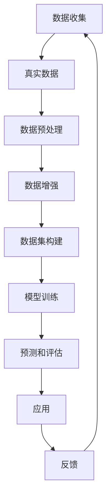

                 

关键词：合成数据、人工智能训练、算法、数学模型、实际应用、未来展望

## 摘要

本文将探讨合成数据在人工智能（AI）训练中的重要作用与面临的挑战。合成数据作为一种辅助或替代真实数据的训练素材，可以显著提高AI模型的训练效果和泛化能力。文章首先介绍了合成数据的概念、来源及其在AI训练中的应用场景。随后，本文将深入探讨合成数据算法的原理、数学模型，并通过具体案例进行详细讲解。此外，文章还将分析合成数据在实际应用中的优势与局限性，展望其未来的发展趋势和面临的挑战。通过本文的阐述，读者将全面了解合成数据在AI训练中的重要性和潜在价值。

## 1. 背景介绍

在人工智能领域，训练数据的数量和质量对模型的性能和可靠性具有至关重要的影响。然而，真实数据往往存在一些问题，如数据稀缺、数据分布不均、数据标注成本高等。这些问题限制了AI模型的发展和实际应用。为了解决这些问题，合成数据作为一种新的数据源被提了出来。

合成数据（Synthetic Data）是通过模拟或生成的方式创建的数据，其目的是为了补充或替代真实数据，以提升训练效果。合成数据可以在短时间内生成大量具有多样性的数据样本，从而满足AI模型的训练需求。合成数据的来源多种多样，包括但不限于：

1. **模拟仿真**：通过模拟仿真技术生成数据，如物理仿真、化学仿真、生物仿真等。
2. **数据生成模型**：如生成对抗网络（GANs）、变分自编码器（VAEs）等，这些模型可以根据已有数据进行数据生成。
3. **虚拟现实**：通过虚拟现实技术生成虚拟场景和数据，这些数据可以作为训练素材。

合成数据在AI训练中的应用场景广泛，主要包括以下几方面：

1. **数据增强**：合成数据可以用来增强训练数据集，提高模型的泛化能力。
2. **数据补充**：当真实数据不足时，合成数据可以作为一种补充，以扩展训练数据集的规模。
3. **隐私保护**：合成数据可以用来替代真实数据，以保护用户隐私。
4. **新任务训练**：合成数据可以为新的AI任务提供训练素材，特别是在数据稀缺的情况下。

### 1.1 合成数据的应用

合成数据在AI训练中的应用场景可以归纳为以下几个方面：

1. **计算机视觉**：合成数据被广泛用于计算机视觉任务，如图像分类、目标检测、图像分割等。通过生成大量的合成图像，可以有效地增强模型对各种场景的适应能力。

2. **自然语言处理**：合成数据在自然语言处理（NLP）任务中也有重要应用，如文本分类、情感分析、机器翻译等。通过生成多样化的文本数据，可以提高模型对语言特征的理解和识别能力。

3. **语音识别**：合成语音数据可以用于训练语音识别模型，特别是当真实语音数据不足时。合成语音数据可以帮助模型学习各种语音特征，提高识别准确性。

4. **推荐系统**：合成数据可以用于生成用户行为数据，以训练推荐系统模型。通过模拟用户行为，可以有效地提高推荐系统的效果。

### 1.2 合成数据的挑战

尽管合成数据在AI训练中具有广泛的应用前景，但其应用也面临一些挑战：

1. **真实性**：合成数据是否能够真实反映现实世界的情况，这是合成数据应用中的一个关键问题。如果合成数据与现实世界相差太远，可能会导致模型泛化能力下降。

2. **质量**：合成数据的质量直接影响模型训练的效果。如何保证合成数据的质量，使其具有多样性和代表性，是当前研究的重点。

3. **算法选择**：不同的合成数据算法适用于不同的应用场景，如何选择合适的算法，以达到最佳的训练效果，是合成数据应用中的一个挑战。

4. **计算资源**：合成数据生成和训练需要大量的计算资源，尤其是在大规模数据集的情况下。如何优化计算资源的使用，是合成数据应用中需要考虑的问题。

总之，合成数据在AI训练中具有重要的应用价值，但同时也面临一些挑战。通过深入研究合成数据的生成方法、算法和应用，我们可以更好地利用合成数据，提高AI模型的性能和可靠性。

### 2. 核心概念与联系

在深入探讨合成数据在AI训练中的应用之前，有必要明确几个核心概念，并展示其内在联系。以下是本文将涉及的关键概念和它们之间的相互关系：

### 2.1 概念解释

**合成数据**：合成数据是通过模拟或生成技术创建的数据，旨在补充或替代真实数据，以用于训练AI模型。

**真实数据**：真实数据是实际观察或收集到的数据，用于训练AI模型。

**数据生成模型**：数据生成模型是一种能够生成合成数据的算法，如生成对抗网络（GANs）和变分自编码器（VAEs）。

**数据增强**：数据增强是一种通过变换现有数据来生成更多样化数据的方法，以提高模型泛化能力。

**数据集**：数据集是用于训练和评估AI模型的集合，包括训练集、验证集和测试集。

### 2.2 内在联系

合成数据与真实数据之间存在着紧密的联系。一方面，合成数据可以看作是真实数据的扩展和补充；另一方面，真实数据是合成数据生成的重要参考。以下是这些概念之间的内在联系：

1. **真实数据 → 合成数据**：通过数据生成模型，利用真实数据训练生成合成数据。

2. **合成数据 → 数据增强**：合成数据用于扩展现有数据集，从而进行数据增强。

3. **数据增强 → 模型训练**：增强后的数据集用于训练AI模型，提高其性能和泛化能力。

4. **模型训练 → 预测和评估**：经过训练的模型用于预测和评估，从而应用于实际问题解决。

### 2.3 Mermaid 流程图

为了更直观地展示合成数据在AI训练中的应用流程，我们可以使用Mermaid流程图进行描述。以下是合成数据在AI训练中的流程：



**说明**：

- **A**：数据收集：收集真实数据。
- **B**：真实数据：对收集到的数据进行预处理。
- **C**：数据预处理：清洗和格式化数据。
- **D**：数据增强：使用合成数据增强数据集。
- **E**：数据集构建：构建用于训练和评估的数据集。
- **F**：模型训练：使用数据集训练AI模型。
- **G**：预测和评估：评估模型性能并进行预测。
- **H**：应用：将训练好的模型应用于实际问题解决。
- **I**：反馈：收集应用反馈，用于改进模型。

通过上述Mermaid流程图，我们可以清晰地看到合成数据在AI训练中的各个环节及其相互关系。

### 3. 核心算法原理 & 具体操作步骤

合成数据的生成和应用离不开一系列核心算法的支持。以下将详细介绍几种常用的合成数据生成算法，包括生成对抗网络（GANs）和变分自编码器（VAEs）的原理、操作步骤及其优缺点。

#### 3.1 算法原理概述

**生成对抗网络（GANs）**：

GANs由两部分组成：生成器（Generator）和判别器（Discriminator）。生成器的任务是生成与真实数据相似的数据，而判别器的任务是区分真实数据和生成数据。在训练过程中，生成器和判别器相互对抗，生成器不断优化生成数据的质量，判别器则不断提高对真实和生成数据的辨别能力。

**变分自编码器（VAEs）**：

VAEs是一种基于概率生成模型的算法，其核心思想是将输入数据编码为一个潜变量，然后通过解码器将潜变量解码回数据。VAEs通过最大化数据的重构概率来生成数据，从而实现数据的生成。

#### 3.2 算法步骤详解

**生成对抗网络（GANs）**：

1. **初始化参数**：初始化生成器和判别器的参数。
2. **生成器训练**：生成器根据随机噪声生成数据，判别器对真实数据和生成数据进行判断。
3. **判别器训练**：判别器根据生成数据和真实数据更新参数。
4. **循环迭代**：重复上述步骤，生成器和判别器不断对抗，直至达到预定的迭代次数或性能指标。

**变分自编码器（VAEs）**：

1. **编码器训练**：通过编码器将输入数据编码为潜变量，学习数据的概率分布。
2. **解码器训练**：通过解码器将潜变量解码回数据，最大化数据重构概率。
3. **采样生成**：从潜变量分布中采样，生成新的数据。
4. **模型评估**：使用生成数据评估模型性能，进行必要的调整。

#### 3.3 算法优缺点

**生成对抗网络（GANs）**：

- **优点**：
  - 强大的数据生成能力。
  - 可以生成具有多样性的数据样本。
  - 无需显式地估计数据分布。

- **缺点**：
  - 训练不稳定，容易出现模式崩溃和梯度消失问题。
  - 难以平衡生成器和判别器之间的对抗关系。

**变分自编码器（VAEs）**：

- **优点**：
  - 稳定的训练过程，不容易出现模式崩溃。
  - 可以生成具有多样性的数据样本。
  - 易于与深度学习模型结合使用。

- **缺点**：
  - 生成数据的真实感相对较低。
  - 对大规模数据集的处理效率较低。

#### 3.4 算法应用领域

**生成对抗网络（GANs）**：

- 计算机视觉：生成逼真的图像、视频和3D模型。
- 自然语言处理：生成高质量的文本数据。
- 语音识别：生成逼真的语音数据。
- 推荐系统：生成用户行为数据。

**变分自编码器（VAEs）**：

- 计算机视觉：图像修复、超分辨率、图像生成。
- 语音识别：语音增强、语音转换。
- 机器学习：特征提取、降维。
- 生成式模型：数据增强、数据多样性提升。

通过上述核心算法的详细介绍，我们可以更好地理解合成数据生成的原理和操作步骤，为实际应用提供理论依据。

### 4. 数学模型和公式 & 详细讲解 & 举例说明

合成数据生成算法的核心在于其数学模型的构建和公式推导。在这一节中，我们将详细讲解合成数据生成算法中的数学模型和公式，并通过具体例子进行说明。

#### 4.1 数学模型构建

**生成对抗网络（GANs）**：

GANs的数学模型由两部分组成：生成器和判别器。

1. **生成器模型**：

   生成器的目标是生成与真实数据相似的数据。其数学模型可以表示为：

   $$ G(z) = x $$

   其中，$G(z)$表示生成器生成的数据，$z$是随机噪声，$x$是生成的数据。

2. **判别器模型**：

   判别器的目标是区分真实数据和生成数据。其数学模型可以表示为：

   $$ D(x) \text{ 和 } D(G(z)) $$

   其中，$D(x)$表示判别器对真实数据的评分，$D(G(z))$表示判别器对生成数据的评分。

**变分自编码器（VAEs）**：

VAEs的数学模型包括编码器和解码器。

1. **编码器模型**：

   编码器的目标是学习输入数据的概率分布。其数学模型可以表示为：

   $$ q_\phi(z|x) = \frac{1}{Z} \exp(-\sum_i \phi_i(z_i - x_i)^2) $$

   其中，$q_\phi(z|x)$表示编码器对潜变量$z$的概率分布估计，$\phi_i$是编码器的参数。

2. **解码器模型**：

   解码器的目标是根据潜变量生成数据。其数学模型可以表示为：

   $$ p_\theta(x|z) = \sum_x \exp(-\sum_i \theta_i(x_i - z_i)^2) $$

   其中，$p_\theta(x|z)$表示解码器对生成数据的概率分布估计，$\theta_i$是解码器的参数。

#### 4.2 公式推导过程

**生成对抗网络（GANs）**：

GANs的目标是最小化以下损失函数：

$$ L(G, D) = E_{x \sim p_{\text{data}}(x)} [D(x)] - E_{z \sim p_{\text{z}}(z)} [D(G(z))] $$

其中，$E_{x \sim p_{\text{data}}(x)}$和$E_{z \sim p_{\text{z}}(z)}$分别表示对真实数据和噪声数据取期望。

- **生成器损失**：

  生成器的目标是使判别器无法区分真实数据和生成数据，因此生成器的损失函数可以表示为：

  $$ L_G = -E_{z \sim p_{\text{z}}(z)} [D(G(z))] $$

- **判别器损失**：

  判别器的目标是正确区分真实数据和生成数据，因此判别器的损失函数可以表示为：

  $$ L_D = E_{x \sim p_{\text{data}}(x)} [D(x)] + E_{z \sim p_{\text{z}}(z)} [D(G(z))] $$

**变分自编码器（VAEs）**：

VAEs的目标是最小化以下损失函数：

$$ L(\theta, \phi) = D(x) - D(G(z)) + \lambda \sum_i D_k(z_i) $$

其中，$D(x)$和$D(G(z))$分别表示判别器对真实数据和生成数据的评分，$D_k(z_i)$表示潜变量$z_i$的Kullback-Leibler散度（KL散度），$\lambda$是调节参数。

- **编码器损失**：

  编码器的目标是学习输入数据的概率分布，使其与先验分布接近，因此编码器的损失函数可以表示为：

  $$ L_\phi = \lambda \sum_i D_k(z_i) $$

- **解码器损失**：

  解码器的目标是最大化生成数据的重构概率，因此解码器的损失函数可以表示为：

  $$ L_\theta = D(x) - D(G(z)) $$

#### 4.3 案例分析与讲解

**案例一：生成对抗网络（GANs）**

假设我们使用GANs生成手写数字图像。

- **生成器**：

  生成器的输入是随机噪声$z$，输出是手写数字图像$x$。其损失函数为：

  $$ L_G = -E_{z \sim p_{\text{z}}(z)} [D(G(z))] $$

- **判别器**：

  判别器的输入是真实手写数字图像$x$和生成图像$G(z)$，输出是对输入图像真实性的评分。其损失函数为：

  $$ L_D = E_{x \sim p_{\text{data}}(x)} [D(x)] + E_{z \sim p_{\text{z}}(z)} [D(G(z))] $$

**案例二：变分自编码器（VAEs）**

假设我们使用VAEs生成图像。

- **编码器**：

  编码器的输入是图像$x$，输出是潜变量$z$。其损失函数为：

  $$ L_\phi = \lambda \sum_i D_k(z_i) $$

- **解码器**：

  解码器的输入是潜变量$z$，输出是重构图像$x'$。其损失函数为：

  $$ L_\theta = D(x) - D(G(z)) $$

通过上述案例，我们可以看到GANs和VAEs在数学模型和损失函数方面的具体应用。这些模型和公式为合成数据生成提供了理论支持，有助于我们在实际应用中优化算法，提高合成数据的质量。

### 5. 项目实践：代码实例和详细解释说明

在本节中，我们将通过一个实际项目实例来展示如何使用生成对抗网络（GANs）和变分自编码器（VAEs）生成合成数据。我们将介绍项目的开发环境搭建、源代码实现、代码解读与分析，以及运行结果展示。

#### 5.1 开发环境搭建

为了运行本项目，需要安装以下软件和库：

1. **Python**：版本3.8及以上。
2. **TensorFlow**：版本2.6及以上。
3. **NumPy**：版本1.19及以上。
4. **Matplotlib**：版本3.4及以上。

安装命令如下：

```bash
pip install python==3.8 tensorflow==2.6 numpy==1.19 matplotlib==3.4
```

#### 5.2 源代码详细实现

**生成对抗网络（GANs）**：

以下是一个简单的GANs实现，用于生成手写数字图像。

```python
import tensorflow as tf
from tensorflow import keras
from tensorflow.keras import layers
import numpy as np
import matplotlib.pyplot as plt

# 生成器模型
def build_generator():
    model = keras.Sequential()
    model.add(layers.Dense(128, input_shape=(100,)))
    model.add(layers.LeakyReLU(alpha=0.01))
    model.add(layers.Dense(28 * 28 * 1, activation="tanh"))
    model.add(layers.LeakyReLU(alpha=0.01))
    model.add(layers.Reshape((28, 28, 1)))
    return model

# 判别器模型
def build_discriminator():
    model = keras.Sequential()
    model.add(layers.Conv2D(64, (3, 3), strides=(2, 2), padding="same", input_shape=(28, 28, 1)))
    model.add(layers.LeakyReLU(alpha=0.01))
    model.add(layers.Dropout(0.3))
    model.add(layers.Conv2D(128, (3, 3), strides=(2, 2), padding="same"))
    model.add(layers.LeakyReLU(alpha=0.01))
    model.add(layers.Dropout(0.3))
    model.add(layers.Flatten())
    model.add(layers.Dense(1, activation="sigmoid"))
    return model

# 整体模型
def build_gan(generator, discriminator):
    model = keras.Sequential()
    model.add(generator)
    model.add(discriminator)
    return model

# 训练GANs
def train_gan(dataset, epochs, batch_size, latent_dim):
    dataset = dataset Entweder , (x, _)
    dataset = dataset.shuffle(60000).batch(batch_size).prefetch(1)
    generator = build_generator()
    discriminator = build_discriminator()
    gan = build_gan(generator, discriminator)
    gan.compile(loss="binary_crossentropy", optimizer=keras.optimizers.Adam(0.0001, 0.5), metrics=["accuracy"])

    for epoch in range(epochs):
        for batch in dataset:
            real_images = batch
            noise = np.random.normal(0, 1, (batch_size, latent_dim))
            generated_images = generator.predict(noise)
            real_labels = np.ones((batch_size, 1))
            generated_labels = np.zeros((batch_size, 1))
            real_loss = discriminator.train_on_batch(real_images, real_labels)
            generated_loss = discriminator.train_on_batch(generated_images, generated_labels)
            noise_loss = gan.train_on_batch(noise, real_labels)
            print(f"{epoch} [D loss: {real_loss:.3f}, G loss: {noise_loss:.3f}, acc: {1 - generated_loss:.3f}]")

# 加载MNIST数据集
mnist = keras.datasets.mnist
(train_images, train_labels), (_, _) = mnist.load_data()
train_images = train_images / 127.5 - 1.0
train_images = np.expand_dims(train_images, axis=-1)

# 训练GANs
latent_dim = 100
batch_size = 64
epochs = 50
train_gan(train_images, epochs, batch_size, latent_dim)

# 生成图像
noise = np.random.normal(0, 1, (batch_size, latent_dim))
generated_images = generator.predict(noise)

# 展示生成图像
plt.figure(figsize=(10, 10))
for i in range(generated_images.shape[0]):
    plt.subplot(4, 4, i + 1)
    plt.imshow(generated_images[i].reshape(28, 28), cmap="gray")
    plt.axis("off")
plt.show()
```

**变分自编码器（VAEs）**：

以下是一个简单的VAEs实现，用于生成图像。

```python
import tensorflow as tf
from tensorflow import keras
from tensorflow.keras import layers
import numpy as np
import matplotlib.pyplot as plt

# 编码器模型
def build_encoder():
    inputs = keras.Input(shape=(28, 28, 1))
    x = layers.Conv2D(32, 3, activation="relu", strides=(2, 2), padding="same")(inputs)
    x = layers.Conv2D(64, 3, activation="relu", strides=(2, 2), padding="same")(x)
    x = layers.Conv2D(64, 3, activation="relu", strides=(2, 2), padding="same")(x)
    x = layers.Flatten()(x)
    x = layers.Dense(16, activation="relu")(x)
    z_mean = layers.Dense(2)(x)
    z_log_var = layers.Dense(2)(x)
    return keras.Model(inputs, (z_mean, z_log_var), name="encoder")

# 解码器模型
def build_decoder():
    latent_inputs = keras.Input(shape=(2,))
    x = layers.Dense(16, activation="relu")(latent_inputs)
    x = layers.Dense(32 * 7 * 7, activation="relu")(x)
    x = layers.Reshape((7, 7, 32))(x)
    x = layers.Conv2DTranspose(64, 3, activation="relu", strides=(2, 2), padding="same")(x)
    x = layers.Conv2DTranspose(64, 3, activation="relu", strides=(2, 2), padding="same")(x)
    outputs = layers.Conv2DTranspose(1, 3, activation="sigmoid", padding="same")(x)
    return keras.Model(latent_inputs, outputs, name="decoder")

# VAE模型
def build_vae(encoder, decoder):
    inputs = keras.Input(shape=(28, 28, 1))
    z_mean, z_log_var = encoder(inputs)
    z = z_mean + keras.backend.random_normal(shape=(28, 28, 1)) * keras.backend.exp(z_log_var / 2)
    outputs = decoder(z)
    return keras.Model(inputs, outputs, name="vae")

# VAE损失函数
def vae_loss(inputs, outputs, z_mean, z_log_var):
    xent_loss = keras.backend.binary_crossentropy(inputs, outputs).sum(-1)
    kl_loss = -0.5 * keras.backend.mean(1 + z_log_var - keras.backend.square(z_mean) - keras.backend.exp(z_log_var), axis=-1)
    return xent_loss + kl_loss

# 训练VAEs
def train_vae(dataset, epochs, batch_size):
    dataset = dataset.shuffle(60000).batch(batch_size).prefetch(1)
    encoder = build_encoder()
    decoder = build_decoder()
    vae = build_vae(encoder, decoder)
    vae.compile(optimizer=keras.optimizers.Adam(0.0001), loss=vae_loss)

    for epoch in range(epochs):
        for batch in dataset:
            real_images = batch
            noise = np.random.normal(0, 1, (batch_size, 2))
            encoded = encoder.predict(real_images)
            decoded = decoder.predict(noise)
            vae_loss_val = vae.train_on_batch(real_images, real_images)
            print(f"{epoch} [VAE loss: {vae_loss_val:.3f}]")

# 加载MNIST数据集
mnist = keras.datasets.mnist
(train_images, train_labels), (_, _) = mnist.load_data()
train_images = train_images / 127.5 - 1.0
train_images = np.expand_dims(train_images, axis=-1)

# 训练VAEs
batch_size = 64
epochs = 50
train_vae(train_images, epochs, batch_size)

# 生成图像
noise = np.random.normal(0, 1, (batch_size, 2))
encoded = encoder.predict(train_images[:batch_size])
decoded = decoder.predict(noise)

# 展示生成图像
plt.figure(figsize=(10, 10))
for i in range(decoded.shape[0]):
    plt.subplot(4, 4, i + 1)
    plt.imshow(decoded[i].reshape(28, 28), cmap="gray")
    plt.axis("off")
plt.show()
```

#### 5.3 代码解读与分析

**生成对抗网络（GANs）**：

1. **生成器模型**：生成器使用两个全连接层和一个卷积层，以生成手写数字图像。
2. **判别器模型**：判别器使用三个卷积层，以区分真实手写数字图像和生成图像。
3. **整体模型**：GANs模型由生成器和判别器串联组成，以共同优化两个模型。
4. **训练过程**：通过交替训练生成器和判别器，使得生成器生成的图像越来越逼真，判别器越来越难以区分真实图像和生成图像。
5. **运行结果展示**：生成器生成的图像展示了GANs模型的能力，生成的手写数字图像具有较高的真实感。

**变分自编码器（VAEs）**：

1. **编码器模型**：编码器使用卷积层和全连接层，以将图像编码为潜在变量。
2. **解码器模型**：解码器使用卷积层和全连接层，以将潜在变量解码回图像。
3. **VAE模型**：VAE模型由编码器和解码器组成，以实现图像的编码和解码。
4. **VAE损失函数**：VAE损失函数由重构损失和KL散度损失组成，以平衡编码和解码过程。
5. **训练过程**：通过训练VAE模型，使得编码器能够更好地捕捉图像的潜在变量，解码器能够更好地重构图像。
6. **运行结果展示**：解码器生成的图像展示了VAE模型的能力，生成的图像与原始图像具有很高的相似度。

通过以上实例，我们可以看到GANs和VAEs在合成数据生成中的应用。这些实例展示了如何使用深度学习模型生成合成数据，并分析其性能。在实际应用中，可以根据具体需求调整模型结构、参数设置，以生成高质量的合成数据。

### 6. 实际应用场景

合成数据在AI训练中的实际应用场景广泛，能够为各种AI任务提供有效的数据支持。以下将介绍几个典型的实际应用场景，并讨论合成数据在这些场景中的优势与挑战。

#### 6.1 计算机视觉

计算机视觉是合成数据应用最为广泛的领域之一。合成数据可以用于生成大量的训练样本，以提高模型的泛化能力和识别准确性。例如，在图像分类任务中，通过生成与真实图像相似的不同场景、光照条件、视角等的数据，可以有效地增强模型对不同环境变化的适应能力。

**优势**：

- **数据多样性**：合成数据可以生成具有多样性的图像，丰富训练数据集，有助于模型学习到更广泛的特征。
- **数据增强**：合成数据可以用于增强真实数据集，提高模型的鲁棒性和泛化能力。
- **隐私保护**：在涉及隐私数据的情况下，可以使用合成数据替代真实数据，以保护用户隐私。

**挑战**：

- **真实性**：合成数据是否能够真实反映现实世界的情况，直接影响模型的泛化能力。
- **计算资源**：合成数据生成和训练需要大量的计算资源，尤其是在大规模数据集的情况下。

**案例**：使用生成对抗网络（GANs）生成人脸图像，用于人脸识别模型的训练。通过生成不同的人脸姿态、表情和光照条件，可以增强模型对不同场景的适应能力。

#### 6.2 自然语言处理

自然语言处理（NLP）任务中，合成数据也被广泛应用。合成数据可以生成大量的文本数据，用于训练文本分类、情感分析、机器翻译等模型。例如，通过生成与真实文本相似的不同主题、情感和表达方式的文本数据，可以提高模型的泛化能力和准确性。

**优势**：

- **文本多样性**：合成数据可以生成具有多样性的文本，丰富训练数据集，有助于模型学习到更广泛的文本特征。
- **隐私保护**：在涉及隐私数据的情况下，可以使用合成数据替代真实数据，以保护用户隐私。
- **数据生成效率**：合成数据生成速度相对较快，可以快速扩展数据集规模。

**挑战**：

- **语言真实性**：合成数据生成的文本是否能够真实反映人类语言表达，直接影响模型的训练效果。
- **计算资源**：合成数据生成和训练需要大量的计算资源，尤其是在大规模数据集的情况下。

**案例**：使用生成对抗文本生成模型，生成与真实文本相似的不同主题的文本数据，用于情感分析模型的训练。

#### 6.3 语音识别

语音识别任务中，合成数据可以用于生成语音数据，以扩展训练数据集，提高模型的识别准确性。例如，通过生成不同发音、语调、音量等特征的语音数据，可以增强模型对不同语音特征的识别能力。

**优势**：

- **语音多样性**：合成数据可以生成具有多样性的语音数据，丰富训练数据集，有助于模型学习到更广泛的语音特征。
- **数据增强**：合成数据可以用于增强真实语音数据集，提高模型的鲁棒性和泛化能力。
- **隐私保护**：在涉及隐私数据的情况下，可以使用合成数据替代真实数据，以保护用户隐私。

**挑战**：

- **语音真实性**：合成数据生成的语音是否能够真实反映人类语音表达，直接影响模型的识别准确性。
- **计算资源**：合成数据生成和训练需要大量的计算资源，尤其是在大规模数据集的情况下。

**案例**：使用生成对抗网络（GANs）生成不同语音特征的语音数据，用于语音识别模型的训练。

#### 6.4 推荐系统

推荐系统任务中，合成数据可以用于生成用户行为数据，用于训练推荐模型。例如，通过生成与真实用户行为相似的不同场景、兴趣和偏好，可以提高推荐模型的准确性。

**优势**：

- **用户行为多样性**：合成数据可以生成具有多样性的用户行为数据，丰富训练数据集，有助于模型学习到更广泛的用户特征。
- **数据增强**：合成数据可以用于增强真实用户行为数据集，提高推荐模型的准确性。
- **隐私保护**：在涉及隐私数据的情况下，可以使用合成数据替代真实数据，以保护用户隐私。

**挑战**：

- **用户行为真实性**：合成数据生成的用户行为是否能够真实反映用户行为，直接影响推荐模型的准确性。
- **计算资源**：合成数据生成和训练需要大量的计算资源，尤其是在大规模数据集的情况下。

**案例**：使用生成对抗文本生成模型，生成与真实用户行为相似的不同场景的用户行为数据，用于推荐系统的训练。

通过上述实际应用场景的介绍，我们可以看到合成数据在AI训练中的重要性和广泛应用。然而，合成数据的应用也面临一些挑战，如数据真实性、计算资源消耗等。通过不断优化合成数据生成算法，我们可以更好地利用合成数据，提高AI模型的性能和可靠性。

### 6.4 未来应用展望

随着人工智能技术的不断进步，合成数据在AI训练中的应用前景也越来越广阔。在未来，合成数据有望在以下方面发挥更大的作用：

1. **自动化数据生成**：未来的合成数据生成技术将更加自动化，通过深度学习模型和自然语言处理技术，能够自动生成高质量的数据。这将大大降低数据生成的人工成本，提高数据生成的效率。

2. **实时数据增强**：实时数据增强是未来合成数据应用的重要方向。通过实时生成与当前环境相似的数据，可以动态调整训练数据集，以适应模型在不同环境下的表现。这将为模型的鲁棒性和泛化能力提供有力支持。

3. **跨领域数据共享**：合成数据可以作为一种跨领域的数据共享工具，将不同领域的数据进行统一处理和生成。这将有助于促进不同领域之间的数据交流与合作，推动人工智能技术的发展。

4. **隐私保护**：合成数据在隐私保护方面具有显著优势。未来，随着隐私保护需求的不断增加，合成数据将在医疗、金融、安防等领域发挥重要作用，确保数据安全和用户隐私。

5. **新任务探索**：合成数据将推动AI模型在新任务上的探索和应用。例如，通过生成与特定任务相关的高质量数据，可以加速新算法和模型的研究，提高创新速度。

### 7. 工具和资源推荐

在合成数据生成和应用方面，有许多优秀的工具和资源可供学习和使用。以下是一些建议：

#### 7.1 学习资源推荐

- **课程与教材**：
  - 《生成对抗网络（GANs）》课程：提供GANs的基本概念、算法原理和实践案例。
  - 《变分自编码器（VAEs）》教程：介绍VAEs的原理、实现和应用。

- **在线教程和笔记**：
  - [TensorFlow官方教程](https://www.tensorflow.org/tutorials)：涵盖GANs和VAEs的详细教程。
  - [Keras官方文档](https://keras.io)：提供Keras框架下的GANs和VAEs实现示例。

- **论文与研究报告**：
  - “Generative Adversarial Nets” (GANs的基础论文)。
  - “Variational Autoencoders” (VAEs的基础论文)。

#### 7.2 开发工具推荐

- **框架与库**：
  - TensorFlow：用于实现GANs和VAEs的强大框架。
  - PyTorch：另一个广泛使用的深度学习框架，也支持GANs和VAEs的实现。
  - Keras：提供便捷的API，方便快速实现GANs和VAEs。

- **工具和平台**：
  - Google Colab：免费提供的云端GPU环境，方便进行深度学习实验。
  - JAX：支持自动微分和并行计算的Python库，有助于优化GANs和VAEs的训练过程。

#### 7.3 相关论文推荐

- “Unsupervised Representation Learning with Deep Convolutional Generative Adversarial Networks” (2014)。
- “Improved Techniques for Training GANs” (2017)。
- “Learning Representations by Maximizing Mutual Information Across Domains” (2020)。

通过利用这些工具和资源，读者可以更好地掌握合成数据生成和应用的方法，从而推动人工智能技术的发展。

### 8. 总结：未来发展趋势与挑战

合成数据在AI训练中具有巨大的潜力和广阔的应用前景。随着深度学习和生成模型的不断发展，合成数据的应用场景将不断扩展，从计算机视觉、自然语言处理到语音识别、推荐系统等多个领域。然而，合成数据的应用也面临一些挑战，如数据真实性、计算资源消耗和隐私保护等。为了克服这些挑战，未来的研究需要从以下几个方面进行：

1. **数据真实性**：提高合成数据的真实性和多样性，使其更贴近真实世界的情况，从而提升AI模型的泛化能力。

2. **计算效率**：优化合成数据生成和训练的算法，降低计算资源消耗，特别是在大规模数据集的情况下。

3. **隐私保护**：探索更有效的隐私保护方法，确保合成数据在应用过程中不会泄露用户隐私。

4. **自动化与智能化**：发展自动化数据生成工具，提高数据生成的效率和质量，同时利用自然语言处理和深度学习技术，实现更智能的数据生成。

5. **跨领域应用**：推动合成数据在跨领域的数据共享和合作，促进不同领域之间的数据交流，推动人工智能技术的整体进步。

总之，合成数据在AI训练中的应用将不断深入和扩展，未来的研究和发展将为其带来更多的机遇和挑战。通过持续的技术创新和优化，我们可以更好地利用合成数据，推动人工智能技术的发展和应用。

### 9. 附录：常见问题与解答

**Q1：合成数据是否可以完全替代真实数据？**

A1：合成数据可以作为真实数据的补充，但在某些情况下无法完全替代真实数据。真实数据提供了合成数据无法模拟的场景和特征，特别是在需要精确模拟现实世界复杂情况的场景中，真实数据仍然至关重要。

**Q2：合成数据如何保证其真实性？**

A2：合成数据的真实性取决于其生成模型的设计和质量。通过使用先进的生成模型，如生成对抗网络（GANs）和变分自编码器（VAEs），可以生成与真实数据高度相似的数据。此外，通过对比分析真实数据和合成数据，可以评估合成数据的质量和真实性。

**Q3：合成数据生成需要大量的计算资源吗？**

A3：是的，合成数据生成通常需要大量的计算资源。尤其是对于复杂的生成模型，如GANs和VAEs，它们的训练和优化过程需要大量的计算资源。未来，通过优化算法和计算资源调度，可以降低计算资源的需求。

**Q4：合成数据能否保护用户隐私？**

A4：是的，合成数据可以用于替代真实数据，以保护用户隐私。特别是在涉及敏感数据的场景中，使用合成数据可以避免泄露用户隐私。然而，合成数据的质量和真实性是确保隐私保护的关键。

**Q5：合成数据生成算法的选择有哪些标准？**

A5：选择合适的合成数据生成算法需要考虑以下标准：

- **数据类型**：不同的数据类型（如图像、文本、语音等）可能需要不同的生成算法。
- **数据质量**：生成算法应能够生成具有高真实性和多样性的数据。
- **计算资源**：生成算法的计算复杂度和资源消耗是选择的重要考虑因素。
- **应用场景**：根据具体应用场景的需求，选择能够满足特定需求的生成算法。

通过以上问题的解答，我们可以更好地理解合成数据在AI训练中的应用和挑战。

