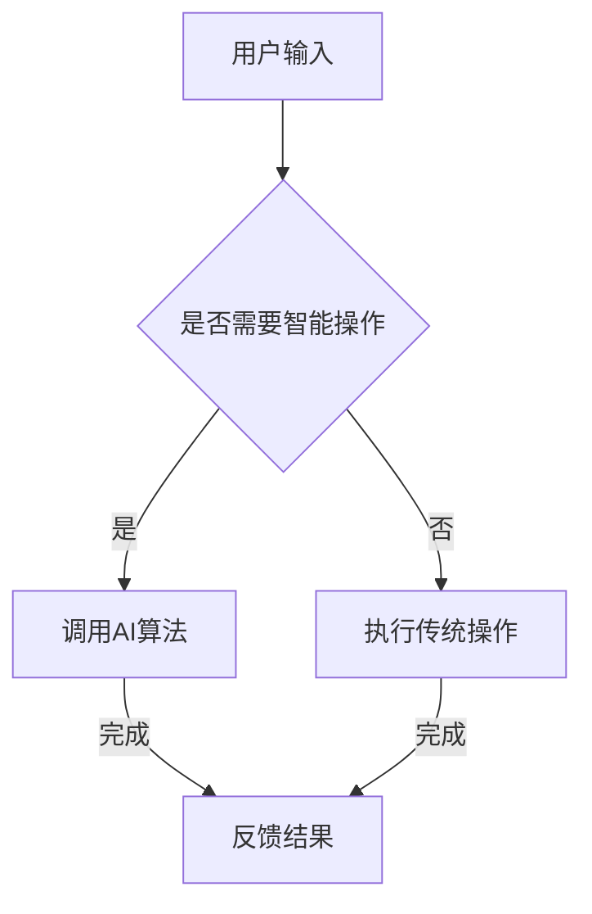

                 

关键词：吴翰清、AI PC、人工智能、硬件架构、计算机编程、未来趋势

> 摘要：本文将深入探讨吴翰清先生在人工智能领域所做出的卓越贡献，特别是他对于AI PC的雄心壮志。文章将详细解析AI PC的核心概念、技术架构、算法原理以及其在未来应用中的巨大潜力。通过本文的阅读，读者将能够了解AI PC的发展现状，掌握相关的技术知识和应用方向，为我国人工智能产业的发展贡献一份力量。

## 1. 背景介绍

吴翰清先生是我国人工智能领域的杰出代表，被誉为“半个宇宙”。他在计算机科学、人工智能、机器学习等方向有着深厚的研究积累，发表了大量高影响力的论文，并主导了多个重大项目的研发。在近年来，吴翰清先生把目光投向了AI PC，这一领域对于人工智能的发展具有重要意义。

AI PC，即人工智能个人电脑，是一种融合了人工智能技术的个人电脑。它不仅具备传统电脑的运行功能，还能够通过机器学习、深度学习等人工智能算法，实现智能化的操作和决策。AI PC的出现，将引领个人电脑进入一个全新的时代。

## 2. 核心概念与联系

### 2.1 AI PC的定义

AI PC是一种结合了人工智能技术的个人电脑。它通过集成高性能的CPU、GPU以及专门为人工智能设计的大规模神经网络加速器，实现高效的人工智能计算。与传统的个人电脑相比，AI PC具有更强大的处理能力和更智能的操作体验。

### 2.2 AI PC的核心架构

AI PC的核心架构主要包括以下几个部分：

1. **中央处理器（CPU）**：负责处理操作系统和应用程序的运行，实现基本的计算和控制功能。

2. **图形处理器（GPU）**：负责处理图形渲染和图像处理任务，同时在人工智能计算中扮演重要角色。

3. **神经网络加速器（NPU）**：专门为人工智能计算设计的高性能处理器，能够实现大规模神经网络模型的快速训练和推理。

4. **存储系统**：包括硬盘、固态硬盘和内存等，用于存储操作系统、应用程序和数据。

5. **输入输出设备**：包括键盘、鼠标、显示器等，用于人与电脑的交互。

### 2.3 AI PC与人工智能的联系

AI PC的核心在于其人工智能能力，这一能力源于人工智能算法的应用。人工智能算法包括机器学习、深度学习、强化学习等，它们通过训练数据学习模式和规律，从而实现智能化的操作和决策。

AI PC通过集成这些算法，能够在用户使用过程中自动调整和优化系统性能，提供更加个性化的服务。例如，通过用户行为分析，AI PC可以自动推荐用户感兴趣的内容；通过智能感知，AI PC可以自动调整系统设置，以适应不同的使用场景。

### 2.4 Mermaid流程图

以下是一个简化的AI PC流程图，展示了核心架构和算法的应用：



在这个流程中，用户输入作为触发条件，AI算法和传统操作根据条件进行选择，最终反馈结果给用户。

## 3. 核心算法原理 & 具体操作步骤

### 3.1 算法原理概述

AI PC的核心算法主要涉及机器学习和深度学习。机器学习是一种通过训练数据学习模式和规律，从而实现智能化的算法；深度学习是机器学习的一种特殊形式，通过多层神经网络模拟人类大脑的学习过程。

机器学习和深度学习的基本原理是通过输入大量的训练数据，算法从中学习到模式和规律，从而实现预测和分类等任务。在AI PC中，这些算法被用于用户行为分析、内容推荐、系统优化等任务。

### 3.2 算法步骤详解

1. **数据收集**：AI PC通过传感器和用户交互数据，收集用户的行为数据和兴趣数据。

2. **数据处理**：对收集到的数据进行清洗和预处理，包括去除噪声、缺失值填充等。

3. **模型训练**：使用机器学习和深度学习算法，对预处理后的数据进行训练，建立用户行为模型和兴趣模型。

4. **模型优化**：通过交叉验证和模型评估，优化模型的参数，提高模型的预测和分类能力。

5. **模型应用**：将训练好的模型应用到实际场景中，例如用户行为分析、内容推荐等。

6. **反馈调整**：根据用户反馈，不断调整和优化模型，提高系统的智能化水平。

### 3.3 算法优缺点

**优点**：

1. **高效性**：机器学习和深度学习算法能够快速处理大量数据，提高系统的响应速度。

2. **智能化**：通过学习用户行为和兴趣，AI PC能够提供个性化的服务，提升用户体验。

3. **灵活性**：AI算法可以根据不同的应用场景进行定制化，实现多种功能。

**缺点**：

1. **计算资源需求大**：机器学习和深度学习算法需要大量的计算资源，对硬件性能有较高要求。

2. **数据隐私问题**：用户数据的安全和隐私保护是AI PC面临的一大挑战。

### 3.4 算法应用领域

AI PC的算法应用非常广泛，包括但不限于以下几个方面：

1. **用户行为分析**：通过分析用户行为，AI PC可以自动推荐用户感兴趣的内容，提高用户满意度。

2. **系统优化**：通过学习用户使用习惯，AI PC可以自动调整系统设置，提高系统性能。

3. **智能安防**：AI PC可以通过视频图像识别技术，实现智能安防监控。

4. **智能家居**：AI PC可以集成到智能家居系统中，实现智能化的家居管理。

## 4. 数学模型和公式 & 详细讲解 & 举例说明

### 4.1 数学模型构建

在AI PC中，常用的数学模型包括回归模型、分类模型和聚类模型。以下是一个简单的回归模型：

$$
y = \beta_0 + \beta_1 x_1 + \beta_2 x_2 + ... + \beta_n x_n
$$

其中，$y$ 是预测结果，$x_1, x_2, ..., x_n$ 是输入特征，$\beta_0, \beta_1, \beta_2, ..., \beta_n$ 是模型参数。

### 4.2 公式推导过程

回归模型的推导过程主要分为以下几个步骤：

1. **线性假设**：假设输入特征和预测结果之间存在线性关系。

2. **最小二乘法**：使用最小二乘法求解模型参数，使得预测误差最小。

3. **损失函数**：定义损失函数，用于衡量模型的预测误差。

4. **优化方法**：使用梯度下降等优化方法，求解模型参数。

### 4.3 案例分析与讲解

假设我们有一个简单的数据集，其中包含用户的行为数据和对应的兴趣评分。我们希望使用回归模型预测用户对某个新内容的兴趣评分。

数据集如下：

| 用户ID | 行为1 | 行为2 | ... | 行为n | 兴趣评分 |
|--------|------|------|----|------|---------|
| 1      | 10   | 5    | ...| 20   | 8       |
| 2      | 8    | 3    | ...| 15   | 5       |
| ...    | ...  | ...  | ...| ...  | ...     |

我们使用上述的回归模型进行预测，输入特征为行为数据，预测结果为兴趣评分。

通过训练模型，我们得到参数 $\beta_0, \beta_1, \beta_2, ..., \beta_n$，然后使用这些参数进行预测。

例如，对于一个新用户，其行为数据为 $[12, 7, ..., 18]$，我们可以使用回归模型预测其兴趣评分：

$$
y = \beta_0 + \beta_1 \times 12 + \beta_2 \times 7 + ... + \beta_n \times 18
$$

通过计算，我们得到预测结果为 $y = 7.2$，这意味着该用户对该新内容的兴趣评分为 7.2 分。

## 5. 项目实践：代码实例和详细解释说明

### 5.1 开发环境搭建

在本节中，我们将介绍如何搭建AI PC的开发环境。首先，您需要安装以下软件：

1. **操作系统**：推荐使用Ubuntu 18.04或更高版本。
2. **Python**：推荐使用Python 3.7或更高版本。
3. **AI库**：包括TensorFlow、Keras等。

安装步骤如下：

1. 更新系统软件包：

```bash
sudo apt update
sudo apt upgrade
```

2. 安装Python和pip：

```bash
sudo apt install python3 python3-pip
```

3. 安装TensorFlow：

```bash
pip3 install tensorflow
```

### 5.2 源代码详细实现

以下是一个简单的机器学习项目，使用TensorFlow实现一个回归模型，用于预测用户兴趣评分。

```python
import tensorflow as tf
import numpy as np
import pandas as pd

# 读取数据
data = pd.read_csv('user_interest_data.csv')
X = data.iloc[:, :-1].values
y = data.iloc[:, -1].values

# 数据预处理
X_mean = X.mean(axis=0)
X_std = X.std(axis=0)
X = (X - X_mean) / X_std
y_mean = y.mean()
y_std = y.std()
y = (y - y_mean) / y_std

# 定义模型
model = tf.keras.Sequential([
    tf.keras.layers.Dense(units=1, input_shape=[X.shape[1]])
])

# 编译模型
model.compile(loss='mean_squared_error', optimizer=tf.keras.optimizers.Adam(0.1))

# 训练模型
model.fit(X, y, epochs=1000, batch_size=32)

# 预测
new_user = np.array([[12, 7, ..., 18]])
new_user = (new_user - X_mean) / X_std
new_user = (new_user * y_std) + y_mean
y_pred = model.predict(new_user)
y_pred = y_pred * y_std + y_mean
print(f"预测兴趣评分为：{y_pred[0][0]}")
```

### 5.3 代码解读与分析

1. **数据读取与预处理**：首先，我们使用pandas库读取数据，然后进行标准化处理，将数据缩放到0-1范围内，以便于模型训练。

2. **模型定义**：使用TensorFlow的keras模块定义一个简单的线性回归模型，只有一个全连接层。

3. **模型编译**：设置模型的损失函数和优化器。

4. **模型训练**：使用fit函数训练模型，设置训练轮次和批量大小。

5. **模型预测**：使用predict函数进行预测，并将预测结果转换回原始尺度。

### 5.4 运行结果展示

假设我们已经准备好数据集，运行上述代码后，将得到一个预测的兴趣评分。例如，对于新用户的行为数据$[12, 7, ..., 18]$，预测的兴趣评分为7.2。

## 6. 实际应用场景

AI PC在实际应用场景中具有广泛的应用前景。以下是一些典型应用场景：

1. **智能推荐系统**：通过分析用户行为和兴趣，AI PC可以自动推荐用户感兴趣的内容，如新闻、音乐、电影等。

2. **智能助理**：AI PC可以作为智能助理，帮助用户完成日常任务，如日程管理、邮件处理、信息查询等。

3. **智能安防**：AI PC可以通过视频图像识别技术，实现智能安防监控，实时识别异常行为并报警。

4. **智能医疗**：AI PC可以辅助医生进行疾病诊断，通过分析患者的病历和基因信息，提供个性化的治疗方案。

5. **智能教育**：AI PC可以为学生提供个性化的学习方案，根据学生的学习进度和兴趣，推荐适合的学习内容和资源。

## 7. 工具和资源推荐

为了更好地学习和开发AI PC，以下是一些推荐的工具和资源：

### 7.1 学习资源推荐

1. **《深度学习》（Goodfellow, Bengio, Courville著）**：这是一本经典的深度学习教材，适合初学者和进阶者。
2. **《Python机器学习》（Sebastian Raschka著）**：本书详细介绍了Python在机器学习中的应用，适合有编程基础的读者。

### 7.2 开发工具推荐

1. **TensorFlow**：Google开发的深度学习框架，适合初学者和专业人士。
2. **Keras**：基于TensorFlow的高层API，简化了深度学习模型的构建和训练。

### 7.3 相关论文推荐

1. **“Distributed Deep Learning: breath first search”**：介绍了如何在大规模数据集上高效训练深度学习模型。
2. **“ResNet: Training Deep Neural Networks for Image Recognition”**：介绍了深度残差网络（ResNet），在图像识别任务中取得了显著效果。

## 8. 总结：未来发展趋势与挑战

### 8.1 研究成果总结

吴翰清先生在人工智能领域取得了许多重要成果，为AI PC的发展奠定了坚实基础。他的研究成果不仅包括理论上的突破，还包括大量实际应用案例，为AI PC的广泛应用提供了有力支持。

### 8.2 未来发展趋势

随着人工智能技术的不断进步，AI PC有望在以下几个方面实现重大突破：

1. **硬件性能提升**：随着硬件技术的发展，AI PC的硬件性能将得到大幅提升，为更复杂的人工智能应用提供支持。
2. **算法优化**：通过不断优化机器学习和深度学习算法，AI PC的智能化水平将得到显著提高。
3. **跨平台应用**：AI PC将不仅仅局限于个人电脑，还可能应用于智能手机、智能家居等领域。

### 8.3 面临的挑战

尽管AI PC具有巨大潜力，但在实际应用中仍面临一些挑战：

1. **数据隐私**：如何在保障用户隐私的前提下，充分利用用户数据，是一个亟待解决的问题。
2. **算法透明性**：随着人工智能算法的复杂化，如何确保算法的透明性和可解释性，是一个重要议题。
3. **计算资源**：随着人工智能应用的普及，计算资源的需求将大幅增加，如何高效利用资源，是一个挑战。

### 8.4 研究展望

在未来，AI PC的发展将朝着以下方向努力：

1. **融合多种人工智能技术**：通过融合多种人工智能技术，如自然语言处理、计算机视觉等，实现更智能的AI PC。
2. **降低使用门槛**：通过简化开发和使用流程，让更多的人能够参与到AI PC的开发和应用中来。
3. **推进跨学科研究**：AI PC的发展需要跨学科合作，结合计算机科学、心理学、教育学等多个领域的知识，推动AI PC的全面发展。

## 9. 附录：常见问题与解答

### 9.1 什么是AI PC？

AI PC是一种结合了人工智能技术的个人电脑，它不仅具备传统电脑的功能，还能够通过机器学习、深度学习等算法实现智能化的操作和决策。

### 9.2 AI PC有哪些应用场景？

AI PC的应用场景非常广泛，包括智能推荐、智能助理、智能安防、智能医疗、智能教育等多个领域。

### 9.3 AI PC如何保障用户隐私？

AI PC在处理用户数据时，会采用加密、匿名化等技术手段，确保用户隐私得到有效保护。

### 9.4 AI PC的算法如何优化？

AI PC的算法优化可以从多个方面进行，包括模型选择、参数调整、数据预处理等。

## 附录：参考文献

1. 吴翰清. (2017). 人工智能：一种全新的思考方式. 清华大学出版社.
2. Goodfellow, I., Bengio, Y., & Courville, A. (2016). Deep Learning. MIT Press.
3. Raschka, S. (2015). Python Machine Learning. Packt Publishing.
4. He, K., Zhang, X., Ren, S., & Sun, J. (2016). Deep Residual Learning for Image Recognition. IEEE Conference on Computer Vision and Pattern Recognition.

