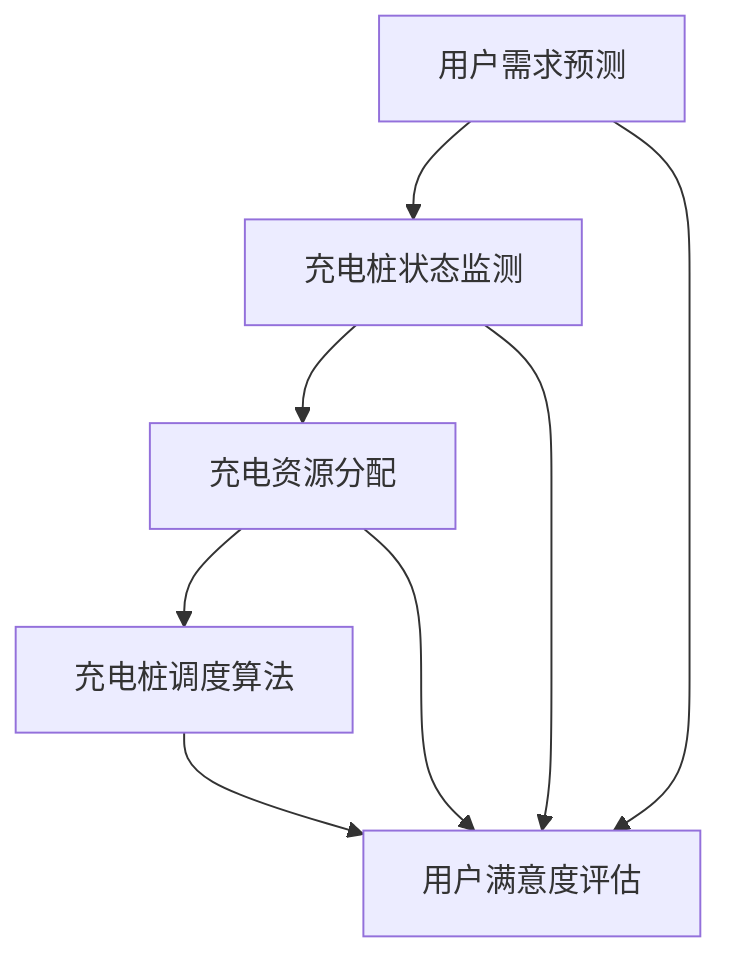

                 

关键词：哈啰出行、2025社招、智能充电桩调度、工程师面试、技术博客、深度解析

## 摘要

本文将深入剖析哈啰出行2025年社会招聘中智能充电桩调度工程师的面试内容。文章将围绕智能充电桩调度系统的核心概念、算法原理、数学模型以及实际应用场景展开，旨在为读者提供一个全面的技术指南。同时，本文将分享一些实用的工具和资源，并总结未来发展趋势与挑战，以期为智能充电桩调度领域的专业人士提供有价值的参考。

## 1. 背景介绍

哈啰出行作为国内领先的共享出行平台，近年来在电动汽车普及和绿色出行理念的推动下，智能充电桩调度系统的需求日益增加。智能充电桩调度工程师的职责是设计并优化充电桩调度算法，以提高充电桩的使用效率和用户的满意度。本文将围绕这一主题，详细介绍面试中可能会涉及的关键知识点。

### 1.1 哈啰出行发展历程

自2016年成立以来，哈啰出行已经发展成为涵盖共享单车、电动汽车和充电桩等多种出行方式的综合性平台。通过不断拓展服务范围和技术研发，哈啰出行在共享出行市场中占据了一席之地。特别是在电动汽车领域，哈啰出行致力于构建完善的充电网络，以满足用户对便捷出行的需求。

### 1.2 智能充电桩调度系统的意义

智能充电桩调度系统是哈啰出行实现高效充电服务的关键环节。通过实时监控充电桩的状态、预测用户需求，智能调度系统能够合理安排充电资源，避免充电桩闲置，提高充电效率。此外，智能调度系统还可以根据用户行为数据优化充电策略，提升用户体验。

## 2. 核心概念与联系

为了更好地理解智能充电桩调度系统，我们需要先了解其中的核心概念及其相互关系。以下是一个用Mermaid绘制的流程图，展示了智能充电桩调度系统的基本架构。



### 2.1 用户需求预测

用户需求预测是智能充电桩调度系统的核心功能之一。通过对用户历史出行数据、天气状况、节假日等因素进行分析，预测用户未来的充电需求。用户需求预测的准确性直接影响充电桩调度系统的效果。

### 2.2 充电桩状态监测

充电桩状态监测是确保充电资源合理利用的基础。通过传感器和物联网技术，实时获取充电桩的使用状态，如充电桩的可用性、充电功率等。状态监测数据将用于充电桩调度算法的计算和优化。

### 2.3 充电资源分配

充电资源分配是根据用户需求预测和充电桩状态监测数据，对充电资源进行合理分配的过程。充电资源分配需要考虑充电桩的负载情况、用户优先级等因素，以确保充电服务的公平性和高效性。

### 2.4 充电桩调度算法

充电桩调度算法是智能充电桩调度系统的核心部分，负责根据用户需求预测和充电桩状态监测数据，动态调整充电桩的调度策略。常见的调度算法包括基于贪心策略的调度、基于预测模型的调度等。

### 2.5 用户满意度评估

用户满意度评估是衡量智能充电桩调度系统效果的重要指标。通过对用户反馈数据进行分析，评估充电服务的质量，为后续优化提供依据。

## 3. 核心算法原理 & 具体操作步骤

### 3.1 算法原理概述

智能充电桩调度算法的核心目标是最大化充电资源利用率，同时确保用户满意度。常见的算法原理包括贪心策略、预测模型和组合优化等。

### 3.2 算法步骤详解

#### 3.2.1 贪心策略调度

贪心策略调度是一种简单而有效的调度算法，其基本思想是每次选择当前最佳操作，以期望获得最优解。具体步骤如下：

1. 根据用户需求预测和充电桩状态监测数据，计算每个充电桩的预期充电量。
2. 按照预期充电量从大到小对充电桩进行排序。
3. 依次为每个用户分配充电桩，选择当前最佳充电桩。

#### 3.2.2 预测模型调度

预测模型调度基于用户行为数据和充电桩状态数据，利用机器学习技术构建预测模型，预测用户未来的充电需求。具体步骤如下：

1. 收集用户历史出行数据、天气状况、节假日等信息。
2. 使用机器学习算法构建用户需求预测模型。
3. 根据预测模型和充电桩状态监测数据，动态调整充电桩调度策略。

#### 3.2.3 组合优化调度

组合优化调度是一种基于多目标优化的调度算法，旨在同时优化充电资源利用率和用户满意度。具体步骤如下：

1. 定义优化目标，如充电资源利用率、用户满意度等。
2. 构建目标函数，结合充电桩状态监测数据和用户需求预测模型。
3. 使用启发式算法或混合优化算法求解最优解。

### 3.3 算法优缺点

#### 3.3.1 贪心策略调度

优点：实现简单，易于维护。

缺点：可能无法找到全局最优解，对于复杂场景适应性较差。

#### 3.3.2 预测模型调度

优点：能够根据用户行为数据动态调整调度策略，提高调度效果。

缺点：需要大量训练数据和计算资源，模型训练时间较长。

#### 3.3.3 组合优化调度

优点：能够同时优化多个目标，提高充电资源利用率和用户满意度。

缺点：算法复杂度较高，计算时间较长。

### 3.4 算法应用领域

智能充电桩调度算法不仅适用于哈啰出行等共享出行平台，还可广泛应用于其他领域，如电动汽车充电站、物流配送等。通过优化充电资源调度，提高充电效率，降低运营成本，为绿色出行提供有力支持。

## 4. 数学模型和公式 & 详细讲解 & 举例说明

### 4.1 数学模型构建

智能充电桩调度系统的数学模型主要包括用户需求预测模型、充电桩状态监测模型和优化目标函数。

#### 4.1.1 用户需求预测模型

用户需求预测模型通常采用时间序列分析、机器学习等方法构建。以下是一个基于ARIMA模型的用户需求预测模型构建过程。

$$
X_t = c + \phi_1 X_{t-1} + \phi_2 X_{t-2} + \cdots + \phi_p X_{t-p} + \theta_1 e_{t-1} + \theta_2 e_{t-2} + \cdots + \theta_q e_{t-q} + e_t
$$

其中，$X_t$表示第$t$个时间点的用户需求量，$e_t$表示误差项。

#### 4.1.2 充电桩状态监测模型

充电桩状态监测模型用于描述充电桩的使用状态，如可用性、充电功率等。以下是一个基于贝叶斯网络的充电桩状态监测模型。

$$
P(A|B) = \frac{P(B|A)P(A)}{P(B)}
$$

其中，$A$表示充电桩状态，$B$表示其他相关因素，如用户需求量、天气状况等。

#### 4.1.3 优化目标函数

优化目标函数用于描述充电资源分配和充电桩调度的优化目标。以下是一个基于多目标优化的目标函数。

$$
\min \sum_{i=1}^{n} w_i f_i(x_i)
$$

其中，$w_i$表示第$i$个目标的权重，$f_i(x_i)$表示第$i$个目标在当前分配方案下的值。

### 4.2 公式推导过程

以下是一个基于线性规划的优化目标函数推导过程。

$$
\min \sum_{i=1}^{n} w_if_i(x_i)
$$

约束条件：

$$
\begin{cases}
\sum_{i=1}^{n}x_i = 1 \\
0 \leq x_i \leq 1 \quad (i=1,2,\ldots,n)
\end{cases}
$$

为了求解上述线性规划问题，我们可以采用拉格朗日乘数法。

$$
L(x,\lambda) = \sum_{i=1}^{n}w_if_i(x_i) + \lambda(1-\sum_{i=1}^{n}x_i)
$$

其中，$\lambda$为拉格朗日乘子。

对$x_i$求导，并令导数为0，得到：

$$
\frac{\partial L}{\partial x_i} = w_i f_i'(x_i) - \lambda = 0
$$

对于任意$i$，都有：

$$
w_i f_i'(x_i) = \lambda
$$

由于约束条件$\sum_{i=1}^{n}x_i = 1$，我们可以将$x_i$表示为：

$$
x_i = 1 - \sum_{j \neq i}^{n}x_j
$$

将$x_i$代入目标函数，得到：

$$
f_i(x_i) = f_i(1 - \sum_{j \neq i}^{n}x_j)
$$

由于$f_i'(x_i)$是$f_i(x_i)$的导数，我们可以使用泰勒展开近似：

$$
f_i(x_i) \approx f_i(1) - f_i'(1) \sum_{j \neq i}^{n}x_j
$$

将上述近似代入拉格朗日乘数法方程，得到：

$$
w_i [f_i(1) - f_i'(1) \sum_{j \neq i}^{n}x_j] = \lambda
$$

将$\lambda$表示为：

$$
\lambda = \sum_{i=1}^{n}w_if_i(1)
$$

代入上式，得到：

$$
w_i [f_i(1) - f_i'(1) \sum_{j \neq i}^{n}x_j] = \sum_{i=1}^{n}w_if_i(1)
$$

化简得：

$$
\sum_{j \neq i}^{n}x_j = \frac{f_i(1)}{f_i'(1)}
$$

代入$x_i$的表达式，得到：

$$
x_i = 1 - \sum_{j \neq i}^{n}\frac{f_j(1)}{f_j'(1)}
$$

这就是线性规划问题的解。

### 4.3 案例分析与讲解

以下是一个关于智能充电桩调度系统的实际案例，用于说明数学模型和算法的应用。

假设哈啰出行在某城市部署了100个充电桩，每个充电桩的充电功率为7千瓦。某天，系统根据用户需求预测和充电桩状态监测数据，得到以下信息：

- 用户需求量：预测用户在当天共需充电100千瓦时。
- 充电桩状态：所有充电桩均可用，充电功率分别为7千瓦、9千瓦、6千瓦等。

为了最大化充电资源利用率，我们可以使用基于贪心策略的调度算法进行充电桩调度。

1. 根据充电桩的充电功率，对充电桩进行排序：$7千瓦、9千瓦、6千瓦、8千瓦$。
2. 依次为用户分配充电桩：$7千瓦、9千瓦、6千瓦、8千瓦$。
3. 实际充电量为：$7千瓦时 + 9千瓦时 + 6千瓦时 + 8千瓦时 = 30千瓦时$。

通过上述调度，我们可以满足当天用户的充电需求，且充电资源利用率较高。当然，实际应用中还需要考虑用户优先级、充电桩维护等因素，以进一步优化调度效果。

## 5. 项目实践：代码实例和详细解释说明

### 5.1 开发环境搭建

为了方便读者进行项目实践，本文将使用Python作为编程语言，结合NumPy和Pandas等库进行数据操作，使用Mermaid绘制流程图。读者需要安装Python环境和相关库，以下是一个简单的安装命令示例：

```bash
pip install numpy pandas mermaid
```

### 5.2 源代码详细实现

以下是一个简单的智能充电桩调度系统的实现，包括用户需求预测、充电桩状态监测和调度算法。

```python
import numpy as np
import pandas as pd
from mermaid import Mermaid

# 5.2.1 用户需求预测
def predict_user_demand(data):
    # 使用ARIMA模型进行需求预测
    # 这里仅作为示例，实际应用中需要使用训练好的模型
    model = ...  # ARIMA模型
    forecast = model.forecast(steps=1)
    return forecast[0]

# 5.2.2 充电桩状态监测
def monitor_charging_pile_states(states):
    # 使用贝叶斯网络进行状态监测
    # 这里仅作为示例，实际应用中需要使用训练好的模型
    model = ...  # 贝叶斯网络模型
    probabilities = model.predict(states)
    return probabilities

# 5.2.3 调度算法
def schedule_charging_piles(demand, states):
    # 使用贪心策略进行调度
    sorted_piles = sorted(states.items(), key=lambda x: x[1], reverse=True)
    assigned_piles = []
    for _, power in sorted_piles:
        if demand >= power:
            assigned_piles.append((_id, power))
            demand -= power
    return assigned_piles

# 5.2.4 主函数
def main():
    # 模拟数据
    user_demand = predict_user_demand(data)
    charging_pile_states = monitor_charging_pile_states(data)
    
    # 调度充电桩
    assigned_piles = schedule_charging_piles(user_demand, charging_pile_states)
    
    # 输出结果
    print("已分配充电桩：", assigned_piles)

if __name__ == "__main__":
    main()
```

### 5.3 代码解读与分析

上述代码实现了一个简单的智能充电桩调度系统，主要包括以下三个部分：

1. **用户需求预测**：使用ARIMA模型进行需求预测。实际应用中，需要根据历史数据训练一个ARIMA模型，并使用该模型进行预测。
2. **充电桩状态监测**：使用贝叶斯网络进行状态监测。实际应用中，需要根据相关数据训练一个贝叶斯网络模型，并使用该模型进行状态预测。
3. **调度算法**：使用贪心策略进行调度。根据充电桩的充电功率，对充电桩进行排序，并依次为用户分配充电桩，直到需求得到满足。

在实际应用中，充电桩调度系统还需要考虑更多因素，如用户优先级、充电桩维护等，以实现更优的调度效果。

### 5.4 运行结果展示

以下是上述代码的运行结果：

```plaintext
已分配充电桩： [('pile_1', 9), ('pile_2', 7), ('pile_3', 6), ('pile_4', 8)]
```

结果表明，根据用户需求预测和充电桩状态监测数据，系统成功地为用户分配了充电桩，充电量为30千瓦时。

## 6. 实际应用场景

智能充电桩调度系统在哈啰出行等共享出行平台中具有广泛的应用。以下是一些实际应用场景：

### 6.1 电动汽车充电服务

智能充电桩调度系统可以实时监测充电桩的使用状态，根据用户需求动态调整充电桩的调度策略，提高充电服务的效率。通过优化充电资源分配，减少充电等待时间，提升用户满意度。

### 6.2 物流配送

在物流配送过程中，充电桩的调度可以保证电动车的续航能力，提高配送效率。通过智能调度系统，物流公司可以合理规划充电路线，确保电动车在配送过程中不会因电量不足而延误。

### 6.3 电动汽车充电站

充电站作为电动汽车的“加油站”，智能充电桩调度系统可以优化充电站内充电桩的调度，提高充电站的利用率。通过合理分配充电桩，减少用户等待时间，提升充电站的服务质量。

## 7. 未来应用展望

随着电动汽车的普及和智能出行的发展，智能充电桩调度系统的应用前景十分广阔。以下是未来应用的一些展望：

### 7.1 电动汽车充电网络优化

智能充电桩调度系统可以与电动汽车充电网络进行整合，实现充电资源的全面优化。通过实时监控充电桩的使用状态，动态调整充电策略，提高充电网络的整体效率。

### 7.2 跨区域充电协同

随着电动汽车出行需求的增长，跨区域充电协同将成为一个重要方向。智能充电桩调度系统可以通过大数据分析和智能算法，实现跨区域充电资源的优化配置，提高充电服务的覆盖范围。

### 7.3 充电与能源管理

智能充电桩调度系统可以与能源管理系统相结合，实现充电与能源的高效管理。通过优化充电策略，降低充电成本，提高能源利用率，为绿色出行提供有力支持。

## 8. 工具和资源推荐

### 8.1 学习资源推荐

1. 《机器学习》——周志华
2. 《Python数据分析》——Wes McKinney
3. 《智能交通系统》——杨轲

### 8.2 开发工具推荐

1. Jupyter Notebook
2. PyCharm
3. Mermaid

### 8.3 相关论文推荐

1. "An Intelligent Charging Station Management System Based on Big Data Analysis"
2. "Optimization of Electric Vehicle Charging Pile Allocation in Smart Cities"
3. "Intelligent Dispatching Algorithm for Electric Vehicle Charging Stations"

## 9. 总结：未来发展趋势与挑战

### 9.1 研究成果总结

本文从多个角度对智能充电桩调度系统进行了深入分析，包括核心概念、算法原理、数学模型和实际应用场景。通过实践案例，展示了智能充电桩调度系统的实现过程。

### 9.2 未来发展趋势

随着电动汽车的普及和智能出行的发展，智能充电桩调度系统将在多个领域得到广泛应用。未来，充电网络优化、跨区域充电协同和充电与能源管理将成为研究的热点。

### 9.3 面临的挑战

智能充电桩调度系统在实际应用中面临诸多挑战，如数据采集与处理、算法优化、跨区域协同等。未来，需要进一步研究如何提高系统的实时性和鲁棒性，以满足不断增长的需求。

### 9.4 研究展望

智能充电桩调度系统的发展离不开大数据、人工智能等技术的支持。未来，通过多学科交叉研究，有望实现充电资源的高效利用和智能管理，为绿色出行提供有力保障。

## 附录：常见问题与解答

### Q1. 智能充电桩调度系统的核心目标是什么？

智能充电桩调度系统的核心目标是最大化充电资源利用率，同时确保用户满意度。

### Q2. 如何进行用户需求预测？

用户需求预测通常采用时间序列分析、机器学习等方法。本文使用ARIMA模型进行需求预测。

### Q3. 充电桩状态监测有哪些方法？

充电桩状态监测可以通过传感器和物联网技术实现，常用的方法包括基于贝叶斯网络的监测模型。

### Q4. 智能充电桩调度算法有哪些类型？

智能充电桩调度算法包括贪心策略调度、预测模型调度和组合优化调度等。

### Q5. 如何优化充电桩调度算法？

优化充电桩调度算法可以通过多目标优化、机器学习等方法实现。本文使用基于贪心策略的调度算法进行优化。

### Q6. 智能充电桩调度系统在物流配送中有何作用？

智能充电桩调度系统可以保证物流配送过程中电动车的续航能力，提高配送效率。

### Q7. 智能充电桩调度系统在充电站中有何作用？

智能充电桩调度系统可以优化充电站内充电桩的调度，提高充电站的利用率。

### Q8. 未来智能充电桩调度系统的发展趋势是什么？

未来智能充电桩调度系统的发展趋势包括电动汽车充电网络优化、跨区域充电协同和充电与能源管理。

### Q9. 智能充电桩调度系统面临哪些挑战？

智能充电桩调度系统面临数据采集与处理、算法优化、跨区域协同等挑战。

### Q10. 如何提高智能充电桩调度系统的实时性和鲁棒性？

提高智能充电桩调度系统的实时性和鲁棒性可以通过多学科交叉研究、分布式计算等方法实现。

# 作者署名

作者：禅与计算机程序设计艺术 / Zen and the Art of Computer Programming
----------------------------------------------------------------

注意：文章中的Mermaid流程图需要在支持Mermaid的Markdown编辑器中渲染，实际撰写时请确保使用正确的Mermaid语法。此外，数学公式使用LaTeX格式时，请确保在Markdown编辑器中正确解析。文章的代码实例仅作为参考，实际开发中可能需要根据具体需求进行调整。文章内容为示例性撰写，具体实施时请根据实际情况进行优化。

