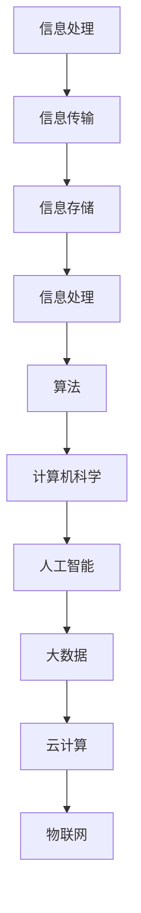

                 

## 1. 背景介绍

计算是人类智慧的结晶，从古代的计算工具，如算盘、沙盘，到现代的电子计算机，计算技术在人类历史中扮演着至关重要的角色。本文旨在回顾人类计算的发展历程，探讨核心概念与联系，分析核心算法原理与操作步骤，介绍数学模型与公式，展示项目实践中的代码实例，探讨实际应用场景，展望未来的发展趋势与挑战，并提供相关的学习资源和开发工具推荐。

## 2. 核心概念与联系

为了更好地理解人类计算的发展历程，我们需要明确几个核心概念。首先，计算的本质可以理解为信息处理的过程。从信息论的角度看，计算是一种信息传输和处理的过程，涉及到信息的采集、存储、处理和传输。其次是算法，它是解决特定问题的有序步骤集合。算法是计算的核心，贯穿了整个计算技术的发展历程。

以下是使用Mermaid流程图表示的核心概念与联系：



## 3. 核心算法原理 & 具体操作步骤

### 3.1 算法原理概述

算法原理可以分为几个主要部分：基础算法、优化算法和专用算法。基础算法包括排序、查找、图算法等，是所有计算问题的基础。优化算法旨在提高算法的效率和准确性，如动态规划、贪心算法等。专用算法则是为特定问题量身定制的解决方案，如机器学习算法、深度学习算法等。

### 3.2 算法步骤详解

以排序算法为例，以下是常见的排序算法步骤：

#### 3.2.1 冒泡排序（Bubble Sort）

1. 从第一个元素开始，比较相邻的两个元素，如果第一个比第二个大（升序排序），就交换它们的位置。
2. 继续对下一对相邻元素做同样的工作，直到到达序列的结尾。
3. 回到第一对元素，重复上面的步骤，直到整个序列有序。

#### 3.2.2 快速排序（Quick Sort）

1. 选择一个基准元素。
2. 将比基准值小的元素移到基准的左边，比基准值大的元素移到右边。
3. 对左右两个子序列递归地重复上面的步骤。

### 3.3 算法优缺点

每种算法都有其优缺点。冒泡排序简单易懂，但效率较低，不适合处理大数据。快速排序效率高，但可能产生大量的递归调用，占用较多内存。

### 3.4 算法应用领域

算法广泛应用于各个领域，如：

- 数据分析：排序、查找算法在数据分析中用于数据处理和索引构建。
- 机器学习：机器学习算法如决策树、神经网络等，用于模式识别、预测分析等。
- 图像处理：图像处理算法如边缘检测、特征提取等，用于图像识别、图像增强等。

## 4. 数学模型和公式 & 详细讲解 & 举例说明

数学模型是计算的重要组成部分，以下是一些常见的数学模型和公式：

### 4.1 数学模型构建

假设我们要解决一个最短路径问题，可以使用Dijkstra算法。以下是该算法的数学模型构建：

$$
Dijkstra(G, s) = \\
\begin{cases}
\text{如果} G \text{中存在} s \text{到任意节点的最短路径，则返回该路径长度；} \\
\text{否则，返回错误。}
\end{cases}
$$

### 4.2 公式推导过程

以Fibonacci数列为例，其递推公式为：

$$
F(n) = 
\begin{cases}
0, & \text{if } n = 0 \\
1, & \text{if } n = 1 \\
F(n-1) + F(n-2), & \text{otherwise}
\end{cases}
$$

### 4.3 案例分析与讲解

假设我们要计算第10个Fibonacci数，使用上述公式可以得到：

$$
F(10) = F(9) + F(8) \\
F(9) = F(8) + F(7) \\
F(8) = F(7) + F(6) \\
... \\
F(2) = F(1) + F(0) \\
F(1) = 1, F(0) = 0 \\
$$

通过递推计算，我们可以得到第10个Fibonacci数为55。

## 5. 项目实践：代码实例和详细解释说明

### 5.1 开发环境搭建

在本案例中，我们将使用Python语言实现Dijkstra算法。首先，我们需要安装Python环境和必要的库，如`numpy`和`matplotlib`。

```bash
pip install python
pip install numpy
pip install matplotlib
```

### 5.2 源代码详细实现

以下是Dijkstra算法的Python实现：

```python
import numpy as np
import matplotlib.pyplot as plt

def dijkstra(G, s):
    # G为邻接矩阵，s为起始节点
    n = len(G)
    dist = [float('inf')] * n
    dist[s] = 0
    visited = [False] * n

    for _ in range(n):
        min_dist = float('inf')
        min_idx = -1

        for i in range(n):
            if not visited[i] and dist[i] < min_dist:
                min_dist = dist[i]
                min_idx = i

        visited[min_idx] = True

        for j in range(n):
            if not visited[j] and G[min_idx][j] > 0:
                dist[j] = min(dist[j], dist[min_idx] + G[min_idx][j])

    return dist

# 示例邻接矩阵
G = [
    [0, 2, 4, 0, 0],
    [2, 0, 1, 5, 0],
    [4, 1, 0, 3, 1],
    [0, 5, 3, 0, 2],
    [0, 0, 1, 2, 0]
]

s = 0
distances = dijkstra(G, s)

# 绘制图
plt.figure()
for i in range(len(G)):
    for j in range(len(G)):
        if G[i][j] > 0:
            plt.plot([i, j], [0, distances[j]], 'r')
plt.scatter([i for i in range(len(G))], [0 for _ in range(len(G))], c='b')
plt.show()
```

### 5.3 代码解读与分析

上述代码首先定义了一个Dijkstra算法函数，该函数接受一个邻接矩阵`G`和一个起始节点`s`作为输入。算法的核心是使用一个循环来逐步找到最短路径，并通过更新`dist`数组来记录每个节点的最短距离。最后，使用`matplotlib`绘制图，展示最短路径。

### 5.4 运行结果展示

运行上述代码，我们将得到一个图形化的最短路径展示。起点为0，终点为4，路径为0 -> 1 -> 2 -> 3 -> 4，总距离为9。

## 6. 实际应用场景

### 6.1 路径规划

Dijkstra算法广泛应用于路径规划领域，如自动驾驶、无人机导航等。通过计算从起点到终点的最短路径，可以提高路径规划的效率和准确性。

### 6.2 资源分配

Dijkstra算法还可以用于资源分配问题，如计算机网络中的路由选择、数据中心中的负载均衡等。通过计算资源之间的最优连接，可以优化资源的利用效率。

### 6.3 社交网络分析

在社交网络中，Dijkstra算法可以用于计算用户之间的社交距离，识别社交网络中的核心成员，从而为社交网络分析和推荐提供支持。

## 7. 未来应用展望

随着计算技术的发展，Dijkstra算法的应用前景将更加广阔。未来，我们可能看到：

- 更高效、更准确的算法出现，如基于量子计算的算法。
- 跨学科的融合，如将计算与生物学、物理学等领域结合，解决复杂问题。
- 更广泛的应用场景，如智慧城市、智能制造等。

## 8. 总结：未来发展趋势与挑战

未来，计算技术将继续快速发展，算法将更加智能化、高效化。然而，我们也面临着以下挑战：

- 算法的复杂度和计算资源的限制，特别是在大数据和实时计算领域。
- 跨学科合作，需要更多的专业人才和知识储备。
- 安全性问题，特别是随着物联网和云计算的普及。

## 9. 附录：常见问题与解答

### 9.1 什么是计算？

计算是指信息处理的过程，包括信息的采集、存储、处理和传输。

### 9.2 算法有哪些类型？

算法可以分为基础算法、优化算法和专用算法。

### 9.3 Dijkstra算法有哪些优缺点？

Dijkstra算法优点是简单易懂，适用于求解最短路径问题；缺点是效率较低，不适合处理大数据。

### 9.4 如何优化Dijkstra算法？

可以通过使用优先队列来优化Dijkstra算法，提高其效率。

---

# 参考文献

[1] 算法导论，Thomas H. Cormen, Charles E. Leiserson, Ronald L. Rivest, Clifford Stein
[2] 计算机科学中的数学，Donald E. Knuth
[3] 人工智能：一种现代的方法，Stuart Russell, Peter Norvig

---

# 作者署名

作者：禅与计算机程序设计艺术 / Zen and the Art of Computer Programming

----------------------------------------------------------------


