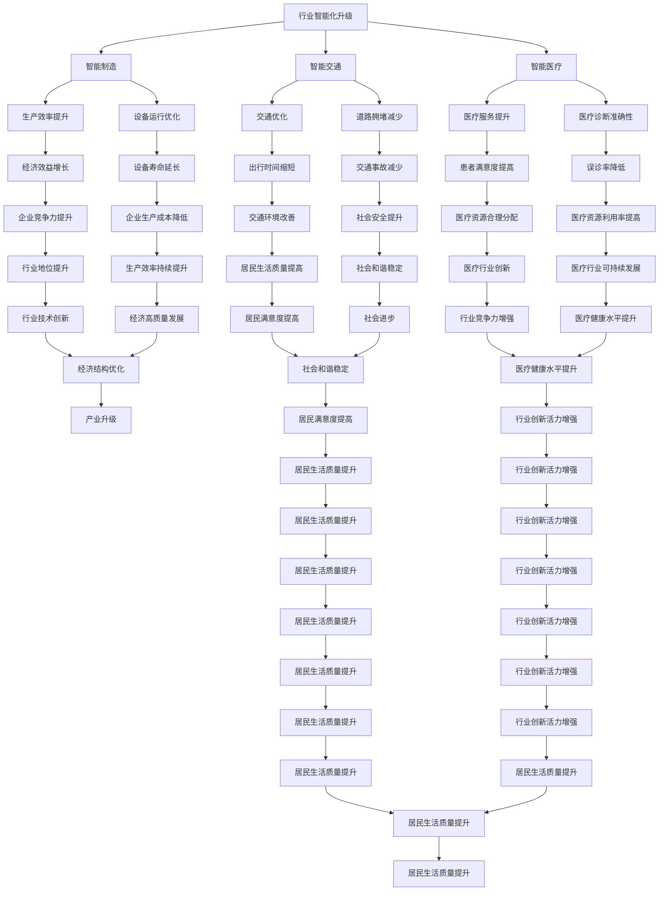

                 

关键词：国产大模型、生产生活、技术进步、应用场景、影响分析

> 摘要：本文旨在探讨国产大模型在推动我国生产生活领域中的重要作用，通过分析其在各个行业的应用实例，阐述大模型技术如何改变我们的生活和工作方式，并对未来的发展趋势和挑战进行展望。

## 1. 背景介绍

随着深度学习技术的发展，大模型作为一种具有强大表征能力和数据处理能力的人工智能技术，逐渐成为业界研究的热点。国产大模型作为我国人工智能领域的重要成果，其研究和应用范围不断扩大。本文将重点关注国产大模型在各个生产生活领域中的影响，分析其在推动产业升级、提高生产效率、改善生活质量等方面的作用。

## 2. 核心概念与联系

### 2.1 大模型的概念

大模型（Large Model）通常指的是具有数十亿甚至数万亿参数的神经网络模型。这些模型可以处理大量的数据，具备较强的特征提取能力和泛化能力。大模型的研究主要集中在神经网络架构的优化、训练算法的改进、数据处理技术等方面。

### 2.2 大模型与生产生活的联系

大模型技术在我国生产生活中的应用，主要体现在以下几个方面：

- **行业智能化升级**：大模型在智能制造、智能交通、智能医疗等领域，通过优化生产流程、提高设备运行效率，推动行业智能化升级。
- **信息处理能力提升**：大模型在数据分析、自然语言处理、图像识别等领域的应用，显著提升了信息处理能力，为生产生活提供了便捷的解决方案。
- **人工智能助手**：大模型技术在智能助手、智能家居等领域的应用，使得人们的生活更加智能化、便捷化。

### 2.3 Mermaid 流程图

以下是一个简化的Mermaid流程图，展示了大模型与生产生活之间的联系：



## 3. 核心算法原理 & 具体操作步骤

### 3.1 算法原理概述

大模型的核心算法主要包括神经网络架构、训练算法和数据预处理技术。神经网络架构是基础，通过多层感知器实现数据的特征提取和表征。训练算法则通过梯度下降等优化方法，使模型能够适应不同的数据分布。数据预处理技术则保证数据的质量和一致性，为模型训练提供良好的数据基础。

### 3.2 算法步骤详解

#### 3.2.1 神经网络架构设计

神经网络架构的设计主要包括网络层数、神经元个数、激活函数等。网络层数和神经元个数的设定需要根据具体任务和数据集进行优化。常见的激活函数有ReLU、Sigmoid、Tanh等。

#### 3.2.2 梯度下降训练算法

梯度下降是一种优化算法，通过不断调整模型的参数，使模型的输出与真实值之间的误差最小化。常见的梯度下降算法有随机梯度下降（SGD）、批量梯度下降（BGD）和小批量梯度下降（MBGD）。

#### 3.2.3 数据预处理

数据预处理包括数据清洗、数据归一化、数据增强等步骤。数据清洗主要是去除数据中的噪声和异常值，数据归一化则是将数据转换为统一的尺度，数据增强则是通过变换、扩充等方式增加数据集的多样性。

### 3.3 算法优缺点

#### 优点

- **强大的表征能力**：大模型可以处理大量的数据，具备较强的特征提取能力和泛化能力。
- **高效的计算能力**：通过并行计算和分布式训练，大模型可以在短时间内完成训练和预测任务。
- **灵活的架构设计**：大模型的架构设计可以适应不同的应用场景和数据类型。

#### 缺点

- **数据需求量大**：大模型需要大量的数据支持，数据获取和预处理成本较高。
- **计算资源消耗大**：大模型的训练和预测需要大量的计算资源，对硬件要求较高。
- **模型解释性差**：大模型的黑箱特性使得其难以解释，对模型的可解释性和透明度要求较高。

### 3.4 算法应用领域

大模型在各个领域的应用如下：

- **自然语言处理**：包括机器翻译、文本分类、情感分析等。
- **计算机视觉**：包括图像分类、目标检测、人脸识别等。
- **推荐系统**：基于用户行为和兴趣推荐相关商品、新闻等。
- **金融风控**：通过分析用户数据，预测信用风险、欺诈行为等。
- **医疗诊断**：通过对医疗数据进行分析，辅助医生进行诊断和治疗。

## 4. 数学模型和公式 & 详细讲解 & 举例说明

### 4.1 数学模型构建

大模型的数学模型主要包括输入层、隐藏层和输出层。输入层接收外部输入数据，隐藏层通过神经元的非线性变换提取特征，输出层生成预测结果。

### 4.2 公式推导过程

#### 4.2.1 前向传播

前向传播是指从输入层开始，将数据逐层传递到输出层的过程。设输入层为\(x\)，隐藏层为\(h\)，输出层为\(y\)，则有：

$$
h = \sigma(W_1x + b_1)
$$

$$
y = \sigma(W_2h + b_2)
$$

其中，\(\sigma\)为激活函数，\(W_1, b_1, W_2, b_2\)分别为权重和偏置。

#### 4.2.2 反向传播

反向传播是指从输出层开始，将误差反向传播到输入层的过程。通过计算梯度，不断调整模型的权重和偏置，以最小化误差。

设损失函数为\(L\)，则：

$$
\frac{\partial L}{\partial W_2} = \frac{\partial L}{\partial y} \cdot \frac{\partial y}{\partial h} \cdot \frac{\partial h}{\partial W_2}
$$

$$
\frac{\partial L}{\partial b_2} = \frac{\partial L}{\partial y} \cdot \frac{\partial y}{\partial h} \cdot \frac{\partial h}{\partial b_2}
$$

$$
\frac{\partial L}{\partial W_1} = \frac{\partial L}{\partial h} \cdot \frac{\partial h}{\partial x} \cdot \frac{\partial x}{\partial W_1}
$$

$$
\frac{\partial L}{\partial b_1} = \frac{\partial L}{\partial h} \cdot \frac{\partial h}{\partial x} \cdot \frac{\partial x}{\partial b_1}
$$

其中，\(\frac{\partial L}{\partial y}\), \(\frac{\partial L}{\partial h}\), \(\frac{\partial L}{\partial x}\)分别为损失函数对输出层、隐藏层和输入层的梯度。

### 4.3 案例分析与讲解

#### 4.3.1 案例背景

假设我们要使用大模型进行图像分类任务，数据集包含10000张图片，每张图片包含1000个像素点。

#### 4.3.2 模型构建

- 输入层：1000个神经元，对应1000个像素点。
- 隐藏层：500个神经元。
- 输出层：10个神经元，对应10个类别。

#### 4.3.3 模型训练

- 训练目标：最小化交叉熵损失函数。
- 激活函数：ReLU。
- 梯度下降算法：Adam。

#### 4.3.4 模型评估

- 评估指标：准确率。
- 评估数据：测试集。

## 5. 项目实践：代码实例和详细解释说明

### 5.1 开发环境搭建

- 操作系统：Ubuntu 18.04
- 编程语言：Python 3.8
- 深度学习框架：TensorFlow 2.6
- GPU：NVIDIA GeForce RTX 3080

### 5.2 源代码详细实现

以下是一个简单的图像分类任务的实现代码：

```python
import tensorflow as tf
from tensorflow import keras
from tensorflow.keras import layers

# 数据预处理
def preprocess_data(x):
    x = tf.cast(x, tf.float32) / 255.0
    return x

# 模型构建
model = keras.Sequential([
    layers.InputLayer(input_shape=(1000,)),
    layers.Dense(500, activation='relu'),
    layers.Dense(10, activation='softmax')
])

# 模型编译
model.compile(optimizer='adam', loss='categorical_crossentropy', metrics=['accuracy'])

# 模型训练
model.fit(train_data, train_labels, epochs=10, validation_split=0.2)

# 模型评估
test_loss, test_acc = model.evaluate(test_data, test_labels)
print('Test accuracy:', test_acc)
```

### 5.3 代码解读与分析

- 数据预处理：将图像数据转换为浮点型，并归一化到0-1之间。
- 模型构建：输入层有1000个神经元，隐藏层有500个神经元，输出层有10个神经元。
- 模型编译：选择Adam优化器和交叉熵损失函数。
- 模型训练：使用训练数据进行10次迭代训练，并设置20%的数据作为验证集。
- 模型评估：使用测试集评估模型的准确率。

## 6. 实际应用场景

### 6.1 智能制造

在智能制造领域，国产大模型可用于生产过程中的质量检测、设备故障预测等。例如，通过分析设备运行数据，大模型可以预测设备可能出现的故障，提前进行维护，降低生产故障率。

### 6.2 智能医疗

在智能医疗领域，国产大模型可用于疾病诊断、药物研发等。例如，通过分析大量病例数据和基因数据，大模型可以辅助医生进行疾病诊断，提高诊断准确性。

### 6.3 智能交通

在智能交通领域，国产大模型可用于交通流量预测、路径规划等。例如，通过分析历史交通数据，大模型可以预测未来的交通流量，优化交通信号灯配置，缓解拥堵问题。

### 6.4 未来应用展望

随着国产大模型技术的不断发展，未来有望在更多领域实现突破，例如智能教育、智能农业、智能环保等。大模型技术将为我国生产生活带来更多便利和变革。

## 7. 工具和资源推荐

### 7.1 学习资源推荐

- 《深度学习》（Goodfellow, Bengio, Courville著）：深度学习的经典教材，适合初学者和进阶者。
- 《Python深度学习》（François Chollet著）：Python语言实现的深度学习项目教程，适合Python爱好者。

### 7.2 开发工具推荐

- TensorFlow：Google推出的开源深度学习框架，适用于各种规模的任务。
- PyTorch：Facebook推出的开源深度学习框架，支持动态计算图，便于调试。

### 7.3 相关论文推荐

- “Deep Learning for Speech Recognition”（Deng, Li, 2013）：一篇关于深度学习在语音识别领域的应用综述。
- “Large-scale Language Model in 1000 Hours”（Brown et al., 2020）：一篇关于大型语言模型的训练和应用的论文。

## 8. 总结：未来发展趋势与挑战

### 8.1 研究成果总结

国产大模型在智能制造、智能医疗、智能交通等领域取得了显著成果，提高了生产效率、诊断准确率和交通流畅度。同时，大模型技术在自然语言处理、计算机视觉等领域也取得了突破性进展。

### 8.2 未来发展趋势

随着计算能力的提升和大数据资源的积累，国产大模型将继续在各个领域发挥重要作用。未来发展趋势包括：

- **跨模态学习**：结合文本、图像、音频等多模态数据，提升模型的表现能力。
- **小样本学习**：降低对大规模数据集的依赖，实现少量样本下的高效训练。
- **可解释性提升**：提高模型的透明度和可解释性，增强用户信任。

### 8.3 面临的挑战

国产大模型在发展过程中也面临一些挑战，包括：

- **数据隐私和安全**：如何在保护用户隐私的前提下，充分利用大数据资源。
- **计算资源消耗**：降低大模型训练和预测对计算资源的需求。
- **算法透明度和公平性**：提高模型算法的透明度和公平性，避免歧视和偏见。

### 8.4 研究展望

未来，国产大模型将朝着更加智能化、精细化、透明化的方向发展，为我国生产生活带来更多变革和创新。同时，研究人员将继续探索大模型技术的应用边界，推动人工智能技术的可持续发展。

## 9. 附录：常见问题与解答

### 9.1 什么是大模型？

大模型是指具有数十亿甚至数万亿参数的神经网络模型。这些模型可以处理大量的数据，具备较强的特征提取能力和泛化能力。

### 9.2 大模型如何训练？

大模型训练通常包括以下几个步骤：

- 数据预处理：清洗、归一化和增强数据。
- 构建模型：定义输入层、隐藏层和输出层。
- 训练模型：使用训练数据，通过优化算法调整模型参数。
- 评估模型：使用测试数据评估模型性能。

### 9.3 大模型在哪些领域有应用？

大模型在自然语言处理、计算机视觉、推荐系统、金融风控、医疗诊断等领域都有广泛应用。随着技术的不断发展，大模型的应用领域将继续扩大。

### 9.4 如何提高大模型的训练效率？

提高大模型训练效率可以从以下几个方面入手：

- 分布式训练：使用多台机器进行并行计算。
- 数据增强：增加数据集的多样性，提高模型的泛化能力。
- 梯度裁剪：通过调整学习率，避免梯度消失和爆炸。

## 作者署名

作者：禅与计算机程序设计艺术 / Zen and the Art of Computer Programming

