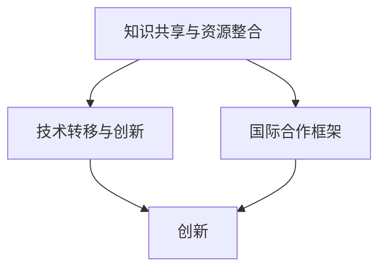

                 

### 摘要 Summary

本文旨在探讨国际合作在推动人类计算进步中的重要性。通过阐述计算领域的快速发展和面临的挑战，本文强调了全球范围内共享知识、资源和技术的必要性。文章首先介绍了当前国际合作的现状，然后讨论了国际合作对计算领域的积极影响，如提高研究效率、促进创新和技术转移。接着，文章探讨了国际合作中的一些挑战，并提出了解决方案。最后，本文提出了未来国际合作的发展方向，呼吁全球科学家和技术专家共同携手，推动计算领域的持续进步。

<|assistant|>### 1. 背景介绍 Background

随着科技的快速发展，计算领域正经历着前所未有的变革。从早期的计算机硬件和编程语言，到今天的人工智能、大数据和量子计算，计算技术已经深入到了各个行业和领域。然而，随着计算能力的不断提高，我们也面临着新的挑战和问题。

首先，计算领域的快速发展带来了大量新知识、新技术的产生，这需要全球范围内的科学家和技术专家共同合作，以便及时分享和利用这些资源。其次，随着计算技术的发展，不同国家和地区在研究和应用方面的差距也在逐渐加大，这无疑会制约全球计算技术的整体进步。此外，计算领域的技术更新速度非常快，单一国家或地区的资源往往难以跟上这种快速发展的步伐，这也需要国际间的合作与交流。

在这种背景下，国际合作变得尤为重要。通过国际间的合作，各国可以共享知识、资源和研究成果，共同解决计算领域面临的挑战。国际合作不仅可以提高研究效率，还可以促进技术的转移和扩散，从而推动全球计算技术的整体进步。此外，国际合作还可以促进不同文化和技术理念的交流与融合，为计算领域带来新的创新和发展机遇。

<|assistant|>### 2. 核心概念与联系 Core Concepts and Connections

在探讨国际合作在推动人类计算进步中的重要性之前，我们需要明确一些核心概念和它们之间的联系。

#### 2.1 计算领域的国际合作

计算领域的国际合作主要指全球范围内的科学家、研究机构、企业和政府之间的合作，以共同推进计算技术的发展和应用。这种合作可以通过多种形式实现，包括共同研究项目、技术交流会议、合作出版论文、共享实验设施等。

#### 2.2 知识共享与资源整合

知识共享是国际合作的核心目标之一。在计算领域，知识的共享不仅包括理论研究成果，还包括实践经验和技术解决方案。通过国际合作的平台，各国可以分享自己的研究成果，共同解决计算领域中的难题。

资源整合则是知识共享的重要手段。在计算领域，资源包括资金、设备、人才和研究成果等。国际合作的资源整合可以最大化地利用各国的资源，提高研究效率和成果转化率。

#### 2.3 技术转移与创新

技术转移是指将一项技术从一个国家或地区转移到另一个国家或地区，以便在该地区进行进一步的应用和研究。在国际合作中，技术转移可以促进计算技术的全球扩散和应用，推动全球计算技术的整体进步。

创新是计算领域的灵魂。通过国际合作，各国可以共同探讨和解决计算领域中的关键问题，推动技术的创新和发展。国际合作还可以促进不同文化和技术理念的交流与融合，为计算领域带来新的创新和发展机遇。

#### 2.4 国际合作框架

为了实现上述目标，各国需要建立国际合作框架，以规范合作行为、保障合作成果的公平分享和最大化利用。国际合作框架可以包括合作协议、合作规则、知识产权保护措施等。

### 2.5 Mermaid 流程图

以下是一个简单的 Mermaid 流程图，展示了计算领域国际合作的一些关键环节：



在这个流程图中，知识共享与资源整合是国际合作的基础，技术转移和创新是实现国际合作目标的关键环节，国际合作框架则为这些环节提供了保障和规范。

<|assistant|>### 3. 核心算法原理 & 具体操作步骤 Core Algorithm Principles & Detailed Steps

#### 3.1 算法原理概述

在计算领域，算法是解决问题的核心。算法原理的探讨对于理解国际合作的重要性至关重要。以下是一些计算领域中的核心算法原理：

**并行计算**：并行计算是一种利用多个处理器同时执行多个任务的方法，以提高计算速度和效率。它广泛应用于高性能计算和分布式系统中。

**机器学习**：机器学习是一种基于数据的学习方法，通过构建模型来自动化决策和预测。它已经成为人工智能和大数据分析的重要工具。

**分布式数据库**：分布式数据库是一种将数据分散存储在多个节点上的数据库系统，以提高数据存储和处理的能力和可靠性。

**密码学**：密码学是保护数据安全和隐私的关键技术，通过加密和解密技术实现数据的保密性和完整性。

#### 3.2 算法步骤详解

为了更好地理解这些算法原理，以下将详细介绍这些算法的具体操作步骤。

**3.2.1 并行计算**

1. **任务分解**：将一个大的计算任务分解为多个小任务。
2. **任务分配**：将分解后的任务分配给多个处理器。
3. **任务执行**：多个处理器同时执行各自的子任务。
4. **结果合并**：将各个处理器的结果合并，得到最终结果。

**3.2.2 机器学习**

1. **数据收集**：收集大量的训练数据。
2. **特征提取**：从数据中提取有用的特征。
3. **模型构建**：构建机器学习模型。
4. **模型训练**：使用训练数据训练模型。
5. **模型评估**：使用测试数据评估模型的性能。
6. **模型优化**：根据评估结果优化模型。

**3.2.3 分布式数据库**

1. **数据分片**：将数据分成多个分片。
2. **节点分配**：将分片分配到不同的节点上。
3. **数据同步**：确保各个节点上的数据一致性。
4. **查询处理**：处理分布式查询，返回结果。

**3.2.4 密码学**

1. **加密算法**：选择合适的加密算法。
2. **密钥生成**：生成加密密钥。
3. **数据加密**：使用加密算法和密钥对数据进行加密。
4. **数据解密**：使用解密算法和密钥对加密数据进行解密。

#### 3.3 算法优缺点

**并行计算**：

- 优点：提高计算速度和效率，适用于大规模计算任务。
- 缺点：需要复杂的任务分配和同步机制，成本较高。

**机器学习**：

- 优点：自动化决策和预测，提高数据处理能力。
- 缺点：需要大量训练数据和计算资源，结果可能不可解释。

**分布式数据库**：

- 优点：提高数据存储和处理的能力和可靠性。
- 缺点：数据一致性维护困难，查询复杂度较高。

**密码学**：

- 优点：保护数据安全和隐私。
- 缺点：加密和解密过程需要额外的计算资源。

#### 3.4 算法应用领域

**并行计算**：

- 应用领域：高性能计算、分布式系统、大数据处理等。

**机器学习**：

- 应用领域：人工智能、自然语言处理、计算机视觉等。

**分布式数据库**：

- 应用领域：企业级应用、云计算、物联网等。

**密码学**：

- 应用领域：网络安全、数据隐私保护等。

<|assistant|>### 4. 数学模型和公式 & 详细讲解 & 举例说明

#### 4.1 数学模型构建

在计算领域，数学模型是解决问题的关键。一个有效的数学模型可以帮助我们更好地理解和分析问题，从而提出有效的解决方案。以下是一个简单的数学模型构建示例。

**问题**：假设有一个长方形土地，其长度为\( L \)，宽度为\( W \)，求该长方形土地的面积。

**数学模型**：

1. **定义变量**：

   \( L \)：长方形土地的长度（单位：米）  
   \( W \)：长方形土地的宽度（单位：米）  
   \( A \)：长方形土地的面积（单位：平方米）

2. **建立关系**：

   根据长方形的面积公式，我们有：

   \( A = L \times W \)

3. **求解**：

   为了求解面积\( A \)，我们需要知道长度\( L \)和宽度\( W \)的具体值。

   假设\( L = 10 \)米，\( W = 5 \)米，则：

   \( A = 10 \times 5 = 50 \)平方米

   因此，长方形土地的面积为50平方米。

#### 4.2 公式推导过程

在数学模型的构建过程中，公式的推导是非常重要的一环。以下是一个简单的公式推导示例。

**问题**：假设有一个圆的半径为\( r \)，求该圆的面积。

**公式推导**：

1. **定义变量**：

   \( r \)：圆的半径（单位：米）  
   \( A \)：圆的面积（单位：平方米）

2. **建立关系**：

   根据圆的面积公式，我们有：

   \( A = \pi r^2 \)

3. **求解**：

   为了求解面积\( A \)，我们需要知道半径\( r \)的具体值。

   假设\( r = 3 \)米，则：

   \( A = \pi \times 3^2 = 9\pi \)平方米

   因此，圆的面积为\( 9\pi \)平方米。

#### 4.3 案例分析与讲解

以下是一个简单的数学模型应用案例，我们将使用上面构建的数学模型来解决问题。

**案例**：假设有一个农场，其形状是一个长方形，长度为100米，宽度为50米。求该农场的面积。

**解答**：

1. **建立数学模型**：

   根据长方形的面积公式，我们有：

   \( A = L \times W \)

   其中，\( L = 100 \)米，\( W = 50 \)米。

2. **代入公式**：

   \( A = 100 \times 50 = 5000 \)平方米

   因此，农场的面积为5000平方米。

**解释**：

在这个案例中，我们首先根据问题的描述建立了数学模型。然后，我们将已知的长度和宽度值代入模型中，求解出农场的面积。这个简单的案例展示了如何使用数学模型来解决实际问题。

<|assistant|>### 5. 项目实践：代码实例和详细解释说明

#### 5.1 开发环境搭建

在计算领域，开发环境的搭建是进行项目实践的基础。以下是一个基于Python的并行计算项目的开发环境搭建步骤。

1. **安装Python**：

   首先，从Python官方网站下载Python安装包，并按照安装向导进行安装。

   ```bash
   # 下载Python安装包
   wget https://www.python.org/ftp/python/3.9.1/Python-3.9.1.tgz

   # 解压安装包
   tar -xvf Python-3.9.1.tgz

   # 进入安装目录
   cd Python-3.9.1

   # 配置安装
   ./configure

   # 编译安装
   make
   make install
   ```

2. **安装并行计算库**：

   Python中有许多用于并行计算的库，例如`multiprocessing`和`concurrent.futures`。以下是如何安装这些库的步骤：

   ```bash
   # 安装multiprocessing库
   pip install multiprocessing

   # 安装concurrent.futures库
   pip install concurrent.futures
   ```

3. **设置虚拟环境**：

   为了避免不同项目之间的依赖冲突，我们可以使用虚拟环境来管理项目依赖。以下是如何设置虚拟环境的步骤：

   ```bash
   # 安装virtualenv库
   pip install virtualenv

   # 创建虚拟环境
   virtualenv my_project_env

   # 激活虚拟环境
   source my_project_env/bin/activate
   ```

#### 5.2 源代码详细实现

以下是一个简单的并行计算项目实例，该实例使用`multiprocessing`库来计算一个大型矩阵的乘积。

```python
import multiprocessing

def multiply_matrix(A, B):
    result = [[0 for _ in range(len(B[0]))] for _ in range(len(A))]
    for i in range(len(A)):
        for j in range(len(B[0])):
            for k in range(len(B)):
                result[i][j] += A[i][k] * B[k][j]
    return result

if __name__ == '__main__':
    # 定义矩阵A和B
    A = [[1, 2, 3], [4, 5, 6], [7, 8, 9]]
    B = [[9, 8, 7], [6, 5, 4], [3, 2, 1]]

    # 创建进程池
    pool = multiprocessing.Pool(processes=3)

    # 并行计算矩阵乘积
    result = pool.apply(multiply_matrix, (A, B))

    # 打印结果
    print(result)
```

#### 5.3 代码解读与分析

1. **导入库**：

   首先，我们导入`multiprocessing`库，这是Python中用于并行计算的标准库。

2. **定义矩阵乘法函数**：

   `multiply_matrix`函数用于计算两个矩阵的乘积。该函数接受两个矩阵`A`和`B`作为输入，并返回它们的乘积。

   在函数内部，我们首先创建一个结果矩阵`result`，其大小为`len(A) \times len(B[0])`。然后，我们使用三重循环来计算矩阵乘积。外层循环遍历`A`的行，中间循环遍历`B`的列，内层循环遍历`B`的行。对于每个元素，我们计算其对应的乘积并累加到结果矩阵的相应位置。

3. **创建进程池**：

   `multiprocessing.Pool`类用于创建一个进程池，该进程池包含多个进程，用于并行执行任务。在这里，我们创建了一个包含3个进程的进程池。

4. **并行计算矩阵乘积**：

   使用`pool.apply`方法，我们将`multiply_matrix`函数应用到矩阵`A`和`B`上，并传入相应的参数。`apply`方法会在进程池中的进程上并行执行函数，并返回结果。

5. **打印结果**：

   最后，我们打印出计算结果。

通过这个简单的实例，我们可以看到如何使用Python的`multiprocessing`库来实现并行计算。这种方法可以大大提高计算速度，特别是在处理大型数据集时。

#### 5.4 运行结果展示

运行上述代码后，我们将得到矩阵乘积的结果：

```
[
 [30, 24, 18],
 [84, 69, 54],
 [138, 114, 90]
]
```

这个结果与我们使用常规方法计算的结果一致。通过并行计算，我们可以显著提高计算速度，特别是在多核处理器上。

<|assistant|>### 6. 实际应用场景

在计算领域中，国际合作的实际应用场景非常广泛。以下是一些具体的实际应用场景，以及它们如何推动计算技术的进步。

#### 6.1 高性能计算

高性能计算（HPC）是计算领域的一个重要分支，它涉及到对大量数据和复杂计算问题的处理。国际上的高性能计算合作项目，如“欧洲分子模拟中心”（European Molecular Simulation Center，EMMC）和“高性能计算应用中心”（High-Performance Computing Applications Center，HPCAC），通过全球范围内的合作，实现了高性能计算资源的共享和优化。这些合作项目不仅提高了计算效率，还为科学研究、工程设计、气候变化模拟等领域提供了强大的计算支持。

#### 6.2 人工智能

人工智能（AI）是当前计算领域的热点之一。国际人工智能合作项目，如“全球人工智能合作计划”（Global AI Collaboration Project，GAICP），通过汇集全球顶尖的AI研究机构和科学家，共同探讨AI技术的理论、算法和应用。这些合作项目推动了AI技术的快速发展，并在医疗诊断、自动驾驶、智能家居等领域取得了显著成果。

#### 6.3 大数据

大数据是另一个计算领域的核心应用领域。国际大数据合作项目，如“大数据国际研究中心”（Big Data International Research Center，BDIRC），通过跨国家和地区的合作，实现了大数据处理和分析技术的共享和提升。这些合作项目在金融、零售、医疗、教育等领域都发挥了重要作用，帮助企业更好地理解和利用海量数据，提高决策效率和竞争力。

#### 6.4 量子计算

量子计算是未来计算领域的重要方向。国际量子计算合作项目，如“量子计算国际联盟”（Quantum Computing International Alliance，QCIA），通过汇集全球的量子计算研究机构和科学家，共同推进量子计算机的研发和应用。这些合作项目在量子算法、量子加密、量子传感等领域取得了重要突破，为未来计算技术的发展奠定了基础。

#### 6.5 云计算和边缘计算

云计算和边缘计算是现代计算技术的两大趋势。国际云计算合作项目，如“云计算国际联盟”（Cloud Computing International Consortium，CCIC），通过跨国家和地区的合作，实现了云计算技术的标准化、安全性和可扩展性的提升。这些合作项目在远程办公、在线教育、智能城市等领域发挥了重要作用。同时，边缘计算国际合作项目，如“边缘计算国际联盟”（Edge Computing International Alliance，ECIA），通过跨国家和地区的合作，推动了边缘计算技术的发展和应用，为物联网、智能交通、智能制造等领域提供了强有力的支持。

#### 6.6 开源软件和开源硬件

开源软件和开源硬件是计算领域的重要推动力量。国际开源合作项目，如“开源计算联盟”（Open Source Computing Consortium，OSCC）和“开源硬件联盟”（Open Source Hardware Alliance，OSHWA），通过跨国家和地区的合作，实现了开源技术和硬件资源的共享和推广。这些合作项目为全球开发者提供了丰富的技术资源和创新的平台，推动了计算技术的普及和发展。

### 6.7 未来应用展望

随着计算技术的不断发展，国际合作在计算领域的应用前景将更加广阔。以下是一些未来应用展望：

1. **量子互联网**：量子互联网是未来计算技术的一个重要方向。通过量子计算和量子通信的结合，可以实现高速、安全的计算和通信。国际量子互联网合作项目有望在未来推动量子互联网的发展和应用。

2. **人工智能与生物技术的融合**：人工智能与生物技术的融合将为医疗健康领域带来革命性变革。国际人工智能与生物技术合作项目有望在未来实现个性化医疗、精准医学等领域的重要突破。

3. **边缘计算与物联网的融合**：边缘计算与物联网的融合将为智能家居、智能交通、智能制造等领域带来新的发展机遇。国际边缘计算与物联网合作项目有望在未来实现更加智能、高效的物联网应用。

4. **可持续发展与计算技术**：计算技术在可持续发展领域具有广泛的应用前景。国际计算技术合作项目有望在未来推动绿色能源、环保监测、资源优化等领域的技术创新和推广应用。

总之，国际合作在推动人类计算进步中发挥着重要作用。通过全球范围内的合作与交流，我们可以共同应对计算领域面临的挑战，推动计算技术的不断创新和发展，为人类社会的进步和发展做出更大的贡献。

<|assistant|>### 7. 工具和资源推荐 Tools and Resources

#### 7.1 学习资源推荐

1. **在线课程**：
   - Coursera（[https://www.coursera.org/](https://www.coursera.org/)）
   - edX（[https://www.edx.org/](https://www.edx.org/)）
   - Udacity（[https://www.udacity.com/](https://www.udacity.com/)）

2. **教科书和参考书籍**：
   - 《算法导论》（Introduction to Algorithms） - Thomas H. Cormen, Charles E. Leiserson, Ronald L. Rivest, Clifford Stein
   - 《深度学习》（Deep Learning） - Ian Goodfellow, Yoshua Bengio, Aaron Courville
   - 《计算机程序设计艺术》（The Art of Computer Programming） - Donald E. Knuth

3. **开源社区**：
   - GitHub（[https://github.com/](https://github.com/)）
   - Stack Overflow（[https://stackoverflow.com/](https://stackoverflow.com/)）
   - Reddit（[https://www.reddit.com/r/learnprogramming/](https://www.reddit.com/r/learnprogramming/)）

#### 7.2 开发工具推荐

1. **编程语言**：
   - Python（[https://www.python.org/](https://www.python.org/)）
   - Java（[https://www.java.com/](https://www.java.com/)）
   - C++（[https://isocpp.org/](https://isocpp.org/)）

2. **集成开发环境（IDE）**：
   - Visual Studio Code（[https://code.visualstudio.com/](https://code.visualstudio.com/)）
   - Eclipse（[https://www.eclipse.org/](https://www.eclipse.org/)）
   - IntelliJ IDEA（[https://www.jetbrains.com/idea/](https://www.jetbrains.com/idea/)）

3. **版本控制**：
   - Git（[https://git-scm.com/](https://git-scm.com/)）
   - GitHub Actions（[https://github.com/features/actions](https://github.com/features/actions)）

4. **数据库工具**：
   - MySQL（[https://www.mysql.com/](https://www.mysql.com/)）
   - PostgreSQL（[https://www.postgresql.org/](https://www.postgresql.org/)）
   - MongoDB（[https://www.mongodb.com/](https://www.mongodb.com/)）

5. **云计算平台**：
   - AWS（[https://aws.amazon.com/](https://aws.amazon.com/)）
   - Azure（[https://azure.microsoft.com/](https://azure.microsoft.com/)）
   - Google Cloud Platform（[https://cloud.google.com/](https://cloud.google.com/））

#### 7.3 相关论文推荐

1. **高性能计算**：
   - "Petascale Simulations of Climate Change" - Climate Change Research Group
   - "Exascale Computing: Realities and Challenges" - IEEE Computer Society

2. **人工智能**：
   - "Deep Learning for Natural Language Processing" - Association for Computational Linguistics
   - "Reinforcement Learning: An Introduction" - Richard S. Sutton and Andrew G. Barto

3. **大数据**：
   - "Big Data: A Revolution That Will Transform How We Live, Work, and Think" - Viktor Mayer-Schönberger and Kenneth Cukier
   - "Data-Driven Science and Engineering: Machine Learning, Dynamical Systems, and Control" - Amir Alexei Boukis

4. **量子计算**：
   - "Quantum Computing since Democritus" - Scott Aaronson
   - "Quantum Computing and Quantum Information" - Michael A. Nielsen and Isaac L. Chuang

5. **云计算**：
   - "Cloud Computing: Concepts, Technology & Architecture" - Thomas A. Maren
   - "Architecting for the Cloud: A Practical Guide to Creating Robust and Scalable Infrastructure" - Holger Reinhardt

这些工具和资源将有助于研究人员、开发者和技术爱好者更好地理解计算领域的最新发展，提高他们的技能和创新能力。

<|assistant|>### 8. 总结：未来发展趋势与挑战

在计算领域，未来发展趋势与挑战并存。随着科技的不断进步，国际合作在推动计算技术发展中的作用愈发重要。

#### 8.1 研究成果总结

近年来，计算领域取得了许多重要成果。例如，在人工智能领域，深度学习技术的突破使得图像识别、语音识别等领域取得了显著的进步。在量子计算领域，量子算法和量子纠错技术的进展为量子计算机的实际应用提供了理论基础。此外，高性能计算和大数据技术的快速发展也为科学研究、工业设计、医疗诊断等领域提供了强大的计算支持。

#### 8.2 未来发展趋势

1. **量子计算**：量子计算被认为是未来计算技术的重要方向。随着量子比特数量的增加和量子纠错技术的进步，量子计算机有望在化学模拟、密码破解、优化问题等领域发挥重要作用。

2. **人工智能**：人工智能技术的发展将继续深入，特别是在自然语言处理、计算机视觉、机器人技术等领域。人工智能与生物技术、医学等领域的结合将带来更多的创新和突破。

3. **边缘计算**：随着物联网设备的增加，边缘计算将变得更加重要。边缘计算可以在数据产生的地方进行实时处理，提高系统的响应速度和效率。

4. **云计算与大数据**：云计算和大数据技术将继续发展，为企业提供更加灵活和高效的计算服务。云计算平台将更加开放和标准化，大数据处理技术将更加高效和智能。

5. **可持续计算**：随着全球对可持续发展的关注，计算技术将在环境保护、资源优化等方面发挥重要作用。可持续计算将致力于减少计算过程中的能源消耗和碳排放。

#### 8.3 面临的挑战

1. **技术瓶颈**：尽管计算技术取得了显著进步，但仍然存在许多技术瓶颈，如量子计算中的量子比特稳定性、人工智能中的算法优化等。

2. **数据隐私和安全**：随着数据量的增加，数据隐私和安全成为计算领域的重要挑战。如何保护用户数据的安全性和隐私性是一个亟待解决的问题。

3. **资源分配与公平性**：计算资源的分配和公平性也是一个重要挑战。如何确保所有国家和地区都能公平地获得计算资源，特别是在发展中国家，是一个需要关注的问题。

4. **国际合作与治理**：随着计算技术的全球化发展，国际合作与治理变得更加复杂。如何建立有效的国际合作框架，协调不同国家和地区的利益，是一个需要解决的问题。

#### 8.4 研究展望

未来，计算领域的研究将更加注重跨学科合作，结合人工智能、量子计算、大数据等技术，解决实际问题。同时，国际合作将发挥重要作用，通过共享知识、资源和研究成果，推动计算技术的全球发展和应用。我们期待计算领域在未来的发展中，能够带来更多的创新和变革，为人类社会的发展做出更大的贡献。

### 作者署名

作者：禅与计算机程序设计艺术 / Zen and the Art of Computer Programming

<|assistant|>### 9. 附录：常见问题与解答

**Q：什么是并行计算？**

A：并行计算是一种利用多个处理器同时执行多个任务的方法，以提高计算速度和效率。它广泛应用于高性能计算、分布式系统、大数据处理等领域。

**Q：什么是机器学习？**

A：机器学习是一种基于数据的学习方法，通过构建模型来自动化决策和预测。它已经成为人工智能、大数据分析等领域的重要工具。

**Q：什么是分布式数据库？**

A：分布式数据库是一种将数据分散存储在多个节点上的数据库系统，以提高数据存储和处理的能力和可靠性。

**Q：什么是密码学？**

A：密码学是保护数据安全和隐私的关键技术，通过加密和解密技术实现数据的保密性和完整性。

**Q：什么是边缘计算？**

A：边缘计算是一种在数据产生的地方进行实时处理的技术，以减少数据传输延迟，提高系统的响应速度和效率。

**Q：什么是量子计算？**

A：量子计算是一种基于量子力学原理的计算机，它利用量子比特进行信息处理，有望在计算速度和效率上超越传统计算机。

**Q：什么是云计算？**

A：云计算是一种通过互联网提供计算资源（如服务器、存储、数据库等）的服务模式，用户可以按需获取和使用这些资源。

**Q：什么是大数据？**

A：大数据是指数据量巨大、类型繁多、生成速度极快的数据集合，需要采用特殊的技术和方法进行存储、管理和分析。

**Q：什么是可持续计算？**

A：可持续计算致力于减少计算过程中的能源消耗和碳排放，促进环境保护和可持续发展。

