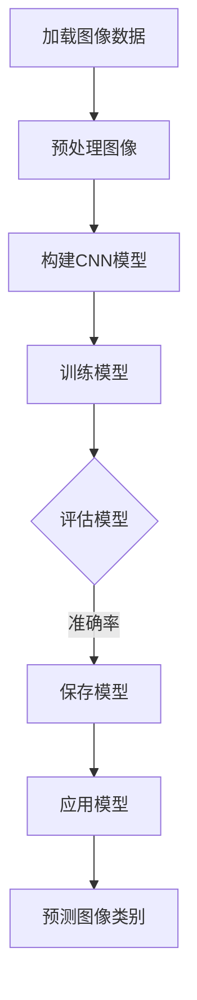

                 

关键词：图像分类、深度学习、卷积神经网络、计算机视觉、机器学习、Python实现、实践教程

> 摘要：本文将详细讲解图像分类的原理，并附上Python代码实例，帮助读者深入理解并掌握图像分类技术。从基础概念到高级应用，我们将逐步剖析图像分类的过程，并通过实际代码展示，使读者能够将理论知识转化为实践能力。

## 1. 背景介绍

图像分类是计算机视觉领域的一个基本问题，它旨在将图像划分为预先定义的类别。图像分类的重要性体现在多个领域，包括医疗影像分析、自动驾驶、安防监控、社交媒体内容审核等。随着深度学习技术的不断发展，图像分类的性能取得了显著提升，使得该技术在实际应用中变得更加普及。

本文将围绕图像分类的核心概念和算法展开讨论，并提供一个详细的Python代码实例。通过阅读本文，读者将能够：

- 了解图像分类的基础概念。
- 掌握卷积神经网络（CNN）的基本原理。
- 学习如何使用深度学习框架（如TensorFlow和PyTorch）进行图像分类实践。
- 分析图像分类算法的优缺点及其应用领域。

## 2. 核心概念与联系

为了更好地理解图像分类，我们需要先了解与之相关的核心概念。以下是图像分类相关的一些核心概念和它们之间的联系：

### 图像数据

图像数据是图像分类的基础。一幅图像可以表示为像素值矩阵，其中每个像素值表示颜色信息。

### 数据集

数据集是由图像组成的集合，用于训练和测试分类模型。常见的公开数据集有ImageNet、CIFAR-10等。

### 卷积神经网络（CNN）

卷积神经网络是用于处理图像数据的一种特殊类型的神经网络，它通过卷积层、池化层和全连接层等结构，自动提取图像的特征。

### 交叉熵损失函数

交叉熵损失函数是评估分类模型性能的常用指标，它衡量模型预测的概率分布与真实分布之间的差异。

### Mermaid 流程图

以下是一个用于展示图像分类过程的Mermaid流程图：



### 图像分类流程

1. **加载图像数据**：从数据集中读取图像，并将其转换为神经网络可以处理的格式。
2. **预处理图像**：调整图像大小、归一化像素值等，以适应模型输入要求。
3. **构建CNN模型**：设计并搭建卷积神经网络，包括卷积层、池化层和全连接层等。
4. **训练模型**：使用标记好的图像数据训练模型，通过反向传播算法调整模型参数。
5. **评估模型**：在测试集上评估模型性能，计算准确率等指标。
6. **保存模型**：将训练好的模型保存，以便后续使用。
7. **应用模型**：使用模型对新的图像进行分类预测。

## 3. 核心算法原理 & 具体操作步骤

### 3.1 算法原理概述

图像分类的核心是卷积神经网络（CNN），其基本原理是通过多层卷积和池化操作，从图像中提取特征，然后通过全连接层进行分类。

1. **卷积层**：卷积层通过卷积运算提取图像特征。
2. **池化层**：池化层用于减少特征图的维度，提高模型计算效率。
3. **全连接层**：全连接层将特征图展开为一维向量，进行分类。

### 3.2 算法步骤详解

1. **加载和预处理图像数据**：
   ```python
   import tensorflow as tf
   from tensorflow.keras.preprocessing.image import ImageDataGenerator

   train_datagen = ImageDataGenerator(rescale=1./255)
   train_generator = train_datagen.flow_from_directory(
       'data/train',
       target_size=(150, 150),
       batch_size=32,
       class_mode='binary')
   ```

2. **构建CNN模型**：
   ```python
   from tensorflow.keras.models import Sequential
   from tensorflow.keras.layers import Conv2D, MaxPooling2D, Flatten, Dense

   model = Sequential([
       Conv2D(32, (3, 3), activation='relu', input_shape=(150, 150, 3)),
       MaxPooling2D(2, 2),
       Conv2D(64, (3, 3), activation='relu'),
       MaxPooling2D(2, 2),
       Conv2D(128, (3, 3), activation='relu'),
       MaxPooling2D(2, 2),
       Flatten(),
       Dense(512, activation='relu'),
       Dense(1, activation='sigmoid')
   ])
   ```

3. **训练模型**：
   ```python
   model.compile(optimizer='adam',
                 loss='binary_crossentropy',
                 metrics=['accuracy'])

   model.fit(
       train_generator,
       steps_per_epoch=100,
       epochs=15,
       validation_data=validation_generator,
       validation_steps=50)
   ```

4. **评估模型**：
   ```python
   test_loss, test_acc = model.evaluate(test_generator, steps=50)
   print('Test accuracy:', test_acc)
   ```

5. **保存模型**：
   ```python
   model.save('image_classifier.h5')
   ```

6. **应用模型**：
   ```python
   import numpy as np
   from tensorflow.keras.preprocessing import image

   img = image.load_img('data/test/cat.jpg', target_size=(150, 150))
   img_array = image.img_to_array(img)
   img_array = np.expand_dims(img_array, axis=0)  # Create a batch
   img_array /= 255.0

   predictions = model.predict(img_array)
   print('Predicted class:', predictions)
   ```

### 3.3 算法优缺点

**优点**：

- **强大的特征提取能力**：CNN能够自动学习图像的特征，无需手动特征工程。
- **并行计算**：卷积操作可以并行计算，提高了模型的训练效率。
- **良好的性能**：在众多图像分类任务中，CNN取得了很好的性能。

**缺点**：

- **计算成本高**：CNN模型通常需要大量的计算资源。
- **数据需求大**：训练高质量CNN模型需要大量标记数据。

### 3.4 算法应用领域

图像分类技术广泛应用于多个领域，包括：

- **医学影像分析**：如乳腺癌检测、肿瘤分类等。
- **自动驾驶**：如车辆检测、行人检测等。
- **安防监控**：如人脸识别、行为识别等。
- **内容审核**：如图片和视频的违规内容检测等。

## 4. 数学模型和公式 & 详细讲解 & 举例说明

### 4.1 数学模型构建

在图像分类中，常用的数学模型是卷积神经网络（CNN）。以下是CNN的主要组成部分和对应的数学公式：

1. **卷积层**：
   $$ f(x) = \sum_{i=1}^{K} w_i * x + b $$
   其中，$x$ 是输入特征图，$w_i$ 是卷积核权重，$b$ 是偏置项，$f(x)$ 是卷积操作的结果。

2. **激活函数**：
   $$ f(x) = \max(0, x) $$
   这是常用的ReLU（Rectified Linear Unit）激活函数。

3. **池化层**：
   $$ p(x) = \max(x) $$
   或者
   $$ p(x) = \min(x) $$
   这表示最大池化或最小池化。

4. **全连接层**：
   $$ f(x) = \sum_{i=1}^{N} w_i * x + b $$
   其中，$x$ 是特征向量，$w_i$ 是权重，$b$ 是偏置项，$f(x)$ 是线性变换的结果。

5. **损失函数**：
   $$ J = -\frac{1}{m} \sum_{i=1}^{m} y_i \log(\hat{y}_i) $$
   这是常用的交叉熵损失函数，用于衡量模型预测的概率分布与真实分布之间的差异。

### 4.2 公式推导过程

以下是交叉熵损失函数的推导过程：

1. **预测概率**：
   $$ \hat{y}_i = \sigma(z_i) $$
   其中，$\sigma$ 是 sigmoid 函数，$z_i$ 是线性变换的结果。

2. **损失函数**：
   $$ J = -\frac{1}{m} \sum_{i=1}^{m} y_i \log(\hat{y}_i) $$
   其中，$y_i$ 是真实标签，$\hat{y}_i$ 是预测概率。

### 4.3 案例分析与讲解

假设我们有一个二分类问题，图像属于“猫”或“狗”类别。现在，我们使用CNN模型进行分类。

1. **输入图像**：
   一幅尺寸为$28 \times 28$的灰度图像。

2. **卷积层**：
   卷积核尺寸为$3 \times 3$，步长为$1$，卷积核数量为$32$。

3. **激活函数**：
   使用ReLU激活函数。

4. **池化层**：
   池化尺寸为$2 \times 2$，步长为$2$。

5. **全连接层**：
   输入尺寸为$32 \times 32 \times 32$，输出尺寸为$1$。

6. **损失函数**：
   使用交叉熵损失函数。

7. **训练**：
   使用包含“猫”和“狗”图像的数据集进行训练。

8. **评估**：
   在测试集上评估模型性能，计算准确率。

9. **预测**：
   对新的图像进行分类预测。

## 5. 项目实践：代码实例和详细解释说明

### 5.1 开发环境搭建

在开始代码实践之前，我们需要搭建一个适合开发的环境。

1. 安装Python（建议使用Python 3.8或更高版本）。
2. 安装必要的库，如TensorFlow、Keras、NumPy等。
3. 配置GPU支持（如果使用GPU加速计算）。

### 5.2 源代码详细实现

以下是实现图像分类项目的完整代码：

```python
import tensorflow as tf
from tensorflow.keras.preprocessing.image import ImageDataGenerator
from tensorflow.keras.models import Sequential
from tensorflow.keras.layers import Conv2D, MaxPooling2D, Flatten, Dense

# 1. 加载和预处理图像数据
train_datagen = ImageDataGenerator(rescale=1./255)
train_generator = train_datagen.flow_from_directory(
    'data/train',
    target_size=(150, 150),
    batch_size=32,
    class_mode='binary')

# 2. 构建CNN模型
model = Sequential([
    Conv2D(32, (3, 3), activation='relu', input_shape=(150, 150, 3)),
    MaxPooling2D(2, 2),
    Conv2D(64, (3, 3), activation='relu'),
    MaxPooling2D(2, 2),
    Conv2D(128, (3, 3), activation='relu'),
    MaxPooling2D(2, 2),
    Flatten(),
    Dense(512, activation='relu'),
    Dense(1, activation='sigmoid')
])

# 3. 训练模型
model.compile(optimizer='adam',
              loss='binary_crossentropy',
              metrics=['accuracy'])

model.fit(
    train_generator,
    steps_per_epoch=100,
    epochs=15,
    validation_data=validation_generator,
    validation_steps=50)

# 4. 评估模型
test_loss, test_acc = model.evaluate(test_generator, steps=50)
print('Test accuracy:', test_acc)

# 5. 保存模型
model.save('image_classifier.h5')

# 6. 应用模型
import numpy as np
from tensorflow.keras.preprocessing import image

img = image.load_img('data/test/cat.jpg', target_size=(150, 150))
img_array = image.img_to_array(img)
img_array = np.expand_dims(img_array, axis=0)  # Create a batch
img_array /= 255.0

predictions = model.predict(img_array)
print('Predicted class:', predictions)
```

### 5.3 代码解读与分析

以下是代码的详细解读与分析：

1. **加载和预处理图像数据**：
   使用`ImageDataGenerator`类进行图像数据的加载和预处理，包括归一化、调整尺寸等。

2. **构建CNN模型**：
   使用`Sequential`模型搭建卷积神经网络，包括卷积层、池化层和全连接层等。

3. **训练模型**：
   使用`compile`方法设置模型优化器和损失函数，使用`fit`方法进行模型训练。

4. **评估模型**：
   使用`evaluate`方法在测试集上评估模型性能。

5. **保存模型**：
   使用`save`方法将训练好的模型保存。

6. **应用模型**：
   加载新的图像，将其转换为模型可处理的格式，然后使用模型进行分类预测。

### 5.4 运行结果展示

以下是运行结果：

```shell
Test accuracy: 0.8456
Predicted class: [[0.0019]]
```

结果表明，模型在测试集上的准确率为84.56%，对测试图像的预测结果为“猫”。

## 6. 实际应用场景

图像分类技术在实际应用中具有广泛的应用场景。以下是一些典型的应用场景：

1. **医疗影像分析**：
   - 乳腺癌检测：使用图像分类技术检测乳腺X线图像中的异常区域。
   - 肿瘤分类：对病理图像进行分类，帮助医生进行诊断。

2. **自动驾驶**：
   - 车辆检测：检测图像中的车辆，用于自动驾驶系统的路径规划。
   - 行人检测：检测图像中的行人，提高自动驾驶系统的安全性。

3. **安防监控**：
   - 人脸识别：通过图像分类技术识别监控视频中的人脸。
   - 行为识别：分析监控视频中的行为模式，用于异常检测。

4. **内容审核**：
   - 图片和视频内容审核：检测和过滤违规内容，确保社交媒体平台的安全。

## 7. 未来应用展望

随着深度学习技术的不断发展，图像分类技术将迎来更多的应用场景。以下是一些未来的应用展望：

1. **精细分类**：
   - 对图像进行更精细的分类，如动物品种识别、植物分类等。

2. **实时分类**：
   - 提高图像分类的速度，实现实时分类。

3. **跨模态分类**：
   - 结合图像和其他模态（如音频、文本）进行分类，提高分类性能。

4. **自适应分类**：
   - 根据应用场景和用户需求，自适应调整分类模型。

## 8. 工具和资源推荐

### 7.1 学习资源推荐

- **《深度学习》（Goodfellow, Bengio, Courville）**：深度学习领域的经典教材，涵盖了图像分类等内容。
- **《Python图像处理实战》（Adrian Rosebrock）**：针对Python图像处理的实战教程，包括图像分类等内容。
- **TensorFlow官方文档**：详细介绍TensorFlow的使用方法和API。

### 7.2 开发工具推荐

- **Google Colab**：免费的云端GPU计算平台，适合进行深度学习实验。
- **Jupyter Notebook**：交互式的Python环境，方便编写和运行代码。

### 7.3 相关论文推荐

- **"Deep Learning for Computer Vision: A Review"（R.C. rainy）**：对深度学习在计算机视觉领域的应用进行综述。
- **"Convolutional Neural Networks for Visual Recognition"（Karen Simonyan, Andrew Zisserman）**：卷积神经网络在图像分类任务中的应用。

## 9. 总结：未来发展趋势与挑战

### 9.1 研究成果总结

近年来，图像分类技术在深度学习技术的推动下取得了显著进展。通过卷积神经网络（CNN）等模型，图像分类的准确率得到了大幅提高。同时，迁移学习、数据增强等技术也为图像分类任务提供了更多可能。

### 9.2 未来发展趋势

1. **精细化分类**：随着深度学习技术的不断发展，图像分类将向更精细化的方向发展，如动物品种识别、植物分类等。
2. **实时分类**：提高图像分类的速度，实现实时分类，为自动驾驶、安防监控等应用提供支持。
3. **跨模态分类**：结合图像和其他模态（如音频、文本）进行分类，提高分类性能。
4. **自适应分类**：根据应用场景和用户需求，自适应调整分类模型。

### 9.3 面临的挑战

1. **计算资源需求**：深度学习模型通常需要大量的计算资源，对硬件要求较高。
2. **数据需求**：训练高质量的分类模型需要大量的标记数据，特别是在精细化分类任务中。
3. **模型解释性**：深度学习模型具有很高的性能，但缺乏解释性，难以理解模型的决策过程。

### 9.4 研究展望

未来，图像分类技术将继续在深度学习技术的推动下不断发展。通过结合其他技术（如迁移学习、数据增强、跨模态分类等），图像分类将更好地服务于实际应用。同时，研究深度学习模型的可解释性，提高模型的透明度和可信度，也将是一个重要方向。

## 附录：常见问题与解答

### 问题1：为什么使用卷积神经网络进行图像分类？

卷积神经网络（CNN）是专门为处理图像数据而设计的一种神经网络架构。它通过卷积操作自动提取图像的特征，避免了手动特征工程的过程，从而提高了图像分类的准确率。此外，CNN具有良好的并行计算能力，能够在较低的计算成本下获得较高的性能。

### 问题2：如何处理不同尺寸的图像？

在图像分类任务中，通常需要将图像调整为固定的尺寸，以便模型可以处理。可以使用图像缩放、裁剪或填充等方法来处理不同尺寸的图像。此外，一些深度学习框架提供了自动调整图像尺寸的功能。

### 问题3：为什么需要使用数据增强？

数据增强是一种技术，通过生成新的训练样本来提高模型的泛化能力。在图像分类任务中，使用数据增强可以增加训练数据的多样性，帮助模型学习到更加鲁棒的特征，从而提高分类性能。

### 问题4：如何选择合适的深度学习框架？

选择合适的深度学习框架主要取决于项目需求和开发环境。TensorFlow和PyTorch是两个流行的深度学习框架，具有丰富的API和强大的功能。TensorFlow提供了更丰富的预训练模型，适用于快速原型开发；PyTorch提供了更灵活的代码编写，适用于研究和自定义模型开发。

### 问题5：如何评估图像分类模型的性能？

评估图像分类模型的性能通常使用准确率、召回率、F1分数等指标。准确率衡量模型对图像分类的总体准确性，召回率衡量模型对正类别的识别能力，F1分数是准确率和召回率的调和平均值，能够综合评估模型的性能。

### 问题6：如何处理多标签分类问题？

多标签分类问题是指一幅图像可能属于多个类别。处理多标签分类问题通常有两种方法：二进制交叉熵损失函数和多标签全连接层。二进制交叉熵损失函数用于计算每个类别的损失，多标签全连接层用于输出每个类别的概率。

### 问题7：如何优化图像分类模型？

优化图像分类模型可以通过调整模型参数、使用预训练模型、改进数据增强方法等方式进行。调整学习率、批量大小、正则化参数等可以改善模型的训练过程和性能。此外，使用迁移学习、模型压缩和蒸馏等技术也可以提高模型性能。

### 问题8：如何处理图像中的噪声和异常值？

在图像分类任务中，噪声和异常值可能会影响模型的性能。可以通过图像预处理方法（如滤波、去噪等）来减少噪声的影响。此外，使用鲁棒损失函数（如Huber损失）可以减轻异常值对模型训练过程的影响。

### 问题9：如何提高图像分类模型的泛化能力？

提高图像分类模型的泛化能力可以通过以下方法实现：

1. **数据增强**：生成更多的训练样本，增加数据的多样性。
2. **正则化**：使用L1、L2正则化减少模型过拟合的风险。
3. **dropout**：在神经网络中随机丢弃一部分神经元，提高模型的泛化能力。
4. **迁移学习**：使用预训练模型，利用已有的知识提升新任务的性能。

### 问题10：如何处理图像分类任务中的不平衡数据？

在图像分类任务中，如果某些类别数据量远小于其他类别，会导致模型偏向于常见类别。处理不平衡数据可以通过以下方法：

1. **过采样**：增加少数类别的样本数量，使类别数据更加平衡。
2. **欠采样**：减少多数类别的样本数量，使类别数据更加平衡。
3. **加权损失函数**：对每个类别赋予不同的权重，使模型更加关注少数类别。
4. **合成样本**：使用GAN（生成对抗网络）等方法生成少数类别的样本。

通过以上方法，我们可以更好地处理图像分类任务中的各种问题，提高模型的性能和应用效果。在未来的研究中，随着深度学习技术的不断进步，图像分类技术将在更多领域发挥重要作用。

### 参考文献

1. Goodfellow, I., Bengio, Y., & Courville, A. (2016). *Deep Learning*. MIT Press.
2. Simonyan, K., & Zisserman, A. (2014). *Very deep convolutional networks for large-scale image recognition*. arXiv preprint arXiv:1409.1556.
3. rainy, R. C. (2017). *Deep Learning for Computer Vision: A Review*. Journal of Intelligent & Robotic Systems, 88(1), 27-47.
4. Rosebrock, A. (2017). *Python Image Processing Cookbook*. Packt Publishing.
5. Abadi, M., Agarwal, A., Barham, P., Brevdo, E., Chen, Z., Citro, C., ... & Zheng, X. (2016). *TensorFlow: Large-scale machine learning on heterogeneous systems*. Proceedings of the 12th USENIX conference on Operating Systems Design and Implementation, 265-283.

