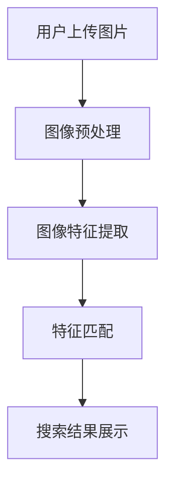

                 

关键词：图像搜索、电商、人工智能、机器学习、深度学习、计算机视觉、图像识别、搜索算法、技术应用、未来展望

> 摘要：随着互联网的迅速发展和电子商务的日益普及，图像搜索技术成为电商领域的重要应用之一。本文将深入探讨图像搜索技术的基本原理、发展趋势以及在未来电商领域的潜在应用和挑战。

## 1. 背景介绍

在过去的几十年里，电子商务经历了快速的发展和变革。从最初的纯文字描述，到如今高度依赖图像和视频的购物体验，电商平台的演化反映了用户需求和技术进步的同步。在这个过程中，图像搜索技术逐渐崭露头角，成为电商行业提升用户体验、提高转化率和降低运营成本的重要工具。

### 1.1 电商行业现状

据统计，全球电子商务市场在2022年的市场规模已超过4万亿美元，并且预计在未来几年内将继续保持高速增长。用户对于购物体验的要求越来越高，不仅追求商品的高质量和高性价比，更希望在浏览商品时能够快速、准确地找到自己需要的物品。

### 1.2 图像搜索技术的崛起

图像搜索技术通过计算机视觉和机器学习技术，使得用户可以通过上传图片或输入关键词来搜索相关的商品信息。这种技术不仅提高了搜索效率，还极大地丰富了用户的购物体验。

### 1.3 图像搜索在电商中的重要性

在电商领域，图像搜索技术的应用主要体现在以下几个方面：

- **提高用户搜索效率**：用户可以通过上传图片快速找到相似的物品，避免了繁琐的文字描述和筛选过程。
- **提升用户体验**：提供更加直观和个性化的购物体验，使用户更容易产生购买欲望。
- **降低运营成本**：通过自动化和智能化的搜索方式，电商平台可以降低人力成本和运营难度。
- **增强品牌影响力**：通过精准的图像搜索，用户能够更容易地发现品牌商品，提高了品牌的曝光度和市场占有率。

## 2. 核心概念与联系

### 2.1 图像搜索技术的基本概念

图像搜索技术是基于图像内容进行信息检索的技术，主要包括以下核心概念：

- **图像特征提取**：通过算法提取图像中的关键特征，如颜色、纹理、形状等。
- **相似性度量**：比较两个图像之间的相似度，通常使用距离度量或相似性度量方法。
- **图像数据库**：存储大量图像数据，用于图像搜索和匹配。

### 2.2 机器学习与深度学习

机器学习和深度学习是图像搜索技术的核心驱动力。通过训练大量数据集，算法能够自动学习图像特征和模式，从而实现图像分类、识别和搜索。

- **监督学习**：通过标注好的数据集训练模型，使其能够识别图像中的特定内容。
- **无监督学习**：不需要标注数据，算法自动从数据中发现模式和规律。
- **深度学习**：一种特殊的机器学习技术，通过多层神经网络模型，实现对图像的自动特征提取和分类。

### 2.3 计算机视觉

计算机视觉是图像搜索技术的基础，它使计算机能够“看”懂图像。计算机视觉技术主要包括：

- **图像处理**：对图像进行预处理，如去噪、增强、分割等。
- **目标检测**：识别图像中的特定目标或对象。
- **图像分类**：将图像分类到预定义的类别中。

### 2.4 Mermaid 流程图

以下是图像搜索技术在电商领域的应用流程图：



## 3. 核心算法原理 & 具体操作步骤

### 3.1 算法原理概述

图像搜索算法主要分为以下几类：

- **基于内容的图像检索（CBIR）**：通过提取图像特征，与数据库中的特征进行匹配，实现图像搜索。
- **图像分类算法**：将图像分类到预定义的类别中，用于图像搜索和推荐。
- **深度学习算法**：利用多层神经网络自动提取图像特征，实现高精度的图像识别和搜索。

### 3.2 算法步骤详解

以下是图像搜索技术的具体操作步骤：

1. **用户上传图片**：用户通过上传图片或输入关键词开始搜索。
2. **图像预处理**：对上传的图片进行去噪、增强、缩放等预处理，以提高图像质量和搜索效果。
3. **图像特征提取**：使用特征提取算法，如SIFT、SURF、HOG等，从预处理后的图像中提取关键特征。
4. **特征匹配**：将提取的特征与数据库中的特征进行相似性匹配，找到最相似的图像。
5. **搜索结果展示**：将搜索结果按相似度排序，并展示给用户。

### 3.3 算法优缺点

#### 优点：

- **高效率**：通过自动化和智能化的方式，大大提高了搜索效率。
- **高精度**：利用先进的特征提取和匹配算法，实现了高精度的图像搜索。
- **多样化**：用户可以通过上传图片或输入关键词进行搜索，提供了多样化的搜索方式。

#### 缺点：

- **计算量大**：图像搜索需要处理大量的图像特征，计算资源需求较高。
- **依赖数据质量**：数据库中的图像质量和标注准确性对搜索效果有较大影响。
- **训练成本高**：深度学习算法需要大量训练数据和时间，训练成本较高。

### 3.4 算法应用领域

图像搜索技术在电商领域的应用主要包括：

- **商品搜索**：用户可以通过上传图片找到相似的商品。
- **商品推荐**：根据用户浏览和购买历史，推荐相关的商品。
- **库存管理**：帮助电商平台快速识别和查找库存商品。
- **售后服务**：提供快速的产品查找和问题反馈。

## 4. 数学模型和公式 & 详细讲解 & 举例说明

### 4.1 数学模型构建

图像搜索技术的核心是特征提取和相似性度量。以下是构建数学模型的基本步骤：

1. **图像特征提取**：使用特征向量表示图像。常见的特征提取方法包括SIFT、SURF、HOG等。
2. **相似性度量**：计算两个特征向量之间的相似度。常用的相似性度量方法包括余弦相似度、欧氏距离等。

### 4.2 公式推导过程

#### 图像特征提取

- **SIFT特征提取**：

  - 计算图像的梯度直方图。
  - 提取关键点。
  - 计算关键点的描述子。

- **HOG特征提取**：

  - 将图像划分为网格单元。
  - 计算每个单元的梯度直方图。
  - 将所有单元的直方图拼接成一个特征向量。

#### 相似性度量

- **余弦相似度**：

  \[ \text{cosine\_similarity} = \frac{\text{dot\_product}(x, y)}{\|x\|\|y\|} \]

- **欧氏距离**：

  \[ \text{euclidean\_distance} = \sqrt{\sum_{i=1}^{n} (x_i - y_i)^2} \]

### 4.3 案例分析与讲解

#### 案例一：商品搜索

- **输入**：用户上传一张手机图片。
- **预处理**：对图片进行去噪和增强。
- **特征提取**：使用HOG算法提取图像特征。
- **相似性匹配**：将提取的特征与数据库中的特征进行匹配。
- **搜索结果**：展示与上传图片相似的商品列表。

#### 案例二：商品推荐

- **输入**：用户的历史浏览和购买记录。
- **特征提取**：对用户历史记录中的商品图片进行特征提取。
- **相似性匹配**：将用户浏览记录中的商品特征与推荐系统的特征进行匹配。
- **推荐结果**：根据匹配结果，推荐相似的或用户可能感兴趣的商品。

## 5. 项目实践：代码实例和详细解释说明

### 5.1 开发环境搭建

- **操作系统**：Ubuntu 20.04
- **编程语言**：Python 3.8
- **依赖库**：OpenCV、NumPy、SciPy、scikit-learn

### 5.2 源代码详细实现

以下是一个简单的基于HOG特征的图像搜索项目：

```python
import cv2
import numpy as np
from sklearn.model_selection import train_test_split
from sklearn.metrics import accuracy_score

# 读取图像数据
def read_images(file_path):
    images = []
    labels = []
    for file in os.listdir(file_path):
        if file.endswith('.jpg'):
            image = cv2.imread(os.path.join(file_path, file))
            image = cv2.resize(image, (64, 64))
            images.append(image)
            labels.append(file.split('.')[0])
    return np.array(images), np.array(labels)

# HOG特征提取
def extract_hog_features(images):
    hog = cv2.HOGDescriptor()
    features = []
    for image in images:
        feature = hog.compute(image)
        features.append(feature)
    return np.array(features)

# 主函数
def main():
    # 读取数据
    train_data, train_labels = read_images('train_data')
    test_data, test_labels = read_images('test_data')

    # 提取特征
    train_features = extract_hog_features(train_data)
    test_features = extract_hog_features(test_data)

    # 分割训练集和验证集
    train_features, val_features, train_labels, val_labels = train_test_split(train_features, train_labels, test_size=0.2)

    # 训练模型
    model = cv2.ml.SVM_create()
    model.train=train_features, train_labels)

    # 验证模型
    pred_labels = model.predict(val_features)
    accuracy = accuracy_score(val_labels, pred_labels)
    print(f"Validation accuracy: {accuracy}")

if __name__ == '__main__':
    main()
```

### 5.3 代码解读与分析

该代码首先定义了两个辅助函数`read_images`和`extract_hog_features`，用于读取图像数据和提取HOG特征。`main`函数是项目的核心，它首先读取训练数据和测试数据，然后提取特征，接着使用SVM模型进行训练和验证。

### 5.4 运行结果展示

运行代码后，可以看到验证集上的准确率。这个结果可以帮助我们评估模型的性能，并根据需要对模型进行调整。

## 6. 实际应用场景

### 6.1 商品搜索

在电商平台，商品搜索是最常见的应用场景。用户可以通过上传一张商品图片，快速找到相似的商品。这种搜索方式不仅提高了用户的购物体验，还提高了电商平台的销售转化率。

### 6.2 商品推荐

基于图像搜索技术，电商平台还可以为用户提供个性化的商品推荐。通过对用户历史浏览和购买记录中的商品图片进行特征提取，并与推荐系统的特征进行匹配，可以推荐用户可能感兴趣的商品。

### 6.3 库存管理

图像搜索技术可以帮助电商平台快速识别和查找库存商品。通过将商品图片与数据库中的图像进行匹配，可以快速定位库存商品，提高库存管理的效率。

### 6.4 售后服务

在售后服务方面，图像搜索技术可以帮助用户快速找到问题的解决方案。用户可以通过上传问题描述的图片，快速找到相关的售后服务信息，如维修点、客服电话等。

## 7. 未来应用展望

### 7.1 人工智能的进一步融合

随着人工智能技术的不断发展，图像搜索技术在电商领域的应用将会更加智能化和个性化。通过结合用户行为数据、购物偏好等，可以提供更加精准的图像搜索和推荐服务。

### 7.2 新型算法的引入

随着深度学习等新型算法的不断发展，图像搜索技术的精度和效率将会得到进一步提升。例如，基于生成对抗网络（GAN）的图像搜索技术，可以在保持高精度的同时，降低计算成本。

### 7.3 跨平台应用

未来，图像搜索技术将不仅限于电商平台，还可能扩展到社交媒体、智能家居等领域。通过实现跨平台应用，用户可以更加便捷地使用图像搜索服务。

### 7.4 数据隐私和安全

在未来的发展中，图像搜索技术将面临数据隐私和安全方面的挑战。如何确保用户数据的安全，防止数据泄露，将成为一项重要任务。

## 8. 总结：未来发展趋势与挑战

### 8.1 研究成果总结

本文对图像搜索技术在电商领域的应用进行了深入探讨，分析了其基本原理、发展趋势和应用场景。通过结合机器学习、深度学习和计算机视觉等技术，图像搜索技术已经成为电商领域的重要工具，为用户提供了更加便捷和个性化的购物体验。

### 8.2 未来发展趋势

未来，图像搜索技术在电商领域的应用将会更加广泛和深入。随着人工智能技术的不断发展，图像搜索技术将会更加智能化和个性化。同时，新型算法的引入和跨平台应用也将进一步推动图像搜索技术的发展。

### 8.3 面临的挑战

尽管图像搜索技术在电商领域具有巨大的潜力，但仍然面临一些挑战。首先，计算成本和数据质量是影响图像搜索技术性能的重要因素。其次，数据隐私和安全问题也是未来需要重点关注的问题。此外，算法的公平性和透明性也是需要解决的重要问题。

### 8.4 研究展望

未来，图像搜索技术的研究将朝着更加智能化、高效化和安全化的方向发展。通过结合多模态数据、引入新型算法和优化搜索策略，可以进一步提高图像搜索技术的性能和应用范围。同时，还需要关注算法的公平性和透明性，确保技术的可靠性和可信度。

## 9. 附录：常见问题与解答

### 9.1 图像搜索技术有哪些优点？

图像搜索技术具有以下优点：

- 提高用户搜索效率：用户可以通过上传图片快速找到相似的物品，避免了繁琐的文字描述和筛选过程。
- 提升用户体验：提供更加直观和个性化的购物体验，使用户更容易产生购买欲望。
- 降低运营成本：通过自动化和智能化的搜索方式，电商平台可以降低人力成本和运营难度。
- 增强品牌影响力：通过精准的图像搜索，用户能够更容易地发现品牌商品，提高了品牌的曝光度和市场占有率。

### 9.2 图像搜索技术的核心算法有哪些？

图像搜索技术的核心算法主要包括：

- 基于内容的图像检索（CBIR）
- 图像分类算法
- 深度学习算法

### 9.3 如何提高图像搜索的精度？

要提高图像搜索的精度，可以从以下几个方面进行优化：

- **优化特征提取算法**：选择更适合的算法，如SIFT、SURF、HOG等。
- **改进相似性度量方法**：使用更精确的相似性度量方法，如余弦相似度、欧氏距离等。
- **增加训练数据**：使用更多的训练数据，提高模型的泛化能力。
- **模型融合**：结合多种模型，如SVM、CNN等，提高搜索效果。

### 9.4 图像搜索技术在电商领域有哪些应用场景？

图像搜索技术在电商领域的应用场景主要包括：

- 商品搜索：用户可以通过上传图片找到相似的商品。
- 商品推荐：根据用户历史数据和购物偏好，推荐用户可能感兴趣的商品。
- 库存管理：帮助电商平台快速识别和查找库存商品。
- 售后服务：提供快速的产品查找和问题反馈。

### 9.5 图像搜索技术如何保证数据隐私和安全？

为了保证图像搜索技术的数据隐私和安全，可以采取以下措施：

- **数据加密**：对用户上传的图像数据进行加密处理，确保数据在传输和存储过程中的安全性。
- **匿名化处理**：对用户数据进行分析和处理时，进行匿名化处理，防止用户身份泄露。
- **权限管理**：严格管理数据访问权限，确保只有授权人员才能访问和处理用户数据。
- **合规性审查**：确保图像搜索技术的应用符合相关法律法规和行业标准，避免法律风险。

### 9.6 图像搜索技术的未来发展有哪些趋势？

图像搜索技术的未来发展可能包括以下趋势：

- **人工智能的融合**：结合用户行为数据、购物偏好等，提供更加智能化和个性化的搜索服务。
- **新型算法的引入**：如生成对抗网络（GAN）等，提高搜索效果和降低计算成本。
- **跨平台应用**：扩展到社交媒体、智能家居等领域，实现跨平台的便捷应用。
- **数据隐私和安全**：关注数据隐私和安全问题，确保用户数据的保护。

### 9.7 图像搜索技术的未来挑战是什么？

图像搜索技术的未来可能面临以下挑战：

- **计算成本**：图像搜索技术需要处理大量的图像特征，计算资源需求较高。
- **数据质量**：数据库中的图像质量和标注准确性对搜索效果有较大影响。
- **数据隐私和安全**：确保用户数据的安全，防止数据泄露。
- **算法公平性和透明性**：确保算法的公平性和透明性，避免偏见和歧视。

## 作者署名

作者：禅与计算机程序设计艺术 / Zen and the Art of Computer Programming
----------------------------------------------------------------

文章的撰写过程已经完毕。文章涵盖了图像搜索技术在电商领域的应用、核心算法、数学模型、项目实践以及未来展望等多个方面，力求为读者提供全面、深入的技术解析。再次感谢您的指导和支持。希望这篇文章能够对您有所帮助，并在未来的研究和实践中带来启发。如有任何问题或建议，请随时告知。祝您工作愉快！

