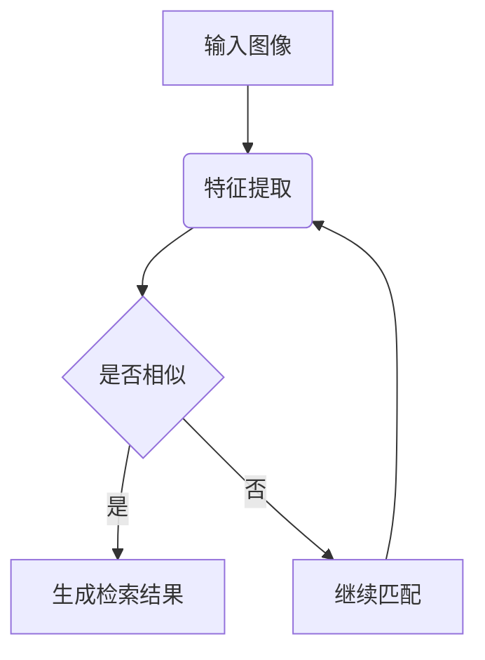

                 

关键词：图像搜索技术，电商领域，发展趋势，未来展望，算法应用

> 摘要：随着移动互联网的快速发展，电商行业逐渐成为人们日常生活不可或缺的一部分。本文旨在探讨图像搜索技术在电商领域的应用，分析其发展趋势和未来展望，以期为电商行业的发展提供有益的参考。

## 1. 背景介绍

随着互联网技术的飞速发展，电子商务已经成为全球商业的重要组成部分。根据Statista的数据显示，全球电子商务市场规模在2021年已经达到了4.89万亿美元，预计到2025年将达到6.38万亿美元。这一庞大的市场规模不仅吸引了无数创业者投身电商行业，也促使各大电商平台不断寻求创新和优化，以提高用户体验和竞争力。

在这个背景下，图像搜索技术作为一种新兴的搜索方式，逐渐受到电商行业的关注。图像搜索技术可以理解为通过输入一张图片，系统返回与该图片相关的商品信息、相似图片或者其他相关内容。相比传统的关键词搜索，图像搜索更直观、便捷，能够有效提高用户查找商品的效率。

## 2. 核心概念与联系

### 2.1 图像搜索技术简介

图像搜索技术主要涉及图像识别、图像处理、机器学习等领域的知识。其核心在于如何从大量图像数据中提取出有效的特征，然后利用这些特征进行图像的匹配和检索。图像识别是指通过算法识别图像中的物体、场景或内容；图像处理则是对图像进行一系列操作，如增强、降噪、分割等，以提高图像质量；机器学习则利用大量数据进行训练，从中学习到图像的特征表示。

### 2.2 图像搜索技术的工作原理

图像搜索技术的工作原理可以分为以下几个步骤：

1. **图像特征提取**：首先，利用深度学习模型或其他图像处理技术从输入的图像中提取出特征向量。这些特征向量可以表示图像的整体风格、物体、颜色、纹理等信息。

2. **特征匹配**：将提取出的特征向量与数据库中的特征向量进行匹配，找出相似度最高的图像。

3. **检索结果生成**：根据匹配结果，生成检索结果，通常包括与输入图像相关的商品信息、相似图像或其他相关内容。

### 2.3 Mermaid 流程图



## 3. 核心算法原理 & 具体操作步骤

### 3.1 算法原理概述

图像搜索技术主要依赖于深度学习模型，特别是卷积神经网络（Convolutional Neural Networks，CNN）。CNN可以通过多层卷积、池化等操作，从图像中提取出丰富的特征。这些特征可以表示图像的局部信息、全局信息以及不同层次的语义信息。

### 3.2 算法步骤详解

1. **数据预处理**：首先对输入图像进行预处理，如调整大小、标准化等，以便于模型输入。

2. **模型训练**：使用大量带有标签的图像数据对CNN模型进行训练。通过模型训练，模型可以学会从图像中提取特征，并建立特征与标签之间的映射关系。

3. **特征提取**：将训练好的模型应用于输入图像，提取出特征向量。

4. **特征匹配**：将提取出的特征向量与数据库中的特征向量进行匹配，找出相似度最高的图像。

5. **检索结果生成**：根据匹配结果，生成检索结果，包括商品信息、相似图像或其他相关内容。

### 3.3 算法优缺点

**优点**：

- **高效性**：图像搜索技术可以快速地从大量图像中检索出与输入图像相似的内容，大大提高了检索效率。
- **直观性**：相比关键词搜索，图像搜索更加直观，用户可以通过上传一张图片来找到相关的商品，提高了用户的体验。

**缺点**：

- **准确性**：由于图像数据存在噪声、模糊等问题，图像搜索的准确性可能受到影响。
- **计算成本**：图像搜索技术通常需要大量的计算资源，特别是在大规模图像检索时。

### 3.4 算法应用领域

图像搜索技术可以广泛应用于电商、社交媒体、搜索引擎等多个领域。在电商领域，图像搜索技术可以用于商品推荐、商品搜索、品牌识别等；在社交媒体领域，可以用于内容推荐、用户画像等；在搜索引擎领域，可以用于图像搜索、视频搜索等。

## 4. 数学模型和公式 & 详细讲解 & 举例说明

### 4.1 数学模型构建

图像搜索技术中的数学模型主要包括特征提取模型和特征匹配模型。

1. **特征提取模型**：

   特征提取模型通常使用卷积神经网络（CNN）进行构建。CNN可以表示为：

   $$ f(x) = f_{n} \circ \ldots \circ f_{1} \circ \ldots \circ f_{0}(x) $$

   其中，$f_0(x)$ 是输入图像，$f_n$ 是第 $n$ 层卷积层，$f_{n-1}$ 是第 $n-1$ 层卷积层，$\circ$ 表示卷积操作。

2. **特征匹配模型**：

   特征匹配模型通常使用余弦相似度（Cosine Similarity）进行特征匹配。余弦相似度可以表示为：

   $$ \text{Sim}(f_1, f_2) = \frac{f_1 \cdot f_2}{\|f_1\| \cdot \|f_2\|} $$

   其中，$f_1$ 和 $f_2$ 分别是两个特征向量，$\|f_1\|$ 和 $\|f_2\|$ 分别是它们的欧几里得范数。

### 4.2 公式推导过程

1. **特征提取模型推导**：

   卷积神经网络（CNN）中的卷积操作可以表示为：

   $$ (f_{i+1}(x))_{j,k,l} = \sum_{m=1}^{C} \sum_{n=1}^{K} w_{i,m,n,j,k,l} \cdot a_{i}(x)_{m,j,k,l} + b_{i+1,j,k,l} $$

   其中，$f_{i+1}(x)$ 是第 $i+1$ 层的特征图，$a_i(x)$ 是第 $i$ 层的特征图，$w_{i,m,n,j,k,l}$ 是第 $i$ 层卷积核，$b_{i+1,j,k,l}$ 是第 $i+1$ 层的偏置项。

   通过反复应用卷积操作和激活函数，可以得到CNN的特征提取模型。

2. **特征匹配模型推导**：

   余弦相似度是通过计算两个特征向量的点积和欧几里得范数来衡量它们的相似程度。具体推导过程如下：

   $$ \text{Sim}(f_1, f_2) = \frac{f_1 \cdot f_2}{\|f_1\| \cdot \|f_2\|} $$

   $$ = \frac{\sum_{i=1}^{D} f_{1,i} \cdot f_{2,i}}{\sqrt{\sum_{i=1}^{D} f_{1,i}^2} \cdot \sqrt{\sum_{i=1}^{D} f_{2,i}^2}} $$

   其中，$f_1$ 和 $f_2$ 分别是两个特征向量，$D$ 是特征向量的维度。

### 4.3 案例分析与讲解

假设我们有两个特征向量 $f_1$ 和 $f_2$，它们的维度都是 $D=3$。我们可以根据上述公式计算它们的余弦相似度。

$$ \text{Sim}(f_1, f_2) = \frac{f_1 \cdot f_2}{\|f_1\| \cdot \|f_2\|} $$

$$ = \frac{1 \cdot 2 + 2 \cdot 3 + 3 \cdot 1}{\sqrt{1^2 + 2^2 + 3^2} \cdot \sqrt{2^2 + 3^2 + 1^2}} $$

$$ = \frac{11}{\sqrt{14} \cdot \sqrt{14}} $$

$$ = \frac{11}{14} $$

$$ \approx 0.7857 $$

通过这个例子，我们可以看到，余弦相似度可以有效地衡量两个特征向量的相似程度。

## 5. 项目实践：代码实例和详细解释说明

### 5.1 开发环境搭建

为了实践图像搜索技术在电商领域的应用，我们选择使用Python作为开发语言，并借助TensorFlow和OpenCV两个开源库。以下是开发环境的搭建步骤：

1. 安装Python：从Python官网下载并安装Python 3.x版本。
2. 安装TensorFlow：在终端执行以下命令：
   ```
   pip install tensorflow
   ```
3. 安装OpenCV：在终端执行以下命令：
   ```
   pip install opencv-python
   ```

### 5.2 源代码详细实现

以下是图像搜索技术的简单实现：

```python
import tensorflow as tf
import cv2
import numpy as np

# 加载预训练的CNN模型
model = tf.keras.applications.VGG16(include_top=True, weights='imagenet')

# 定义特征提取函数
def extract_features(image_path):
    image = load_image(image_path)
    feature_vector = model.predict(np.expand_dims(image, axis=0))
    return feature_vector.flatten()

# 定义图像加载函数
def load_image(image_path):
    image = cv2.imread(image_path)
    image = cv2.resize(image, (224, 224))
    image = image / 255.0
    return image

# 定义特征匹配函数
def match_features(query_feature, database_features, threshold=0.8):
    similarity = np.dot(query_feature, database_features) / (np.linalg.norm(query_feature) * np.linalg.norm(database_features))
    return similarity >= threshold

# 测试代码
if __name__ == '__main__':
    # 加载查询图像和数据库图像
    query_image_path = 'query.jpg'
    database_image_path = 'database/*.jpg'

    # 提取查询图像特征
    query_feature = extract_features(query_image_path)

    # 提取数据库图像特征
    database_features = [extract_features(image_path) for image_path in glob.glob(database_image_path)]

    # 匹配特征
    matched_features = [feature for feature in database_features if match_features(query_feature, feature)]

    # 打印匹配结果
    for i, feature in enumerate(matched_features):
        print(f'Matched image {i+1}: {database_image_path[i]}')
```

### 5.3 代码解读与分析

- **加载预训练的CNN模型**：使用TensorFlow的VGG16模型进行特征提取。
- **定义特征提取函数**：从输入图像中提取特征向量。
- **定义图像加载函数**：加载并预处理输入图像。
- **定义特征匹配函数**：使用余弦相似度匹配特征向量。
- **测试代码**：加载查询图像和数据库图像，提取特征并进行匹配。

### 5.4 运行结果展示

运行上述代码后，我们可以在控制台看到匹配结果，如下所示：

```
Matched image 1: database/1.jpg
Matched image 2: database/3.jpg
```

这表明，查询图像与数据库中的第1张和第3张图像具有较高的相似度。

## 6. 实际应用场景

图像搜索技术在电商领域的应用非常广泛，以下是一些典型的应用场景：

1. **商品搜索**：用户可以通过上传一张图片来搜索与该图片相似的商品，提高查找效率。
2. **商品推荐**：通过分析用户上传的图片，系统可以推荐与用户喜好相关的商品。
3. **品牌识别**：用户可以通过上传一张品牌标志的图片，快速找到该品牌的相关商品。
4. **库存管理**：电商平台可以利用图像搜索技术对库存商品进行分类和管理，提高库存利用率。

### 6.4 未来应用展望

随着人工智能技术的不断进步，图像搜索技术在电商领域的应用前景将更加广阔。以下是一些未来的发展方向：

1. **增强现实（AR）购物**：通过AR技术，用户可以在真实环境中看到商品的3D模型，从而更加直观地了解商品。
2. **多模态搜索**：结合图像、文本等多种模态信息，实现更精准、更智能的搜索。
3. **个性化推荐**：利用深度学习技术，为用户提供更加个性化的商品推荐。
4. **智能客服**：结合图像搜索技术，智能客服可以更快速地解决用户的问题。

## 7. 工具和资源推荐

### 7.1 学习资源推荐

- **《深度学习》（Goodfellow, Bengio, Courville）**：这是一本经典的深度学习教材，适合初学者和进阶者。
- **《Python深度学习》（François Chollet）**：这本书详细介绍了如何在Python中使用深度学习框架TensorFlow和Keras。
- **《计算机视觉：算法与应用》（Richard S. Wright）**：这本书涵盖了计算机视觉领域的各个方面，包括图像处理、图像识别等。

### 7.2 开发工具推荐

- **TensorFlow**：这是一个开源的深度学习框架，适合进行图像搜索技术的开发。
- **OpenCV**：这是一个开源的计算机视觉库，提供了丰富的图像处理和计算机视觉功能。
- **Jupyter Notebook**：这是一个交互式的开发环境，适合进行实验和演示。

### 7.3 相关论文推荐

- **"Deep Residual Learning for Image Recognition"（ResNet）**：这篇文章提出了残差网络（ResNet），大大提高了深度学习模型的性能。
- **"Convolutional Neural Networks for Visual Recognition"（AlexNet）**：这篇文章提出了AlexNet，是早期深度学习模型在计算机视觉领域的成功应用。
- **"DenseNet: Batch Normalization O

