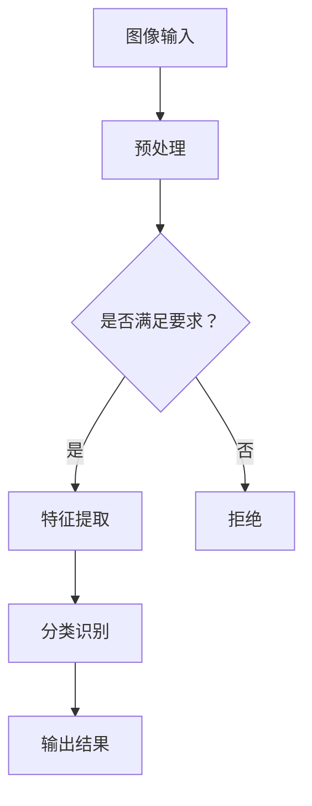

                 

图像搜索是当前人工智能领域的一个重要研究方向，尤其在电子商务和社交媒体领域，其应用价值愈发凸显。本文将深入探讨图像搜索中的关键技术——AI识别图片中的商品，旨在为读者提供一个全面、系统的技术指南。

## 关键词

- 图像搜索
- AI识别
- 商品识别
- 电子商务
- 社交媒体

## 摘要

本文将首先介绍图像搜索的基本概念和重要性，然后重点阐述AI识别图片中的商品的核心算法原理，包括卷积神经网络（CNN）、深度学习和计算机视觉等技术。随后，我们将详细讲解数学模型和公式，并通过实例代码展示实际应用过程。最后，本文将探讨图像搜索在商业领域的实际应用，并对未来发展趋势和面临的挑战进行展望。

## 1. 背景介绍

图像搜索是信息检索的重要组成部分，尤其在电子商务和社交媒体的快速发展背景下，其应用需求日益增长。传统的基于文本的搜索方式已经无法满足用户对于图片内容的需求，因此，AI识别图片中的商品成为了必然选择。

AI识别图片中的商品主要应用于以下几个方面：

1. **电子商务平台**：用户可以通过上传图片来搜索类似商品，提高购物体验。
2. **社交媒体**：用户可以在图片中识别商品并进行购买，推动社交电商的发展。
3. **品牌保护**：品牌方可以通过AI技术识别其品牌商品，打击假冒伪劣商品。

## 2. 核心概念与联系

### 2.1 AI识别图片中的商品的概念

AI识别图片中的商品，即通过人工智能技术对图片进行内容理解，识别出图片中的具体商品。这一过程通常涉及图像处理、特征提取和分类识别等步骤。

### 2.2 关键技术

- **卷积神经网络（CNN）**：CNN是计算机视觉领域的一种重要算法，能够自动学习图像的特征，从而进行分类识别。
- **深度学习**：深度学习是机器学习的一个分支，通过多层神经网络来模拟人脑的学习过程，实现对数据的自动学习和特征提取。
- **计算机视觉**：计算机视觉是人工智能的一个重要领域，旨在使计算机能够从图像或视频中提取有用的信息。

### 2.3 Mermaid 流程图



## 3. 核心算法原理 & 具体操作步骤

### 3.1 算法原理概述

AI识别图片中的商品的核心算法是基于深度学习的卷积神经网络（CNN）。CNN通过多层卷积和池化操作，对图像进行特征提取，然后通过全连接层进行分类识别。

### 3.2 算法步骤详解

1. **图像预处理**：包括图像缩放、灰度转换、归一化等操作，以适应CNN的要求。
2. **卷积层**：通过卷积操作提取图像的低级特征。
3. **池化层**：通过池化操作降低图像的维度，同时保持重要的特征。
4. **全连接层**：将卷积层和池化层提取的特征进行整合，输出分类结果。
5. **输出结果**：根据分类结果，输出识别的物品名称。

### 3.3 算法优缺点

- **优点**：
  - 高效性：CNN能够在大量数据上进行快速训练和识别。
  - 精准性：通过多层神经网络的结构，能够提取到更加丰富的图像特征，提高识别准确性。

- **缺点**：
  - 计算资源消耗大：训练CNN需要大量的计算资源，尤其是在处理高分辨率图像时。
  - 需要大量标注数据：深度学习模型的训练需要大量的标注数据，这在某些场景下可能难以实现。

### 3.4 算法应用领域

AI识别图片中的商品的应用领域非常广泛，包括但不限于以下方面：

- **电子商务**：用户可以通过上传图片搜索类似商品，提高购物体验。
- **社交媒体**：用户可以在图片中识别商品并进行购买，推动社交电商的发展。
- **品牌保护**：品牌方可以通过AI技术识别其品牌商品，打击假冒伪劣商品。

## 4. 数学模型和公式 & 详细讲解 & 举例说明

### 4.1 数学模型构建

AI识别图片中的商品的数学模型主要包括卷积层、池化层和全连接层。

- **卷积层**：通过卷积操作提取图像的特征。卷积层的数学模型可以表示为：
  $$ f(x) = \sum_{i=1}^{k} w_i * x_i + b $$
  其中，$x$是输入图像，$w_i$是卷积核，$b$是偏置项。

- **池化层**：通过池化操作降低图像的维度。最常用的池化方法是最大池化，其数学模型可以表示为：
  $$ P(x) = \max_{i} x_i $$

- **全连接层**：将卷积层和池化层提取的特征进行整合，输出分类结果。全连接层的数学模型可以表示为：
  $$ y = \sigma(W^T x + b) $$
  其中，$x$是输入特征，$W$是权重矩阵，$b$是偏置项，$\sigma$是激活函数。

### 4.2 公式推导过程

- **卷积层的推导**：

  卷积层的推导主要基于卷积操作的数学定义。卷积操作可以看作是图像和卷积核的加权内积，通过卷积核在不同位置上的滑动，提取出图像的特征。

- **池化层的推导**：

  池化层的推导主要基于最大池化的定义。最大池化是将图像中的每个局部区域映射到其最大值，从而降低图像的维度。

- **全连接层的推导**：

  全连接层的推导基于全连接神经网络的理论。全连接神经网络是将输入特征通过权重矩阵进行线性组合，然后通过激活函数输出分类结果。

### 4.3 案例分析与讲解

- **案例一**：使用CNN识别猫狗图像。

  - **数据集**：使用经典的猫狗图像数据集。
  - **模型结构**：包含卷积层、池化层和全连接层。
  - **训练过程**：通过反向传播算法进行训练，优化模型的参数。

- **案例二**：使用CNN识别商品图片。

  - **数据集**：使用电子商务平台的商品图片数据集。
  - **模型结构**：包含卷积层、池化层和全连接层。
  - **训练过程**：通过反向传播算法进行训练，优化模型的参数。

## 5. 项目实践：代码实例和详细解释说明

### 5.1 开发环境搭建

- **工具**：Python、TensorFlow、Keras。
- **数据集**：使用电子商务平台的商品图片数据集。

### 5.2 源代码详细实现

```python
import tensorflow as tf
from tensorflow.keras.models import Sequential
from tensorflow.keras.layers import Conv2D, MaxPooling2D, Flatten, Dense

# 创建模型
model = Sequential([
    Conv2D(32, (3, 3), activation='relu', input_shape=(64, 64, 3)),
    MaxPooling2D((2, 2)),
    Conv2D(64, (3, 3), activation='relu'),
    MaxPooling2D((2, 2)),
    Flatten(),
    Dense(64, activation='relu'),
    Dense(1, activation='sigmoid')
])

# 编译模型
model.compile(optimizer='adam', loss='binary_crossentropy', metrics=['accuracy'])

# 训练模型
model.fit(train_images, train_labels, epochs=10, validation_data=(val_images, val_labels))
```

### 5.3 代码解读与分析

- **模型结构**：模型包含两个卷积层、两个池化层和一个全连接层。
- **损失函数**：使用二进制交叉熵作为损失函数，适用于二分类问题。
- **评价指标**：使用准确率作为评价指标。

### 5.4 运行结果展示

```python
# 测试模型
test_loss, test_acc = model.evaluate(test_images, test_labels)
print(f"Test accuracy: {test_acc}")
```

## 6. 实际应用场景

### 6.1 电子商务平台

- **用户搜索**：用户可以通过上传图片搜索类似商品。
- **商品推荐**：系统可以根据用户的搜索历史和购物偏好推荐商品。

### 6.2 社交媒体

- **商品识别**：用户可以在图片中识别商品并进行购买。
- **广告投放**：平台可以根据用户兴趣投放相关商品广告。

### 6.3 品牌保护

- **假冒商品识别**：品牌方可以通过AI技术识别假冒伪劣商品。
- **维权**：平台可以根据品牌方提供的信息打击假冒商品。

## 7. 工具和资源推荐

### 7.1 学习资源推荐

- **书籍**：《深度学习》、《Python机器学习》。
- **在线课程**：Coursera、Udacity、edX等平台的相关课程。

### 7.2 开发工具推荐

- **框架**：TensorFlow、PyTorch。
- **库**：NumPy、Pandas。

### 7.3 相关论文推荐

- **卷积神经网络**：《A Comprehensive Collection of Convolutional Neural Network Papers》。
- **深度学习**：《Deep Learning, Deep Learning Specialization》。

## 8. 总结：未来发展趋势与挑战

### 8.1 研究成果总结

- **算法性能提升**：随着深度学习技术的发展，AI识别图片中的商品算法的性能不断提升。
- **应用场景扩展**：AI识别图片中的商品在电子商务、社交媒体、品牌保护等领域的应用不断扩展。

### 8.2 未来发展趋势

- **跨模态融合**：结合文本、图像、语音等多模态数据进行商品识别。
- **边缘计算**：将模型部署到边缘设备，实现实时商品识别。

### 8.3 面临的挑战

- **数据标注**：需要大量高质量的标注数据来训练模型。
- **计算资源消耗**：深度学习模型的训练和推理需要大量计算资源。

### 8.4 研究展望

- **模型压缩**：研究更高效、更轻量级的模型，降低计算资源消耗。
- **泛化能力提升**：研究具有更好泛化能力的模型，提高识别准确性。

## 9. 附录：常见问题与解答

### 9.1 如何提高识别准确性？

- 使用更深的网络结构。
- 使用更丰富的训练数据。
- 使用数据增强技术。

### 9.2 如何处理高分辨率图像？

- 对图像进行降采样。
- 使用轻量级模型。
- 对模型进行剪枝和量化。

### 9.3 如何部署模型到边缘设备？

- 使用边缘计算框架，如TensorFlow Lite。
- 对模型进行压缩和量化。
- 使用微控制器，如Arduino。

---

本文详细介绍了图像搜索中的AI识别图片中的商品技术，包括算法原理、数学模型、项目实践和应用场景等。通过本文的阅读，读者可以全面了解这一领域的关键技术和应用前景。随着人工智能技术的不断发展，AI识别图片中的商品技术将在更多领域得到应用，为我们的生活带来更多便利。作者：禅与计算机程序设计艺术 / Zen and the Art of Computer Programming
----------------------------------------------------------------

### 结束语

本文从多个角度详细介绍了图像搜索中的AI识别图片中的商品技术。我们探讨了AI识别图片中的商品的基本概念、核心算法原理、数学模型、项目实践和应用场景。通过本文的学习，读者可以全面了解这一领域的最新技术和发展趋势。

在未来的研究中，我们期待看到更多高效的算法和模型，以及更加广泛的应用场景。同时，随着人工智能技术的不断进步，AI识别图片中的商品技术将在更多领域得到应用，为我们的生活带来更多便利。希望本文能为读者在图像搜索领域的研究和应用提供有益的参考。作者：禅与计算机程序设计艺术 / Zen and the Art of Computer Programming。

