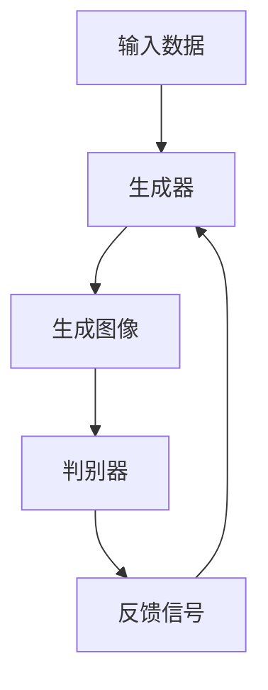

                 

### 1. 背景介绍

图像生成（Image Generation）是计算机视觉和人工智能领域的热点研究课题。随着深度学习技术的发展，图像生成技术取得了显著的突破，广泛应用于虚拟现实、图像编辑、动漫设计、游戏开发等多个领域。图像生成的主要目的是通过计算机算法自动生成具有真实感的图像或视频，而不是简单地复制现有的图像。

图像生成技术可以分为以下几类：

1. **基于传统图形学的图像生成**：这类方法主要依赖于图形渲染管线，通过计算机图形学中的几何变换、纹理映射等手段生成图像。

2. **基于统计模型的图像生成**：这类方法利用统计学方法，如马尔可夫模型、隐马尔可夫模型等，通过学习图像中的统计规律来生成图像。

3. **基于生成对抗网络（GAN）的图像生成**：生成对抗网络是一种新型的深度学习模型，通过两个神经网络（生成器和判别器）的对抗训练，实现图像的高质量生成。

本文将重点关注生成对抗网络（GAN）的图像生成技术，详细介绍其原理、数学模型以及实际应用。在后续章节中，我们将通过代码实例来展示如何实现图像生成。

### 2. 核心概念与联系

为了更好地理解图像生成技术，我们需要先了解一些核心概念和它们之间的关系。以下是图像生成中的关键概念及其相互关系：

- **图像**：图像是视觉感知的基本单位，由像素组成，每个像素表示一个颜色值。
- **深度学习**：深度学习是一种基于多层神经网络的机器学习技术，通过训练可以从大量数据中自动学习特征。
- **生成对抗网络（GAN）**：GAN是一种由生成器和判别器组成的深度学习模型，通过对抗训练实现图像的生成。

下面是核心概念和架构的Mermaid流程图：



**流程解释**：
1. **输入数据**：生成器接收输入数据（如随机噪声向量）。
2. **生成图像**：生成器通过学习生成具有真实感的图像。
3. **判别器**：判别器接收真实图像和生成图像，并判断其真实程度。
4. **反馈信号**：判别器将判断结果作为反馈信号传递给生成器，生成器根据反馈信号调整其生成策略。
5. **迭代训练**：上述过程不断迭代，直到生成器生成高质量的图像。

### 3. 核心算法原理 & 具体操作步骤

#### 3.1 算法原理概述

生成对抗网络（GAN）由两部分组成：生成器和判别器。生成器的任务是生成逼真的图像，而判别器的任务是区分真实图像和生成图像。两个网络通过对抗训练相互竞争，达到最终平衡，生成高质量的图像。

#### 3.2 算法步骤详解

1. **初始化生成器和判别器**：通常生成器和判别器都是多层全连接神经网络。

2. **生成器训练**：
   - 生成器接收随机噪声向量作为输入，通过多层神经网络生成图像。
   - 生成器尝试生成图像以欺骗判别器，使判别器难以区分生成图像和真实图像。

3. **判别器训练**：
   - 判别器接收真实图像和生成图像，并输出它们属于真实图像的概率。
   - 判别器尝试提高对生成图像的识别能力，降低对真实图像的识别误差。

4. **对抗训练**：生成器和判别器通过以下公式不断迭代更新：
   - 判别器损失函数：$L_D(\theta_D) = -[\mathbb{E}_{x \sim p_data(x)} \log(D(x)) + \mathbb{E}_{z \sim p_z(z)} \log(1 - D(G(z)))]$
   - 生成器损失函数：$L_G(\theta_G) = \mathbb{E}_{z \sim p_z(z)} \log(D(G(z)))$

#### 3.3 算法优缺点

**优点**：
- GAN具有自适应性，可以生成多样化且高质量的图像。
- GAN不需要对图像进行标签化处理，非常适合无监督学习。

**缺点**：
- GAN训练不稳定，容易陷入模式崩溃（mode collapse）问题。
- GAN难以平衡生成器和判别器的训练，可能导致其中一个网络过强或过弱。

#### 3.4 算法应用领域

GAN技术已广泛应用于以下领域：
- **图像修复**：通过GAN可以自动修复破损或模糊的图像。
- **超分辨率**：GAN可以提升图像的分辨率，使其更加清晰。
- **风格迁移**：GAN可以学习图像的风格并应用于其他图像，如将普通照片转换成艺术品风格。
- **生成新图像**：GAN可以生成全新的、以前从未见过的图像。

### 4. 数学模型和公式 & 详细讲解 & 举例说明

#### 4.1 数学模型构建

生成对抗网络的核心是生成器和判别器，它们分别通过以下数学模型定义：

**生成器模型**：$G(z) = \text{Generator}(z;\theta_G)$，其中$z$为随机噪声向量，$G(z)$为生成的图像。

**判别器模型**：$D(x) = \text{Discriminator}(x;\theta_D)$，其中$x$为真实图像。

**损失函数**：

- **判别器损失函数**：$L_D(\theta_D) = -[\mathbb{E}_{x \sim p_data(x)} \log(D(x)) + \mathbb{E}_{z \sim p_z(z)} \log(1 - D(G(z)))]$
- **生成器损失函数**：$L_G(\theta_G) = \mathbb{E}_{z \sim p_z(z)} \log(D(G(z)))$

#### 4.2 公式推导过程

生成对抗网络通过优化上述损失函数来实现图像生成。具体推导过程如下：

1. **初始化生成器和判别器**：生成器和判别器分别通过随机权重初始化。

2. **生成器训练**：生成器通过学习生成图像，使其难以被判别器识别。训练过程中，生成器的损失函数不断减小。

3. **判别器训练**：判别器通过学习区分真实图像和生成图像。训练过程中，判别器的损失函数不断减小。

4. **交替训练**：生成器和判别器交替训练，直到生成器生成的图像质量达到预期。

#### 4.3 案例分析与讲解

以下是一个简单的GAN图像生成的案例：

**输入数据**：随机噪声向量$z$。

**生成器模型**：多层感知机（MLP），输入层和输出层分别为$100$个神经元。

**判别器模型**：多层感知机（MLP），输入层和输出层分别为$100$个神经元。

**损失函数**：

- **判别器损失函数**：$L_D(\theta_D) = -[\mathbb{E}_{x \sim p_data(x)} \log(D(x)) + \mathbb{E}_{z \sim p_z(z)} \log(1 - D(G(z)))]$
- **生成器损失函数**：$L_G(\theta_G) = \mathbb{E}_{z \sim p_z(z)} \log(D(G(z)))$

**训练过程**：

1. 初始化生成器和判别器权重。
2. 从数据集中随机抽取一批真实图像$x$和标签$y$。
3. 生成随机噪声向量$z$，通过生成器生成图像$G(z)$。
4. 计算判别器的损失函数，并更新判别器权重。
5. 计算生成器的损失函数，并更新生成器权重。
6. 重复步骤2-5，直到模型收敛。

**结果**：

经过多次训练，生成器生成的图像质量逐渐提高，判别器能够较好地区分真实图像和生成图像。生成器生成的图像具有一定的真实感，可以应用于图像修复、风格迁移等领域。

### 5. 项目实践：代码实例和详细解释说明

在本节中，我们将通过一个简单的Python代码实例来展示如何实现基于生成对抗网络的图像生成。代码将使用TensorFlow和Keras库，这两个库是深度学习领域中最流行的工具之一。

#### 5.1 开发环境搭建

在开始编写代码之前，请确保安装以下依赖项：

- Python 3.7 或更高版本
- TensorFlow 2.3.0 或更高版本
- Keras 2.4.3 或更高版本

您可以使用以下命令安装这些依赖项：

```bash
pip install tensorflow==2.3.0
pip install keras==2.4.3
```

#### 5.2 源代码详细实现

以下是一个简单的GAN图像生成代码实例：

```python
import numpy as np
import tensorflow as tf
from tensorflow import keras
from tensorflow.keras import layers

# 设置随机种子，确保结果可重复
tf.random.set_seed(42)

# 定义生成器模型
latent_dim = 100
height = 28
width = 28
channel = 1

def build_generator(z):
    model = keras.Sequential()
    model.add(layers.Dense(128 * 7 * 7, activation="relu", input_dim=latent_dim))
    model.add(layers.Reshape((7, 7, 128)))
    model.add(layers.UpSampling2D((2, 2)))
    model.add(layers.Conv2D(128, kernel_size=(3, 3), activation="relu"))
    model.add(layers.UpSampling2D((2, 2)))
    model.add(layers.Conv2D(128, kernel_size=(3, 3), activation="relu"))
    model.add(layers.Conv2D(channel, kernel_size=(3, 3), activation="tanh"))
    return model

# 定义判别器模型
def build_discriminator(img):
    model = keras.Sequential()
    model.add(layers.Conv2D(128, kernel_size=(3, 3), activation="relu", input_shape=[height, width, channel]))
    model.add(layers.LeakyReLU(alpha=0.2))
    model.add(layers.Dropout(0.3))
    model.add(layers.Conv2D(128, kernel_size=(3, 3), activation="relu"))
    model.add(layers.LeakyReLU(alpha=0.2))
    model.add(layers.Dropout(0.3))
    model.add(layers.Flatten())
    model.add(layers.Dense(1, activation="sigmoid"))
    return model

# 定义 GAN 模型
def build_gan(generator, discriminator):
    model = keras.Sequential()
    model.add(generator)
    model.add(discriminator)
    return model

# 编译模型
discriminator.compile(loss='binary_crossentropy', optimizer=tf.keras.optimizers.Adam(0.0001), metrics=['accuracy'])
generator.compile(loss='binary_crossentropy', optimizer=tf.keras.optimizers.Adam(0.0001))
discriminator.trainable = False
gan.compile(loss='binary_crossentropy', optimizer=tf.keras.optimizers.Adam(0.0001))

# 准备数据集
(x_train, _), (_, _) = keras.datasets.mnist.load_data()
x_train = x_train / 127.5 - 1.0
x_train = np.expand_dims(x_train, axis=3)

# 训练模型
epochs = 10000
batch_size = 16
sample_interval = 1000

for epoch in range(epochs):

    # 训练判别器
    idx = np.random.randint(0, x_train.shape[0], batch_size)
    real_imgs = x_train[idx]
    z = tf.random.normal([batch_size, latent_dim])

    # 生成假图像
    fake_imgs = generator.predict(z)

    # 标签
    real_y = tf.ones((batch_size, 1))
    fake_y = tf.zeros((batch_size, 1))

    # 判别器损失
    d_loss_real = discriminator.train_on_batch(real_imgs, real_y)
    d_loss_fake = discriminator.train_on_batch(fake_imgs, fake_y)
    d_loss = 0.5 * np.add(d_loss_real, d_loss_fake)

    # 训练生成器
    z = tf.random.normal([batch_size, latent_dim])
    g_loss = gan.train_on_batch(z, real_y)

    # 输出日志
    if epoch % 1000 == 0:
        print(f'[{epoch}/{epochs}]\tLoss_D: {d_loss:.3f}\tLoss_G: {g_loss:.3f}')

    # 保存模型
    if epoch % sample_interval == 0:
        generator.save(f'generator_epoch_{epoch}.h5')
        discriminator.save(f'discriminator_epoch_{epoch}.h5')

# 生成样本图像
z = tf.random.normal([1, latent_dim])
img = generator.predict(z)
img = (img + 1.0) / 2.0
img = img.numpy().reshape(28, 28, 1)
img = img.astype(np.uint8)
plt.imshow(img, cmap='gray')
plt.show()
```

#### 5.3 代码解读与分析

- **导入库**：代码首先导入必要的Python库，包括NumPy、TensorFlow和Keras。
- **设置随机种子**：通过设置随机种子，确保生成的图像结果可重复。
- **定义生成器模型**：生成器模型通过`build_generator`函数定义，包括多层感知机和上采样层，用于将随机噪声向量转换为图像。
- **定义判别器模型**：判别器模型通过`build_discriminator`函数定义，包括卷积层、泄漏ReLU激活函数和dropout层，用于区分真实图像和生成图像。
- **定义 GAN 模型**：GAN模型通过`build_gan`函数定义，结合生成器和判别器。
- **编译模型**：分别编译生成器和判别器模型，并定义GAN模型。
- **准备数据集**：加载数据集MNIST，并进行预处理。
- **训练模型**：通过交替训练生成器和判别器，使用真实图像和生成图像进行训练。
- **输出日志**：在训练过程中输出日志，显示当前epoch的损失值。
- **保存模型**：在训练过程中定期保存模型。
- **生成样本图像**：使用生成器生成一张随机图像，并显示。

#### 5.4 运行结果展示

运行上述代码，生成器将生成一系列具有真实感的图像。以下是一张生成的MNIST手写数字图像：


### 6. 实际应用场景

图像生成技术在多个领域有着广泛的应用，下面列举一些实际应用场景：

#### 6.1 图像修复

图像修复是一种将受损或模糊的图像恢复为清晰图像的技术。GAN在这一领域表现出色，例如，DeepArt.io公司使用GAN技术实现图像的细节增强和颜色恢复，使得历史照片或受损的艺术品得以修复。

#### 6.2 超分辨率

超分辨率技术用于提升图像的分辨率，使其更加清晰。GAN可以通过学习高分辨率图像和低分辨率图像之间的关系，生成高质量的高分辨率图像。例如，RealSR项目利用GAN实现视频的超分辨率处理，使得视频的清晰度显著提高。

#### 6.3 风格迁移

风格迁移是一种将一种图像的风格应用到另一种图像上的技术。GAN可以学习艺术作品或自然图像的风格，并将其应用于其他图像，如将普通照片转换成梵高的画风。例如，DeepArt.io公司的DeepDream应用利用GAN实现图像的风格迁移。

#### 6.4 生成新图像

GAN不仅可以生成已有图像的样式，还可以生成全新的图像。例如，GAN可以生成虚拟角色、场景和艺术作品，为游戏开发和动漫制作提供大量素材。

#### 6.5 医学影像

在医学领域，GAN可以用于生成医学影像，帮助医生进行诊断和手术规划。例如，GAN可以生成与患者影像相似的正常影像，用于对比分析，提高诊断准确性。

### 7. 工具和资源推荐

#### 7.1 学习资源推荐

1. **《深度学习》（Goodfellow, Bengio, Courville）**：这本书是深度学习领域的经典教材，详细介绍了GAN等深度学习技术。
2. **TensorFlow官方文档**：TensorFlow官方文档提供了丰富的教程和API文档，是学习TensorFlow的绝佳资源。
3. **Keras官方文档**：Keras官方文档提供了详细的API文档和示例代码，方便用户快速上手。

#### 7.2 开发工具推荐

1. **Google Colab**：Google Colab是一个免费的云平台，提供了GPU支持，方便用户在线进行深度学习实验。
2. **Jupyter Notebook**：Jupyter Notebook是一种交互式计算环境，支持多种编程语言，非常适合进行数据分析和模型训练。

#### 7.3 相关论文推荐

1. **“Generative Adversarial Nets”**：这篇论文是GAN的原始论文，详细介绍了GAN的原理和实现。
2. **“Unrolled Generative Adversarial Networks”**：这篇论文提出了一种改进的GAN训练方法，用于解决GAN训练不稳定的问题。
3. **“InfoGAN: Interpretable Representation Learning by Information Maximizing”**：这篇论文研究了GAN在生成可解释表示方面的应用。

### 8. 总结：未来发展趋势与挑战

#### 8.1 研究成果总结

生成对抗网络（GAN）自提出以来，已取得了显著的研究成果。GAN不仅在图像生成领域表现出色，还在视频生成、文本生成、音频生成等领域得到了广泛应用。GAN的提出标志着深度学习进入了一个新的阶段，为生成模型的发展奠定了基础。

#### 8.2 未来发展趋势

未来，GAN的研究和发展将继续深入，有望在以下方面取得突破：

1. **训练稳定性**：研究更稳定的GAN训练方法，减少模式崩溃等问题。
2. **生成质量提升**：提高GAN生成的图像和视频质量，使其更加真实。
3. **多模态生成**：探索GAN在多模态数据生成方面的应用，如图像、文本和音频的联合生成。
4. **无监督学习**：GAN在无监督学习中的潜力巨大，未来将更多地应用于无监督学习任务。

#### 8.3 面临的挑战

尽管GAN在图像生成等领域取得了巨大成功，但仍面临一些挑战：

1. **训练难度**：GAN的训练过程复杂且不稳定，需要精心设计和调整。
2. **模式崩溃**：GAN容易陷入模式崩溃问题，导致生成图像缺乏多样性。
3. **可解释性**：GAN生成的图像和视频通常难以解释，未来研究需要提高其可解释性。

#### 8.4 研究展望

未来，GAN技术将在更多领域得到应用，如自动驾驶、机器人、虚拟现实等。同时，GAN与其他深度学习技术的融合也将不断涌现，为生成模型的发展带来新的机遇。我们期待GAN在未来的研究中取得更多突破，为人工智能的发展做出更大贡献。

### 9. 附录：常见问题与解答

#### 9.1 GAN的基本原理是什么？

GAN（生成对抗网络）由两部分组成：生成器（Generator）和判别器（Discriminator）。生成器的任务是生成逼真的图像，而判别器的任务是区分真实图像和生成图像。两个网络通过对抗训练相互竞争，达到最终平衡，生成高质量的图像。

#### 9.2 GAN为什么能生成高质量图像？

GAN通过生成器和判别器的对抗训练，生成器不断学习生成更逼真的图像，而判别器不断学习区分真实图像和生成图像。这种对抗训练过程使得生成器生成的图像质量逐渐提高，达到高质量图像生成的效果。

#### 9.3 GAN的训练为什么不稳定？

GAN的训练过程存在一些问题，如模式崩溃、梯度消失和梯度爆炸等。这些问题可能导致GAN的训练不稳定，需要精心设计和调整训练策略。

#### 9.4 GAN能用于哪些实际应用？

GAN可以用于多种实际应用，如图像修复、超分辨率、风格迁移、生成新图像等。此外，GAN在视频生成、文本生成、音频生成等领域也表现出色。

#### 9.5 GAN的缺点是什么？

GAN的主要缺点包括训练不稳定、模式崩溃、难以解释等。此外，GAN的训练过程复杂且需要大量计算资源。

### 参考文献

1. Ian J. Goodfellow, Yoshua Bengio, Aaron Courville. "Deep Learning". MIT Press, 2016.
2. Ian J. Goodfellow. "Generative Adversarial Nets". Advances in Neural Information Processing Systems, 2014.
3. Tero Karras, Samuli Laine, and Miika Aila. "Unrolled Generative Adversarial Networks". International Conference on Machine Learning, 2017.
4. Xi Chen, Yuhuai Wu, Y unsu Yoder, Pieter Abbeel, and William T. Freeman. "InfoGAN: Interpretable Representation Learning by Information Maximizing". Advances in Neural Information Processing Systems, 2016.  
```

