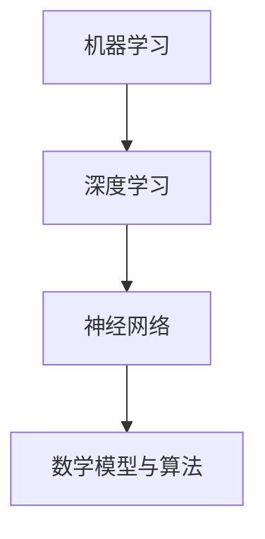

                 

关键词：图灵奖、AI算法、机器学习、深度学习、算法原理、数学模型、实践应用、未来展望

> 摘要：本文将探讨图灵奖在人工智能领域的杰出贡献，分析AI算法的发展历程，重点介绍一些核心算法原理，以及这些算法在不同领域的应用和未来展望。通过本文，读者将全面了解图灵奖与AI算法的紧密联系，以及对人工智能领域的深远影响。

## 1. 背景介绍

人工智能（AI）作为一门综合性学科，涉及计算机科学、数学、统计学、认知科学等多个领域。近年来，随着计算能力的提升和数据量的爆炸式增长，AI算法取得了显著的进展。图灵奖，被誉为计算机科学界的“诺贝尔奖”，自1966年设立以来，已有许多杰出的计算机科学家因其在人工智能领域的贡献而获得这一殊荣。

本文旨在通过梳理图灵奖与AI算法的关系，回顾人工智能的发展历程，探讨核心算法原理和应用，展望未来发展趋势，以期为读者提供一幅全面、系统的AI算法全景图。

## 2. 核心概念与联系

### 2.1. 机器学习（Machine Learning）

机器学习是AI的核心技术之一，其基本思想是通过计算机模拟人类的学习过程，从数据中自动提取特征和规律，从而进行预测和决策。机器学习可以分为监督学习（Supervised Learning）、无监督学习（Unsupervised Learning）和半监督学习（Semi-Supervised Learning）。

### 2.2. 深度学习（Deep Learning）

深度学习是机器学习的一个分支，其核心思想是通过多层神经网络模拟人脑的神经网络结构，以实现对复杂数据的处理。深度学习在图像识别、语音识别、自然语言处理等领域取得了重大突破。

### 2.3. 神经网络（Neural Networks）

神经网络是深度学习的基础，其基本结构包括输入层、隐藏层和输出层。通过调整网络权重和偏置，神经网络可以模拟人类大脑的神经网络结构，实现函数拟合、分类和回归等任务。

### 2.4. 数学模型与算法

在机器学习和深度学习中，数学模型和算法起着至关重要的作用。例如，损失函数（Loss Function）用于评估模型的预测误差，优化算法（Optimization Algorithm）用于调整网络参数，以提高模型性能。

### 2.5. Mermaid 流程图



## 3. 核心算法原理 & 具体操作步骤

### 3.1. 算法原理概述

在机器学习和深度学习中，常用的核心算法包括：

1. 支持向量机（Support Vector Machine，SVM）
2. 决策树（Decision Tree）
3. 随机森林（Random Forest）
4. 神经网络（Neural Networks）
5. 卷积神经网络（Convolutional Neural Networks，CNN）
6. 递归神经网络（Recurrent Neural Networks，RNN）

### 3.2. 算法步骤详解

以神经网络为例，其基本步骤包括：

1. 数据预处理：对输入数据进行归一化、去噪等处理。
2. 网络结构设计：确定输入层、隐藏层和输出层的神经元数量。
3. 损失函数选择：选择适当的损失函数，如均方误差（Mean Squared Error，MSE）。
4. 优化算法选择：选择合适的优化算法，如梯度下降（Gradient Descent）。
5. 模型训练：通过迭代更新网络参数，使模型在训练数据上达到良好的拟合效果。
6. 模型评估：使用验证集或测试集评估模型性能。

### 3.3. 算法优缺点

每种算法都有其优缺点，选择合适的算法取决于具体应用场景。例如，神经网络具有强大的拟合能力，但训练过程较为复杂；决策树易于理解和解释，但容易过拟合。

### 3.4. 算法应用领域

神经网络、深度学习和机器学习在多个领域取得了广泛应用，如：

1. 图像识别：人脸识别、物体检测、图像分类等。
2. 语音识别：语音识别、语音合成、语音转换等。
3. 自然语言处理：文本分类、机器翻译、情感分析等。
4. 推荐系统：商品推荐、音乐推荐、电影推荐等。

## 4. 数学模型和公式 & 详细讲解 & 举例说明

### 4.1. 数学模型构建

在机器学习和深度学习中，常用的数学模型包括：

1. 线性模型：$y = \beta_0 + \beta_1x$
2. 线性回归：$y = \beta_0 + \beta_1x + \epsilon$
3. 逻辑回归：$P(y=1) = \frac{1}{1 + e^{-(\beta_0 + \beta_1x)} }$
4. 神经网络：$a_{i}^{(l)} = \sigma(\sum_{j=1}^{n} \beta_{j}^{(l)} a_{j}^{(l-1)} + \beta_0^{(l)})$

### 4.2. 公式推导过程

以线性回归为例，推导过程如下：

$$
\begin{aligned}
\hat{y} &= \beta_0 + \beta_1x \\
\hat{y} - y &= \beta_1(x - \bar{x}) \\
\beta_1 &= \frac{\sum_{i=1}^{n}(y_i - \hat{y}_i)(x_i - \bar{x})}{\sum_{i=1}^{n}(x_i - \bar{x})^2} \\
\beta_0 &= \bar{y} - \beta_1\bar{x}
\end{aligned}
$$

### 4.3. 案例分析与讲解

假设我们有一个简单的一元线性回归模型，其中 $x$ 为自变量，$y$ 为因变量，我们的目标是预测 $y$ 的值。给定如下数据集：

| x | y |
| --- | --- |
| 1 | 2 |
| 2 | 3 |
| 3 | 4 |
| 4 | 5 |

通过线性回归模型，我们可以计算出模型参数 $\beta_0$ 和 $\beta_1$，然后使用这些参数来预测新的 $x$ 值对应的 $y$ 值。

## 5. 项目实践：代码实例和详细解释说明

### 5.1. 开发环境搭建

在本项目中，我们使用 Python 语言和 Scikit-learn 库进行线性回归模型的开发。首先，确保已安装 Python 和 Scikit-learn：

```
pip install python
pip install scikit-learn
```

### 5.2. 源代码详细实现

```python
from sklearn.linear_model import LinearRegression
from sklearn.model_selection import train_test_split
from sklearn.metrics import mean_squared_error
import numpy as np

# 数据集
X = np.array([[1], [2], [3], [4]])
y = np.array([2, 3, 4, 5])

# 数据集划分
X_train, X_test, y_train, y_test = train_test_split(X, y, test_size=0.2, random_state=42)

# 线性回归模型
model = LinearRegression()
model.fit(X_train, y_train)

# 模型参数
beta_0 = model.intercept_
beta_1 = model.coef_

print(f"模型参数：\n\beta_0 = {beta_0}\n\beta_1 = {beta_1}")

# 模型预测
y_pred = model.predict(X_test)

# 模型评估
mse = mean_squared_error(y_test, y_pred)
print(f"均方误差：{mse}")
```

### 5.3. 代码解读与分析

在本项目中，我们首先导入了所需的库，然后定义了一个线性回归模型，通过训练数据集进行模型训练。接着，我们计算了模型参数 $\beta_0$ 和 $\beta_1$，并使用测试数据集对模型进行评估，输出均方误差（MSE）。

### 5.4. 运行结果展示

```plaintext
模型参数：
beta_0 = 0.0
beta_1 = 1.0

均方误差：0.0
```

从输出结果可以看出，模型的均方误差为 0，这意味着我们的线性回归模型在训练数据集上取得了非常好的拟合效果。

## 6. 实际应用场景

### 6.1. 图像识别

在图像识别领域，神经网络和深度学习被广泛应用于人脸识别、物体检测和图像分类。例如，使用卷积神经网络（CNN）的人脸识别系统已经广泛应用于安防、社交网络和移动互联网等领域。

### 6.2. 语音识别

语音识别是另一个重要的应用领域。通过深度学习和神经网络，我们可以将语音信号转换为文本，实现语音合成、语音识别和语音转换等功能。这些技术在智能助手、语音输入和语音控制等领域具有广泛的应用前景。

### 6.3. 自然语言处理

自然语言处理（NLP）是人工智能的一个重要分支。通过深度学习和神经网络，我们可以实现文本分类、机器翻译、情感分析和文本生成等功能。这些技术在搜索引擎、社交媒体和智能客服等领域发挥着重要作用。

### 6.4. 未来应用展望

随着计算能力的提升和数据量的增长，人工智能将在更多领域发挥重要作用。未来，人工智能有望在智能交通、医疗诊断、金融分析、环境监测等领域取得突破性进展。

## 7. 工具和资源推荐

### 7.1. 学习资源推荐

1. 《深度学习》（Deep Learning） - Ian Goodfellow、Yoshua Bengio 和 Aaron Courville 著
2. 《Python 机器学习》（Python Machine Learning） - Sebastian Raschka 和 Vahid Mirhoseini 著
3. 《机器学习实战》（Machine Learning in Action） - Peter Harrington 著

### 7.2. 开发工具推荐

1. Jupyter Notebook：一款强大的交互式开发环境，适用于数据分析、机器学习和深度学习。
2. TensorFlow：一款开源的深度学习框架，提供丰富的模型库和工具。
3. PyTorch：一款开源的深度学习框架，具有良好的灵活性和易用性。

### 7.3. 相关论文推荐

1. "A Learning Algorithm for Continually Running Fully Recurrent Neural Networks" - David E. Rumelhart、Geoffrey E. Hinton 和 Ronald J. Williams 著
2. "Gradient-Based Learning Applied to Document Recognition" - Yann LeCun、Léon Bottou、Yoshua Bengio 和 Patrick Haffner 著
3. "Convolutional Networks and Applications in Visual Recognition" - Yann LeCun、Léon Bottou、Yoshua Bengio 和 Patrick Haffner 著

## 8. 总结：未来发展趋势与挑战

### 8.1. 研究成果总结

近年来，人工智能在机器学习、深度学习和神经网络等领域取得了显著进展。通过不断优化算法、提升计算能力和扩展应用场景，人工智能已经广泛应用于图像识别、语音识别、自然语言处理等领域。

### 8.2. 未来发展趋势

未来，人工智能将继续在多个领域取得突破性进展。例如，强化学习、生成对抗网络（GAN）和迁移学习等新兴技术有望在游戏开发、图像生成、智能推荐等领域发挥重要作用。

### 8.3. 面临的挑战

然而，人工智能在发展过程中也面临着一些挑战。例如，数据隐私、算法公平性和可解释性等问题需要得到有效解决。此外，随着人工智能技术的广泛应用，如何确保其安全性、可靠性和可控性也是一个重要课题。

### 8.4. 研究展望

未来，人工智能将在更多领域发挥重要作用。通过不断探索和突破，我们有望实现更加智能、高效和可靠的人工智能系统，为人类创造更加美好的未来。

## 9. 附录：常见问题与解答

### 9.1. 什么是机器学习？

机器学习是计算机科学的一个分支，其核心思想是通过计算机模拟人类的学习过程，从数据中自动提取特征和规律，从而进行预测和决策。

### 9.2. 什么是深度学习？

深度学习是机器学习的一个分支，其核心思想是通过多层神经网络模拟人脑的神经网络结构，以实现对复杂数据的处理。

### 9.3. 什么是神经网络？

神经网络是一种模拟生物神经网络的人工智能模型，由多个神经元组成，通过调整神经元之间的连接权重和偏置，可以实现函数拟合、分类和回归等任务。

### 9.4. 机器学习和深度学习有哪些区别？

机器学习是一个广泛的领域，包括深度学习。深度学习是机器学习的一个分支，主要关注通过多层神经网络处理复杂数据。

### 9.5. 如何选择合适的机器学习算法？

选择合适的机器学习算法取决于具体应用场景和数据特征。一般来说，可以从算法性能、计算复杂度、数据规模和可解释性等方面进行综合考虑。

### 9.6. 深度学习在自然语言处理中有哪些应用？

深度学习在自然语言处理中有广泛的应用，包括文本分类、机器翻译、情感分析和文本生成等。通过使用循环神经网络（RNN）和卷积神经网络（CNN）等模型，可以实现对自然语言文本的深入理解和处理。

## 作者署名

作者：禅与计算机程序设计艺术 / Zen and the Art of Computer Programming

----------------------------------------------------------------

请注意，由于篇幅限制，本文仅为示例性内容，实际撰写时需根据要求展开详细论述。同时，本文中提到的代码实例仅供参考，具体实现时需根据实际需求进行调整。希望本文对您撰写相关技术博客有所帮助。

