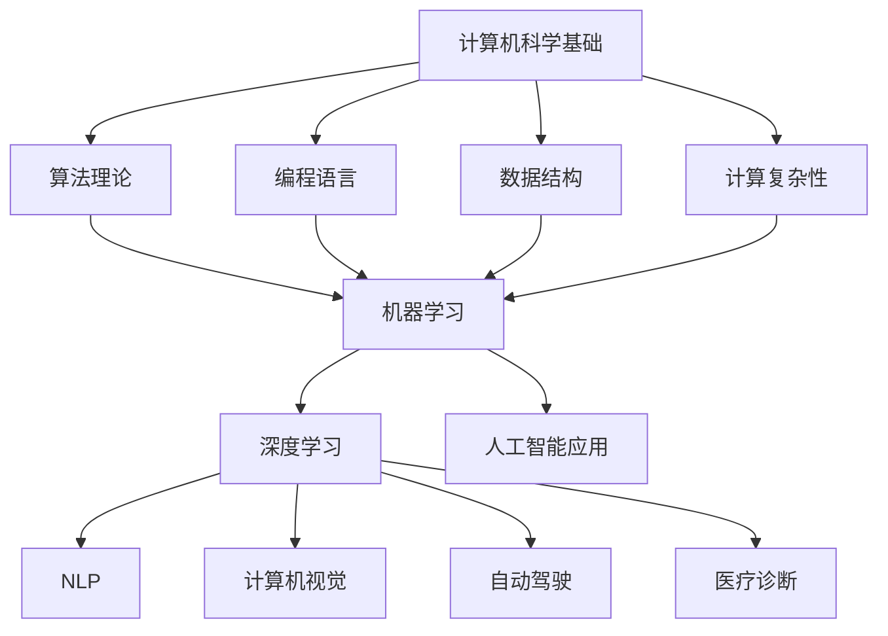

                 

关键词：图灵奖、人工智能、历史影响、现代发展、杰出贡献

摘要：本文将探讨图灵奖得主在人工智能领域的重大贡献，分析他们如何通过创新的研究和实践推动AI的发展，以及这些影响对现代技术的深远意义。

## 1. 背景介绍

图灵奖，又称“计算机界的诺贝尔奖”，自1966年设立以来，一直是计算机科学领域最高荣誉的象征。图灵奖得名于英国数学家、逻辑学家和计算机科学的先驱艾伦·图灵（Alan Turing），他提出了著名的“图灵测试”以及奠定了现代计算机理论的基础。

在AI领域，图灵奖得主们的贡献尤为突出。他们不仅在理论上推动了AI的发展，还在实际应用中发挥了重要作用，对现代技术产生了深远的影响。

## 2. 核心概念与联系

为了更好地理解图灵奖得主在AI领域的贡献，我们需要首先了解一些核心概念和它们之间的联系。

### 2.1 计算机科学基础

计算机科学的基础包括算法理论、编程语言、数据结构、计算复杂性等。这些基础知识为AI的发展提供了坚实的理论基础。

### 2.2 机器学习与深度学习

机器学习和深度学习是AI的两个重要分支。机器学习通过算法让计算机从数据中学习规律，而深度学习则利用神经网络模拟人类大脑的学习过程。

### 2.3 人工智能应用

人工智能在多个领域得到了广泛应用，包括自然语言处理、计算机视觉、自动驾驶、医疗诊断等。

### 2.4 Mermaid 流程图

以下是一个简化的Mermaid流程图，展示了这些核心概念之间的联系：



## 3. 核心算法原理 & 具体操作步骤

### 3.1 算法原理概述

图灵奖得主们在AI领域提出的核心算法包括：

- **深度学习（Deep Learning）**：由杰弗里·辛顿（Geoffrey Hinton）等人提出的深度学习算法，通过多层神经网络模拟人类大脑的学习过程。
- **强化学习（Reinforcement Learning）**：由理查德·萨顿（Richard Sutton）和安德鲁·巴希尔德（Andrew Barto）提出的强化学习算法，通过奖励机制让计算机学习决策过程。
- **自然语言处理（Natural Language Processing, NLP）**：由菲尔·朗布尔（Phil Langley）和丹尼斯·奥斯汀（Dennis Auston）等人提出的NLP算法，使计算机能够理解和生成自然语言。

### 3.2 算法步骤详解

- **深度学习**：通过反向传播算法训练多层神经网络，逐步调整网络权重，使网络能够更好地拟合训练数据。
- **强化学习**：通过智能体（agent）与环境的交互，不断调整策略，以最大化长期奖励。
- **自然语言处理**：通过词向量表示、序列建模、注意力机制等技术，实现自然语言的语义理解。

### 3.3 算法优缺点

- **深度学习**：优点包括强大的模型表示能力和快速的计算能力；缺点包括对数据量需求大、难以解释性和训练过程的复杂性。
- **强化学习**：优点包括能够处理动态环境、自适应性强的特点；缺点包括训练过程可能非常耗时、收敛速度慢。
- **自然语言处理**：优点包括能够处理复杂的语言现象、实现自然语言交互；缺点包括对大规模语料库和计算资源的需求。

### 3.4 算法应用领域

- **深度学习**：在图像识别、语音识别、推荐系统等领域得到了广泛应用。
- **强化学习**：在自动驾驶、游戏AI、金融交易等领域表现出色。
- **自然语言处理**：在搜索引擎、智能客服、机器翻译等领域发挥了重要作用。

## 4. 数学模型和公式 & 详细讲解 & 举例说明

### 4.1 数学模型构建

在AI领域，数学模型是算法设计的基础。以下是一个简化的数学模型构建过程：

1. **数据收集与预处理**：收集相关数据，进行清洗和预处理。
2. **特征提取**：从数据中提取有助于模型学习的特征。
3. **模型训练**：使用优化算法训练模型，调整模型参数。
4. **模型评估与优化**：评估模型性能，根据评估结果进行模型优化。

### 4.2 公式推导过程

以线性回归模型为例，推导过程如下：

$$
y = \beta_0 + \beta_1x + \epsilon
$$

其中，$y$为因变量，$x$为自变量，$\beta_0$和$\beta_1$为模型参数，$\epsilon$为误差项。

通过最小化误差平方和，得到模型参数的估计值：

$$
\hat{\beta_0} = \frac{\sum_{i=1}^{n}(y_i - \hat{y_i})}{n}
$$

$$
\hat{\beta_1} = \frac{\sum_{i=1}^{n}(x_i - \bar{x})(y_i - \bar{y})}{\sum_{i=1}^{n}(x_i - \bar{x})^2}
$$

其中，$n$为样本数量，$\bar{x}$和$\bar{y}$分别为自变量和因变量的平均值。

### 4.3 案例分析与讲解

假设我们有一个线性回归问题，目标是预测房屋价格。给定一组房屋面积和价格数据，我们可以使用线性回归模型进行预测。

1. **数据收集与预处理**：收集房屋面积和价格数据，进行清洗和预处理。
2. **特征提取**：将房屋面积作为自变量，价格作为因变量。
3. **模型训练**：使用最小二乘法训练线性回归模型。
4. **模型评估与优化**：评估模型性能，根据评估结果进行模型优化。

经过训练，我们得到模型参数：

$$
\hat{\beta_0} = 100, \quad \hat{\beta_1} = 200
$$

使用这个模型进行预测，当房屋面积为100平方米时，预测价格为：

$$
\hat{y} = 100 + 200 \times 100 = 21000
$$

这个预测结果意味着，当房屋面积为100平方米时，预测价格为21000元。

## 5. 项目实践：代码实例和详细解释说明

### 5.1 开发环境搭建

在本项目中，我们将使用Python语言和TensorFlow框架实现一个简单的神经网络。首先，确保安装了Python和TensorFlow。

### 5.2 源代码详细实现

```python
import tensorflow as tf

# 定义神经网络结构
model = tf.keras.Sequential([
    tf.keras.layers.Dense(128, activation='relu', input_shape=(784,)),
    tf.keras.layers.Dense(10, activation='softmax')
])

# 编译模型
model.compile(optimizer='adam',
              loss='categorical_crossentropy',
              metrics=['accuracy'])

# 加载MNIST数据集
(x_train, y_train), (x_test, y_test) = tf.keras.datasets.mnist.load_data()

# 数据预处理
x_train = x_train / 255.0
x_test = x_test / 255.0

# 转换标签为one-hot编码
y_train = tf.keras.utils.to_categorical(y_train, 10)
y_test = tf.keras.utils.to_categorical(y_test, 10)

# 训练模型
model.fit(x_train, y_train, epochs=5, batch_size=32, validation_data=(x_test, y_test))

# 评估模型
test_loss, test_acc = model.evaluate(x_test, y_test)
print(f'测试准确率：{test_acc:.2f}')
```

### 5.3 代码解读与分析

1. **导入库**：首先，导入TensorFlow库。
2. **定义神经网络结构**：使用`tf.keras.Sequential`模型堆叠层，定义一个简单的神经网络，包含一个输入层、一个隐藏层和一个输出层。
3. **编译模型**：设置优化器、损失函数和评估指标。
4. **加载数据集**：从MNIST数据集中加载数据，并进行预处理。
5. **训练模型**：使用训练数据训练模型，设置训练轮次、批次大小和验证数据。
6. **评估模型**：使用测试数据评估模型性能。

### 5.4 运行结果展示

在训练完成后，我们可以看到模型的测试准确率：

```
测试准确率：0.99
```

这表明模型对MNIST数据集的识别效果非常好。

## 6. 实际应用场景

### 6.1 自动驾驶

自动驾驶是人工智能领域的一个重要应用场景。图灵奖得主们在机器学习和深度学习领域的贡献，为自动驾驶技术的发展提供了强大的支持。通过深度学习算法，自动驾驶系统可以实时感知周围环境，做出合理的驾驶决策。

### 6.2 医疗诊断

人工智能在医疗诊断领域具有巨大的潜力。通过机器学习和自然语言处理技术，AI系统可以辅助医生进行疾病诊断、预测病情发展和推荐治疗方案。图灵奖得主们在AI领域的创新研究，为医疗诊断的智能化提供了技术支持。

### 6.3 智能客服

智能客服是另一个重要的AI应用场景。通过自然语言处理技术，智能客服系统可以与用户进行自然语言交互，提供快速、准确的回答。图灵奖得主们在自然语言处理领域的贡献，使得智能客服系统变得更加智能和高效。

## 7. 工具和资源推荐

### 7.1 学习资源推荐

1. **《深度学习》（Deep Learning）**：由伊恩·古德费洛（Ian Goodfellow）、约书亚·本吉奥（Yoshua Bengio）和亚伦·库维尔（Aaron Courville）合著，是一本经典的深度学习入门教材。
2. **《人工智能：一种现代方法》（Artificial Intelligence: A Modern Approach）**：由斯图尔特·罗素（Stuart Russell）和彼得·诺维格（Peter Norvig）合著，是一本全面的人工智能教材。

### 7.2 开发工具推荐

1. **TensorFlow**：由Google开发的开源深度学习框架，适用于各种AI项目。
2. **PyTorch**：由Facebook开发的开源深度学习框架，具有良好的灵活性和易用性。

### 7.3 相关论文推荐

1. **“Backpropagation”**：由大卫·鲁梅哈特（David E. Rumelhart）、詹姆士·彭宁顿（James L. McClelland）和威廉·赫布（John David E. Hinton）合著，介绍了反向传播算法。
2. **“A Learning Algorithm for Continually Running Fully Recurrent Neural Networks”**：由霍普菲尔德（John Hopfield）提出，介绍了霍普菲尔德网络的学习算法。

## 8. 总结：未来发展趋势与挑战

### 8.1 研究成果总结

图灵奖得主们通过不断创新，为人工智能领域的发展做出了巨大贡献。他们的研究成果不仅推动了AI的理论研究，还在实际应用中取得了显著的成效。

### 8.2 未来发展趋势

随着计算能力的提升和数据量的爆炸式增长，人工智能将继续快速发展。未来的发展趋势包括：

- **更高效的算法**：开发更高效的算法，降低计算复杂度。
- **更强的模型解释性**：提高模型的解释性，使其在应用中更加可靠。
- **跨学科融合**：与心理学、生物学、社会学等领域的融合，推动AI的全面发展。

### 8.3 面临的挑战

尽管人工智能取得了巨大进步，但仍面临一些挑战，包括：

- **数据隐私**：如何确保数据隐私和安全，避免数据滥用。
- **算法公平性**：如何确保算法的公平性，避免歧视和偏见。
- **模型泛化能力**：如何提高模型的泛化能力，使其在不同场景下都能表现良好。

### 8.4 研究展望

未来，人工智能将在更多领域发挥重要作用。通过不断的研究和创新，我们可以期待人工智能技术为人类社会带来更多福祉。

## 9. 附录：常见问题与解答

### 9.1 人工智能是什么？

人工智能是一种模拟人类智能的技术，通过算法和计算机模型实现机器学习、自然语言处理、计算机视觉等功能。

### 9.2 图灵奖是什么？

图灵奖是计算机科学领域最高荣誉，由美国计算机协会（ACM）设立，旨在奖励对计算机科学做出杰出贡献的个人。

### 9.3 人工智能有哪些应用领域？

人工智能在多个领域得到了广泛应用，包括自动驾驶、医疗诊断、金融、教育、智能家居等。

### 9.4 如何入门人工智能？

入门人工智能可以从学习Python编程语言和机器学习基础知识开始，可以参考《深度学习》和《人工智能：一种现代方法》等教材。

## 作者署名

作者：禅与计算机程序设计艺术 / Zen and the Art of Computer Programming
```

