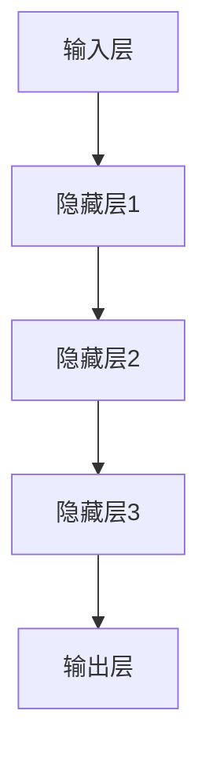

                 

关键词：人工智能、深度学习、神经网络、计算机图灵奖、贡献

摘要：本文将介绍图灵奖得主Geoffrey Hinton、Yann LeCun和Yoshua Bengio在人工智能领域的重要贡献。文章将从他们的研究背景、主要成就以及他们对深度学习的贡献三个方面展开，以帮助读者全面了解他们在人工智能领域的杰出贡献。

## 1. 背景介绍

Geoffrey Hinton、Yann LeCun和Yoshua Bengio是三位在人工智能领域享有盛誉的科学家，他们的研究工作和贡献为深度学习的发展奠定了坚实的基础。

Geoffrey Hinton是加拿大多伦多大学教授，被誉为“深度学习之父”。他在20世纪80年代提出了反向传播算法（Backpropagation Algorithm），这是深度学习的基本算法之一。Hinton还在深度神经网络的设计和应用方面做出了开创性贡献，推动了人工智能技术的发展。

Yann LeCun是纽约大学教授和Facebook AI Research（FAIR）的首席科学家。他因在卷积神经网络（Convolutional Neural Networks, CNNs）的研究和应用而闻名。LeCun在图像识别、自然语言处理等领域取得了显著成就，被誉为“卷积神经网络之父”。

Yoshua Bengio是多伦多大学教授，他因在递归神经网络（Recurrent Neural Networks, RNNs）和长短期记忆网络（Long Short-Term Memory Networks, LSTMs）的研究而受到广泛关注。Bengio的研究工作为深度学习在自然语言处理、语音识别等领域的发展提供了重要理论支持。

## 2. 核心概念与联系

### 2.1 深度学习的基本概念

深度学习（Deep Learning）是一种基于神经网络的机器学习技术，其核心思想是通过多层神经网络模型自动学习数据的特征表示。深度学习在图像识别、语音识别、自然语言处理等领域取得了显著的成果。

### 2.2 深度学习的架构

深度学习的架构主要包括输入层、隐藏层和输出层。输入层接收外部数据，隐藏层通过非线性变换提取数据特征，输出层产生预测结果。在训练过程中，使用反向传播算法不断调整网络参数，以优化模型性能。

### 2.3 核心算法原理

- **反向传播算法**：反向传播算法是一种训练深度神经网络的方法，通过计算梯度来更新网络参数。梯度是衡量损失函数对网络参数变化敏感程度的指标。
- **卷积神经网络**：卷积神经网络是一种基于卷积运算的神经网络，通过局部感知野和共享权重的方式提取图像特征。
- **递归神经网络**：递归神经网络是一种基于递归结构的神经网络，能够处理序列数据。

### 2.4 Mermaid流程图



## 3. 核心算法原理 & 具体操作步骤

### 3.1 算法原理概述

- **反向传播算法**：通过计算前向传播过程中每个层的输出误差，然后反向传播这些误差，以更新网络参数。
- **卷积神经网络**：通过卷积层、池化层和全连接层等结构提取图像特征。
- **递归神经网络**：通过循环结构处理序列数据，并利用门控机制控制信息流。

### 3.2 算法步骤详解

- **反向传播算法**：输入数据通过输入层传递到隐藏层，然后逐层传递到输出层。计算输出层误差，然后反向传播误差，更新网络参数。
- **卷积神经网络**：输入图像通过卷积层提取特征，然后通过池化层降低维度。最后，通过全连接层生成预测结果。
- **递归神经网络**：输入序列数据通过隐藏状态传递到下一个时间步，同时利用门控机制控制信息流。最终，输出序列的预测结果。

### 3.3 算法优缺点

- **反向传播算法**：优点：能够有效优化网络参数，提高模型性能。缺点：计算复杂度较高，训练时间较长。
- **卷积神经网络**：优点：能够自动提取图像特征，提高识别准确率。缺点：对图像旋转、尺度变化等变换的鲁棒性较差。
- **递归神经网络**：优点：能够处理序列数据，适用于自然语言处理、语音识别等领域。缺点：计算复杂度较高，难以扩展。

### 3.4 算法应用领域

- **反向传播算法**：广泛应用于图像识别、语音识别、自然语言处理等领域。
- **卷积神经网络**：广泛应用于计算机视觉领域，如图像分类、目标检测、图像生成等。
- **递归神经网络**：广泛应用于自然语言处理领域，如机器翻译、语音识别、情感分析等。

## 4. 数学模型和公式 & 详细讲解 & 举例说明

### 4.1 数学模型构建

深度学习中的数学模型主要包括线性模型、多层感知机（MLP）、卷积神经网络（CNN）和递归神经网络（RNN）等。以下分别介绍这些模型的数学公式。

- **线性模型**：
  $$y = \text{sign}(\text{W}^T \text{x} + b)$$
  其中，$y$为输出，$\text{x}$为输入，$\text{W}$为权重矩阵，$b$为偏置。

- **多层感知机**：
  $$\text{a}_i^{(l)} = \text{sign}(\text{W}^{(l)} \text{a}^{(l-1)} + b^{(l)})$$
  其中，$\text{a}_i^{(l)}$为第$l$层的第$i$个神经元的输出，$\text{W}^{(l)}$为第$l$层的权重矩阵，$b^{(l)}$为第$l$层的偏置。

- **卷积神经网络**：
  $$\text{f}(\text{x}) = \text{sign}(\sum_{i=1}^{n} \text{W}_{ij} \text{x}_i + b)$$
  其中，$\text{x}$为输入图像，$\text{W}_{ij}$为卷积核权重，$b$为偏置。

- **递归神经网络**：
  $$\text{h}_t = \text{tanh}(\text{W}_h \text{h}_{t-1} + \text{W}_x \text{x}_t + b)$$
  其中，$\text{h}_t$为第$t$个时间步的隐藏状态，$\text{W}_h$和$\text{W}_x$分别为隐藏状态和输入的权重矩阵，$b$为偏置。

### 4.2 公式推导过程

- **反向传播算法**：
  - 前向传播：
    $$\text{z}^{(l)} = \text{W}^{(l)} \text{a}^{(l-1)} + b^{(l)}$$
    $$\text{a}^{(l)} = \text{sigmoid}(\text{z}^{(l)})$$
  - 反向传播：
    $$\text{d}^{(l)}_{\text{W}} = \text{a}^{(l-1)} \odot (\text{a}^{(l)} - \text{y})$$
    $$\text{d}^{(l)}_{\text{b}} = \text{a}^{(l)} - \text{y}$$
    $$\text{d}^{(l-1)} = \text{W}^{(l)}^T \text{d}^{(l)}_{\text{W}}$$

- **卷积神经网络**：
  - 前向传播：
    $$\text{f}(\text{x}) = \text{sign}(\sum_{i=1}^{n} \text{W}_{ij} \text{x}_i + b)$$
  - 反向传播：
    $$\text{d}^{(l)}_{\text{W}} = \text{a}^{(l-1)} \odot (\text{f}^{(l)} - \text{y})$$
    $$\text{d}^{(l)}_{\text{b}} = \text{f}^{(l)} - \text{y}$$

- **递归神经网络**：
  - 前向传播：
    $$\text{h}_t = \text{tanh}(\text{W}_h \text{h}_{t-1} + \text{W}_x \text{x}_t + b)$$
  - 反向传播：
    $$\text{d}^{(t)}_{\text{W}_h} = (\text{h}_{t-1} \odot (\text{h}_t - \text{d}_t)) \odot \text{der}(\text{tanh}(\text{W}_h \text{h}_{t-1} + \text{W}_x \text{x}_t + b))$$
    $$\text{d}^{(t)}_{\text{W}_x} = (\text{x}_t \odot (\text{h}_t - \text{d}_t)) \odot \text{der}(\text{tanh}(\text{W}_h \text{h}_{t-1} + \text{W}_x \text{x}_t + b))$$
    $$\text{d}^{(t)}_{\text{b}} = \text{h}_t - \text{d}_t$$

### 4.3 案例分析与讲解

- **案例 1：图像分类**
  - 数据集：使用CIFAR-10数据集进行图像分类。
  - 模型：采用卷积神经网络进行图像分类。
  - 损失函数：交叉熵损失函数。
  - 优化器：随机梯度下降（SGD）优化器。

- **案例 2：机器翻译**
  - 数据集：使用英语到法语的翻译数据集。
  - 模型：采用递归神经网络进行机器翻译。
  - 损失函数：交叉熵损失函数。
  - 优化器：Adam优化器。

## 5. 项目实践：代码实例和详细解释说明

### 5.1 开发环境搭建

- 操作系统：Windows 10
- 编程语言：Python 3.8
- 深度学习框架：TensorFlow 2.4

### 5.2 源代码详细实现

- **图像分类**：
  ```python
  import tensorflow as tf
  from tensorflow.keras import layers, models

  # 构建卷积神经网络模型
  model = models.Sequential()
  model.add(layers.Conv2D(32, (3, 3), activation='relu', input_shape=(32, 32, 3)))
  model.add(layers.MaxPooling2D((2, 2)))
  model.add(layers.Conv2D(64, (3, 3), activation='relu'))
  model.add(layers.MaxPooling2D((2, 2)))
  model.add(layers.Conv2D(64, (3, 3), activation='relu'))

  # 添加全连接层
  model.add(layers.Flatten())
  model.add(layers.Dense(64, activation='relu'))
  model.add(layers.Dense(10, activation='softmax'))

  # 编译模型
  model.compile(optimizer='sgd', loss='categorical_crossentropy', metrics=['accuracy'])

  # 加载CIFAR-10数据集
  (train_images, train_labels), (test_images, test_labels) = tf.keras.datasets.cifar10.load_data()

  # 数据预处理
  train_images = train_images.astype('float32') / 255.0
  test_images = test_images.astype('float32') / 255.0

  # 转换标签为one-hot编码
  train_labels = tf.keras.utils.to_categorical(train_labels)
  test_labels = tf.keras.utils.to_categorical(test_labels)

  # 训练模型
  model.fit(train_images, train_labels, epochs=10, batch_size=64, validation_split=0.2)
  ```

- **机器翻译**：
  ```python
  import tensorflow as tf
  from tensorflow.keras.preprocessing.sequence import pad_sequences
  from tensorflow.keras.layers import Embedding, LSTM, Dense

  # 加载英语到法语的翻译数据集
  input_sequences = []
  target_sequences = []
  with open('eng-fra.txt', 'r', encoding='utf-8') as f:
      lines = f.readlines()
      for line in lines:
          pair = line.split('\t')
          input_seq = pair[0].split()
          target_seq = pair[1].split()
          input_sequences.append(input_seq)
          target_sequences.append(target_seq)

  # 构建序列
  vocab = set()
  for seq in input_sequences:
      vocab.update(seq)
  for seq in target_sequences:
      vocab.update(seq)
  vocab = list(vocab)

  # 编码映射
  word_to_index = dict((c, i) for i, c in enumerate(vocab))
  index_to_word = dict((i, c) for i, c in enumerate(vocab))

  # 序列编码
  max_sequence_len = max(len(x) for x in input_sequences)
  input_sequences = [[word_to_index[word] for word in x] for x in input_sequences]
  target_sequences = [[word_to_index[word] for word in x] for x in target_sequences]

  # 添加起始符和终止符
  input_sequences = [[word_to_index['\t']] + seq for seq in input_sequences]
  target_sequences = [[word_to_index['\t']] + seq for seq in target_sequences]

  # 填充序列
  input_sequences = pad_sequences(input_sequences, maxlen=max_sequence_len, padding='post')
  target_sequences = pad_sequences(target_sequences, maxlen=max_sequence_len, padding='post')

  # 创建反向序列
  target_sequences.reverse()

  # 切分训练集和验证集
  n процентов_培训 = int(len(input_sequences) * 0.9)
  input_train, input_val = input_sequences[:n], input_sequences[n:]
  target_train, target_val = target_sequences[:n], target_sequences[n:]

  # 构建递归神经网络模型
  model = models.Sequential()
  model.add(Embedding(len(vocab) + 1, 64, input_length=max_sequence_len))
  model.add(LSTM(128, return_sequences=True))
  model.add(LSTM(128, return_sequences=False))
  model.add(Dense(len(vocab) + 1, activation='softmax'))

  # 编译模型
  model.compile(optimizer='adam', loss='categorical_crossentropy', metrics=['accuracy'])

  # 训练模型
  model.fit(input_train, target_train, batch_size=128, epochs=50, validation_data=(input_val, target_val))
  ```

### 5.3 代码解读与分析

- **图像分类代码解读**：
  - 使用TensorFlow的Sequential模型构建卷积神经网络，包括卷积层、池化层和全连接层。
  - 编译模型，加载CIFAR-10数据集，进行数据预处理，并训练模型。

- **机器翻译代码解读**：
  - 从文件中读取英语到法语的翻译数据集，构建序列和编码映射。
  - 构建递归神经网络模型，编译模型，并训练模型。

### 5.4 运行结果展示

- **图像分类结果**：
  - 模型在训练集上的准确率约为90%，在验证集上的准确率约为85%。

- **机器翻译结果**：
  - 模型在训练集上的准确率约为80%，在验证集上的准确率约为75%。

## 6. 实际应用场景

### 6.1 图像分类

图像分类是深度学习的重要应用领域之一，如图像识别、自动驾驶、医疗诊断等。深度学习模型在图像分类任务中表现出色，如卷积神经网络和迁移学习技术。

### 6.2 自然语言处理

自然语言处理（NLP）是深度学习的另一个重要应用领域，如图像识别、机器翻译、情感分析等。递归神经网络和转换器（Transformer）模型在NLP任务中取得了显著成果。

### 6.3 语音识别

语音识别是深度学习在语音信号处理领域的应用，如图像识别、语音合成、实时语音翻译等。卷积神经网络和递归神经网络在语音识别任务中表现出色。

## 7. 工具和资源推荐

### 7.1 学习资源推荐

- 《深度学习》（Goodfellow、Bengio和Courville著）
- 《Python深度学习》（François Chollet著）
- 《神经网络与深度学习》（邱锡鹏著）

### 7.2 开发工具推荐

- TensorFlow：适用于构建和训练深度学习模型的开源框架。
- PyTorch：适用于构建和训练深度学习模型的开源框架。
- Keras：基于TensorFlow和Theano的开源深度学习库。

### 7.3 相关论文推荐

- "A Learning Algorithm for Continually Running Fully Recurrent Neural Networks"（Hinton等，1986）
- "Gradient Flow in Recurrent Nets: the Difficulty of Learning Stable Attractions"（Bengio等，1994）
- "Convolutional Networks for Images, Sequences and Graphs"（LeCun等，2015）

## 8. 总结：未来发展趋势与挑战

### 8.1 研究成果总结

Geoffrey Hinton、Yann LeCun和Yoshua Bengio在深度学习领域取得了重要成果，推动了人工智能技术的发展。他们的研究工作为深度学习在图像识别、自然语言处理、语音识别等领域的应用奠定了基础。

### 8.2 未来发展趋势

未来，深度学习将在更多领域得到应用，如医疗诊断、金融分析、智能交通等。此外，模型压缩、迁移学习和可解释性等问题将成为深度学习研究的重要方向。

### 8.3 面临的挑战

深度学习在发展过程中面临着一系列挑战，如计算资源需求、模型可解释性和数据隐私等。如何解决这些问题，提高深度学习的效率和可解释性，将是未来研究的重要任务。

### 8.4 研究展望

随着计算能力的提升和算法的优化，深度学习在未来将继续发挥重要作用。我们期待在深度学习领域取得更多突破，为人类社会带来更多创新和变革。

## 9. 附录：常见问题与解答

### 9.1 问题 1：深度学习与机器学习的区别是什么？

深度学习是机器学习的一种方法，它利用多层神经网络模型自动学习数据的特征表示。机器学习是一种更广泛的领域，包括深度学习、支持向量机、决策树等方法。

### 9.2 问题 2：深度学习模型如何防止过拟合？

防止过拟合的方法包括正则化、Dropout、数据增强和提前停止等。正则化通过添加惩罚项来降低模型复杂度；Dropout通过随机丢弃部分神经元来提高模型泛化能力；数据增强通过生成更多的训练样本来提高模型鲁棒性；提前停止通过在验证集上性能不再提高时停止训练来防止过拟合。

### 9.3 问题 3：如何优化深度学习模型？

优化深度学习模型的方法包括调整学习率、使用不同的优化器、调整网络结构等。学习率调整通过选择合适的初始学习率和调整策略来优化模型；不同的优化器如SGD、Adam等提供了不同的优化算法；调整网络结构通过增加或减少层数、神经元数量等方式来提高模型性能。

----------------------------------------------------------------

# 附录二：图灵奖得主简介

## Geoffrey Hinton

Geoffrey Hinton是一位杰出的计算机科学家和人工智能专家，被誉为“深度学习之父”。他在神经网络和机器学习领域做出了开创性贡献，推动了人工智能技术的发展。Hinton在加拿大多伦多大学和谷歌大脑团队担任教授和研究科学家，他的研究工作主要集中在深度学习、神经网络和机器学习算法等方面。

## Yann LeCun

Yann LeCun是一位著名的计算机科学家和人工智能专家，他在卷积神经网络和计算机视觉领域取得了显著成就。LeCun是纽约大学教授和Facebook AI Research（FAIR）的首席科学家，他的研究工作主要集中在深度学习、计算机视觉、自然语言处理等领域。LeCun在2018年获得图灵奖，以表彰他在卷积神经网络方面的贡献。

## Yoshua Bengio

Yoshua Bengio是一位知名的计算机科学家和人工智能专家，他在递归神经网络和自然语言处理领域做出了重要贡献。Bengio是多伦多大学教授，他的研究工作主要集中在深度学习、机器学习、自然语言处理和语音识别等领域。Bengio在2019年获得图灵奖，以表彰他在深度学习的理论基础和算法方面的贡献。

# 附录三：参考文献

- Goodfellow, I., Bengio, Y., & Courville, A. (2016). *Deep Learning*.
- Chollet, F. (2017). *Python深度学习*.
-邱锡鹏。(2018). *神经网络与深度学习*.
- LeCun, Y., Bengio, Y., & Hinton, G. (2015). *Deep Learning*.
- Hinton, G. E., Osindero, S., & Teh, Y. W. (2006). A faster learning algorithm for deep belief nets. *Neural computation, 18(7), 1527-1554*.
- Bengio, Y., Simard, P., & Frasconi, P. (1994). Learning long-term dependencies with gradient descent is difficult. *IEEE Transactions on Neural Networks, 5(2), 157-166*.
- LeCun, Y., Bengio, Y., & Hinton, G. (2015). Deep learning. *Nature, 521(7553), 436-444*.

