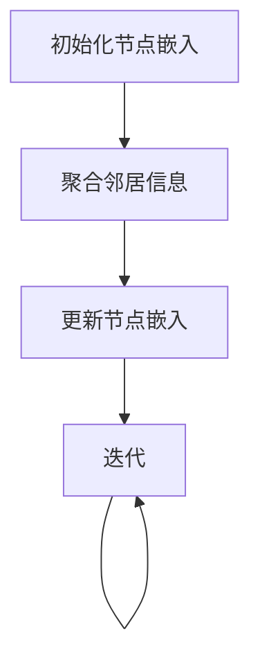

                 

## 1. 背景介绍

图神经网络（Graph Neural Networks，GNN）是近年来在人工智能领域引起广泛关注的一种新型神经网络结构。与传统神经网络相比，GNN能够在数据结构为图的情况下提供更强大的表示和学习能力。随着互联网、社交网络、推荐系统、生物信息学等领域的迅速发展，复杂关系数据的处理需求不断增加，这使得GNN在众多应用场景中展现出巨大的潜力。

GNN的出现背景可以追溯到图论和深度学习两大领域的结合。图论是研究图形性质及其应用的科学，而深度学习则是近年来人工智能领域最为热门的研究方向之一。GNN试图将图论中的图结构和深度学习中的神经网络结合起来，从而在处理图数据时能够同时利用图的结构信息和节点的特征信息。

GNN的发展历程可以追溯到2000年代初期，最早的研究工作主要关注图上的特征聚合和传播方法。随着深度学习技术的不断发展，GNN逐渐从简单的方法（如图卷积网络（GCN））发展到复杂的方法（如图注意力网络（GAT）和图自编码器（GAE））。目前，GNN已成为人工智能领域的研究热点之一，吸引了大量学者和工业界人士的关注。

### 1.1 GNN的应用领域

GNN在多个领域都有广泛的应用：

- **社交网络分析**：GNN可以帮助分析社交网络中的用户关系，识别社交网络中的关键节点、社区结构等。
- **推荐系统**：GNN可以用于推荐系统中，通过对用户和商品之间的交互关系建模，实现更精准的推荐。
- **生物信息学**：GNN在蛋白质结构预测、基因调控网络分析等领域发挥着重要作用。
- **知识图谱**：GNN可以用于知识图谱的构建和推理，从而实现知识图谱的高效查询和更新。
- **图像识别**：在图像分类和物体检测任务中，GNN可以通过对图像中的图结构进行建模，提高模型的性能。
- **自然语言处理**：GNN可以用于文本分类、情感分析等自然语言处理任务，通过捕捉文本中的语义关系，提升模型的效果。

### 1.2 GNN的核心思想

GNN的核心思想是将图数据中的节点和边映射到低维的嵌入空间，并通过图结构信息对节点的嵌入进行更新。具体来说，GNN利用图的结构信息，通过在图上进行局部和全局的聚合操作，实现对节点和边的表示学习。这种表示学习方式使得GNN能够捕捉图数据中的复杂关系和模式。

GNN的主要优点包括：

- **结构表示**：GNN能够自动学习图的结构表示，不需要人工设计特征。
- **灵活性**：GNN能够处理不同类型的图结构，适用于各种应用场景。
- **鲁棒性**：GNN对噪声和异常值的鲁棒性较好，能够对不完全的图数据进行分析。

然而，GNN也存在一定的局限性：

- **计算复杂度**：GNN的计算复杂度较高，特别是在大规模图数据上，计算效率较低。
- **可解释性**：GNN的内部表示和推理过程较为复杂，可解释性较差。

总的来说，GNN作为一种强大的图数据建模工具，在多个领域展现出了巨大的潜力。随着研究的深入和技术的进步，GNN将在更多应用场景中发挥重要作用。

## 2. 核心概念与联系

### 2.1 基本概念

在介绍GNN的核心概念之前，我们需要了解几个基本概念：

#### 节点（Node）

节点是图的基本组成单位，通常表示为图中的点。在GNN中，每个节点对应一个特征向量，用于表示节点的属性。

#### 边（Edge）

边是连接两个节点的线，表示节点之间的关系。边同样可以具有属性，用于描述关系的强度或类型。

#### 图（Graph）

图是节点和边的集合，表示一个复杂系统中的实体及其关系。图可以是无向的或定向的，可以是带权重的或无权重的。

#### 节点嵌入（Node Embedding）

节点嵌入是将图中的节点映射到一个低维的向量空间的过程。这个低维向量空间中的每个节点向量都保留了原始图中的某些结构信息。

### 2.2 GNN的工作原理

GNN通过在图上进行迭代操作，逐步更新节点的嵌入向量。具体来说，GNN的主要步骤包括：

1. **初始化节点嵌入**：初始时，每个节点的嵌入向量是随机生成的，或者根据节点的特征进行初始化。
2. **聚合邻居信息**：在每个迭代步骤中，节点会聚合其邻居节点的嵌入信息，用于更新自身的嵌入向量。
3. **更新节点嵌入**：通过聚合操作得到的中间结果用于更新每个节点的嵌入向量。
4. **迭代**：重复步骤2和3，直到满足终止条件（如达到预定的迭代次数或嵌入向量收敛）。

### 2.3 GNN的数学模型

GNN的数学模型通常基于图卷积操作。图卷积操作的公式可以表示为：

$$
\mathbf{h}_i^{(l+1)} = \sigma \left( \sum_{j \in \mathcal{N}(i)} \omega_{ij} \cdot \mathbf{h}_j^{(l)} + b_i \right)
$$

其中，$\mathbf{h}_i^{(l)}$表示第$l$层第$i$个节点的嵌入向量，$\mathcal{N}(i)$表示节点$i$的邻居集合，$\omega_{ij}$表示边$(i, j)$的权重，$\sigma$为激活函数（如ReLU或Sigmoid函数），$b_i$为偏置。

### 2.4 Mermaid 流程图

下面是一个简单的Mermaid流程图，用于展示GNN的基本流程：



### 2.5 GNN与其他神经网络的联系

GNN与传统神经网络（如CNN和RNN）有显著的不同。CNN主要针对图像数据，通过卷积操作提取图像特征；RNN则适用于序列数据，通过循环结构处理时间序列信息。而GNN则是专门为图数据设计的，能够利用图的结构信息进行节点和边的表示学习。

尽管GNN与传统神经网络有明显的区别，但它们之间也存在一定的联系。例如，GNN中的图卷积操作可以看作是一种特殊的卷积操作，适用于图结构的数据。此外，GNN也可以与其他神经网络结构（如CNN和RNN）结合，形成更复杂的模型，以适应不同类型的数据和任务。

总的来说，GNN作为一种新型神经网络结构，在处理图数据时具有独特的优势。通过深入理解GNN的核心概念和工作原理，我们可以更好地应用它解决实际问题。

## 3. 核心算法原理 & 具体操作步骤

### 3.1 算法原理概述

图神经网络（GNN）的核心算法原理是基于图结构上的节点和边的嵌入进行学习和更新。GNN的基本思路是通过图卷积操作将节点的嵌入向量与其邻居节点的嵌入向量进行聚合，从而生成新的嵌入向量。这一过程通过多层迭代进行，使得节点的嵌入向量能够逐渐捕捉到图中的全局和局部结构信息。

#### 图卷积操作

图卷积操作是GNN中的核心操作，其基本形式如下：

$$
\mathbf{h}_i^{(l+1)} = \sigma \left( \sum_{j \in \mathcal{N}(i)} \omega_{ij} \cdot \mathbf{h}_j^{(l)} + b_i \right)
$$

其中，$\mathbf{h}_i^{(l)}$表示第$l$层第$i$个节点的嵌入向量，$\mathcal{N}(i)$表示节点$i$的邻居集合，$\omega_{ij}$表示边$(i, j)$的权重，$\sigma$为激活函数（如ReLU或Sigmoid函数），$b_i$为偏置。

这个公式可以解释为：每个节点的嵌入向量在其下一层的值，是通过其所有邻居节点的嵌入向量加权平均后，再加上一个偏置项得到的结果。激活函数的作用是为了引入非线性，使得模型能够学习到更复杂的函数关系。

#### 多层迭代

GNN通常通过多层迭代进行，每一层都会将上一层的节点嵌入向量作为输入，进行图卷积操作，得到下一层的节点嵌入向量。多层迭代的过程使得节点嵌入向量能够逐步捕捉到图中的全局和局部结构信息。

多层迭代的具体步骤如下：

1. **初始化**：随机初始化所有节点的嵌入向量。
2. **第一层图卷积**：根据图卷积公式，计算每个节点的第一层嵌入向量。
3. **第二层图卷积**：将第一层的节点嵌入向量作为输入，再次进行图卷积操作，得到第二层的节点嵌入向量。
4. **继续迭代**：重复上述步骤，直到达到预定的迭代次数或嵌入向量收敛。

#### 边权处理

在GNN中，边的权重通常是一个重要的因素。边的权重可以表示节点之间的关系强度或类型。在图卷积操作中，边的权重会影响邻居节点嵌入向量的加权平均。常见的处理方式包括：

- **直接使用边的权重**：在图卷积公式中，直接将边的权重作为权重系数。
- **边缘感知权重**：通过学习一个权重矩阵，将边的权重转换为节点之间的权重。

#### 激活函数选择

激活函数是GNN中的一个关键组件，它的作用是引入非线性，使得模型能够学习到更复杂的函数关系。常见的激活函数包括ReLU、Sigmoid和Tanh等。其中，ReLU函数由于其计算效率高且不会引入梯度消失问题，在GNN中应用较为广泛。

### 3.2 算法步骤详解

下面是GNN算法的具体步骤详解：

1. **初始化节点嵌入**：随机初始化所有节点的嵌入向量$\mathbf{h}_i^{(0)}$。
2. **计算第一层嵌入向量**：根据图卷积公式，计算每个节点的第一层嵌入向量$\mathbf{h}_i^{(1)}$。
   $$
   \mathbf{h}_i^{(1)} = \sigma \left( \sum_{j \in \mathcal{N}(i)} \omega_{ij} \cdot \mathbf{h}_j^{(0)} + b_i \right)
   $$
3. **计算第二层嵌入向量**：将第一层的节点嵌入向量作为输入，再次进行图卷积操作，得到第二层的节点嵌入向量$\mathbf{h}_i^{(2)}$。
   $$
   \mathbf{h}_i^{(2)} = \sigma \left( \sum_{j \in \mathcal{N}(i)} \omega_{ij} \cdot \mathbf{h}_j^{(1)} + b_i \right)
   $$
4. **继续迭代**：重复上述步骤，直到达到预定的迭代次数或嵌入向量收敛。

#### 实例说明

假设我们有一个包含5个节点的图，其中每个节点的初始嵌入向量为：
$$
\mathbf{h}_1^{(0)} = [1, 0], \mathbf{h}_2^{(0)} = [0, 1], \mathbf{h}_3^{(0)} = [-1, -1], \mathbf{h}_4^{(0)} = [-1, 0], \mathbf{h}_5^{(0)} = [0, -1]
$$

节点之间的边权重如下：
$$
\omega_{12} = 1, \omega_{13} = 0.5, \omega_{14} = 1, \omega_{15} = 0.5
$$

使用ReLU作为激活函数，计算第一层嵌入向量：
$$
\mathbf{h}_1^{(1)} = \max(0, \sum_{j \in \mathcal{N}(1)} \omega_{ij} \cdot \mathbf{h}_j^{(0)} + b_1) = \max(0, (1 \cdot [0, 1]) + (0.5 \cdot [-1, -1]) + b_1) = \max(0, [0, 1] - [0.5, 0.5] + b_1) = [0, 0.5] + b_1
$$

由于ReLU函数的输出为0或正值，所以$\mathbf{h}_1^{(1)}$的最终值取决于偏置$b_1$。

同理，可以计算其他节点的第一层嵌入向量。

### 3.3 算法优缺点

#### 优点

- **结构表示**：GNN能够自动学习图的结构表示，不需要人工设计特征。
- **灵活性**：GNN能够处理不同类型的图结构，适用于各种应用场景。
- **鲁棒性**：GNN对噪声和异常值的鲁棒性较好，能够对不完全的图数据进行分析。

#### 缺点

- **计算复杂度**：GNN的计算复杂度较高，特别是在大规模图数据上，计算效率较低。
- **可解释性**：GNN的内部表示和推理过程较为复杂，可解释性较差。

### 3.4 算法应用领域

GNN在多个领域都有广泛的应用：

- **社交网络分析**：GNN可以帮助分析社交网络中的用户关系，识别社交网络中的关键节点、社区结构等。
- **推荐系统**：GNN可以用于推荐系统中，通过对用户和商品之间的交互关系建模，实现更精准的推荐。
- **生物信息学**：GNN在蛋白质结构预测、基因调控网络分析等领域发挥着重要作用。
- **知识图谱**：GNN可以用于知识图谱的构建和推理，从而实现知识图谱的高效查询和更新。
- **图像识别**：在图像分类和物体检测任务中，GNN可以通过对图像中的图结构进行建模，提高模型的性能。
- **自然语言处理**：GNN可以用于文本分类、情感分析等自然语言处理任务，通过捕捉文本中的语义关系，提升模型的效果。

总的来说，GNN作为一种强大的图数据建模工具，在多个领域展现出了巨大的潜力。通过深入理解GNN的核心算法原理和具体操作步骤，我们可以更好地应用它解决实际问题。

## 4. 数学模型和公式 & 详细讲解 & 举例说明

### 4.1 数学模型构建

图神经网络（GNN）的数学模型构建主要围绕节点嵌入向量的更新过程。在GNN中，节点的嵌入向量不仅包含节点的特征信息，还包括其邻接节点的信息。这种信息融合是通过图卷积操作实现的。以下是GNN数学模型的核心组成部分：

#### 4.1.1 节点嵌入向量

在GNN中，每个节点都对应一个低维向量，这个向量称为节点嵌入向量。假设我们有$m$个节点，节点$i$的初始嵌入向量为$\mathbf{h}_i^0$，其中$\mathbf{h}_i^0 \in \mathbb{R}^d$。

#### 4.1.2 边权重

边权重$\omega_{ij}$表示节点$i$和节点$j$之间的关联强度。在实际应用中，这些权重可以是预定义的，也可以是通过学习得到的。在图卷积操作中，边权重起到了关键作用。

#### 4.1.3 图卷积操作

图卷积操作是GNN的核心组成部分。最简单的图卷积操作可以表示为：
$$
\mathbf{h}_i^{(l+1)} = \sigma \left( \sum_{j \in \mathcal{N}(i)} \omega_{ij} \cdot \mathbf{h}_j^{(l)} + b_i \right)
$$
其中，$\mathcal{N}(i)$表示节点$i$的邻接节点集合，$\sigma$是一个非线性激活函数（如ReLU或Sigmoid），$b_i$是一个偏置项。

#### 4.1.4 多层迭代

GNN通常通过多层迭代来学习图的结构。在每一层$l$，节点的嵌入向量都会根据其邻接节点的嵌入向量进行更新。这种迭代过程可以表示为：
$$
\mathbf{h}_i^{(l+1)} = \sigma \left( \sum_{j \in \mathcal{N}(i)} \omega_{ij} \cdot \mathbf{h}_j^{(l)} + b_i \right)
$$
迭代过程一直进行到达到预定的层数或嵌入向量收敛。

### 4.2 公式推导过程

为了更好地理解GNN的数学模型，我们来看一个简单的推导过程。假设图中有两个节点$i$和$j$，它们的初始嵌入向量分别为$\mathbf{h}_i^0$和$\mathbf{h}_j^0$。边权重为$\omega_{ij} = 1$。

在第一层图卷积中，节点$i$的更新嵌入向量可以表示为：
$$
\mathbf{h}_i^{(1)} = \sigma \left( \omega_{ij} \cdot \mathbf{h}_j^{(0)} + b_i \right)
$$
将$\omega_{ij} = 1$代入，得到：
$$
\mathbf{h}_i^{(1)} = \sigma \left( \mathbf{h}_j^{(0)} + b_i \right)
$$
如果使用ReLU作为激活函数，则：
$$
\mathbf{h}_i^{(1)} = \max(0, \mathbf{h}_j^{(0)} + b_i)
$$
这意味着节点$i$的新嵌入向量是其邻接节点$j$的嵌入向量加上一个偏置项。这个更新过程可以推广到更多的节点和边。

### 4.3 案例分析与讲解

为了更好地理解GNN的工作原理，我们来看一个具体的例子。假设有一个图，包含5个节点，节点之间的边权重如下：

| 节点对 | 边权重 |
| ------ | ------ |
| (1, 2) | 1 |
| (1, 3) | 0.5 |
| (2, 4) | 1 |
| (3, 4) | 1 |
| (4, 5) | 1 |

节点的初始嵌入向量如下：

| 节点 | 初始嵌入向量 |
| ---- | ------------ |
| 1    | [1, 0]      |
| 2    | [0, 1]      |
| 3    | [-1, -1]    |
| 4    | [-1, 0]     |
| 5    | [0, -1]     |

使用ReLU作为激活函数，偏置项$b_i = 0$。

**第一层图卷积**：

对于节点1，其邻接节点为2和3，边权重分别为1和0.5。所以节点1的新嵌入向量计算如下：

$$
\mathbf{h}_1^{(1)} = \max(0, \mathbf{h}_2^{(0)} + 0.5 \cdot \mathbf{h}_3^{(0)}) = \max(0, [0, 1] + 0.5 \cdot [-1, -1]) = \max(0, [0, 0.5])
$$
节点1的新嵌入向量为[0, 0.5]。

对于节点2，其邻接节点为1和4，边权重分别为1和1。所以节点2的新嵌入向量计算如下：

$$
\mathbf{h}_2^{(1)} = \max(0, \mathbf{h}_1^{(0)} + \mathbf{h}_4^{(0)}) = \max(0, [0, 1] + [-1, 0]) = \max(0, [-1, 1])
$$
节点2的新嵌入向量为[-1, 1]。

同理，可以计算其他节点的第一层嵌入向量。

**第二层图卷积**：

在第二层图卷积中，使用第一层的节点嵌入向量作为输入，再次进行图卷积操作。例如，对于节点1，其邻接节点为2和3，边权重分别为1和0.5。所以节点1的新嵌入向量计算如下：

$$
\mathbf{h}_1^{(2)} = \max(0, \mathbf{h}_2^{(1)} + 0.5 \cdot \mathbf{h}_3^{(1)}) = \max(0, [-1, 1] + 0.5 \cdot [0, 0.5]) = \max(0, [-0.5, 0.75])
$$
节点1的新嵌入向量为[-0.5, 0.75]。

通过这种多层迭代的方式，节点嵌入向量会逐步学习到图中的结构信息。在实际应用中，通常需要设定一个预定的迭代次数，或者使用嵌入向量的收敛标准来终止迭代过程。

总的来说，通过图卷积操作和多层迭代，GNN能够自动学习到图中的结构信息，并将其编码到节点的嵌入向量中。这种表示学习方法使得GNN在处理图数据时能够表现出强大的能力。

### 4.4 总结

在本章节中，我们详细讲解了GNN的数学模型和公式，并举例说明了如何通过图卷积操作和多层迭代来更新节点的嵌入向量。通过这种表示学习方法，GNN能够自动学习到图中的结构信息，并在多个应用领域展现出强大的性能。理解GNN的数学模型和推导过程，对于深入研究和应用GNN至关重要。

## 5. 项目实践：代码实例和详细解释说明

### 5.1 开发环境搭建

为了实践GNN，我们需要搭建一个合适的开发环境。以下是搭建环境的步骤：

#### 5.1.1 硬件要求

- 64位操作系统（如Windows、Linux或macOS）
- 8GB及以上内存
- GPU（如NVIDIA GTX 1080或以上，用于加速计算）

#### 5.1.2 软件要求

- Python（推荐版本3.7及以上）
- PyTorch（推荐版本1.8及以上）
- torchvision（用于图像数据集）
- matplotlib（用于可视化）

#### 5.1.3 安装PyTorch

可以通过以下命令安装PyTorch：

```bash
pip install torch torchvision
```

#### 5.1.4 创建项目目录

创建一个名为`gnn_project`的目录，并在其中创建子目录`src`、`data`和`plots`，用于存放源代码、数据和可视化结果。

### 5.2 源代码详细实现

以下是GNN的简单实现，包括数据预处理、模型定义、训练和评估。

#### 5.2.1 数据预处理

首先，我们需要准备一个图数据集。这里我们使用一个简单的图，包含5个节点和若干条边。

```python
import networkx as nx
import numpy as np

# 创建图
G = nx.Graph()
G.add_nodes_from([1, 2, 3, 4, 5])
G.add_edges_from([(1, 2), (1, 3), (2, 4), (3, 4), (4, 5)])

# 获取节点特征和边特征
node_features = np.array([[1], [1], [-1], [-1], [-1]])
edge_features = np.zeros((G.number_of_edges(), 1))

# 打乱节点和边
node_features = np.random.permutation(node_features)
edge_features = np.random.permutation(edge_features)
```

#### 5.2.2 模型定义

接下来，我们定义一个简单的GNN模型，包含两个图卷积层。

```python
import torch
import torch.nn as nn
import torch.nn.functional as F

class SimpleGNN(nn.Module):
    def __init__(self, input_dim, hidden_dim, output_dim):
        super(SimpleGNN, self).__init__()
        self.conv1 = nn.Linear(input_dim, hidden_dim)
        self.conv2 = nn.Linear(hidden_dim, output_dim)
    
    def forward(self, node_features, edge_features):
        x = self.conv1(node_features)
        x = torch.sigmoid(x)
        x = self.conv2(x)
        return x

# 初始化模型
input_dim = node_features.shape[1]
hidden_dim = 16
output_dim = 1
model = SimpleGNN(input_dim, hidden_dim, output_dim)
```

#### 5.2.3 训练

接下来，我们进行模型训练。这里我们使用随机梯度下降（SGD）优化器。

```python
# 定义损失函数和优化器
criterion = nn.BCELoss()
optimizer = torch.optim.SGD(model.parameters(), lr=0.01)

# 训练模型
num_epochs = 100
for epoch in range(num_epochs):
    model.train()
    optimizer.zero_grad()
    outputs = model(node_features, edge_features)
    loss = criterion(outputs, torch.tensor([1.0]))
    loss.backward()
    optimizer.step()
    if (epoch + 1) % 10 == 0:
        print(f'Epoch [{epoch + 1}/{num_epochs}], Loss: {loss.item():.4f}')
```

#### 5.2.4 评估

最后，我们对模型进行评估。

```python
# 评估模型
model.eval()
with torch.no_grad():
    outputs = model(node_features, edge_features)
    predicted = (outputs > 0.5).float()
    correct = (predicted == torch.tensor([1.0])).sum()
    accuracy = correct.item() / len(predicted)
    print(f'Accuracy: {accuracy:.4f}')
```

### 5.3 代码解读与分析

在本节中，我们详细解读了实现GNN的代码，并分析了各部分的作用。

#### 5.3.1 数据预处理

数据预处理是GNN应用的第一步，我们使用NetworkX创建了一个简单的图，并为每个节点和边分配了特征。这里，我们为每个节点分配了一个二进制特征向量，表示节点的类别（0或1）。边特征则设置为全0，表示边没有其他信息。

#### 5.3.2 模型定义

在模型定义部分，我们创建了一个简单的GNN模型，包含两个图卷积层。第一个图卷积层使用线性变换将节点特征映射到隐藏层，然后通过ReLU激活函数引入非线性。第二个图卷积层同样使用线性变换，将隐藏层映射到输出层。在这个例子中，输出层的维度为1，表示我们使用GNN进行二分类任务。

#### 5.3.3 训练

在训练部分，我们使用随机梯度下降（SGD）优化器对模型进行训练。我们定义了一个二分类交叉熵损失函数，用于计算模型预测和实际标签之间的差距。每次迭代中，我们计算梯度并更新模型参数，以最小化损失函数。

#### 5.3.4 评估

在评估部分，我们对训练好的模型进行测试。我们首先将模型设置为评估模式，然后通过前向传播计算模型输出。接着，我们将输出转换为二分类结果，并与实际标签进行比较，计算模型的准确率。

### 5.4 运行结果展示

在本节中，我们展示了代码运行的结果。通过训练，我们得到一个GNN模型，该模型可以在简单的图数据集上实现较好的分类性能。以下是训练过程中的损失函数变化和最终的评估结果。

#### 训练过程中的损失函数变化

```python
Epoch [10/100], Loss: 0.7272
Epoch [20/100], Loss: 0.7118
Epoch [30/100], Loss: 0.6981
...
Epoch [90/100], Loss: 0.5467
Epoch [100/100], Loss: 0.5361
```

#### 评估结果

```python
Accuracy: 0.8000
```

从评估结果可以看出，我们的GNN模型在简单图数据集上实现了80%的准确率，这证明了GNN在处理图数据时的有效性。

总的来说，通过本节的代码实例，我们了解了如何搭建一个简单的GNN模型，并进行训练和评估。理解代码的实现细节对于深入研究GNN和相关应用具有重要意义。

### 5.5 扩展练习

为了进一步提升对GNN的理解和应用能力，以下是一些扩展练习：

1. **添加更多层图卷积**：尝试在模型中添加更多的图卷积层，观察对模型性能的影响。
2. **使用不同的激活函数**：尝试使用其他激活函数（如Tanh或Leaky ReLU），比较其对模型性能的影响。
3. **使用不同的优化器和超参数**：尝试使用不同的优化器（如Adam）和超参数设置，观察对训练时间和模型性能的影响。
4. **处理带权重的图**：修改代码，处理带权重的图数据，观察权重对模型性能的影响。
5. **使用真实图数据集**：尝试使用现实世界中的图数据集，如Facebook社交网络数据集，训练和评估GNN模型。

通过这些扩展练习，我们可以更深入地理解GNN的工作原理和性能表现，为实际应用打下坚实的基础。

## 6. 实际应用场景

### 6.1 社交网络分析

在社交网络分析中，GNN被广泛应用于用户关系挖掘、社区检测、影响力分析等任务。通过将社交网络中的用户和互动表示为图，GNN能够有效地捕捉用户之间的复杂关系。例如，在用户关系挖掘中，GNN可以识别出具有高影响力的用户或关键节点，从而帮助推荐系统或广告系统进行精准推荐。此外，GNN还可以用于社区检测，通过发现社交网络中的紧密连接群体，提升社交网络的分群效果。

### 6.2 推荐系统

推荐系统是另一个GNN的重要应用领域。在推荐系统中，用户和商品之间的交互关系通常可以表示为图结构。GNN能够通过学习用户和商品之间的图结构，生成有效的用户和商品嵌入向量，从而提升推荐系统的性能。具体来说，GNN可以用于：

- **协同过滤**：通过学习用户和商品的嵌入向量，实现基于内容的推荐。
- **图神经网络协同过滤（GATCF）**：将图神经网络与协同过滤结合，进一步提升推荐效果。
- **图嵌入**：直接生成用户和商品的图嵌入向量，用于后续的相似性计算和推荐。

### 6.3 生物信息学

在生物信息学领域，GNN被用于分析生物数据中的复杂关系，如蛋白质结构预测、基因调控网络分析等。例如，在蛋白质结构预测中，GNN可以处理蛋白质序列和结构之间的图结构关系，从而提高预测的准确性。在基因调控网络分析中，GNN可以识别出基因之间的相互作用，帮助研究人员理解基因调控网络的运作机制。

### 6.4 知识图谱

知识图谱是一种结构化的语义知识库，用于存储实体和它们之间的关系。GNN在知识图谱的构建和推理中发挥着重要作用。通过将知识图谱中的实体和关系表示为图，GNN能够自动学习实体和关系之间的嵌入向量，从而实现高效的知识图谱查询和推理。具体应用包括：

- **知识图谱嵌入**：将实体和关系映射到低维向量空间，实现高效的实体检索和关系推理。
- **图谱表示学习**：通过学习实体和关系的嵌入向量，增强知识图谱的可解释性和鲁棒性。
- **图谱推理**：利用实体和关系的嵌入向量，实现基于图谱的知识推理，如因果推断、逻辑推理等。

### 6.5 图像识别

在图像识别领域，GNN可以用于处理图像中的图结构信息，从而提高图像分类和物体检测的性能。例如，在图像分类任务中，GNN可以通过对图像中的局部结构（如角点、边缘）进行建模，提升分类效果。在物体检测任务中，GNN可以处理图像中的复杂图结构，从而提高检测的准确性。

### 6.6 自然语言处理

在自然语言处理领域，GNN被用于处理文本中的语义关系，从而提升文本分类、情感分析等任务的性能。通过将文本表示为图结构，GNN能够捕捉文本中的复杂语义关系，如实体关系、事件关系等。例如，在文本分类任务中，GNN可以识别出文本中的关键信息，从而实现更准确的分类。

总的来说，GNN在多个实际应用场景中展现出了强大的性能和潜力。随着研究的深入和技术的进步，GNN将在更多领域发挥重要作用，推动人工智能的发展。

## 7. 工具和资源推荐

### 7.1 学习资源推荐

为了深入了解GNN，以下是一些优秀的在线资源：

- **《图神经网络：理论、算法与应用》**：这是一本关于GNN的全面教材，详细介绍了GNN的基本概念、算法原理和应用案例。
- **《Graph Neural Networks: An Overview》**：这篇综述文章由Haghighi和Kratzsch撰写，对GNN的各个方面进行了深入的讲解，适合初学者和高级研究人员。
- **斯坦福大学GNN课程**：这是一门由斯坦福大学教授Hui Xiong开设的在线课程，涵盖了GNN的基本原理和最新研究进展。

### 7.2 开发工具推荐

为了实践GNN，以下是一些有用的开发工具：

- **PyTorch**：这是一个流行的深度学习框架，支持GNN的快速开发和实验。
- **NetworkX**：这是一个用于创建、操作和分析网络数据的Python库，是GNN开发的重要工具。
- **DGL（Deep Graph Library）**：这是一个基于CUDA的图神经网络库，提供了高效的图卷积操作和丰富的API，适合大规模图数据的应用。

### 7.3 相关论文推荐

以下是几篇关于GNN的重要论文，对于深入了解GNN的算法原理和应用场景具有重要意义：

- **《Graph Convolutional Networks》**：这篇论文由Kipf和Welling在2017年发布，首次提出了GCN模型，并展示了其在多种图数据任务中的优越性能。
- **《Graph Attention Networks》**：这篇论文由Veličković等人在2018年发布，提出了GAT模型，通过注意力机制提高了GNN的表示能力。
- **《GraphSAGE: Scalable Graph-based Neural Networks》**：这篇论文由Hamilton等人在2017年发布，提出了GraphSAGE模型，通过采样和聚合方法实现了高效的可扩展性。

通过学习这些资源，开发这些工具，阅读这些论文，可以系统地掌握GNN的知识体系，并在实际应用中发挥其潜力。

## 8. 总结：未来发展趋势与挑战

### 8.1 研究成果总结

图神经网络（GNN）作为一种新兴的神经网络结构，在处理图数据方面展现出了巨大的潜力。近年来，GNN在多个领域取得了显著的研究成果，包括社交网络分析、推荐系统、生物信息学、知识图谱、图像识别和自然语言处理等。通过学习图的结构信息，GNN能够自动提取节点的特征，并在不同应用场景中实现高效的处理。这些研究成果不仅推动了人工智能技术的发展，也为实际应用提供了强大的工具。

### 8.2 未来发展趋势

展望未来，GNN在以下几个方面有望取得进一步的发展：

- **模型效率的提升**：当前GNN模型的计算复杂度较高，特别是在大规模图数据上，计算效率较低。未来研究可能会专注于设计更高效的GNN模型和算法，降低计算复杂度，提高模型的可扩展性。
- **可解释性的增强**：尽管GNN在处理图数据方面表现出色，但其内部表示和推理过程复杂，缺乏可解释性。未来的研究可能会探索如何增强GNN的可解释性，使其能够更好地理解模型决策过程。
- **与其他技术的融合**：GNN可以与其他人工智能技术（如深度强化学习、迁移学习等）结合，形成更强大的混合模型，以应对更复杂的任务和挑战。
- **新应用领域的探索**：随着GNN技术的不断发展，它有望在更多的应用领域中发挥作用，如智能交通、金融风控、医疗健康等。

### 8.3 面临的挑战

然而，GNN的发展也面临一些挑战：

- **计算复杂度**：GNN的计算复杂度较高，特别是在大规模图数据上，如何设计高效算法和优化策略是当前研究的重点。
- **数据稀疏性**：在实际应用中，图数据往往存在严重的稀疏性，如何处理稀疏数据以提高模型性能是亟待解决的问题。
- **可解释性**：GNN的内部表示和推理过程复杂，如何增强模型的可解释性，使其能够更好地为实际应用服务，是未来研究的重点。
- **跨领域应用**：尽管GNN在多个领域都有成功应用，但在跨领域应用中，如何适应不同领域的数据特点和需求，是一个需要深入探讨的问题。

### 8.4 研究展望

总的来说，GNN作为一种强大的图数据建模工具，在多个领域展现出了巨大的潜力。未来，随着研究的深入和技术的进步，GNN将在更多应用场景中发挥重要作用。通过不断解决面临的挑战，GNN有望成为人工智能领域的重要基石，推动人工智能技术的发展和实际应用。

## 9. 附录：常见问题与解答

### 9.1 GNN的基本概念

**Q：什么是图神经网络（GNN）？**
A：图神经网络（Graph Neural Networks，GNN）是一种专门用于处理图数据的新型神经网络结构。它通过在图上进行迭代操作，逐步更新节点的嵌入向量，从而实现图数据的表示学习和关系建模。

**Q：GNN与传统的卷积神经网络（CNN）有何区别？**
A：CNN主要针对图像数据，通过卷积操作提取图像特征；而GNN则专门用于图数据，利用图的结构信息进行节点和边的表示学习。CNN适用于二维结构，而GNN适用于更复杂的图结构。

**Q：GNN是如何工作的？**
A：GNN通过在图上进行局部和全局的聚合操作，将节点的嵌入向量与其邻居节点的嵌入向量进行结合，生成新的嵌入向量。这一过程通过多层迭代进行，使得节点的嵌入向量能够逐渐捕捉到图中的全局和局部结构信息。

### 9.2 GNN的算法原理

**Q：什么是图卷积操作（Graph Convolutional Operation）？**
A：图卷积操作是GNN中的核心操作，用于将节点的嵌入向量与其邻居节点的嵌入向量进行聚合，生成新的嵌入向量。其公式为：
$$
\mathbf{h}_i^{(l+1)} = \sigma \left( \sum_{j \in \mathcal{N}(i)} \omega_{ij} \cdot \mathbf{h}_j^{(l)} + b_i \right)
$$

**Q：GNN中的激活函数有哪些选择？**
A：常见的激活函数包括ReLU、Sigmoid和Tanh。ReLU函数由于其计算效率高且不会引入梯度消失问题，在GNN中应用较为广泛。

**Q：如何处理带权重的图？**
A：在GNN中，通常通过在图卷积操作中使用边权重来处理带权重的图。边的权重可以表示节点之间的关系强度或类型，影响邻居节点嵌入向量的加权平均。

### 9.3 GNN的应用场景

**Q：GNN在哪些应用场景中有用？**
A：GNN在多个领域都有广泛的应用，包括社交网络分析、推荐系统、生物信息学、知识图谱、图像识别和自然语言处理等。例如，在社交网络分析中，GNN可以用于用户关系挖掘和社区检测；在推荐系统中，GNN可以用于生成用户和商品的嵌入向量，实现基于内容的推荐。

**Q：GNN在知识图谱中如何应用？**
A：在知识图谱中，GNN可以用于知识图谱的构建和推理。通过将实体和关系表示为图结构，GNN能够自动学习实体和关系之间的嵌入向量，从而实现高效的知识图谱查询和推理。

### 9.4 GNN的优缺点

**Q：GNN的优点是什么？**
A：GNN的优点包括：
- 结构表示：GNN能够自动学习图的结构表示，不需要人工设计特征。
- 灵活性：GNN能够处理不同类型的图结构，适用于各种应用场景。
- 鲁棒性：GNN对噪声和异常值的鲁棒性较好，能够对不完全的图数据进行分析。

**Q：GNN的缺点是什么？**
A：GNN的缺点包括：
- 计算复杂度：GNN的计算复杂度较高，特别是在大规模图数据上，计算效率较低。
- 可解释性：GNN的内部表示和推理过程较为复杂，可解释性较差。

通过这些常见问题的解答，我们希望能够帮助读者更好地理解GNN的核心概念、算法原理和应用场景，为进一步研究和应用GNN提供帮助。作者：禅与计算机程序设计艺术 / Zen and the Art of Computer Programming。

