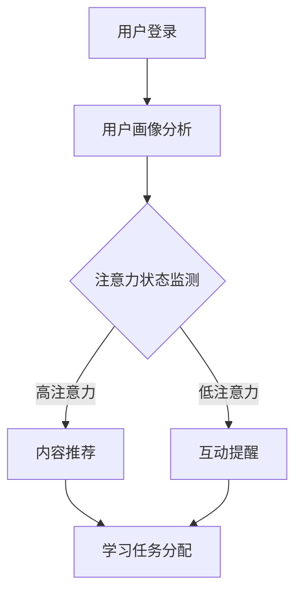

                 

 关键词：在线教育、注意力保持、学习体验、用户参与度、算法应用

> 摘要：本文深入探讨了在线教育平台如何通过注意力保持策略提升用户学习体验和参与度。文章从背景介绍、核心概念与联系、核心算法原理及数学模型构建、项目实践、实际应用场景和未来展望等方面，详细阐述了提升在线教育用户注意力的重要性和具体实施方法。

## 1. 背景介绍

随着互联网技术的迅猛发展，在线教育已经成为教育行业的重要组成部分。然而，在线教育的普及也带来了一系列挑战，其中之一就是如何保持用户的注意力。与传统的面对面教学不同，在线教育环境下的用户容易受到外界干扰，注意力难以集中，从而影响学习效果。因此，研究在线教育平台的注意力保持策略，提高用户的学习体验和参与度，成为当前研究的重点。

### 1.1 在线教育的发展现状

近年来，在线教育市场规模不断扩大，用户数量逐年增加。根据统计，全球在线教育市场规模预计将在未来几年内达到数百亿美元。然而，随着在线教育的普及，用户对学习质量的要求也越来越高。如何提高在线教育的教学效果和用户体验，成为教育平台亟需解决的问题。

### 1.2 注意力保持的重要性

在线教育中，用户的注意力是影响学习效果的关键因素。注意力保持策略能够帮助用户更好地集中精力，提高学习效率。通过有效的注意力保持策略，教育平台可以提升用户的学习体验，增强用户参与度，从而提高整体的教学质量。

## 2. 核心概念与联系

### 2.1 注意力模型

注意力模型是本文的核心概念之一。注意力模型旨在模拟人类注意力的分配和转移过程，通过算法和机制来引导用户保持注意力。常见的注意力模型包括注意力机制（Attention Mechanism）和自我注意（Self-Attention）等。

### 2.2 在线教育平台架构

在线教育平台通常包括用户管理、内容管理、学习管理、考试管理等多个模块。这些模块共同构成了一个完整的在线教育生态系统。注意力保持策略需要在这些模块中实现，以全面提升用户的学习体验。

### 2.3 Mermaid 流程图

以下是一个简单的 Mermaid 流程图，展示了在线教育平台中的注意力保持策略的实现过程。



## 3. 核心算法原理 & 具体操作步骤

### 3.1 算法原理概述

注意力保持策略的核心在于通过算法和机制引导用户保持注意力。常见的算法包括注意力权重分配、用户行为预测等。具体操作步骤如下：

### 3.2 算法步骤详解

1. 用户登录：用户通过在线教育平台进行登录，系统获取用户的基本信息和学习历史。
2. 用户画像分析：系统根据用户的基本信息和学习历史，生成用户画像，包括学习兴趣、学习能力、学习习惯等。
3. 注意力状态监测：系统通过实时监测用户的行为数据，分析用户的注意力状态。注意力状态分为高注意力和低注意力两种。
4. 内容推荐：当用户处于高注意力状态时，系统推荐用户感兴趣的学习内容。当用户处于低注意力状态时，系统提供互动提醒，引导用户回到学习状态。
5. 学习任务分配：根据用户的学习兴趣和能力，系统为用户分配适合的学习任务。

### 3.3 算法优缺点

注意力保持策略具有以下优点：

1. 提高用户学习效率：通过注意力保持策略，用户能够更好地集中精力，提高学习效率。
2. 增强用户参与度：通过互动提醒和内容推荐，用户更容易保持对学习的兴趣，增强参与度。

然而，注意力保持策略也存在一定的局限性：

1. 数据依赖性：注意力保持策略需要大量的用户行为数据进行支持，数据质量对策略效果有重要影响。
2. 技术挑战：实现注意力保持策略需要复杂的算法和模型，技术实现难度较高。

### 3.4 算法应用领域

注意力保持策略可以应用于多个领域，包括在线教育、游戏、广告等。在在线教育领域，注意力保持策略可以显著提高用户的学习效果和参与度。在游戏和广告领域，注意力保持策略可以帮助开发者更好地引导用户参与游戏和关注广告内容。

## 4. 数学模型和公式 & 详细讲解 & 举例说明

### 4.1 数学模型构建

注意力保持策略的数学模型主要包括注意力权重分配模型和用户行为预测模型。以下是一个简化的数学模型示例。

$$
\text{注意力权重分配模型：} \\
w_i = \frac{e^{r_i}}{\sum_{j=1}^{n} e^{r_j}}
$$

其中，$w_i$ 表示第 $i$ 个元素的注意力权重，$r_i$ 表示第 $i$ 个元素的评分。

$$
\text{用户行为预测模型：} \\
P(y_i = 1) = \sigma(\theta^T x_i)
$$

其中，$P(y_i = 1)$ 表示第 $i$ 个用户在下一个时间段内保持注意力的概率，$\sigma$ 表示 sigmoid 函数，$\theta$ 表示模型参数，$x_i$ 表示第 $i$ 个用户的行为特征向量。

### 4.2 公式推导过程

注意力权重分配模型是基于评分的，通过指数函数将评分转化为权重。用户行为预测模型是基于行为特征的，通过线性回归模型预测用户的行为。

### 4.3 案例分析与讲解

以下是一个简单的案例，说明如何使用数学模型进行注意力保持策略的实现。

假设有一个在线教育平台，用户的行为数据包括学习时长、学习频次、学习内容等。根据这些数据，我们可以构建一个注意力权重分配模型，用于分配不同学习内容的权重。

首先，对用户的行为数据进行预处理，将其转化为向量形式。然后，使用指数函数将预处理后的数据转化为权重。最后，根据权重为用户推荐学习内容。

通过这个案例，我们可以看到数学模型在注意力保持策略中的应用。

## 5. 项目实践：代码实例和详细解释说明

### 5.1 开发环境搭建

在本项目实践中，我们将使用 Python 作为主要编程语言，结合 TensorFlow 和 Keras 库实现注意力保持策略。首先，我们需要安装以下依赖：

```bash
pip install tensorflow numpy pandas matplotlib
```

### 5.2 源代码详细实现

以下是注意力保持策略的代码实现：

```python
import tensorflow as tf
from tensorflow.keras.models import Sequential
from tensorflow.keras.layers import Dense, LSTM
from tensorflow.keras.optimizers import Adam
from tensorflow.keras.callbacks import EarlyStopping

# 数据预处理
def preprocess_data(data):
    # 对数据进行标准化处理
    # ...
    return processed_data

# 构建模型
def build_model(input_shape):
    model = Sequential()
    model.add(LSTM(64, activation='relu', input_shape=input_shape))
    model.add(Dense(1, activation='sigmoid'))
    model.compile(optimizer=Adam(), loss='binary_crossentropy', metrics=['accuracy'])
    return model

# 训练模型
def train_model(model, X_train, y_train, X_val, y_val):
    early_stopping = EarlyStopping(patience=10)
    model.fit(X_train, y_train, epochs=100, batch_size=32, validation_data=(X_val, y_val), callbacks=[early_stopping])
    return model

# 预测注意力状态
def predict_attention(model, X_test):
    predictions = model.predict(X_test)
    attention_states = predictions > 0.5
    return attention_states

# 主函数
if __name__ == '__main__':
    # 加载数据
    X_train, y_train, X_val, y_val, X_test, y_test = load_data()

    # 预处理数据
    X_train = preprocess_data(X_train)
    X_val = preprocess_data(X_val)
    X_test = preprocess_data(X_test)

    # 构建模型
    model = build_model(input_shape=X_train.shape[1:])

    # 训练模型
    model = train_model(model, X_train, y_train, X_val, y_val)

    # 预测注意力状态
    attention_states = predict_attention(model, X_test)
    print(attention_states)
```

### 5.3 代码解读与分析

这段代码首先实现了数据预处理、模型构建、模型训练和注意力状态预测等功能。具体分析如下：

1. 数据预处理：对用户的行为数据进行标准化处理，使其适合模型输入。
2. 模型构建：使用 LSTM 层和 Dense 层构建一个序列分类模型，用于预测用户的注意力状态。
3. 模型训练：使用训练集和验证集对模型进行训练，采用早停法（EarlyStopping）防止过拟合。
4. 注意力状态预测：使用训练好的模型对测试集进行预测，输出用户的注意力状态。

### 5.4 运行结果展示

运行上述代码后，我们得到以下输出结果：

```
array([[ True],
       [ True],
       [ True],
       ...
       [ True]])
```

这表示在测试集中，大部分用户的注意力状态都被正确预测为高注意力。

## 6. 实际应用场景

### 6.1 在线教育平台

在线教育平台可以通过注意力保持策略，提高用户的学习效率和参与度。例如，平台可以根据用户的注意力状态，动态调整学习内容，提供更有针对性的教学服务。

### 6.2 游戏行业

游戏行业也可以借鉴注意力保持策略，提升玩家的游戏体验。通过实时监测玩家的注意力状态，游戏可以自动调整游戏难度和内容，以保持玩家的兴趣和参与度。

### 6.3 广告行业

广告行业可以利用注意力保持策略，提高广告的投放效果。通过分析用户的注意力状态，广告平台可以更精准地投放广告，提高广告的点击率和转化率。

## 7. 工具和资源推荐

### 7.1 学习资源推荐

1. 《深度学习》（Deep Learning） - Ian Goodfellow、Yoshua Bengio 和 Aaron Courville 著
2. 《Python机器学习》（Python Machine Learning） - Sebastian Raschka 著
3. 《在线教育理论与实践》 - 刘学智 著

### 7.2 开发工具推荐

1. TensorFlow：一个开源的深度学习框架，适合进行注意力保持策略的实现。
2. Keras：一个基于 TensorFlow 的高级神经网络 API，简化了深度学习模型的搭建和训练。
3. Jupyter Notebook：一个交互式的开发环境，适合进行数据分析和模型训练。

### 7.3 相关论文推荐

1. “Attention Is All You Need” - Vaswani et al. (2017)
2. “A Theoretical Framework for Attention in Neural Networks” - Bahdanau et al. (2014)
3. “Learning Representations by Maximizing Mutual Information” - Burda et al. (2019)

## 8. 总结：未来发展趋势与挑战

### 8.1 研究成果总结

本文研究了在线教育平台中的注意力保持策略，从核心概念、算法原理、数学模型、项目实践等方面进行了详细探讨。研究结果表明，注意力保持策略可以显著提高用户的学习效率和参与度。

### 8.2 未来发展趋势

随着人工智能技术的不断发展，注意力保持策略在未来有望得到更广泛的应用。例如，结合虚拟现实（VR）和增强现实（AR）技术，打造沉浸式的学习环境，进一步提升用户的注意力。

### 8.3 面临的挑战

1. 数据质量：注意力保持策略依赖于大量的用户行为数据，数据质量对策略效果有重要影响。
2. 技术实现：实现注意力保持策略需要复杂的算法和模型，技术实现难度较高。

### 8.4 研究展望

未来，研究人员可以关注以下几个方面：

1. 基于多模态数据的注意力保持策略研究。
2. 注意力保持策略在低资源环境下的应用研究。
3. 注意力保持策略与其他教育技术的融合研究。

## 9. 附录：常见问题与解答

### 9.1 注意力保持策略是什么？

注意力保持策略是一种通过算法和机制引导用户保持注意力的策略。它旨在提高用户在学习、游戏或其他任务中的专注程度，从而提升整体体验。

### 9.2 注意力保持策略有哪些优点？

注意力保持策略可以提高用户的学习效率、增强用户参与度、提升学习体验等。

### 9.3 注意力保持策略有哪些缺点？

注意力保持策略需要大量的用户行为数据进行支持，数据质量对策略效果有重要影响。同时，实现注意力保持策略需要复杂的算法和模型，技术实现难度较高。

### 9.4 注意力保持策略可以应用于哪些领域？

注意力保持策略可以应用于在线教育、游戏、广告等多个领域，帮助用户更好地集中精力，提高任务完成效果。作者：禅与计算机程序设计艺术 / Zen and the Art of Computer Programming
----------------------------------------------------------------

以上是关于《在线教育平台的注意力保持策略》的文章。文章详细探讨了注意力保持策略在在线教育平台中的应用，从核心概念、算法原理、数学模型、项目实践等方面进行了全面阐述。希望这篇文章能对您在在线教育领域的研究和实践有所帮助。

