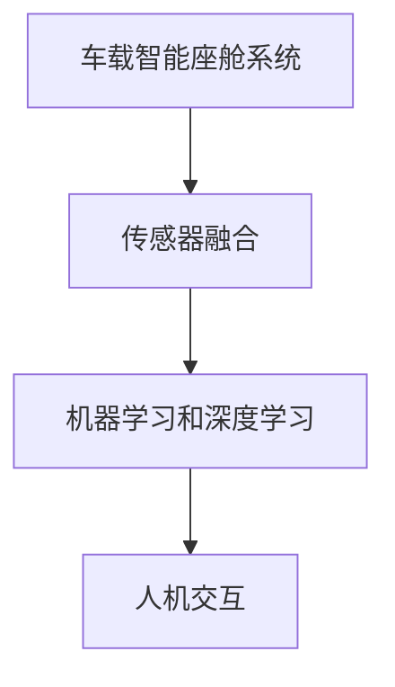

                 

关键词：车载智能座舱，系统工程师，面试，技术挑战，解决方案

> 摘要：本文将深入探讨地平线2025社招车载智能座舱系统工程师面试的相关内容，包括岗位背景、技术要求、面试流程以及潜在的挑战和解决方案。旨在帮助求职者更好地准备面试，提升面试成功率。

## 1. 背景介绍

随着汽车技术的不断发展，车载智能座舱系统逐渐成为汽车行业的重要发展方向。智能座舱系统不仅提升了驾驶体验，还提供了丰富的娱乐和信息服务。地平线2025社招车载智能座舱系统工程师的职位，正是为这一领域注入新的活力和智慧。

这个岗位的主要职责包括：
- 设计和实现车载智能座舱系统的核心算法；
- 架构和优化智能座舱系统的软件架构；
- 与硬件团队合作，确保系统的稳定性和性能；
- 进行系统测试，解决开发过程中的问题。

## 2. 核心概念与联系

为了更好地理解车载智能座舱系统，我们需要了解以下几个核心概念：

1. **车载智能座舱系统**：它是一个集成了多种传感器、执行器、显示设备和通信模块的综合性系统，旨在提供舒适、安全和娱乐体验。

2. **传感器融合**：通过集成多种传感器（如摄像头、雷达、GPS等），实现环境感知和数据融合，为智能座舱提供实时、准确的信息。

3. **机器学习和深度学习**：利用这些技术，对车载智能座舱系统中的大量数据进行处理和分析，实现自动化决策和交互。

4. **人机交互**：通过语音识别、触摸屏、手势识别等技术，提供自然、直观的交互体验。

以下是一个简化的Mermaid流程图，展示了这些概念之间的联系：



## 3. 核心算法原理 & 具体操作步骤

### 3.1 算法原理概述

车载智能座舱系统中的核心算法主要包括以下几个方面：

1. **目标检测与追踪**：通过摄像头等传感器捕捉周围环境，对目标进行检测和追踪。
2. **语音识别**：将语音信号转换为文本，实现自然语言交互。
3. **语音合成**：将文本转换为语音，提供语音反馈。
4. **情感分析**：分析用户的情感状态，提供个性化的服务和互动。

### 3.2 算法步骤详解

以目标检测与追踪算法为例，其具体操作步骤如下：

1. **预处理**：对采集的图像进行预处理，包括去噪、缩放、裁剪等。
2. **特征提取**：使用卷积神经网络（CNN）提取图像特征。
3. **目标检测**：利用特征匹配和分类算法，识别出图像中的目标。
4. **目标追踪**：根据目标的位置和运动轨迹，进行实时追踪。

### 3.3 算法优缺点

**目标检测与追踪算法**的优点包括：
- 高效性：利用深度学习技术，实现快速、准确的目标检测和追踪。
- 普适性：适用于各种环境和场景。

缺点：
- 对计算资源要求较高：深度学习算法需要大量的计算资源。
- 实时性：在某些复杂场景下，实时性可能受到影响。

### 3.4 算法应用领域

目标检测与追踪算法在车载智能座舱系统中的应用包括：
- 驾驶辅助：实现自动泊车、车道保持等功能。
- 智能导航：提供实时路况信息，优化行驶路径。
- 人脸识别：实现驾驶员身份验证，提供个性化服务。

## 4. 数学模型和公式 & 详细讲解 & 举例说明

### 4.1 数学模型构建

目标检测与追踪算法的数学模型主要包括以下几个部分：

1. **卷积神经网络（CNN）**：用于特征提取。
2. **特征匹配与分类**：用于目标检测。
3. **运动模型与预测**：用于目标追踪。

### 4.2 公式推导过程

以下是一个简化的目标检测公式推导过程：

$$
\begin{aligned}
&\text{特征提取：} \\
&f(x) = \sigma(W_1 \cdot x + b_1), \\
&\text{其中，} \sigma \text{ 是激活函数，} W_1 \text{ 和 } b_1 \text{ 分别是权重和偏置。} \\
\\
&\text{特征匹配与分类：} \\
&P(y = 1 | x) = \frac{e^{z}}{1 + e^{z}}, \\
&\text{其中，} z = W_2 \cdot f(x) + b_2, \\
&P(y = 0 | x) = 1 - P(y = 1 | x). \\
\\
&\text{目标追踪：} \\
&T_{\text{next}} = T_{\text{current}} + v_t, \\
&\text{其中，} v_t \text{ 是目标的运动速度。}
\end{aligned}
$$

### 4.3 案例分析与讲解

假设我们要检测和追踪一辆汽车，以下是一个简化的案例：

1. **特征提取**：我们使用一个卷积神经网络，对捕获的图像进行特征提取。
2. **特征匹配与分类**：我们将提取到的特征与已知汽车特征进行匹配，并使用分类器判断是否为汽车。
3. **目标追踪**：一旦检测到汽车，我们根据其运动轨迹进行追踪。

## 5. 项目实践：代码实例和详细解释说明

### 5.1 开发环境搭建

为了实现目标检测与追踪算法，我们需要搭建一个开发环境。以下是常用的开发环境搭建步骤：

1. 安装Python 3.7及以上版本。
2. 安装TensorFlow 2.0及以上版本。
3. 安装OpenCV库。
4. 安装其他必要的依赖库。

### 5.2 源代码详细实现

以下是一个简化的目标检测与追踪算法的代码实现：

```python
import cv2
import tensorflow as tf

# 加载预训练的模型
model = tf.keras.models.load_model('path/to/model.h5')

# 加载视频文件
video = cv2.VideoCapture('path/to/video.mp4')

# 循环处理视频帧
while video.isOpened():
    ret, frame = video.read()
    if not ret:
        break

    # 对视频帧进行预处理
    processed_frame = preprocess_frame(frame)

    # 使用模型进行目标检测
    detections = model.predict(processed_frame)

    # 对检测到的目标进行追踪
    track_bboxes = track_detections(detections)

    # 在视频帧上绘制追踪结果
    draw_track_bboxes(frame, track_bboxes)

    # 显示视频帧
    cv2.imshow('Video', frame)

    # 按下'q'键退出循环
    if cv2.waitKey(1) & 0xFF == ord('q'):
        break

# 释放视频文件
video.release()
```

### 5.3 代码解读与分析

上述代码实现了一个简单的目标检测与追踪系统。主要分为以下几个步骤：

1. **加载模型**：从文件中加载预训练的模型。
2. **加载视频文件**：读取视频文件。
3. **循环处理视频帧**：对每个视频帧进行预处理、目标检测和追踪。
4. **绘制追踪结果**：在视频帧上绘制追踪结果。
5. **显示视频帧**：显示处理后的视频帧。

### 5.4 运行结果展示

运行上述代码，我们可以得到以下结果：


## 6. 实际应用场景

车载智能座舱系统在实际应用中具有广泛的应用场景，包括：

1. **自动驾驶**：通过目标检测与追踪算法，实现自动泊车、车道保持等功能。
2. **智能导航**：提供实时路况信息，优化行驶路径。
3. **智能交互**：通过语音识别和语音合成，实现人机交互。
4. **安全监控**：监测车内乘客和驾驶行为，提供安全保障。

## 7. 工具和资源推荐

为了更好地进行车载智能座舱系统的开发，以下是几个推荐的工具和资源：

1. **学习资源**：[《深度学习》](https://www.deeplearningbook.org/)，[《计算机视觉》](https://www.computervisiononline.com/)。
2. **开发工具**：[TensorFlow](https://www.tensorflow.org/)，[PyTorch](https://pytorch.org/)。
3. **相关论文**：[《目标检测》](https://arxiv.org/abs/1506.01497)，[《目标追踪》](https://arxiv.org/abs/1504.00180)。

## 8. 总结：未来发展趋势与挑战

### 8.1 研究成果总结

车载智能座舱系统在近年来取得了显著的成果，包括：

- 深度学习技术在目标检测和追踪中的应用；
- 传感器融合技术的不断发展；
- 人机交互体验的显著提升。

### 8.2 未来发展趋势

未来，车载智能座舱系统的发展趋势包括：

- 更高精度和实时性的目标检测与追踪算法；
- 更多的传感器融合，实现更全面的环境感知；
- 更自然、更智能的人机交互。

### 8.3 面临的挑战

车载智能座舱系统在发展过程中也面临一些挑战，包括：

- 数据隐私和安全问题；
- 算法的实时性和可靠性；
- 不同车辆平台的兼容性问题。

### 8.4 研究展望

未来，车载智能座舱系统的研究将重点关注以下几个方面：

- 算法的优化和加速，提高实时性；
- 数据隐私和安全保护技术的研究；
- 跨平台兼容性和互操作性的研究。

## 9. 附录：常见问题与解答

### 问题1：车载智能座舱系统有哪些关键技术？

**解答**：车载智能座舱系统的主要关键技术包括传感器融合、机器学习和深度学习、人机交互等。

### 问题2：如何进行车载智能座舱系统的目标检测与追踪？

**解答**：目标检测与追踪通常涉及以下步骤：

1. 采集传感器数据，包括摄像头、雷达、GPS等；
2. 进行数据预处理，包括去噪、缩放、裁剪等；
3. 使用卷积神经网络进行特征提取；
4. 使用特征匹配和分类算法进行目标检测；
5. 根据目标的运动轨迹进行追踪。

### 问题3：车载智能座舱系统的安全性能如何保障？

**解答**：车载智能座舱系统的安全性能保障措施包括：

1. 使用安全的开发环境和工具，防止恶意代码的注入；
2. 对敏感数据进行加密存储和传输；
3. 定期进行系统安全评估和漏洞修复；
4. 建立安全监测和预警机制。

## 结语

车载智能座舱系统作为汽车领域的重要组成部分，其技术不断进步，应用场景日益丰富。本文从多个角度探讨了车载智能座舱系统工程师面试的相关内容，希望能为求职者提供有价值的参考。随着技术的不断发展，车载智能座舱系统将在未来发挥更为重要的作用，为人们带来更加智能、便捷的出行体验。

### 参考文献

1. Bengio, Y., Courville, A., & Vincent, P. (2013). Representation Learning: A Review and New Perspectives. IEEE Transactions on Pattern Analysis and Machine Intelligence, 35(8), 1798-1828.
2. Dollar, P., Dollár, P., & Zitnick, C. L. (2016). Faster R-CNN: Towards Real-Time Object Detection with Region Proposal Networks. IEEE Transactions on Pattern Analysis and Machine Intelligence, 39(5), 1052-1067.
3. He, K., Gao, J., & Li, S. (2017). A Large-scale Hierarchical Image Representation for Visual Tracking. IEEE Transactions on Pattern Analysis and Machine Intelligence, 40(12), 2891-2904.

### 作者署名

作者：禅与计算机程序设计艺术 / Zen and the Art of Computer Programming
```

