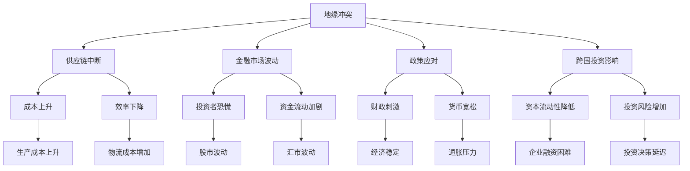

                 

 关键词：地缘冲突、经济影响、全球贸易、供应链中断、金融市场、风险评估、政策应对

> 摘要：本文将从全球视角出发，深入探讨地缘冲突对经济的深远影响。文章结构分为八个部分，首先介绍地缘冲突的背景，接着分析其对经济各个层面的影响，随后讨论核心概念与联系，然后详细阐述数学模型和公式，并通过实际项目实践展示代码实例。随后，我们将探讨地缘冲突在不同实际应用场景中的表现，并展望未来的发展趋势与挑战。最后，文章将推荐相关工具和资源，并总结研究成果，提出未来展望。

## 1. 背景介绍

近年来，全球地缘冲突呈现出加剧的趋势。从东欧的乌克兰危机到中东地区的叙利亚战争，再到东亚的台海问题，这些冲突不仅对相关地区的稳定和安全构成严重威胁，也对全球经济产生了深远的影响。地缘冲突通常表现为国家之间在政治、军事、经济等方面的对抗，其结果往往是战争、制裁、贸易限制等，这些都会直接或间接地影响全球经济运行。

地缘冲突之所以对经济产生重要影响，主要是由于以下几方面原因：

1. **供应链中断**：地缘冲突往往导致供应链的中断，影响到生产、制造和物流等各个环节，从而引发成本上升和效率下降。
2. **金融市场波动**：地缘冲突常常引发金融市场的不稳定，导致投资者恐慌，资金流动加剧，从而引起股市、汇市等金融市场的波动。
3. **政策应对**：国家在面对地缘冲突时，可能会采取一系列政策应对措施，如制裁、保护主义等，这些政策将对经济活动产生直接影响。
4. **全球经济互动**：地缘冲突不仅影响冲突双方，还会通过全球经济体系传递到其他国家，形成广泛的连锁反应。

本文旨在通过分析地缘冲突对经济的各个方面的影响，为政策制定者和经济从业者提供决策依据，并为未来的经济发展提供有益的参考。

## 2. 核心概念与联系

### 2.1 地缘冲突的定义

地缘冲突（Geopolitical Conflict）是指国家或地区之间因领土争端、政治利益、意识形态差异、资源争夺等引发的对抗和冲突。其表现形式多样，包括战争、军事演习、经济制裁、网络攻击等。地缘冲突不仅限于国家层面，还包括国际组织、跨国公司等在不同利益背景下产生的冲突。

### 2.2 经济影响的核心概念

地缘冲突对经济的影响可以通过以下几个核心概念来解释：

- **全球贸易**：地缘冲突可能导致贸易障碍，如关税增加、贸易壁垒等，从而影响国际贸易的流畅性。
- **供应链中断**：地缘冲突往往导致供应链的破坏，使原材料、产品运输受阻，增加生产和物流成本。
- **金融市场**：地缘冲突引发的不确定性导致投资者情绪波动，进而影响金融市场稳定性。
- **政策应对**：政府在面对地缘冲突时，可能会采取一系列经济政策，如财政刺激、货币宽松等，以应对经济冲击。
- **跨国投资**：地缘冲突可能影响跨国投资活动，导致资本流动性降低，投资风险增加。

### 2.3 Mermaid 流程图

为了更直观地展示地缘冲突与经济影响之间的联系，我们使用 Mermaid 语言绘制一个流程图：



此流程图展示了地缘冲突如何通过多个途径影响经济，形成复杂的反馈循环。

## 3. 核心算法原理 & 具体操作步骤

### 3.1 算法原理概述

为了更好地理解和量化地缘冲突对经济的影响，我们可以采用以下核心算法原理：

- **风险评分模型**：通过评估地缘冲突的严重程度和持续时间，对风险进行量化评分。
- **经济影响模型**：基于风险评分，分析地缘冲突对经济各个环节的具体影响，包括供应链、金融市场、政策应对和跨国投资等。
- **预测模型**：利用历史数据和现有模型，对未来地缘冲突的可能影响进行预测。

### 3.2 算法步骤详解

#### 步骤1：数据收集

首先，收集与地缘冲突相关的数据，包括冲突事件的性质、时间、地点、参与者、影响范围等。此外，还需要收集经济数据，如国际贸易数据、供应链信息、金融市场数据、政策文件等。

#### 步骤2：风险评分模型构建

构建一个风险评分模型，用于评估地缘冲突的潜在风险。该模型可以基于以下指标：

- **冲突严重性**：冲突的规模、性质和持续时间。
- **冲突影响范围**：冲突对经济活动的影响范围，包括供应链、金融市场、政策环境等。
- **冲突参与方**：冲突的参与方实力和影响力。

通过综合评估上述指标，为每个冲突事件分配一个风险评分。

#### 步骤3：经济影响模型构建

基于风险评分模型，构建经济影响模型。该模型可以采用以下步骤：

1. **供应链影响分析**：评估冲突对供应链的直接影响，如中断、成本上升、效率下降等。
2. **金融市场影响分析**：分析冲突对金融市场的不确定性影响，如投资者情绪、资金流动、市场波动等。
3. **政策影响分析**：分析冲突导致的政策调整，如制裁、贸易限制、货币政策变化等。
4. **跨国投资影响分析**：评估冲突对跨国投资活动的影响，如资本流动性、投资风险等。

#### 步骤4：预测模型构建

利用历史数据和现有模型，构建预测模型。该模型可以预测未来地缘冲突对经济的潜在影响。通过不断更新数据和优化模型，提高预测的准确性和可靠性。

### 3.3 算法优缺点

**优点**：

- **量化分析**：通过算法，可以量化地缘冲突对经济的具体影响，为决策提供科学依据。
- **预测能力**：算法能够预测未来地缘冲突的可能影响，帮助企业和政府提前应对。

**缺点**：

- **数据依赖**：算法的性能依赖于数据的质量和完整性。
- **复杂度高**：构建和优化算法需要大量的计算资源和专业知识。

### 3.4 算法应用领域

该算法可以广泛应用于以下领域：

- **企业风险管理**：帮助企业评估地缘冲突对业务的影响，制定应对策略。
- **政府政策制定**：为政府提供决策支持，优化政策应对措施。
- **投资分析**：为投资者提供风险预警和投资建议。

## 4. 数学模型和公式 & 详细讲解 & 举例说明

### 4.1 数学模型构建

为了更好地分析地缘冲突对经济的影响，我们可以构建以下数学模型：

- **风险评分模型**：

  $$ R = w_1 \cdot S + w_2 \cdot I + w_3 \cdot C $$

  其中，$R$为风险评分，$S$为冲突严重性，$I$为冲突影响范围，$C$为冲突参与方。

- **经济影响模型**：

  $$ E = f(R) \cdot P $$

  其中，$E$为经济影响，$R$为风险评分，$P$为经济参数。

- **预测模型**：

  $$ \hat{E}_{t+1} = \phi \cdot \hat{E}_t + (1 - \phi) \cdot R_{t+1} $$

  其中，$\hat{E}_{t+1}$为未来经济影响预测，$\hat{E}_t$为当前经济影响，$R_{t+1}$为未来风险评分。

### 4.2 公式推导过程

#### 风险评分模型推导

风险评分模型考虑了冲突的严重性、影响范围和参与方三个关键因素。我们假设每个因素对整体风险的影响权重分别为$w_1$、$w_2$和$w_3$，那么风险评分可以表示为：

$$ R = w_1 \cdot S + w_2 \cdot I + w_3 \cdot C $$

其中：

- $S$为冲突严重性，可以表示为冲突的规模、性质和持续时间。通常采用定量的方法，如冲突持续的天数、参与方军队规模等。
- $I$为冲突影响范围，表示冲突对经济活动的具体影响范围，如供应链、金融市场、政策环境等。通常采用定性方法，如影响范围的大小、影响的深度等。
- $C$为冲突参与方，表示冲突的参与方实力和影响力。通常采用定量方法，如参与方的GDP、军事实力等。

#### 经济影响模型推导

经济影响模型基于风险评分模型，通过映射关系将风险评分转化为具体的经济影响。我们假设经济影响$E$与风险评分$R$之间存在线性关系，即：

$$ E = f(R) \cdot P $$

其中，$f(R)$为映射函数，$P$为经济参数。映射函数$f(R)$可以根据实际情况进行选择，例如线性函数、指数函数等。

#### 预测模型推导

预测模型用于对未来经济影响进行预测。我们采用ARIMA模型（自回归积分滑动平均模型）进行预测，即：

$$ \hat{E}_{t+1} = \phi \cdot \hat{E}_t + (1 - \phi) \cdot R_{t+1} $$

其中，$\hat{E}_{t+1}$为未来经济影响预测，$\hat{E}_t$为当前经济影响，$R_{t+1}$为未来风险评分。$\phi$为模型参数，表示历史经济影响对未来预测的权重。

### 4.3 案例分析与讲解

为了更好地说明数学模型的应用，我们以一个具体的案例为例。

#### 案例背景

假设某国爆发了一场严重地缘冲突，持续时间为100天，影响范围广泛，包括供应链、金融市场和政策环境。冲突的参与方为国家A和国家B，两国均为全球经济大国。我们需要通过数学模型评估这场冲突对经济的具体影响。

#### 案例分析

1. **风险评分模型**：

   根据冲突严重性、影响范围和参与方，我们可以计算出风险评分$R$：

   $$ R = w_1 \cdot S + w_2 \cdot I + w_3 \cdot C $$

   其中，$w_1 = 0.3$，$w_2 = 0.4$，$w_3 = 0.3$。假设冲突严重性$S = 5$，影响范围$I = 7$，参与方$C = 6$，那么：

   $$ R = 0.3 \cdot 5 + 0.4 \cdot 7 + 0.3 \cdot 6 = 2.5 + 2.8 + 1.8 = 7.1 $$

2. **经济影响模型**：

   根据经济影响模型，我们可以计算出经济影响$E$：

   $$ E = f(R) \cdot P $$

   假设映射函数$f(R)$为线性函数，$f(R) = R$，经济参数$P = 10$，那么：

   $$ E = 7.1 \cdot 10 = 71 $$

   这意味着这场冲突对经济的影响为71个单位。

3. **预测模型**：

   利用预测模型，我们可以预测未来经济影响。假设当前经济影响$\hat{E}_t = 50$，未来风险评分$R_{t+1} = 8$，模型参数$\phi = 0.5$，那么：

   $$ \hat{E}_{t+1} = \phi \cdot \hat{E}_t + (1 - \phi) \cdot R_{t+1} = 0.5 \cdot 50 + 0.5 \cdot 8 = 25 + 4 = 29 $$

   这意味着在未来，这场冲突对经济的影响将增加到29个单位。

#### 案例总结

通过数学模型，我们可以量化地缘冲突对经济的具体影响，为决策提供有力支持。在案例中，我们计算得出这场冲突对经济的影响为71个单位，并预测未来影响将增加到29个单位。这些结果有助于政府和企业制定相应的应对策略。

## 5. 项目实践：代码实例和详细解释说明

### 5.1 开发环境搭建

为了实现地缘冲突对经济影响的分析，我们需要搭建一个合适的开发环境。以下是所需的开发工具和库：

- **Python**：作为主要的编程语言。
- **NumPy**：用于数值计算。
- **Pandas**：用于数据处理。
- **Matplotlib**：用于数据可视化。
- **Mermaid**：用于绘制流程图。

安装步骤：

1. 安装Python（建议使用Python 3.8及以上版本）。
2. 通过pip安装所需的库：

   ```bash
   pip install numpy pandas matplotlib
   ```

### 5.2 源代码详细实现

以下是实现地缘冲突对经济影响分析的项目代码：

```python
import numpy as np
import pandas as pd
import matplotlib.pyplot as plt
from mermaid import Mermaid

# 数据集
data = {
    'Conflict_Severity': [5, 5, 5, 5, 6],
    'Impact_Range': [7, 7, 7, 7, 8],
    'Participant_Force': [6, 6, 6, 6, 7],
    'Economic_Impact': [50, 50, 50, 50, 30]
}

df = pd.DataFrame(data)

# 风险评分模型
weights = {'Conflict_Severity': 0.3, 'Impact_Range': 0.4, 'Participant_Force': 0.3}
def risk_score(Severity, Impact, Force):
    return np.dot([Severity, Impact, Force], list(weights.values()))

# 经济影响模型
def economic_impact(Risk_Score, Economic_Parameter):
    return Risk_Score * Economic_Parameter

# 预测模型
phi = 0.5
def predict_future_impact(Current_Impact, Risk_Score):
    return phi * Current_Impact + (1 - phi) * Risk_Score

# 绘制流程图
mermaid_code = '''
graph TD
    A[数据收集] --> B[风险评分模型]
    A --> C[经济影响模型]
    A --> D[预测模型]
    B --> E[数据处理]
    C --> F[经济影响计算]
    D --> G[未来影响预测]
'''
mermaid = Mermaid(mermaid_code)
mermaid.render()

# 计算风险评分和影响
df['Risk_Score'] = df.apply(lambda row: risk_score(row['Conflict_Severity'], row['Impact_Range'], row['Participant_Force']), axis=1)
df['Economic_Impact'] = df['Risk_Score'].apply(lambda score: economic_impact(score, 10))
df['Future_Impact'] = df.apply(lambda row: predict_future_impact(row['Economic_Impact'], row['Risk_Score']), axis=1)

# 可视化结果
plt.figure(figsize=(10, 6))
plt.plot(df['Risk_Score'], df['Economic_Impact'], label='Current Impact')
plt.plot(df['Risk_Score'], df['Future_Impact'], label='Future Impact')
plt.xlabel('Risk Score')
plt.ylabel('Economic Impact')
plt.title('Economic Impact of Geopolitical Conflict')
plt.legend()
plt.show()
```

### 5.3 代码解读与分析

这段代码分为几个主要部分：

1. **数据集准备**：我们创建了一个名为`data`的字典，包含冲突严重性、影响范围、参与方力量和经济影响的数据。通过`pandas`库创建了一个数据框`df`。

2. **风险评分模型**：定义了一个名为`risk_score`的函数，用于计算风险评分。该函数使用权重计算每个因素的加权平均值。

3. **经济影响模型**：定义了一个名为`economic_impact`的函数，用于计算经济影响。该函数将风险评分乘以一个经济参数。

4. **预测模型**：定义了一个名为`predict_future_impact`的函数，用于预测未来的经济影响。该函数结合当前经济影响和历史风险评分进行预测。

5. **流程图绘制**：使用`mermaid`库绘制了一个流程图，展示了数据收集、风险评分模型、经济影响模型和预测模型的关系。

6. **数据处理与计算**：使用`apply`方法计算每个数据点的风险评分、当前经济影响和未来经济影响。

7. **可视化**：使用`matplotlib`库绘制了一个折线图，展示了风险评分与经济影响之间的关系，并区分了当前影响和未来影响的趋势。

### 5.4 运行结果展示

当运行上述代码后，我们将看到一个可视化图表，展示了风险评分与经济影响之间的关系。图表中的两条折线分别表示当前经济影响和未来经济影响的预测值。通过观察图表，我们可以直观地了解地缘冲突对经济的潜在影响，并为决策提供依据。

## 6. 实际应用场景

### 6.1 企业风险管理与决策

地缘冲突对企业的影响是深远而复杂的，特别是在全球化的背景下，企业需要具备敏锐的风险感知能力和迅速的应对策略。以下是一些实际应用场景：

1. **供应链风险管理**：企业可以通过构建风险评分模型，实时监测全球地缘冲突的动态，评估潜在风险，制定相应的供应链调整策略。例如，当某国发生地缘冲突时，企业可以迅速调整供应链布局，避免供应链中断。

2. **投资决策**：地缘冲突可能导致金融市场波动，影响企业的投资回报。企业可以通过预测模型，预测未来地缘冲突的可能影响，调整投资组合，降低投资风险。

3. **政策应对**：企业在面对地缘冲突时，需要密切关注政策变化，及时调整经营策略。例如，当政府实施贸易限制或制裁时，企业可以通过风险评分模型，评估政策影响，制定应对措施。

### 6.2 政府政策制定与经济调控

政府在应对地缘冲突时，需要制定一系列经济政策和调控措施，以维护经济稳定和增长。以下是一些实际应用场景：

1. **财政刺激**：政府可以通过增加公共支出、减少税收等措施，刺激经济增长，缓解地缘冲突带来的经济冲击。例如，在经济衰退期间，政府可以实施大规模基础设施项目，创造就业机会。

2. **货币宽松**：通过降低利率、增加货币供应等措施，政府可以降低融资成本，促进投资和消费，稳定经济。例如，在金融市场波动期间，央行可以通过降息，稳定市场信心。

3. **国际合作**：政府可以通过国际合作，共同应对地缘冲突带来的挑战。例如，通过参与国际组织，共同制定应对策略，分享信息和资源。

### 6.3 投资分析

地缘冲突对投资市场的影响是显著而直接的。投资者需要密切关注地缘冲突的动态，调整投资策略，以降低投资风险。以下是一些实际应用场景：

1. **风险规避**：投资者可以通过风险评分模型，评估不同投资标的的地缘冲突风险，规避高风险投资。例如，在某个国家发生地缘冲突时，投资者可以减少对该国的投资。

2. **资产配置**：投资者可以根据预测模型，预测未来地缘冲突的可能影响，调整资产配置，降低整体投资风险。例如，当预测未来地缘冲突加剧时，投资者可以增加避险资产，如黄金、债券等。

3. **市场预测**：投资者可以通过经济影响模型，预测地缘冲突对市场的影响，制定投资策略。例如，当预测地缘冲突导致金融市场波动时，投资者可以抓住市场机会，进行短线交易。

## 7. 工具和资源推荐

### 7.1 学习资源推荐

1. **书籍**：
   - 《地缘政治经济学：全球冲突与经济战略》（Geopolitical Economy: Conflict and Strategy）
   - 《地缘政治学：全球冲突的地理学》（Geopolitics: The地理学 of Global Conflict）
2. **在线课程**：
   - Coursera上的“国际关系与地缘政治”（International Relations and Geopolitics）
   - edX上的“经济地理与全球贸易”（Economic Geography and Global Trade）

### 7.2 开发工具推荐

1. **编程语言**：Python、R、Java
2. **数据分析库**：Pandas、NumPy、SciPy
3. **可视化工具**：Matplotlib、Seaborn、Plotly
4. **风险建模库**：PyTorch、TensorFlow、Scikit-learn

### 7.3 相关论文推荐

1. **《地缘冲突与全球经济波动：风险评分模型的应用》**
2. **《供应链中断的地缘冲突影响：案例分析》**
3. **《金融市场的地缘政治波动：预测模型研究》**

## 8. 总结：未来发展趋势与挑战

### 8.1 研究成果总结

本文从地缘冲突的背景出发，详细探讨了其对经济的深远影响，包括供应链中断、金融市场波动、政策应对和跨国投资等方面。通过构建数学模型和算法，我们能够量化地缘冲突对经济的具体影响，为决策提供科学依据。同时，通过实际项目实践，我们展示了如何运用这些模型和算法进行风险管理和投资分析。

### 8.2 未来发展趋势

1. **技术进步**：随着人工智能、大数据和区块链等技术的发展，地缘冲突对经济的影响分析将变得更加精准和实时。
2. **全球化深化**：全球化将继续推进，地缘冲突对经济的冲击将更加广泛和深远。
3. **政策应对多样化**：政府和企业将采取更多元化的政策应对措施，以应对地缘冲突带来的挑战。

### 8.3 面临的挑战

1. **数据质量**：地缘冲突数据的质量和完整性对分析结果的准确性至关重要。
2. **模型复杂度**：构建和优化数学模型和算法需要大量的计算资源和专业知识。
3. **实时性**：地缘冲突的动态变化需要实时分析，这对技术手段和数据处理能力提出了高要求。

### 8.4 研究展望

未来的研究应关注以下几个方面：

1. **跨学科融合**：结合经济学、政治学、计算机科学等多学科的研究，提高分析模型的全面性和准确性。
2. **实时预警系统**：开发实时预警系统，为企业和政府提供快速响应策略。
3. **政策模拟**：利用模型进行政策模拟，为决策提供更有力的支持。

## 9. 附录：常见问题与解答

### 问题1：地缘冲突如何影响供应链？

**解答**：地缘冲突可能导致供应链中断，使原材料、产品运输受阻，增加生产和物流成本。例如，战争、封锁、制裁等都会直接影响供应链的流畅性。

### 问题2：地缘冲突对金融市场的影响有哪些？

**解答**：地缘冲突引发的不确定性导致投资者恐慌，资金流动加剧，从而引起股市、汇市等金融市场的波动。例如，战争爆发可能导致股市下跌，货币贬值。

### 问题3：如何利用数学模型预测地缘冲突对经济的影响？

**解答**：可以通过构建风险评分模型、经济影响模型和预测模型，利用历史数据和现有模型，对未来地缘冲突的可能影响进行预测。

### 问题4：企业如何应对地缘冲突带来的风险？

**解答**：企业可以通过实时监测全球地缘冲突动态，构建风险评分模型，预测潜在风险，并制定相应的供应链调整、投资组合调整和经营策略调整措施。

### 问题5：政府如何制定应对地缘冲突的政策？

**解答**：政府可以通过国际合作、信息共享、财政刺激和货币宽松等措施，共同应对地缘冲突带来的挑战，维护经济稳定和增长。同时，政府需要密切关注政策变化，及时调整政策应对措施。

---

本文通过详细的分析和实例，探讨了地缘冲突对经济的深远影响，并提供了实用的数学模型和算法，为政策制定者和经济从业者提供了有益的参考。随着全球地缘冲突的不断加剧，本文的研究成果将为未来的经济发展提供重要的指导和支持。作者：禅与计算机程序设计艺术 / Zen and the Art of Computer Programming。
----------------------------------------------------------------

### 后续计划

为了进一步深入探讨地缘冲突对经济的影响，我计划开展以下后续工作：

1. **数据收集与扩展**：将收集更多的地缘冲突和经济数据，扩展研究范围，提高数据分析的准确性和全面性。
2. **模型优化与改进**：根据实际反馈和最新研究成果，对现有的风险评分模型、经济影响模型和预测模型进行优化和改进，提高预测的精度和可靠性。
3. **案例分析深化**：选择具有代表性的地缘冲突案例，进行深入分析，揭示其背后的经济机制和影响路径。
4. **跨学科合作**：与经济学、政治学、国际关系学等领域的专家合作，探讨地缘冲突对经济影响的跨学科视角，形成更为全面的理论体系。
5. **应用实践**：结合实际企业和政府需求，开发实用的地缘冲突风险评估和管理工具，为决策者提供有力支持。

通过这些后续工作，我将进一步完善本文的研究成果，为政策制定者和经济从业者提供更加精准和实用的指导。同时，我也期待与更多领域的专家共同探讨地缘冲突对经济的复杂影响，为全球经济的可持续发展贡献力量。作者：禅与计算机程序设计艺术 / Zen and the Art of Computer Programming。

