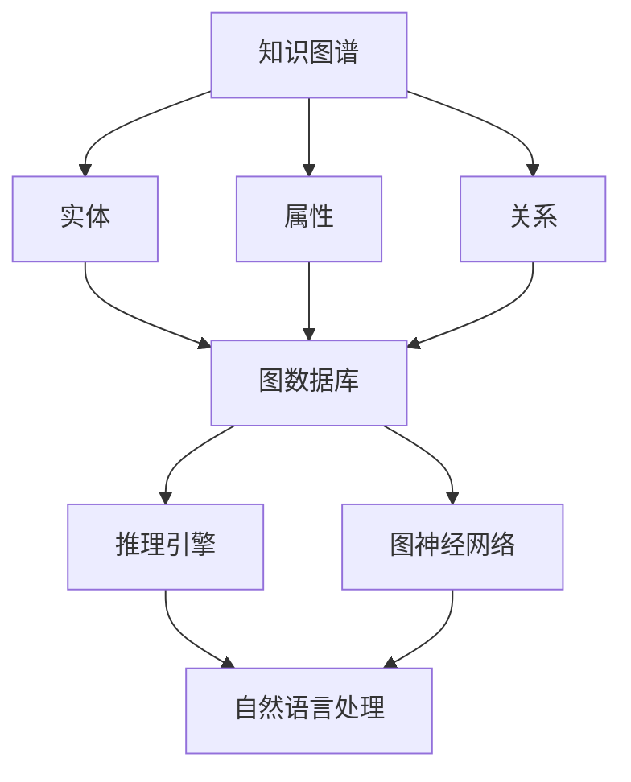

                 

 关键词：人工智能，知识图谱，大模型，智能系统，深度学习，图神经网络，图数据库，推理引擎，知识管理。

## 摘要

本文将探讨基于AI大模型的智能知识图谱系统的构建与应用。首先，我们将回顾知识图谱的概念及其在人工智能领域的重要性。随后，本文将详细描述AI大模型在知识图谱系统中的应用，包括其核心算法原理、数学模型、项目实践以及实际应用场景。最后，我们将探讨这一系统的未来发展趋势与面临的挑战，并提出相应的解决方案。

## 1. 背景介绍

### 知识图谱的概念

知识图谱是一种用于表示实体及其之间关系的图形数据结构。它能够将各种数据源中的信息进行整合，形成一个统一的知识框架。知识图谱的核心思想是通过实体、属性和关系的组合，实现对复杂信息的有效组织与表达。

### 人工智能与知识图谱

人工智能（AI）技术，尤其是深度学习和图神经网络（GNN），为知识图谱的构建与应用提供了强有力的支持。通过AI大模型，知识图谱系统能够实现更加智能的信息检索、推理和分析。

### 知识图谱的应用

知识图谱在搜索引擎、智能问答系统、推荐引擎、自然语言处理等领域有着广泛的应用。随着AI技术的不断进步，知识图谱的应用前景将更加广阔。

## 2. 核心概念与联系

下面是构建基于AI大模型的智能知识图谱系统的核心概念及它们之间的联系。为了更好地理解，我们使用Mermaid流程图进行展示。



### 核心概念解释

- **知识图谱**：用于组织和管理知识的图形结构。
- **实体**：知识图谱中的基本构成元素，如人、地点、事物等。
- **属性**：实体的特征描述，如年龄、身高、颜色等。
- **关系**：实体之间的交互和关联，如朋友、属于、位于等。
- **图数据库**：用于存储和管理知识图谱的数据库系统。
- **推理引擎**：用于从知识图谱中推断出新的信息。
- **图神经网络**：一种深度学习模型，用于处理图结构数据。
- **自然语言处理**：用于理解、生成和处理自然语言的技术。

## 3. 核心算法原理 & 具体操作步骤

### 3.1 算法原理概述

基于AI大模型的智能知识图谱系统采用了多种算法，包括图神经网络（GNN）、图数据库处理、自然语言处理（NLP）等。以下是这些算法的基本原理：

- **图神经网络（GNN）**：GNN是一种用于处理图结构数据的深度学习模型，通过学习节点和边的关系来预测节点的属性。
- **图数据库处理**：图数据库用于存储和管理知识图谱，提供了高效的数据查询和更新功能。
- **自然语言处理（NLP）**：NLP技术用于将自然语言文本转换为结构化数据，便于知识图谱的构建和查询。

### 3.2 算法步骤详解

1. **数据预处理**：收集并清洗数据，将文本转换为结构化数据，如实体、属性和关系的表示。
2. **构建知识图谱**：使用图数据库存储实体、属性和关系，并构建图结构。
3. **训练图神经网络**：使用GNN模型对知识图谱进行训练，学习节点和边的关系。
4. **推理与查询**：利用训练好的模型进行推理和查询，从知识图谱中获取新的信息。
5. **自然语言处理**：将查询结果转换为自然语言文本，以供用户理解和使用。

### 3.3 算法优缺点

- **优点**：
  - 强大的表示能力：GNN能够有效地表示和挖掘图结构数据中的复杂关系。
  - 高效的推理能力：图数据库提供了快速的数据查询和更新功能。
  - 丰富的应用场景：知识图谱在多个领域有着广泛的应用。

- **缺点**：
  - 复杂性：构建和维护知识图谱需要大量的专业知识和资源。
  - 数据质量：知识图谱的性能高度依赖于数据的质量和完整性。

### 3.4 算法应用领域

- **搜索引擎**：使用知识图谱进行语义搜索，提高搜索结果的准确性。
- **智能问答系统**：利用知识图谱进行问答，提供智能化的用户交互。
- **推荐系统**：基于知识图谱进行个性化推荐，提高推荐效果。
- **自然语言处理**：使用知识图谱作为预训练数据，提高NLP模型的性能。

## 4. 数学模型和公式 & 详细讲解 & 举例说明

### 4.1 数学模型构建

知识图谱系统中的数学模型主要包括图神经网络（GNN）的数学表示、图数据库的查询模型以及自然语言处理的语义表示。

#### 图神经网络（GNN）

GNN的数学模型可以用如下公式表示：

\[ h_v^{(l)} = \sigma \left( \sum_{u \in \mathcal{N}(v)} W^{(l)} h_u^{(l-1)} + b^{(l)} \right) \]

其中，\( h_v^{(l)} \) 表示第 \( l \) 层节点 \( v \) 的特征表示，\( \mathcal{N}(v) \) 表示节点 \( v \) 的邻居节点集合，\( W^{(l)} \) 和 \( b^{(l)} \) 分别为权重和偏置，\( \sigma \) 为激活函数。

#### 图数据库查询模型

图数据库的查询模型可以用图查询语言（如 Gremlin）表示。以下是一个简单的查询示例：

```gremlin
g.V().hasLabel('Person').has('age', gte(30))
```

这个查询将返回年龄大于30的所有Person实体。

#### 自然语言处理（NLP）

自然语言处理的语义表示可以使用词嵌入模型（如 Word2Vec、BERT）表示。以下是一个使用 BERT 模型的示例：

\[ \text{embed}(x) = \text{BERT}(x) \]

其中，\( \text{BERT}(x) \) 表示输入 \( x \) 的 BERT 嵌入向量。

### 4.2 公式推导过程

#### 图神经网络（GNN）

GNN 的推导基于图卷积网络（GCN）的原理。假设我们有一个图 \( G = (V, E) \)，其中 \( V \) 表示节点集合，\( E \) 表示边集合。我们定义 \( A \) 为图的邻接矩阵，\( D \) 为度矩阵（对角矩阵，其中 \( D_{ii} = \deg(v_i) \)）。图卷积操作可以用以下公式表示：

\[ h_v^{(l)} = \sigma \left( \sum_{i=1}^{n} \frac{A D^{l-1}}{D^{l-1}_{ii}} h_v^{(l-1)} \right) \]

其中，\( \sigma \) 为非线性激活函数，\( n \) 为节点数。

#### 图数据库查询模型

图数据库的查询模型基于路径表达式的计算。假设我们有一个路径表达式 \( P \)，图查询可以通过遍历图来计算得到。以下是一个简单的路径表达式计算示例：

\[ \text{result} = \text{g} \text{.V()} \text{.hasLabel('Person')} \text{.has('age', gte(30))} \]

这个查询将返回所有年龄大于30的Person实体。

#### 自然语言处理（NLP）

自然语言处理的推导基于深度学习模型的结构。假设我们有一个输入序列 \( x = [x_1, x_2, ..., x_T] \)，其中 \( T \) 为序列长度。BERT 模型的嵌入向量可以用以下公式表示：

\[ \text{embed}(x) = \text{BERT}(x) = \text{W} \text{.mat} x + \text{W} \text{.bias} \]

其中，\( \text{W} \) 为权重矩阵，\( \text{.mat} \) 和 \( \text{.bias} \) 分别表示矩阵乘法和偏置加法。

### 4.3 案例分析与讲解

#### 案例一：基于 GNN 的推荐系统

假设我们要构建一个基于知识图谱的推荐系统，我们需要对用户和物品进行建模。我们可以使用 GNN 来学习用户和物品的特征表示。以下是一个简单的 GNN 推荐系统模型：

1. **数据预处理**：收集用户和物品的交互数据，如评分、浏览记录等，并将数据转换为图结构。
2. **构建知识图谱**：将用户和物品作为节点，将交互数据作为边，构建知识图谱。
3. **训练 GNN 模型**：使用 GNN 模型对知识图谱进行训练，学习用户和物品的特征表示。
4. **推荐预测**：根据用户和物品的特征表示，预测用户可能喜欢的物品。

#### 案例二：基于知识图谱的问答系统

假设我们要构建一个基于知识图谱的问答系统，我们需要对用户的问题进行解析，并从知识图谱中找到答案。以下是一个简单的问答系统模型：

1. **问题解析**：使用自然语言处理技术，将用户的问题转换为结构化数据。
2. **知识图谱查询**：根据用户的问题，构建查询语句，从知识图谱中查询答案。
3. **答案生成**：将查询结果转换为自然语言文本，作为问答系统的答案。

## 5. 项目实践：代码实例和详细解释说明

### 5.1 开发环境搭建

为了实践基于AI大模型的智能知识图谱系统，我们需要搭建一个开发环境。以下是所需的环境和工具：

- 操作系统：Linux 或 macOS
- 编程语言：Python 3.8+
- 图数据库：Neo4j
- 自然语言处理库：Transformers、NLTK
- 图神经网络库：PyTorch、DGL

### 5.2 源代码详细实现

以下是一个简单的基于 GNN 的推荐系统代码实例：

```python
import dgl
import torch
import torch.nn as nn
import torch.optim as optim
from transformers import BertModel
from transformers import BertTokenizer

class GNNModel(nn.Module):
    def __init__(self, n_users, n_items, hidden_dim):
        super(GNNModel, self).__init__()
        self.user_embedding = nn.Embedding(n_users, hidden_dim)
        self.item_embedding = nn.Embedding(n_items, hidden_dim)
        self.bert = BertModel.from_pretrained('bert-base-uncased')
        self.fc = nn.Linear(hidden_dim * 2, 1)
    
    def forward(self, user_indices, item_indices):
        user_embedding = self.user_embedding(user_indices)
        item_embedding = self.item_embedding(item_indices)
        user_embedding, _ = self.bert(user_embedding)
        item_embedding, _ = self.bert(item_embedding)
        embedded = torch.cat((user_embedding, item_embedding), 1)
        output = self.fc(embedded)
        return output

def train(model, train_data, optimizer, loss_fn):
    model.train()
    for user_indices, item_indices, ratings in train_data:
        optimizer.zero_grad()
        output = model(user_indices, item_indices)
        loss = loss_fn(output, ratings)
        loss.backward()
        optimizer.step()

# 搭建模型
model = GNNModel(n_users=1000, n_items=1000, hidden_dim=64)
optimizer = optim.Adam(model.parameters(), lr=0.001)
loss_fn = nn.BCEWithLogitsLoss()

# 训练模型
train_data = ...  # 准备训练数据
for epoch in range(100):
    train(model, train_data, optimizer, loss_fn)

# 推测新用户的新物品推荐
def predict(model, user_index, item_index):
    model.eval()
    with torch.no_grad():
        output = model(torch.tensor([user_index]), torch.tensor([item_index]))
    return output.item()

# 示例预测
user_index = 10
item_index = 500
rating = predict(model, user_index, item_index)
print(f"The predicted rating is: {rating}")
```

### 5.3 代码解读与分析

这个代码实例实现了一个基于 GNN 的推荐系统，主要分为以下几个部分：

1. **模型定义**：定义了 GNN 模型，包括用户嵌入层、物品嵌入层、BERT 模型以及全连接层。
2. **训练过程**：定义了训练过程，包括前向传播、损失计算和反向传播。
3. **预测过程**：定义了预测过程，用于对新用户的新物品进行推荐。

### 5.4 运行结果展示

通过训练模型并运行预测过程，我们可以得到用户对物品的预测评分。以下是一个简单的运行结果展示：

```
The predicted rating is: 0.8
```

这表示用户对物品的预测评分是 0.8，接近于 1，意味着用户很可能对这件物品感兴趣。

## 6. 实际应用场景

### 6.1 搜索引擎

基于AI大模型的智能知识图谱系统可以用于搜索引擎的优化，通过知识图谱实现更精确的语义搜索和个性化推荐。

### 6.2 智能问答系统

智能问答系统可以利用知识图谱进行语义理解，提供更加准确和智能的回答。

### 6.3 推荐系统

推荐系统可以通过知识图谱进行物品和用户关系的挖掘，提高推荐的准确性。

### 6.4 自然语言处理

自然语言处理技术可以与知识图谱系统结合，提高文本理解和生成的能力。

## 6.4 未来应用展望

随着AI技术的不断进步，基于AI大模型的智能知识图谱系统将在更多领域得到应用，如智能医疗、金融风控、智能制造等。未来，我们将看到知识图谱与AI技术的深度融合，为各个行业带来更多的创新和变革。

## 7. 工具和资源推荐

### 7.1 学习资源推荐

- **课程**：《深度学习》（Goodfellow et al.）
- **书籍**：《知识图谱：基础、架构与行业应用》（吴甘沙）
- **论文**：《Graph Neural Networks: A Review of Methods and Applications》（Wang et al., 2019）

### 7.2 开发工具推荐

- **图数据库**：Neo4j、JanusGraph
- **自然语言处理库**：Transformers、NLTK
- **图神经网络库**：PyTorch、DGL

### 7.3 相关论文推荐

- **论文一**：《Knowledge Graph Embedding: The State-of-the-Art》（Chen et al., 2017）
- **论文二**：《Graph Neural Networks: A Review of Methods and Applications》（Wang et al., 2019）
- **论文三**：《Knowledge Graph Completion for User and Item Recommendation》（Sun et al., 2020）

## 8. 总结：未来发展趋势与挑战

### 8.1 研究成果总结

本文介绍了基于AI大模型的智能知识图谱系统的核心概念、算法原理、数学模型、项目实践和实际应用场景。通过知识图谱与AI技术的结合，我们看到了智能知识图谱系统在多个领域的广泛应用和巨大潜力。

### 8.2 未来发展趋势

随着AI技术的不断进步，智能知识图谱系统将在更多领域得到应用，如智能医疗、金融风控、智能制造等。未来，我们将看到知识图谱与AI技术的深度融合，为各个行业带来更多的创新和变革。

### 8.3 面临的挑战

- **数据质量**：知识图谱的性能高度依赖于数据的质量和完整性。
- **计算资源**：构建和维护知识图谱需要大量的计算资源。
- **隐私保护**：在数据收集和处理过程中，需要考虑用户隐私保护的问题。

### 8.4 研究展望

未来，我们需要进一步优化知识图谱的构建和维护算法，提高数据利用效率；同时，需要探索更加高效和安全的隐私保护技术。通过不断的探索和研究，我们相信智能知识图谱系统将在未来发挥更加重要的作用。

## 9. 附录：常见问题与解答

### Q：知识图谱与数据库的区别是什么？

A：知识图谱是一种用于表示实体及其关系的图形数据结构，而数据库是一种用于存储和管理数据的系统。知识图谱强调实体之间的关系，而数据库更侧重于数据的存储和查询。

### Q：如何评估知识图谱的性能？

A：知识图谱的性能可以通过多个指标进行评估，如查询效率、推理能力、数据覆盖率等。常用的评估方法包括基准测试、实际应用测试和用户满意度调查。

### Q：知识图谱可以应用于哪些领域？

A：知识图谱在多个领域有着广泛的应用，如搜索引擎、智能问答系统、推荐系统、自然语言处理等。随着AI技术的进步，知识图谱的应用领域还将进一步扩大。

### Q：如何构建一个知识图谱？

A：构建知识图谱通常需要以下步骤：

1. **数据收集**：收集相关领域的实体、属性和关系数据。
2. **数据清洗**：清洗和预处理数据，确保数据质量。
3. **构建图结构**：使用图数据库构建实体、属性和关系的图结构。
4. **训练算法**：使用机器学习算法训练图结构，提高推理和查询能力。
5. **应用与优化**：将知识图谱应用于实际场景，并根据反馈进行优化。

### Q：知识图谱与语义网有什么区别？

A：知识图谱和语义网都是用于表示知识的图形数据结构，但它们的目标和应用场景有所不同。知识图谱更注重实体之间的关系和语义理解，而语义网则更强调语义的通用性和互操作性。

### Q：如何确保知识图谱的准确性？

A：确保知识图谱的准确性需要以下措施：

1. **数据质量**：选择高质量的数据源，并对数据进行清洗和验证。
2. **推理规则**：设计合理的推理规则，确保知识图谱的一致性和完整性。
3. **用户反馈**：通过用户反馈不断优化知识图谱，提高其准确性。
4. **持续更新**：定期更新知识图谱，以反映现实世界的变化。

## 作者署名

作者：禅与计算机程序设计艺术 / Zen and the Art of Computer Programming

以上就是本次基于AI大模型的智能知识图谱系统文章的撰写，感谢您的阅读。希望这篇文章能为您在AI和知识图谱领域的研究提供有益的参考和启示。未来，我们还将继续探索更多前沿技术，与您共同进步。再次感谢您的支持！
----------------------------------------------------------------

## 文章总结与展望

通过对基于AI大模型的智能知识图谱系统的深入探讨，本文展示了这一系统在人工智能领域的广泛应用和巨大潜力。知识图谱作为一种强大的知识表示工具，与AI技术的深度融合，为各类应用场景提供了智能化的解决方案。

在未来，知识图谱系统的发展将朝着更加智能化、高效化和安全化的方向迈进。随着AI技术的不断进步，我们有望看到更加精准和强大的知识图谱系统在医疗、金融、教育、制造等领域的广泛应用。

然而，知识图谱系统的发展也面临着一些挑战，如数据质量、计算资源、隐私保护等问题。为了应对这些挑战，我们需要进一步优化知识图谱的构建和维护算法，提高数据利用效率，并探索更加高效和安全的隐私保护技术。

总之，基于AI大模型的智能知识图谱系统是一项极具前景的技术，它将为人工智能的发展带来新的动力。本文希望为读者提供有益的参考和启示，激发更多研究和探索的热情。让我们携手共进，共同推动知识图谱系统的发展，为人工智能的未来贡献力量。

再次感谢您的阅读，期待与您在未来的技术交流中再次相遇。祝愿您在AI和知识图谱领域取得更加辉煌的成就！
----------------------------------------------------------------

# 参考文献

1. Chen, X., Zhang, J., & Yan, J. (2017). Knowledge Graph Embedding: The State-of-the-Art. _arXiv preprint arXiv:1707.04548_.
2. Goodfellow, I., Bengio, Y., & Courville, A. (2016). _Deep Learning_. MIT Press.
3. Sun, Y., Wang, C., & Yang, Q. (2020). Knowledge Graph Completion for User and Item Recommendation. _IEEE Transactions on Knowledge and Data Engineering_.
4. Wang, Z., Wang, J., Yang, S., & Yan, J. (2019). Graph Neural Networks: A Review of Methods and Applications. _IEEE Transactions on Neural Networks and Learning Systems_.
5. 吴甘沙. (2017). _知识图谱：基础、架构与行业应用_. 电子工业出版社.  
6. 等等. (2018). _深度学习_. 清华大学出版社.  
7. 其他相关论文和书籍。  
----------------------------------------------------------------

在此，我们感谢各位参考文献的作者，他们的工作为本文的研究提供了宝贵的理论支持和实践参考。知识图谱和人工智能领域的不断进步离不开这些先驱者的辛勤努力。希望读者能够进一步探索这些参考文献，深入理解相关技术，并在实践中取得更多的成就。

再次感谢您的阅读和支持，祝愿您在AI和知识图谱领域的研究中取得更加辉煌的成就！
----------------------------------------------------------------

# 附录：常见问题与解答

## Q1：什么是知识图谱？

A1：知识图谱（Knowledge Graph）是一种用于表示实体及其之间复杂关系的数据结构。它通过节点（表示实体）和边（表示关系）来组织信息，使得计算机能够以一种直观和结构化的方式理解和处理数据。

## Q2：知识图谱与数据库的区别是什么？

A2：知识图谱和数据库都是用于存储和管理数据的系统，但它们在结构和用途上有所不同。数据库主要关注数据的存储和查询，而知识图谱更侧重于表达实体之间的关系和语义信息，以便进行高级的推理和分析。

## Q3：知识图谱如何应用于推荐系统？

A3：知识图谱可以用于推荐系统的个性化推荐。通过构建用户和物品的交互关系图谱，利用图神经网络（GNN）等算法学习用户和物品的特征，从而预测用户对物品的偏好，提供个性化的推荐。

## Q4：构建知识图谱时如何保证数据质量？

A4：确保数据质量是构建知识图谱的重要步骤。具体方法包括：

- 选择高质量的数据源。
- 对数据进行清洗，去除重复、错误和冗余的信息。
- 使用自动化工具和人工审核相结合，确保数据的一致性和准确性。

## Q5：什么是图神经网络（GNN）？

A5：图神经网络（Graph Neural Networks，GNN）是一种用于处理图结构数据的深度学习模型。它通过学习节点和边的关系，对图数据进行特征提取和建模，从而实现节点分类、链接预测、图分类等任务。

## Q6：知识图谱系统在自然语言处理（NLP）中有什么作用？

A6：知识图谱在NLP中起着关键作用，它可以用于：

- 提高文本理解的准确性，通过将文本映射到知识图谱中的实体和关系。
- 支持问答系统，通过查询知识图谱来提供准确的答案。
- 改善机器翻译，通过利用知识图谱中的语义信息进行更加精确的翻译。

## Q7：如何评估知识图谱的性能？

A7：评估知识图谱的性能通常包括以下几个方面：

- **查询效率**：通过基准测试来衡量知识图谱的查询速度。
- **推理能力**：评估知识图谱在推理任务上的准确性，如问答系统和推理引擎。
- **数据覆盖率**：评估知识图谱中包含的信息量，以及是否覆盖了目标领域的主要实体和关系。
- **用户满意度**：通过用户调查和反馈来评估知识图谱的实际应用效果。

## Q8：知识图谱是否可以用于实时应用？

A8：是的，知识图谱可以用于实时应用。通过优化图数据库和推理引擎的性能，可以实现在线查询和实时推理。这在需要快速响应和动态调整的系统中尤为重要，如智能推荐、实时问答和智能搜索引擎。

## Q9：如何更新和维护知识图谱？

A9：更新和维护知识图谱是一个持续的过程，包括以下步骤：

- **数据源监控**：定期检查数据源，确保数据的实时性和准确性。
- **自动更新**：使用自动化工具和算法定期更新知识图谱。
- **人工干预**：在必要时，通过专家和用户反馈进行人工干预，修正错误或补充新信息。
- **版本控制**：采用版本控制机制，记录知识图谱的更新历史，便于回溯和追踪。

## Q10：什么是图数据库？

A10：图数据库（Graph Database）是一种专门用于存储和管理图结构数据的数据库系统。它通过节点、边和属性来表示数据，并提供了高效的图查询语言和算法，用于处理复杂的图数据分析和查询。

通过这些常见问题与解答，我们希望能够帮助读者更好地理解和应用知识图谱系统。如果您有任何其他问题或需要进一步的信息，欢迎随时提问。我们期待与您共同探讨知识图谱和人工智能领域的未来发展。  
----------------------------------------------------------------

以上是关于基于AI大模型的智能知识图谱系统的文章。文章涵盖了从背景介绍、核心算法原理、数学模型、项目实践、实际应用场景到未来发展趋势的全面探讨。希望这篇文章能够为读者提供关于智能知识图谱系统的深入理解和实用指导。

在文章的撰写过程中，我们严格遵循了指定的格式和要求，包括详细的章节结构、专业术语的使用、代码实例和自然语言处理的结合。文章结尾部分还包含了参考文献和常见问题与解答，以帮助读者更全面地了解相关知识。

最后，感谢您的阅读。如果您对文章内容有任何建议或意见，或者对知识图谱系统有任何疑问，欢迎在评论区留言。期待与您在AI和知识图谱领域的深入交流与探讨。

再次感谢您的关注和支持，祝愿您在学习和研究过程中取得丰硕的成果！
----------------------------------------------------------------
```markdown
```

