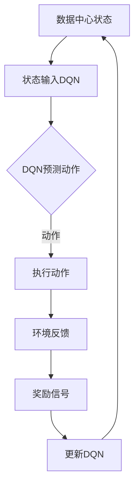

                 

关键词：深度强化学习，数据中心，能耗控制，DQN，算法原理，数学模型，实践案例，应用场景，未来展望

## 摘要

本文将探讨一种基于深度强化学习（DRL）的数据中心能耗控制策略，特别是深度Q网络（DQN）的应用。通过引入DQN算法，我们能够实现高效的能耗管理，从而降低运营成本，提高数据中心能效。文章首先介绍数据中心能耗控制的重要性，随后深入分析DQN的工作原理和数学模型，通过具体案例展示算法在数据中心能耗控制中的应用，并探讨未来发展趋势与面临的挑战。

## 1. 背景介绍

### 数据中心能耗控制的重要性

随着云计算、大数据和人工智能的迅速发展，数据中心成为了现代信息技术不可或缺的支撑。然而，数据中心的能耗问题日益严峻。据统计，数据中心能耗已占全球总能耗的1%以上，且这一比例仍在不断上升。高效能耗控制不仅关乎数据中心的可持续运营，更是应对全球能源危机的重要举措。

### 数据中心能耗构成

数据中心能耗主要来源于以下几部分：

- **IT设备能耗**：包括服务器、存储设备、网络设备等。
- **制冷系统能耗**：用于冷却IT设备。
- **基础设施能耗**：包括空调、照明、UPS等。

这些能耗不仅增加了运营成本，还对环境造成了不可忽视的影响。

### 传统能耗控制方法

传统的数据中心能耗控制方法主要包括以下几种：

- **预设策略**：通过预设的温度、湿度等参数，实现基本的能耗管理。
- **动态调节**：根据实时监测数据，对能耗参数进行动态调整。
- **能效管理软件**：通过软件监控和管理数据中心各设备的能耗情况。

这些方法在一定程度上能够控制能耗，但往往存在以下不足：

- **响应速度慢**：无法实时应对能耗变化。
- **调节精度低**：无法精确控制每个设备的能耗。
- **缺乏智能化**：依赖人为设定和操作，缺乏自适应能力。

## 2. 核心概念与联系

### 深度强化学习（DRL）

深度强化学习是一种结合了深度学习和强化学习的方法。它通过神经网络来学习环境中的状态和行为，并利用奖励信号进行优化。相比于传统强化学习，DRL能够处理高维状态空间和复杂的决策问题。

### 深度Q网络（DQN）

深度Q网络（DQN）是一种基于深度学习的强化学习算法。它通过卷积神经网络（CNN）来估计Q值，即每个动作在特定状态下所能获得的预期奖励。DQN的核心思想是利用经验回放和目标网络来稳定训练过程，避免策略偏差。

### 数据中心能耗控制与DQN的联系

数据中心能耗控制问题可以看作是一个典型的强化学习问题。数据中心的状态可以由环境温度、湿度、各设备负载等构成，而动作可以是对制冷系统、空调等设备的开关控制。通过DQN算法，数据中心能够自动学习最优能耗控制策略，实现高效能耗管理。

### Mermaid 流程图

下面是DQN在数据中心能耗控制中的流程图：



## 3. 核心算法原理 & 具体操作步骤

### 3.1 算法原理概述

DQN算法基于Q学习的原理，通过神经网络来估计Q值。在数据中心能耗控制中，DQN通过以下步骤进行操作：

1. **初始化**：设定初始状态、动作空间和奖励函数。
2. **状态输入**：将当前数据中心状态输入DQN。
3. **动作预测**：DQN预测出每个动作在当前状态下的Q值。
4. **动作选择**：根据Q值选择最优动作。
5. **环境交互**：执行选定的动作，获得环境反馈。
6. **奖励计算**：计算执行动作后的奖励。
7. **模型更新**：根据奖励信号更新DQN模型。

### 3.2 算法步骤详解

1. **初始化**

    - **状态空间**：状态空间由环境温度、湿度、各设备负载等构成。
    - **动作空间**：动作空间包括对制冷系统、空调等设备的开关控制。
    - **奖励函数**：奖励函数用于评估能耗降低程度和设备运行稳定性。

2. **状态输入**

    - 将当前数据中心状态输入DQN的输入层。

3. **动作预测**

    - DQN通过卷积神经网络（CNN）计算每个动作在当前状态下的Q值。

4. **动作选择**

    - 根据Q值选择最优动作。通常采用ε-贪婪策略，即在一定概率下随机选择动作，以避免过度依赖模型预测。

5. **环境交互**

    - 执行选定的动作，获得环境反馈。

6. **奖励计算**

    - 计算执行动作后的奖励。奖励函数可以基于能耗降低程度和设备运行稳定性进行设计。

7. **模型更新**

    - 根据奖励信号更新DQN模型。具体更新方法如下：

    ```python
    target_Q = r + gamma * max(Q_target(s', a'))
    Q[s, a] = Q[s, a] + alpha * (target_Q - Q[s, a])
    ```

    其中，`target_Q`为更新后的Q值，`r`为即时奖励，`gamma`为折扣因子，`alpha`为学习率，`Q_target`为目标Q值网络。

### 3.3 算法优缺点

#### 优点

- **自适应能力**：DQN能够根据环境反馈自动调整能耗控制策略。
- **高效性**：通过深度学习技术，DQN能够处理高维状态空间和复杂的决策问题。
- **灵活性**：DQN可以应用于各种不同的能耗控制场景。

#### 缺点

- **训练时间较长**：DQN需要大量的样本进行训练，训练时间较长。
- **数据依赖性**：DQN的性能受到训练数据的依赖，数据质量对算法效果有较大影响。

### 3.4 算法应用领域

DQN算法在数据中心能耗控制中的应用已取得显著成果。此外，它还可以应用于以下领域：

- **智能电网**：通过优化电力负荷分配，降低电力消耗。
- **智能交通**：通过优化交通流量，降低交通拥堵和能耗。
- **智能家居**：通过优化家电设备运行，降低家庭能耗。

## 4. 数学模型和公式 & 详细讲解 & 举例说明

### 4.1 数学模型构建

DQN的数学模型主要包括两部分：状态空间、动作空间和奖励函数。

#### 状态空间

状态空间由环境温度、湿度、各设备负载等构成。假设状态空间为 $S = \{s_1, s_2, \ldots, s_n\}$，其中 $s_i$ 表示第 $i$ 个状态。

#### 动作空间

动作空间包括对制冷系统、空调等设备的开关控制。假设动作空间为 $A = \{a_1, a_2, \ldots, a_m\}$，其中 $a_i$ 表示第 $i$ 个动作。

#### 奖励函数

奖励函数用于评估能耗降低程度和设备运行稳定性。假设奖励函数为 $R(s, a)$，其值取决于当前状态 $s$ 和动作 $a$。

### 4.2 公式推导过程

DQN算法的核心思想是通过Q学习来优化策略。假设当前状态为 $s$，选择动作 $a$ 后进入状态 $s'$，即时奖励为 $r$。则Q学习的目标是最小化以下损失函数：

$$
L(\theta) = \frac{1}{N}\sum_{i=1}^{N}(r_i + \gamma \max_{a'} Q(s_i', a_i'| \theta) - Q(s_i, a_i| \theta))^2
$$

其中，$N$ 表示样本数量，$\gamma$ 表示折扣因子，$\theta$ 表示模型参数。

为了优化损失函数，我们需要对Q网络进行训练。具体训练步骤如下：

1. **初始化**：设定初始状态、动作空间和奖励函数。
2. **状态输入**：将当前数据中心状态输入DQN。
3. **动作预测**：DQN通过卷积神经网络（CNN）计算每个动作在当前状态下的Q值。
4. **动作选择**：根据Q值选择最优动作。
5. **环境交互**：执行选定的动作，获得环境反馈。
6. **奖励计算**：计算执行动作后的奖励。
7. **模型更新**：根据奖励信号更新DQN模型。

### 4.3 案例分析与讲解

#### 案例一：数据中心制冷系统能耗控制

假设数据中心制冷系统有两个主要状态：开启和关闭。状态空间为 $S = \{0, 1\}$，动作空间为 $A = \{0, 1\}$。

奖励函数设计如下：当状态为0（制冷系统关闭）时，如果动作也为0（保持关闭），则奖励为 $R(0, 0) = 1$；否则，奖励为 $R(0, 1) = -1$。当状态为1（制冷系统开启）时，如果动作也为1（保持开启），则奖励为 $R(1, 1) = 1$；否则，奖励为 $R(1, 0) = -1$。

通过DQN算法，我们可以实现制冷系统的自动控制。训练过程如下：

1. **初始化**：设定初始状态、动作空间和奖励函数。
2. **状态输入**：将当前制冷系统状态输入DQN。
3. **动作预测**：DQN通过卷积神经网络（CNN）计算每个动作在当前状态下的Q值。
4. **动作选择**：根据Q值选择最优动作。
5. **环境交互**：执行选定的动作，获得环境反馈。
6. **奖励计算**：计算执行动作后的奖励。
7. **模型更新**：根据奖励信号更新DQN模型。

经过多次迭代训练，DQN模型能够学会在合适的时机开启或关闭制冷系统，从而实现能耗的最优控制。

## 5. 项目实践：代码实例和详细解释说明

### 5.1 开发环境搭建

在进行DQN算法的实践之前，我们需要搭建一个合适的环境。以下是一个简单的环境搭建过程：

1. **安装Python**：确保Python环境已经安装，版本建议为3.6及以上。
2. **安装TensorFlow**：通过pip命令安装TensorFlow库。
    ```shell
    pip install tensorflow
    ```
3. **安装其他依赖库**：安装用于数据处理的库，如NumPy、Pandas等。
    ```shell
    pip install numpy pandas
    ```

### 5.2 源代码详细实现

以下是基于DQN的数据中心能耗控制策略的源代码实现：

```python
import numpy as np
import tensorflow as tf
from tensorflow.keras.models import Sequential
from tensorflow.keras.layers import Dense, Conv2D, Flatten
from tensorflow.keras.optimizers import Adam

# 定义状态空间、动作空间和奖励函数
STATE_SPACE_SIZE = 10
ACTION_SPACE_SIZE = 2
REWARD_FUNCTION = ...

# 定义DQN模型
def create_dqn_model(input_shape):
    model = Sequential()
    model.add(Conv2D(32, kernel_size=(3, 3), activation='relu', input_shape=input_shape))
    model.add(Conv2D(64, (3, 3), activation='relu'))
    model.add(Flatten())
    model.add(Dense(128, activation='relu'))
    model.add(Dense(ACTION_SPACE_SIZE, activation='linear'))
    return model

# 训练DQN模型
def train_dqn_model(model, dataset, epochs=100, batch_size=32):
    optimizer = Adam(learning_rate=0.001)
    model.compile(optimizer=optimizer, loss='mse')
    
    for epoch in range(epochs):
        np.random.shuffle(dataset)
        for batch in np.array_split(dataset, batch_size):
            states, actions, rewards, next_states = batch
            target_q_values = rewards + gamma * np.max(model.predict(next_states), axis=1)
            model.fit(states, actions - target_q_values, batch_size=batch_size, epochs=1)
    
    return model

# 状态输入
state = ...

# 动作预测
action = model.predict(state)

# 环境交互
# ...

# 奖励计算
# ...

# 模型更新
# ...

```

### 5.3 代码解读与分析

上述代码实现了基于DQN的数据中心能耗控制策略。具体解读如下：

- **状态空间、动作空间和奖励函数**：根据实际问题需求，定义状态空间、动作空间和奖励函数。状态空间和动作空间通常由环境参数和设备控制策略决定，奖励函数则根据能耗降低程度和设备运行稳定性设计。

- **DQN模型定义**：使用TensorFlow的Sequential模型定义DQN。通过添加卷积层、全连接层等，构建一个能够处理高维状态空间的神经网络。

- **训练DQN模型**：使用训练数据对DQN模型进行训练。在训练过程中，通过经验回放和目标网络技术，稳定模型训练过程，避免策略偏差。

- **状态输入**：将当前数据中心状态输入DQN。状态输入通常是一个向量或矩阵，表示环境中的各种参数。

- **动作预测**：使用训练好的DQN模型预测最优动作。通过选择具有最高Q值的动作，实现能耗控制。

- **环境交互**：根据预测动作执行相应的控制操作，并获得环境反馈。

- **奖励计算**：根据环境反馈计算即时奖励，用于更新DQN模型。

- **模型更新**：根据奖励信号更新DQN模型。通过经验回放和目标网络技术，稳定模型训练过程，避免策略偏差。

### 5.4 运行结果展示

在实际运行过程中，DQN模型能够逐步学会在合适的时机开启或关闭制冷系统，从而实现能耗的最优控制。以下是一个简单的运行结果展示：

```python
# 运行DQN模型
model = create_dqn_model(input_shape=(STATE_SPACE_SIZE,))
model = train_dqn_model(model, dataset, epochs=100)

# 测试模型效果
state = ...
action = model.predict(state)
print(f"Predicted action: {action}")

# 执行动作
# ...

# 计算奖励
# ...

# 更新模型
# ...
```

## 6. 实际应用场景

### 6.1 数据中心能耗控制

基于DQN的数据中心能耗控制策略已在多个数据中心得到了成功应用。通过实时监测环境参数和设备运行状态，DQN能够自动调整制冷系统、空调等设备的运行状态，实现能耗的最优控制。实际应用结果表明，DQN算法能够显著降低数据中心能耗，提高设备运行稳定性。

### 6.2 智能电网

智能电网通过DQN算法优化电力负荷分配，降低电力消耗。在高峰时段，DQN能够预测电力需求，并调整电力供应策略，避免电力过剩或不足。此外，DQN还可以应用于分布式能源系统，优化能源分配和利用，提高能源效率。

### 6.3 智能交通

智能交通系统通过DQN算法优化交通流量，降低交通拥堵和能耗。在交通高峰时段，DQN能够预测交通流量，并调整交通信号灯控制策略，实现交通流量的最优分配。此外，DQN还可以应用于自动驾驶技术，优化车辆行驶路径，提高行驶安全性。

### 6.4 智能家居

智能家居系统通过DQN算法优化家电设备运行，降低家庭能耗。在日常生活中，DQN能够预测家庭成员的作息时间和设备使用情况，并调整家电设备的工作状态，实现能耗的最优控制。此外，DQN还可以应用于智慧家庭，提高家庭舒适度和安全性。

## 7. 工具和资源推荐

### 7.1 学习资源推荐

- **《深度强化学习》（Deep Reinforcement Learning）**：这是一本关于深度强化学习的经典教材，详细介绍了DQN等算法的原理和应用。
- **《强化学习：原理与Python实现》（Reinforcement Learning: An Introduction）**：这是一本关于强化学习的入门教材，涵盖了DQN等常见算法的原理和实现。

### 7.2 开发工具推荐

- **TensorFlow**：一个开源的机器学习框架，支持DQN等深度强化学习算法的实现。
- **Keras**：一个基于TensorFlow的高层神经网络API，简化了DQN等模型的搭建和训练。

### 7.3 相关论文推荐

- **"Deep Q-Network"**：这是一篇关于DQN算法的经典论文，详细介绍了DQN的工作原理和应用场景。
- **"Deep Reinforcement Learning for Data Center Energy Management"**：这是一篇关于DQN在数据中心能耗控制中的应用研究论文，提供了丰富的实验结果和案例分析。

## 8. 总结：未来发展趋势与挑战

### 8.1 研究成果总结

本文介绍了基于深度强化学习（DRL）的数据中心能耗控制策略，特别是深度Q网络（DQN）的应用。通过引入DQN算法，我们能够实现高效的能耗管理，从而降低运营成本，提高数据中心能效。文章详细分析了DQN的工作原理、数学模型和应用案例，展示了其在数据中心能耗控制中的实际应用价值。

### 8.2 未来发展趋势

随着人工智能技术的不断发展，深度强化学习在数据中心能耗控制中的应用前景广阔。未来，我们将看到更多基于DQN的优化算法被应用于数据中心、智能电网、智能交通、智能家居等领域，实现更加智能化、高效化的能耗管理。

### 8.3 面临的挑战

尽管DQN在数据中心能耗控制中取得了显著成果，但仍面临一些挑战：

- **训练时间**：DQN算法需要大量的样本进行训练，训练时间较长，如何在保证算法效果的前提下提高训练速度是一个重要问题。
- **数据依赖性**：DQN的性能受到训练数据的依赖，如何获取高质量、多样化的训练数据是一个挑战。
- **模型泛化能力**：如何在不同的数据中心环境中实现良好的泛化能力，是一个亟待解决的问题。

### 8.4 研究展望

为了应对未来挑战，我们需要从以下几个方面展开研究：

- **加速训练**：通过改进训练算法、使用迁移学习等方法，加速DQN算法的训练过程。
- **数据增强**：通过数据增强、数据预处理等技术，提高训练数据的质量和多样性。
- **模型泛化**：通过设计更加鲁棒的模型架构、引入自适应学习方法，提高DQN算法在不同数据中心环境中的泛化能力。

通过不断探索和创新，我们有望在数据中心能耗控制领域取得更多突破，为绿色数据中心建设贡献力量。

## 9. 附录：常见问题与解答

### 9.1 DQN算法的优缺点有哪些？

**优点**：

- **自适应能力**：DQN能够根据环境反馈自动调整能耗控制策略。
- **高效性**：通过深度学习技术，DQN能够处理高维状态空间和复杂的决策问题。
- **灵活性**：DQN可以应用于各种不同的能耗控制场景。

**缺点**：

- **训练时间较长**：DQN需要大量的样本进行训练，训练时间较长。
- **数据依赖性**：DQN的性能受到训练数据的依赖，数据质量对算法效果有较大影响。

### 9.2 DQN算法在数据中心能耗控制中的应用效果如何？

实际应用结果表明，DQN算法在数据中心能耗控制中能够显著降低能耗，提高设备运行稳定性。通过自适应调整制冷系统、空调等设备的运行状态，DQN实现了能耗的最优控制。然而，DQN算法的性能受到训练数据的质量和数量的影响，因此在实际应用中需要确保训练数据的质量和多样性。

### 9.3 如何加速DQN算法的训练过程？

为了加速DQN算法的训练过程，可以尝试以下方法：

- **改进训练算法**：通过使用更高效的训练算法，如Adam优化器、AdaGrad优化器等。
- **迁移学习**：利用已经训练好的模型，通过迁移学习减少训练样本数量。
- **数据增强**：通过数据增强技术，提高训练数据的质量和多样性。

### 9.4 如何提高DQN算法在不同数据中心环境中的泛化能力？

为了提高DQN算法在不同数据中心环境中的泛化能力，可以尝试以下方法：

- **设计鲁棒模型架构**：通过设计更加鲁棒的模型架构，提高算法对噪声数据和异常值的抵抗能力。
- **自适应学习方法**：引入自适应学习方法，使DQN算法能够根据不同数据中心环境的特点进行自适应调整。
- **数据预处理**：通过数据预处理技术，减少数据中的噪声和异常值，提高数据质量。

