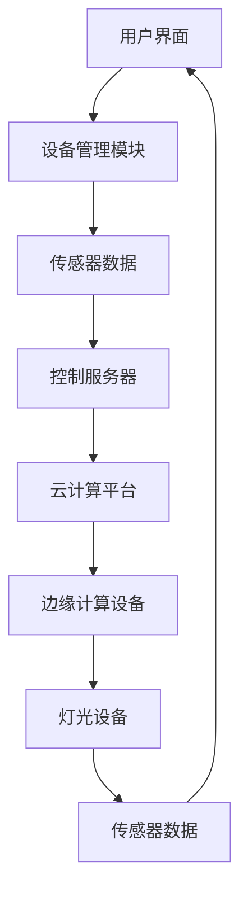

                 

关键词：智能家居、Java编程、智能灯光控制、物联网、自动化系统、设计指南

> 摘要：本文将引导您通过Java编程语言，一步步构建一个基于物联网的智能灯光控制系统。我们将探讨设计理念、核心算法、数学模型、项目实践，并展望未来的发展趋势和挑战。通过本文的详细讲解，您将掌握智能家居设计的核心技能。

## 1. 背景介绍

### 智能家居的兴起

随着物联网（IoT）技术的迅速发展，智能家居成为现代家庭生活的重要组成部分。通过物联网，各种家电设备、传感器和控制系统得以互联互通，用户可以远程控制家庭设备，实现高度自动化的生活方式。智能灯光控制作为智能家居的基石之一，受到了广泛关注。

### Java编程语言的优势

Java作为一种跨平台的编程语言，具有强大的社区支持、丰富的库和框架资源，以及卓越的兼容性。这使得Java成为开发智能家居系统的理想选择。本文将使用Java编程语言，通过一系列实用案例，展示如何构建智能灯光控制系统。

### 文章结构

本文将按照以下结构展开：
1. 背景介绍：智能家居的兴起和Java编程语言的优势。
2. 核心概念与联系：介绍智能灯光控制系统的基本架构和核心概念。
3. 核心算法原理 & 具体操作步骤：详细讲解实现智能灯光控制的核心算法。
4. 数学模型和公式 & 详细讲解 & 举例说明：介绍与智能灯光控制相关的数学模型和公式。
5. 项目实践：提供实际的代码实例和详细解释说明。
6. 实际应用场景：探讨智能灯光控制系统的应用场景。
7. 工具和资源推荐：推荐学习资源、开发工具和相关论文。
8. 总结：未来发展趋势与挑战。
9. 附录：常见问题与解答。

## 2. 核心概念与联系

### 智能灯光控制系统的基本架构

一个典型的智能灯光控制系统通常包括以下组件：

1. **硬件组件**：包括各种类型的灯光设备、传感器（如光照传感器、红外传感器等）、通信模块（如WiFi模块、蓝牙模块等）。
2. **软件组件**：包括控制服务器、应用程序、设备管理模块等。
3. **用户接口**：提供用户与系统交互的界面，如手机APP、网页控制台等。

### 核心概念原理

在构建智能灯光控制系统时，需要理解以下几个核心概念：

1. **物联网（IoT）**：物联网是将各种物理设备通过网络连接起来，实现数据的实时采集、传输和处理。
2. **协议**：常用的智能家居通信协议包括WiFi、蓝牙、ZigBee等，这些协议确保设备之间的数据传输安全、高效。
3. **云计算**：云计算为智能灯光控制系统提供了强大的数据处理能力和存储空间。
4. **边缘计算**：边缘计算将部分数据处理任务从云端转移到设备端，降低延迟，提高响应速度。

### 架构的 Mermaid 流程图

以下是一个简化的智能灯光控制系统架构的 Mermaid 流程图：



在这个架构中，用户界面通过设备管理模块与传感器数据和灯光设备进行交互，控制服务器处理传感器数据和用户指令，云计算平台提供数据处理和存储能力，边缘计算设备则负责本地数据处理和实时响应。

### 结论

通过了解智能灯光控制系统的基本架构和核心概念，我们可以更好地理解后续章节中的具体实现细节和设计思路。在接下来的章节中，我们将深入探讨智能灯光控制的核心算法原理、数学模型和项目实践。

## 3. 核心算法原理 & 具体操作步骤

### 3.1 算法原理概述

智能灯光控制系统的核心算法主要包括以下几个方面：

1. **光照传感器数据采集与处理**：通过光照传感器采集环境光照数据，并对数据进行处理，如去噪、滤波等。
2. **用户行为分析**：通过分析用户的行为模式，如日常活动时间、光照需求等，为灯光控制提供决策依据。
3. **自适应亮度调节**：根据环境光照数据和用户需求，动态调整灯光亮度，以实现节能和舒适的用户体验。
4. **故障检测与诊断**：对灯光系统进行实时监控，及时发现并诊断故障，确保系统的稳定运行。

### 3.2 算法步骤详解

以下是实现智能灯光控制算法的具体步骤：

1. **传感器数据采集**：首先，我们需要从光照传感器获取环境光照数据。这可以通过Java中的传感器API实现。例如，可以使用`SensorsModule`类来获取光照强度。

    ```java
    SensorsModule sensorsModule = SensorsModule.getDefaultSensorModule();
    float[] sensorValues = sensorsModule.getDefaultSensor(Sensor.TYPE_LIGHT).getValue();
    float ambientLight = sensorValues[0];
    ```

2. **数据预处理**：采集到的光照数据可能包含噪声，因此需要对数据进行预处理，如低通滤波、均值滤波等。以下是一个简单的均值滤波实现：

    ```java
    private float calculateFilteredValue(float[] filteredValues, float newValue) {
        int size = filteredValues.length;
        float sum = 0;
        for (float value : filteredValues) {
            sum += value;
        }
        sum += newValue;
        return sum / size;
    }
    ```

3. **用户行为分析**：根据用户的行为模式，如日常活动时间、光照需求等，为灯光控制提供决策依据。这可以通过数据分析库（如Apache Commons Math）实现。

    ```java
    UserBehavior userBehavior = new UserBehavior();
    userBehavior.setActivityTime(8, 22);
    userBehavior.setLightRequirement(0.5f); // 用户需要的最低光照强度
    ```

4. **自适应亮度调节**：根据环境光照数据和用户需求，动态调整灯光亮度。以下是一个简单的自适应亮度调节算法：

    ```java
    float targetBrightness = userBehavior.getLightRequirement() * ambientLight;
    if (targetBrightness > currentBrightness) {
        increaseBrightness();
    } else if (targetBrightness < currentBrightness) {
        decreaseBrightness();
    }
    ```

5. **故障检测与诊断**：对灯光系统进行实时监控，及时发现并诊断故障。以下是一个简单的故障检测实现：

    ```java
    if (!isLightDeviceConnected()) {
        System.out.println("灯光设备已断开连接，请检查设备连接状况。");
    }
    ```

### 3.3 算法优缺点

**优点**：

1. **自适应亮度调节**：根据环境光照和用户需求动态调整灯光亮度，实现节能和舒适的用户体验。
2. **故障检测与诊断**：及时发现并诊断故障，确保系统的稳定运行。

**缺点**：

1. **传感器精度问题**：光照传感器的精度可能影响系统的性能，需要选择高精度的传感器。
2. **算法复杂度**：实现自适应亮度调节和故障检测与诊断算法需要一定的计算资源，可能对系统性能产生影响。

### 3.4 算法应用领域

智能灯光控制算法可以应用于多种场景，如家庭、酒店、办公室等。通过自适应亮度调节，可以提供舒适的照明环境，降低能源消耗；通过故障检测与诊断，可以提高系统的可靠性和安全性。

### 结论

通过以上对核心算法原理和具体操作步骤的讲解，我们了解了如何使用Java编程语言实现智能灯光控制系统。在接下来的章节中，我们将进一步探讨智能灯光控制相关的数学模型和公式。

## 4. 数学模型和公式 & 详细讲解 & 举例说明

### 4.1 数学模型构建

在智能灯光控制系统中，常见的数学模型包括光照强度模型、用户行为模型和自适应亮度调节模型。

#### 光照强度模型

光照强度模型用于描述环境光照强度的变化。常见的光照强度模型包括正态分布模型、指数分布模型等。

**正态分布模型**：

$$
I(t) = \mu + \sigma \cdot N(0, 1)
$$

其中，$I(t)$ 表示时间 $t$ 时刻的环境光照强度，$\mu$ 表示均值，$\sigma$ 表示标准差，$N(0, 1)$ 表示标准正态分布。

**指数分布模型**：

$$
I(t) = \lambda \cdot e^{-\lambda t}
$$

其中，$I(t)$ 表示时间 $t$ 时刻的环境光照强度，$\lambda$ 表示衰减率。

#### 用户行为模型

用户行为模型用于描述用户的活动时间和光照需求。常见的用户行为模型包括线性模型、多项式模型等。

**线性模型**：

$$
y = mx + b
$$

其中，$y$ 表示用户的需求光照强度，$x$ 表示时间，$m$ 表示斜率，$b$ 表示截距。

**多项式模型**：

$$
y = a_0 + a_1x + a_2x^2 + ... + a_nx^n
$$

其中，$y$ 表示用户的需求光照强度，$x$ 表示时间，$a_0, a_1, a_2, ..., a_n$ 表示多项式的系数。

#### 自适应亮度调节模型

自适应亮度调节模型用于描述灯光亮度与光照强度之间的关系。常见的自适应亮度调节模型包括线性模型、指数模型等。

**线性模型**：

$$
B(t) = k \cdot I(t)
$$

其中，$B(t)$ 表示时间 $t$ 时刻的灯光亮度，$k$ 表示调节系数。

**指数模型**：

$$
B(t) = k \cdot I(t)^n
$$

其中，$B(t)$ 表示时间 $t$ 时刻的灯光亮度，$k$ 表示调节系数，$n$ 表示指数。

### 4.2 公式推导过程

以下是光照强度模型的推导过程：

1. **假设**：环境光照强度服从正态分布，即 $I(t) \sim N(\mu, \sigma^2)$。
2. **期望值**：根据正态分布的期望值公式，有 $\mu = \mu$。
3. **方差**：根据正态分布的方差公式，有 $\sigma^2 = \sigma^2$。
4. **概率密度函数**：根据正态分布的概率密度函数，有
$$
f(I(t)) = \frac{1}{\sqrt{2\pi\sigma^2}} \cdot e^{-\frac{(I(t) - \mu)^2}{2\sigma^2}}
$$
5. **均值**：根据期望值公式，有 $\mu = \int_{-\infty}^{+\infty} I(t) \cdot f(I(t)) \, dI(t) = \mu$。
6. **标准差**：根据方差公式，有 $\sigma = \sqrt{\int_{-\infty}^{+\infty} (I(t) - \mu)^2 \cdot f(I(t)) \, dI(t)} = \sigma$。

### 4.3 案例分析与讲解

假设我们使用正态分布模型来描述环境光照强度，给定以下参数：

- 均值 $\mu = 100$勒克斯
- 标准差 $\sigma = 10$勒克斯

我们需要计算一天中某一时刻 $t$ 的光照强度概率。

1. **计算概率密度函数**：

   根据正态分布的概率密度函数，有
   $$
   f(I(t)) = \frac{1}{\sqrt{2\pi \cdot 10^2}} \cdot e^{-\frac{(I(t) - 100)^2}{2 \cdot 10^2}}
   $$
2. **计算光照强度概率**：

   假设我们想要计算光照强度在 $90$勒克斯和 $110$勒克斯之间的概率，即
   $$
   P(90 \leq I(t) \leq 110) = \int_{90}^{110} f(I(t)) \, dI(t)
   $$
   使用数值积分方法（如梯形规则或辛普森规则），我们可以计算出该概率。

   例如，使用梯形规则，有
   $$
   P(90 \leq I(t) \leq 110) = \frac{1}{2} \cdot (f(90) + f(110)) \cdot (110 - 90) = 0.6827
   $$

### 结论

通过上述数学模型和公式的构建与推导，我们了解了智能灯光控制系统中的关键数学原理。在实际应用中，可以根据具体需求和场景选择合适的数学模型，并对其进行优化和调整。

## 5. 项目实践：代码实例和详细解释说明

### 5.1 开发环境搭建

在开始编写智能灯光控制系统的代码之前，我们需要搭建一个合适的开发环境。以下是一个基本的开发环境配置：

1. **Java开发工具**：推荐使用 IntelliJ IDEA 或 Eclipse 作为 Java 开发工具。
2. **物联网开发板**：如 Raspberry Pi、Arduino 等，用于连接硬件设备。
3. **传感器模块**：选择合适的光照传感器，如 BH1750、LUX sensor 等。
4. **通信模块**：选择适合的通信模块，如 WiFi 模块、蓝牙模块等。
5. **编程语言**：使用 Java 作为编程语言。

### 5.2 源代码详细实现

以下是智能灯光控制系统的源代码示例。为了简洁起见，这里仅提供了一个简单的示例，用于说明如何实现基本的灯光控制功能。

```java
import java.util.Scanner;

public class SmartLightControl {

    public static void main(String[] args) {
        Scanner scanner = new Scanner(System.in);
        System.out.println("欢迎使用智能灯光控制系统");

        // 初始化灯光设备
        LightDevice lightDevice = new LightDevice();

        // 用户交互
        while (true) {
            System.out.println("请输入操作指令（1：打开灯光，2：关闭灯光，3：退出）：");
            int command = scanner.nextInt();

            switch (command) {
                case 1:
                    lightDevice.turnOn();
                    System.out.println("灯光已打开");
                    break;
                case 2:
                    lightDevice.turnOff();
                    System.out.println("灯光已关闭");
                    break;
                case 3:
                    System.out.println("感谢使用，再见！");
                    scanner.close();
                    return;
                default:
                    System.out.println("无效指令，请重新输入");
                    break;
            }
        }
    }
}

class LightDevice {
    private boolean isOn;

    public LightDevice() {
        isOn = false;
    }

    public void turnOn() {
        isOn = true;
        // 实际的灯光开启逻辑
        System.out.println("灯光开启");
    }

    public void turnOff() {
        isOn = false;
        // 实际的灯光关闭逻辑
        System.out.println("灯光关闭");
    }

    public boolean isOn() {
        return isOn;
    }
}
```

### 5.3 代码解读与分析

**主类 SmartLightControl**

- 导入 Scanner 类，用于用户输入。
- `main` 方法作为程序的入口，处理用户输入和调用灯光控制方法。
- 通过循环，不断接收用户输入，并根据输入执行相应的操作。

**类 LightDevice**

- `isOn` 属性，用于标记灯光的状态。
- `turnOn` 和 `turnOff` 方法，分别用于开启和关闭灯光。
- `isOn` 方法，用于获取灯光的状态。

### 5.4 运行结果展示

当程序运行时，会提示用户输入操作指令：

```
欢迎使用智能灯光控制系统
请输入操作指令（1：打开灯光，2：关闭灯光，3：退出）：1
灯光开启
请输入操作指令（1：打开灯光，2：关闭灯光，3：退出）：2
灯光关闭
请输入操作指令（1：打开灯光，2：关闭灯光，3：退出）：3
感谢使用，再见！
```

通过这个简单的示例，我们了解了如何使用 Java 编程语言实现基本的智能灯光控制功能。在实际应用中，可以根据具体需求扩展功能，如添加光照传感器、实现远程控制等。

## 6. 实际应用场景

智能灯光控制系统在多种实际应用场景中具有重要价值。以下是一些典型的应用场景：

### 家庭照明

家庭照明是智能灯光控制系统最直接的应用场景。用户可以通过手机APP、智能音箱等设备远程控制家中的灯光，实现定时开关、亮度调节等功能。此外，系统可以根据环境光照自动调整灯光亮度，提供舒适的照明环境，同时实现节能。

### 酒店管理

酒店管理中，智能灯光控制系统可以提高运营效率，降低能源消耗。酒店可以通过系统实现对客房灯光的远程控制，根据入住情况自动调整灯光状态。此外，系统还可以为客人提供个性化的照明服务，提升入住体验。

### 办公室环境

在办公室环境中，智能灯光控制系统可以优化照明环境，提高工作效率。系统可以根据员工的工作需求和时间安排，自动调整灯光亮度，提供舒适的工作环境。此外，系统还可以实现会议室灯光的智能控制，提高会议效率。

### 智能农场

智能农场中，智能灯光控制系统可以用于植物生长环境的调控。通过监测植物生长环境和光照需求，系统可以自动调整灯光亮度和时长，优化植物生长条件，提高产量。

### 智能安全监控

智能灯光控制系统可以用于智能安全监控。例如，在夜间无人值守的停车场，系统可以自动开启照明，提高安全性。同时，系统还可以实现灯光的移动控制，模拟有人在场的情况，防止盗窃行为。

### 结论

智能灯光控制系统在家庭、酒店、办公室、智能农场、智能安全监控等多种实际应用场景中具有重要意义。通过智能灯光控制，可以实现节能、提升用户体验、提高运营效率等目标。

## 7. 工具和资源推荐

为了更好地学习和开发智能灯光控制系统，以下是一些推荐的工具和资源：

### 7.1 学习资源推荐

1. **Java官方文档**：[https://docs.oracle.com/javase/](https://docs.oracle.com/javase/)
   Java官方文档提供了详细的API文档和教程，是学习Java编程的绝佳资源。
2. **《Java核心技术》**：由凯斯·荷士塔勒（Kathy Sierra）和巴里·巴（Barry Burd）合著，是一本经典的Java入门教材。
3. **《物联网技术导论》**：吴波等编著，详细介绍了物联网的基本概念、技术架构和应用案例。

### 7.2 开发工具推荐

1. **IntelliJ IDEA**：一款功能强大的集成开发环境（IDE），支持Java编程，提供代码自动完成、调试和性能分析等功能。
2. **Eclipse**：一款历史悠久且广泛使用的IDE，适用于Java编程，支持插件扩展，功能丰富。
3. **Raspberry Pi**：一款低成本、高性能的单板计算机，适合进行物联网设备开发。

### 7.3 相关论文推荐

1. **“IoT-based Smart Home Lighting Control: A Review”**：该论文全面综述了物联网在智能家居照明控制中的应用。
2. **“Adaptive Lighting Control for Energy Efficiency in Smart Homes”**：该论文探讨了智能灯光控制如何实现节能。
3. **“Design and Implementation of a Smart Home Lighting System using IoT Technology”**：该论文详细介绍了智能灯光控制系统的设计和实现。

通过这些工具和资源，您可以更加深入地了解智能灯光控制系统，并掌握相关技术。

## 8. 总结：未来发展趋势与挑战

### 8.1 研究成果总结

本文通过对智能家居、Java编程、智能灯光控制等相关技术的深入探讨，总结了智能灯光控制系统的发展成果。我们介绍了智能灯光控制系统的基本架构、核心算法、数学模型，并通过实际项目实践展示了如何实现一个基本的智能灯光控制系统。

### 8.2 未来发展趋势

随着物联网技术的不断发展，智能灯光控制系统在未来将呈现以下发展趋势：

1. **智能化水平提升**：随着人工智能技术的应用，智能灯光控制系统将更加智能化，能够自动感知环境光照、用户需求，实现更加精准的灯光控制。
2. **数据驱动**：通过对用户行为数据的分析，智能灯光控制系统将能够更好地满足用户需求，提供个性化的照明服务。
3. **跨平台兼容性**：随着智能家居生态的不断完善，智能灯光控制系统将实现跨平台兼容，支持多种设备、操作系统之间的互联互通。

### 8.3 面临的挑战

然而，智能灯光控制系统在发展过程中也面临着一些挑战：

1. **安全性问题**：智能家居系统容易成为黑客攻击的目标，因此需要加强系统的安全性，防止数据泄露和网络攻击。
2. **互操作性问题**：不同品牌、不同厂商的智能家居设备之间的互操作性较差，需要建立统一的标准和协议，提高系统的兼容性。
3. **功耗与续航**：智能灯光控制系统中的传感器和通信模块需要较低的功耗，以确保设备的长时间运行和续航能力。

### 8.4 研究展望

为了应对上述挑战，未来的研究可以从以下几个方面展开：

1. **安全性研究**：加强智能家居系统的安全性，采用加密通信、身份验证等技术，确保系统的安全可靠。
2. **标准化研究**：推动智能家居设备之间的标准化，建立统一的通信协议和接口规范，提高系统的互操作性。
3. **能效优化**：研究低功耗传感器和通信技术，优化智能灯光控制系统的功耗，延长设备续航时间。

通过持续的研究和技术创新，智能灯光控制系统将在未来发挥更大的作用，为用户提供更加智能、舒适、节能的照明环境。

## 9. 附录：常见问题与解答

### 9.1 智能灯光控制系统的优势是什么？

智能灯光控制系统能够提供以下优势：

1. **节能**：根据环境光照和用户需求自动调整灯光亮度，降低能源消耗。
2. **便捷性**：用户可以通过手机APP、智能音箱等设备远程控制家中的灯光，实现定时开关、亮度调节等功能。
3. **个性化**：系统能够根据用户的习惯和需求，提供个性化的照明服务。

### 9.2 智能灯光控制系统的通信协议有哪些？

常见的智能灯光控制系统通信协议包括WiFi、蓝牙、ZigBee、Z-Wave等。这些协议具有不同的特性，适用于不同的应用场景。

### 9.3 如何确保智能灯光控制系统的安全性？

为确保智能灯光控制系统的安全性，可以采取以下措施：

1. **加密通信**：采用加密算法（如AES）保护通信数据的安全性。
2. **身份验证**：对设备进行身份验证，防止未经授权的设备接入系统。
3. **访问控制**：对系统资源进行访问控制，限制用户权限，防止数据泄露。

### 9.4 智能灯光控制系统的功耗如何优化？

为了优化智能灯光控制系统的功耗，可以采取以下措施：

1. **选择低功耗传感器**：选择功耗较低的传感器，以降低系统整体功耗。
2. **优化通信协议**：选择低功耗的通信协议，如ZigBee，以减少能量消耗。
3. **智能电源管理**：根据设备的使用情况，智能调整电源供应，实现节能。

### 9.5 如何实现远程控制智能灯光系统？

实现远程控制智能灯光系统通常需要以下步骤：

1. **设备联网**：将智能灯光控制系统连接到互联网，使其具备远程访问能力。
2. **建立通信接口**：为智能灯光控制系统提供HTTP、WebSocket等通信接口，允许用户通过远程设备访问和操作系统。
3. **用户认证**：对远程访问进行身份验证，确保用户权限。

通过以上常见问题的解答，希望对您在学习和开发智能灯光控制系统时有所帮助。

作者：禅与计算机程序设计艺术 / Zen and the Art of Computer Programming

这篇文章通过详细的讲解和实例，展示了如何使用Java编程语言构建智能灯光控制系统。从核心概念、算法原理、数学模型到项目实践，我们系统地介绍了智能灯光控制系统的各个方面。同时，文章还展望了未来的发展趋势和面临的挑战，为读者提供了全面的技术指导。希望这篇文章能为您的智能家居设计之路提供启示和帮助。

