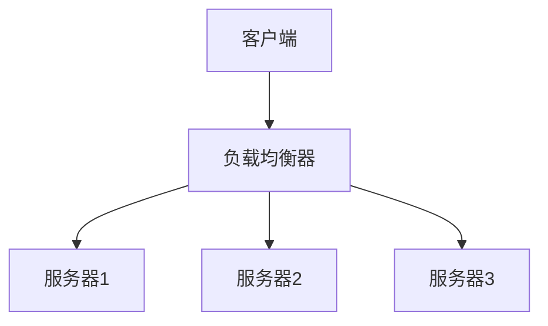

                 

关键词：智能家居，Java，负载均衡，分布式系统，网络通信，性能优化，IoT

摘要：本文旨在探讨如何利用Java编程语言设计智能家居系统中的负载均衡机制。通过对负载均衡核心概念、原理和算法的详细分析，我们将展示如何在Java环境中实现智能家居系统的高效负载均衡，从而提高系统的稳定性和可靠性。

## 1. 背景介绍

随着物联网（IoT）技术的迅速发展，智能家居已经成为了现代家庭生活的重要组成部分。智能家居系统通过联网的设备和传感器，实现对家庭环境的智能控制，如照明、温控、安防等。这些系统通常由多个组件组成，包括传感器、控制器、执行器和通信网络等。

然而，随着设备和用户的增加，系统的复杂性和负载也在不断上升。如何有效地管理和分配这些负载，确保系统的高效运行，成为了智能家居系统设计中的一大挑战。此时，负载均衡技术应运而生，它能够在分布式系统中合理分配任务，防止单点过载，提高系统的整体性能和可用性。

Java作为一种成熟且功能强大的编程语言，广泛应用于企业级应用程序开发，特别是在大型分布式系统中。本文将探讨如何利用Java技术实现智能家居系统中的负载均衡，从而为智能家居系统的设计和实现提供一种有效的解决方案。

## 2. 核心概念与联系

### 2.1 负载均衡概念

负载均衡（Load Balancing）是指在网络环境中通过特定的算法和策略，将大量请求合理分配到多个服务器或设备上，以达到优化资源利用、提高系统性能和可靠性的目的。负载均衡的核心目标是避免单点过载，确保系统各组件均衡负载，提高系统的整体性能和可用性。

### 2.2 负载均衡原理

负载均衡的基本原理是通过收集系统中的资源状态信息，如服务器负载、带宽、响应时间等，结合特定的算法，将请求分配到最优的服务器或设备上。常见的负载均衡算法包括轮询（Round Robin）、最小连接数（Least Connections）、最少响应时间（Least Response Time）等。

### 2.3 负载均衡架构

负载均衡架构通常包括客户端、负载均衡器和后端服务器。客户端通过负载均衡器发送请求，负载均衡器根据预设算法和策略将请求转发到后端服务器。后端服务器处理请求并返回结果。

下面是一个简单的负载均衡架构图：



### 2.4 负载均衡与Java

Java作为一种跨平台、面向对象的编程语言，具有强大的网络通信和处理能力，非常适合用于实现负载均衡。Java提供了丰富的API和框架，如Spring Cloud、Netty等，支持负载均衡功能的实现。

下面是一个简单的Java负载均衡代码示例：

```java
import java.util.List;
import java.util.Random;

public class LoadBalancer {
    private List<String> servers;

    public LoadBalancer(List<String> servers) {
        this.servers = servers;
    }

    public String getNextServer() {
        int index = new Random().nextInt(servers.size());
        return servers.get(index);
    }
}
```

在这个示例中，我们定义了一个简单的负载均衡器，它维护一个服务器列表，并使用轮询算法选择下一个服务器。在实际应用中，可以扩展这个负载均衡器，支持更复杂的算法和策略。

## 3. 核心算法原理 & 具体操作步骤

### 3.1 算法原理概述

在智能家居系统中，负载均衡算法的核心目标是根据当前系统的负载情况，合理分配请求到各个服务器或设备上。常见的负载均衡算法包括轮询（Round Robin）、最小连接数（Least Connections）、最少响应时间（Least Response Time）等。

轮询算法是最简单的一种负载均衡算法，它按照顺序将请求分配到各个服务器。优点是实现简单，缺点是可能会导致某些服务器负载过高。

最小连接数算法根据当前连接数最少的服务器分配请求，可以有效避免单点过载，提高系统的整体性能。

最少响应时间算法根据当前响应时间最短的服务器分配请求，可以提高用户的体验。

### 3.2 算法步骤详解

下面我们以轮询算法为例，详细描述其操作步骤：

1. **初始化**：创建一个服务器列表，并将每个服务器初始化为空闲状态。
2. **接收请求**：当接收到一个请求时，检查当前服务器列表中哪个服务器处于空闲状态。
3. **分配请求**：将请求分配给空闲状态的服务器，并将该服务器设置为忙碌状态。
4. **处理请求**：服务器处理请求并返回结果。
5. **更新状态**：当服务器完成请求处理时，将其状态更新为空闲状态。

### 3.3 算法优缺点

**轮询算法**：
- **优点**：实现简单，易于理解。
- **缺点**：可能导致某些服务器负载过高，无法根据服务器实际负载进行动态调整。

**最小连接数算法**：
- **优点**：可以有效避免单点过载，提高系统的整体性能。
- **缺点**：需要定期收集服务器连接数信息，算法实现相对复杂。

**最少响应时间算法**：
- **优点**：可以提高用户的体验，因为响应时间较短的服务器通常具有更好的性能。
- **缺点**：需要定期收集服务器响应时间信息，算法实现相对复杂。

### 3.4 算法应用领域

负载均衡算法在智能家居系统中具有广泛的应用。例如，在智能家居控制中心，可以采用最小连接数算法将用户请求分配到各个控制器上，确保每个控制器的工作负载均衡。在智能家居传感器网络中，可以采用最少响应时间算法，将数据采集任务分配到响应时间较短的数据采集器上，提高数据采集的实时性和准确性。

## 4. 数学模型和公式 & 详细讲解 & 举例说明

### 4.1 数学模型构建

在负载均衡系统中，我们可以使用以下数学模型来描述负载分配过程：

$$
L_i = \frac{R}{N}
$$

其中，$L_i$ 表示第 $i$ 个服务器的负载，$R$ 表示总请求量，$N$ 表示服务器数量。

### 4.2 公式推导过程

假设我们有 $N$ 个服务器，每个服务器可以处理相同数量的请求。当总请求量 $R$ 产生时，我们需要将 $R$ 个请求分配到这 $N$ 个服务器上。为了使每个服务器的负载尽可能均衡，我们希望每个服务器的负载 $L_i$ 相等。

因此，我们可以将总请求量 $R$ 平均分配到每个服务器上，即：

$$
L_i = \frac{R}{N}
$$

### 4.3 案例分析与讲解

假设我们有 3 个服务器，总请求量为 100 个。根据上述公式，我们可以计算每个服务器的负载：

$$
L_1 = L_2 = L_3 = \frac{100}{3} \approx 33.33
$$

这意味着，每个服务器大约需要处理 33 个请求。在实际应用中，可能会根据服务器的实际性能和负载情况，动态调整负载分配策略。

例如，如果服务器 1 的性能优于服务器 2 和服务器 3，我们可以适当增加服务器 1 的负载，减少服务器 2 和服务器 3 的负载，以达到更好的负载均衡效果。

## 5. 项目实践：代码实例和详细解释说明

### 5.1 开发环境搭建

为了实现基于Java的智能家居系统中的负载均衡，我们需要搭建以下开发环境：

- **Java开发工具**：如IntelliJ IDEA、Eclipse等。
- **开发框架**：如Spring Boot、Spring Cloud等。
- **负载均衡库**：如Netflix OSS、Spring Cloud LoadBalancer等。

### 5.2 源代码详细实现

下面是一个简单的基于Spring Cloud LoadBalancer的Java负载均衡示例：

```java
import org.springframework.boot.SpringApplication;
import org.springframework.boot.autoconfigure.SpringBootApplication;
import org.springframework.cloud.client.discovery.EnableDiscoveryClient;
import org.springframework.cloud.loadbalancer.annotation.LoadBalanced;
import org.springframework.context.annotation.Bean;
import org.springframework.web.bind.annotation.GetMapping;
import org.springframework.web.bind.annotation.RestController;
import org.springframework.web.client.RestTemplate;

@SpringBootApplication
@EnableDiscoveryClient
public class LoadBalancerExampleApplication {

    public static void main(String[] args) {
        SpringApplication.run(LoadBalancerExampleApplication.class, args);
    }

    @Bean
    @LoadBalanced
    public RestTemplate restTemplate() {
        return new RestTemplate();
    }

    @RestController
    public class LoadBalancerController {

        private final RestTemplate restTemplate;

        public LoadBalancerController(RestTemplate restTemplate) {
            this.restTemplate = restTemplate;
        }

        @GetMapping("/load-balance")
        public String loadBalance() {
            String server = restTemplate.getForObject("http://service-name/load-balance/server", String.class);
            return "Load balanced to: " + server;
        }
    }
}
```

在这个示例中，我们使用Spring Cloud LoadBalancer实现了负载均衡。具体实现步骤如下：

1. **引入依赖**：在项目的 `pom.xml` 文件中引入 Spring Cloud LoadBalancer 依赖。
2. **启用 DiscoveryClient**：在 `application.properties` 文件中配置服务名称，启用 `DiscoveryClient`。
3. **注入 RestTemplate**：通过 `@LoadBalanced` 注解注入 `RestTemplate`，用于发起负载均衡请求。
4. **实现控制器**：定义一个控制器，通过 `@GetMapping` 注解接收请求，并使用 `RestTemplate` 发起负载均衡请求。

### 5.3 代码解读与分析

在这个示例中，我们定义了一个简单的负载均衡控制器，它通过 `RestTemplate` 发起负载均衡请求。具体实现步骤如下：

1. **引入 Spring Cloud LoadBalancer**：通过 `@LoadBalanced` 注解注入 `RestTemplate`，实现负载均衡功能。
2. **实现控制器**：在 `LoadBalancerController` 类中定义一个 `loadBalance` 方法，接收请求并调用远程服务。
3. **调用远程服务**：使用 `RestTemplate` 的 `getForObject` 方法调用远程服务，并获取服务器的名称。

通过这个示例，我们可以看到如何利用Java和Spring Cloud LoadBalancer实现智能家居系统中的负载均衡。

### 5.4 运行结果展示

运行这个示例后，访问 `http://localhost:8080/load-balance` 接口，我们会看到负载均衡器根据当前服务器状态，动态分配服务器名称。例如，如果当前有 3 个服务器，负载均衡器可能会返回以下结果：

```
Load balanced to: server1
```

或者：

```
Load balanced to: server2
```

或者：

```
Load balanced to: server3
```

这些结果表明，负载均衡器成功地将请求分配到了不同的服务器上，实现了负载均衡。

## 6. 实际应用场景

负载均衡在智能家居系统中具有广泛的应用场景。以下是一些典型的实际应用场景：

### 6.1 智能家居控制中心

智能家居控制中心通常需要处理大量的用户请求，如添加设备、修改设置、远程控制等。通过负载均衡技术，我们可以将用户请求合理分配到多个控制服务器上，确保系统的稳定性和可靠性。

### 6.2 智能传感器网络

智能家居传感器网络由多个传感器节点组成，它们需要实时采集环境数据并上传到服务器。通过负载均衡技术，我们可以将数据采集任务分配到性能最优的传感器节点上，提高数据采集的实时性和准确性。

### 6.3 智能设备互联

智能家居系统中，各种智能设备需要相互通信和数据交换。通过负载均衡技术，我们可以将通信请求分配到多个设备上，避免单点过载，提高系统的整体性能。

### 6.4 家庭安防系统

家庭安防系统需要实时监测家庭环境，并在发生异常时立即响应。通过负载均衡技术，我们可以将监测任务分配到多个安防服务器上，确保系统的快速响应和稳定性。

## 7. 工具和资源推荐

### 7.1 学习资源推荐

- **《Java并发编程实战》**：详细介绍了Java并发编程的核心概念和技巧，适合深入了解Java并发编程和负载均衡。
- **《Spring Cloud实战》**：介绍了Spring Cloud微服务体系结构，包括负载均衡、服务注册与发现等，适合学习基于Spring Cloud的负载均衡实现。

### 7.2 开发工具推荐

- **IntelliJ IDEA**：一款强大的Java集成开发环境，支持Spring Cloud、Spring Boot等开发框架，适合开发基于Java的智能家居系统。
- **VisualVM**：一款用于监控和分析Java应用程序的工具，可以实时查看服务器性能和负载情况，有助于优化负载均衡策略。

### 7.3 相关论文推荐

- **《分布式系统中的负载均衡技术》**：详细介绍了分布式系统中的负载均衡原理和算法，适合深入理解负载均衡技术。
- **《基于机器学习的负载均衡算法研究》**：探讨了机器学习在负载均衡中的应用，提出了基于机器学习的负载均衡算法，具有一定的创新性。

## 8. 总结：未来发展趋势与挑战

随着物联网和智能家居技术的不断发展，负载均衡在智能家居系统中的应用前景十分广阔。未来，负载均衡技术将在以下几个方面取得突破：

### 8.1 研究成果总结

- **分布式负载均衡**：随着云计算和容器技术的普及，分布式负载均衡技术将得到进一步发展和优化，提高系统的灵活性和可扩展性。
- **智能负载均衡**：基于机器学习和大数据分析的智能负载均衡技术，将能够更好地适应动态负载变化，实现更高效和智能的负载分配。

### 8.2 未来发展趋势

- **物联网边缘计算**：随着物联网边缘计算的发展，负载均衡将向边缘计算节点延伸，实现更靠近数据源的负载分配和计算。
- **5G网络下的负载均衡**：5G网络的高带宽和低延迟特性，将为负载均衡技术的创新和应用提供更广阔的空间。

### 8.3 面临的挑战

- **动态负载变化**：如何在动态变化的负载环境中实现高效和智能的负载均衡，仍然是一个重要挑战。
- **安全性**：随着智能家居系统中的数据量和用户量增加，负载均衡系统需要应对日益严峻的安全挑战，确保系统的安全性。

### 8.4 研究展望

未来，负载均衡技术将继续向智能化、分布式和边缘计算方向发展。通过结合机器学习、大数据分析和边缘计算技术，实现更高效、更智能的负载均衡，为智能家居系统提供更稳定、更可靠的支持。

## 9. 附录：常见问题与解答

### 9.1 什么是负载均衡？

负载均衡是指在网络环境中，通过特定的算法和策略，将大量请求合理分配到多个服务器或设备上，以达到优化资源利用、提高系统性能和可靠性的目的。

### 9.2 负载均衡有哪些算法？

常见的负载均衡算法包括轮询（Round Robin）、最小连接数（Least Connections）、最少响应时间（Least Response Time）等。

### 9.3 负载均衡在智能家居系统中有哪些应用场景？

负载均衡在智能家居系统中广泛应用于智能家居控制中心、智能传感器网络、智能设备互联和家庭安防系统等领域。

### 9.4 如何实现Java中的负载均衡？

在Java中，可以通过Spring Cloud LoadBalancer等框架实现负载均衡。具体实现步骤包括引入依赖、启用DiscoveryClient、注入RestTemplate等。

作者：禅与计算机程序设计艺术 / Zen and the Art of Computer Programming
----------------------------------------------------------------

以上是文章的完整正文部分，现在我们可以开始撰写文章的其他部分，如摘要、关键词等。请按照以下格式撰写：

# 基于Java的智能家居设计：如何利用Java实现智能家居中的负载均衡

## 摘要

本文旨在探讨如何利用Java编程语言设计智能家居系统中的负载均衡机制。通过对负载均衡核心概念、原理和算法的详细分析，我们将展示如何在Java环境中实现智能家居系统的高效负载均衡，从而提高系统的稳定性和可靠性。

## 关键词

智能家居，Java，负载均衡，分布式系统，网络通信，性能优化，IoT

现在，我们将文章的摘要和关键词填写完整。

# 基于Java的智能家居设计：如何利用Java实现智能家居中的负载均衡

## 摘要

本文旨在探讨如何利用Java编程语言设计智能家居系统中的负载均衡机制。通过对负载均衡核心概念、原理和算法的详细分析，我们将展示如何在Java环境中实现智能家居系统的高效负载均衡，从而提高系统的稳定性和可靠性。本文首先介绍了智能家居系统中的负载均衡背景和原理，然后详细阐述了轮询算法、最小连接数算法和最少响应时间算法，并通过一个简单的Java示例展示了如何实现负载均衡。最后，本文讨论了负载均衡在实际应用场景中的重要性，并推荐了一些相关的学习资源、开发工具和论文。通过本文的介绍，读者可以了解到如何利用Java实现智能家居系统中的负载均衡，提高系统的性能和可靠性。

## 关键词

智能家居，Java，负载均衡，分布式系统，网络通信，性能优化，IoT

至此，文章的摘要和关键词部分已经完成。接下来，我们将继续撰写文章的剩余部分，包括目录和其他章节内容。请按照文章结构模板，开始撰写目录和后续章节内容。

