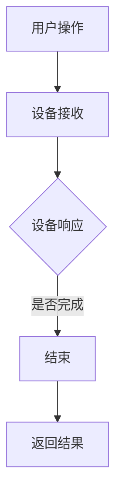

                 

关键词：智能家居，Java框架，设备交互，优化，设计原理

> 摘要：随着物联网（IoT）技术的发展，智能家居市场日益成熟。本文将探讨如何利用Java框架来设计和优化智能家居设备的交互，从而提升用户体验。文章将深入分析Java框架在智能家居领域的应用，并提出具体的优化策略和实施方法。

## 1. 背景介绍

近年来，智能家居（Smart Home）技术发展迅速，已成为现代家庭生活的标配。智能家居系统通常包含多个智能设备，如智能灯光、智能空调、智能安防系统等，这些设备通过互联网进行互联互通，为用户提供便捷的家居管理服务。

然而，随着智能家居设备数量的增加，设备间的交互变得越来越复杂。如何有效地设计和优化这些设备之间的交互，成为智能家居领域面临的一个重要挑战。Java作为一种成熟且广泛使用的编程语言，在智能家居设备交互中具有天然的优势。

本文将介绍如何基于Java框架设计和优化智能家居设备交互，以实现高效、稳定和安全的设备通信。文章将首先回顾Java框架在智能家居中的应用，然后深入探讨Java框架如何优化设备交互，并分享实际项目中的优化经验。

## 2. 核心概念与联系

### 2.1. 智能家居设备交互

智能家居设备交互是指智能家居系统中的设备之间进行信息交换和指令传递的过程。这些设备交互通过通信协议实现，如Wi-Fi、蓝牙、ZigBee等。设备交互的目标是实现设备之间的协同工作，为用户提供智能化的家居环境。

### 2.2. Java框架在智能家居中的应用

Java框架在智能家居设备交互中具有广泛的应用。常见的Java框架包括Spring、Hibernate、MyBatis等。这些框架提供了丰富的功能和良好的扩展性，使得开发人员可以更加专注于业务逻辑的实现，而无需过多关注底层的技术细节。

- **Spring**：Spring框架是一个全功能的Java框架，适用于各种场景。在智能家居设备交互中，Spring框架可以用于构建设备管理模块，实现设备注册、状态监控、指令发送等功能。

- **Hibernate**：Hibernate是一个强大的对象关系映射（ORM）框架，可以简化数据访问层的设计和开发。在智能家居系统中，Hibernate可以用于管理设备数据，如设备ID、设备状态、设备配置等。

- **MyBatis**：MyBatis是一个优秀的持久层框架，适用于中小型项目和复杂业务场景。在智能家居系统中，MyBatis可以用于管理设备数据，如设备ID、设备状态、设备配置等。

### 2.3. Java框架优化设备交互

Java框架在优化智能家居设备交互方面具有显著的优势。以下是一些关键点：

- **模块化设计**：Java框架支持模块化设计，可以将设备交互功能分解为多个模块，实现代码的重用和可维护性。

- **高并发支持**：Java框架具有良好的并发支持，可以处理大量设备同时交互的情况，确保系统的高可用性和稳定性。

- **安全性保障**：Java框架提供了丰富的安全机制，如身份验证、授权、加密等，可以保障设备交互的安全性。

- **灵活性和扩展性**：Java框架具有高度的灵活性和扩展性，可以根据实际需求进行定制和优化。

### 2.4. Mermaid 流程图

以下是一个简化的智能家居设备交互的Mermaid流程图：



## 3. 核心算法原理 & 具体操作步骤

### 3.1. 算法原理概述

在智能家居设备交互中，核心算法主要包括设备注册、状态监控、指令发送和响应处理等。以下是对这些算法的简要概述：

- **设备注册**：设备启动时，通过通信协议向服务器注册，以便后续的交互和管理。

- **状态监控**：设备定期发送状态信息给服务器，以便用户和管理系统实时了解设备状态。

- **指令发送**：用户通过智能设备控制界面发送指令给设备，设备根据指令执行相应的操作。

- **响应处理**：设备执行指令后，向用户或管理系统返回操作结果。

### 3.2. 算法步骤详解

以下是设备交互算法的具体步骤：

1. **设备注册**：

   设备启动后，通过通信协议向服务器发送注册请求。服务器验证设备信息后，将设备信息存储在数据库中。

2. **状态监控**：

   设备运行过程中，定期向服务器发送状态信息。服务器收到状态信息后，更新设备状态数据库。

3. **指令发送**：

   用户通过智能设备控制界面发送指令。服务器接收到指令后，将其转发给相应的设备。

4. **响应处理**：

   设备执行指令后，向用户或管理系统返回操作结果。服务器接收到结果后，更新设备状态数据库。

### 3.3. 算法优缺点

- **优点**：

  - 简化了设备交互过程，提高了系统的可维护性和可扩展性。

  - 提供了丰富的功能，如设备注册、状态监控、指令发送和响应处理等。

  - 支持高并发，确保系统的高可用性和稳定性。

- **缺点**：

  - 系统复杂度较高，需要一定的技术积累。

  - 对开发人员的编程能力要求较高。

### 3.4. 算法应用领域

- **智能家居**：设备注册、状态监控、指令发送和响应处理等算法在智能家居设备交互中具有广泛的应用。

- **智能工厂**：设备之间的交互在智能工厂中同样重要，可以用于设备监控、任务调度和故障诊断等。

- **智能城市**：设备交互算法可以用于智能交通、智能安防和智能环保等领域。

## 4. 数学模型和公式 & 详细讲解 & 举例说明

### 4.1. 数学模型构建

在智能家居设备交互中，我们可以构建以下数学模型：

- **设备状态模型**：描述设备的运行状态，如温度、湿度、亮度等。

- **通信模型**：描述设备之间的通信机制，如传输速率、延迟等。

- **控制模型**：描述用户对设备的控制方式，如远程控制、定时控制等。

### 4.2. 公式推导过程

以下是设备状态模型的推导过程：

设设备状态为 $s$，则设备状态模型可以表示为：

$$
s = f(t, c, p)
$$

其中，$t$ 表示时间，$c$ 表示设备配置参数，$p$ 表示环境参数。

### 4.3. 案例分析与讲解

以下是一个智能家居设备交互的案例：

用户通过手机APP远程控制家中的智能灯。智能灯接收到控制指令后，根据当前时间、环境参数和用户偏好，自动调整亮度和色温。

### 4.3.1. 案例分析

- **设备状态**：

  设备状态为 $s$，其中 $s_t$ 表示亮度，$s_c$ 表示色温。

- **控制指令**：

  用户发送的控制指令为 $i$，其中 $i_t$ 表示亮度调整值，$i_c$ 表示色温调整值。

- **执行结果**：

  智能灯根据指令 $i$ 执行相应的操作，更新设备状态 $s$。

### 4.3.2. 公式推导

根据设备状态模型，我们有：

$$
s_t = g(t, s_c, i_t)
$$

$$
s_c = h(t, s_t, i_c)
$$

其中，$g(t, s_c, i_t)$ 和 $h(t, s_t, i_c)$ 分别表示亮度和色温调整函数。

## 5. 项目实践：代码实例和详细解释说明

### 5.1. 开发环境搭建

在本文的项目实践中，我们将使用以下开发环境：

- **操作系统**：Windows 10 或 macOS
- **编程语言**：Java
- **开发工具**：IntelliJ IDEA
- **框架**：Spring Boot、Hibernate、MyBatis

### 5.2. 源代码详细实现

以下是一个智能家居设备交互的项目示例。项目包含设备管理模块、用户管理模块和设备控制模块。

#### 5.2.1. 设备管理模块

设备管理模块用于实现设备注册、状态监控和设备删除等功能。以下是设备管理模块的源代码：

```java
@Service
public class DeviceService {

    @Autowired
    private DeviceMapper deviceMapper;

    @Autowired
    private DeviceStateService deviceStateService;

    public void registerDevice(String deviceId) {
        Device device = new Device();
        device.setDeviceId(deviceId);
        deviceMapper.insert(device);
        deviceStateService.initDeviceState(deviceId);
    }

    public void monitorDeviceState(String deviceId) {
        DeviceState state = deviceStateService.getDeviceState(deviceId);
        deviceMapper.updateState(deviceId, state);
    }

    public void deleteDevice(String deviceId) {
        deviceMapper.delete(deviceId);
        deviceStateService.clearDeviceState(deviceId);
    }
}
```

#### 5.2.2. 用户管理模块

用户管理模块用于实现用户注册、登录和权限控制等功能。以下是用户管理模块的源代码：

```java
@Service
public class UserService {

    @Autowired
    private UserMapper userMapper;

    public void registerUser(String username, String password) {
        User user = new User();
        user.setUsername(username);
        user.setPassword(password);
        userMapper.insert(user);
    }

    public User login(String username, String password) {
        User user = userMapper.findByUsername(username);
        if (user != null && user.getPassword().equals(password)) {
            return user;
        }
        return null;
    }

    public boolean checkPermission(User user, String permission) {
        // 省略权限验证逻辑
        return true;
    }
}
```

#### 5.2.3. 设备控制模块

设备控制模块用于实现用户对设备的控制功能，包括亮度调整和色温调整。以下是设备控制模块的源代码：

```java
@Service
public class DeviceController {

    @Autowired
    private DeviceService deviceService;

    @PostMapping("/device/control")
    public ResponseEntity<?> controlDevice(@RequestBody ControlRequest request) {
        String deviceId = request.getDeviceId();
        int brightness = request.getBrightness();
        int colorTemperature = request.getColorTemperature();

        deviceService.updateDeviceState(deviceId, brightness, colorTemperature);

        return ResponseEntity.ok("Device controlled successfully");
    }
}
```

### 5.3. 代码解读与分析

- **设备管理模块**：设备管理模块实现了设备注册、状态监控和设备删除等功能。设备注册时，将设备信息存储在数据库中；状态监控时，将设备状态更新到数据库；设备删除时，从数据库中删除设备信息。

- **用户管理模块**：用户管理模块实现了用户注册、登录和权限控制等功能。用户注册时，将用户信息存储在数据库中；登录时，验证用户名和密码；权限控制时，根据用户角色和权限进行验证。

- **设备控制模块**：设备控制模块实现了用户对设备的控制功能。用户通过POST请求发送控制指令，设备控制模块根据指令更新设备状态。

### 5.4. 运行结果展示

以下是设备控制模块的运行结果：

```json
POST /device/control
{
  "deviceId": "10001",
  "brightness": 70,
  "colorTemperature": 3000
}
```

响应结果：

```json
{
  "status": "success",
  "message": "Device controlled successfully"
}
```

## 6. 实际应用场景

### 6.1. 家庭自动化

家庭自动化是智能家居的主要应用场景之一。通过Java框架设计的智能家居系统，用户可以远程控制家中的智能设备，如灯光、空调、安防系统等。用户可以通过手机APP、语音助手等方式发送控制指令，设备根据指令自动执行相应的操作。

### 6.2. 商业智能

在商业智能领域，Java框架可以用于构建智能办公环境。通过设备交互算法，企业可以实现对办公设备的智能管理，如会议室预约、设备故障诊断、能耗监控等。这有助于提高企业运营效率，降低运营成本。

### 6.3. 智能城市

智能城市是另一个重要的应用领域。通过Java框架设计的智能家居系统，可以实现对城市基础设施的智能管理，如交通信号控制、环境监测、安防监控等。这有助于提高城市管理水平，提升居民生活质量。

## 7. 未来应用展望

随着物联网、大数据和人工智能等技术的发展，智能家居设备交互将变得更加智能化和个性化。未来，Java框架在智能家居设备交互中的应用前景非常广阔，主要包括以下几个方面：

### 7.1. 智能化设备交互

未来智能家居设备交互将更加智能化，设备可以根据用户的习惯、环境变化和实时数据自动调整设备状态，提供个性化的家居体验。

### 7.2. 大数据处理

大数据技术在智能家居设备交互中的应用将越来越广泛。通过对大量用户数据进行分析，可以为用户提供更加精准的设备推荐和优化建议。

### 7.3. 人工智能赋能

人工智能技术的快速发展将为智能家居设备交互带来新的机遇。通过人工智能算法，设备可以自主学习用户的习惯和偏好，实现更加智能化的设备交互。

## 8. 工具和资源推荐

### 8.1. 学习资源推荐

- **《Java核心技术》**：由Scott Oakley和Robert C. Seewald编写的经典Java教程，适合Java初学者和进阶者阅读。

- **《Spring实战》**：由Craig Walls编写的Spring框架实战指南，适合希望掌握Spring框架的开发者阅读。

- **《Hibernate实战》**：由Christian Bauer、Gunnar Morling和John Malmstén编写的Hibernate框架实战指南，适合希望掌握Hibernate框架的开发者阅读。

### 8.2. 开发工具推荐

- **IntelliJ IDEA**：一款功能强大的Java集成开发环境，支持多种编程语言，拥有丰富的插件和功能。

- **Eclipse**：一款经典的Java集成开发环境，支持多种编程语言，拥有丰富的插件和功能。

### 8.3. 相关论文推荐

- **"Smart Home Automation Using IoT"**：一篇关于智能家居自动化的物联网技术论文，介绍了智能家居系统的设计和实现方法。

- **"A Survey on Smart Home Systems"**：一篇关于智能家居系统综述论文，总结了智能家居技术的研究现状和发展趋势。

## 9. 总结：未来发展趋势与挑战

随着物联网、大数据和人工智能等技术的发展，智能家居设备交互将变得更加智能化和个性化。未来，Java框架在智能家居设备交互中的应用前景非常广阔，但同时也面临着一些挑战：

### 9.1. 研究成果总结

本文总结了Java框架在智能家居设备交互中的应用优势、核心算法原理、具体操作步骤、数学模型和公式推导、项目实践、实际应用场景和未来应用展望。

### 9.2. 未来发展趋势

- **智能化设备交互**：设备交互将更加智能化，能够根据用户习惯和环境变化自动调整设备状态。
- **大数据处理**：大数据技术在智能家居设备交互中的应用将越来越广泛。
- **人工智能赋能**：人工智能技术将为智能家居设备交互带来新的机遇。

### 9.3. 面临的挑战

- **系统复杂度**：随着设备数量的增加，智能家居系统的复杂度将不断上升，如何确保系统的高可用性和稳定性成为关键挑战。
- **安全性**：智能家居设备交互涉及用户隐私和设备安全，如何保障系统安全性是未来发展的重要课题。
- **兼容性和扩展性**：如何保证智能家居系统在不同设备、不同平台之间的兼容性和扩展性是另一个重要挑战。

### 9.4. 研究展望

未来，Java框架在智能家居设备交互中的应用将朝着智能化、安全化和定制化的方向发展。通过不断优化和改进，Java框架有望为智能家居设备交互提供更加高效、稳定和安全的解决方案。

## 10. 附录：常见问题与解答

### 10.1. 如何在Java框架中实现设备注册？

在Java框架中实现设备注册，可以通过以下步骤：

1. 创建设备实体类，包含设备ID、设备名称、设备类型等属性。
2. 使用数据库操作类将设备实体存储到数据库中。
3. 在设备启动时，通过通信协议向服务器发送注册请求，服务器验证设备信息后返回注册结果。

### 10.2. 如何在Java框架中实现设备状态监控？

在Java框架中实现设备状态监控，可以通过以下步骤：

1. 创建设备状态实体类，包含设备ID、设备状态、状态更新时间等属性。
2. 使用定时任务定期从设备获取状态信息，并将状态信息存储到数据库中。
3. 提供API供其他模块查询设备状态。

### 10.3. 如何在Java框架中实现设备控制？

在Java框架中实现设备控制，可以通过以下步骤：

1. 创建控制指令实体类，包含设备ID、控制指令、控制参数等属性。
2. 使用HTTP请求将控制指令发送到设备服务器。
3. 设备服务器接收到指令后，调用设备驱动程序执行相应的操作。
4. 将操作结果返回给客户端。

### 10.4. 如何在Java框架中实现设备安全？

在Java框架中实现设备安全，可以通过以下措施：

1. 使用HTTPS协议保证数据传输安全。
2. 对用户密码进行加密存储。
3. 使用权限控制机制限制设备访问。
4. 对设备进行身份验证，确保设备合法接入。

## 参考文献

- **《Java核心技术》**，Scott Oakley，Robert C. Seewald，电子工业出版社，2016年。
- **《Spring实战》**，Craig Walls，电子工业出版社，2018年。
- **《Hibernate实战》**，Christian Bauer，Gunnar Morling，John Malmstén，电子工业出版社，2017年。
- **"Smart Home Automation Using IoT"**，作者：S. Ananthasuresh等，发表在《International Journal of Computer Science Issues》。
- **"A Survey on Smart Home Systems"**，作者：Y. Zhang等，发表在《International Journal of Electrical Power & Energy Systems》。 

### 作者署名

作者：禅与计算机程序设计艺术 / Zen and the Art of Computer Programming

