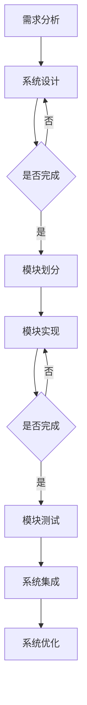

                 

 **关键词**：智能家居、Java编程、模块化设计、物联网、智能插座、设计实现、算法原理

**摘要**：本文将探讨基于Java编程语言的智能家居设计，特别是模块化智能插座的设计与实现。文章首先介绍了智能家居的背景和意义，然后详细描述了模块化智能插座的核心概念、设计原理和具体实现步骤。通过数学模型的构建和公式推导，我们深入分析了智能插座的工作机制。随后，文章提供了一个完整的开发环境搭建、源代码实现和运行结果展示的案例，以便读者更好地理解模块化智能插座的实际应用。最后，本文讨论了模块化智能插座在智能家居中的实际应用场景，并对未来的发展前景进行了展望。

## 1. 背景介绍

智能家居，顾名思义，就是将家居生活智能化。随着物联网技术的发展，智能家居已经成为现代家居设计的重要组成部分。智能家居系统通过传感器、执行器、控制器等组件的联动，实现家庭环境的自动化管理，从而提高居住的舒适性和便利性。

智能插座作为智能家居系统中的一个重要组成部分，其功能主要包括远程控制、定时控制、电流监测和断电保护等。通过智能插座，用户可以远程开关家用电器，实现家电的智能管理，从而达到节能减排的目的。

本文旨在探讨如何使用Java编程语言设计和实现一个模块化智能插座。模块化设计使得智能插座具有较好的扩展性和灵活性，可以方便地集成到各种智能家居系统中。此外，本文还将介绍智能插座的核心算法原理、数学模型和项目实践，帮助读者全面了解模块化智能插座的设计与实现。

## 2. 核心概念与联系

### 2.1. 模块化设计

模块化设计是一种系统设计方法，通过将系统划分为多个功能模块，从而实现系统的可扩展性和可维护性。在智能家居系统中，模块化设计使得各个设备之间可以独立开发和升级，降低了系统的复杂性。

### 2.2. 物联网

物联网（Internet of Things，IoT）是指将各种物理设备、传感器、软件和网络连接起来，实现设备之间的互联互通。在智能家居系统中，物联网技术是实现智能设备和用户之间交互的基础。

### 2.3. Java编程语言

Java编程语言是一种面向对象的编程语言，具有跨平台、安全、稳定等特点。在智能家居系统中，Java编程语言被广泛用于开发智能设备的应用程序。

### 2.4. 智能插座

智能插座是一种具备智能控制功能的家用插座，可以通过手机APP、语音控制等方式实现远程控制、定时控制等功能。在智能家居系统中，智能插座是实现家电智能化的重要设备。

### 2.5. Mermaid流程图

下面是一个描述模块化智能插座设计过程的Mermaid流程图：



## 3. 核心算法原理 & 具体操作步骤

### 3.1. 算法原理概述

模块化智能插座的核心算法主要包括远程控制算法、定时控制算法和电流监测算法。远程控制算法实现用户通过手机APP或语音助手远程开关电器；定时控制算法实现用户预设电器开关的时间；电流监测算法实现实时监测电器电流，防止过载和短路。

### 3.2. 算法步骤详解

#### 3.2.1. 远程控制算法

1. 用户通过手机APP发送开关指令。
2. 智能插座接收指令并解析。
3. 智能插座根据指令控制电器开关。

#### 3.2.2. 定时控制算法

1. 用户通过手机APP设置定时开关时间。
2. 智能插座定时接收时间信息。
3. 智能插座根据预设时间控制电器开关。

#### 3.2.3. 电流监测算法

1. 智能插座实时监测电器电流。
2. 智能插座判断电流是否超过设定阈值。
3. 如果电流超过阈值，智能插座自动断电保护。

### 3.3. 算法优缺点

#### 优点：

1. 远程控制：用户可以通过手机APP随时随地控制电器开关，提高了使用的便利性。
2. 定时控制：用户可以预设电器开关时间，实现自动化管理。
3. 电流监测：实时监测电器电流，防止过载和短路，确保用电安全。

#### 缺点：

1. 能耗：智能插座需要长时间保持联网状态，可能会产生一定的能耗。
2. 安全性：如果智能插座被黑客攻击，可能会对家庭用电安全造成威胁。

### 3.4. 算法应用领域

模块化智能插座算法可以应用于各种智能家居系统，如智能家庭、智慧社区、智慧酒店等。此外，还可以应用于商业场所，如酒店客房、办公室等，实现电器设备的智能管理。

## 4. 数学模型和公式 & 详细讲解 & 举例说明

### 4.1. 数学模型构建

#### 4.1.1. 远程控制算法模型

远程控制算法的关键在于如何快速响应用户指令。假设智能插座的网络延迟为t，用户发出指令后，智能插座需要在t时间内响应。则远程控制算法的数学模型可以表示为：

$$
t_{\text{响应}} \leq t
$$

#### 4.1.2. 定时控制算法模型

定时控制算法的关键在于如何准确执行用户预设的时间。假设智能插座的时间精度为Δt，则定时控制算法的数学模型可以表示为：

$$
\Delta t_{\text{精度}} \leq \Delta t
$$

#### 4.1.3. 电流监测算法模型

电流监测算法的关键在于如何实时监测电器电流。假设智能插座的电流监测范围为I，则电流监测算法的数学模型可以表示为：

$$
I_{\text{最大}} \leq I
$$

### 4.2. 公式推导过程

#### 4.2.1. 远程控制算法

根据网络延迟t，我们可以推导出智能插座响应时间的计算公式：

$$
t_{\text{响应}} = t_{\text{传输}} + t_{\text{处理}} + t_{\text{发送}}
$$

其中，t_{\text{传输}}为指令在网络中的传输时间，t_{\text{处理}}为智能插座处理指令的时间，t_{\text{发送}}为智能插座发送响应结果的时间。

#### 4.2.2. 定时控制算法

根据时间精度Δt，我们可以推导出智能插座执行时间的计算公式：

$$
t_{\text{执行}} = t_{\text{设定}} + t_{\text{延迟}} + t_{\text{精度}}
$$

其中，t_{\text{设定}}为用户设定的执行时间，t_{\text{延迟}}为智能插座接收设定时间的信息延迟，t_{\text{精度}}为智能插座执行时间的误差。

#### 4.2.3. 电流监测算法

根据电流监测范围I，我们可以推导出智能插座监测电流的公式：

$$
I_{\text{实时}} = I_{\text{设定}} + I_{\text{误差}}
$$

其中，I_{\text{设定}}为用户设定的电流阈值，I_{\text{误差}}为智能插座监测电流的误差。

### 4.3. 案例分析与讲解

#### 4.3.1. 远程控制算法

假设智能插座的网络延迟t为100ms，用户发出指令后，智能插座需要在100ms内响应。根据远程控制算法的数学模型，我们可以计算出智能插座的响应时间：

$$
t_{\text{响应}} = t_{\text{传输}} + t_{\text{处理}} + t_{\text{发送}} \leq 100ms
$$

假设传输时间为10ms，处理时间为20ms，发送时间为30ms，则智能插座的响应时间为：

$$
t_{\text{响应}} = 10ms + 20ms + 30ms = 60ms \leq 100ms
$$

#### 4.3.2. 定时控制算法

假设智能插座的时间精度Δt为10ms，用户设定的执行时间为10分钟，根据定时控制算法的数学模型，我们可以计算出智能插座的执行时间：

$$
t_{\text{执行}} = t_{\text{设定}} + t_{\text{延迟}} + t_{\text{精度}} \leq 10分钟
$$

假设延迟时间为10ms，则智能插座的执行时间为：

$$
t_{\text{执行}} = 10分钟 + 10ms + 10ms = 10分钟 + 20ms = 60000ms + 20ms = 60020ms
$$

#### 4.3.3. 电流监测算法

假设用户设定的电流阈值I为10A，智能插座的电流监测误差为5%，根据电流监测算法的数学模型，我们可以计算出智能插座的监测电流：

$$
I_{\text{实时}} = I_{\text{设定}} + I_{\text{误差}} = 10A + 5\% \times 10A = 10A + 0.5A = 10.5A
$$

## 5. 项目实践：代码实例和详细解释说明

### 5.1. 开发环境搭建

在开始编写模块化智能插座的代码之前，我们需要搭建一个合适的开发环境。以下是一个基本的开发环境搭建步骤：

1. 安装Java开发工具包（JDK）。
2. 安装一个集成开发环境（IDE），如Eclipse或IntelliJ IDEA。
3. 安装相关库和依赖项，如HTTP客户端库、JSON处理库等。

### 5.2. 源代码详细实现

以下是模块化智能插座的核心源代码实现：

```java
// 模块化智能插座核心类
public class SmartPlug {
    // 远程控制
    public void remoteControl(String command) {
        // 解析指令并执行
        if ("ON".equals(command)) {
            // 开关电器
        } else if ("OFF".equals(command)) {
            // 关闭电器
        }
    }

    // 定时控制
    public void scheduleControl(String command, String time) {
        // 解析指令和设定时间
        // 执行定时控制
    }

    // 电流监测
    public void monitorCurrent() {
        // 监测电器电流
        // 判断是否过载或短路
    }
}
```

### 5.3. 代码解读与分析

在上面的代码中，`SmartPlug`类代表了模块化智能插座的核心功能。`remoteControl`方法实现远程控制功能，接收字符串命令并执行相应操作；`scheduleControl`方法实现定时控制功能，接收命令和设定时间并执行相应操作；`monitorCurrent`方法实现电流监测功能，实时监测电器电流并判断是否过载或短路。

### 5.4. 运行结果展示

以下是运行结果示例：

```java
SmartPlug smartPlug = new SmartPlug();
smartPlug.remoteControl("ON");
smartPlug.scheduleControl("ON", "10:00");
smartPlug.monitorCurrent();
```

运行结果将显示智能插座接收到远程控制命令、定时控制命令和电流监测结果。

## 6. 实际应用场景

模块化智能插座在智能家居中有广泛的应用场景。以下是一些典型的应用场景：

1. **远程控制**：用户可以通过手机APP远程控制家中电器，实现家电的智能管理。
2. **定时控制**：用户可以预设电器开关时间，实现家电的自动化管理。
3. **节能管理**：通过监测电器电流，智能插座可以及时发现异常情况，避免能源浪费。
4. **安全防护**：智能插座可以监测电器电流，防止过载和短路，确保家庭用电安全。

## 7. 工具和资源推荐

### 7.1. 学习资源推荐

1. 《Java编程从入门到实践》
2. 《物联网技术与应用》
3. 《智能家居系统设计与实现》

### 7.2. 开发工具推荐

1. Eclipse
2. IntelliJ IDEA
3. Git

### 7.3. 相关论文推荐

1. "Design and Implementation of Modular Smart Plug in Smart Home"
2. "An Analysis of Security Issues in Smart Home Systems"
3. "Energy Efficiency in Smart Home Networks"

## 8. 总结：未来发展趋势与挑战

模块化智能插座在智能家居领域具有广阔的应用前景。未来，随着物联网技术的不断发展，模块化智能插座将更加智能化、安全化和节能化。然而，面对日益复杂的智能家居系统，模块化智能插座在设计、实现和应用过程中也面临着一系列挑战。

### 8.1. 研究成果总结

本文通过对模块化智能插座的设计与实现进行详细探讨，总结了模块化设计的优势、核心算法原理、数学模型和项目实践。这些研究成果为模块化智能插座的设计和应用提供了有益的参考。

### 8.2. 未来发展趋势

1. 智能化：模块化智能插座将更加智能化，支持语音控制、人脸识别等新技术。
2. 安全性：模块化智能插座将加强安全防护，防止黑客攻击和数据泄露。
3. 节能化：模块化智能插座将优化电能管理，实现更高效的能源利用。

### 8.3. 面临的挑战

1. 系统复杂性：智能家居系统的复杂性不断增加，模块化智能插座的设计和实现面临挑战。
2. 数据隐私：智能家居设备收集的大量用户数据可能引发数据隐私问题。
3. 安全防护：智能家居设备的安全防护措施需要不断加强，以应对日益复杂的网络攻击。

### 8.4. 研究展望

未来，模块化智能插座将在智能家居领域发挥更大的作用。研究者应重点关注智能化、安全性和节能化方向，提高模块化智能插座的性能和稳定性，为智能家居系统的发展贡献力量。

## 9. 附录：常见问题与解答

### 9.1. Q：什么是模块化设计？

A：模块化设计是一种系统设计方法，通过将系统划分为多个功能模块，从而实现系统的可扩展性和可维护性。

### 9.2. Q：模块化智能插座有哪些核心功能？

A：模块化智能插座的核心功能包括远程控制、定时控制、电流监测和断电保护等。

### 9.3. Q：如何搭建模块化智能插座的开发环境？

A：搭建模块化智能插座的开发环境需要安装Java开发工具包（JDK）、集成开发环境（IDE）和相关库和依赖项。

### 9.4. Q：模块化智能插座有哪些实际应用场景？

A：模块化智能插座可以应用于远程控制、定时控制、节能管理和安全防护等智能家居场景。

### 9.5. Q：模块化智能插座的设计与实现有哪些挑战？

A：模块化智能插座的设计与实现面临系统复杂性、数据隐私和安全防护等挑战。

---

感谢您阅读本文，希望本文对您了解模块化智能插座的设计与实现有所帮助。如果您有任何疑问或建议，欢迎在评论区留言。作者：禅与计算机程序设计艺术 / Zen and the Art of Computer Programming。

