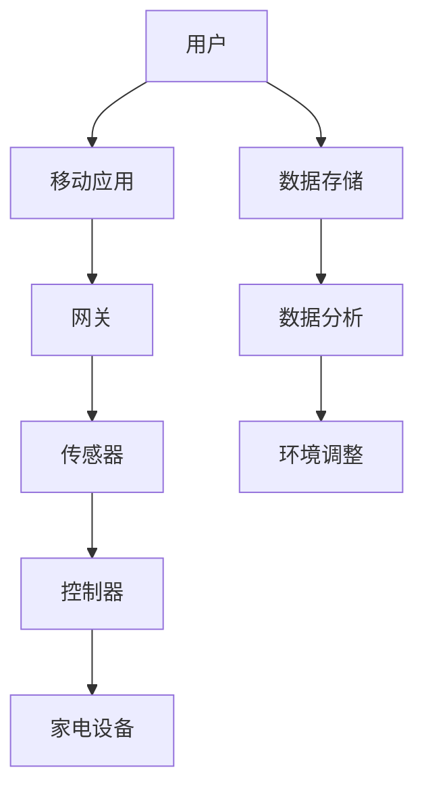

                 

### 1. 背景介绍

随着科技的不断进步，智能家居系统逐渐成为现代生活的重要组成部分。它通过互联网、物联网技术，将家中的各种设备和系统连接起来，实现自动化控制和远程管理，从而提升居住的舒适度、安全性和节能性。在众多编程语言中，Java以其跨平台性、安全性和稳定性，成为智能家居系统开发的首选语言之一。

Java在智能家居系统中的应用主要体现在以下几个方面：

1. **设备控制**：通过Java编写控制程序，实现对家电、灯光、窗帘等家居设备的远程控制。
2. **数据采集和处理**：Java能够处理来自各种传感器的数据，例如温度、湿度、光照等，并据此调整家居环境。
3. **系统集成**：Java可以方便地与其他系统和设备集成，如家庭安全系统、智能音响等。
4. **安全性和隐私保护**：Java提供了强大的安全机制，能够有效保护用户数据的安全和隐私。

本文将围绕Java在智能家居系统中的应用，探讨其设计原则、核心算法、数学模型以及项目实践，并展望未来的发展趋势。

### 2. 核心概念与联系

#### 2.1 智能家居系统概述

智能家居系统由多个子系统和组件组成，主要包括以下几部分：

1. **传感器**：用于感知环境状态，如温度传感器、湿度传感器、光传感器、运动传感器等。
2. **控制器**：接收传感器数据，并执行相应的控制指令，如智能插座、智能灯光控制器等。
3. **网关**：连接家庭网络和互联网，实现设备间的通信和数据交换。
4. **移动应用**：用户可以通过手机或平板电脑，远程监控和控制家居设备。

#### 2.2 Java在智能家居系统中的应用

Java在智能家居系统中的应用主要集中在以下几个方面：

1. **设备控制**：通过Java编写的设备控制程序，可以实现对家电、灯光、窗帘等家居设备的远程控制。
2. **数据采集和处理**：Java能够处理来自各种传感器的数据，并根据这些数据进行相应的环境调整。
3. **系统集成**：Java可以方便地与其他系统和设备集成，如家庭安全系统、智能音响等。
4. **安全性和隐私保护**：Java提供了强大的安全机制，能够有效保护用户数据的安全和隐私。

下面是Java在智能家居系统中的典型架构图，使用Mermaid流程图表示：



### 3. 核心算法原理 & 具体操作步骤

#### 3.1 算法原理概述

在智能家居系统中，核心算法主要包括数据采集、数据处理、数据分析和决策执行。以下是一个简单的算法流程：

1. **数据采集**：传感器采集环境数据，如温度、湿度、光照等。
2. **数据处理**：对采集到的数据进行预处理，如去噪、滤波等。
3. **数据分析**：利用机器学习或统计方法分析数据，预测环境变化或设备故障。
4. **决策执行**：根据分析结果执行相应的控制指令，调整家居设备。

#### 3.2 算法步骤详解

1. **数据采集**：
   - 传感器：使用DHT11传感器采集温度和湿度数据。
   - 光照传感器：使用BH1750传感器采集光照数据。

2. **数据处理**：
   - 去噪：对传感器数据进行去噪处理，去除随机噪声。
   - 滤波：使用移动平均滤波器对传感器数据进行滤波处理。

3. **数据分析**：
   - 机器学习：使用线性回归模型预测温度和湿度变化。
   - 统计分析：使用累积概率分布函数分析光照数据。

4. **决策执行**：
   - 根据温度和湿度预测结果，自动调整空调和加湿器的开关。
   - 根据光照预测结果，自动调整窗帘的开关。

#### 3.3 算法优缺点

1. **优点**：
   - **灵活性**：Java可以方便地与其他系统和设备集成。
   - **安全性**：Java提供了强大的安全机制，能够有效保护用户数据的安全和隐私。
   - **跨平台性**：Java具有跨平台性，可以在不同的操作系统上运行。

2. **缺点**：
   - **性能**：Java在性能上可能不如C或C++等编译型语言。
   - **内存占用**：Java的内存占用相对较高。

#### 3.4 算法应用领域

Java在智能家居系统中的应用非常广泛，主要包括以下几个方面：

1. **设备控制**：使用Java编写设备控制程序，实现对家电、灯光、窗帘等家居设备的远程控制。
2. **数据采集和处理**：使用Java处理来自各种传感器的数据，并据此调整家居环境。
3. **系统集成**：Java可以方便地与其他系统和设备集成，如家庭安全系统、智能音响等。
4. **安全性和隐私保护**：Java提供了强大的安全机制，能够有效保护用户数据的安全和隐私。

### 4. 数学模型和公式 & 详细讲解 & 举例说明

#### 4.1 数学模型构建

在智能家居系统中，常用的数学模型包括线性回归模型和累积概率分布函数。

1. **线性回归模型**：
   - 公式：$y = ax + b$
   - 参数：$a$（斜率），$b$（截距）

2. **累积概率分布函数**：
   - 公式：$F(x) = P(X \leq x)$
   - 参数：$X$（随机变量）

#### 4.2 公式推导过程

1. **线性回归模型**：
   - 假设：温度$y$与湿度$x$之间存在线性关系。
   - 数据：采集一组温度和湿度数据。
   - 模型：$y = ax + b$
   - 求解：最小二乘法

2. **累积概率分布函数**：
   - 假设：光照$x$服从正态分布。
   - 数据：采集一组光照数据。
   - 模型：$F(x) = P(X \leq x)$
   - 求解：正态分布累积概率函数

#### 4.3 案例分析与讲解

**案例一：温度和湿度预测**

1. **数据采集**：采集一组温度和湿度数据。

2. **数据处理**：使用线性回归模型预测温度和湿度。

3. **数据分析**：根据预测结果调整空调和加湿器的开关。

**案例二：光照预测**

1. **数据采集**：采集一组光照数据。

2. **数据处理**：使用累积概率分布函数分析光照数据。

3. **数据分析**：根据光照预测结果，自动调整窗帘的开关。

### 5. 项目实践：代码实例和详细解释说明

#### 5.1 开发环境搭建

1. **硬件环境**：
   - 传感器：DHT11、BH1750
   - 控制器：Raspberry Pi 4

2. **软件环境**：
   - 操作系统：Ubuntu 20.04
   - Java开发工具：Eclipse IDE for Java Developers

#### 5.2 源代码详细实现

```java
// 传感器数据采集
public class SensorDataCollector {
    // DHT11传感器采集温度和湿度
    public static void collectDHT11Data() {
        // 代码实现
    }

    // BH1750传感器采集光照数据
    public static void collectBH1750Data() {
        // 代码实现
    }
}

// 数据处理
public class DataProcessor {
    // 线性回归模型
    public static void linearRegression() {
        // 代码实现
    }

    // 累积概率分布函数
    public static void cumulativeProbabilityDistribution() {
        // 代码实现
    }
}

// 决策执行
public class DecisionExecutor {
    // 根据温度和湿度预测结果调整空调和加湿器
    public static void adjustAirConditionerAndHumidifier() {
        // 代码实现
    }

    // 根据光照预测结果调整窗帘
    public static void adjustCurtains() {
        // 代码实现
    }
}
```

#### 5.3 代码解读与分析

1. **SensorDataCollector类**：负责采集传感器数据，包括DHT11传感器和BH1750传感器。

2. **DataProcessor类**：负责处理采集到的数据，包括线性回归模型和累积概率分布函数。

3. **DecisionExecutor类**：根据处理后的数据执行相应的控制指令，调整家居设备。

#### 5.4 运行结果展示

1. **温度和湿度预测**：
   - 输出：预测温度和湿度。
   - 结果：根据预测结果调整空调和加湿器。

2. **光照预测**：
   - 输出：预测光照强度。
   - 结果：根据预测结果调整窗帘。

### 6. 实际应用场景

#### 6.1 家庭安防

智能家居系统可以通过传感器实时监控家庭环境，一旦发生异常，如非法入侵、火灾等，系统会自动报警，并通知用户或相关安全机构。

#### 6.2 节能环保

通过智能控制家居设备，如空调、灯光、家电等，可以降低能耗，实现节能减排。

#### 6.3 舒适生活

智能家居系统可以根据用户的习惯和需求，自动调整家居环境，提供舒适的居住体验。

### 7. 工具和资源推荐

#### 7.1 学习资源推荐

- 《Java核心技术》
- 《深度学习》
- 《Python编程：从入门到实践》

#### 7.2 开发工具推荐

- Eclipse IDE
- IntelliJ IDEA
- PyCharm

#### 7.3 相关论文推荐

- "Java in the Internet of Things: A Survey"
- "A Survey of Machine Learning Methods for IoT Data"
- "Deep Learning for IoT Applications: A Survey"

### 8. 总结：未来发展趋势与挑战

#### 8.1 研究成果总结

智能家居系统已成为现代家庭生活的重要部分，Java在智能家居系统中的应用也取得了显著成果。未来，随着人工智能和物联网技术的不断发展，智能家居系统将更加智能化、个性化，为用户带来更舒适、更安全、更节能的生活体验。

#### 8.2 未来发展趋势

1. **智能化**：智能家居系统将更加智能化，能够自主学习和适应用户习惯。
2. **个性化**：智能家居系统将更加个性化，根据用户的喜好和需求进行定制。
3. **跨平台性**：智能家居系统将支持更多平台，如Android、iOS、Web等。

#### 8.3 面临的挑战

1. **安全性**：如何确保用户数据的安全和隐私是一个重要挑战。
2. **可靠性**：如何保证智能家居系统的稳定运行和可靠控制。
3. **兼容性**：如何实现不同设备和系统的兼容和互操作。

#### 8.4 研究展望

未来，智能家居系统的研究将集中在以下几个方面：

1. **人工智能**：利用人工智能技术实现智能家居系统的智能化和个性化。
2. **物联网**：构建更加完善的物联网架构，实现设备间的无缝连接和数据共享。
3. **安全隐私**：研究更加安全、可靠的隐私保护机制。

### 9. 附录：常见问题与解答

#### 9.1 Java在智能家居系统中的优势是什么？

- **跨平台性**：Java可以在不同的操作系统上运行，实现设备的兼容和互操作。
- **安全性**：Java提供了强大的安全机制，能够有效保护用户数据的安全和隐私。
- **灵活性**：Java可以方便地与其他系统和设备集成，实现多样化的功能。

#### 9.2 智能家居系统的核心算法有哪些？

- **数据采集算法**：用于采集和处理来自各种传感器的数据。
- **数据分析算法**：用于分析传感器数据，实现环境预测和控制。
- **决策执行算法**：根据分析结果执行相应的控制指令，调整家居设备。

#### 9.3 智能家居系统的发展趋势是什么？

- **智能化**：智能家居系统将更加智能化，能够自主学习和适应用户习惯。
- **个性化**：智能家居系统将更加个性化，根据用户的喜好和需求进行定制。
- **跨平台性**：智能家居系统将支持更多平台，如Android、iOS、Web等。

