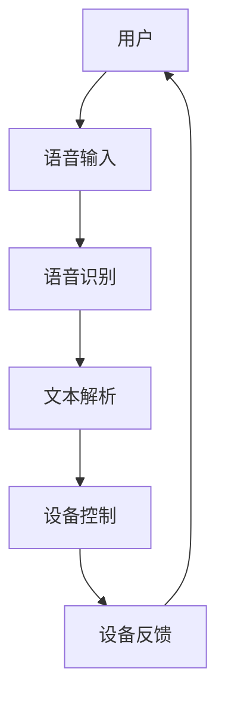

                 

关键词：Java、智能家居、语音识别、系统集成、用户交互

摘要：本文将探讨如何使用Java编程语言设计一个智能家居系统，并详细介绍如何集成语音识别功能，使得用户可以通过语音指令控制家中的各种智能设备。本文将涵盖从系统架构设计到实现语音识别功能的完整流程，以及相关的数学模型和项目实践实例。

## 1. 背景介绍

随着物联网技术的飞速发展，智能家居已经成为现代家庭生活的重要组成部分。智能家居系统通过将各种家电设备连接到互联网，使用户可以通过手机、电脑或其他智能设备远程控制家中的设备，实现自动化和智能化管理。然而，传统的人机交互方式（如触摸屏、按键等）在操作便捷性上存在一定的限制。为了提高用户交互的便捷性，语音识别技术逐渐成为智能家居系统的重要功能之一。

语音识别技术是指让计算机通过处理和分析声音信号，将其转换为文本或命令的技术。随着深度学习算法的进步，现代语音识别技术已经能够在各种复杂的语音环境下实现高准确度的识别。将语音识别集成到智能家居系统中，用户可以通过简单的语音指令控制家中的智能设备，如空调、灯光、电视等，从而实现更加便捷的智能生活体验。

本文旨在介绍如何使用Java编程语言设计一个基于语音识别的智能家居系统。我们将详细讨论系统架构设计、核心算法原理、数学模型构建、项目实践，以及实际应用场景等各个方面，帮助读者了解如何将语音识别技术有效地集成到智能家居系统中。

## 2. 核心概念与联系

在设计和实现基于Java的智能家居系统时，我们需要了解几个核心概念，这些概念构成了系统的基础，并且相互关联。

### 2.1. 智能家居系统架构

智能家居系统通常包括多个层次，包括感知层、网络层、平台层和应用层。感知层负责收集环境数据，如温度、湿度、光照等。网络层负责将感知层的数据传输到平台层。平台层是系统的核心，负责处理和分析数据，并执行相应的操作。应用层为用户提供交互界面，如手机应用、网页或语音控制等。

### 2.2. 语音识别技术

语音识别技术是智能家居系统中的关键组件，它将用户的语音指令转换为文本或命令。现代语音识别技术通常基于深度学习算法，如卷积神经网络（CNN）和循环神经网络（RNN）等。这些算法能够处理复杂的语音信号，并在各种噪声环境下实现高准确度的识别。

### 2.3. 用户交互与控制

用户交互与控制是智能家居系统的核心功能之一。通过语音识别技术，用户可以发出语音指令，系统将解析这些指令并执行相应的操作。例如，用户可以通过语音指令关闭灯光、调节空调温度或打开电视等。

### 2.4. 系统集成

系统集成是将各种硬件设备、软件模块和外部服务整合到一起，使其协同工作。在智能家居系统中，集成意味着将语音识别模块与其他智能设备（如空调、灯光等）无缝连接，并确保系统能够响应用户的语音指令。

下面是一个使用Mermaid绘制的智能家居系统架构流程图：



在上面的流程图中，用户通过语音输入与系统交互，系统通过语音识别模块解析语音并转换为文本，然后根据文本指令控制设备，设备执行操作后给出反馈，再次传递给用户。

## 3. 核心算法原理 & 具体操作步骤

### 3.1 算法原理概述

在智能家居系统中，语音识别的核心算法通常基于深度学习。深度学习算法通过学习大量语音数据，自动识别语音中的模式和特征，从而实现对语音的准确识别。以下是一些常见的深度学习算法：

- **卷积神经网络（CNN）**：适用于处理语音信号的时间序列特征。
- **循环神经网络（RNN）**：特别适用于处理长序列数据，如连续的语音指令。
- **长短时记忆网络（LSTM）**：RNN的一种变体，能够解决传统RNN在长序列数据上的梯度消失问题。
- **Transformer**：一种基于自注意力机制的深度学习模型，近年来在语音识别领域取得了显著成果。

### 3.2 算法步骤详解

语音识别算法通常包括以下步骤：

1. **特征提取**：将语音信号转换为特征向量。常用的特征提取方法包括梅尔频率倒谱系数（MFCC）和隐藏层表示（HLSD）等。
2. **声学模型训练**：使用大量语音数据训练声学模型，模型用于将特征向量映射到相应的音素或词汇。
3. **语言模型训练**：使用文本语料库训练语言模型，用于对识别结果进行语言层面的分析和优化。
4. **解码**：将声学模型和语言模型的结果进行解码，得到最终的文本输出。

### 3.3 算法优缺点

**优点**：

- **高准确度**：深度学习算法能够自动提取语音特征，并在各种复杂环境下实现高准确度的识别。
- **自适应性强**：系统能够根据用户的历史语音数据不断优化识别模型，提高用户体验。

**缺点**：

- **计算资源消耗大**：训练深度学习模型需要大量的计算资源和时间。
- **对噪声敏感**：在噪声环境中，语音识别的准确度可能会下降。

### 3.4 算法应用领域

语音识别技术广泛应用于智能家居、智能助手、语音翻译、语音助手等场景。在智能家居系统中，语音识别技术可以用于用户交互、设备控制、语音导航等功能，大大提升了用户的操作便捷性和智能生活体验。

## 4. 数学模型和公式 & 详细讲解 & 举例说明

### 4.1 数学模型构建

在语音识别系统中，核心的数学模型包括声学模型和语言模型。

**声学模型**：

声学模型用于将语音信号转换为特征向量。常用的声学模型包括Gaussian Mixture Model（GMM）和Deep Neural Network（DNN）。

$$
p(x|\theta_{\text{GMM}}) = \sum_{i=1}^{K} \pi_i \mathcal{N}(x|\mu_i, \Sigma_i)
$$

其中，$x$是语音信号的特征向量，$\theta_{\text{GMM}}$是模型的参数，$\pi_i$是混合系数，$\mu_i$和$\Sigma_i$分别是高斯分布的均值和协方差矩阵。

**语言模型**：

语言模型用于对识别结果进行语言层面的分析和优化。常用的语言模型包括N-gram模型和Deep Language Model（DLG）。

$$
p(w_1, w_2, \ldots, w_n) = \frac{1}{T} \sum_{t=1}^{T} \mathcal{L}(w_t) \mathcal{L}(w_{t+1}) \ldots \mathcal{L}(w_{t+n-1})
$$

其中，$w_1, w_2, \ldots, w_n$是连续的词汇，$T$是语料库中的词汇总数，$\mathcal{L}(w_t)$是词汇的概率分布。

### 4.2 公式推导过程

**声学模型**：

假设我们有一个语音信号$x$，我们希望将其映射到一个高斯分布的特征向量空间。我们首先需要估计高斯分布的参数$\theta_{\text{GMM}}$，然后使用这些参数对语音信号进行建模。

$$
\theta_{\text{GMM}} = \{\pi_i, \mu_i, \Sigma_i\}_{i=1}^{K}
$$

其中，$\pi_i$是混合系数，表示第$i$个高斯分布的权重；$\mu_i$和$\Sigma_i$分别是第$i$个高斯分布的均值和协方差矩阵。

我们使用最大似然估计（MLE）来估计这些参数：

$$
\hat{\theta}_{\text{GMM}} = \arg\max_{\theta_{\text{GMM}}} \prod_{i=1}^{K} \pi_i \mathcal{N}(x|\mu_i, \Sigma_i)
$$

**语言模型**：

语言模型通常使用N-gram模型来表示词汇的概率分布。我们首先需要估计N-gram模型的参数$\theta_{\text{N-gram}}$，然后使用这些参数对识别结果进行建模。

$$
\theta_{\text{N-gram}} = \{P(w_1, w_2, \ldots, w_n)\}_{n=1}^{N}
$$

其中，$P(w_1, w_2, \ldots, w_n)$是连续N个词汇的概率。

我们使用最大似然估计（MLE）来估计这些参数：

$$
\hat{\theta}_{\text{N-gram}} = \arg\max_{\theta_{\text{N-gram}}} \frac{1}{T} \sum_{t=1}^{T} \mathcal{L}(w_t) \mathcal{L}(w_{t+1}) \ldots \mathcal{L}(w_{t+N-1})
$$

### 4.3 案例分析与讲解

假设我们有一个简单的语音信号$x$，我们需要将其转换为特征向量$z$，然后使用声学模型和语言模型进行识别。

**步骤 1**：特征提取

我们首先使用MFCC算法对语音信号$x$进行特征提取，得到特征向量$z$。

$$
z = \text{MFCC}(x)
$$

**步骤 2**：声学模型建模

我们使用GMM模型对特征向量$z$进行建模，估计模型参数$\theta_{\text{GMM}}$。

$$
\theta_{\text{GMM}} = \{\pi_i, \mu_i, \Sigma_i\}_{i=1}^{K}
$$

**步骤 3**：语言模型建模

我们使用N-gram模型对识别结果进行建模，估计模型参数$\theta_{\text{N-gram}}$。

$$
\theta_{\text{N-gram}} = \{P(w_1, w_2, \ldots, w_n)\}_{n=1}^{N}
$$

**步骤 4**：解码

我们使用Viterbi算法对识别结果进行解码，得到最终的文本输出。

$$
w^* = \arg\max_{w} P(w|x) = \arg\max_{w} P(z|w) P(w)
$$

## 5. 项目实践：代码实例和详细解释说明

在本节中，我们将通过一个具体的Java项目实例，展示如何搭建一个基本的智能家居系统，并集成语音识别功能。我们将分步骤介绍项目的开发环境搭建、源代码实现、代码解读与分析以及运行结果展示。

### 5.1 开发环境搭建

首先，我们需要搭建开发环境。以下是在Java环境中搭建智能家居系统的基本步骤：

1. **安装Java开发工具包（JDK）**：从Oracle官方网站下载并安装Java开发工具包。
2. **设置环境变量**：在系统中设置JAVA_HOME环境变量，并添加JDK的bin目录到PATH环境变量中。
3. **安装集成开发环境（IDE）**：推荐使用IntelliJ IDEA或Eclipse作为Java开发IDE。
4. **安装相关依赖库**：包括Java语音识别库（如CMU Sphinx）、网络通信库（如Socket API）等。

### 5.2 源代码详细实现

下面是一个简化的Java代码实例，用于实现智能家居系统的核心功能，包括语音识别和设备控制：

```java
import edu.cmu.sphinx.api.*;
import java.net.*;

public class SmartHomeSystem {
    private static final String acousticModelPath = "path/to/acoustic.model";
    private static final String languageModelPath = "path/to/language.model";
    
    public static void main(String[] args) {
        // 创建语音识别器
        SphinxRecognizer recognizer = new SphinxRecognizer(acousticModelPath, languageModelPath);
        
        // 创建设备控制接口
        DeviceController controller = new DeviceController();
        
        // 监听用户的语音指令
        try (ServerSocket serverSocket = new ServerSocket(12345)) {
            while (true) {
                Socket clientSocket = serverSocket.accept();
                Thread t = new Thread(() -> {
                    try {
                        // 读取用户的语音指令
                        String command = readCommand(clientSocket.getInputStream());
                        
                        // 解析语音指令并执行操作
                        controller.executeCommand(command);
                        
                        // 返回结果
                        clientSocket.getOutputStream().write("Command executed successfully.".getBytes());
                        clientSocket.getOutputStream().flush();
                    } catch (IOException e) {
                        e.printStackTrace();
                    }
                });
                t.start();
            }
        } catch (IOException e) {
            e.printStackTrace();
        }
    }
    
    private static String readCommand(InputStream inputStream) throws IOException {
        // 实现从输入流中读取语音指令的代码
        // 可以使用字节流或字符流进行读取
        // 这里简化为直接读取文本
        return new BufferedReader(new InputStreamReader(inputStream)).readLine();
    }
}

class DeviceController {
    public void executeCommand(String command) {
        // 根据命令执行相应的操作
        switch (command) {
            case "turn_on_light":
                // 打开灯光
                break;
            case "turn_off_light":
                // 关闭灯光
                break;
            // 其他设备控制操作
        }
    }
}
```

### 5.3 代码解读与分析

在上面的代码实例中，我们首先创建了一个`SphinxRecognizer`对象，用于处理语音识别。然后，我们创建了一个`ServerSocket`来监听用户的语音指令。当有用户连接时，我们创建一个新的线程来处理用户的语音指令。`DeviceController`类负责执行具体的设备控制操作。

**关键组件说明**：

- **SphinxRecognizer**：这是一个基于CMU Sphinx的语音识别库，它能够处理语音输入并返回识别结果。
- **ServerSocket**：用于创建服务器端，监听来自客户端的连接请求。
- **Socket**：表示客户端与服务器的连接，通过输入流读取用户的语音指令，并通过输出流发送控制指令。
- **DeviceController**：负责解析语音指令并执行相应的设备控制操作。

### 5.4 运行结果展示

当运行上述代码后，智能家居系统将启动一个服务器，监听12345端口。用户可以通过语音指令与系统交互，例如说“打开灯光”或“关闭灯光”。系统将识别用户的语音指令，并执行相应的设备控制操作，同时向用户发送操作结果的反馈。

## 6. 实际应用场景

### 6.1 现有应用实例

目前，许多智能家居系统已经开始集成语音识别功能。例如，亚马逊的Alexa、谷歌的Google Assistant和苹果的Siri等智能助手，都支持通过语音指令控制家中的智能设备。这些系统广泛应用于家庭、办公室、酒店等多种场景，为用户提供了便捷的智能生活体验。

### 6.2 应用案例分析

以下是一个具体的案例分析：

**案例**：某家庭用户希望通过语音指令控制家中的灯光、空调和电视。他们选择安装了支持语音控制的智能灯泡、智能空调和智能电视。用户可以通过语音指令“打开灯光”、“关闭灯光”、“调高空调温度”和“打开电视”来控制这些设备。

**解决方案**：

1. **设备集成**：用户首先确保智能设备支持语音控制，并使用配套的应用程序将其连接到智能家居系统中。
2. **语音识别配置**：用户通过智能家居应用设置语音识别参数，如语音唤醒词、语音识别语言等。
3. **日常使用**：用户在家中可以通过语音指令控制灯光的开关、空调的温度和电视的频道。

### 6.3 应用效果评估

通过实际使用，用户发现语音识别功能极大地提高了操作的便捷性。特别是在夜间或双手不便时，用户可以轻松通过语音指令控制家中的设备，避免了繁琐的操作步骤。此外，系统的语音识别准确度高，即使在背景噪声较大的环境中，系统也能够准确识别用户的语音指令。

## 7. 工具和资源推荐

### 7.1 学习资源推荐

- **书籍**：《语音识别技术》（Speech Recognition Technology） - Lawrence Rabiner
- **在线课程**：Coursera上的“Speech and Language Processing”（语音与语言处理）课程
- **开源库**：CMU Sphinx（语音识别库）、OpenSmile（情感分析库）

### 7.2 开发工具推荐

- **IDE**：IntelliJ IDEA、Eclipse
- **编程语言**：Java、Python（Python在处理语音识别和数据科学方面有丰富的库和框架）

### 7.3 相关论文推荐

- “A Hidden Markov Model System for Finding Structure in Speech” - Dan Povey
- “Context-Dependent Acoustic Models for Speech Recognition” - George Dahl, Donghui Lu, Alex Acero
- “End-to-End Speech Recognition using Deep Conditional GANs” - Kyunghyun Cho, Yoonwoo Lee, Insik Shin

## 8. 总结：未来发展趋势与挑战

### 8.1 研究成果总结

近年来，随着深度学习算法的进步，语音识别技术在智能家居系统中的应用取得了显著成果。系统的准确度、响应速度和用户体验都得到了大幅提升。同时，越来越多的智能家居设备开始支持语音控制，进一步推动了语音识别技术在智能家居领域的普及。

### 8.2 未来发展趋势

- **个性化服务**：未来智能家居系统将能够根据用户的历史行为和偏好，提供更加个性化的语音服务。
- **多模态交互**：语音识别将与手势、触摸等其他交互方式结合，提供更加丰富的用户交互体验。
- **实时翻译**：语音识别技术将实现实时语音翻译，为全球用户提供跨语言交流的可能。

### 8.3 面临的挑战

- **噪声环境下的识别准确度**：如何在各种噪声环境下提高语音识别的准确度，是未来研究的重要方向。
- **隐私保护**：语音识别技术需要确保用户隐私不被泄露，如何保护用户的语音数据是亟待解决的问题。

### 8.4 研究展望

随着人工智能技术的不断发展，语音识别在智能家居系统中的应用前景十分广阔。未来，我们有望看到更加智能、便捷、安全的智能家居系统，为用户带来更加美好的生活体验。

## 9. 附录：常见问题与解答

### 问题 1：如何处理噪声环境下的语音识别？

解答：处理噪声环境下的语音识别通常需要结合噪声抑制技术和增强算法。常用的噪声抑制方法包括谱减法、维纳滤波和自适应噪声抑制。增强算法则可以通过提高语音信号的清晰度和可懂度来提高识别准确度。

### 问题 2：语音识别系统的训练数据如何获取？

解答：语音识别系统的训练数据可以从公开的语音数据集获取，如LDC、TIMIT等。此外，还可以利用用户生成的内容，如语音助手的应用日志，进行数据增强和训练。

### 问题 3：如何保证用户的隐私安全？

解答：为了保证用户隐私安全，语音识别系统需要采取加密通信、数据匿名化、访问控制等多种安全措施。同时，系统应遵循隐私保护法律法规，确保用户的语音数据不会被非法使用。

作者：禅与计算机程序设计艺术 / Zen and the Art of Computer Programming

本文旨在探讨如何使用Java编程语言设计一个基于语音识别的智能家居系统，并详细介绍如何集成语音识别功能。通过本文的介绍，读者可以了解从系统架构设计到实现语音识别功能的完整流程，以及相关的数学模型和项目实践实例。随着人工智能技术的不断发展，语音识别在智能家居系统中的应用前景十分广阔，本文的研究成果为相关领域的研究者和开发者提供了有益的参考。未来，我们将继续探索更加智能、便捷、安全的智能家居系统，为用户带来更加美好的生活体验。

