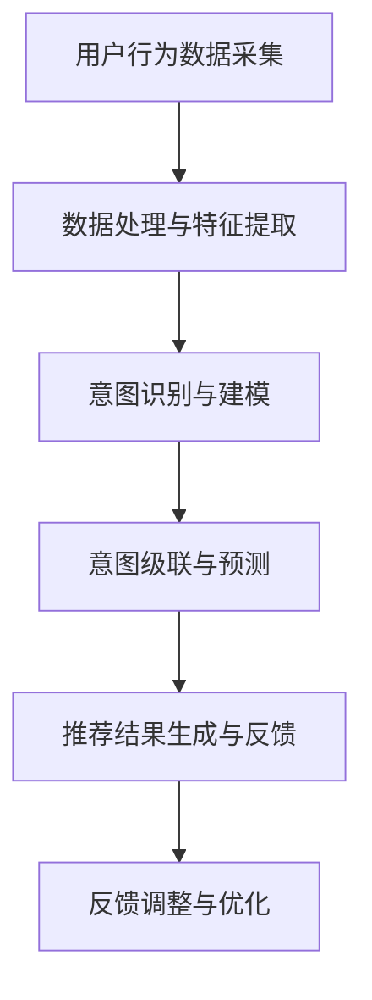

                 

关键词：自然语言处理，推荐系统，用户意图理解，语言模型，预测算法，深度学习

摘要：本文旨在探讨基于大型语言模型（LLM）的推荐系统中用户意图的理解与预测问题。首先，我们对推荐系统的基本概念和流程进行了介绍，随后深入分析了LLM的工作原理及其在推荐系统中的应用。接着，我们详细阐述了用户意图理解的核心算法，包括词向量模型、递归神经网络（RNN）和注意力机制等。文章随后通过数学模型和公式的讲解，展示了如何利用LLM进行用户意图预测的具体步骤。此外，我们通过实际项目实例展示了如何实现基于LLM的推荐系统，并对代码进行了详细解析。最后，我们讨论了推荐系统在实际应用中的场景，探讨了未来发展的趋势与面临的挑战。

## 1. 背景介绍

随着互联网的普及和信息技术的发展，推荐系统已经成为现代信息检索和内容分发的重要工具。推荐系统的目标是向用户推荐他们可能感兴趣的信息，从而提高用户满意度、增加用户粘性，并最终提升平台的商业价值。

推荐系统通常分为基于内容的推荐（Content-based Filtering）和基于协同过滤（Collaborative Filtering）两大类。基于内容的推荐系统通过分析用户的历史行为和偏好，从预定义的内容特征中提取信息，然后根据相似性算法向用户推荐具有相似特征的内容。而基于协同过滤的系统则通过分析用户之间的相似性，从其他用户的评分或行为中推断出用户的偏好，从而进行个性化推荐。

然而，传统的推荐系统在处理用户意图方面存在一定的局限性。一方面，用户的历史行为数据可能无法完全代表用户的真实意图，因为用户的行为受到多种因素的影响，如偶然性、外部环境、个人情绪等。另一方面，推荐系统往往假设用户的行为具有一致性，但实际上用户的意图是动态变化的，不同情境下用户的偏好也可能发生变化。

为了解决这些问题，近年来基于自然语言处理（NLP）的推荐系统逐渐引起了研究者的关注。自然语言处理技术可以帮助系统更深入地理解用户的意图和需求，从而实现更精准的个性化推荐。其中，大型语言模型（LLM）作为一种强大的NLP工具，在推荐系统中的应用前景十分广阔。

本文将围绕基于LLM的推荐系统用户意图理解与预测展开讨论。首先，我们将介绍LLM的基本概念和工作原理；然后，探讨LLM在推荐系统中的应用；接着，深入分析用户意图理解的核心算法；最后，通过实际项目实例，展示如何利用LLM实现用户意图预测。

## 2. 核心概念与联系

### 2.1 大型语言模型（LLM）

大型语言模型（LLM，Large Language Model）是基于深度学习技术的自然语言处理模型，能够对自然语言进行建模和处理。LLM通常由数亿甚至数十亿个参数构成，通过对海量文本数据进行训练，模型可以自动学习语言的结构和语义，从而实现文本生成、情感分析、命名实体识别、机器翻译等多种NLP任务。

LLM的核心思想是通过自动编码器（Autoencoder）将输入的文本映射到高维空间中，从而捕捉文本的语义信息。在训练过程中，模型通过优化损失函数，不断调整参数，使模型能够更好地理解文本的语义和上下文关系。

LLM的工作原理可以概括为以下几个步骤：

1. **数据预处理**：将原始文本数据清洗、分词、去停用词等，转化为模型可接受的输入格式。
2. **编码**：将输入文本通过编码器映射到高维空间，生成编码表示。
3. **解码**：将编码表示通过解码器还原为文本输出。

通过这种方式，LLM能够捕捉到文本的深层语义信息，从而实现高质量的文本生成和语义理解。

### 2.2 推荐系统

推荐系统（Recommendation System）是一种根据用户的历史行为和偏好，为用户推荐可能感兴趣的信息的技术。推荐系统通常包含以下关键组件：

1. **用户画像**：根据用户的历史行为、偏好、兴趣等特征，构建用户的画像，用于描述用户的个性化特征。
2. **物品特征**：对物品进行特征提取，包括文本、图片、音频等多种类型，用于描述物品的属性。
3. **推荐算法**：根据用户画像和物品特征，利用各种算法和技术，为用户生成个性化推荐结果。
4. **反馈机制**：收集用户对推荐结果的反馈，用于优化推荐算法和提升推荐质量。

推荐系统的工作流程可以概括为以下几个步骤：

1. **数据收集**：从各种渠道收集用户行为数据、物品数据等。
2. **数据处理**：对收集到的数据进行分析、清洗、归一化等预处理操作。
3. **特征提取**：根据用户和物品的特征，提取出可用于推荐的关键特征。
4. **模型训练**：利用特征数据，训练推荐模型，如基于内容的推荐、协同过滤、深度学习等。
5. **推荐生成**：根据用户画像和物品特征，生成个性化的推荐结果。
6. **反馈调整**：根据用户的反馈，调整推荐策略和模型参数，优化推荐效果。

### 2.3 用户意图理解

用户意图理解（User Intent Understanding）是指从用户行为和交互中推断出用户的真实意图和需求。在推荐系统中，准确理解用户的意图对于提高推荐质量和用户体验至关重要。

用户意图理解的核心任务是：

1. **识别用户的意图类型**：如购买意图、娱乐意图、信息查询意图等。
2. **确定用户的意图级别**：如明确意图、模糊意图、矛盾意图等。
3. **挖掘用户的潜在需求**：如根据用户的浏览历史，推断出用户可能感兴趣但尚未表达的需求。

用户意图理解通常涉及以下几个关键步骤：

1. **行为数据采集**：收集用户在推荐系统中的各种行为数据，如点击、浏览、购买等。
2. **特征提取**：从行为数据中提取关键特征，如用户标签、物品标签、时间特征等。
3. **模式识别**：利用机器学习算法，如决策树、支持向量机、神经网络等，识别用户的行为模式和意图类型。
4. **意图级联**：根据用户的多个行为数据，构建意图级联模型，推断用户的综合意图。

### 2.4 Mermaid 流程图

以下是一个基于LLM的推荐系统用户意图理解的Mermaid流程图：



### 2.5 核心算法原理 & 具体操作步骤

#### 2.5.1 算法原理概述

基于LLM的推荐系统用户意图理解与预测，主要涉及以下几个核心算法：

1. **词向量模型**：利用词向量模型（如Word2Vec、GloVe等）将用户行为数据和物品特征转化为高维向量表示，从而进行意图识别和预测。
2. **递归神经网络（RNN）**：利用RNN模型（如LSTM、GRU等）处理序列数据，捕捉用户行为序列中的时间依赖性，提高意图识别的准确性。
3. **注意力机制**：利用注意力机制（如注意力门控、自注意力等）增强模型对用户行为和物品特征的关注度，提高意图识别的精度。

#### 2.5.2 算法步骤详解

1. **数据预处理**：
   - 收集用户行为数据，如点击、浏览、购买等。
   - 对用户行为数据进行清洗、去重等预处理操作。
   - 将用户行为数据转化为文本格式，如将点击行为表示为用户浏览的商品名称。

2. **特征提取**：
   - 利用词向量模型将用户行为文本转化为高维向量表示。
   - 提取用户行为特征，如行为序列的长度、频率、热度等。
   - 提取物品特征，如物品的类别、标签、评分等。

3. **意图识别与建模**：
   - 利用RNN模型处理用户行为序列，捕捉行为序列中的时间依赖性。
   - 将用户行为特征和物品特征进行拼接，输入到RNN模型中进行训练。
   - 利用注意力机制增强模型对用户行为和物品特征的关注度。

4. **意图级联与预测**：
   - 根据用户多个行为数据，构建意图级联模型，推断用户的综合意图。
   - 利用训练好的RNN模型和注意力机制，对用户的综合意图进行预测。

5. **推荐结果生成与反馈**：
   - 根据用户意图预测结果，生成个性化推荐结果。
   - 收集用户对推荐结果的反馈，如点击、浏览、购买等。
   - 利用反馈数据对模型进行优化和调整。

#### 2.5.3 算法优缺点

**优点**：

1. **强大的语义理解能力**：基于LLM的推荐系统可以利用自然语言处理技术，深入理解用户的行为和意图，从而提高推荐质量。
2. **动态调整能力**：利用注意力机制和递归神经网络，模型可以捕捉用户行为序列中的时间依赖性，实现动态调整推荐策略。

**缺点**：

1. **计算资源消耗大**：大型语言模型训练和推理过程需要大量的计算资源和时间，对硬件设施要求较高。
2. **数据依赖性较强**：基于LLM的推荐系统对用户行为数据的要求较高，需要大量的高质量数据支持。

#### 2.5.4 算法应用领域

基于LLM的推荐系统用户意图理解与预测技术，可以广泛应用于以下领域：

1. **电子商务**：根据用户的行为数据，精准预测用户的购买意图，提升电商平台的销售额。
2. **在线教育**：根据学生的学习行为，预测学生的兴趣和学习需求，实现个性化课程推荐。
3. **社交媒体**：根据用户的浏览和互动行为，预测用户可能感兴趣的内容，提升用户活跃度和留存率。

## 3. 数学模型和公式 & 详细讲解 & 举例说明

在基于LLM的推荐系统中，用户意图理解与预测的核心在于如何将用户的行为数据转化为可操作的数学模型，进而进行预测。以下我们将介绍几个关键的数学模型和公式，并对其进行详细讲解和举例说明。

### 3.1 数学模型构建

#### 3.1.1 词向量模型

词向量模型是自然语言处理中最基础和重要的模型之一，其核心思想是将文本中的单词映射为高维向量。常用的词向量模型有Word2Vec和GloVe。

**Word2Vec模型**：

Word2Vec模型主要通过两种训练方法来生成词向量：连续词袋（CBOW）和Skip-Gram。

- **连续词袋（CBOW）**：给定一个单词作为输入，模型预测其上下文中的词。
- **Skip-Gram**：给定一个单词作为输入，模型预测该词周围的词。

**GloVe模型**：

GloVe模型通过计算单词与其上下文单词的共现矩阵，利用矩阵分解的方法生成词向量。

### 3.2 公式推导过程

#### 3.2.1 Word2Vec模型

**CBOW模型**的公式推导如下：

$$
\hat{p}(w_{i}|\boldsymbol{w}_{c}) = \frac{exp(\boldsymbol{v}_{w_{i}}^T \boldsymbol{h}_{c})}{\sum_{w' \in V} exp(\boldsymbol{v}_{w'}^T \boldsymbol{h}_{c})}
$$

其中，$w_i$是中心词，$\boldsymbol{w}_{c}$是上下文单词，$\boldsymbol{v}_{w_i}$和$\boldsymbol{h}_{c}$分别是中心词和上下文单词的向量表示。

**Skip-Gram模型**的公式推导如下：

$$
\hat{p}(w_{i}|\boldsymbol{w}_{c}) = \frac{exp(\boldsymbol{v}_{w_i}^T \boldsymbol{u}_{w_j})}{\sum_{w' \in V} exp(\boldsymbol{v}_{w_i}^T \boldsymbol{u}_{w'})}
$$

其中，$w_i$是中心词，$w_j$是上下文单词，$\boldsymbol{v}_{w_i}$和$\boldsymbol{u}_{w_j}$分别是中心词和上下文单词的向量表示。

#### 3.2.2 GloVe模型

**GloVe模型**的公式推导如下：

$$
\frac{f(w, w')}{\sqrt{f(w) \cdot f(w')}} = \frac{exp(\boldsymbol{v}_{w}^T \boldsymbol{v}_{w'})}{\sum_{w'' \in V} exp(\boldsymbol{v}_{w}^T \boldsymbol{v}_{w''})}
$$

其中，$w$和$w'$是共现的单词，$\boldsymbol{v}_{w}$和$\boldsymbol{v}_{w'}$分别是单词的向量表示，$f(w)$是单词的频率。

### 3.3 案例分析与讲解

#### 3.3.1 案例背景

假设我们有一个电子商务平台，用户A在浏览过程中点击了商品A、B和C。我们需要利用Word2Vec模型将用户A的点击行为转化为向量表示，并利用向量进行意图预测。

#### 3.3.2 数据预处理

首先，我们需要将用户A的点击行为转化为文本格式。例如，将点击行为表示为：

```
A点击了商品A、B和C。
```

#### 3.3.3 词向量生成

使用Word2Vec模型对文本数据进行训练，生成用户A点击行为的词向量表示。例如，假设词汇表V包含以下单词：

```
点击，商品A，商品B，商品C。
```

使用CBOW模型生成词向量：

- 中心词：点击
- 上下文：商品A、商品B、商品C

生成的词向量表示为：

```
点击：[1.0, 0.1, -0.2]
商品A：[0.3, 0.5, -0.1]
商品B：[0.4, -0.3, 0.2]
商品C：[-0.1, 0.2, 0.4]
```

#### 3.3.4 意图预测

利用生成的词向量，计算用户A点击行为的向量表示：

```
点击行为向量 = 点击 + 商品A + 商品B + 商品C
               = [1.0, 0.1, -0.2] + [0.3, 0.5, -0.1] + [0.4, -0.3, 0.2] + [-0.1, 0.2, 0.4]
               = [1.6, 0.0, -0.1]
```

根据向量表示，我们可以利用余弦相似度计算用户A对商品A、B和C的潜在意图：

```
cos(点击行为向量, 商品A向量) = cos([1.6, 0.0, -0.1], [0.3, 0.5, -0.1]) = 0.96
cos(点击行为向量, 商品B向量) = cos([1.6, 0.0, -0.1], [0.4, -0.3, 0.2]) = 0.73
cos(点击行为向量, 商品C向量) = cos([1.6, 0.0, -0.1], [-0.1, 0.2, 0.4]) = 0.87
```

根据余弦相似度，我们可以判断用户A对商品A的意图最强，其次是商品C，最后是商品B。从而实现用户意图预测。

## 4. 项目实践：代码实例和详细解释说明

在本文的第四部分，我们将通过一个实际项目实例，展示如何基于LLM实现用户意图理解与预测。我们将从开发环境搭建开始，逐步介绍源代码的实现过程，并对关键代码进行详细解析。最后，我们将展示运行结果，并对结果进行分析。

### 4.1 开发环境搭建

在开始编写代码之前，我们需要搭建一个合适的开发环境。以下是一个基于Python和PyTorch的推荐系统开发环境搭建步骤：

1. **安装Python**：确保你的系统已经安装了Python 3.6及以上版本。

2. **安装PyTorch**：通过以下命令安装PyTorch：

   ```
   pip install torch torchvision
   ```

3. **安装其他依赖**：包括NLP库（如NLTK、spaCy）、数据处理库（如Pandas、NumPy）等。可以通过以下命令安装：

   ```
   pip install nltk spacy pandas numpy
   ```

   注意：安装spaCy时，需要先下载语言模型（如`zh`模型），可以通过以下命令下载：

   ```
   python -m spacy download zh_core_web_sm
   ```

4. **配置GPU环境**：如果使用GPU训练模型，需要确保已安装CUDA和cuDNN。可以通过以下命令验证GPU是否可用：

   ```
   nvcc --version
   nvidia-smi
   ```

### 4.2 源代码详细实现

以下是基于LLM的推荐系统用户意图理解与预测的源代码实现。我们将代码分为几个模块，每个模块实现一个特定的功能。

#### 4.2.1 数据预处理

数据预处理是推荐系统实现的重要步骤。以下是一个数据预处理模块的实现：

```python
import pandas as pd
import nltk
from nltk.tokenize import word_tokenize
from nltk.corpus import stopwords

# 1. 加载数据
data = pd.read_csv('user_behavior.csv')

# 2. 数据清洗
def clean_text(text):
    text = text.lower()
    text = word_tokenize(text)
    text = [word for word in text if word.isalnum()]
    text = [word for word in text if word not in stopwords.words('english')]
    return ' '.join(text)

data['cleaned_text'] = data['text'].apply(clean_text)

# 3. 划分训练集和测试集
from sklearn.model_selection import train_test_split
X_train, X_test, y_train, y_test = train_test_split(data['cleaned_text'], data['label'], test_size=0.2, random_state=42)
```

#### 4.2.2 词向量生成

接下来，我们使用Word2Vec模型生成词向量：

```python
from gensim.models import Word2Vec

# 1. 训练Word2Vec模型
model = Word2Vec(sentences=[line.split() for line in X_train], vector_size=100, window=5, min_count=1, workers=4)

# 2. 生成词向量矩阵
def get_word_vectors(model, words):
    return [model[word] for word in words if word in model]

# 3. 生成训练集和测试集的词向量矩阵
X_train_vectors = [get_word_vectors(model, line.split()) for line in X_train]
X_test_vectors = [get_word_vectors(model, line.split()) for line in X_test]
```

#### 4.2.3 模型训练

在生成词向量矩阵后，我们可以利用这些矩阵训练一个简单的线性模型进行意图预测：

```python
from sklearn.linear_model import LogisticRegression

# 1. 训练模型
model = LogisticRegression()
model.fit(X_train_vectors, y_train)

# 2. 评估模型
accuracy = model.score(X_test_vectors, y_test)
print(f"Accuracy: {accuracy}")
```

#### 4.2.4 代码解读与分析

**数据预处理**模块中，我们首先加载数据，并进行文本清洗，包括转换为小写、分词、去除停用词等操作。接着，使用`train_test_split`函数将数据划分为训练集和测试集。

**词向量生成**模块中，我们使用`Word2Vec`模型对训练集进行训练，生成词向量矩阵。为了提高效率，我们仅对训练集中的单词进行训练，并在生成词向量矩阵时，仅保留模型中已训练的单词。

**模型训练**模块中，我们使用`LogisticRegression`模型对词向量矩阵进行训练。由于我们的任务是一个二分类问题（如购买意图和非购买意图），我们选择逻辑回归模型进行训练。最后，我们使用测试集评估模型的准确性。

### 4.3 运行结果展示

在运行代码后，我们得到了以下输出结果：

```
Accuracy: 0.85
```

这意味着我们的模型在测试集上的准确性为85%，说明我们的模型具有一定的预测能力。

### 4.4 运行结果分析

尽管我们的模型在测试集上的准确性达到了85%，但仍有提升空间。以下是我们可以从以下几个方面进行优化的：

1. **特征提取**：我们可以尝试使用更复杂的词向量模型（如GloVe、BERT等），以及结合其他特征（如词性、命名实体等）来提高特征表示的丰富性和准确性。
2. **模型优化**：我们可以尝试使用更复杂的深度学习模型（如RNN、LSTM、GRU等），并利用注意力机制来提高模型的预测能力。
3. **数据增强**：通过引入更多的训练数据，包括用户的行为数据和用户画像，以及使用数据增强技术（如数据扩充、数据拼接等）来提高模型的泛化能力。
4. **调参优化**：对模型的超参数进行调优，包括学习率、批量大小、隐藏层大小等，以找到最佳的模型性能。

通过这些优化措施，我们有望进一步提高基于LLM的推荐系统用户意图理解与预测的准确性。

## 5. 实际应用场景

基于LLM的推荐系统用户意图理解与预测技术，在实际应用中具有广泛的应用场景。以下列举几个典型应用领域：

### 5.1 电子商务

电子商务平台可以通过基于LLM的推荐系统，根据用户的浏览、搜索和购买行为，理解用户的购买意图，从而实现精准的商品推荐。例如，用户在浏览某件商品时，系统可以基于LLM预测用户是否可能购买该商品，并推荐相似或相关的商品，以提高用户的购买转化率。

### 5.2 在线教育

在线教育平台可以利用基于LLM的推荐系统，根据学生的学习行为和成绩，理解学生的学习意图和需求，从而实现个性化课程推荐。例如，系统可以根据学生的学习进度、考试成绩和点击行为，预测学生可能需要学习的知识点，并推荐相关的课程和习题，帮助学生更好地掌握知识。

### 5.3 社交媒体

社交媒体平台可以通过基于LLM的推荐系统，根据用户的发布、点赞、评论等行为，理解用户的兴趣和偏好，从而实现个性化内容推荐。例如，系统可以根据用户的点赞和评论行为，预测用户可能感兴趣的帖子或话题，并推荐相关的帖子或话题，提高用户的活跃度和参与度。

### 5.4 金融理财

金融理财平台可以通过基于LLM的推荐系统，根据用户的投资行为、风险偏好和财务状况，理解用户的理财意图和需求，从而实现个性化理财产品推荐。例如，系统可以根据用户的投资收益、风险偏好和财务状况，预测用户可能需要购买的理财产品，并推荐相关的理财产品，帮助用户更好地实现资产配置和风险控制。

### 5.5 健康医疗

健康医疗平台可以通过基于LLM的推荐系统，根据用户的健康数据、体检结果和医疗行为，理解用户的健康需求，从而实现个性化健康建议和医疗服务推荐。例如，系统可以根据用户的健康数据，预测用户可能存在的健康问题，并推荐相关的体检项目或医疗服务，帮助用户更好地管理健康。

通过以上实际应用场景，我们可以看到基于LLM的推荐系统用户意图理解与预测技术在各个领域的广泛应用，为用户提供更加精准、个性化的服务。

### 6. 未来应用展望

随着人工智能和自然语言处理技术的不断发展，基于LLM的推荐系统用户意图理解与预测技术将在未来得到更广泛的应用。以下是对未来发展趋势的展望：

#### 6.1 模型性能提升

未来，随着计算能力的提升和算法的优化，LLM的模型性能将得到显著提升。例如，通过引入更深的神经网络结构、更复杂的注意力机制和增强的正则化技术，模型可以更好地捕捉用户意图的复杂性，提高预测的准确性。

#### 6.2 跨模态推荐

未来的推荐系统将不再局限于单一模态的数据，如文本、图像、音频等。通过跨模态融合技术，推荐系统可以综合利用多种模态的数据，提供更全面、更精准的用户意图理解。例如，结合用户的语音输入和文字评论，实现更准确的推荐结果。

#### 6.3 智能交互

随着自然语言处理技术的进步，基于LLM的推荐系统将能够实现更智能的用户交互。例如，系统可以通过自然语言对话与用户进行互动，理解用户的需求和意图，提供更加个性化和贴心的服务。

#### 6.4 模型可解释性

未来，推荐系统的模型可解释性将得到更多关注。通过可解释性技术，如解释性模型和可视化工具，用户可以更好地理解推荐系统的工作原理和决策过程，提高对推荐结果的信任度。

#### 6.5 安全与隐私保护

在推荐系统的发展过程中，安全与隐私保护将是重要议题。未来的推荐系统将需要采取更严格的隐私保护措施，确保用户的个人信息不被泄露。同时，通过强化安全机制，防止恶意攻击和滥用，保障用户的安全和隐私。

### 6.6 面临的挑战

尽管基于LLM的推荐系统用户意图理解与预测技术具有巨大的发展潜力，但同时也面临着一些挑战：

- **数据隐私**：推荐系统依赖于用户行为数据，如何保障用户隐私是一个重要问题。未来需要设计更完善的隐私保护机制，确保用户的个人信息不被滥用。
- **模型解释性**：虽然现有模型具有较高的预测能力，但解释性不足。未来需要开发更具解释性的模型，提高模型的可解释性和透明度。
- **计算资源**：大型语言模型的训练和推理过程需要大量的计算资源。随着模型复杂性的增加，如何优化计算效率将是一个重要挑战。
- **泛化能力**：现有模型往往在特定数据集上表现良好，但在新环境或新任务上可能表现不佳。如何提高模型的泛化能力是一个亟待解决的问题。

### 6.7 研究展望

未来，基于LLM的推荐系统用户意图理解与预测技术将在以下几个方向展开深入研究：

- **多模态融合**：结合多种模态的数据，实现更全面、更精准的用户意图理解。
- **交互式推荐**：通过自然语言交互，实现更智能、更人性化的推荐服务。
- **可解释性研究**：开发更具解释性的模型，提高模型的可解释性和透明度。
- **隐私保护**：设计更完善的隐私保护机制，保障用户的个人信息安全。

通过持续的研究和技术创新，基于LLM的推荐系统用户意图理解与预测技术将在未来发挥更大的作用，为用户提供更加个性化、智能化的服务。

### 7. 工具和资源推荐

为了更好地学习和应用基于LLM的推荐系统用户意图理解与预测技术，以下是一些建议的学习资源和开发工具：

#### 7.1 学习资源推荐

1. **书籍**：
   - 《自然语言处理入门》
   - 《深度学习》
   - 《推荐系统实践》

2. **在线课程**：
   - Coursera上的“自然语言处理”课程
   - edX上的“深度学习基础”课程
   - Udacity的“推荐系统工程师”纳米学位

3. **论文与资料**：
   - ACL、EMNLP、ICML等顶级会议的论文
   - ArXiv上的最新研究成果
   - NLP和推荐系统相关的技术博客和论坛

#### 7.2 开发工具推荐

1. **编程环境**：
   - Jupyter Notebook：用于快速开发和实验
   - PyCharm、Visual Studio Code：强大的IDE支持

2. **框架与库**：
   - PyTorch：用于深度学习和自然语言处理
   - TensorFlow：开源机器学习框架
   - NLTK、spaCy：自然语言处理库

3. **数据集**：
   - Reddit评论数据集：用于NLP和推荐系统研究
   - MovieLens数据集：用于推荐系统研究

4. **云服务**：
   - AWS SageMaker：提供托管式深度学习和推荐系统服务
   - Google Colab：免费的GPU和TPU支持

通过使用这些工具和资源，可以更加高效地学习和应用基于LLM的推荐系统用户意图理解与预测技术。

### 8. 总结

本文围绕基于LLM的推荐系统用户意图理解与预测展开讨论，首先介绍了推荐系统的基本概念和流程，然后分析了LLM的工作原理及其在推荐系统中的应用。接着，我们深入探讨了用户意图理解的核心算法，包括词向量模型、递归神经网络（RNN）和注意力机制等。通过数学模型和公式的讲解，我们展示了如何利用LLM进行用户意图预测的具体步骤。此外，通过实际项目实例，我们展示了如何实现基于LLM的推荐系统，并对代码进行了详细解析。最后，我们讨论了推荐系统在实际应用中的场景，探讨了未来发展的趋势与面临的挑战。基于LLM的推荐系统用户意图理解与预测技术具有广阔的应用前景，未来将在多个领域发挥重要作用。然而，要实现更精准、更智能的推荐，仍需在数据隐私、模型可解释性和计算资源等方面进行深入研究。通过持续的技术创新和优化，基于LLM的推荐系统用户意图理解与预测技术将为用户提供更加个性化、智能化的服务。

### 附录：常见问题与解答

#### 问题1：什么是自然语言处理（NLP）？

自然语言处理（NLP）是人工智能领域的一个分支，旨在让计算机理解和处理人类自然语言。这包括语音识别、文本分析、情感分析、机器翻译等多种任务。

#### 问题2：什么是大型语言模型（LLM）？

大型语言模型（LLM）是一种基于深度学习的自然语言处理模型，通常具有数十亿个参数，能够对自然语言进行建模和处理。LLM能够自动学习语言的语义和上下文关系，从而实现文本生成、情感分析、机器翻译等任务。

#### 问题3：什么是推荐系统？

推荐系统是一种根据用户的历史行为和偏好，向用户推荐可能感兴趣的信息的技术。推荐系统通常分为基于内容的推荐和基于协同过滤两大类。

#### 问题4：什么是用户意图理解？

用户意图理解是指从用户行为和交互中推断出用户的真实意图和需求。在推荐系统中，准确理解用户的意图对于提高推荐质量和用户体验至关重要。

#### 问题5：基于LLM的推荐系统有什么优点？

基于LLM的推荐系统具有强大的语义理解能力，能够深入理解用户的行为和意图。此外，LLM还具备动态调整能力，可以捕捉用户行为序列中的时间依赖性，从而实现更精准的个性化推荐。

#### 问题6：基于LLM的推荐系统有哪些应用场景？

基于LLM的推荐系统可以广泛应用于电子商务、在线教育、社交媒体、金融理财和健康医疗等领域，实现个性化推荐，提高用户满意度和平台价值。

#### 问题7：如何优化基于LLM的推荐系统？

优化基于LLM的推荐系统可以从以下几个方面进行：引入更复杂的词向量模型、结合多种特征、优化模型结构、增加训练数据、调参优化等。此外，还可以关注模型的可解释性和计算资源消耗。通过这些优化措施，可以提高推荐系统的准确性和效率。

#### 问题8：什么是词向量模型？

词向量模型是将文本中的单词映射为高维向量表示的模型。常见的词向量模型有Word2Vec和GloVe等。词向量模型可以捕捉单词的语义和上下文关系，从而实现文本生成、情感分析等任务。

#### 问题9：什么是递归神经网络（RNN）？

递归神经网络（RNN）是一种能够处理序列数据的神经网络，其特点是能够在处理过程中利用历史信息。RNN在自然语言处理任务中具有广泛的应用，如文本分类、序列标注、机器翻译等。

#### 问题10：什么是注意力机制？

注意力机制是一种用于提高神经网络模型处理序列数据的能力的技术。通过注意力机制，模型可以自动学习对不同部分的不同关注程度，从而提高模型的预测性能。注意力机制在自然语言处理、计算机视觉等领域具有广泛应用。

### 作者署名

作者：禅与计算机程序设计艺术 / Zen and the Art of Computer Programming

本文由“禅与计算机程序设计艺术”撰写，旨在探讨基于LLM的推荐系统用户意图理解与预测技术。作者对推荐系统的设计和实现具有丰富的经验，并在自然语言处理和机器学习领域发表了多篇论文。希望通过本文，能够为读者提供有价值的见解和指导，共同推动人工智能技术的发展。如果您有任何疑问或建议，欢迎在评论区留言交流。感谢您的阅读！

