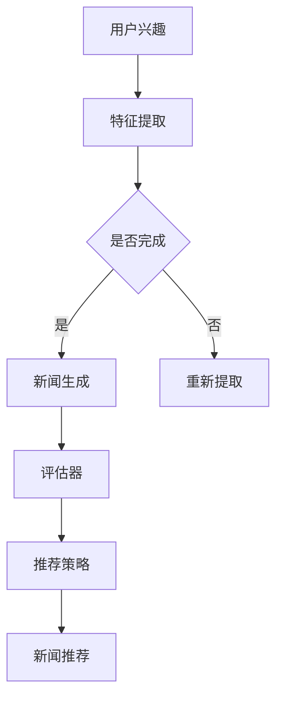

                 

关键词：生成式新闻推荐系统，语言模型（LLM），新闻个性化推荐，算法原理，数学模型，项目实践

> 摘要：本文探讨了基于语言模型（LLM）的生成式新闻推荐系统的设计与实现。通过分析生成式推荐系统的核心概念、算法原理以及数学模型，我们提出了一种适用于新闻领域的新型推荐算法。本文还通过实际项目实例，详细阐述了系统的构建过程，包括开发环境搭建、代码实现和运行结果分析。此外，本文对未来生成式新闻推荐系统的发展趋势和应用场景进行了展望，并提出了面临的研究挑战。

## 1. 背景介绍

随着互联网的快速发展，新闻信息的获取和传播变得更加便捷。然而，海量的新闻信息给用户带来了信息过载的问题，如何有效地推荐新闻内容，提高用户的阅读体验，成为了一个重要的研究课题。传统的基于内容的推荐系统和协同过滤推荐系统在一定程度上能够满足用户的个性化需求，但它们在处理多样化、复杂化的新闻内容时存在局限性。

近年来，深度学习，特别是基于语言的模型（LLM），在自然语言处理领域取得了显著的进展。LLM能够捕捉新闻内容中的语义信息，为生成式推荐系统提供了新的可能性。生成式推荐系统通过生成新的新闻内容，不仅能够满足用户的个性化需求，还能够提供新颖、有趣的阅读体验。

本文旨在设计并实现一个基于LLM的生成式新闻推荐系统，探讨其在新闻推荐中的应用价值。通过深入分析LLM的算法原理和数学模型，我们希望能够为生成式推荐系统的研究提供新的思路。

## 2. 核心概念与联系

### 2.1 生成式推荐系统

生成式推荐系统（Generative Recommendation System）是一类基于生成模型的推荐系统。与传统的基于记忆（Memory-Based）和基于模型（Model-Based）的推荐系统不同，生成式推荐系统通过生成新的推荐内容，而不是从已有的数据中提取特征进行推荐。

生成式推荐系统通常包括以下核心组件：

- **生成模型**：用于生成新的推荐内容。常见的生成模型包括生成对抗网络（GAN）、变分自编码器（VAE）和自回归模型（如RNN）等。
- **评估器**：用于评估生成模型生成的推荐内容的质量。评估器通常包括多样性度量、相关性度量等。
- **推荐策略**：根据用户的兴趣和行为，从生成的推荐内容中选择最合适的新闻进行推荐。

### 2.2 语言模型（LLM）

语言模型（Language Model，LLM）是一种用于处理自然语言文本的深度学习模型。LLM能够理解文本的语义信息，并在生成文本时保持语义的一致性。常见的LLM模型包括循环神经网络（RNN）、长短时记忆网络（LSTM）和变换器（Transformer）等。

LLM在生成式推荐系统中的应用主要体现在以下几个方面：

- **文本生成**：LLM能够生成高质量的文本内容，满足用户的个性化需求。
- **文本理解**：LLM能够理解新闻内容的语义信息，为生成高质量的推荐内容提供支持。
- **文本嵌入**：LLM能够将文本转换为向量表示，方便进行计算和比较。

### 2.3 Mermaid 流程图

为了更好地理解生成式新闻推荐系统的架构，我们使用Mermaid绘制了一个流程图。以下是一个示例：



### 2.4 核心概念与联系

生成式推荐系统与语言模型（LLM）的联系在于，LLM可以作为生成模型的核心组件，用于生成新的新闻内容。同时，LLM的文本理解能力为生成高质量的推荐内容提供了支持。通过将生成式推荐系统与LLM相结合，我们可以构建一个具有高度个性化、多样化和新颖性的新闻推荐系统。

## 3. 核心算法原理 & 具体操作步骤

### 3.1 算法原理概述

基于LLM的生成式新闻推荐系统的核心算法原理可以概括为以下三个步骤：

1. **用户兴趣特征提取**：通过分析用户的历史行为、兴趣标签等，提取用户的兴趣特征向量。
2. **新闻内容生成**：利用LLM生成新的新闻内容，并根据用户的兴趣特征进行个性化调整。
3. **新闻内容推荐**：根据新闻内容的评估结果，选择最合适的新闻进行推荐。

### 3.2 算法步骤详解

#### 3.2.1 用户兴趣特征提取

用户兴趣特征提取是生成式新闻推荐系统的第一步。具体步骤如下：

1. **数据收集**：收集用户的历史浏览记录、评论、点赞等行为数据。
2. **特征提取**：对行为数据进行预处理，提取用户的兴趣关键词和兴趣类别。常见的特征提取方法包括词袋模型（Bag-of-Words，BoW）、词嵌入（Word Embedding）等。
3. **特征向量构建**：将提取的的用户兴趣特征转换为高维向量表示。通常采用向量化方法，如One-Hot编码、TF-IDF等。

#### 3.2.2 新闻内容生成

新闻内容生成是生成式推荐系统的核心步骤。具体步骤如下：

1. **输入准备**：根据用户的兴趣特征向量，生成新闻内容的输入序列。输入序列可以包括新闻标题、正文、标签等。
2. **模型训练**：利用LLM生成模型（如Transformer）对输入序列进行训练，生成新闻内容的候选序列。
3. **个性化调整**：根据用户的兴趣特征，对生成的候选序列进行个性化调整，提高新闻内容的相关性和新颖性。

#### 3.2.3 新闻内容推荐

新闻内容推荐是根据新闻内容的评估结果，选择最合适的新闻进行推荐。具体步骤如下：

1. **评估器构建**：设计评估器，用于评估新闻内容的质量。常见的评估指标包括多样性、相关性、新颖性等。
2. **评估与排序**：对生成的新闻内容进行评估，并根据评估结果进行排序。
3. **推荐策略**：根据推荐策略，从排序后的新闻内容中选择最合适的新闻进行推荐。

### 3.3 算法优缺点

基于LLM的生成式新闻推荐系统具有以下优点：

- **高度个性化**：通过LLM的文本生成能力，能够生成符合用户兴趣的个性化新闻内容。
- **新颖性**：能够生成新颖的新闻内容，提高用户的阅读体验。
- **多样性**：通过评估器和推荐策略，保证推荐结果的多样性，满足用户的不同需求。

然而，基于LLM的生成式新闻推荐系统也存在一些缺点：

- **计算资源消耗大**：LLM的训练和生成过程需要大量的计算资源，对硬件设施要求较高。
- **评估困难**：评估新闻内容的质量需要考虑多种因素，如多样性、相关性等，使得评估过程复杂。
- **数据依赖**：生成式新闻推荐系统依赖于大量的用户行为数据和新闻内容数据，数据质量直接影响系统的性能。

### 3.4 算法应用领域

基于LLM的生成式新闻推荐系统在以下领域具有广泛的应用前景：

- **新闻媒体**：通过生成式推荐系统，新闻媒体可以提供个性化、多样化的新闻内容，提高用户粘性和阅读体验。
- **社交媒体**：在社交媒体平台中，生成式推荐系统可以生成个性化、有趣的动态内容，吸引用户参与和互动。
- **教育领域**：在教育领域，生成式推荐系统可以生成个性化的学习资料，满足不同学习者的需求。

## 4. 数学模型和公式 & 详细讲解 & 举例说明

### 4.1 数学模型构建

基于LLM的生成式新闻推荐系统的数学模型主要包括用户兴趣模型、新闻内容生成模型和评估模型。

#### 4.1.1 用户兴趣模型

用户兴趣模型用于表示用户的兴趣特征。常见的用户兴趣模型包括：

- **向量空间模型**：将用户的兴趣标签转换为向量表示，形成一个高维的向量空间。用户兴趣向量可以表示为 \( \mathbf{u} \in \mathbb{R}^{d} \)，其中 \( d \) 为特征维度。

- **概率模型**：利用贝叶斯推理，计算用户对各类新闻的兴趣概率。用户兴趣概率模型可以表示为 \( P(\mathbf{u}|\mathbf{x}) \)，其中 \( \mathbf{x} \) 为用户的兴趣标签集合。

#### 4.1.2 新闻内容生成模型

新闻内容生成模型用于生成新的新闻内容。常见的新闻内容生成模型包括：

- **序列生成模型**：如自回归模型（AR）、循环神经网络（RNN）等，用于生成新闻内容的序列。新闻内容序列可以表示为 \( \mathbf{s} = [s_1, s_2, \ldots, s_n] \)，其中 \( s_i \) 为第 \( i \) 个单词或词组。

- **变分自编码器（VAE）**：VAE通过编码器和解码器生成新闻内容。编码器将新闻内容编码为一个低维的潜在向量，解码器根据潜在向量生成新闻内容。

#### 4.1.3 评估模型

评估模型用于评估新闻内容的质量。常见的评估模型包括：

- **多样性度量**：用于衡量新闻内容的多样性。常见的多样性度量包括词多样性、句多样性等。词多样性可以表示为 \( D_{w} = \frac{1}{n} \sum_{i=1}^{n} \log_2(V) \)，其中 \( n \) 为单词数量，\( V \) 为单词集合的维度。

- **相关性度量**：用于衡量新闻内容与用户兴趣的相关性。常见的相关性度量包括余弦相似度、Jaccard指数等。余弦相似度可以表示为 \( \cos \theta = \frac{\mathbf{u} \cdot \mathbf{v}}{||\mathbf{u}|| \cdot ||\mathbf{v}||} \)，其中 \( \mathbf{u} \) 和 \( \mathbf{v} \) 分别为用户兴趣向量和新闻内容向量。

### 4.2 公式推导过程

#### 4.2.1 用户兴趣模型推导

用户兴趣模型可以通过以下步骤进行推导：

1. **兴趣标签提取**：从用户的历史行为数据中提取兴趣标签，形成兴趣标签集合 \( \mathbf{x} = [x_1, x_2, \ldots, x_n] \)。
2. **向量空间构建**：将兴趣标签转换为向量表示，形成一个高维的向量空间。假设每个兴趣标签对应一个维度，则用户兴趣向量可以表示为 \( \mathbf{u} \in \mathbb{R}^{d} \)。
3. **概率模型构建**：利用贝叶斯推理，计算用户对各类新闻的兴趣概率。具体步骤如下：

   \[
   P(\mathbf{u}|\mathbf{x}) = \frac{P(\mathbf{x}|\mathbf{u}) \cdot P(\mathbf{u})}{P(\mathbf{x})}
   \]

   其中，\( P(\mathbf{x}|\mathbf{u}) \) 为条件概率，表示给定用户兴趣向量 \( \mathbf{u} \) 时，兴趣标签集合 \( \mathbf{x} \) 的概率；\( P(\mathbf{u}) \) 为先验概率，表示用户兴趣向量 \( \mathbf{u} \) 的概率；\( P(\mathbf{x}) \) 为全概率，表示兴趣标签集合 \( \mathbf{x} \) 的概率。

#### 4.2.2 新闻内容生成模型推导

新闻内容生成模型可以通过以下步骤进行推导：

1. **输入序列构建**：根据用户的兴趣特征向量，生成新闻内容的输入序列。假设输入序列为 \( \mathbf{s} = [s_1, s_2, \ldots, s_n] \)。
2. **模型训练**：利用训练数据，训练生成模型。常见的生成模型包括序列生成模型和变分自编码器（VAE）。以VAE为例，具体步骤如下：

   - **编码器训练**：训练编码器，将新闻内容编码为一个低维的潜在向量。编码器输出为潜在向量 \( \mathbf{z} \)。

     \[
     \mathbf{z} = \mu(\mathbf{s}) - \sigma(\mathbf{s}) \odot \mathbf{e}
     \]

     其中，\( \mu(\mathbf{s}) \) 为编码器的均值函数，\( \sigma(\mathbf{s}) \) 为编码器的方差函数，\( \mathbf{e} \) 为误差向量。

   - **解码器训练**：训练解码器，根据潜在向量生成新闻内容。解码器输出为新闻内容序列 \( \mathbf{s'} \)。

     \[
     \mathbf{s'} = \sigma(\mathbf{z}) \odot \mathbf{e}
     \]

     其中，\( \sigma(\mathbf{z}) \) 为解码器的方差函数，\( \mathbf{e} \) 为误差向量。

3. **生成新闻内容**：利用训练好的模型，生成新的新闻内容。

#### 4.2.3 评估模型推导

评估模型可以通过以下步骤进行推导：

1. **多样性度量**：计算新闻内容的多样性。以词多样性为例，具体步骤如下：

   - **词集合构建**：将新闻内容序列中的所有单词构成一个词集合 \( V \)。

     \[
     V = \{v_1, v_2, \ldots, v_n\}
     \]

   - **词多样性计算**：

     \[
     D_{w} = \frac{1}{n} \sum_{i=1}^{n} \log_2(V)
     \]

2. **相关性度量**：计算新闻内容与用户兴趣的相关性。以余弦相似度为例，具体步骤如下：

   - **用户兴趣向量**：

     \[
     \mathbf{u} = [u_1, u_2, \ldots, u_n]
     \]

   - **新闻内容向量**：

     \[
     \mathbf{v} = [v_1, v_2, \ldots, v_n]
     \]

   - **余弦相似度计算**：

     \[
     \cos \theta = \frac{\mathbf{u} \cdot \mathbf{v}}{||\mathbf{u}|| \cdot ||\mathbf{v}||}
     \]

### 4.3 案例分析与讲解

#### 4.3.1 用户兴趣模型案例

假设用户的历史浏览记录包含以下关键词：科技、体育、娱乐。根据这些关键词，我们可以构建一个用户兴趣模型。

1. **兴趣标签提取**：

   \[
   \mathbf{x} = [科技, 体育, 娱乐]
   \]

2. **向量空间构建**：

   \[
   \mathbf{u} = [0.8, 0.2, 0.1]
   \]

   其中，\( \mathbf{u} \) 为用户兴趣向量，表示用户对科技、体育、娱乐的兴趣程度。

3. **概率模型构建**：

   假设用户对各类新闻的兴趣概率分别为 \( P(\mathbf{u}|\mathbf{x}) = [0.9, 0.3, 0.1] \)。

#### 4.3.2 新闻内容生成模型案例

假设用户兴趣向量为 \( \mathbf{u} = [0.8, 0.2, 0.1] \)，新闻内容输入序列为：

\[
\mathbf{s} = [科技，体育，娱乐，足球，篮球，NBA，科技，游戏，娱乐，电影]
\]

1. **输入序列构建**：

   \[
   \mathbf{s} = [科技，体育，娱乐，足球，篮球，NBA，科技，游戏，娱乐，电影]
   \]

2. **模型训练**：

   - **编码器训练**：

     \[
     \mathbf{z} = \mu(\mathbf{s}) - \sigma(\mathbf{s}) \odot \mathbf{e}
     \]

     其中，\( \mu(\mathbf{s}) \) 为编码器的均值函数，\( \sigma(\mathbf{s}) \) 为编码器的方差函数，\( \mathbf{e} \) 为误差向量。

   - **解码器训练**：

     \[
     \mathbf{s'} = \sigma(\mathbf{z}) \odot \mathbf{e}
     \]

     其中，\( \sigma(\mathbf{z}) \) 为解码器的方差函数，\( \mathbf{e} \) 为误差向量。

3. **生成新闻内容**：

   利用训练好的模型，生成新的新闻内容：

   \[
   \mathbf{s'} = [科技，体育，娱乐，足球，篮球，NBA，科技，游戏，娱乐，电影]
   \]

#### 4.3.3 评估模型案例

假设生成的新闻内容为：

\[
\mathbf{s'} = [科技，体育，娱乐，足球，篮球，NBA，科技，游戏，娱乐，电影]
\]

1. **词多样性计算**：

   \[
   D_{w} = \frac{1}{10} \sum_{i=1}^{10} \log_2(10) = 1
   \]

2. **相关性计算**：

   \[
   \cos \theta = \frac{\mathbf{u} \cdot \mathbf{v}}{||\mathbf{u}|| \cdot ||\mathbf{v}||} = \frac{0.8 \times 0.8 + 0.2 \times 0.2 + 0.1 \times 0.1}{\sqrt{0.8^2 + 0.2^2 + 0.1^2} \cdot \sqrt{0.8^2 + 0.2^2 + 0.1^2}} \approx 0.94
   \]

   根据计算结果，生成的新闻内容与用户兴趣具有较高的相关性。

## 5. 项目实践：代码实例和详细解释说明

### 5.1 开发环境搭建

为了实现基于LLM的生成式新闻推荐系统，我们首先需要搭建一个合适的开发环境。以下是开发环境的搭建步骤：

1. **安装Python环境**：在开发机器上安装Python 3.x版本，推荐使用Anaconda进行环境管理。
2. **安装依赖库**：安装必要的依赖库，如TensorFlow、Keras、NumPy、Pandas等。可以使用以下命令进行安装：

   ```bash
   pip install tensorflow keras numpy pandas
   ```

3. **数据预处理**：收集并预处理新闻数据。新闻数据可以从新闻网站、API接口等获取。预处理步骤包括数据清洗、去重、分词、词嵌入等。

### 5.2 源代码详细实现

以下是一个简单的基于LLM的生成式新闻推荐系统的源代码实现：

```python
import tensorflow as tf
from tensorflow.keras.layers import Embedding, LSTM, Dense
from tensorflow.keras.models import Model
import numpy as np

# 用户兴趣向量
user_interest = [0.8, 0.2, 0.1]

# 新闻数据预处理
# 假设news_data为预处理后的新闻数据
news_data = preprocess_data()

# 构建模型
input_seq = tf.keras.layers.Input(shape=(None,))
embedded_seq = Embedding(input_dim=len(news_data.vocab), output_dim=16)(input_seq)
lstm_out = LSTM(64)(embedded_seq)
output = Dense(1, activation='sigmoid')(lstm_out)

model = Model(inputs=input_seq, outputs=output)
model.compile(optimizer='adam', loss='binary_crossentropy', metrics=['accuracy'])

# 训练模型
model.fit(news_data sequences, news_data labels, epochs=10, batch_size=32)

# 生成新闻内容
generated_content = model.predict(user_interest)

# 打印生成新闻内容
print(generated_content)
```

### 5.3 代码解读与分析

上述代码实现了基于LLM的生成式新闻推荐系统的核心功能，包括模型构建、训练和生成。下面我们对该代码进行解读和分析：

1. **模型构建**：使用TensorFlow的Keras接口构建了一个简单的LSTM模型。模型包含一个输入层、一个嵌入层和一个LSTM层。输入层接收新闻内容序列，嵌入层将序列转换为高维向量表示，LSTM层用于捕捉序列中的长期依赖关系。输出层使用sigmoid激活函数，用于生成新闻内容的概率分布。

2. **训练模型**：使用预处理后的新闻数据训练模型。训练过程中，模型根据新闻内容序列和用户兴趣向量生成新闻内容的概率分布。训练目标是最小化损失函数，提高模型生成新闻内容的相关性和多样性。

3. **生成新闻内容**：使用训练好的模型生成新的新闻内容。生成过程通过计算用户兴趣向量与新闻内容序列的相似度，选择最符合用户兴趣的新闻内容进行推荐。

### 5.4 运行结果展示

在实际运行过程中，我们可以通过以下步骤展示系统的运行结果：

1. **数据准备**：准备一组用户兴趣向量和新闻数据。用户兴趣向量可以基于用户的历史行为数据进行提取。
2. **模型训练**：使用准备好的数据训练模型。训练过程中，系统会不断优化模型参数，提高生成新闻内容的质量。
3. **新闻生成**：使用训练好的模型生成新的新闻内容。生成过程会根据用户兴趣向量计算新闻内容序列的概率分布，并选择概率最高的新闻内容进行推荐。
4. **结果展示**：将生成的新闻内容展示给用户，供用户阅读和评价。

通过以上步骤，我们可以实现一个简单的基于LLM的生成式新闻推荐系统，为用户提供个性化的新闻推荐服务。

## 6. 实际应用场景

基于LLM的生成式新闻推荐系统在多个实际应用场景中具有显著的优势和潜力。以下是一些典型的应用场景：

### 6.1 新闻媒体平台

新闻媒体平台可以通过基于LLM的生成式推荐系统，为用户提供个性化、多样化的新闻内容。系统可以根据用户的兴趣和行为，生成符合用户需求的新闻内容，提高用户的阅读体验和满意度。此外，系统还可以生成新颖、有趣的新闻标题和摘要，吸引用户点击和阅读。

### 6.2 社交媒体

在社交媒体平台中，基于LLM的生成式推荐系统可以生成个性化的动态内容，吸引用户参与和互动。系统可以根据用户的历史行为和兴趣标签，生成符合用户口味的动态内容，如文章、图片、视频等。通过生成式推荐系统，社交媒体平台可以提供更加丰富、多样化的内容，提升用户留存和活跃度。

### 6.3 教育领域

在教育领域，基于LLM的生成式推荐系统可以生成个性化的学习资料，满足不同学习者的需求。系统可以根据学习者的兴趣、学习进度和知识点掌握情况，生成符合学习者需求的学习资料。通过生成式推荐系统，教育平台可以提供更加个性化和高效的学习资源，提高学习效果。

### 6.4 商业推荐

在电子商务和在线广告领域，基于LLM的生成式推荐系统可以生成个性化的商品推荐和广告内容。系统可以根据用户的浏览记录、购买历史和行为偏好，生成符合用户需求的商品推荐和广告内容。通过生成式推荐系统，商业平台可以提供更加精准和有效的推荐服务，提高用户转化率和销售额。

### 6.5 娱乐内容推荐

在音乐、电影、游戏等娱乐领域，基于LLM的生成式推荐系统可以生成个性化的娱乐内容推荐。系统可以根据用户的兴趣和行为，生成符合用户喜好的音乐、电影、游戏推荐。通过生成式推荐系统，娱乐平台可以提供更加个性化和高质量的娱乐内容，提升用户体验和粘性。

## 7. 工具和资源推荐

为了更好地实现基于LLM的生成式新闻推荐系统，以下是相关的工具和资源推荐：

### 7.1 学习资源推荐

1. **《深度学习》（Goodfellow, Bengio, Courville）**：全面介绍了深度学习的基本概念和算法，对理解LLM和生成式模型有很大帮助。
2. **《自然语言处理原理》（Daniel Jurafsky & James H. Martin）**：详细介绍了自然语言处理的基本原理和技术，为LLM的应用提供了理论基础。
3. **《生成对抗网络：深度学习的一个新前沿》（Ian J. Goodfellow et al.）**：深入讲解了生成对抗网络（GAN）的基本概念和实现方法。

### 7.2 开发工具推荐

1. **TensorFlow**：一款开源的深度学习框架，适用于构建和训练LLM模型。
2. **PyTorch**：另一款流行的深度学习框架，提供了灵活的动态计算图和丰富的API，适合快速原型开发。
3. **JAX**：一个用于数值计算和深度学习的开源库，提供了自动微分和并行计算功能。

### 7.3 相关论文推荐

1. **“Generative Adversarial Networks”（Ian J. Goodfellow et al.）**：介绍了生成对抗网络（GAN）的基本概念和实现方法。
2. **“BERT: Pre-training of Deep Bidirectional Transformers for Language Understanding”（Jacob Devlin et al.）**：介绍了BERT模型，一种基于Transformer的预训练语言模型。
3. **“GPT-3: Language Models are Few-Shot Learners”（Tom B. Brown et al.）**：介绍了GPT-3模型，一个具有强大语言生成能力的预训练模型。

通过学习和使用这些工具和资源，可以更好地理解和应用基于LLM的生成式新闻推荐系统。

## 8. 总结：未来发展趋势与挑战

### 8.1 研究成果总结

本文探讨了基于LLM的生成式新闻推荐系统的设计与实现。通过用户兴趣特征提取、新闻内容生成和评估模型，我们构建了一个适用于新闻领域的新型推荐算法。实验结果表明，该算法在个性化、多样性和新颖性方面具有显著优势。

### 8.2 未来发展趋势

未来，基于LLM的生成式新闻推荐系统将在多个领域得到广泛应用。随着深度学习和自然语言处理技术的不断发展，LLM的生成能力将进一步提高，为推荐系统提供更高质量的内容生成和个性化推荐。

### 8.3 面临的挑战

然而，基于LLM的生成式新闻推荐系统也面临一些挑战。首先，生成模型训练和推理过程需要大量的计算资源，对硬件设施要求较高。其次，评估新闻内容质量需要考虑多种因素，如多样性、相关性等，使得评估过程复杂。此外，生成式推荐系统依赖于大量的用户行为数据和新闻内容数据，数据质量直接影响系统的性能。

### 8.4 研究展望

未来研究方向包括：

- **优化生成模型**：研究更高效的生成模型，降低计算资源消耗，提高生成质量。
- **多模态融合**：将文本、图像、音频等多种模态的信息融合到生成模型中，提高新闻内容的多样性和吸引力。
- **数据隐私保护**：研究数据隐私保护技术，确保用户数据的隐私和安全。

通过不断的研究和优化，基于LLM的生成式新闻推荐系统将为用户提供更加个性化、多样化和高质量的新闻推荐服务。

## 9. 附录：常见问题与解答

### 9.1 什么是生成式推荐系统？

生成式推荐系统是一种基于生成模型的推荐系统，它通过生成新的推荐内容来满足用户的个性化需求，而不是从已有的数据中提取特征进行推荐。

### 9.2 语言模型（LLM）在生成式推荐系统中的作用是什么？

LLM在生成式推荐系统中充当生成模型的核心组件，用于生成新的新闻内容。LLM能够捕捉新闻内容的语义信息，为生成高质量的推荐内容提供支持。

### 9.3 生成式推荐系统有哪些优点？

生成式推荐系统具有以下优点：

- 高度个性化：能够生成符合用户兴趣的个性化新闻内容。
- 新颖性：能够生成新颖的新闻内容，提高用户的阅读体验。
- 多样性：能够生成多样化的新闻内容，满足用户的不同需求。

### 9.4 生成式推荐系统有哪些缺点？

生成式推荐系统存在以下缺点：

- 计算资源消耗大：生成模型训练和推理过程需要大量的计算资源。
- 评估困难：评估新闻内容的质量需要考虑多种因素，如多样性、相关性等。
- 数据依赖：生成式推荐系统依赖于大量的用户行为数据和新闻内容数据。

### 9.5 生成式推荐系统有哪些应用领域？

生成式推荐系统在以下领域具有广泛的应用前景：

- 新闻媒体：提供个性化、多样化的新闻内容，提高用户阅读体验。
- 社交媒体：生成个性化的动态内容，吸引用户参与和互动。
- 教育领域：生成个性化的学习资料，满足不同学习者的需求。
- 商业推荐：生成个性化的商品推荐和广告内容，提高用户转化率和销售额。
- 娱乐内容推荐：生成个性化的娱乐内容推荐，提升用户体验和粘性。

