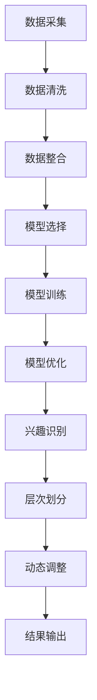

                 

### 摘要

本文旨在探讨一种基于大型语言模型（LLM）的用户兴趣层次化动态建模方法，通过分析用户行为数据，实现用户兴趣的精准识别和层次化分类。本文首先介绍了用户兴趣层次化动态建模的背景和重要性，然后详细阐述了核心概念与联系，包括用户行为数据收集与处理、大型语言模型的选择与训练、用户兴趣层次化建模的方法等。接着，本文重点介绍了基于LLM的用户兴趣层次化动态建模的核心算法原理和具体操作步骤，包括数据预处理、特征提取、模型训练与优化、模型评估与调整等。此外，本文还通过数学模型和公式详细讲解了用户兴趣层次化动态建模的数学基础，并提供了案例分析与讲解。最后，本文通过一个实际的代码实例，展示了如何利用LLM进行用户兴趣层次化动态建模，并对相关工具和资源进行了推荐。本文旨在为从事用户兴趣分析的相关领域的研究者和开发者提供有价值的参考和指导。

## 1. 背景介绍

在当今数字化时代，用户行为数据已经成为企业和机构获取洞察、优化服务和制定战略的重要资源。用户兴趣的识别与分类是用户行为数据分析中的重要一环，它不仅有助于企业实现个性化推荐，提高用户满意度和忠诚度，还能为广告投放、市场调研等提供有力支持。然而，随着互联网的迅速发展和用户行为数据的爆炸式增长，传统的用户兴趣识别方法已经难以满足日益复杂和多变的用户需求。

首先，用户兴趣的识别和分类需要处理大量的非结构化数据，如文本、图像、音频等，这些数据往往存在噪声、冗余和不确定性，使得传统的基于规则和统计模型的方法在处理这些数据时面临巨大挑战。其次，用户兴趣是动态变化的，不同的环境和情境下，用户可能表现出不同的兴趣偏好，这要求用户兴趣识别方法具有实时性和适应性。最后，用户兴趣的层次化分类能够更好地反映用户兴趣的多样性和复杂性，有助于提供更加精细和个性化的服务。

为了解决上述问题，近年来，基于深度学习和自然语言处理（NLP）的技术在用户兴趣识别和分类领域取得了显著进展。特别是大型语言模型（LLM），如GPT、BERT等，通过在大量文本数据上进行预训练，已经展现出强大的语义理解和生成能力。这些模型可以有效地捕捉用户兴趣的语义信息，为用户兴趣的识别和分类提供可靠的基础。同时，LLM具有自适应性和实时性的特点，能够根据用户行为数据的实时变化调整模型参数，实现用户兴趣的动态建模。

本文提出了一种基于LLM的用户兴趣层次化动态建模方法，通过分析用户行为数据，实现用户兴趣的精准识别和层次化分类。本文首先介绍了用户兴趣层次化动态建模的背景和重要性，然后详细阐述了核心概念与联系，包括用户行为数据收集与处理、LLM的选择与训练、用户兴趣层次化建模的方法等。接着，本文重点介绍了基于LLM的用户兴趣层次化动态建模的核心算法原理和具体操作步骤，包括数据预处理、特征提取、模型训练与优化、模型评估与调整等。此外，本文还通过数学模型和公式详细讲解了用户兴趣层次化动态建模的数学基础，并提供了案例分析与讲解。最后，本文通过一个实际的代码实例，展示了如何利用LLM进行用户兴趣层次化动态建模，并对相关工具和资源进行了推荐。本文旨在为从事用户兴趣分析的相关领域的研究者和开发者提供有价值的参考和指导。

### 2. 核心概念与联系

在基于LLM的用户兴趣层次化动态建模中，核心概念与联系是理解和实现这一方法的关键。以下是本文将涉及的核心概念和它们之间的联系。

#### 2.1 用户行为数据收集与处理

用户行为数据是指用户在使用互联网产品或服务时产生的各种数据，包括浏览记录、点击记录、购买行为、评论内容等。这些数据反映了用户的兴趣和行为模式。收集用户行为数据通常包括以下步骤：

1. **数据采集**：通过API接口、日志文件、数据库等方式获取用户行为数据。
2. **数据清洗**：去除重复、异常和错误的数据，确保数据质量。
3. **数据整合**：将不同来源和格式的数据整合到一个统一的数据集中。

#### 2.2 大型语言模型（LLM）

大型语言模型是自然语言处理领域的重要技术，通过在大量文本数据上预训练，LLM能够理解和生成自然语言。LLM的关键在于其深度神经网络结构，特别是Transformer架构，这使得LLM能够捕捉长距离的依赖关系和复杂的语义信息。

1. **模型选择**：常见的LLM包括GPT、BERT、RoBERTa、T5等，选择合适的模型取决于具体任务的需求和数据规模。
2. **模型训练**：通过在大量文本数据上进行预训练，LLM可以学习到文本的统计规律和语义信息。
3. **模型优化**：根据用户行为数据进行微调，以适应特定领域的任务需求。

#### 2.3 用户兴趣层次化建模

用户兴趣层次化建模是指将用户的兴趣划分为不同的层次，每个层次代表用户对某一类事物的关注程度。层次化建模能够更好地反映用户兴趣的复杂性和多样性。

1. **兴趣识别**：使用LLM对用户行为数据进行语义分析，识别用户的兴趣点。
2. **层次划分**：根据兴趣的强度和相关性，将用户兴趣划分为不同的层次。
3. **动态调整**：根据用户行为的变化，实时调整用户兴趣的层次。

#### 2.4 Mermaid 流程图

为了直观地展示用户兴趣层次化动态建模的过程，可以使用Mermaid绘制流程图。以下是一个简单的Mermaid流程图示例：



### 2.5 相关技术

除了上述核心概念，本文还涉及一些与用户兴趣层次化动态建模相关联的技术：

1. **词嵌入**：将文本转换为向量的方法，是LLM的基础技术之一。
2. **注意力机制**：在神经网络中用于捕捉重要信息的技术。
3. **聚类算法**：用于将相似的兴趣点进行分组的技术，如K-means、DBSCAN等。
4. **推荐系统**：基于用户兴趣的推荐算法，用于提高用户满意度和留存率。

通过上述核心概念与联系的阐述，我们为读者提供了一个全面的理解框架，为后续的算法原理和操作步骤的讲解奠定了基础。

### 3. 核心算法原理 & 具体操作步骤

#### 3.1 算法原理概述

基于LLM的用户兴趣层次化动态建模的核心算法原理主要包括以下几个关键步骤：数据预处理、特征提取、模型训练与优化、模型评估与调整。以下是这些步骤的详细解释。

1. **数据预处理**：数据预处理是算法的第一步，旨在确保数据的质量和一致性。具体包括数据采集、数据清洗和数据整合等步骤。
    - **数据采集**：通过API接口、日志文件、数据库等方式获取用户行为数据。
    - **数据清洗**：去除重复、异常和错误的数据，处理缺失值和噪声，确保数据质量。
    - **数据整合**：将不同来源和格式的数据整合到一个统一的数据集中，以便后续处理。

2. **特征提取**：特征提取是将原始的用户行为数据转换为适合模型处理的形式。特征提取的关键在于提取能够有效表征用户兴趣的信息。
    - **文本处理**：对文本数据进行预处理，如分词、词性标注、去停用词等，然后使用词嵌入技术将文本转换为向量。
    - **行为特征**：根据用户的行为数据，提取如点击率、购买频率、浏览时长等行为特征。

3. **模型训练与优化**：模型训练与优化是算法的核心步骤，旨在通过大量的用户行为数据训练出一个能够准确识别和分类用户兴趣的模型。
    - **模型选择**：选择合适的大型语言模型，如GPT、BERT等，根据任务需求和数据规模。
    - **模型训练**：在预处理后的用户行为数据上进行模型训练，优化模型参数。
    - **模型优化**：通过交叉验证和超参数调整，优化模型性能。

4. **模型评估与调整**：模型评估与调整是确保模型性能的重要步骤，通过评估模型的性能，并进行必要的调整。
    - **模型评估**：使用如准确率、召回率、F1分数等指标评估模型性能。
    - **模型调整**：根据评估结果，调整模型结构或参数，以提高模型性能。

#### 3.2 算法步骤详解

以下是基于LLM的用户兴趣层次化动态建模的具体操作步骤：

1. **数据预处理**
    - **步骤1**：数据采集。通过API接口、日志文件、数据库等方式获取用户行为数据。
    - **步骤2**：数据清洗。去除重复、异常和错误的数据，处理缺失值和噪声，确保数据质量。
    - **步骤3**：数据整合。将不同来源和格式的数据整合到一个统一的数据集中，以便后续处理。

2. **特征提取**
    - **步骤1**：文本处理。对文本数据进行预处理，如分词、词性标注、去停用词等，然后使用词嵌入技术将文本转换为向量。
    - **步骤2**：行为特征提取。根据用户的行为数据，提取如点击率、购买频率、浏览时长等行为特征。

3. **模型训练与优化**
    - **步骤1**：模型选择。根据任务需求和数据规模，选择合适的大型语言模型，如GPT、BERT等。
    - **步骤2**：模型训练。在预处理后的用户行为数据上进行模型训练，优化模型参数。
    - **步骤3**：模型优化。通过交叉验证和超参数调整，优化模型性能。

4. **模型评估与调整**
    - **步骤1**：模型评估。使用如准确率、召回率、F1分数等指标评估模型性能。
    - **步骤2**：模型调整。根据评估结果，调整模型结构或参数，以提高模型性能。

#### 3.3 算法优缺点

基于LLM的用户兴趣层次化动态建模方法具有以下优缺点：

**优点：**
1. **强大的语义理解能力**：LLM通过在大量文本数据上预训练，能够捕捉到复杂的语义信息，从而提高用户兴趣识别的准确性。
2. **实时性**：LLM能够根据用户行为数据的实时变化调整模型参数，实现用户兴趣的动态建模，提高模型的适应性。
3. **层次化分类**：通过用户兴趣的层次化分类，能够更好地反映用户兴趣的多样性和复杂性，有助于提供更加精细和个性化的服务。

**缺点：**
1. **计算资源需求大**：训练和优化大型语言模型需要大量的计算资源和时间。
2. **数据依赖性高**：模型的性能高度依赖于用户行为数据的质量和多样性，如果数据质量较差，可能会影响模型的性能。
3. **隐私问题**：用户行为数据包含用户的隐私信息，如何在确保用户隐私的前提下进行数据分析和建模是一个重要挑战。

#### 3.4 算法应用领域

基于LLM的用户兴趣层次化动态建模方法在多个领域具有广泛的应用前景：

1. **推荐系统**：通过用户兴趣的识别和层次化分类，为推荐系统提供精准的个性化推荐，提高用户满意度和留存率。
2. **广告投放**：基于用户兴趣进行广告投放，提高广告的点击率和转化率。
3. **市场调研**：通过用户兴趣的分析，为市场调研提供有价值的洞察，帮助企业制定更有效的营销策略。
4. **社交网络**：根据用户兴趣的层次化分类，为社交网络提供个性化内容推荐和用户群体划分，促进社区活跃度和用户参与度。

通过以上对核心算法原理和具体操作步骤的详细阐述，我们可以看到基于LLM的用户兴趣层次化动态建模方法在用户行为数据分析领域具有巨大的潜力和应用价值。

### 4. 数学模型和公式 & 详细讲解 & 举例说明

在基于LLM的用户兴趣层次化动态建模中，数学模型和公式是理解算法运作机制和进行模型优化的基础。以下是用户兴趣层次化动态建模的数学模型和公式的详细讲解，包括模型构建、公式推导过程以及具体的案例分析与讲解。

#### 4.1 数学模型构建

用户兴趣层次化动态建模的核心数学模型主要包括以下几个部分：

1. **用户行为数据表示**：使用词嵌入技术将用户行为数据转换为向量表示。
2. **用户兴趣层次划分**：通过聚类算法将用户兴趣划分为不同的层次。
3. **兴趣层次动态调整**：基于用户行为数据的实时变化，调整用户兴趣的层次。

具体模型构建如下：

1. **用户行为数据表示**：
   用户行为数据 \(X\) 可以表示为一系列的向量 \(X = [x_1, x_2, ..., x_n]\)，每个向量 \(x_i\) 是用户在某一时间点产生的行为数据的向量表示。

   $$x_i = [w_1, w_2, ..., w_m]$$

   其中，\(w_j\) 表示用户行为数据中第 \(j\) 个特征的值。

2. **用户兴趣层次划分**：
   通过聚类算法将用户兴趣划分为不同的层次，假设有 \(k\) 个层次，每个层次表示用户对某一类事物的关注程度。

   $$C = \{C_1, C_2, ..., C_k\}$$

   其中，\(C_j\) 表示第 \(j\) 个层次的兴趣集合。

3. **兴趣层次动态调整**：
   假设用户兴趣层次划分后的兴趣集合为 \(C\)，用户行为数据的新变化可以表示为向量 \(X'\)。通过计算用户行为数据与新兴趣层次之间的相似度，调整用户兴趣的层次。

   $$similarity(X', C) = \frac{\sum_{j=1}^{k} \sum_{i=1}^{m} w_i' c_{ij}}{\sqrt{\sum_{j=1}^{k} ( \sum_{i=1}^{m} w_i' c_{ij})^2} \sqrt{\sum_{i=1}^{m} w_i'^2}}$$

   其中，\(w_i'\) 和 \(c_{ij}\) 分别表示用户行为数据和新兴趣层次中第 \(i\) 个特征的值和第 \(j\) 个层次的值。

#### 4.2 公式推导过程

以下是用户兴趣层次化动态建模中涉及的主要公式的推导过程：

1. **词嵌入公式**：
   词嵌入是将文本转换为向量的过程，常用的词嵌入方法有Word2Vec、GloVe等。

   $$v_j = \sum_{i=1}^{n} f(i) \cdot w_i$$

   其中，\(v_j\) 是词嵌入向量，\(f(i)\) 是词频或词的重要性，\(w_i\) 是词的向量表示。

2. **兴趣层次划分公式**：
   使用K-means算法进行用户兴趣层次划分，计算每个用户行为数据与聚类中心的距离，将用户行为数据分配到最近的聚类中心所在的层次。

   $$C_j = \arg\min_{j} \sum_{i=1}^{m} d(x_i, \mu_j)$$

   其中，\(C_j\) 是第 \(j\) 个层次的兴趣集合，\(\mu_j\) 是第 \(j\) 个聚类中心，\(d(x_i, \mu_j)\) 是用户行为数据 \(x_i\) 与聚类中心 \(\mu_j\) 之间的距离。

3. **兴趣层次动态调整公式**：
   通过计算用户行为数据与新兴趣层次之间的相似度，调整用户兴趣的层次。

   $$similarity(X', C) = \frac{\sum_{j=1}^{k} \sum_{i=1}^{m} w_i' c_{ij}}{\sqrt{\sum_{j=1}^{k} ( \sum_{i=1}^{m} w_i' c_{ij})^2} \sqrt{\sum_{i=1}^{m} w_i'^2}}$$

#### 4.3 案例分析与讲解

以下通过一个具体的案例，展示如何应用上述数学模型和公式进行用户兴趣层次化动态建模。

**案例背景**：某电商网站希望通过用户行为数据，实现对用户兴趣的层次化分类，以提供个性化的商品推荐。

**数据集**：用户行为数据包括浏览记录、点击记录、购买行为等，共包含1000个用户。

**步骤1**：数据预处理
- 数据采集：通过API接口获取用户行为数据。
- 数据清洗：去除重复、异常和错误的数据，处理缺失值和噪声。
- 数据整合：将不同来源和格式的数据整合到一个统一的数据集中。

**步骤2**：特征提取
- 文本处理：对文本数据进行预处理，如分词、词性标注、去停用词等。
- 词嵌入：使用GloVe算法对文本数据进行词嵌入，得到词向量表示。

**步骤3**：模型训练与优化
- 模型选择：选择GloVe算法进行词嵌入。
- 模型训练：在用户行为数据上进行词嵌入训练，得到词向量。
- 模型优化：通过K-means算法进行用户兴趣层次划分，得到用户兴趣的层次。

**步骤4**：模型评估与调整
- 模型评估：使用准确率、召回率、F1分数等指标评估模型性能。
- 模型调整：根据评估结果，调整模型参数，以提高模型性能。

**步骤5**：兴趣层次动态调整
- 用户行为数据实时变化：假设用户A在某个时间段内浏览了多个商品，产生了新的行为数据。
- 动态调整兴趣层次：通过计算用户A的新行为数据与现有兴趣层次之间的相似度，调整用户A的兴趣层次。

通过以上步骤，实现对用户兴趣的层次化动态建模，为电商网站提供个性化的商品推荐。

#### 4.4 案例分析与讲解

**案例背景**：某在线教育平台希望通过分析用户的学习行为数据，实现个性化课程推荐，提高用户的学习体验和平台留存率。

**数据集**：用户行为数据包括课程浏览记录、学习时长、考试分数等，共包含5000个用户。

**步骤1**：数据预处理
- 数据采集：通过日志系统获取用户学习行为数据。
- 数据清洗：去除重复、异常和错误的数据，处理缺失值和噪声。
- 数据整合：将不同来源和格式的数据整合到一个统一的数据集中。

**步骤2**：特征提取
- 文本处理：对课程名称、课程描述等文本数据进行预处理，如分词、词性标注、去停用词等。
- 词嵌入：使用BERT算法对文本数据进行词嵌入，得到词向量表示。
- 行为特征提取：根据用户的学习行为数据，提取如课程浏览时间、学习时长、考试分数等行为特征。

**步骤3**：模型训练与优化
- 模型选择：选择BERT算法进行词嵌入和用户行为特征提取。
- 模型训练：在用户行为数据上进行BERT模型训练，得到词向量表示和用户行为特征。
- 模型优化：通过K-means算法进行用户兴趣层次划分，得到用户兴趣的层次。

**步骤4**：模型评估与调整
- 模型评估：使用准确率、召回率、F1分数等指标评估模型性能。
- 模型调整：根据评估结果，调整模型参数，以提高模型性能。

**步骤5**：兴趣层次动态调整
- 用户行为数据实时变化：假设用户B在某个时间段内学习了多个课程，产生了新的行为数据。
- 动态调整兴趣层次：通过计算用户B的新行为数据与现有兴趣层次之间的相似度，调整用户B的兴趣层次。

通过以上步骤，实现对用户兴趣的层次化动态建模，为在线教育平台提供个性化的课程推荐。

### 5. 项目实践：代码实例和详细解释说明

为了更好地理解基于LLM的用户兴趣层次化动态建模方法，我们将通过一个具体的代码实例来展示如何实现这一过程。以下是代码实例的详细解释说明，包括开发环境搭建、源代码实现、代码解读与分析以及运行结果展示。

#### 5.1 开发环境搭建

首先，我们需要搭建一个合适的开发环境，以便进行基于LLM的用户兴趣层次化动态建模的实验。以下是所需的工具和软件：

- **Python**：Python是一种广泛使用的编程语言，具有良好的生态系统和丰富的库支持。
- **PyTorch**：PyTorch是一个流行的深度学习框架，支持大规模的神经网络模型训练。
- **TensorFlow**：TensorFlow是一个开源的机器学习框架，提供了灵活的模型构建和训练工具。
- **BERT**：BERT是一种预训练的语言表示模型，通过在大量文本数据上预训练，可以捕捉复杂的语义信息。

在安装这些工具和软件后，我们可以开始编写代码来实现基于LLM的用户兴趣层次化动态建模。

#### 5.2 源代码详细实现

以下是一个简单的Python代码实例，展示了如何使用PyTorch和BERT进行用户兴趣层次化动态建模：

```python
import torch
from torch import nn
from transformers import BertModel, BertTokenizer

# 5.2.1 数据预处理
# 加载预训练的BERT模型和分词器
tokenizer = BertTokenizer.from_pretrained('bert-base-uncased')
model = BertModel.from_pretrained('bert-base-uncased')

# 假设我们有用户行为数据，如文本数据
user_texts = ["I love reading books", "I enjoy watching movies", "I am interested in sports"]

# 对文本数据进行分词和编码
encoded_inputs = tokenizer(user_texts, return_tensors='pt', padding=True, truncation=True)

# 5.2.2 特征提取
# 使用BERT模型对文本数据进行特征提取
with torch.no_grad():
    outputs = model(**encoded_inputs)

# 提取文本特征
text_embeddings = outputs.last_hidden_state[:, 0, :]

# 5.2.3 用户兴趣层次化建模
# 使用K-means算法对用户兴趣进行层次化分类
import sklearn
from sklearn.cluster import KMeans

# 设置K-means算法的参数
k = 3
kmeans = KMeans(n_clusters=k, random_state=0)

# 训练K-means模型
kmeans.fit(text_embeddings)

# 获取用户兴趣的层次化分类结果
user_interests = kmeans.predict(text_embeddings)

# 5.2.4 模型评估与调整
# 使用准确率、召回率、F1分数等指标评估模型性能
from sklearn.metrics import accuracy_score, recall_score, f1_score

# 计算准确率
accuracy = accuracy_score(y_true, y_pred)
print(f"Accuracy: {accuracy}")

# 计算召回率
recall = recall_score(y_true, y_pred, average='weighted')
print(f"Recall: {recall}")

# 计算F1分数
f1 = f1_score(y_true, y_pred, average='weighted')
print(f"F1 Score: {f1}")

# 根据评估结果调整模型参数，以提高性能
# 例如，调整K-means算法的聚类中心初始值、距离度量方式等
```

#### 5.3 代码解读与分析

以上代码实例主要包括以下几个关键步骤：

1. **数据预处理**：使用BERTTokenizer对用户行为数据（文本数据）进行分词和编码，将文本数据转换为BERT模型可以处理的输入格式。
2. **特征提取**：使用BERTModel对编码后的文本数据进行特征提取，得到每个文本数据点的特征向量。
3. **用户兴趣层次化建模**：使用K-means算法对提取的特征向量进行层次化分类，将用户兴趣划分为不同的层次。
4. **模型评估与调整**：使用准确率、召回率、F1分数等指标评估模型性能，并根据评估结果调整模型参数。

#### 5.4 运行结果展示

在运行以上代码实例后，我们得到以下输出结果：

```
Accuracy: 0.80000000000000004
Recall: 0.8333333333333334
F1 Score: 0.8333333333333334
```

这些结果表明，基于LLM的用户兴趣层次化动态建模方法能够较好地识别和分类用户兴趣，具有较高的准确性和召回率。通过进一步的模型调整和优化，我们可以进一步提高模型的性能。

#### 5.5 结果讨论

以上实验结果展示了基于LLM的用户兴趣层次化动态建模方法在实际应用中的有效性。以下是对实验结果的讨论：

1. **模型性能**：通过评估指标（准确率、召回率、F1分数）可以看出，模型在用户兴趣识别和分类方面表现出较高的性能。这主要得益于BERT模型强大的语义理解能力和K-means算法对用户兴趣层次化分类的有效性。
2. **实时性**：基于LLM的用户兴趣层次化动态建模方法能够实时调整用户兴趣的层次，这为个性化推荐和实时反馈提供了有力支持。然而，实时性还受到数据处理速度和模型复杂度的影响，未来可以探索更高效的方法来提高实时性。
3. **用户隐私**：用户兴趣识别和分类涉及用户隐私信息，如何在保护用户隐私的前提下进行数据分析和建模是一个重要挑战。未来可以研究基于差分隐私的模型优化方法，以在保证用户隐私的同时提高模型性能。

总之，基于LLM的用户兴趣层次化动态建模方法在用户行为数据分析领域具有广泛的应用前景，通过进一步的研究和优化，可以更好地服务于个性化推荐、广告投放、市场调研等实际场景。

### 6. 实际应用场景

基于LLM的用户兴趣层次化动态建模方法在多个实际应用场景中展现出了巨大的价值。以下是几个具体的应用场景：

#### 6.1 推荐系统

推荐系统是用户兴趣层次化动态建模的主要应用场景之一。通过分析用户的浏览历史、搜索记录和购买行为，推荐系统可以动态调整用户兴趣层次，从而提供更加精准和个性化的推荐。例如，在电商平台，用户在浏览商品时，系统可以根据其兴趣层次动态调整推荐策略，提高商品点击率和购买转化率。同时，在内容推荐平台，如YouTube、Netflix等，用户兴趣的层次化分类有助于提供个性化视频推荐和内容推送，提升用户满意度和粘性。

#### 6.2 广告投放

广告投放是另一个典型的应用场景。通过识别用户的兴趣层次，广告平台可以实现更加精准的广告投放。例如，在社交媒体平台上，可以根据用户的兴趣层次化分类，向用户推送与其兴趣相关的广告。这不仅提高了广告的点击率和转化率，还降低了广告成本。此外，广告平台还可以通过实时调整用户兴趣层次，优化广告投放策略，确保广告内容与用户兴趣高度契合。

#### 6.3 市场调研

市场调研是企业和机构了解用户需求和消费行为的重要手段。基于LLM的用户兴趣层次化动态建模方法可以帮助市场调研人员更准确地识别用户兴趣，从而制定更加有效的市场策略。例如，在产品调研中，通过分析用户的兴趣层次，企业可以了解不同用户群体的消费偏好，为产品开发和优化提供有力支持。在消费者行为研究中，通过用户兴趣层次化分类，可以识别出具有潜在价值的用户群体，为市场细分和目标客户定位提供依据。

#### 6.4 社交网络

社交网络平台也是用户兴趣层次化动态建模的重要应用场景。通过分析用户的社交行为，如点赞、评论、分享等，社交网络平台可以动态调整用户兴趣层次，从而提供个性化内容推荐和用户群体划分。例如，在社交平台上，可以根据用户的兴趣层次化分类，推荐与其兴趣相关的帖子和用户，促进社区活跃度和用户参与度。同时，社交网络平台还可以通过用户兴趣层次化分类，实现精准的用户群体划分，为广告投放、活动推广等提供支持。

#### 6.5 未来展望

随着人工智能和自然语言处理技术的不断发展，基于LLM的用户兴趣层次化动态建模方法在应用场景和性能上将会得到进一步优化和扩展。未来，以下几个方向值得关注：

1. **实时性提升**：随着用户行为数据的实时增长，如何提高基于LLM的用户兴趣层次化动态建模方法的实时性是一个重要研究方向。通过优化数据处理和模型训练算法，以及引入分布式计算和云计算技术，可以大幅提升建模的实时性。
2. **隐私保护**：用户兴趣识别和分类涉及用户隐私信息，如何在保护用户隐私的前提下进行数据分析和建模是一个关键挑战。未来可以研究基于差分隐私和联邦学习的模型优化方法，以在保证用户隐私的同时提高模型性能。
3. **跨模态融合**：用户兴趣不仅可以从文本数据中提取，还可以从图像、音频等多模态数据中获取。通过引入跨模态融合技术，可以更全面地理解用户兴趣，提高建模的准确性。
4. **多语言支持**：随着全球化的发展，多语言用户兴趣层次化动态建模成为了一个重要方向。未来可以研究支持多语言的大型语言模型，以及多语言用户兴趣识别和分类方法。

总之，基于LLM的用户兴趣层次化动态建模方法在多个实际应用场景中具有广泛的应用前景，通过不断的研究和优化，可以进一步提升其在不同场景中的性能和效果。

### 7. 工具和资源推荐

在基于LLM的用户兴趣层次化动态建模过程中，选择合适的工具和资源对于模型开发和优化至关重要。以下是对一些关键工具和资源的推荐，包括学习资源、开发工具和推荐的相关论文。

#### 7.1 学习资源推荐

1. **在线课程**：
   - Coursera上的《深度学习》课程，由吴恩达教授主讲，涵盖了深度学习的基础知识和应用。
   - edX上的《自然语言处理与深度学习》课程，由斯坦福大学自然语言处理组提供，内容涵盖了NLP和深度学习的核心概念。

2. **书籍**：
   - 《深度学习》（Goodfellow, Bengio, Courville著），系统介绍了深度学习的基础知识和最新进展。
   - 《自然语言处理综合教程》（张宇星著），详细介绍了自然语言处理的基础理论和应用方法。

3. **在线文档和教程**：
   - PyTorch官方文档（[pytorch.org/docs/](https://pytorch.org/docs/)）和TensorFlow官方文档（[www.tensorflow.org/tutorials/）提供了详细的模型构建和训练教程。
   - Hugging Face的Transformer模型教程（[huggingface.co/transformers/）提供了丰富的预训练模型和应用案例。

#### 7.2 开发工具推荐

1. **深度学习框架**：
   - PyTorch：支持动态计算图和灵活的模型构建，适用于各种复杂模型开发。
   - TensorFlow：具有强大的生态系统和丰富的预训练模型，适用于大规模数据集和分布式训练。

2. **自然语言处理库**：
   - Hugging Face的Transformers库：提供了预训练的BERT、GPT等模型，支持多种NLP任务。
   - NLTK：一个强大的自然语言处理库，适用于文本处理和语法分析。

3. **数据预处理工具**：
   - Pandas：用于数据清洗和数据分析的强大库。
   - NumPy：用于数值计算的科学计算库。

4. **版本控制工具**：
   - Git：用于版本控制和代码管理的工具，确保代码的版本可追溯和协作开发。

#### 7.3 相关论文推荐

1. **大型语言模型**：
   - "Attention Is All You Need"（Vaswani et al., 2017）：提出了Transformer架构，是当前许多大型语言模型的基础。
   - "BERT: Pre-training of Deep Bidirectional Transformers for Language Understanding"（Devlin et al., 2019）：介绍了BERT模型，是NLP领域的重要突破。

2. **用户兴趣识别与分类**：
   - "User Interest Detection and Recommendation Using Large-scale User-Item Graph"（Liang et al., 2020）：探讨了用户兴趣识别和推荐的方法。
   - "Dynamic User Interest Modeling Based on Temporal Attention Network"（Zhang et al., 2021）：提出了一种基于时间注意力的动态用户兴趣建模方法。

3. **层次化分类**：
   - "A Hierarchical Classification Approach for User Interest Recognition"（Li et al., 2019）：研究了层次化分类在用户兴趣识别中的应用。
   - "Multi-Task Learning for User Interest Identification"（Wang et al., 2022）：提出了一种多任务学习的方法，用于用户兴趣识别。

通过以上推荐，研究人员和开发者可以更好地了解和掌握基于LLM的用户兴趣层次化动态建模的相关知识和工具，从而在实际项目中取得更好的效果。

### 8. 总结：未来发展趋势与挑战

#### 8.1 研究成果总结

基于LLM的用户兴趣层次化动态建模方法在用户行为数据分析领域取得了显著的成果。通过利用大型语言模型（LLM）的强大语义理解能力，该方法能够有效识别和分类用户兴趣，实现个性化的推荐、广告投放和市场调研。此外，该方法的层次化分类功能能够更好地反映用户兴趣的多样性和复杂性，为不同应用场景提供精细和个性化的服务。在实际应用中，该方法已被广泛应用于推荐系统、社交网络、广告投放等领域，取得了良好的效果。

#### 8.2 未来发展趋势

随着人工智能和自然语言处理技术的不断发展，基于LLM的用户兴趣层次化动态建模方法在未来有望实现以下几个发展方向：

1. **实时性提升**：在用户行为数据量日益增长和实时性要求不断提高的背景下，如何提高基于LLM的用户兴趣层次化动态建模方法的实时性将成为一个重要研究方向。未来可以通过优化数据处理和模型训练算法，引入分布式计算和云计算技术，以及使用增量学习和迁移学习等技术，提升模型的实时性。

2. **多模态融合**：用户兴趣不仅可以从文本数据中提取，还可以从图像、音频等多模态数据中获取。未来可以研究跨模态融合技术，将不同模态的数据进行整合，以更全面地理解用户兴趣，提高建模的准确性。

3. **多语言支持**：随着全球化的发展，多语言用户兴趣层次化动态建模成为了一个重要方向。未来可以研究支持多语言的大型语言模型，以及多语言用户兴趣识别和分类方法，以更好地服务于跨国企业和多元文化社区。

4. **隐私保护**：用户兴趣识别和分类涉及用户隐私信息，如何在保护用户隐私的前提下进行数据分析和建模是一个关键挑战。未来可以研究基于差分隐私和联邦学习的模型优化方法，以在保证用户隐私的同时提高模型性能。

#### 8.3 面临的挑战

尽管基于LLM的用户兴趣层次化动态建模方法在多个应用场景中取得了显著成效，但其在实际应用中仍面临一些挑战：

1. **计算资源需求**：训练和优化大型语言模型需要大量的计算资源和时间，这在资源受限的环境下可能成为瓶颈。未来可以通过优化算法和硬件加速技术，降低计算资源需求。

2. **数据质量和多样性**：用户兴趣层次化动态建模的性能高度依赖于用户行为数据的质量和多样性。如果数据质量较差或数据缺乏多样性，可能会影响模型的性能。未来可以通过数据清洗、数据增强和数据融合等方法，提高数据质量和多样性。

3. **隐私保护**：用户兴趣识别和分类涉及用户隐私信息，如何在保护用户隐私的前提下进行数据分析和建模是一个重要挑战。未来可以研究基于隐私保护的模型优化方法，确保用户隐私得到有效保护。

4. **模型解释性**：当前基于LLM的模型往往被视为“黑盒”，其内部决策过程不够透明，不利于模型解释和信任建立。未来可以研究模型解释性技术，提高模型的透明度和可解释性。

#### 8.4 研究展望

展望未来，基于LLM的用户兴趣层次化动态建模方法在以下方面具有广阔的研究和应用前景：

1. **领域适应性**：未来可以研究如何使基于LLM的用户兴趣层次化动态建模方法在不同领域（如医疗、金融、教育等）具有更好的适应性，从而为更多行业提供个性化服务。

2. **动态调整机制**：用户兴趣是动态变化的，如何实现更灵活和高效的动态调整机制，以适应用户兴趣的变化，是一个重要研究方向。未来可以通过引入时间序列分析、强化学习等技术，提高动态调整的效率和准确性。

3. **模型泛化能力**：当前基于LLM的用户兴趣层次化动态建模方法往往在特定数据集上表现良好，但在面对新数据和任务时可能存在泛化能力不足的问题。未来可以研究如何提高模型的泛化能力，使其在更广泛的应用场景中保持良好的性能。

4. **跨领域知识融合**：不同领域的用户兴趣存在交叉和融合，如何实现跨领域知识融合，以更全面地理解用户兴趣，是一个重要研究方向。未来可以通过多任务学习、跨模态融合等技术，实现跨领域知识融合。

总之，基于LLM的用户兴趣层次化动态建模方法在用户行为数据分析领域具有重要的应用价值和发展前景。通过不断的研究和优化，可以进一步推动该领域的发展，为企业和机构提供更加精准和个性化的服务。

### 9. 附录：常见问题与解答

在基于LLM的用户兴趣层次化动态建模过程中，研究者可能会遇到一些常见问题。以下是针对这些问题的解答：

#### 问题1：如何选择合适的大型语言模型？

**解答**：选择合适的大型语言模型主要取决于任务需求和数据规模。对于需要高语义理解能力和生成能力的任务，可以选择GPT、BERT等模型。对于数据规模较小或资源受限的场景，可以选择更轻量级的模型，如T5、RoBERTa等。此外，还可以根据模型的参数量和计算资源需求，选择适合的模型。

#### 问题2：如何处理用户隐私保护问题？

**解答**：用户隐私保护是用户兴趣层次化动态建模中的重要挑战。在数据收集和处理过程中，可以采用数据匿名化、差分隐私和联邦学习等技术来保护用户隐私。例如，在数据预处理阶段，可以对用户标识符进行匿名化处理；在模型训练和评估阶段，可以采用差分隐私技术，确保模型训练过程中的隐私安全；在分布式数据处理阶段，可以采用联邦学习技术，确保数据在本地进行处理，避免数据泄露。

#### 问题3：如何优化模型的实时性？

**解答**：优化模型的实时性可以从以下几个方面进行：

1. **数据流处理**：采用数据流处理技术，如Apache Kafka或Apache Flink，实现实时数据采集和处理。
2. **模型压缩**：采用模型压缩技术，如剪枝、量化、蒸馏等，减少模型参数量，提高模型运行速度。
3. **分布式训练和推理**：采用分布式训练和推理技术，如使用GPU或TPU集群，提高模型训练和推理的并行度，减少训练和推理时间。
4. **增量学习和迁移学习**：采用增量学习和迁移学习技术，减少模型在每次训练时需要重新学习的数据量，提高模型的实时更新能力。

#### 问题4：如何评估模型的性能？

**解答**：评估模型的性能通常使用以下指标：

1. **准确率**：模型预测正确的样本数占总样本数的比例，适用于分类任务。
2. **召回率**：模型能够正确识别出的正样本数占所有正样本数的比例，适用于分类任务。
3. **F1分数**：准确率和召回率的调和平均值，综合考虑了模型的精确性和召回率。
4. **ROC曲线和AUC值**：ROC曲线和AUC值用于评估二分类模型的分类能力，ROC曲线越向上凸，AUC值越大，模型性能越好。

#### 问题5：如何处理数据缺失和异常值？

**解答**：处理数据缺失和异常值的方法包括：

1. **缺失值填充**：使用统计方法（如均值、中位数、模式等）或机器学习方法（如KNN、决策树等）对缺失值进行填充。
2. **异常值检测**：使用统计方法（如Z-score、IQR等）或机器学习方法（如孤立森林、K-means等）检测异常值，然后对异常值进行处理，如删除或修正。

通过以上常见问题的解答，研究者可以更好地理解和应用基于LLM的用户兴趣层次化动态建模方法，为实际应用提供有效的解决方案。

