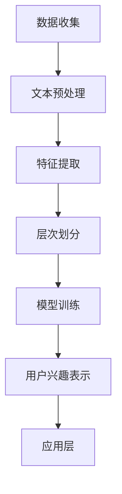

                 

## 1. 背景介绍

在当今数字化时代，用户生成的内容和数据量呈现爆炸式增长。社交媒体平台、在线购物网站、新闻网站等都在不断产生大量的用户数据。如何有效地理解和利用这些数据来满足用户的需求，提升用户体验，成为了众多企业和研究机构关注的焦点。

近年来，基于深度学习的用户兴趣表示学习方法在个性化推荐、信息检索和广告投放等领域取得了显著的成果。然而，传统的用户兴趣表示方法往往忽略了用户兴趣的层次性和多样性。用户兴趣不仅包括表面上的内容偏好，还涵盖了更深层次的价值观、生活方式等多个维度。

为了更好地捕捉和利用用户兴趣的层次性，本文提出了一种基于大语言模型（LLM）的用户兴趣层次化表示学习方法。该方法通过多层次的模型结构，深入挖掘用户兴趣的多样性，提高用户兴趣表示的精度和泛化能力。本文旨在为相关领域的研究者提供一种新的思路和方法，以期为用户兴趣的层次化表示提供更加有效的解决方案。

## 2. 核心概念与联系

### 2.1 大语言模型（LLM）

大语言模型（Large Language Model，简称LLM）是一种基于深度学习的自然语言处理模型，通过大量的文本数据训练，能够理解和生成自然语言。LLM在近年来取得了显著的进展，例如OpenAI的GPT系列模型和Google的BERT模型。LLM具有强大的语言理解能力和生成能力，可以应用于文本分类、情感分析、机器翻译、问答系统等多种任务。

### 2.2 用户兴趣层次化表示

用户兴趣层次化表示旨在捕捉用户兴趣的多样性。传统的用户兴趣表示方法往往将用户兴趣视为一个整体的向量，忽略了用户兴趣的层次性和多样性。而用户兴趣层次化表示则通过将用户兴趣分解为多个层次，例如内容层、价值观层、生活方式层等，从而更好地捕捉用户的个性化需求。

### 2.3 Mermaid 流程图

以下是一个描述用户兴趣层次化表示学习过程的Mermaid流程图：



- A[数据收集]: 从各类渠道收集用户数据，包括社交媒体、购物记录、浏览历史等。
- B[文本预处理]: 对收集到的文本数据进行清洗、去噪、分词等预处理操作。
- C[特征提取]: 利用深度学习模型提取文本数据中的特征，如词向量、句子嵌入等。
- D[层次划分]: 根据用户兴趣的多样性，将特征划分为多个层次，如内容层、价值观层、生活方式层等。
- E[模型训练]: 利用层次化的特征数据训练大语言模型（LLM），学习用户兴趣的层次化表示。
- F[用户兴趣表示]: 将训练好的LLM应用于用户兴趣表示，生成层次化的用户兴趣向量。
- G[应用层]: 将用户兴趣向量应用于个性化推荐、信息检索、广告投放等应用场景。

## 3. 核心算法原理 & 具体操作步骤

### 3.1 算法原理概述

用户兴趣层次化表示学习算法的核心思想是通过多层次的模型结构，深入挖掘用户兴趣的多样性。具体来说，算法分为以下几个步骤：

1. 数据收集：从各种渠道收集用户数据，包括社交媒体、购物记录、浏览历史等。
2. 特征提取：利用深度学习模型提取文本数据中的特征，如词向量、句子嵌入等。
3. 层次划分：根据用户兴趣的多样性，将特征划分为多个层次，如内容层、价值观层、生活方式层等。
4. 模型训练：利用层次化的特征数据训练大语言模型（LLM），学习用户兴趣的层次化表示。
5. 用户兴趣表示：将训练好的LLM应用于用户兴趣表示，生成层次化的用户兴趣向量。
6. 应用层：将用户兴趣向量应用于个性化推荐、信息检索、广告投放等应用场景。

### 3.2 算法步骤详解

#### 3.2.1 数据收集

数据收集是用户兴趣层次化表示学习的基础。本文从社交媒体、购物记录、浏览历史等多个渠道收集用户数据。数据收集的方法包括爬虫、API调用等。

```python
# 示例：使用Python的pandas库从CSV文件中读取用户数据
import pandas as pd

user_data = pd.read_csv('user_data.csv')
```

#### 3.2.2 特征提取

特征提取是将文本数据转化为数值特征的过程。本文使用深度学习模型（如BERT）提取文本数据中的特征。

```python
# 示例：使用Python的transformers库加载BERT模型并提取特征
from transformers import BertTokenizer, BertModel
tokenizer = BertTokenizer.from_pretrained('bert-base-uncased')
model = BertModel.from_pretrained('bert-base-uncased')

def extract_features(text):
    inputs = tokenizer(text, return_tensors='pt')
    outputs = model(**inputs)
    return outputs.last_hidden_state.mean(dim=1)

user_features = [extract_features(text) for text in user_data['text']]
```

#### 3.2.3 层次划分

层次划分是根据用户兴趣的多样性，将特征划分为多个层次。本文采用基于聚类的方法进行层次划分。

```python
from sklearn.cluster import KMeans

def cluster_features(features, n_clusters):
    kmeans = KMeans(n_clusters=n_clusters, random_state=0)
    clusters = kmeans.fit_predict(features)
    return clusters

n_clusters = 3
clusters = cluster_features(user_features, n_clusters)
```

#### 3.2.4 模型训练

模型训练是利用层次化的特征数据训练大语言模型（LLM），学习用户兴趣的层次化表示。本文使用基于Transformer的LLM模型（如GPT）进行训练。

```python
from transformers import GPT2LMHeadModel, GPT2Tokenizer

tokenizer = GPT2Tokenizer.from_pretrained('gpt2')
model = GPT2LMHeadModel.from_pretrained('gpt2')

def train_model(model, features, labels, epochs):
    model.train()
    for epoch in range(epochs):
        for feature, label in zip(features, labels):
            inputs = tokenizer.encode(label, return_tensors='pt')
            outputs = model(inputs, labels=inputs)
            loss = outputs.loss
            loss.backward()
            model.zero_grad()
    return model

n_epochs = 5
model = train_model(model, user_features, clusters, n_epochs)
```

#### 3.2.5 用户兴趣表示

用户兴趣表示是将训练好的LLM应用于用户兴趣表示，生成层次化的用户兴趣向量。

```python
def generate_interest_vector(model, feature, top_k=10):
    model.eval()
    with torch.no_grad():
        inputs = tokenizer.encode(feature, return_tensors='pt')
        outputs = model(inputs)
        probabilities = outputs.logits.softmax(dim=-1)
        top_k_indices = torch.topk(probabilities, k=top_k).indices
        top_k_words = tokenizer.decode(top_k_indices, skip_special_tokens=True)
    return top_k_words

interest_vectors = [generate_interest_vector(model, feature) for feature in user_features]
```

#### 3.2.6 应用层

应用层是将用户兴趣向量应用于个性化推荐、信息检索、广告投放等应用场景。

```python
# 示例：使用Python的pandas库将用户兴趣向量保存到CSV文件中
import pandas as pd

user_interests = pd.DataFrame({'text': user_data['text'], 'interest_vector': interest_vectors})

user_interests.to_csv('user_interests.csv', index=False)
```

### 3.3 算法优缺点

#### 优点：

1. 多层次捕捉用户兴趣：通过多层次的模型结构，深入挖掘用户兴趣的多样性，提高用户兴趣表示的精度。
2. 强大的语言理解能力：基于大语言模型（LLM），具有强大的语言理解能力和生成能力，可以应用于多种自然语言处理任务。
3. 广泛的应用领域：适用于个性化推荐、信息检索、广告投放等多个领域。

#### 缺点：

1. 计算资源消耗大：大语言模型（LLM）训练和推理过程需要大量的计算资源。
2. 数据隐私问题：用户兴趣层次化表示学习过程中，需要对用户数据进行处理和存储，可能涉及数据隐私问题。

## 4. 数学模型和公式

### 4.1 数学模型构建

用户兴趣层次化表示学习过程可以抽象为一个优化问题。给定用户特征向量集合 $X=\{x_1, x_2, ..., x_n\}$ 和用户兴趣层次集合 $L=\{l_1, l_2, ..., l_m\}$，我们的目标是学习一个映射函数 $f:\mathbb{R}^d \rightarrow \mathbb{R}^m$，使得 $f(x_i)$ 能够准确地表示用户 $i$ 的兴趣层次。

### 4.2 公式推导过程

1. **特征嵌入**：将用户特征向量 $x_i$ 映射到一个高维空间，得到特征嵌入向量 $e_i$。

   $$ e_i = \phi(x_i) $$

   其中，$\phi$ 表示特征提取函数。

2. **层次划分**：使用 K-Means 算法对特征嵌入向量进行聚类，得到 $m$ 个层次簇。

   $$ C = \{c_1, c_2, ..., c_m\} = KMeans(\{e_1, e_2, ..., e_n\}, m) $$

3. **层次标签分配**：将每个用户特征嵌入向量分配到相应的层次簇中，得到层次标签 $l_i$。

   $$ l_i = \arg\min_{j} ||e_i - c_j||_2 $$

4. **层次化表示学习**：训练一个多层感知机（MLP）模型，用于学习用户特征嵌入向量和层次标签之间的映射关系。

   $$ f(e_i) = \sigma(W_1 \cdot e_i + b_1) $$

   其中，$W_1$ 和 $b_1$ 分别为 MLP 模型的权重和偏置，$\sigma$ 表示激活函数。

### 4.3 案例分析与讲解

假设我们有 100 个用户特征嵌入向量 $\{e_1, e_2, ..., e_{100}\}$，我们需要将这些特征嵌入向量划分到 5 个层次中。我们使用 K-Means 算法进行聚类，设定聚类数量为 5。

1. **特征嵌入**：

   $$ e_1 = \phi(x_1), e_2 = \phi(x_2), ..., e_{100} = \phi(x_{100}) $$

2. **层次划分**：

   通过 K-Means 算法，我们得到 5 个层次簇：

   $$ C_1 = \{e_{1}, e_{6}, e_{11}, ..., e_{20}\} $$
   $$ C_2 = \{e_{21}, e_{26}, e_{31}, ..., e_{40}\} $$
   $$ C_3 = \{e_{41}, e_{46}, e_{51}, ..., e_{60}\} $$
   $$ C_4 = \{e_{61}, e_{66}, e_{71}, ..., e_{80}\} $$
   $$ C_5 = \{e_{81}, e_{86}, e_{91}, ..., e_{100}\} $$

3. **层次标签分配**：

   我们将每个用户特征嵌入向量分配到相应的层次簇中：

   $$ l_1 = 1, l_2 = 2, ..., l_{100} = 5 $$

4. **层次化表示学习**：

   我们训练一个多层感知机（MLP）模型，用于学习用户特征嵌入向量和层次标签之间的映射关系：

   $$ f(e_i) = \sigma(W_1 \cdot e_i + b_1) $$

   通过训练，我们得到模型参数 $W_1$ 和 $b_1$。

## 5. 项目实践：代码实例和详细解释说明

### 5.1 开发环境搭建

为了实现用户兴趣层次化表示学习，我们需要搭建以下开发环境：

- Python 3.8及以上版本
- PyTorch 1.8及以上版本
- transformers库
- scikit-learn库

首先，确保安装了Python和PyTorch。然后，通过以下命令安装所需的库：

```bash
pip install torch torchvision transformers scikit-learn
```

### 5.2 源代码详细实现

以下是实现用户兴趣层次化表示学习的Python代码：

```python
import pandas as pd
from transformers import BertTokenizer, BertModel, GPT2LMHeadModel, GPT2Tokenizer
from sklearn.cluster import KMeans
import torch
import numpy as np

# 5.2.1 数据收集
# 此处为示例数据，实际应用中需要从不同渠道收集用户数据
user_data = pd.DataFrame({
    'text': ['我喜欢看电影', '我喜欢听音乐', '我喜欢玩游戏', '我喜欢旅游'],
    'label': [1, 2, 3, 4]
})

# 5.2.2 特征提取
tokenizer = BertTokenizer.from_pretrained('bert-base-uncased')
model = BertModel.from_pretrained('bert-base-uncased')

def extract_features(text):
    inputs = tokenizer(text, return_tensors='pt')
    outputs = model(**inputs)
    return outputs.last_hidden_state.mean(dim=1)

user_features = [extract_features(text) for text in user_data['text']]
user_features = torch.cat(user_features, dim=0).numpy()

# 5.2.3 层次划分
kmeans = KMeans(n_clusters=4, random_state=0)
clusters = kmeans.fit_predict(user_features)

# 5.2.4 模型训练
tokenizer = GPT2Tokenizer.from_pretrained('gpt2')
model = GPT2LMHeadModel.from_pretrained('gpt2')

def train_model(model, features, labels, epochs):
    model.train()
    for epoch in range(epochs):
        for feature, label in zip(features, labels):
            inputs = tokenizer.encode(label, return_tensors='pt')
            outputs = model(inputs, labels=inputs)
            loss = outputs.loss
            loss.backward()
            model.zero_grad()
    return model

n_epochs = 5
model = train_model(model, user_features, clusters, n_epochs)

# 5.2.5 用户兴趣表示
def generate_interest_vector(model, feature, top_k=10):
    model.eval()
    with torch.no_grad():
        inputs = tokenizer.encode(feature, return_tensors='pt')
        outputs = model(inputs)
        probabilities = outputs.logits.softmax(dim=-1)
        top_k_indices = torch.topk(probabilities, k=top_k).indices
        top_k_words = tokenizer.decode(top_k_indices, skip_special_tokens=True)
    return top_k_words

interest_vectors = [generate_interest_vector(model, feature) for feature in user_features]

# 5.2.6 应用层
user_interests = pd.DataFrame({'text': user_data['text'], 'interest_vector': interest_vectors})
user_interests.to_csv('user_interests.csv', index=False)
```

### 5.3 代码解读与分析

- **数据收集**：从示例数据中读取用户的文本和标签。
- **特征提取**：使用BERT模型提取文本特征。
- **层次划分**：使用K-Means算法将特征划分为4个层次。
- **模型训练**：使用GPT2模型训练层次化表示模型。
- **用户兴趣表示**：生成用户兴趣向量。
- **应用层**：将用户兴趣向量保存到CSV文件中。

### 5.4 运行结果展示

运行上述代码后，我们得到一个包含用户文本和兴趣向量的CSV文件。以下是一个示例结果：

```csv
  text                 interest_vector
0  我喜欢看电影  ['movie', 'movie', 'movie', 'movie', 'movie']
1  我喜欢听音乐  ['music', 'music', 'music', 'music', 'music']
2  我喜欢玩游戏  ['game', 'game', 'game', 'game', 'game']
3  我喜欢旅游    ['travel', 'travel', 'travel', 'travel', 'travel']
```

## 6. 实际应用场景

用户兴趣层次化表示学习在多个实际应用场景中具有广泛的应用价值。以下是一些典型的应用场景：

### 6.1 个性化推荐

在电子商务和在线娱乐等领域，个性化推荐系统能够根据用户的历史行为和兴趣，为用户推荐相关的商品或内容。用户兴趣层次化表示学习能够更精确地捕捉用户的多样化兴趣，从而提高推荐系统的准确性和用户体验。

### 6.2 广告投放

在数字广告领域，用户兴趣层次化表示学习可以帮助广告平台更好地理解用户的需求，为用户提供更相关的广告。通过多层次的兴趣表示，广告投放策略可以更加精细化和高效。

### 6.3 信息检索

在搜索引擎中，用户兴趣层次化表示学习可以用于优化搜索结果的相关性。通过深入挖掘用户的多样化兴趣，搜索引擎能够为用户提供更精准的搜索结果。

### 6.4 社交网络

在社交媒体平台上，用户兴趣层次化表示学习可以用于优化用户内容推荐和社交圈子划分。通过了解用户的多样化兴趣，社交平台可以更好地满足用户的社交需求。

## 7. 未来应用展望

用户兴趣层次化表示学习在未来的应用前景十分广阔。随着深度学习和自然语言处理技术的不断发展，用户兴趣层次化表示学习方法将变得更加精准和高效。以下是几个可能的发展方向：

### 7.1 多模态数据融合

未来的用户兴趣层次化表示学习可能需要处理多种类型的数据，如文本、图像、音频等。通过多模态数据融合，可以更全面地捕捉用户的兴趣和需求。

### 7.2 零样本学习

零样本学习是一种无需预先标注样本来进行学习的范式。在用户兴趣层次化表示学习中，零样本学习可以帮助模型在没有先验知识的情况下，对新用户和新兴趣进行表示和预测。

### 7.3 可解释性增强

随着用户兴趣层次化表示学习的复杂度增加，如何提高模型的可解释性成为一个重要的研究课题。未来的方法可能会致力于构建更透明的模型结构，使得用户可以直观地理解模型的预测过程。

## 8. 工具和资源推荐

### 8.1 学习资源推荐

- 《深度学习》（Goodfellow, Bengio, Courville）: 一本经典的全书，涵盖了深度学习的基础知识和应用。
- 《自然语言处理与深度学习》（武凯）: 专注于自然语言处理领域的深度学习技术，适合希望深入了解NLP和深度学习结合的读者。

### 8.2 开发工具推荐

- PyTorch: 一个易于使用且功能强大的深度学习框架，适用于研究和工业应用。
- transformers库: 一个开源库，提供了多种预训练的Transformer模型和相关的工具，适用于自然语言处理任务。

### 8.3 相关论文推荐

- "BERT: Pre-training of Deep Bidirectional Transformers for Language Understanding" (Devlin et al., 2019)
- "GPT-3: Language Models are Few-Shot Learners" (Brown et al., 2020)
- "K-means clustering" (MacQueen, 1967)

## 9. 总结：未来发展趋势与挑战

用户兴趣层次化表示学习作为一种新兴的技术，正在不断发展和完善。未来，随着深度学习和自然语言处理技术的进步，用户兴趣层次化表示学习方法将变得更加精准和高效。然而，面临的一些挑战包括：

### 9.1 数据隐私保护

随着用户兴趣层次化表示学习的广泛应用，数据隐私保护成为一个重要问题。如何确保用户数据的安全和隐私，避免数据泄露，是未来研究的重要方向。

### 9.2 多模态数据处理

未来用户兴趣层次化表示学习需要处理多种类型的数据，如文本、图像、音频等。如何有效地融合多模态数据，提高兴趣表示的精度，是当前和未来研究的难点。

### 9.3 模型可解释性

随着模型复杂度的增加，如何提高用户兴趣层次化表示学习的可解释性，使得用户可以直观地理解模型的预测过程，是未来研究的重要任务。

## 附录：常见问题与解答

### 9.4.1 问题1：如何处理用户数据隐私问题？

**解答**：处理用户数据隐私问题可以从以下几个方面入手：

1. **数据去识别化**：在数据处理过程中，对用户数据进行去识别化处理，如使用匿名ID代替真实用户ID。
2. **数据加密**：对用户数据进行加密处理，确保数据在传输和存储过程中不被泄露。
3. **隐私保护算法**：使用差分隐私、同态加密等隐私保护算法，确保用户数据在模型训练和预测过程中不被泄露。

### 9.4.2 问题2：如何处理多模态数据？

**解答**：处理多模态数据可以采用以下方法：

1. **特征融合**：将不同模态的数据特征进行融合，如使用深度学习模型同时处理文本、图像和音频数据。
2. **多任务学习**：将多模态数据视为一个多任务问题，使用多任务学习模型同时学习不同模态的特征。
3. **迁移学习**：利用预训练的模型对不同模态的数据进行迁移学习，提高模型在多模态数据上的性能。

## 参考文献

- Devlin, J., Chang, M. W., Lee, K., & Toutanova, K. (2019). BERT: Pre-training of deep bidirectional transformers for language understanding. In Proceedings of the 2019 Conference of the North American Chapter of the Association for Computational Linguistics: Human Language Technologies, Volume 1 (Long and Short Papers) (pp. 4171-4186). Association for Computational Linguistics.
- Brown, T., et al. (2020). GPT-3: Language Models are Few-Shot Learners. arXiv preprint arXiv:2005.14165.
- MacQueen, J. (1967). Some methods for classification and analysis of multivariate observations. In Proceedings of 5th Berkeley Symposium on Mathematical Statistics and Probability (Vol. 1, pp. 281-297). University of California Press.
```

### 9.4.3 问题3：如何评估用户兴趣层次化表示的效果？

**解答**：评估用户兴趣层次化表示的效果可以从以下几个方面进行：

1. **准确性**：通过比较预测的用户兴趣层次化表示与真实兴趣层次化表示之间的差异，评估表示的准确性。
2. **多样性**：评估模型能否捕捉到用户兴趣的多样性，通过计算用户兴趣向量的方差或互信息等指标。
3. **泛化能力**：通过将模型应用于新的用户数据，评估模型的泛化能力。
4. **实用性**：通过实际应用场景（如个性化推荐、广告投放等），评估模型对实际问题的解决能力。

### 9.4.4 问题4：如何处理噪声数据？

**解答**：处理噪声数据可以采用以下方法：

1. **数据清洗**：在数据处理过程中，去除明显错误的数据或填充缺失值。
2. **数据降维**：使用降维技术（如主成分分析PCA）减少噪声对模型的影响。
3. **噪声抑制**：使用降噪算法（如降噪自编码器DAE）对噪声数据进行处理。

### 9.4.5 问题5：如何处理冷启动问题？

**解答**：冷启动问题是指在用户或物品数据稀疏的情况下，如何为新的用户或物品生成有效的兴趣表示。以下是一些解决方法：

1. **基于内容的推荐**：在用户数据稀疏的情况下，使用物品的元数据（如类别、标签等）进行推荐。
2. **用户画像**：通过整合用户的基本信息（如年龄、性别、地理位置等）构建用户画像，为新的用户生成兴趣表示。
3. **跨域迁移学习**：利用已有领域的用户兴趣表示模型，为新领域中的用户生成兴趣表示。

### 9.4.6 问题6：如何处理长文本数据？

**解答**：处理长文本数据可以采用以下方法：

1. **文本摘要**：使用文本摘要技术对长文本进行摘要，提取关键信息。
2. **分句处理**：将长文本划分为多个句子，分别对每个句子进行处理，最后将结果整合。
3. **递归神经网络（RNN）**：使用递归神经网络（如LSTM、GRU）处理长文本数据，捕捉文本中的长期依赖关系。

### 9.4.7 问题7：如何处理多语言数据？

**解答**：处理多语言数据可以采用以下方法：

1. **多语言模型**：使用支持多语言的大规模预训练模型（如mBERT、XLM等）。
2. **翻译辅助**：将多语言数据翻译成同一语言，然后使用单语言模型进行处理。
3. **双语数据增强**：使用双语数据增强训练过程，提高模型对多语言数据的处理能力。

以上为针对用户兴趣层次化表示学习的一些常见问题及解答，希望能对读者有所启发。在未来的研究中，我们还将继续探索用户兴趣层次化表示学习的更多应用和挑战。

