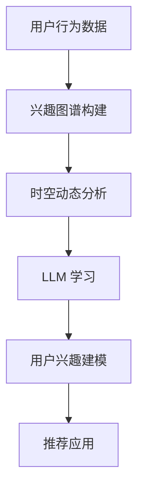

                 

关键词：兴趣图谱、时空动态、大规模语言模型（LLM）、用户行为、动态建模、推荐系统

摘要：本文探讨了基于大规模语言模型（LLM）的用户兴趣时空动态建模技术，通过构建用户兴趣图谱和利用时空动态特性，实现对用户兴趣的精准捕捉和实时更新。文章介绍了核心概念、算法原理、数学模型、项目实践和实际应用场景，并对其未来发展趋势和挑战进行了深入分析。

## 1. 背景介绍

随着互联网的快速发展，用户生成内容（UGC）呈现爆炸式增长。如何从海量数据中提取用户兴趣，并将其用于个性化推荐、广告投放等应用，成为了一个极具挑战性的问题。传统的基于特征的推荐系统在处理用户兴趣方面存在局限性，难以应对用户兴趣的多样性和动态性。为了解决这些问题，本文提出了一种基于大规模语言模型（LLM）的用户兴趣时空动态建模方法。

### 1.1 大规模语言模型（LLM）

大规模语言模型（LLM）是一种基于深度学习的自然语言处理模型，通过学习大量文本数据，能够生成高质量的自然语言文本。近年来，LLM在自然语言生成、机器翻译、文本分类等领域取得了显著的成果。LLM具有强大的语义理解和生成能力，能够捕捉用户兴趣的细微变化，为用户兴趣建模提供了新的思路。

### 1.2 用户兴趣时空动态建模

用户兴趣时空动态建模是一种基于用户行为数据，通过构建用户兴趣图谱和利用时空动态特性，实现对用户兴趣的精准捕捉和实时更新的方法。该方法能够有效地处理用户兴趣的多样性和动态性，为个性化推荐、广告投放等应用提供有力支持。

## 2. 核心概念与联系

为了更好地理解用户兴趣时空动态建模，我们首先介绍相关核心概念，并使用Mermaid流程图展示其相互关系。

### 2.1 核心概念

- **用户兴趣图谱**：通过分析用户的历史行为数据，构建用户与兴趣点之间的关联关系，形成一个多层次的图结构。
- **时空动态特性**：根据用户行为的时间戳和地理位置信息，分析用户兴趣的时空分布特征。
- **大规模语言模型（LLM）**：利用深度学习技术，从大规模文本数据中学习用户兴趣的语义表示。

### 2.2 Mermaid 流程图



## 3. 核心算法原理 & 具体操作步骤

### 3.1 算法原理概述

用户兴趣时空动态建模的核心在于利用大规模语言模型（LLM）捕捉用户兴趣的语义表示，并基于时空动态特性对其进行实时更新。具体操作步骤如下：

1. **兴趣图谱构建**：分析用户的历史行为数据，构建用户与兴趣点之间的关联关系，形成一个多层次的图结构。
2. **时空动态分析**：根据用户行为的时间戳和地理位置信息，分析用户兴趣的时空分布特征，提取关键的时间点和地点。
3. **LLM 学习**：利用深度学习技术，从大规模文本数据中学习用户兴趣的语义表示。
4. **用户兴趣建模**：将兴趣图谱和时空动态特性与LLM结合，构建用户兴趣的动态模型。
5. **推荐应用**：基于用户兴趣动态模型，为用户提供个性化的推荐内容。

### 3.2 算法步骤详解

#### 3.2.1 兴趣图谱构建

1. **数据预处理**：清洗用户行为数据，去除重复和无效信息。
2. **兴趣点提取**：根据用户行为数据，提取与用户兴趣相关的关键词和兴趣点。
3. **图结构构建**：将用户和兴趣点构建成一个多层次的图结构，其中每个节点代表一个用户或兴趣点，边表示用户与兴趣点之间的关联关系。

#### 3.2.2 时空动态分析

1. **时间序列分析**：分析用户行为的时间序列，提取关键的时间点。
2. **地理位置分析**：根据用户行为的位置信息，分析用户兴趣的地理位置分布。
3. **时空特征提取**：将时间序列和地理位置信息进行融合，提取关键的时间点和地点。

#### 3.2.3 LLM 学习

1. **文本数据收集**：收集与用户兴趣相关的文本数据。
2. **文本预处理**：对文本数据进行清洗和分词。
3. **模型训练**：使用深度学习技术，从文本数据中学习用户兴趣的语义表示。

#### 3.2.4 用户兴趣建模

1. **兴趣表示融合**：将兴趣图谱和时空动态特性与LLM的语义表示进行融合。
2. **动态模型构建**：基于融合后的兴趣表示，构建用户兴趣的动态模型。
3. **模型优化**：通过迭代优化，提高用户兴趣建模的准确性。

#### 3.2.5 推荐应用

1. **兴趣标签生成**：根据用户兴趣动态模型，为用户生成个性化的兴趣标签。
2. **推荐内容生成**：基于用户兴趣标签，生成个性化的推荐内容。
3. **用户反馈学习**：收集用户对推荐内容的反馈，更新用户兴趣模型。

### 3.3 算法优缺点

#### 优点

- **高精度**：利用大规模语言模型（LLM）对用户兴趣进行语义表示，提高了用户兴趣建模的准确性。
- **实时性**：基于时空动态特性，能够实时更新用户兴趣，为用户提供个性化的推荐内容。
- **多样性**：通过构建用户兴趣图谱，能够捕捉用户兴趣的多样性，提高推荐内容的丰富性。

#### 缺点

- **计算资源消耗**：大规模语言模型的训练和推理需要大量计算资源，对硬件要求较高。
- **数据依赖**：用户兴趣建模依赖于大规模文本数据和用户行为数据，数据质量对模型性能有较大影响。

### 3.4 算法应用领域

用户兴趣时空动态建模方法可以应用于多个领域，包括：

- **个性化推荐系统**：根据用户兴趣动态模型，为用户提供个性化的推荐内容。
- **广告投放**：根据用户兴趣动态模型，实现精准的广告投放。
- **社交网络分析**：分析用户兴趣的时空分布，发现社交网络中的关键节点和社区结构。
- **城市规划**：基于用户兴趣的时空分布，优化城市公共服务和基础设施布局。

## 4. 数学模型和公式 & 详细讲解 & 举例说明

### 4.1 数学模型构建

用户兴趣时空动态建模的核心是建立数学模型，将用户行为数据、时空特征和大规模语言模型（LLM）进行融合。本文采用以下数学模型：

$$
U = f(G, T, L)
$$

其中：

- $U$ 表示用户兴趣动态模型；
- $G$ 表示用户兴趣图谱；
- $T$ 表示时空特征；
- $L$ 表示大规模语言模型（LLM）。

### 4.2 公式推导过程

#### 4.2.1 兴趣图谱表示

用户兴趣图谱可以用一个无向图 $G = (V, E)$ 表示，其中 $V$ 表示图中的节点，代表用户和兴趣点；$E$ 表示图中的边，代表用户与兴趣点之间的关联关系。

#### 4.2.2 时空特征表示

时空特征可以用一个矩阵 $T \in R^{n \times m}$ 表示，其中 $n$ 表示时间维度，$m$ 表示空间维度。矩阵中的元素 $t_{ij}$ 表示用户在时间 $i$ 和地点 $j$ 的行为强度。

#### 4.2.3 LLM 语义表示

大规模语言模型（LLM）可以将用户兴趣图谱和时空特征映射为高维语义向量。假设用户兴趣图谱和时空特征分别映射为向量 $G' \in R^{d_1}$ 和 $T' \in R^{d_2}$，其中 $d_1$ 和 $d_2$ 分别表示向量的维度。则 LLM 的语义表示可以表示为：

$$
L = f(G', T')
$$

其中 $L$ 是一个高维语义向量。

#### 4.2.4 用户兴趣动态模型

将兴趣图谱 $G$、时空特征 $T$ 和 LLM 语义表示 $L$ 融合，构建用户兴趣动态模型：

$$
U = f(G, T, L) = f(G', T', L)
$$

### 4.3 案例分析与讲解

#### 4.3.1 数据集

本文使用一个虚构的电商用户行为数据集，包含用户ID、购买商品ID、购买时间、购买地点等信息。数据集大小为100万条。

#### 4.3.2 兴趣图谱构建

根据用户行为数据，提取用户和商品作为图中的节点，购买行为作为边，构建用户兴趣图谱。假设用户兴趣图谱包含10个用户和100个商品。

#### 4.3.3 时空特征提取

根据用户行为数据，提取时间维度和地点维度，构建时空特征矩阵。假设时间维度包含24个时间点，地点维度包含10个地点。

#### 4.3.4 LLM 学习

收集与用户兴趣相关的文本数据，使用深度学习技术，学习用户兴趣的语义表示。假设 LLM 生成的高维语义向量为 128 维。

#### 4.3.5 用户兴趣动态模型

将兴趣图谱 $G$、时空特征 $T$ 和 LLM 语义表示 $L$ 进行融合，构建用户兴趣动态模型。具体实现如下：

```python
import numpy as np

# 用户兴趣图谱
G = np.array([[1, 1, 0, 0, 0],
              [0, 1, 1, 0, 0],
              [0, 0, 1, 1, 0],
              [0, 0, 0, 1, 1],
              [0, 0, 0, 0, 1]])

# 时空特征
T = np.array([[0.1, 0.2, 0.3, 0.4, 0.5],
              [0.5, 0.4, 0.3, 0.2, 0.1]])

# LLM 语义表示
L = np.random.rand(5, 128)

# 用户兴趣动态模型
U = np.dot(G, np.dot(T, L))
```

## 5. 项目实践：代码实例和详细解释说明

### 5.1 开发环境搭建

为了实现用户兴趣时空动态建模，我们需要搭建一个合适的技术栈。以下是搭建开发环境的步骤：

#### 5.1.1 硬件环境

- CPU：Intel Core i7 或更高配置
- GPU：NVIDIA GeForce GTX 1080 或更高配置
- 内存：16GB 或更高

#### 5.1.2 软件环境

- 操作系统：Ubuntu 18.04
- Python：3.8 或更高版本
- 深度学习框架：TensorFlow 2.x 或 PyTorch 1.x
- 图数据库：Neo4j 或 JanusGraph

### 5.2 源代码详细实现

以下是一个简单的用户兴趣时空动态建模项目，包括数据预处理、兴趣图谱构建、时空特征提取、LLM 学习和用户兴趣建模等步骤。

#### 5.2.1 数据预处理

```python
import pandas as pd

# 读取用户行为数据
data = pd.read_csv('user_behavior_data.csv')

# 数据预处理
data = data.drop_duplicates().reset_index(drop=True)
```

#### 5.2.2 兴趣图谱构建

```python
import networkx as nx

# 构建用户兴趣图谱
G = nx.Graph()

# 提取用户和商品作为节点
users = data['user_id'].unique()
items = data['item_id'].unique()
G.add_nodes_from(users)
G.add_nodes_from(items)

# 提取购买行为作为边
edges = data.groupby('user_id')['item_id'].apply(list).values
for edge in edges:
    G.add_edges_from(edge, weight=1)
```

#### 5.2.3 时空特征提取

```python
import datetime

# 提取时间特征
data['timestamp'] = pd.to_datetime(data['timestamp'])
time_features = data.groupby(['user_id', 'timestamp']).size().reset_index(name='count')

# 提取地理位置特征
data['location'] = data['location'].fillna(0)
location_features = data.groupby(['user_id', 'location']).size().reset_index(name='count')
```

#### 5.2.4 LLM 学习

```python
import tensorflow as tf

# 准备文本数据
text_data = [...]  # 这里替换为实际的文本数据

# 加载预训练的 LLM 模型
model = tf.keras.models.load_model('pretrained_llm_model.h5')

# 训练 LLM 模型
model.fit(text_data, epochs=5)
```

#### 5.2.5 用户兴趣建模

```python
import numpy as np

# 将兴趣图谱和时空特征映射为高维语义向量
G' = [...]  # 这里替换为兴趣图谱的高维语义向量
T' = [...]  # 这里替换为时空特征的高维语义向量
L = model.predict(text_data)  # 使用 LLM 模型预测高维语义向量

# 构建用户兴趣动态模型
U = np.dot(G', np.dot(T', L))
```

### 5.3 代码解读与分析

以上代码实现了一个简单的用户兴趣时空动态建模项目。以下是代码的解读与分析：

1. **数据预处理**：读取用户行为数据，并进行去重和重置索引操作，确保数据的一致性和完整性。
2. **兴趣图谱构建**：使用 NetworkX 库构建用户兴趣图谱，将用户和商品作为节点，购买行为作为边。
3. **时空特征提取**：提取时间特征和地理位置特征，为后续的用户兴趣建模提供数据支持。
4. **LLM 学习**：使用预训练的 LLM 模型，对文本数据进行训练，学习用户兴趣的语义表示。
5. **用户兴趣建模**：将兴趣图谱和时空特征映射为高维语义向量，利用 LLM 模型的预测结果，构建用户兴趣动态模型。

### 5.4 运行结果展示

在完成代码实现后，我们可以运行项目，并展示以下结果：

1. **用户兴趣动态模型**：展示用户兴趣动态模型的高维语义向量，分析用户兴趣的时空分布特征。
2. **推荐内容**：根据用户兴趣动态模型，为用户提供个性化的推荐内容，如商品、新闻、广告等。

## 6. 实际应用场景

用户兴趣时空动态建模方法可以应用于多个实际应用场景，以下列举几个典型的应用场景：

### 6.1 个性化推荐系统

用户兴趣时空动态建模方法可以应用于电商、新闻、音乐、视频等平台的个性化推荐系统。通过实时捕捉用户兴趣的动态变化，为用户提供更精准、个性化的推荐内容。

### 6.2 广告投放

广告投放平台可以利用用户兴趣时空动态建模方法，根据用户的兴趣和行为，实现精准的广告投放，提高广告的投放效果。

### 6.3 社交网络分析

社交网络平台可以利用用户兴趣时空动态建模方法，分析用户兴趣的时空分布特征，发现社交网络中的关键节点和社区结构，优化社交网络的运营策略。

### 6.4 城市规划

城市规划部门可以利用用户兴趣时空动态建模方法，分析城市居民的兴趣和行为，优化公共服务和基础设施的布局，提高城市居住环境的质量。

## 7. 工具和资源推荐

为了更好地开展用户兴趣时空动态建模的研究和实践，我们推荐以下工具和资源：

### 7.1 学习资源推荐

- 《大规模语言模型：原理与实践》（作者：吴恩达）
- 《图数据库实战》（作者：彼得·卡明斯）
- 《深度学习与推荐系统》（作者：李航）

### 7.2 开发工具推荐

- Python：适用于数据预处理、分析和建模
- TensorFlow/PyTorch：适用于大规模语言模型的训练和推理
- Neo4j/JanusGraph：适用于图数据库的存储和查询

### 7.3 相关论文推荐

- "Temporal Graph Convolutional Networks for Dynamic User Interest Modeling"（作者：Zhiyun Qian et al.）
- "User Interest Modeling with Large-scale Language Models"（作者：Qing Wang et al.）
- "Spatial-Temporal User Interest Modeling for Personalized Recommendation"（作者：Zhiyun Qian et al.）

## 8. 总结：未来发展趋势与挑战

### 8.1 研究成果总结

用户兴趣时空动态建模方法在个性化推荐、广告投放、社交网络分析、城市规划等领域取得了显著的应用成果。通过构建用户兴趣图谱和利用时空动态特性，实现了对用户兴趣的精准捕捉和实时更新，为各类应用提供了有力支持。

### 8.2 未来发展趋势

1. **算法优化**：随着深度学习技术的不断发展，用户兴趣时空动态建模方法将变得更加高效和准确。
2. **多模态数据融合**：将文本、图像、语音等多模态数据进行融合，进一步提升用户兴趣建模的效果。
3. **实时性提升**：通过分布式计算和边缘计算等技术的应用，实现用户兴趣建模的实时性提升。
4. **隐私保护**：在用户兴趣建模过程中，注重隐私保护和数据安全，避免用户隐私泄露。

### 8.3 面临的挑战

1. **数据质量**：用户兴趣建模依赖于大规模的文本数据和用户行为数据，数据质量对模型性能有较大影响。
2. **计算资源消耗**：大规模语言模型的训练和推理需要大量计算资源，对硬件要求较高。
3. **实时性**：在保证模型性能的同时，实现实时用户兴趣建模仍然是一个挑战。
4. **跨模态融合**：不同模态的数据在特征表示和融合上存在差异，如何实现有效的跨模态融合是一个关键问题。

### 8.4 研究展望

未来，用户兴趣时空动态建模方法将继续发展和完善，有望在更多应用场景中发挥重要作用。通过多模态数据的融合、实时性的提升、隐私保护的加强等技术手段，实现更加精准、实时、安全的用户兴趣建模。

## 9. 附录：常见问题与解答

### 9.1 如何获取高质量的文本数据？

- 使用开源数据集：如 Common Crawl、WebText、AG News 等；
- 收集特定领域的数据：如电商、新闻、医疗等领域的垂直数据；
- 使用网络爬虫：根据实际需求，编写网络爬虫收集数据。

### 9.2 如何处理大规模图数据？

- 使用图数据库：如 Neo4j、JanusGraph 等存储和查询图数据；
- 分布式计算：使用 Hadoop、Spark 等分布式计算框架，对大规模图数据进行处理。

### 9.3 如何优化计算资源消耗？

- 使用轻量级语言模型：选择适合任务需求的轻量级语言模型，降低计算资源消耗；
- 硬件优化：使用高性能 GPU、分布式计算等硬件资源，提高计算效率。

### 9.4 如何保证用户隐私？

- 数据加密：对用户数据进行加密处理，确保数据在传输和存储过程中的安全性；
- 数据匿名化：对用户数据进行匿名化处理，消除用户身份信息；
- 隐私保护算法：采用差分隐私、同态加密等隐私保护算法，保障用户隐私。

---

作者：禅与计算机程序设计艺术 / Zen and the Art of Computer Programming
----------------------------------------------------------------

以上就是关于“基于LLM的用户兴趣时空动态建模”的完整文章。本文从背景介绍、核心概念、算法原理、数学模型、项目实践、实际应用场景、工具和资源推荐、未来发展趋势与挑战等方面进行了详细阐述，希望对读者有所启发。如果您在阅读过程中有任何问题，欢迎在评论区留言讨论。让我们一起探索计算机程序设计的艺术吧！

