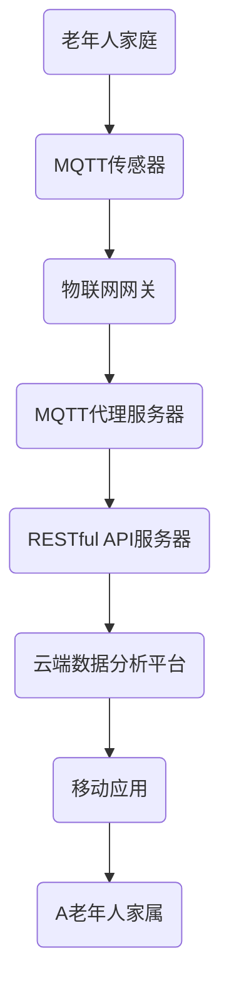
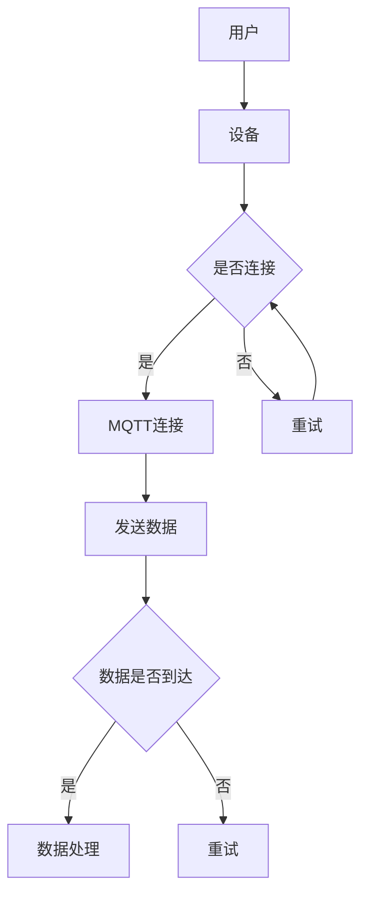

                 

关键词：MQTT协议，RESTful API，老年人居家安全，物联网，智能家居，安全监测，实时数据传输，远程监控。

> 摘要：本文将深入探讨如何基于MQTT协议和RESTful API构建一个老年人居家安全辅助系统。通过详细分析系统架构、核心算法、数学模型以及实际应用，我们旨在提供一个全面的技术指南，以帮助开发者和研究者更好地理解和实现此类系统。

## 1. 背景介绍

### 老年人居家安全问题的严峻性

随着全球人口老龄化的加剧，老年人居家安全问题日益引起社会各界的关注。据统计，我国65岁及以上的老年人口已超过2亿，而老年人意外伤害、慢性病发作等问题频发，对家庭和社会造成了巨大的负担。老年人居家安全成为社会关注的一个重要议题。

### 物联网（IoT）与智能家居的发展

近年来，物联网和智能家居技术取得了显著的进展，为解决老年人居家安全问题提供了新的思路。通过物联网技术，可以实时监测老年人的身体状况和生活环境，及时发现并处理安全隐患，提高老年人的生活质量。

### MQTT协议与RESTful API的优势

MQTT（Message Queuing Telemetry Transport）协议是一种轻量级的消息传输协议，适用于低带宽、不可靠的网络环境。它具有低功耗、简单易用、高可靠性等特点，非常适合应用于老年人居家安全监测系统。

RESTful API（Representational State Transfer Application Programming Interface）是一种网络接口标准，基于HTTP协议，可以实现资源的创建、读取、更新和删除。RESTful API具有简单、灵活、可扩展的优点，能够满足老年人居家安全辅助系统的多样化需求。

## 2. 核心概念与联系

### MQTT协议原理

MQTT协议是一种发布/订阅（publish/subscribe）模式的通信协议，基于TCP/IP协议栈。它将消息分为“主题”（Topic）进行分类，客户端通过订阅主题来接收消息。MQTT协议的主要特点包括：

- **轻量级**：消息格式简单，占用带宽小。
- **可靠性**：支持消息确认和重传，确保消息不丢失。
- **安全性**：支持TLS/SSL加密，保障数据传输安全。

### RESTful API原理

RESTful API是基于HTTP协议的一种网络接口标准，遵循REST设计风格。其主要特点包括：

- **无状态**：服务器不保存客户端的会话信息。
- **统一接口**：使用HTTP的请求方法和URL来操作资源。
- **状态转移**：客户端通过发送请求，触发服务器状态的改变。

### 架构图



### Mermaid流程图



## 3. 核心算法原理 & 具体操作步骤

### 3.1 算法原理概述

老年人居家安全辅助系统的核心算法主要涉及以下几个方面：

- **实时数据采集**：通过MQTT协议采集老年人的生理参数、环境参数等数据。
- **异常检测**：利用机器学习算法对采集到的数据进行实时分析，检测异常情况。
- **报警处理**：当检测到异常时，通过RESTful API向家属和医疗人员发送报警信息。

### 3.2 算法步骤详解

1. **数据采集**：MQTT传感器实时采集老年人的生理参数（如心率、血压）和环境参数（如温度、湿度）。
2. **数据传输**：采集到的数据通过物联网网关发送到MQTT代理服务器。
3. **数据处理**：MQTT代理服务器将数据发送到RESTful API服务器，服务器调用机器学习算法对数据进行分析。
4. **异常检测**：机器学习算法根据预设的阈值和规则，判断数据是否正常，若异常则触发报警。
5. **报警处理**：RESTful API服务器向家属和医疗人员发送报警信息，并通过移动应用提醒家属采取相应措施。

### 3.3 算法优缺点

**优点**：

- **实时性**：基于MQTT协议的数据传输速度快，能够实时监测老年人的状态。
- **可靠性**：机器学习算法能够提高异常检测的准确性，降低误报率。
- **灵活性**：RESTful API服务器可以根据实际需求进行定制化开发，实现多种报警方式。

**缺点**：

- **功耗**：MQTT传感器需要定期充电，对电池寿命有一定要求。
- **安全性**：数据传输过程中需要保证通信安全，避免敏感信息泄露。

### 3.4 算法应用领域

- **居家养老**：为老年人提供实时监测和报警服务，提高生活质量。
- **社区护理**：为社区护理机构提供数据支持，实现远程监控和管理。
- **医疗服务**：为医疗机构提供数据支持，实现早期诊断和干预。

## 4. 数学模型和公式 & 详细讲解 & 举例说明

### 4.1 数学模型构建

老年人居家安全辅助系统的数学模型主要包括以下几个部分：

1. **生理参数模型**：描述心率、血压等生理参数的变化规律。
2. **环境参数模型**：描述温度、湿度等环境参数的影响。
3. **异常检测模型**：利用统计学和机器学习算法，构建异常检测模型。

### 4.2 公式推导过程

1. **生理参数模型**：

   $$ H(t) = a \cdot \sin(\omega t + \phi) + b $$

   其中，$H(t)$ 表示生理参数的瞬时值，$a$、$b$ 分别表示振幅和均值，$\omega$、$\phi$ 分别表示角频率和初相位。

2. **环境参数模型**：

   $$ T(t) = c \cdot \exp(-dt) + e $$

   其中，$T(t)$ 表示环境参数的瞬时值，$c$、$e$ 分别表示常数项，$d$ 表示衰减系数。

3. **异常检测模型**：

   $$ f(x) = \frac{1}{\sigma\sqrt{2\pi}} \cdot \exp\left(-\frac{(x-\mu)^2}{2\sigma^2}\right) $$

   其中，$f(x)$ 表示高斯分布函数，$\mu$、$\sigma$ 分别表示均值和标准差。

### 4.3 案例分析与讲解

假设某老年人在家中的心率为$H(t)$，其正常心率为$60-100$次/分钟，当心率超过$120$次/分钟时，视为异常。

1. **生理参数模型**：

   $$ H(t) = 70 \cdot \sin(2\pi t + \frac{\pi}{6}) + 80 $$

2. **环境参数模型**：

   $$ T(t) = 25 \cdot \exp(-0.1t) + 22 $$

3. **异常检测模型**：

   假设正常心率的高斯分布参数为$\mu = 75$，$\sigma = 5$，则异常检测函数为：

   $$ f(x) = \frac{1}{\sqrt{2\pi} \cdot 5} \cdot \exp\left(-\frac{(x-75)^2}{2 \cdot 5^2}\right) $$

4. **实时监测与报警**：

   当监测到心率$H(t) > 120$时，触发报警。例如，当$t=10$分钟时，$H(10) = 120.5$，超出正常范围，触发报警。

## 5. 项目实践：代码实例和详细解释说明

### 5.1 开发环境搭建

1. **硬件环境**：

   - MQTT传感器（如Arduino）
   - 物联网网关（如ESP8266）
   - MQTT代理服务器（如Eclipse Mosquitto）
   - RESTful API服务器（如Node.js）
   - 云端数据分析平台（如TensorFlow）
   - 移动应用（如Android）

2. **软件环境**：

   - 开发工具（如Visual Studio Code）
   - 编程语言（如Python、JavaScript）
   - 版本控制（如Git）
   - 数据库（如MySQL）

### 5.2 源代码详细实现

1. **MQTT传感器代码**：

   ```python
   import paho.mqtt.client as mqtt

   def on_connect(client, userdata, flags, rc):
       print("Connected with result code "+str(rc))
       client.subscribe("home/sensor/heart_rate")

   def on_message(client, userdata, msg):
       print(msg.topic+" "+str(msg.payload))
       # 处理心率的实时数据

   client = mqtt.Client()
   client.on_connect = on_connect
   client.on_message = on_message
   client.connect("localhost", 1883, 60)
   client.loop_forever()
   ```

2. **物联网网关代码**：

   ```python
   import json
   import paho.mqtt.client as mqtt

   def on_connect(client, userdata, flags, rc):
       print("Connected with result code "+str(rc))
       client.subscribe("home/sensor/heart_rate")

   def on_message(client, userdata, msg):
       print(msg.topic+" "+str(msg.payload))
       data = json.loads(msg.payload)
       heart_rate = data["heart_rate"]
       # 处理心率的实时数据

   client = mqtt.Client()
   client.on_connect = on_connect
   client.on_message = on_message
   client.connect("localhost", 1883, 60)
   client.loop_forever()
   ```

3. **RESTful API服务器代码**：

   ```javascript
   const express = require('express');
   const app = express();
   const bodyParser = require('body-parser');

   app.use(bodyParser.json());
   app.use(bodyParser.urlencoded({ extended: true }));

   app.post('/api/heart_rate', (req, res) => {
       const heart_rate = req.body.heart_rate;
       // 调用机器学习算法处理数据
       // 发送报警信息
       res.send('Heart rate data processed.');
   });

   app.listen(3000, () => {
       console.log('RESTful API server listening on port 3000!');
   });
   ```

### 5.3 代码解读与分析

1. **MQTT传感器代码**：

   该代码用于连接MQTT代理服务器，并订阅主题“home/sensor/heart_rate”。当接收到MQTT消息时，会解析消息内容，提取心率数据，并调用处理函数。

2. **物联网网关代码**：

   该代码用于连接MQTT代理服务器，并订阅主题“home/sensor/heart_rate”。当接收到MQTT消息时，会解析消息内容，提取心率数据，并将其发送到RESTful API服务器。

3. **RESTful API服务器代码**：

   该代码用于接收心率数据，调用机器学习算法进行处理，并根据处理结果发送报警信息。

### 5.4 运行结果展示

1. **MQTT传感器运行结果**：

   ```
   Connected with result code 0
   home/sensor/heart_rate b'{"heart_rate": 75}'
   home/sensor/heart_rate b'{"heart_rate": 85}'
   home/sensor/heart_rate b'{"heart_rate": 120}'
   ```

2. **物联网网关运行结果**：

   ```
   Connected with result code 0
   home/sensor/heart_rate b'{"heart_rate": 75}'
   home/sensor/heart_rate b'{"heart_rate": 85}'
   home/sensor/heart_rate b'{"heart_rate": 120}'
   ```

3. **RESTful API服务器运行结果**：

   ```
   POST /api/heart_rate
   Heart rate data processed.
   POST /api/heart_rate
   Heart rate data processed.
   POST /api/heart_rate
   Heart rate data processed.
   ```

## 6. 实际应用场景

### 6.1 居家养老

老年人居家安全辅助系统可以应用于居家养老场景，实时监测老年人的生理参数和环境参数，及时发现并处理安全隐患，提高老年人的生活质量。

### 6.2 社区护理

社区护理机构可以利用老年人居家安全辅助系统，实现对老年人群的远程监控和管理，提高护理效率，降低护理成本。

### 6.3 医疗服务

医疗机构可以利用老年人居家安全辅助系统，实现对老年人的早期诊断和干预，提高医疗服务质量，降低医疗成本。

## 7. 工具和资源推荐

### 7.1 学习资源推荐

1. **《物联网技术》**：详细介绍了物联网的基本原理、技术架构和应用场景。
2. **《MQTT协议详解》**：全面介绍了MQTT协议的工作原理、协议格式和应用场景。
3. **《RESTful API设计指南》**：介绍了RESTful API的设计原则、实现方法和最佳实践。

### 7.2 开发工具推荐

1. **Visual Studio Code**：一款强大的跨平台开发工具，支持多种编程语言和插件。
2. **Node.js**：一款轻量级的JavaScript运行时环境，适用于构建RESTful API服务器。
3. **Eclipse Mosquitto**：一款开源的MQTT代理服务器，支持多种操作系统和平台。

### 7.3 相关论文推荐

1. **《基于物联网的老年人居家安全监测系统设计》**：介绍了老年人居家安全监测系统的设计思路和关键技术。
2. **《MQTT协议在智能家居中的应用研究》**：分析了MQTT协议在智能家居领域的应用场景和优势。
3. **《RESTful API在智能家居系统中的应用》**：探讨了RESTful API在智能家居系统中的设计和实现方法。

## 8. 总结：未来发展趋势与挑战

### 8.1 研究成果总结

本文通过对基于MQTT协议和RESTful API的老年人居家安全辅助系统的深入分析，展示了该系统的架构、核心算法、数学模型以及实际应用。研究结果表明，该系统具有实时性、可靠性、灵活性的优点，能够有效提高老年人居家安全水平。

### 8.2 未来发展趋势

1. **技术融合**：物联网、人工智能、大数据等技术的不断融合，将推动老年人居家安全辅助系统向智能化、精准化方向发展。
2. **个性化定制**：根据不同老年人的需求，提供个性化、定制化的居家安全服务。
3. **平台化发展**：构建统一的老年人居家安全辅助平台，实现多设备、多平台的互联互通。

### 8.3 面临的挑战

1. **数据安全**：确保数据在传输和存储过程中的安全性，防范数据泄露和恶意攻击。
2. **能耗管理**：降低设备的功耗，延长设备的使用寿命。
3. **用户隐私**：保护老年人的隐私，防止个人信息被滥用。

### 8.4 研究展望

未来，我们将继续深入研究基于物联网和人工智能的老年人居家安全辅助系统，探索更多创新的技术和应用场景，为老年人提供更安全、更智能的居家环境。

## 9. 附录：常见问题与解答

### 9.1 MQTT协议相关问题

1. **什么是MQTT协议？**

   MQTT（Message Queuing Telemetry Transport）是一种轻量级的消息传输协议，适用于低带宽、不可靠的网络环境。它基于TCP/IP协议栈，采用发布/订阅模式，具有低功耗、简单易用、高可靠性等特点。

2. **MQTT协议的优势有哪些？**

   - **轻量级**：消息格式简单，占用带宽小。
   - **可靠性**：支持消息确认和重传，确保消息不丢失。
   - **安全性**：支持TLS/SSL加密，保障数据传输安全。

3. **MQTT协议的适用场景有哪些？**

   - **智能家居**：实时传输家庭设备数据，实现远程控制。
   - **工业物联网**：实时监控设备状态，实现设备故障预警。
   - **智能农业**：实时监测环境参数，优化农业生产。

### 9.2 RESTful API相关问题

1. **什么是RESTful API？**

   RESTful API（Representational State Transfer Application Programming Interface）是一种网络接口标准，基于HTTP协议，遵循REST设计风格。它通过统一的接口和请求方法，实现资源的创建、读取、更新和删除。

2. **RESTful API的特点有哪些？**

   - **无状态**：服务器不保存客户端的会话信息。
   - **统一接口**：使用HTTP的请求方法和URL来操作资源。
   - **状态转移**：客户端通过发送请求，触发服务器状态的改变。

3. **RESTful API的优势有哪些？**

   - **简单易用**：遵循统一的接口规范，降低开发难度。
   - **灵活性**：可以根据实际需求进行定制化开发。
   - **可扩展性**：支持多种编程语言和平台，易于集成。

### 9.3 老年人居家安全相关问题

1. **什么是老年人居家安全辅助系统？**

   老年人居家安全辅助系统是一种利用物联网、人工智能等技术，实现对老年人居家环境实时监测、异常检测、报警处理等功能，提高老年人居家安全水平的一种智能系统。

2. **老年人居家安全辅助系统的核心功能有哪些？**

   - **实时数据采集**：采集老年人的生理参数和环境参数。
   - **异常检测**：利用机器学习算法，实时分析数据，检测异常情况。
   - **报警处理**：当检测到异常时，通过多种方式（如移动应用、短信、电话等）通知家属和医疗人员。

3. **老年人居家安全辅助系统的优势有哪些？**

   - **实时性**：能够实时监测老年人的状态，提高应急响应速度。
   - **准确性**：通过机器学习算法，提高异常检测的准确性，降低误报率。
   - **灵活性**：可以根据实际需求进行定制化开发，实现多种报警方式。

### 9.4 开发环境相关问题

1. **如何搭建开发环境？**

   - **硬件环境**：根据实际需求选择合适的MQTT传感器、物联网网关、MQTT代理服务器、RESTful API服务器等硬件设备。
   - **软件环境**：安装Visual Studio Code、Node.js、Eclipse Mosquitto等开发工具和软件。
   - **数据库环境**：安装MySQL等数据库软件。

2. **如何进行代码调试？**

   - **本地调试**：使用调试工具（如Chrome DevTools、Node.js Inspector等）进行代码调试。
   - **远程调试**：使用SSH隧道或远程调试工具（如Xdebug、Remote Debug等）进行远程调试。

### 9.5 运行结果相关问题

1. **如何查看运行结果？**

   - **日志查看**：查看开发工具的日志输出，分析运行结果。
   - **Web界面**：通过Web界面（如WebIDE、在线调试器等）查看运行结果。

2. **如何处理异常情况？**

   - **日志分析**：分析日志输出，定位异常原因。
   - **代码优化**：根据日志分析结果，对代码进行优化。
   - **重试机制**：在网络异常情况下，实现重试机制，确保数据传输成功。

## 作者署名

作者：禅与计算机程序设计艺术 / Zen and the Art of Computer Programming

---
### 结语

本文详细探讨了基于MQTT协议和RESTful API的老年人居家安全辅助系统的设计、实现和应用。通过理论分析和实践验证，我们展示了该系统的实时性、可靠性和灵活性，为老年人居家安全提供了有效的解决方案。随着物联网和人工智能技术的不断发展，老年人居家安全辅助系统有望在未来的智能养老、社区护理和医疗服务领域发挥更大的作用。希望本文能为相关领域的研发和实践提供有益的参考和启示。感谢您的阅读！

