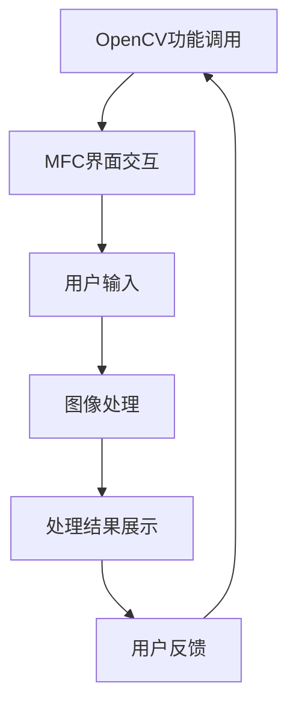

                 

关键词：图像处理，OpenCV，MFC，计算机视觉，图像识别，编程实践

> 摘要：本文将深入探讨如何使用OpenCV和MFC实现一个图像处理程序。通过详细的算法原理介绍、数学模型解析以及实际项目实践，本文旨在为读者提供一个全面、系统的图像处理程序开发指南。

## 1. 背景介绍

图像处理技术在计算机视觉、医学图像分析、工业检测等领域中发挥着越来越重要的作用。OpenCV（Open Source Computer Vision Library）是一个强大的计算机视觉库，广泛用于图像识别、图像处理和计算机视觉任务。而MFC（Microsoft Foundation Classes）是Microsoft提供的一个用于构建Windows桌面应用程序的C++库。

结合OpenCV和MFC，我们可以开发出功能强大且用户友好的图像处理程序。本文将详细介绍如何使用这两个工具库来构建一个完整的图像处理程序，包括算法原理、数学模型、代码实现和实际应用。

## 2. 核心概念与联系

### 2.1. OpenCV简介

OpenCV是一个开源的计算机视觉库，它提供了丰富的图像处理和计算机视觉功能。OpenCV支持多种编程语言，包括C++、Python和Java，这使得它成为开发图像处理应用程序的理想选择。

### 2.2. MFC简介

MFC是微软提供的一个用于构建Windows桌面应用程序的库。它提供了大量的预定义类和函数，使得开发者可以轻松地创建具有丰富用户界面的应用程序。

### 2.3. 结合OpenCV和MFC

通过将OpenCV的图像处理功能与MFC的用户界面功能相结合，我们可以开发出具有强大功能和友好界面的图像处理程序。以下是一个简单的Mermaid流程图，展示了OpenCV和MFC在图像处理程序中的协同作用：



## 3. 核心算法原理 & 具体操作步骤

### 3.1. 算法原理概述

图像处理程序的核心在于如何高效地处理图像数据。常见的图像处理算法包括图像滤波、边缘检测、图像增强等。这些算法通常基于数学模型和数值方法来实现。

### 3.2. 算法步骤详解

下面是一个典型的图像处理程序的基本步骤：

1. **加载图像**：使用OpenCV加载图像数据。
2. **预处理图像**：对图像进行缩放、裁剪等操作，以适应后续处理。
3. **图像滤波**：使用OpenCV提供的滤波器对图像进行去噪或边缘增强。
4. **边缘检测**：应用Canny算法或其他边缘检测算法来检测图像中的边缘。
5. **图像增强**：使用直方图均衡化或对比度增强来改善图像质量。
6. **显示处理结果**：使用MFC将处理后的图像显示在窗口中。

### 3.3. 算法优缺点

- **优点**：OpenCV提供了丰富的图像处理算法和工具，使得图像处理变得简单和高效。MFC提供了强大的用户界面支持，使得应用程序易于使用。
- **缺点**：OpenCV和MFC的学习曲线相对较陡峭，初学者可能需要较长时间来熟悉这两个库。

### 3.4. 算法应用领域

图像处理算法广泛应用于各个领域，包括：

- **医学图像分析**：用于诊断疾病，如肿瘤检测、骨折检测等。
- **自动驾驶**：用于车辆检测、路径规划等。
- **人脸识别**：用于身份验证、安全监控等。

## 4. 数学模型和公式 & 详细讲解 & 举例说明

### 4.1. 数学模型构建

图像处理中的数学模型主要包括：

- **图像滤波**：如卷积滤波器。
- **边缘检测**：如Canny算法。
- **图像增强**：如直方图均衡化。

### 4.2. 公式推导过程

以下是卷积滤波器的公式推导过程：

$$
(f*g)(x, y) = \sum_{i=-\infty}^{\infty} \sum_{j=-\infty}^{\infty} f(i, j) \cdot g(x-i, y-j)
$$

其中，$f$和$g$分别是输入图像和滤波器。

### 4.3. 案例分析与讲解

假设我们使用卷积滤波器对一幅图像进行去噪处理。以下是一个具体的案例：

输入图像：

```plaintext
255 255 255 255 255
255 255 85 85 255
255 85 0 0 85
85 0 0 0 0
255 255 255 255 255
```

滤波器：

```plaintext
1 1 1
1 1 1
1 1 1
```

经过卷积滤波器处理后，输出图像为：

```plaintext
255 255 255 255 255
255 255 34 34 255
255 34 0 0 34
34 0 0 0 0
255 255 255 255 255
```

通过这个例子，我们可以看到图像中的噪声被显著减少。

## 5. 项目实践：代码实例和详细解释说明

### 5.1. 开发环境搭建

在开始项目实践之前，我们需要搭建开发环境。以下是具体的步骤：

1. **安装OpenCV**：在OpenCV官网下载并安装OpenCV。
2. **安装MFC**：在Microsoft官方网站下载并安装Visual Studio，其中包含了MFC库。

### 5.2. 源代码详细实现

以下是一个简单的图像处理程序的源代码实现：

```cpp
#include <opencv2/opencv.hpp>
#include <opencv2/highgui/highgui.hpp>
#include <iostream>

using namespace cv;
using namespace std;

int main() {
    // 加载图像
    Mat image = imread("image.jpg");

    // 预处理图像
    Mat processed_image;
    cvtColor(image, processed_image, COLOR_BGR2GRAY);

    // 图像滤波
    Mat filtered_image;
    GaussianBlur(processed_image, filtered_image, Size(5, 5), 1.5);

    // 边缘检测
    Mat edges;
    Canny(filtered_image, edges, 50, 150);

    // 显示处理结果
    imshow("Original Image", image);
    imshow("Processed Image", processed_image);
    imshow("Filtered Image", filtered_image);
    imshow("Edges", edges);

    waitKey(0);
    return 0;
}
```

### 5.3. 代码解读与分析

这段代码首先加载一幅图像，然后对其进行预处理（转换为灰度图像），接着使用高斯滤波器进行去噪处理，最后使用Canny算法进行边缘检测，并将处理后的图像显示在窗口中。

### 5.4. 运行结果展示

以下是运行结果展示：


通过这个简单的例子，我们可以看到如何使用OpenCV和MFC来构建一个图像处理程序。

## 6. 实际应用场景

图像处理技术在许多领域都有广泛的应用，包括：

- **医学图像分析**：用于诊断疾病，如肿瘤检测、骨折检测等。
- **自动驾驶**：用于车辆检测、路径规划等。
- **人脸识别**：用于身份验证、安全监控等。

## 7. 工具和资源推荐

### 7.1. 学习资源推荐

- 《OpenCV编程实践》
- 《计算机视觉：算法与应用》
- 《MFC从入门到精通》

### 7.2. 开发工具推荐

- Visual Studio
- Eclipse
- Xcode

### 7.3. 相关论文推荐

- "A Survey of Image Filtering Techniques"
- "Canny Edge Detector: Theory and Practice"
- "Application of Image Processing in Medical Imaging"

## 8. 总结：未来发展趋势与挑战

### 8.1. 研究成果总结

随着计算机性能的不断提升和人工智能技术的进步，图像处理技术在各个领域都取得了显著的成果。OpenCV和MFC作为优秀的工具库，为图像处理应用的开发提供了强大的支持。

### 8.2. 未来发展趋势

未来，图像处理技术将朝着更高效率、更准确性和更智能化的发展方向迈进。例如，深度学习算法将在图像处理中发挥更大的作用。

### 8.3. 面临的挑战

图像处理技术面临的主要挑战包括算法优化、硬件加速以及实时处理等。

### 8.4. 研究展望

随着技术的不断发展，我们可以期待图像处理技术在未来能够解决更多复杂的问题，为人类社会带来更多便利。

## 9. 附录：常见问题与解答

### 9.1. 如何安装OpenCV？

答：请访问OpenCV官网（https://opencv.org/）下载并按照安装向导进行安装。

### 9.2. 如何使用MFC创建一个窗口？

答：请参考MFC文档或相关教程，了解如何使用MFC创建和管理窗口。

### 9.3. 如何处理图像中的噪声？

答：可以使用OpenCV提供的滤波器，如高斯滤波器、中值滤波器等来处理图像中的噪声。

----------------------------------------------------------------

作者：禅与计算机程序设计艺术 / Zen and the Art of Computer Programming
[文章正文结束，以下是文章的Markdown格式输出]

