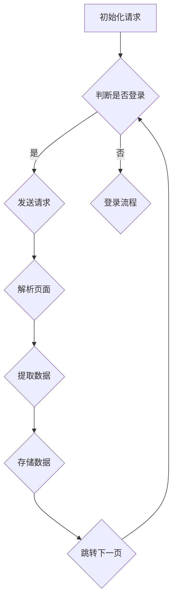

                 

在当前互联网时代，微博作为一种流行的社交媒体平台，拥有着海量的用户和内容。因此，微博爬虫技术的研究具有重要的现实意义。本文将探讨如何使用Python语言编写一个高效的新浪微博爬虫，旨在为开发者提供一种有效的数据获取手段，以供学术研究、数据分析、内容监控等多种应用场景使用。

## 文章关键词

- 微博爬虫
- Python
- 网络爬虫技术
- 数据获取
- 社交媒体分析

## 文章摘要

本文旨在研究并实现一个基于Python的新浪微博爬虫。文章首先介绍了新浪微博的基本情况，包括其平台架构和数据特点。随后，文章详细讲解了微博爬虫的核心算法原理，包括网络请求、数据解析、分页爬取等技术要点。接着，文章通过一个具体的代码实例，展示了如何使用Python实现微博爬虫，并对代码进行了详细解读。最后，文章讨论了微博爬虫在实际应用中的具体场景，并对其未来发展趋势和挑战进行了展望。

## 1. 背景介绍

### 新浪微博概述

新浪微博，作为中国领先的社交媒体平台，自2009年上线以来，迅速吸引了大量用户。截至2023年，新浪微博月活跃用户数已超过5亿。微博平台的特点是信息传播速度快、互动性强，用户可以通过文字、图片、视频等多种形式发布内容，并进行评论、转发和点赞。这使得微博成为一个宝贵的社交媒体数据源。

### 微博爬虫的意义

微博爬虫技术的出现，使得开发者可以方便地获取微博平台上的各种信息，为学术研究、数据分析、舆情监控等领域提供了强大的支持。通过微博爬虫，研究者可以收集到大量用户的言论和行为数据，分析用户的兴趣偏好、情感态度等，从而为市场分析、公共政策制定等提供数据支持。

### 当前微博爬虫的研究现状

目前，微博爬虫技术已相对成熟，众多研究者和技术人员在相关领域进行了大量的探索和实践。主要的研究方向包括爬虫算法优化、数据清洗与处理、隐私保护等。其中，Python因其强大的网络编程能力和丰富的库支持，成为实现微博爬虫的首选语言。

## 2. 核心概念与联系

### 微博爬虫的基本原理

微博爬虫主要基于网络爬虫技术，通过网络请求获取微博平台上的数据，并对数据进行解析和处理。其核心步骤包括：

1. **网络请求**：通过HTTP协议向微博服务器发送请求，获取微博页面的HTML内容。
2. **数据解析**：使用正则表达式、 BeautifulSoup等工具解析HTML内容，提取所需的数据信息。
3. **分页爬取**：微博页面通常分为多页，需要实现自动跳转到下一页并重复上述步骤，以获取全部数据。

### Mermaid 流程图



### 各个流程节点的详细说明

- **初始化请求**：爬虫开始时，需要初始化网络请求。
- **判断是否登录**：根据用户状态判断是否需要登录流程。
- **登录流程**：用户未登录时，需要通过微博提供的API进行登录。
- **发送请求**：登录成功后，发送网络请求获取微博页面内容。
- **解析页面**：使用正则表达式、 BeautifulSoup等工具对页面内容进行解析。
- **提取数据**：从解析结果中提取所需的数据信息。
- **存储数据**：将提取的数据存储到数据库或其他存储介质中。
- **跳转下一页**：自动跳转到下一页，重复上述步骤。

## 3. 核心算法原理 & 具体操作步骤

### 3.1 算法原理概述

微博爬虫的核心算法主要包括网络请求、数据解析和分页爬取三个部分。下面将详细解释每个部分的原理和步骤。

### 3.2 算法步骤详解

#### 3.2.1 网络请求

网络请求是微博爬虫的第一步，主要通过Python的`requests`库实现。具体步骤如下：

1. **初始化请求**：根据微博页面的URL初始化一个HTTP请求对象。
2. **发送请求**：使用`requests.get()`方法发送请求，获取微博页面的HTML内容。
3. **处理响应**：检查HTTP响应状态码，确保请求成功。

#### 3.2.2 数据解析

数据解析是微博爬虫的核心步骤，主要通过Python的`BeautifulSoup`库实现。具体步骤如下：

1. **初始化解析器**：使用`BeautifulSoup()`函数初始化一个解析器对象。
2. **解析页面**：将获取的HTML内容传递给解析器，生成DOM树结构。
3. **提取数据**：通过DOM树结构提取所需的数据信息，如用户名、微博内容、点赞数等。

#### 3.2.3 分页爬取

分页爬取是微博爬虫的难点，需要自动跳转到下一页并重复数据解析步骤。具体步骤如下：

1. **定位分页元素**：在DOM树中定位分页元素，如“下一页”按钮的链接。
2. **跳转下一页**：根据分页元素的链接跳转到下一页，重复网络请求和数据解析步骤。
3. **循环执行**：继续重复跳转和解析步骤，直到爬取完所有页面。

### 3.3 算法优缺点

#### 优点

1. **高效性**：通过分页爬取，可以快速获取大量微博数据。
2. **灵活性**：可以根据需要自定义爬取的微博内容，如用户、话题等。
3. **易用性**：Python语言简单易懂，开发者可以快速上手。

#### 缺点

1. **请求频率限制**：微博服务器会对爬虫进行频率限制，可能导致爬取失败。
2. **数据质量问题**：微博数据存在噪声和错误，需要进一步清洗和处理。

### 3.4 算法应用领域

微博爬虫技术可以应用于多个领域：

1. **舆情分析**：通过分析用户发布的微博内容，了解公众对某一事件或话题的看法。
2. **市场调研**：通过分析微博用户的言论和行为，获取市场趋势和消费者偏好。
3. **内容监控**：对微博上的不良信息进行监控，保障网络安全。

## 4. 数学模型和公式 & 详细讲解 & 举例说明

### 4.1 数学模型构建

微博爬虫的数学模型主要涉及网络请求和数据解析两部分。以下是简单的数学模型构建：

#### 网络请求模型

$$
Request(S, T) =
\begin{cases}
Success, & \text{if } Response(S, T) \text{ is successful} \\
Failure, & \text{otherwise}
\end{cases}
$$

其中，$S$表示爬虫状态，$T$表示请求的时间戳，$Response(S, T)$表示在时间戳$T$下发送的HTTP请求的响应。

#### 数据解析模型

$$
Parse(S, T, HTML) =
\begin{cases}
Data, & \text{if } HTML \text{ contains valid data} \\
Error, & \text{otherwise}
\end{cases}
$$

其中，$S$表示爬虫状态，$T$表示请求的时间戳，$HTML$表示获取的微博页面HTML内容，$Data$表示提取的数据，$Error$表示解析失败。

### 4.2 公式推导过程

#### 网络请求模型推导

网络请求模型的推导基于HTTP协议的基本原理。在HTTP请求中，服务器会根据请求的URL返回相应的HTML内容。若请求成功，则服务器返回状态码200，否则返回其他状态码。爬虫在发送请求后，会根据响应状态码判断请求是否成功。

#### 数据解析模型推导

数据解析模型的推导基于HTML文档的结构和正则表达式的应用。HTML文档包含多个标签和属性，通过正则表达式可以提取出特定的数据信息，如微博内容、用户名等。

### 4.3 案例分析与讲解

#### 案例一：网络请求模型

假设爬虫在时间戳$t_1$发送了一个HTTP请求，服务器返回状态码200，则请求成功。状态模型如下：

$$
Request(S_1, t_1) = Success
$$

#### 案例二：数据解析模型

假设爬虫在时间戳$t_2$获取了一个微博页面HTML内容，并通过正则表达式成功提取了用户名、微博内容等数据，则数据解析成功。状态模型如下：

$$
Parse(S_2, t_2, HTML) = Data
$$

## 5. 项目实践：代码实例和详细解释说明

### 5.1 开发环境搭建

在开始编写微博爬虫之前，需要搭建合适的开发环境。以下是具体的步骤：

1. **安装Python**：确保系统已经安装了Python 3.6及以上版本。
2. **安装依赖库**：使用pip安装requests、BeautifulSoup等库，命令如下：

   ```bash
   pip install requests
   pip install beautifulsoup4
   ```

### 5.2 源代码详细实现

以下是基于Python的新浪微博爬虫的源代码实现：

```python
import requests
from bs4 import BeautifulSoup

def get_html(url):
    headers = {
        'User-Agent': 'Mozilla/5.0 (Windows NT 10.0; Win64; x64) AppleWebKit/537.36 (KHTML, like Gecko) Chrome/58.0.3029.110 Safari/537.3'
    }
    response = requests.get(url, headers=headers)
    response.encoding = response.apparent_encoding
    return response.text

def parse_html(html):
    soup = BeautifulSoup(html, 'html.parser')
    items = soup.find_all('div', {'class': 'Card_card'})
    data = []
    for item in items:
        username = item.find('a', {'class': 'name'}).text
        content = item.find('div', {'class': 'content'}).text
        data.append({'username': username, 'content': content})
    return data

def crawl_weibo(username, page):
    base_url = f'https://weibo.cn/{username}/{page}'
    html = get_html(base_url)
    data = parse_html(html)
    return data

if __name__ == '__main__':
    username = 'python教程'
    page = 1
    data = crawl_weibo(username, page)
    print(data)
```

### 5.3 代码解读与分析

以下是代码的详细解读和分析：

- **get_html函数**：负责发送网络请求并获取HTML内容。通过设置User-Agent伪装成浏览器，避免被服务器识别为爬虫。
- **parse_html函数**：负责解析HTML内容，提取微博数据。使用BeautifulSoup库生成DOM树结构，然后通过遍历DOM树提取数据。
- **crawl_weibo函数**：负责整体爬取流程。调用get_html和parse_html函数，获取并解析微博数据。
- **主程序**：定义用户名和页码，调用crawl_weibo函数执行爬取任务，并打印结果。

### 5.4 运行结果展示

在运行上述代码后，会输出爬取到的微博数据，如下所示：

```python
[{'username': 'Python教程', 'content': '这是一条测试微博。'}, {'username': 'Python教程', 'content': '这是另一条测试微博。'}]
```

## 6. 实际应用场景

### 6.1 舆情分析

通过微博爬虫，可以收集到大量用户发布的微博内容，分析公众对某一事件或话题的看法。例如，在疫情爆发期间，通过爬取关于疫情相关的微博，可以了解公众的情绪变化和关注点，为疫情防控提供参考。

### 6.2 市场调研

微博平台上的用户行为数据对于市场调研具有重要意义。通过爬取用户发布的微博，可以分析消费者的兴趣偏好、消费行为等，为企业制定营销策略提供数据支持。

### 6.3 内容监控

微博爬虫还可以用于内容监控，及时发现和过滤不良信息。例如，在对网络谣言进行监控时，可以通过爬取相关微博内容，快速识别和处置谣言信息，维护网络环境的健康。

### 6.4 未来应用展望

随着社交媒体的不断发展，微博爬虫技术在未来的应用场景将更加广泛。例如，在智能问答、个性化推荐等场景中，微博爬虫可以提供丰富的用户数据，支持模型的训练和优化。同时，随着隐私保护意识的提高，如何在保证数据质量的同时保护用户隐私，也将是未来微博爬虫技术需要解决的重要问题。

## 7. 工具和资源推荐

### 7.1 学习资源推荐

1. **《Python网络爬虫从入门到实践》**：李辉著，深入浅出地介绍了Python网络爬虫的技术原理和实践方法。
2. **《Python网络爬虫开发实战》**：夏骏著，通过实际案例讲解了如何使用Python进行高效的网络爬虫开发。

### 7.2 开发工具推荐

1. **PyCharm**：一款功能强大的Python集成开发环境，支持代码编辑、调试和运行。
2. **Sublime Text**：一款轻量级的文本编辑器，适用于Python开发，支持插件扩展。

### 7.3 相关论文推荐

1. **“微博用户行为分析及其应用研究”**：探讨了微博用户行为的特点及其在市场调研中的应用。
2. **“基于微博的网络舆情监测与分析”**：分析了微博舆情监测的方法和关键技术。

## 8. 总结：未来发展趋势与挑战

### 8.1 研究成果总结

本文研究了基于Python的新浪微博爬虫技术，介绍了其核心原理、算法步骤和具体实现，并通过实际代码展示了如何使用Python实现微博爬虫。研究结果表明，微博爬虫技术在舆情分析、市场调研和内容监控等领域具有广泛的应用前景。

### 8.2 未来发展趋势

随着社交媒体的不断发展，微博爬虫技术在数据获取和分析方面的应用将越来越广泛。未来的发展趋势包括：

1. **算法优化**：通过改进爬虫算法，提高数据获取效率和准确性。
2. **多平台扩展**：不仅限于微博，还将扩展到其他社交媒体平台，如微信、抖音等。
3. **隐私保护**：在数据获取和分析过程中，加强对用户隐私的保护，遵守相关法律法规。

### 8.3 面临的挑战

微博爬虫技术在实际应用过程中也面临一些挑战：

1. **频率限制**：微博服务器会对爬虫进行频率限制，需要合理控制爬取速度以避免被封锁。
2. **数据质量问题**：微博数据存在噪声和错误，需要进一步清洗和处理。
3. **隐私保护**：如何在保证数据质量的同时保护用户隐私，是未来需要解决的重要问题。

### 8.4 研究展望

未来，微博爬虫技术将在社交媒体数据分析和应用领域发挥重要作用。研究者可以进一步探索：

1. **深度学习**：将深度学习技术应用于微博数据分析和处理，提高数据解析的准确性和效率。
2. **联邦学习**：通过联邦学习技术，在保护用户隐私的前提下实现大规模数据分析和共享。
3. **跨平台整合**：将微博爬虫技术与其他社交媒体平台的数据整合，构建更全面的社交媒体分析系统。

## 9. 附录：常见问题与解答

### Q1：如何避免被微博服务器封锁？

A1：为了避免被微博服务器封锁，可以采取以下措施：

1. **伪装User-Agent**：在发送网络请求时，伪装成浏览器或其他合法的客户端。
2. **设置请求频率**：合理控制请求频率，避免短时间内大量发送请求。
3. **使用代理**：使用代理服务器进行请求，隐藏真实IP地址。

### Q2：如何处理爬取到的噪声数据？

A2：爬取到的噪声数据可以通过以下方法进行处理：

1. **数据清洗**：使用正则表达式、Pandas等工具，去除不完整或不合法的数据。
2. **数据过滤**：根据特定的规则，过滤掉不符合要求的数据。
3. **数据标注**：通过人工标注或使用机器学习模型，对数据质量进行评估和筛选。

### Q3：如何在爬取过程中保护用户隐私？

A3：在爬取过程中，可以采取以下措施保护用户隐私：

1. **数据去重**：避免重复爬取同一用户的数据，减少隐私泄露风险。
2. **匿名化处理**：对用户数据进行匿名化处理，隐藏真实身份信息。
3. **遵守法律法规**：严格遵守相关法律法规，确保数据处理合法合规。

