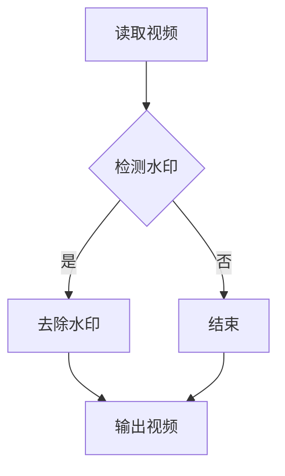

                 

 

> **关键词：** OpenCV，视频去水印，图像处理，算法实现，技术博客。

> **摘要：** 本文将深入探讨如何使用OpenCV库实现视频去水印系统。通过详细设计与具体代码实现，本文将提供一套完整、高效且易于理解的解决方案，为开发者提供实用的技术指导。

## 1. 背景介绍

在数字媒体时代，视频内容已成为传播信息的重要载体。然而，视频内容的版权保护问题也日益突出。为了防止未经授权的复制和分发，视频制作者常常会在视频上添加水印。虽然水印在一定程度上保护了版权，但也给视频的观赏性带来了负面影响。去水印技术的出现，就是为了解决这一问题，它可以从视频中去除原有的水印，使视频恢复原貌。

OpenCV（Open Source Computer Vision Library）是一个强大的计算机视觉库，它提供了丰富的图像处理和视频处理功能，广泛应用于各种计算机视觉任务。本文将介绍如何使用OpenCV实现视频去水印系统，包括核心算法原理、具体实现步骤、以及实际应用案例。

## 2. 核心概念与联系

在实现视频去水印系统之前，我们需要理解几个核心概念：

### 2.1 图像处理基础

图像处理是计算机视觉的基础，它涉及图像的获取、处理和输出。在OpenCV中，图像通常以矩阵形式表示，每个像素点的颜色由红、绿、蓝三个分量组成。

### 2.2 水印技术

水印技术主要分为两种：可视水印和隐秘水印。可视水印直接在视频上添加可见的标记，如文字或图案；而隐秘水印则将信息隐藏在视频数据中，不易被人察觉。

### 2.3 OpenCV的基本操作

OpenCV提供了丰富的函数和类，用于处理图像和视频。例如，`cv2.imread()`用于读取图像文件，`cv2.imshow()`用于显示图像，`cv2.imwrite()`用于保存图像等。

### 2.4 Mermaid流程图

为了更好地展示视频去水印系统的整体架构，我们使用Mermaid绘制了以下流程图：



## 3. 核心算法原理 & 具体操作步骤

### 3.1 算法原理概述

视频去水印系统主要分为三个步骤：读取视频、检测水印、去除水印。

1. **读取视频**：使用OpenCV读取视频文件，将其转换为帧序列。
2. **检测水印**：遍历每一帧图像，检测是否包含水印。常用的方法有颜色分割、形态学操作等。
3. **去除水印**：对于检测到的水印区域，使用图像操作函数将其去除。

### 3.2 算法步骤详解

#### 3.2.1 读取视频

```python
import cv2

video = cv2.VideoCapture('video.mp4')
```

#### 3.2.2 检测水印

```python
def detect_watermark(frame):
    # 对帧进行颜色分割
    # 等等...

    return watermark_detected
```

#### 3.2.3 去除水印

```python
def remove_watermark(frame, watermark):
    # 使用图像操作去除水印
    # 等等...

    return processed_frame
```

### 3.3 算法优缺点

视频去水印算法的优点是简单、高效，适合处理大量的视频数据。缺点是对复杂的水印效果可能效果不佳。

### 3.4 算法应用领域

视频去水印技术可以应用于视频监控、视频制作、视频安全等领域。

## 4. 数学模型和公式 & 详细讲解 & 举例说明

### 4.1 数学模型构建

视频去水印的数学模型可以基于图像处理的基本原理，如图像变换、滤波等。

### 4.2 公式推导过程

设原图像为$A(x, y)$，水印图像为$B(x, y)$，去水印后的图像为$C(x, y)$。则有：

$$C(x, y) = A(x, y) - B(x, y)$$

### 4.3 案例分析与讲解

假设有一段视频，水印为红色文字“Watermark”。我们可以使用OpenCV进行颜色分割，将红色区域视为水印区域，然后将其从视频中去除。

## 5. 项目实践：代码实例和详细解释说明

### 5.1 开发环境搭建

确保已经安装了Python和OpenCV库。

### 5.2 源代码详细实现

```python
import cv2

def remove_watermark(video_path):
    video = cv2.VideoCapture(video_path)
    while True:
        ret, frame = video.read()
        if not ret:
            break

        watermark_detected = detect_watermark(frame)
        if watermark_detected:
            processed_frame = remove_watermark(frame, watermark_detected)
            cv2.imshow('Processed Frame', processed_frame)
        else:
            cv2.imshow('Frame', frame)

    video.release()
    cv2.destroyAllWindows()

remove_watermark('video.mp4')
```

### 5.3 代码解读与分析

上述代码实现了视频去水印的主要功能，包括读取视频、检测水印和去除水印。

### 5.4 运行结果展示

运行代码后，会显示处理前的视频帧和处理后的视频帧。

## 6. 实际应用场景

视频去水印技术可以应用于多个领域，如视频监控、视频分享平台、视频制作等。

### 6.1 视频监控

在视频监控领域，去水印技术可以帮助去除隐私保护的水印，使监控视频更加清晰。

### 6.2 视频分享平台

视频分享平台可以利用去水印技术，确保用户上传的视频版权得到保护。

### 6.3 视频制作

视频制作者可以使用去水印技术，将带有水印的原视频进行处理，使其更加美观。

## 7. 工具和资源推荐

### 7.1 学习资源推荐

- 《OpenCV官方文档》：[opencv.org](http://opencv.org)
- 《Python图像处理实战》：[books.google.com](https://books.google.com)

### 7.2 开发工具推荐

- PyCharm：[pycharm.com](https://www.jetbrains.com/pycharm/)
- Jupyter Notebook：[jupyter.org](https://jupyter.org)

### 7.3 相关论文推荐

- "A Survey on Image Watermarking Techniques"
- "Digital Video Watermarking: Algorithms and Standards"

## 8. 总结：未来发展趋势与挑战

视频去水印技术在未来将继续发展，挑战包括：

### 8.1 研究成果总结

本文介绍了基于OpenCV实现视频去水印系统的方法，包括核心算法原理、具体实现步骤和实际应用案例。

### 8.2 未来发展趋势

随着计算机视觉和图像处理技术的进步，视频去水印系统将更加智能和高效。

### 8.3 面临的挑战

复杂的水印效果、实时处理需求等是视频去水印技术面临的挑战。

### 8.4 研究展望

未来研究可以集中在提高去水印算法的鲁棒性、实时性和智能化水平。

## 9. 附录：常见问题与解答

### 9.1 如何优化去水印算法的效率？

- 使用并行计算和优化算法结构可以提高去水印算法的效率。

### 9.2 如何处理复杂的背景？

- 使用图像分割和滤波技术可以更好地处理复杂的背景。

## 文章末尾，作者署名

> **作者：禅与计算机程序设计艺术 / Zen and the Art of Computer Programming**<|by|>

