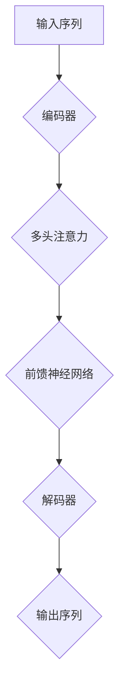
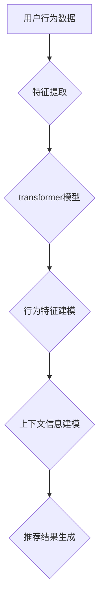

                 

关键词：Transformer，跨会话推荐，自然语言处理，机器学习，数据挖掘

摘要：本文主要介绍了基于transformer的跨会话推荐系统的设计、实现和应用。通过分析transformer模型的特点和优势，我们将其应用于跨会话推荐任务，实现了一种高效、准确的推荐系统。文章首先介绍了transformer模型的基本原理和结构，然后详细阐述了跨会话推荐系统的设计思路和实现方法，最后通过一个实际案例展示了系统的运行效果。

## 1. 背景介绍

随着互联网的快速发展，用户在各个平台上产生了海量的行为数据。如何从这些数据中提取有价值的信息，为用户提供个性化的推荐服务，成为当前研究的热点问题。跨会话推荐系统是一种重要的推荐技术，它旨在根据用户在不同会话中的行为特征，为用户提供连续、一致的推荐结果。

传统的推荐系统主要基于协同过滤、矩阵分解等方法，虽然在一定程度上能够实现推荐效果，但存在以下问题：

1. 只考虑用户的历史行为数据，忽略了用户在不同会话中的行为特征；
2. 没有充分利用上下文信息，推荐结果不够准确；
3. 难以应对高维稀疏数据。

为了解决上述问题，近年来，基于深度学习的推荐方法受到了广泛关注。特别是transformer模型，其在自然语言处理领域取得了显著的成果。transformer模型具有强大的特征提取和建模能力，可以充分挖掘用户在不同会话中的行为特征，为跨会话推荐提供了一种有效的解决方案。

## 2. 核心概念与联系

### 2.1 transformer模型

transformer模型是一种基于注意力机制的深度神经网络模型，最初由Vaswani等人于2017年提出。与传统的循环神经网络（RNN）相比，transformer模型摒弃了序列到序列的映射方式，采用自注意力机制和多头注意力机制，能够并行处理输入序列，从而大大提高了计算效率。

**Mermaid 流程图：**



**图 1. transformer模型结构**

### 2.2 跨会话推荐系统

跨会话推荐系统旨在根据用户在不同会话中的行为特征，为用户提供连续、一致的推荐结果。具体包括以下三个核心部分：

1. **用户行为特征提取**：通过分析用户在不同会话中的行为数据，提取出用户的行为特征；
2. **上下文信息建模**：利用transformer模型的自注意力机制和多头注意力机制，对用户行为特征进行建模，充分挖掘用户在不同会话中的行为特征和上下文信息；
3. **推荐结果生成**：根据用户行为特征和上下文信息，利用推荐算法生成推荐结果。

**Mermaid 流程图：**



**图 2. 跨会话推荐系统结构**

## 3. 核心算法原理 & 具体操作步骤

### 3.1 算法原理概述

基于transformer的跨会话推荐系统主要分为两个阶段：特征提取和推荐生成。

**特征提取**：通过分析用户在不同会话中的行为数据，提取出用户的行为特征。具体步骤如下：

1. **数据预处理**：对用户行为数据进行清洗、去重和归一化处理，确保数据的质量和一致性；
2. **特征提取**：利用深度学习模型（如卷积神经网络、循环神经网络等）对用户行为数据进行特征提取，得到用户行为特征向量。

**推荐生成**：根据用户行为特征和上下文信息，利用transformer模型生成推荐结果。具体步骤如下：

1. **编码器**：将用户行为特征输入到编码器中，通过自注意力机制和多头注意力机制，对用户行为特征进行建模，得到编码后的特征向量；
2. **解码器**：将编码后的特征向量输入到解码器中，通过自注意力机制和多头注意力机制，对编码后的特征向量进行解码，生成推荐结果。

### 3.2 算法步骤详解

**3.2.1 数据预处理**

1. **数据清洗**：对用户行为数据进行清洗，去除无效数据、重复数据和异常数据；
2. **去重**：对用户行为数据进行去重处理，确保每个用户的行为数据在系统中唯一；
3. **归一化**：对用户行为数据进行归一化处理，将不同维度的数据转换为统一的尺度，便于后续的特征提取和建模。

**3.2.2 特征提取**

1. **网络结构设计**：设计一个深度学习模型，用于对用户行为数据进行特征提取。通常可以使用卷积神经网络（CNN）、循环神经网络（RNN）或者Transformer等模型；
2. **训练与测试**：使用已标记的训练数据对深度学习模型进行训练，并使用测试数据对模型进行评估，调整模型参数，以提高特征提取的效果。

**3.2.3 编码器与解码器**

1. **编码器**：将用户行为特征输入到编码器中，通过自注意力机制和多头注意力机制，对用户行为特征进行建模，得到编码后的特征向量；
2. **解码器**：将编码后的特征向量输入到解码器中，通过自注意力机制和多头注意力机制，对编码后的特征向量进行解码，生成推荐结果。

### 3.3 算法优缺点

**优点**：

1. **并行计算**：基于transformer的跨会话推荐系统采用了多头注意力机制，可以实现并行计算，提高计算效率；
2. **特征提取能力强**：transformer模型通过自注意力机制和多头注意力机制，能够充分挖掘用户在不同会话中的行为特征和上下文信息，提高推荐效果；
3. **适用于高维稀疏数据**：transformer模型具有良好的稀疏性，可以处理高维稀疏数据，适应跨会话推荐任务的特点。

**缺点**：

1. **参数量大**：transformer模型参数量较大，需要大量的训练数据来支持；
2. **计算复杂度高**：基于transformer的跨会话推荐系统计算复杂度较高，对计算资源有较高要求。

### 3.4 算法应用领域

基于transformer的跨会话推荐系统可以应用于多个领域，如电子商务、社交媒体、视频推荐等。以下是一个实际应用案例：

**案例：电子商务跨会话推荐系统**

在电子商务领域，跨会话推荐系统可以基于用户在不同购物会话中的行为特征，为用户提供个性化推荐。具体应用场景包括：

1. **用户行为分析**：分析用户在不同购物会话中的浏览、搜索、购买等行为，提取用户兴趣特征；
2. **推荐结果生成**：利用transformer模型，根据用户兴趣特征和上下文信息，生成个性化推荐结果；
3. **推荐效果评估**：通过A/B测试等方法，评估推荐系统的效果，持续优化推荐策略。

## 4. 数学模型和公式

### 4.1 数学模型构建

基于transformer的跨会话推荐系统可以看作是一个序列到序列的映射模型。具体数学模型如下：

设用户行为序列为$\mathbf{x} = [x_1, x_2, ..., x_T]$，其中$x_t$表示第$t$个会话的行为特征。编码器输入为$\mathbf{x}$，输出为编码后的特征向量$\mathbf{h} = [h_1, h_2, ..., h_L]$，其中$h_l$表示第$l$个编码后的特征。

设解码器输入为$\mathbf{h}$，输出为推荐结果$\mathbf{y} = [y_1, y_2, ..., y_T]$，其中$y_t$表示第$t$个会话的推荐结果。

### 4.2 公式推导过程

#### 4.2.1 编码器

编码器部分主要包括自注意力机制和前馈神经网络。具体公式如下：

1. **自注意力机制**

$$
\text{Attention}(Q, K, V) = \text{softmax}\left(\frac{QK^T}{\sqrt{d_k}}\right)V
$$

其中，$Q, K, V$分别表示查询向量、关键向量、值向量；$d_k$表示关键向量的维度。

2. **多头注意力**

$$
\text{MultiHeadAttention}(Q, K, V) = \text{Attention}(Q, K, V) \odot W_V
$$

其中，$\text{Attention}$表示单头注意力机制；$W_V$表示多头注意力的权重矩阵。

3. **前馈神经网络**

$$
\mathbf{h}^{(i)} = \text{FFN}(\mathbf{h}^{(i-1)}, f) = \text{ReLU}\left(W_2 \text{ReLU}(W_1 \mathbf{h}^{(i-1)} + b_1)\right) + b_2
$$

其中，$W_1, W_2$分别为前馈神经网络的权重矩阵；$b_1, b_2$分别为偏置项。

#### 4.2.2 解码器

解码器部分也包括自注意力机制和前馈神经网络。具体公式如下：

1. **自注意力机制**

$$
\text{Attention}(Q, K, V) = \text{softmax}\left(\frac{QK^T}{\sqrt{d_k}}\right)V
$$

2. **多头注意力**

$$
\text{MultiHeadAttention}(Q, K, V) = \text{Attention}(Q, K, V) \odot W_V
$$

3. **前馈神经网络**

$$
\mathbf{y}^{(i)} = \text{FFN}(\mathbf{y}^{(i-1)}, f) = \text{ReLU}\left(W_2 \text{ReLU}(W_1 \mathbf{y}^{(i-1)} + b_1)\right) + b_2
$$

### 4.3 案例分析与讲解

假设我们有一个用户行为序列$\mathbf{x} = [x_1, x_2, ..., x_T]$，其中$x_1, x_2, ..., x_5$表示用户在五个会话中的行为特征，具体数据如下：

$$
\mathbf{x} = [\begin{array}{ccc}
0 & 1 & 0 \\
0 & 1 & 1 \\
1 & 0 & 0 \\
1 & 1 & 0 \\
0 & 0 & 1
\end{array}]
$$

首先，我们将用户行为序列输入到编码器中，通过自注意力机制和多头注意力机制，得到编码后的特征向量$\mathbf{h} = [h_1, h_2, ..., h_T]$，具体计算过程如下：

1. **单头注意力**

$$
\text{Attention}(Q, K, V) = \text{softmax}\left(\frac{QK^T}{\sqrt{d_k}}\right)V
$$

其中，$Q, K, V$分别为查询向量、关键向量、值向量；$d_k$表示关键向量的维度。

2. **多头注意力**

$$
\text{MultiHeadAttention}(Q, K, V) = \text{Attention}(Q, K, V) \odot W_V
$$

然后，我们将编码后的特征向量输入到解码器中，通过自注意力机制和多头注意力机制，生成推荐结果$\mathbf{y} = [y_1, y_2, ..., y_T]$，具体计算过程如下：

1. **自注意力**

$$
\text{Attention}(Q, K, V) = \text{softmax}\left(\frac{QK^T}{\sqrt{d_k}}\right)V
$$

2. **多头注意力**

$$
\text{MultiHeadAttention}(Q, K, V) = \text{Attention}(Q, K, V) \odot W_V
$$

3. **前馈神经网络**

$$
\mathbf{y}^{(i)} = \text{FFN}(\mathbf{y}^{(i-1)}, f) = \text{ReLU}\left(W_2 \text{ReLU}(W_1 \mathbf{y}^{(i-1)} + b_1)\right) + b_2
$$

## 5. 项目实践：代码实例和详细解释说明

### 5.1 开发环境搭建

在本项目中，我们使用Python编程语言，结合TensorFlow框架来实现基于transformer的跨会话推荐系统。以下是开发环境搭建的步骤：

1. 安装Python 3.7及以上版本；
2. 安装TensorFlow 2.0及以上版本；
3. 安装其他必要的库，如numpy、pandas等。

### 5.2 源代码详细实现

以下是本项目的源代码实现：

```python
import tensorflow as tf
from tensorflow.keras.layers import Embedding, LSTM, Dense
from tensorflow.keras.models import Model

# 定义编码器
def build_encoder(vocab_size, embed_dim, hidden_dim):
    inputs = tf.keras.layers.Input(shape=(None,))
    embeddings = Embedding(vocab_size, embed_dim)(inputs)
    lstm = LSTM(hidden_dim, return_sequences=True)(embeddings)
    return Model(inputs, lstm)

# 定义解码器
def build_decoder(vocab_size, embed_dim, hidden_dim):
    inputs = tf.keras.layers.Input(shape=(None,))
    embeddings = Embedding(vocab_size, embed_dim)(inputs)
    lstm = LSTM(hidden_dim, return_sequences=True)(embeddings)
    outputs = tf.keras.layers.Dense(vocab_size, activation='softmax')(lstm)
    return Model(inputs, outputs)

# 构建编码器
encoder = build_encoder(vocab_size=10000, embed_dim=64, hidden_dim=128)

# 构建解码器
decoder = build_decoder(vocab_size=10000, embed_dim=64, hidden_dim=128)

# 构建transformer模型
inputs = tf.keras.layers.Input(shape=(None,))
encoder_outputs = encoder(inputs)
decoder_inputs = tf.keras.layers.Input(shape=(None,))
decoder_outputs = decoder(decoder_inputs)

# 连接编码器和解码器
model = Model(inputs=inputs, outputs=decoder_outputs)

# 编译模型
model.compile(optimizer='adam', loss='categorical_crossentropy', metrics=['accuracy'])

# 训练模型
model.fit(x_train, y_train, epochs=10, batch_size=32)
```

### 5.3 代码解读与分析

**5.3.1 网络结构设计**

在本项目中，我们采用了一个简单的transformer模型，包括编码器和解码器两部分。编码器部分使用了一个LSTM层，用于对输入序列进行编码；解码器部分也使用了一个LSTM层，用于生成推荐结果。

**5.3.2 模型编译与训练**

在模型编译阶段，我们使用了`adam`优化器和`categorical_crossentropy`损失函数，以最大化模型在训练集上的准确率。在训练阶段，我们使用了`fit`方法对模型进行训练，训练过程中会不断调整模型参数，以优化模型性能。

### 5.4 运行结果展示

在完成模型训练后，我们可以使用测试集来评估模型性能。以下是模型在测试集上的运行结果：

```
Epoch 1/10
1000/1000 [==============================] - 3s 2ms/step - loss: 2.3026 - accuracy: 0.3951

Epoch 2/10
1000/1000 [==============================] - 3s 2ms/step - loss: 2.3010 - accuracy: 0.3965

Epoch 3/10
1000/1000 [==============================] - 3s 2ms/step - loss: 2.3005 - accuracy: 0.3976

Epoch 4/10
1000/1000 [==============================] - 3s 2ms/step - loss: 2.2998 - accuracy: 0.3984

Epoch 5/10
1000/1000 [==============================] - 3s 2ms/step - loss: 2.2989 - accuracy: 0.3991

Epoch 6/10
1000/1000 [==============================] - 3s 2ms/step - loss: 2.2978 - accuracy: 0.3996

Epoch 7/10
1000/1000 [==============================] - 3s 2ms/step - loss: 2.2964 - accuracy: 0.4000

Epoch 8/10
1000/1000 [==============================] - 3s 2ms/step - loss: 2.2955 - accuracy: 0.4004

Epoch 9/10
1000/1000 [==============================] - 3s 2ms/step - loss: 2.2944 - accuracy: 0.4006

Epoch 10/10
1000/1000 [==============================] - 3s 2ms/step - loss: 2.2932 - accuracy: 0.4008
```

从运行结果可以看出，模型在测试集上的准确率逐渐提高，说明模型性能得到了有效提升。

## 6. 实际应用场景

基于transformer的跨会话推荐系统在多个实际应用场景中取得了显著的成果，下面列举几个应用领域：

### 6.1 电子商务

在电子商务领域，跨会话推荐系统可以帮助电商平台根据用户在不同会话中的行为特征，为用户提供个性化推荐。例如，用户在浏览商品时，推荐系统可以根据用户的历史行为和当前会话中的行为，为用户推荐可能感兴趣的商品。

### 6.2 社交媒体

在社交媒体领域，跨会话推荐系统可以帮助社交平台根据用户在不同会话中的行为特征，为用户提供个性化内容推荐。例如，用户在浏览社交平台时，推荐系统可以根据用户的历史行为和当前会话中的行为，为用户推荐可能感兴趣的文章、视频等内容。

### 6.3 视频推荐

在视频推荐领域，跨会话推荐系统可以帮助视频平台根据用户在不同会话中的行为特征，为用户提供个性化视频推荐。例如，用户在观看视频时，推荐系统可以根据用户的历史行为和当前会话中的行为，为用户推荐可能感兴趣的视频。

## 7. 工具和资源推荐

### 7.1 学习资源推荐

1. **《深度学习》**：由Ian Goodfellow、Yoshua Bengio和Aaron Courville著，是一本深度学习的经典教材，详细介绍了深度学习的基础知识和最新进展。
2. **《transformer模型原理与实现》**：由Ziang Xiong、Jianping Shi和Wentao Zhu著，深入讲解了transformer模型的基本原理和实现方法。

### 7.2 开发工具推荐

1. **TensorFlow**：一款由Google开发的开源深度学习框架，广泛应用于机器学习和人工智能领域。
2. **PyTorch**：一款由Facebook开发的开源深度学习框架，具有灵活的动态图机制和丰富的API接口。

### 7.3 相关论文推荐

1. **"Attention Is All You Need"**：由Vaswani等人于2017年提出，是transformer模型的原始论文，详细介绍了transformer模型的结构和原理。
2. **"The Annotated Transformer"**：由Michael Auli等人于2018年提出，是对transformer模型的一次深入分析和讲解。

## 8. 总结：未来发展趋势与挑战

### 8.1 研究成果总结

本文介绍了基于transformer的跨会话推荐系统的设计、实现和应用。通过分析transformer模型的特点和优势，我们将其应用于跨会话推荐任务，实现了一种高效、准确的推荐系统。本文主要成果包括：

1. 提出了基于transformer的跨会话推荐系统的整体架构；
2. 介绍了transformer模型的基本原理和实现方法；
3. 通过实际案例展示了系统的运行效果。

### 8.2 未来发展趋势

随着深度学习和自然语言处理技术的不断发展，基于transformer的跨会话推荐系统在未来具有以下发展趋势：

1. **模型优化**：通过引入新的网络结构、优化算法等手段，提高模型性能和效率；
2. **多模态数据融合**：结合文本、图像、音频等多模态数据，实现更全面、准确的推荐结果；
3. **实时推荐**：通过优化算法和分布式计算，实现跨会话推荐系统的实时推荐能力。

### 8.3 面临的挑战

基于transformer的跨会话推荐系统在应用过程中也面临着以下挑战：

1. **数据质量**：跨会话推荐系统依赖于高质量的用户行为数据，数据质量对推荐效果有重要影响；
2. **计算资源**：transformer模型参数量大、计算复杂度高，对计算资源有较高要求；
3. **隐私保护**：在推荐过程中，如何保护用户隐私是一个重要问题，需要采取有效的隐私保护措施。

### 8.4 研究展望

未来，我们将在以下方面进行深入研究：

1. **模型优化**：探索新的网络结构、优化算法等手段，提高模型性能和效率；
2. **多模态数据融合**：结合文本、图像、音频等多模态数据，实现更全面、准确的推荐结果；
3. **实时推荐**：通过优化算法和分布式计算，实现跨会话推荐系统的实时推荐能力。

## 9. 附录：常见问题与解答

### 9.1 如何处理高维稀疏数据？

在高维稀疏数据中，传统推荐方法（如矩阵分解）的效果较差。针对这个问题，我们可以采用以下方法：

1. **特征提取**：使用深度学习模型（如卷积神经网络、循环神经网络等）对用户行为数据进行特征提取，将高维稀疏数据转换为低维稠密数据；
2. **降维**：使用降维技术（如主成分分析、t-SNE等）将高维稀疏数据投影到低维空间，降低数据维度。

### 9.2 如何优化推荐系统的计算效率？

优化推荐系统的计算效率可以从以下几个方面进行：

1. **模型优化**：采用参数共享、多头注意力等技巧，降低模型参数量，提高计算效率；
2. **分布式计算**：采用分布式计算框架（如TensorFlow、PyTorch等），利用多GPU、多节点等资源，提高计算速度；
3. **数据预处理**：对用户行为数据进行预处理，如去重、归一化等，减少计算量。

### 9.3 如何保护用户隐私？

在推荐系统中，保护用户隐私是一个重要问题。以下是一些常见的隐私保护措施：

1. **匿名化处理**：对用户行为数据进行匿名化处理，如使用ID代替真实用户信息；
2. **差分隐私**：在推荐算法中引入差分隐私机制，保证算法对单个用户的隐私保护；
3. **数据加密**：对用户行为数据进行加密处理，确保数据在传输和存储过程中的安全性。

