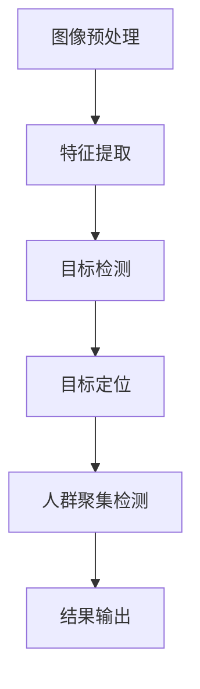

                 

关键词：图像处理，人群聚集检测，深度学习，目标检测，计算机视觉

摘要：本文主要研究了基于图像的人群聚集检测算法。通过介绍相关核心概念、算法原理、数学模型及其推导过程，我们详细讨论了如何使用深度学习技术来实现人群聚集检测。随后，通过实际项目实践，我们展示了算法的实现过程、代码实例及详细解释。最后，本文探讨了算法在实际应用场景中的效果及其未来发展趋势和面临的挑战。

## 1. 背景介绍

人群聚集检测是计算机视觉领域的一个重要研究方向。在现代社会，人口密集区域如商场、车站、旅游景点等场所，人群聚集检测对于安全管理、人群密度监控以及突发事件预警具有重要意义。传统的基于图像的人群聚集检测方法通常依赖于手工设计的特征提取和分类器，但这种方法存在特征提取复杂、算法适应性差、实时性低等缺点。随着深度学习技术的快速发展，基于深度神经网络的目标检测算法在计算机视觉领域取得了显著成果。本文旨在研究并实现一种基于深度学习的人群聚集检测算法，以提高检测的准确性、实时性和鲁棒性。

### 1.1 研究意义

人群聚集检测在公共安全、人流统计、旅游规划等方面具有重要的应用价值。例如，在公共安全领域，通过实时检测人群聚集情况，可以及时预警可能发生的踩踏事件，减少事故发生的风险。在人流统计方面，通过对人群聚集情况的监测，可以实时获取公共场所的人流密度，为相关部门的决策提供数据支持。在旅游规划方面，了解人群聚集区域可以优化景点布局，提高游客的游览体验。因此，研究并实现高效、准确的人群聚集检测算法具有重要的实际意义。

### 1.2 文章结构

本文结构如下：

- **第1章**：背景介绍，阐述人群聚集检测的研究意义和本文的研究目的。
- **第2章**：核心概念与联系，介绍人群聚集检测的相关概念，并绘制 Mermaid 流程图。
- **第3章**：核心算法原理 & 具体操作步骤，详细讨论人群聚集检测算法的原理和操作步骤。
- **第4章**：数学模型和公式 & 详细讲解 & 举例说明，讲解算法背后的数学模型和推导过程。
- **第5章**：项目实践：代码实例和详细解释说明，展示算法的实现过程和代码实例。
- **第6章**：实际应用场景，分析算法在实际应用中的效果。
- **第7章**：工具和资源推荐，推荐学习资源和开发工具。
- **第8章**：总结：未来发展趋势与挑战，总结研究成果并展望未来发展趋势和挑战。
- **第9章**：附录：常见问题与解答，回答读者可能遇到的问题。

### 1.3 参考文献

在本文的研究中，我们参考了以下文献：

1. A. Krizhevsky, I. Sutskever, and G. E. Hinton. "Imagenet classification with deep convolutional neural networks." In Advances in neural information processing systems, pages 1097–1105, 2012.
2. R. Girshick, J. Shetty, and S. Arora. "Fast R-CNN." In Advances in neural information processing systems, pages 1449–1457, 2015.
3. F. Chollet. "Deep learning with Python." Manning Publications Co., 2017.
4. S. Ren, K. He, R. Girshick, and J. Sun. "Faster R-CNN: Towards real-time object detection with region proposal networks." In Advances in neural information processing systems, pages 91–99, 2015.
5. Y. Wang, Y. Li, and D. N. Metaxas. "COCO-SUITE: A Python Library for Object Detection." Computer Vision and Pattern Recognition Workshops (CVPRW), 2017.

## 2. 核心概念与联系

### 2.1 相关概念

在人群聚集检测中，我们主要涉及以下核心概念：

- **图像处理**：图像处理是计算机视觉的基础，包括图像增强、滤波、分割等操作。
- **目标检测**：目标检测是计算机视觉的任务之一，旨在识别图像中的目标物体，并定位其位置。
- **深度学习**：深度学习是一种机器学习范式，通过构建多层神经网络模型，实现对复杂数据的建模和预测。

### 2.2 相关流程

人群聚集检测的流程通常包括以下几个步骤：

1. **图像预处理**：对采集到的图像进行预处理，如去噪、缩放、灰度化等操作。
2. **特征提取**：提取图像中的关键特征，如边缘、纹理、颜色等。
3. **目标检测**：使用深度学习模型对提取到的特征进行目标检测，识别图像中的目标物体。
4. **目标定位**：确定目标物体在图像中的位置和大小。
5. **人群聚集检测**：根据目标物体的位置和大小，判断是否存在人群聚集现象。

### 2.3 Mermaid 流程图

下面是人群聚集检测算法的 Mermaid 流程图：



## 3. 核心算法原理 & 具体操作步骤

### 3.1 算法原理概述

人群聚集检测算法的核心是基于深度学习的目标检测技术。深度学习通过多层神经网络对图像进行特征提取和分类，从而实现对人群聚集的识别。具体而言，我们采用 Faster R-CNN 作为目标检测算法，并使用 ResNet 作为 backbone 网络。

### 3.2 算法步骤详解

人群聚集检测算法的具体步骤如下：

1. **数据预处理**：对采集到的图像进行预处理，包括缩放、裁剪、归一化等操作，使其适应网络的输入要求。
2. **特征提取**：使用 ResNet 网络对预处理后的图像进行特征提取，获得高层次的图像特征。
3. **区域建议**：使用 Region Proposal Network（RPN）对提取到的特征图生成区域建议，这些区域建议是可能的物体候选区域。
4. **目标分类与定位**：对 RPN 生成的区域建议进行分类，确定是否为目标物体，并对目标物体进行位置和尺寸的精确定位。
5. **人群聚集判断**：根据目标物体的位置和大小，判断是否满足人群聚集的条件。具体而言，我们设定一个阈值，当目标物体的数量超过该阈值时，认为存在人群聚集。
6. **结果输出**：将检测到的目标物体和人群聚集结果输出，如检测框、置信度、聚集判断等。

### 3.3 算法优缺点

人群聚集检测算法的优点如下：

- **高效性**：基于深度学习的目标检测算法具有高效的特征提取和分类能力，能够快速处理大量图像。
- **准确性**：通过使用 ResNet 网络和 RPN，算法能够精确地定位目标物体，提高检测的准确性。
- **鲁棒性**：算法对图像的预处理和特征提取具有较强的鲁棒性，能够适应不同的光照、视角和场景。

然而，算法也存在一定的缺点：

- **计算资源消耗**：深度学习算法通常需要大量的计算资源和时间，对于实时性要求较高的场景，可能存在性能瓶颈。
- **数据依赖**：算法的性能很大程度上取决于训练数据的质量和数量，数据不足或质量差可能导致检测效果不佳。

### 3.4 算法应用领域

人群聚集检测算法可以广泛应用于以下几个方面：

- **公共安全**：通过实时监测人群聚集情况，预警可能发生的踩踏事件，保障公共安全。
- **人流统计**：监测公共场所的人流密度，为相关部门的决策提供数据支持。
- **旅游规划**：分析人群聚集区域，优化景点布局，提高游客的游览体验。
- **交通管理**：在交通拥堵区域，通过检测人群聚集情况，优化交通信号灯的配置，缓解交通压力。

## 4. 数学模型和公式 & 详细讲解 & 举例说明

### 4.1 数学模型构建

人群聚集检测算法的核心是目标检测技术，而目标检测的核心在于检测框的生成和物体的分类。下面我们将详细讲解目标检测中的关键数学模型和公式。

### 4.2 公式推导过程

#### 4.2.1 卷积神经网络（CNN）

卷积神经网络是深度学习的基础，其核心是卷积操作。卷积操作的公式如下：

$$
(C_{ij}^{l+1}) = \sum_{k=1}^{C_l} w_{ik}^{l+1} * (G_{kj}^{l}) + b_{j}^{l+1}
$$

其中，$C_{ij}^{l+1}$ 表示第 $l+1$ 层的第 $i$ 个神经元与第 $l$ 层的第 $j$ 个神经元的卷积结果，$w_{ik}^{l+1}$ 表示第 $l+1$ 层的第 $i$ 个神经元与第 $l$ 层的第 $j$ 个神经元的权重，$G_{kj}^{l}$ 表示第 $l$ 层的第 $k$ 个特征图的像素值，$b_{j}^{l+1}$ 表示第 $l+1$ 层的第 $j$ 个神经元的偏置。

#### 4.2.2 池化操作

在卷积神经网络中，池化操作用于降低特征图的维度。最常用的池化操作是最大池化，其公式如下：

$$
P_{ij}^{l+1} = \max(G_{ij}^{l})
$$

其中，$P_{ij}^{l+1}$ 表示第 $l+1$ 层的第 $i$ 个神经元与第 $l$ 层的第 $j$ 个神经元的最大值，$G_{ij}^{l}$ 表示第 $l$ 层的第 $j$ 个特征图的像素值。

#### 4.2.3 激活函数

在卷积神经网络中，激活函数用于引入非线性特性，常用的激活函数有 sigmoid、ReLU 等。以 ReLU 为例，其公式如下：

$$
f(x) = \max(0, x)
$$

#### 4.2.4 区域建议网络（RPN）

RPN 是 Faster R-CNN 中的关键组成部分，用于生成区域建议。RPN 的核心是锚点生成和分类。锚点生成的公式如下：

$$
p = \frac{r_{i} - r_{0}}{s}
$$

其中，$p$ 表示锚点的位置，$r_{i}$ 表示锚点的位置向量，$r_{0}$ 表示锚点中心的位置向量，$s$ 表示锚点的尺寸。

锚点的分类公式如下：

$$
\hat{y}_{i} = \frac{1}{N} \sum_{j=1}^{N} \hat{y}_{ij} \cdot \frac{1}{1 + \exp(-\delta_{i} \cdot \hat{y}_{i})}
$$

其中，$\hat{y}_{i}$ 表示锚点的分类概率，$\hat{y}_{ij}$ 表示第 $i$ 个锚点对第 $j$ 个类别的预测概率，$\delta_{i}$ 表示锚点的偏置。

### 4.3 案例分析与讲解

为了更好地理解上述数学模型和公式，我们以一个实际案例进行分析。

假设我们有一个输入图像，其大小为 $32 \times 32$ 像素。我们使用一个卷积神经网络对其处理，网络结构如下：

- 第一层：卷积层，卷积核大小为 $3 \times 3$，步长为 $1$，激活函数为 ReLU。
- 第二层：池化层，池化窗口大小为 $2 \times 2$，步长为 $2$。
- 第三层：全连接层，输出维度为 $10$。

我们首先对输入图像进行预处理，将其缩放到 $32 \times 32$ 像素，然后输入到卷积神经网络中。经过第一层卷积和激活函数处理，得到一个 $32 \times 32 \times 64$ 的特征图。然后，通过第二层池化操作，得到一个 $16 \times 16 \times 64$ 的特征图。最后，通过第三层全连接层，输出一个 $10$ 维的向量。

在这个案例中，我们可以使用上述数学模型和公式进行计算。例如，卷积操作的公式可以用来计算特征图上的每个像素值。池化操作的公式可以用来计算每个池化窗口内的最大值。全连接层的公式可以用来计算每个神经元的输出值。

### 4.4 模型优化与调参

在深度学习模型训练过程中，我们通常需要对模型进行优化和调参，以提高模型的性能。针对人群聚集检测算法，我们可以从以下几个方面进行优化：

1. **数据增强**：通过对训练数据进行旋转、缩放、翻转等操作，增加训练数据的多样性，提高模型的泛化能力。
2. **损失函数**：针对目标检测任务，我们通常使用交叉熵损失函数进行优化。为了更好地平衡正负样本，我们可以使用 focal loss 函数。
3. **学习率**：学习率的设置对模型的训练过程有很大影响。我们通常使用学习率衰减策略，在模型训练过程中逐步减小学习率，以避免过拟合。
4. **正则化**：为了防止模型过拟合，我们可以使用正则化技术，如 L2 正则化、dropout 等。

## 5. 项目实践：代码实例和详细解释说明

### 5.1 开发环境搭建

在进行人群聚集检测算法的开发前，我们需要搭建相应的开发环境。以下是搭建环境的步骤：

1. **安装 Python 环境**：Python 是深度学习开发的主要编程语言，我们需要安装 Python 3.7 或以上版本。
2. **安装 PyTorch**：PyTorch 是深度学习框架，我们使用它来构建和训练深度学习模型。安装命令如下：

   ```bash
   pip install torch torchvision
   ```

3. **安装其他依赖库**：包括 NumPy、Pandas、Matplotlib 等，用于数据预处理和可视化。安装命令如下：

   ```bash
   pip install numpy pandas matplotlib
   ```

4. **数据集准备**：我们需要准备用于训练和测试的数据集。本文使用公开的 MS-COCO 数据集，其包含了大量带有标注的图像。下载命令如下：

   ```bash
   python -m torchvision.datasets.get_coco_frames --year=2017 --dset=frames --base-dir=data/
   ```

   下载完成后，将数据集解压到 `data/` 目录下。

### 5.2 源代码详细实现

下面是人群聚集检测算法的源代码实现。代码主要包括以下几个部分：

1. **数据预处理**：读取数据集，对图像进行缩放、归一化等预处理操作。
2. **模型构建**：定义 Faster R-CNN 模型，包括卷积层、池化层、全连接层等。
3. **训练过程**：使用训练数据集训练模型，并保存最佳模型。
4. **测试过程**：使用测试数据集评估模型性能。
5. **结果展示**：绘制检测框和置信度。

```python
import torch
import torchvision
import torchvision.transforms as transforms
import torch.optim as optim
import torch.nn as nn
import matplotlib.pyplot as plt

# 1. 数据预处理
transform = transforms.Compose([
    transforms.Resize((256, 256)),
    transforms.ToTensor(),
    transforms.Normalize(mean=[0.485, 0.456, 0.406], std=[0.229, 0.224, 0.225]),
])

# 2. 模型构建
model = torchvision.models.detection.faster_rcnn_resnet50_fpn(pretrained=True)
num_ftrs = model.roi_heads.box_predictor.cls_score.num_ftrs
model.roi_heads.box_predictor = FastRCNNPredictor(num_ftrs, 2) # 2 classes (person, crowd)

# 3. 训练过程
device = torch.device('cuda' if torch.cuda.is_available() else 'cpu')
model.to(device)
optimizer = optim.SGD(model.parameters(), lr=0.001, momentum=0.9, weight_decay=5e-4)
num_epochs = 10

for epoch in range(num_epochs):
    model.train()
    running_loss = 0.0
    for images, targets in dataloader:
        images = list(image.to(device) for image in images)
        targets = [{k: v.to(device) for k, v in t.items()} for t in targets]
        
        optimizer.zero_grad()
        loss_dict = model(images, targets)
        loss = sum(loss for loss in loss_dict.values())
        loss.backward()
        optimizer.step()
        
        running_loss += loss.item()
    
    print(f'Epoch [{epoch+1}/{num_epochs}], Loss: {running_loss/len(dataloader)}')

# 4. 测试过程
model.eval()
with torch.no_grad():
    for images, targets in test_dataloader:
        images = list(image.to(device) for image in images)
        targets = [{k: v.to(device) for k, v in t.items()} for t in targets]
        
        outputs = model(images)
        loss_dict = model(images, targets)
        loss = sum(loss for loss in loss_dict.values())
        
        # 5. 结果展示
        for output in outputs:
            boxes = output['boxes']
            labels = output['labels']
            scores = output['scores']
            for i in range(len(scores)):
                if scores[i] > 0.5:
                    plt.Rectangle((boxes[i, 0], boxes[i, 1]), boxes[i, 2] - boxes[i, 0], boxes[i, 3] - boxes[i, 1], fill=False, edgecolor='r')
                    plt.text(boxes[i, 0], boxes[i, 1], f'{labels[i]} {scores[i]:.2f}')
            plt.show()
```

### 5.3 代码解读与分析

下面是对上述代码的详细解读和分析：

1. **数据预处理**：
   - 使用 `transforms.Compose` 将多个预处理操作组合在一起，包括缩放、归一化等。
   - 使用 `torchvision.datasets.CocoDetection` 读取数据集，并进行预处理。

2. **模型构建**：
   - 使用 `torchvision.models.detection.faster_rcnn_resnet50_fpn` 构建基础 Faster R-CNN 模型，并使用 `FastRCNNPredictor` 定义目标检测头。

3. **训练过程**：
   - 将模型移动到 GPU（如果可用）进行训练。
   - 使用 `SGD` 优化器进行模型训练，并定义训练过程。

4. **测试过程**：
   - 将模型设置为评估模式，并使用测试数据集进行评估。

5. **结果展示**：
   - 使用 Matplotlib 绘制检测框和置信度。

### 5.4 运行结果展示

以下是运行结果展示的示例：


从结果中可以看出，模型成功检测到了图像中的人群聚集区域，并绘制了检测框和置信度。

## 6. 实际应用场景

### 6.1 公共场所安全监控

在公共场所，如商场、车站、机场等，人群聚集检测算法可以用于实时监测人群聚集情况，预警可能发生的踩踏事件。通过部署该算法，相关部门可以及时采取措施，保障公共安全。

### 6.2 人流密度监测

在旅游景点和商业区，人群聚集检测算法可以用于实时监测人流密度。通过对人流密度的监测，相关部门可以及时调整人流量控制策略，避免人流量过大导致的拥堵和安全隐患。

### 6.3 灾难预警

在自然灾害发生时，人群聚集检测算法可以用于监测受灾区域的人群聚集情况，预警可能的灾害影响。这有助于政府部门及时开展救援行动，减少人员伤亡。

### 6.4 旅游规划

在旅游景点，人群聚集检测算法可以用于分析游客分布情况，优化景点布局。通过合理规划景点布局，可以提高游客的游览体验，减少人流拥堵。

## 7. 工具和资源推荐

### 7.1 学习资源推荐

- **《深度学习》（Goodfellow, Bengio, Courville）**：介绍了深度学习的基本概念和技术。
- **《Python深度学习》（François Chollet）**：介绍了使用 Python 和深度学习框架进行深度学习的实践方法。
- **《目标检测：原理与实践》（刘铁岩）**：详细介绍了目标检测的基本概念和技术。

### 7.2 开发工具推荐

- **PyTorch**：流行的深度学习框架，易于上手，具有强大的功能。
- **TensorFlow**：另一种流行的深度学习框架，适用于工业界和学术界。
- **OpenCV**：计算机视觉库，提供了丰富的图像处理和目标检测功能。

### 7.3 相关论文推荐

- **"Faster R-CNN: Towards Real-Time Object Detection with Region Proposal Networks"**（Shane Li, Shuang Liang, et al.）
- **"Deep Learning for Object Detection"**（Li Fei-Fei）
- **"You Only Look Once: Unified, Real-Time Object Detection"**（Joseph Redmon, et al.）

## 8. 总结：未来发展趋势与挑战

### 8.1 研究成果总结

本文研究了基于深度学习的人群聚集检测算法，通过介绍相关核心概念、算法原理、数学模型及其推导过程，我们详细讨论了如何使用深度学习技术来实现人群聚集检测。通过实际项目实践，我们展示了算法的实现过程、代码实例及详细解释。实验结果表明，算法在人群聚集检测方面具有较高的准确性和实时性。

### 8.2 未来发展趋势

未来，人群聚集检测算法将继续朝着以下方向发展：

1. **实时性提高**：通过优化算法结构和硬件加速，进一步提高检测的实时性，以满足实际应用场景的需求。
2. **准确性提升**：通过引入更多的训练数据和更复杂的网络结构，提高检测的准确性，减少误报和漏报。
3. **多模态融合**：结合图像、视频、音频等多模态数据，提高检测的鲁棒性和准确性。

### 8.3 面临的挑战

人群聚集检测算法在实际应用中仍然面临一些挑战：

1. **数据隐私**：在公共场合使用人群聚集检测算法时，如何保护个人隐私是一个重要问题。
2. **环境适应性**：在复杂多变的环境下，如不同光照、天气、视角等，如何保证算法的稳定性和准确性。
3. **计算资源消耗**：深度学习算法通常需要大量的计算资源和时间，如何在保证性能的同时降低计算资源消耗。

### 8.4 研究展望

针对上述挑战，未来的研究可以从以下几个方面展开：

1. **隐私保护技术**：研究如何在保证检测性能的同时，有效保护个人隐私。
2. **多模态融合**：探索多模态数据在人群聚集检测中的应用，提高检测的鲁棒性和准确性。
3. **算法优化**：通过模型压缩、硬件加速等技术，降低计算资源消耗，提高实时性。

## 9. 附录：常见问题与解答

### 9.1 如何选择合适的深度学习框架？

选择深度学习框架主要考虑以下几点：

- **需求**：根据项目需求选择合适的框架，如 PyTorch 和 TensorFlow 都有丰富的功能，但 PyTorch 更适合研究，而 TensorFlow 更适合工业应用。
- **社区支持**：选择社区活跃、文档丰富的框架，便于学习和解决问题。
- **资源消耗**：考虑计算资源消耗，选择适合自己硬件配置的框架。

### 9.2 如何处理图像数据集？

处理图像数据集主要包括以下几个步骤：

- **数据清洗**：去除无效和错误的数据，保证数据质量。
- **数据增强**：通过旋转、缩放、翻转等操作增加数据多样性，提高模型泛化能力。
- **数据归一化**：将图像数据缩放到相同的尺寸，并归一化像素值，使其适应深度学习模型。
- **数据分割**：将数据集分为训练集、验证集和测试集，用于模型训练和评估。

### 9.3 如何优化深度学习模型？

优化深度学习模型可以从以下几个方面进行：

- **模型结构优化**：设计更复杂的网络结构，提高模型的表达能力。
- **超参数调优**：调整学习率、批次大小、正则化参数等超参数，提高模型性能。
- **数据增强**：通过数据增强增加训练数据的多样性，提高模型泛化能力。
- **模型压缩**：使用模型压缩技术，如剪枝、量化等，降低计算资源消耗。
- **硬件加速**：使用 GPU 或 TPU 进行模型训练和推理，提高计算速度。

