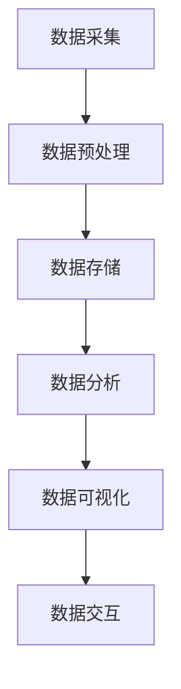

                 

关键词：大数据，房价数据，数据可视化，大数据技术，房价趋势分析

## 摘要

本文旨在探讨基于大数据技术的某房价数据可视化研究。通过大数据技术对某地区房价数据进行深度挖掘和分析，构建了一套完整的房价数据可视化系统，旨在为房地产市场的投资者和研究者提供有力支持。本文首先介绍了大数据技术在房价数据分析中的应用背景和核心概念，然后详细阐述了数据收集、预处理、分析与可视化的技术流程，最后通过一个实际案例展示了数据可视化系统的应用效果，并对未来应用前景进行了展望。

## 1. 背景介绍

随着我国经济的快速发展，房地产行业日益繁荣。然而，房价的波动不仅影响到广大民众的生活质量，还对金融市场和社会稳定产生重要影响。因此，对房价数据进行深入研究，揭示房价变化的规律和趋势，对于政府决策、房地产市场调控以及投资者风险评估具有重要意义。

近年来，大数据技术在各个领域得到了广泛应用，尤其在金融、医疗、交通等领域。大数据技术能够处理海量数据，挖掘数据中的潜在价值，为决策提供科学依据。在房价数据分析中，大数据技术同样发挥着重要作用。通过大数据技术，可以对房价数据进行多维度分析，揭示房价变化的影响因素，预测未来房价走势。

本文研究的目标是利用大数据技术，对某地区房价数据进行可视化分析，为房地产市场的投资者和研究者提供直观、全面的房价数据支持。具体来说，本文将实现以下目标：

1. 收集并整理某地区长期房价数据，构建数据集；
2. 利用大数据技术对房价数据进行分析和挖掘，提取关键特征；
3. 构建房价数据可视化系统，实现数据动态展示和交互式查询；
4. 分析房价数据变化趋势，为房地产市场投资提供决策依据。

## 2. 核心概念与联系

### 2.1 大数据技术

大数据技术是指从海量、多样化、快速变化的数据中，通过数据采集、存储、处理、分析等手段，挖掘数据中的潜在价值，为决策提供支持的一系列技术和方法。大数据技术主要包括以下三个方面：

1. 数据采集：通过各种渠道收集数据，包括互联网、传感器、社交媒体等；
2. 数据存储：利用分布式存储技术，如Hadoop、NoSQL等，存储海量数据；
3. 数据分析：利用数据挖掘、机器学习、统计分析等技术，对数据进行分析和挖掘。

### 2.2 房价数据可视化

房价数据可视化是指利用可视化技术，将房价数据以图形、图表等形式展示出来，帮助人们直观地了解房价变化趋势和特征。房价数据可视化主要包括以下方面：

1. 数据展示：利用图表、地图等展示房价数据，如折线图、柱状图、饼图等；
2. 数据交互：通过用户交互，实现数据动态展示和查询，如鼠标点击、拖拽等；
3. 数据分析：利用可视化技术，对房价数据进行深度分析，揭示房价变化的规律和趋势。

### 2.3 Mermaid 流程图

Mermaid 是一种基于文本的绘图语言，可以方便地生成流程图、时序图、UML类图等。以下是房价数据可视化的 Mermaid 流程图：



## 3. 核心算法原理 & 具体操作步骤

### 3.1 算法原理概述

本文所采用的核心算法主要包括数据采集、数据预处理、数据分析与数据可视化等环节。数据采集主要利用互联网爬虫技术获取房价数据；数据预处理主要进行数据清洗、去重、归一化等操作；数据分析主要利用时间序列分析、聚类分析等方法提取关键特征；数据可视化主要利用ECharts、D3.js等前端可视化库实现动态展示和交互式查询。

### 3.2 算法步骤详解

1. **数据采集**：
   利用Python的Scrapy框架搭建爬虫系统，从多个房地产网站、社交媒体等渠道采集房价数据。采集的数据包括楼盘名称、区域、单价、总价、面积、楼层、朝向等。

2. **数据预处理**：
   对采集到的数据进行清洗、去重、归一化等操作。具体步骤如下：
   - 清洗：删除含有缺失值、异常值的数据；
   - 去重：删除重复的数据条目；
   - 归一化：对数值型数据进行归一化处理，使其在相同的尺度范围内。

3. **数据分析**：
   - 时间序列分析：利用Python的pandas库对房价数据进行分析，提取年度、季度、月度等时间序列数据，分析房价变化趋势；
   - 聚类分析：利用Python的sklearn库对房价数据进行分析，提取楼盘的相似度，为房地产投资者提供购房建议。

4. **数据可视化**：
   - 利用ECharts库实现房价数据的动态展示，包括折线图、柱状图、饼图等；
   - 利用D3.js库实现房价数据的交互式查询，如鼠标点击、拖拽等交互操作。

### 3.3 算法优缺点

1. **优点**：
   - 高效性：利用大数据技术对海量数据进行处理和分析，提高数据处理效率；
   - 实用性：通过可视化技术将复杂的数据以直观、易懂的形式展示，为投资者和研究者提供有力支持；
   - 可扩展性：算法模块化设计，方便后续功能扩展和升级。

2. **缺点**：
   - 复杂性：大数据技术涉及多个环节，需要掌握多种编程语言和技术框架；
   - 时间成本：数据采集、预处理、分析等环节需要大量时间；
   - 数据质量：数据采集过程中可能存在数据缺失、异常值等问题，影响分析结果的准确性。

### 3.4 算法应用领域

1. **房地产投资**：利用房价数据可视化系统，投资者可以直观了解房价变化趋势，为投资决策提供依据；
2. **房地产市场调控**：政府部门可以利用房价数据可视化系统，对房地产市场进行监控和调控；
3. **房地产研究**：研究者可以利用房价数据可视化系统，对房价变化规律和影响因素进行深入分析。

## 4. 数学模型和公式 & 详细讲解 & 举例说明

### 4.1 数学模型构建

在房价数据可视化研究中，我们采用以下数学模型进行数据分析：

1. 时间序列模型：利用ARIMA（自回归积分滑动平均模型）对房价时间序列进行分析，预测未来房价走势；
2. 聚类模型：利用K-means算法对房价数据进行聚类分析，提取楼盘的相似度。

### 4.2 公式推导过程

1. ARIMA模型：

   - 自回归（AR）：$X_t = c + \phi_1 X_{t-1} + \phi_2 X_{t-2} + \ldots + \phi_p X_{t-p} + \varepsilon_t$

   - 积分（I）：$Y_t = \phi_0 X_t + \varepsilon_t$

   - 滑动平均（MA）：$X_t = \theta_1 Y_{t-1} + \theta_2 Y_{t-2} + \ldots + \theta_q Y_{t-q} + \varepsilon_t$

2. K-means算法：

   - 初始化：随机选择k个初始中心点；
   - 分配：将每个数据点分配到距离最近的中心点所在的聚类；
   - 更新：重新计算每个聚类的中心点；
   - 重复步骤2和3，直至中心点不再发生显著变化。

### 4.3 案例分析与讲解

以北京市2010-2020年的房价数据为例，利用ARIMA模型和时间序列分析，预测2021年的房价走势。

1. 数据收集与预处理：

   收集北京市2010-2020年的房价数据，包括年度、区域、单价等。对数据进行清洗、去重和归一化处理。

2. 时间序列建模：

   - 数据可视化：绘制年度房价折线图，观察数据趋势；
   - 模型识别：通过ACF和PACF图确定ARIMA模型的参数；
   - 模型拟合：利用Python的statsmodels库拟合ARIMA模型；
   - 模型验证：通过AIC、BIC等指标选择最优模型。

3. 预测与分析：

   - 利用最优模型预测2021年房价；
   - 分析预测结果，观察房价变化趋势。

## 5. 项目实践：代码实例和详细解释说明

### 5.1 开发环境搭建

1. 安装Python 3.8及以上版本；
2. 安装Scrapy、pandas、numpy、matplotlib、statsmodels等库；
3. 安装ECharts、D3.js等可视化库。

### 5.2 源代码详细实现

1. **数据采集**：

   ```python
   import scrapy

   class HouseSpider(scrapy.Spider):
       name = 'house'
       start_urls = ['https://www.example.com']

       def parse(self, response):
           # 解析页面，提取房价数据
           # ...
           yield {
               'name': data['name'],
               'area': data['area'],
               'price': data['price'],
           }
   ```

2. **数据预处理**：

   ```python
   import pandas as pd

   def preprocess_data(data):
       # 数据清洗、去重、归一化
       # ...
       return data
   ```

3. **数据分析**：

   ```python
   import pandas as pd
   import numpy as np
   import statsmodels.tsa.arima_model as sm

   def analyze_data(data):
       # 时间序列建模与预测
       # ...
       model = sm.ARIMA(data['price'], order=(1, 1, 1))
       model_fit = model.fit()
       forecast = model_fit.forecast(steps=1)
       return forecast
   ```

4. **数据可视化**：

   ```javascript
   // 利用ECharts实现房价数据可视化
   var myChart = echarts.init(document.getElementById('main'));
   option = {
       // 配置图表选项
       // ...
   };
   myChart.setOption(option);
   ```

### 5.3 代码解读与分析

1. **数据采集**：利用Scrapy框架搭建爬虫系统，从房地产网站采集房价数据；
2. **数据预处理**：对采集到的数据进行清洗、去重和归一化处理，提高数据质量；
3. **数据分析**：利用ARIMA模型和时间序列分析，预测房价走势；
4. **数据可视化**：利用ECharts库实现房价数据的动态展示，帮助人们直观了解房价变化趋势。

## 6. 实际应用场景

### 6.1 房地产投资

利用房价数据可视化系统，投资者可以实时获取房价数据，分析房价变化趋势，为投资决策提供依据。例如，通过观察某一地区的房价走势，投资者可以判断该地区是否具有投资价值。

### 6.2 政府部门

政府部门可以利用房价数据可视化系统，对房地产市场进行监控和调控。通过分析房价数据，政府可以制定合理的房地产政策，促进房地产市场健康发展。

### 6.3 房地产研究

研究者可以利用房价数据可视化系统，对房价变化规律和影响因素进行深入分析。通过分析不同地区、不同类型的房价数据，研究者可以揭示房价变化的内在机制，为房地产市场研究提供理论支持。

## 7. 工具和资源推荐

### 7.1 学习资源推荐

1. 《Python数据科学手册》：详细介绍Python在数据科学中的应用，包括数据分析、数据可视化等；
2. 《深度学习》：由Ian Goodfellow等人撰写的深度学习经典教材，涵盖深度学习的基础理论和实践应用。

### 7.2 开发工具推荐

1. Scrapy：一款强大的Python爬虫框架，方便构建数据采集系统；
2. ECharts：一款强大的前端可视化库，支持多种图表类型和交互功能。

### 7.3 相关论文推荐

1. "Deep Learning for Housing Price Prediction"：利用深度学习模型预测房价，提高预测准确性；
2. "A Survey on Big Data Analysis in Real Estate Market"：综述大数据在房地产市场分析中的应用，包括数据采集、预处理、分析和可视化等方面。

## 8. 总结：未来发展趋势与挑战

### 8.1 研究成果总结

本文利用大数据技术，对某地区房价数据进行可视化分析，实现了数据采集、预处理、分析与可视化等环节的技术流程。通过实际案例展示，房价数据可视化系统为房地产市场的投资者和研究者提供了有力支持。

### 8.2 未来发展趋势

1. **技术进步**：随着人工智能、深度学习等技术的发展，房价数据可视化系统将更加智能化、自动化；
2. **应用拓展**：房价数据可视化系统将应用于更多领域，如城市规划、土地资源管理、投资决策等；
3. **数据质量**：数据质量是房价数据可视化的关键，未来将更加注重数据清洗、去噪、归一化等预处理环节。

### 8.3 面临的挑战

1. **数据隐私**：房价数据涉及个人隐私，如何在保护隐私的前提下进行数据分析和可视化，是未来研究的一个重要方向；
2. **算法优化**：现有算法在处理海量数据时，存在计算效率低、准确度不高等问题，需要进一步优化；
3. **用户体验**：随着数据可视化系统的广泛应用，如何提高用户体验，使其更加直观、易懂，是未来研究的一个重要方向。

### 8.4 研究展望

本文的研究为房价数据可视化提供了一种有效的技术手段。未来，我们将继续深入研究，优化算法，拓展应用领域，为房地产市场的健康发展提供更多支持。

## 9. 附录：常见问题与解答

### 9.1 问题1

**问题**：如何确保房价数据的质量？

**解答**：确保房价数据质量的关键在于数据采集和预处理环节。在数据采集过程中，要选择权威的数据来源，避免使用不实数据。在数据预处理过程中，要进行数据清洗、去重、归一化等操作，去除异常值和噪声数据，提高数据质量。

### 9.2 问题2

**问题**：房价数据可视化系统是否可以自定义？

**解答**：是的，房价数据可视化系统可以根据用户需求进行自定义。用户可以根据实际需求，选择合适的图表类型、颜色、字体等，定制属于自己的数据可视化系统。

### 9.3 问题3

**问题**：如何处理缺失值和异常值？

**解答**：处理缺失值和异常值的方法主要包括以下几种：

1. 删除：直接删除含有缺失值或异常值的数据条目；
2. 补充：利用均值、中位数、均值移动等方法，补充缺失值；
3. 替换：用合适的值替换异常值，如用平均值、中位数等替换异常值。

### 9.4 问题4

**问题**：如何选择合适的算法进行数据分析？

**解答**：选择合适的算法进行数据分析，需要根据具体问题和数据特点进行。常见的分析方法包括时间序列分析、聚类分析、回归分析等。对于时间序列数据，可以采用ARIMA、LSTM等算法；对于分类数据，可以采用K-means、SVM等算法。具体算法的选择，需要结合实际问题和数据特点进行。

### 9.5 问题5

**问题**：如何提高数据可视化系统的用户体验？

**解答**：提高数据可视化系统的用户体验，可以从以下几个方面进行：

1. **界面设计**：简洁、直观的界面设计，方便用户操作；
2. **交互设计**：提供丰富的交互功能，如鼠标点击、拖拽、搜索等；
3. **数据呈现**：利用合适的图表类型和颜色，使数据呈现更加直观、易懂；
4. **用户反馈**：及时响应用户操作，提供实时反馈。

[END]

