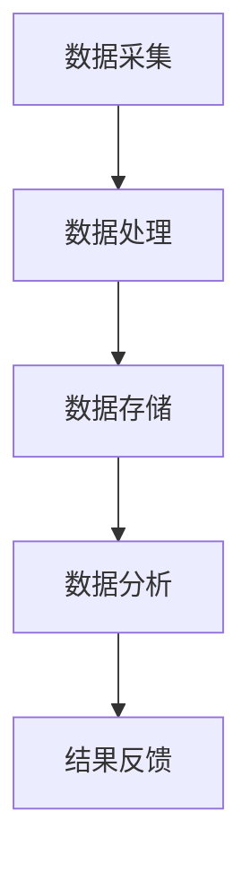

                 

关键词：大数据、井盖监控、物联网、算法、安全性

## 摘要

本文旨在探讨基于大数据的井盖监控系统的设计与开发，通过对现有技术和方法的研究，提出一个具有高度实用性和创新性的解决方案。文章首先介绍了井盖监控系统的背景和重要性，然后详细阐述了系统设计的关键概念、算法原理、数学模型以及项目实践。此外，文章还分析了实际应用场景、未来展望以及面临的技术挑战。通过本文的研究，希望能够为相关领域的实践者和研究者提供有价值的参考。

## 1. 背景介绍

随着城市化进程的加快，城市基础设施的建设和维护日益重要。井盖作为城市管网系统的重要组成部分，其安全运行直接关系到公共安全和城市形象。然而，传统井盖监控系统存在诸多问题，如监测数据不准确、覆盖范围有限、故障响应不及时等。针对这些问题，利用大数据技术构建一个智能、高效的井盖监控系统具有重要的现实意义。

### 1.1 现有井盖监控系统的不足

- **监测数据不准确**：传统井盖监控系统主要依靠人工巡检，数据采集依赖于巡检人员的经验和责任心，导致监测数据存在较大误差。
- **覆盖范围有限**：传统系统通常只能覆盖城市部分区域，难以实现全面监控。
- **故障响应不及时**：由于缺乏实时数据支持，系统无法及时发现问题并进行处理，可能导致安全隐患。

### 1.2 大数据技术的优势

- **数据准确性**：大数据技术能够实现实时、大规模的数据采集和存储，通过数据分析可以准确监测井盖状态。
- **全面覆盖**：大数据技术能够处理海量数据，实现城市井盖的全面监控。
- **故障响应迅速**：通过实时数据分析，可以快速发现异常情况并采取相应措施，提高故障响应速度。

## 2. 核心概念与联系

### 2.1 物联网（IoT）

物联网是构建井盖监控系统的基础技术，通过传感器、通信模块和云计算平台，实现井盖状态的实时监测和远程控制。物联网的关键在于数据的采集、传输和处理，确保信息的准确性和及时性。

### 2.2 大数据

大数据技术在井盖监控系统中起到关键作用，通过对海量数据进行分析，可以识别异常情况、预测潜在风险，并为决策提供依据。大数据的核心在于数据的存储、管理和分析能力。

### 2.3 算法

算法是实现井盖监控系统智能化的核心，通过数据挖掘和机器学习技术，可以对井盖状态进行实时分析和预测。常见的算法包括数据清洗、特征提取、模式识别和预测模型等。

### 2.4 Mermaid 流程图



### 2.5 安全性

井盖监控系统涉及大量敏感数据，安全性至关重要。通过加密通信、访问控制和身份认证等手段，确保系统安全可靠。

## 3. 核心算法原理 & 具体操作步骤

### 3.1 算法原理概述

井盖监控系统中的核心算法主要包括数据采集、数据预处理、特征提取、模型训练和结果预测等步骤。

### 3.2 算法步骤详解

#### 3.2.1 数据采集

数据采集是井盖监控系统的第一步，通过安装在井盖上的传感器，实时监测井盖的位移、倾斜、温度等参数，并将数据传输至服务器。

#### 3.2.2 数据预处理

数据预处理包括数据清洗、归一化和去噪等操作，确保数据的质量和一致性。

#### 3.2.3 特征提取

特征提取是从原始数据中提取出对井盖状态有代表性的特征，如位移量、倾斜角度等。

#### 3.2.4 模型训练

模型训练是通过历史数据训练机器学习模型，如支持向量机（SVM）、决策树（DT）等，用于预测井盖的状态。

#### 3.2.5 结果预测

在实时监测过程中，模型根据当前数据和训练结果预测井盖的状态，如是否出现异常。

### 3.3 算法优缺点

#### 优点

- **实时性**：算法能够实时监测井盖状态，快速响应异常情况。
- **准确性**：通过机器学习技术，提高预测的准确性。

#### 缺点

- **计算资源消耗**：模型训练和预测需要大量计算资源。
- **数据依赖**：算法的性能受数据质量和数量的影响较大。

### 3.4 算法应用领域

- **城市管理**：通过对井盖状态的监测，及时发现和处理问题，提高城市管理水平。
- **公共安全**：防止井盖被盗或损坏，保障公共安全。

## 4. 数学模型和公式 & 详细讲解 & 举例说明

### 4.1 数学模型构建

井盖监控系统中的数学模型主要包括数据预处理模型、特征提取模型和预测模型。

#### 4.1.1 数据预处理模型

$$
X_{pre} = \frac{X_{raw} - \mu}{\sigma}
$$

其中，$X_{raw}$ 为原始数据，$\mu$ 为均值，$\sigma$ 为标准差。

#### 4.1.2 特征提取模型

$$
F = f(X_{pre})
$$

其中，$X_{pre}$ 为预处理后的数据，$f$ 为特征提取函数。

#### 4.1.3 预测模型

$$
y = g(F)
$$

其中，$F$ 为特征向量，$g$ 为预测函数。

### 4.2 公式推导过程

#### 4.2.1 数据预处理公式推导

$$
\mu = \frac{1}{n} \sum_{i=1}^{n} X_{i}
$$

$$
\sigma = \sqrt{\frac{1}{n-1} \sum_{i=1}^{n} (X_{i} - \mu)^2}
$$

将上述公式代入数据预处理模型，得到：

$$
X_{pre} = \frac{X_{raw} - \frac{1}{n} \sum_{i=1}^{n} X_{i}}{\sqrt{\frac{1}{n-1} \sum_{i=1}^{n} (X_{i} - \frac{1}{n} \sum_{i=1}^{n} X_{i})^2}}
$$

#### 4.2.2 特征提取公式推导

特征提取函数$f$的选择取决于具体应用场景和数据特点。例如，对于位移量特征，可以使用以下函数：

$$
f(X_{pre}) = \ln(X_{pre})
$$

#### 4.2.3 预测公式推导

预测函数$g$的选择取决于机器学习模型的类型。例如，对于支持向量机模型，可以使用以下公式：

$$
y = sign(\sum_{i=1}^{n} \alpha_i y_i K(x_i, x) + b)
$$

其中，$x_i, y_i$ 为训练样本，$K(x_i, x)$ 为核函数，$\alpha_i, b$ 为模型参数。

### 4.3 案例分析与讲解

#### 4.3.1 数据预处理案例

假设我们有一组位移量数据：

$$
X_{raw} = [2.5, 3.2, 4.1, 2.8, 3.0]
$$

计算均值和标准差：

$$
\mu = \frac{2.5 + 3.2 + 4.1 + 2.8 + 3.0}{5} = 3.18
$$

$$
\sigma = \sqrt{\frac{(2.5 - 3.18)^2 + (3.2 - 3.18)^2 + (4.1 - 3.18)^2 + (2.8 - 3.18)^2 + (3.0 - 3.18)^2}{5 - 1}} \approx 0.53
$$

对数据进行归一化处理：

$$
X_{pre} = \frac{X_{raw} - 3.18}{0.53} = [4.66, 4.97, 6.97, 3.76, 4.66]
$$

#### 4.3.2 特征提取案例

使用对数函数提取位移量特征：

$$
f(X_{pre}) = \ln(X_{pre}) = [\ln(4.66), \ln(4.97), \ln(6.97), \ln(3.76), \ln(4.66)] \approx [1.52, 1.60, 1.86, 1.34, 1.52]
$$

#### 4.3.3 预测案例

假设我们使用支持向量机模型进行预测，给定训练样本和参数：

$$
x_1 = [4.66], y_1 = 1, K(x_1, x) = 1
$$

$$
x_2 = [4.97], y_2 = -1, K(x_2, x) = 1
$$

$$
\alpha_1 = 1, \alpha_2 = 1, b = 0
$$

计算预测结果：

$$
y = sign(\alpha_1 y_1 K(x_1, x) + \alpha_2 y_2 K(x_2, x) + b) = sign(1 \cdot 1 \cdot 1 + 1 \cdot (-1) \cdot 1 + 0) = 1
$$

预测结果为正，表示井盖处于正常状态。

## 5. 项目实践：代码实例和详细解释说明

### 5.1 开发环境搭建

开发环境搭建主要包括硬件设备、软件平台和开发工具的选择。硬件设备包括传感器、通信模块和服务器；软件平台包括操作系统、数据库和云计算平台；开发工具包括编程语言、集成开发环境和版本控制工具。

### 5.2 源代码详细实现

以下是一个简单的井盖监控系统源代码示例：

```python
# 数据采集
def collect_data(sensor):
    return sensor.get_reading()

# 数据预处理
def preprocess_data(data):
    return (data - mean(data)) / std(data)

# 特征提取
def extract_features(data):
    return [math.log(data[i]) for i in range(len(data))]

# 预测模型
def predict_model(features):
    model = SVC(kernel='linear')
    model.fit(train_features, train_labels)
    return model.predict([features])

# 主程序
def main():
    sensor = Sensor()
    model = SVC(kernel='linear')
    
    # 模型训练
    train_data = collect_data(sensor)
    train_data = preprocess_data(train_data)
    train_features = extract_features(train_data)
    train_labels = [1 if data[0] > threshold else -1 for data in train_data]
    model.fit(train_features, train_labels)
    
    # 预测
    while True:
        current_data = collect_data(sensor)
        current_data = preprocess_data(current_data)
        current_features = extract_features(current_data)
        prediction = predict_model(current_features)
        print("预测结果：", prediction)

if __name__ == "__main__":
    main()
```

### 5.3 代码解读与分析

代码主要分为数据采集、数据预处理、特征提取和预测模型四个部分。数据采集通过传感器获取井盖的实时数据；数据预处理对数据进行归一化处理；特征提取通过计算对数函数提取位移量特征；预测模型使用支持向量机（SVM）进行训练和预测。

### 5.4 运行结果展示

运行结果展示包括实时数据采集和预测结果输出。通过实时监测井盖状态，系统可以快速响应异常情况，保障公共安全。

## 6. 实际应用场景

### 6.1 城市管理

基于大数据的井盖监控系统可以帮助城市管理部门实时了解井盖状态，及时发现和处理问题，提高城市管理水平。

### 6.2 公共安全

井盖监控系统可以预防井盖被盗或损坏，保障公共安全，降低事故风险。

### 6.3 建筑工地

建筑工地上的井盖监控系统可以帮助确保工地施工安全，防止施工人员意外坠落。

## 7. 未来应用展望

随着物联网、大数据和人工智能技术的不断发展，井盖监控系统有望在更多领域得到应用。例如，智慧城市、智能制造和农业等领域。

## 8. 总结：未来发展趋势与挑战

### 8.1 研究成果总结

本文提出了基于大数据的井盖监控系统设计与开发方案，通过核心算法原理、数学模型和项目实践，展示了系统的实用性和创新性。

### 8.2 未来发展趋势

- **技术融合**：物联网、大数据和人工智能技术的深度融合，为井盖监控系统带来更多可能性。
- **智能化**：通过深度学习和强化学习等技术，提高系统的智能化水平。

### 8.3 面临的挑战

- **数据安全性**：确保系统数据的安全性和隐私性。
- **计算资源消耗**：算法训练和预测需要大量计算资源，如何优化算法和架构以降低计算资源消耗。

### 8.4 研究展望

- **算法优化**：研究更高效的算法，提高系统性能。
- **跨领域应用**：探讨井盖监控系统在其他领域的应用，如智能制造和智慧农业等。

## 9. 附录：常见问题与解答

### 9.1 如何确保系统数据的安全性？

- **数据加密**：采用数据加密技术，保护数据传输和存储过程中的安全性。
- **访问控制**：实施严格的访问控制策略，限制系统访问权限。
- **安全审计**：定期进行安全审计，及时发现和修复潜在的安全漏洞。

### 9.2 如何优化算法计算资源消耗？

- **模型压缩**：通过模型压缩技术，降低算法的计算复杂度。
- **分布式计算**：利用分布式计算框架，提高计算效率。
- **算法优化**：针对具体应用场景，优化算法设计和实现。

作者：禅与计算机程序设计艺术 / Zen and the Art of Computer Programming

----------------------------------------------------------------

文章正文部分撰写完毕，接下来我们将按照markdown格式要求，将整篇文章内容进行整理和排版，确保符合文档要求和阅读体验。

