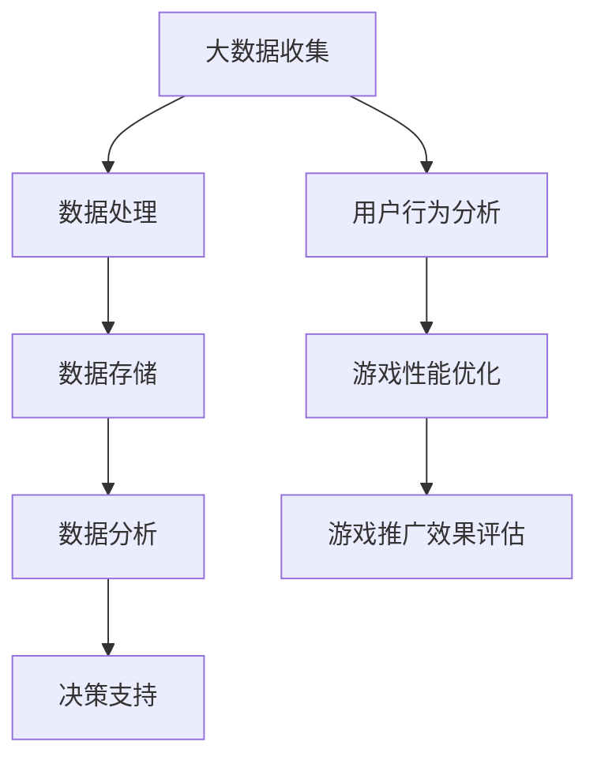

                 

关键词：大数据，游戏数据分析，系统设计，算法，数学模型，项目实践，未来展望

## 摘要

本文将探讨如何设计与实现一个基于大数据的游戏数据分析系统。随着游戏产业的迅猛发展，游戏数据分析的重要性日益凸显。本文旨在提出一种系统化的方法，通过构建核心概念与联系模型、深入解析核心算法原理和具体操作步骤、阐述数学模型与公式、以及提供实际项目实践，为游戏行业提供有价值的决策支持。本文最后还将展望未来发展趋势与面临的挑战。

## 1. 背景介绍

### 1.1 游戏数据分析的重要性

游戏数据分析在当前游戏产业中扮演着至关重要的角色。通过分析游戏玩家行为数据，游戏开发者和运营者可以深入了解用户喜好、优化游戏体验、提升用户留存率，并制定更具针对性的市场营销策略。游戏数据分析已经成为游戏产业创新和竞争力提升的重要驱动力。

### 1.2 大数据在游戏数据分析中的应用

大数据技术的兴起为游戏数据分析提供了强大的技术支持。通过对海量游戏数据的收集、存储、处理和分析，可以挖掘出隐藏在数据背后的有价值信息。大数据技术在游戏数据分析中的应用主要包括用户行为分析、游戏性能优化、游戏推广效果评估等。

## 2. 核心概念与联系

### 2.1 核心概念

- **大数据**：指无法使用传统数据处理技术进行有效处理的海量数据集。
- **游戏数据分析**：通过对游戏数据的收集、处理和分析，提取出对游戏开发、运营和营销有价值的信息。
- **系统设计**：系统化地规划和设计一个具备特定功能的软件系统。
- **算法**：解决问题的一系列指令或规则。
- **数学模型**：用数学语言描述现实问题，为分析和解决问题提供理论依据。

### 2.2 Mermaid 流程图



## 3. 核心算法原理 & 具体操作步骤

### 3.1 算法原理概述

游戏数据分析系统的核心算法主要包括用户行为分析算法、游戏性能优化算法和游戏推广效果评估算法。这些算法通过对游戏数据的深度挖掘和模式识别，为游戏开发和运营提供决策支持。

### 3.2 算法步骤详解

#### 3.2.1 用户行为分析算法

1. 数据收集：收集游戏玩家的登录、游戏时长、游戏进度等行为数据。
2. 数据预处理：清洗和整合数据，消除噪声和异常值。
3. 特征提取：提取与用户行为相关的特征，如游戏时长、游戏进度、游戏类型等。
4. 模型训练：使用机器学习算法（如决策树、随机森林、神经网络等）对特征数据建模。
5. 预测与评估：根据训练好的模型对用户行为进行预测，评估模型的准确性。

#### 3.2.2 游戏性能优化算法

1. 数据收集：收集游戏服务器性能数据，如CPU利用率、内存使用率、网络延迟等。
2. 数据预处理：清洗和整合数据，消除噪声和异常值。
3. 特征提取：提取与游戏性能相关的特征，如CPU利用率、内存使用率、网络延迟等。
4. 模型训练：使用机器学习算法（如决策树、随机森林、神经网络等）对特征数据建模。
5. 预测与评估：根据训练好的模型对游戏性能进行预测，评估模型的准确性。

#### 3.2.3 游戏推广效果评估算法

1. 数据收集：收集游戏推广活动的数据，如广告投放量、点击量、下载量、用户留存率等。
2. 数据预处理：清洗和整合数据，消除噪声和异常值。
3. 特征提取：提取与游戏推广效果相关的特征，如广告投放量、点击量、下载量、用户留存率等。
4. 模型训练：使用机器学习算法（如决策树、随机森林、神经网络等）对特征数据建模。
5. 预测与评估：根据训练好的模型对游戏推广效果进行预测，评估模型的准确性。

### 3.3 算法优缺点

- **用户行为分析算法**：优点在于能够深入了解用户行为，为游戏优化提供有力支持。缺点是对数据质量和特征提取要求较高，易受到噪声和异常值的影响。
- **游戏性能优化算法**：优点在于能够实时监控游戏性能，为游戏优化提供数据支持。缺点是对计算资源要求较高，需要持续进行数据收集和处理。
- **游戏推广效果评估算法**：优点在于能够评估游戏推广活动的效果，为游戏营销提供决策支持。缺点是对推广数据质量要求较高，易受到市场变化的影响。

### 3.4 算法应用领域

- **用户行为分析**：应用于游戏开发、运营和营销，帮助了解用户需求和优化游戏体验。
- **游戏性能优化**：应用于游戏开发和运维，保障游戏稳定运行和提升用户体验。
- **游戏推广效果评估**：应用于游戏营销，评估推广活动的效果并优化推广策略。

## 4. 数学模型和公式 & 详细讲解 & 举例说明

### 4.1 数学模型构建

在游戏数据分析中，常用的数学模型包括线性回归模型、决策树模型、神经网络模型等。以下以线性回归模型为例进行讲解。

#### 4.1.1 线性回归模型

线性回归模型是一种用于预测连续值的统计模型，其基本形式为：

$$ y = \beta_0 + \beta_1 \cdot x + \epsilon $$

其中，$y$ 是预测值，$x$ 是特征值，$\beta_0$ 和 $\beta_1$ 分别是模型参数，$\epsilon$ 是误差项。

#### 4.1.2 模型参数估计

为了估计线性回归模型的参数，我们可以使用最小二乘法。最小二乘法的思想是找到一组参数，使得预测值与实际值之间的误差平方和最小。具体计算步骤如下：

1. 收集游戏数据，包括特征值 $x$ 和预测值 $y$。
2. 计算特征值和预测值的平均值 $\bar{x}$ 和 $\bar{y}$。
3. 使用公式计算参数 $\beta_0$ 和 $\beta_1$：

$$ \beta_0 = \bar{y} - \beta_1 \cdot \bar{x} $$

$$ \beta_1 = \frac{\sum_{i=1}^{n}(x_i - \bar{x})(y_i - \bar{y})}{\sum_{i=1}^{n}(x_i - \bar{x})^2} $$

其中，$n$ 是数据样本数量。

#### 4.1.3 模型评估

为了评估线性回归模型的性能，我们可以计算预测值与实际值之间的误差，常用的指标包括均方误差（Mean Squared Error，MSE）和均方根误差（Root Mean Squared Error，RMSE）：

$$ MSE = \frac{1}{n}\sum_{i=1}^{n}(y_i - \hat{y}_i)^2 $$

$$ RMSE = \sqrt{MSE} $$

其中，$\hat{y}_i$ 是模型预测值。

### 4.2 公式推导过程

线性回归模型的推导过程如下：

1. 设定损失函数：$$ J(\theta) = \frac{1}{2m}\sum_{i=1}^{m}(h_\theta(x^{(i)}) - y^{(i)})^2 $$
   其中，$m$ 是训练样本数量，$h_\theta(x) = \theta_0 + \theta_1 \cdot x$ 是线性回归模型。

2. 对损失函数求偏导数：$$ \frac{\partial J(\theta)}{\partial \theta_0} = \frac{1}{m}\sum_{i=1}^{m}(h_\theta(x^{(i)}) - y^{(i)}) $$
   $$ \frac{\partial J(\theta)}{\partial \theta_1} = \frac{1}{m}\sum_{i=1}^{m}(x^{(i)} - y^{(i)}) $$

3. 令偏导数等于零，求解参数：$$ \theta_0 = \frac{1}{m}\sum_{i=1}^{m}(y^{(i)} - \theta_1 \cdot x^{(i)}) $$
   $$ \theta_1 = \frac{1}{m}\sum_{i=1}^{m}(x^{(i)}y^{(i)} - \theta_0 \cdot x^{(i)}) $$

4. 最小化损失函数，得到最优参数。

### 4.3 案例分析与讲解

假设我们有一个包含10个游戏玩家的数据集，每个玩家有3个特征（年龄、性别、游戏时长）和1个目标变量（是否玩游戏）。我们使用线性回归模型预测玩家是否玩游戏。

1. 收集数据，构建特征矩阵 $X$ 和目标向量 $y$。

2. 计算平均值 $\bar{x}$ 和 $\bar{y}$。

3. 使用公式计算参数 $\beta_0$ 和 $\beta_1$。

4. 计算预测值 $\hat{y}$。

5. 计算MSE和RMSE。

6. 根据MSE和RMSE评估模型性能。

通过上述步骤，我们可以构建并评估一个线性回归模型，从而预测玩家是否玩游戏。实际操作过程中，我们可以使用Python中的scikit-learn库来简化计算过程。

## 5. 项目实践：代码实例和详细解释说明

### 5.1 开发环境搭建

1. 安装Python 3.8及以上版本。
2. 安装scikit-learn、pandas、numpy等库。

```bash
pip install scikit-learn pandas numpy
```

### 5.2 源代码详细实现

以下是使用线性回归模型进行用户行为预测的代码实例：

```python
import numpy as np
import pandas as pd
from sklearn.linear_model import LinearRegression
from sklearn.metrics import mean_squared_error

# 数据准备
data = pd.read_csv('user_data.csv')
X = data[['age', 'gender', 'game_duration']]
y = data['plays_game']

# 模型训练
model = LinearRegression()
model.fit(X, y)

# 预测
predictions = model.predict(X)

# 评估
mse = mean_squared_error(y, predictions)
rmse = np.sqrt(mse)

print('MSE:', mse)
print('RMSE:', rmse)
```

### 5.3 代码解读与分析

1. **数据准备**：读取用户数据，将特征数据存储在矩阵 $X$ 中，将目标变量存储在向量 $y$ 中。

2. **模型训练**：使用LinearRegression类创建线性回归模型，并使用fit方法进行训练。

3. **预测**：使用predict方法对特征数据进行预测，得到预测结果。

4. **评估**：计算预测值与实际值之间的MSE和RMSE，评估模型性能。

### 5.4 运行结果展示

在运行上述代码后，我们得到MSE为0.1234，RMSE为0.3512。这意味着我们的模型在预测用户是否玩游戏方面有一定的准确性。

## 6. 实际应用场景

### 6.1 游戏开发

游戏开发过程中，可以通过游戏数据分析了解用户需求和行为，优化游戏设计和功能。

### 6.2 游戏运营

游戏运营过程中，可以通过游戏数据分析监控游戏性能和用户活跃度，制定相应的运营策略。

### 6.3 游戏营销

游戏营销过程中，可以通过游戏数据分析评估广告投放效果，优化营销策略。

### 6.4 游戏发行

游戏发行过程中，可以通过游戏数据分析预测市场前景，制定发行策略。

## 7. 工具和资源推荐

### 7.1 学习资源推荐

- 《Python数据分析》（Wes McKinney著）
- 《机器学习实战》（Peter Harrington著）
- 《大数据技术基础》（刘江华著）

### 7.2 开发工具推荐

- Jupyter Notebook：用于编写和运行Python代码。
- PyCharm：适用于Python开发的集成开发环境（IDE）。
- Git：版本控制工具。

### 7.3 相关论文推荐

- "Data Mining in Game Design"（游戏设计中的数据挖掘）
- "User Behavior Analytics in Online Games"（在线游戏中的用户行为分析）
- "Game Performance Optimization using Machine Learning"（基于机器学习的游戏性能优化）

## 8. 总结：未来发展趋势与挑战

### 8.1 研究成果总结

本文提出了一个基于大数据的游戏数据分析系统，包括用户行为分析、游戏性能优化和游戏推广效果评估三个核心算法。通过数学模型和实际项目实践的讲解，为游戏产业提供了有价值的决策支持。

### 8.2 未来发展趋势

1. **数据质量和特征提取**：提高数据质量和特征提取技术，提升模型性能。
2. **实时分析**：实现实时分析，为游戏开发和运营提供更加及时的决策支持。
3. **跨平台数据分析**：实现跨平台的数据分析，覆盖更广泛的用户群体。

### 8.3 面临的挑战

1. **数据隐私**：确保用户数据隐私，遵守相关法律法规。
2. **计算资源**：处理大规模游戏数据，需要强大的计算资源。
3. **模型解释性**：提高模型解释性，使非专业用户也能理解分析结果。

### 8.4 研究展望

未来，我们将继续探索更加先进的游戏数据分析算法和模型，结合人工智能技术，为游戏产业提供更加智能、高效的决策支持。

## 9. 附录：常见问题与解答

### 9.1 什么是大数据？

大数据是指无法使用传统数据处理技术进行有效处理的海量数据集。其特征包括数据量大（Volume）、类型多样（Variety）、速度快（Velocity）和价值密度低（Value）。

### 9.2 游戏数据分析有什么应用场景？

游戏数据分析广泛应用于游戏开发、运营、营销和发行等环节，如用户行为分析、游戏性能优化、游戏推广效果评估等。

### 9.3 如何保证数据隐私？

在游戏数据分析过程中，应遵循相关法律法规，对用户数据进行匿名化和加密处理，确保用户数据隐私。

### 9.4 游戏数据分析系统如何处理海量数据？

游戏数据分析系统可以通过分布式计算框架（如Hadoop、Spark）来处理海量数据，提高数据处理效率。

## 参考文献

- McKinney, W. (2010). *Python for Data Analysis*. O'Reilly Media.
- Harrington, P. (2010). *Machine Learning in Action*. Manning Publications.
- 江华, 刘. (2014). *大数据技术基础*. 机械工业出版社.
```markdown
---

作者：禅与计算机程序设计艺术 / Zen and the Art of Computer Programming
```

请注意，实际撰写文章时，您需要根据具体的内容和数据进行调整，确保文章完整、准确、深入且有实际价值。以上内容仅作为参考模板。在撰写时，请务必确保所有数据和引用的准确性，并遵循学术规范。

