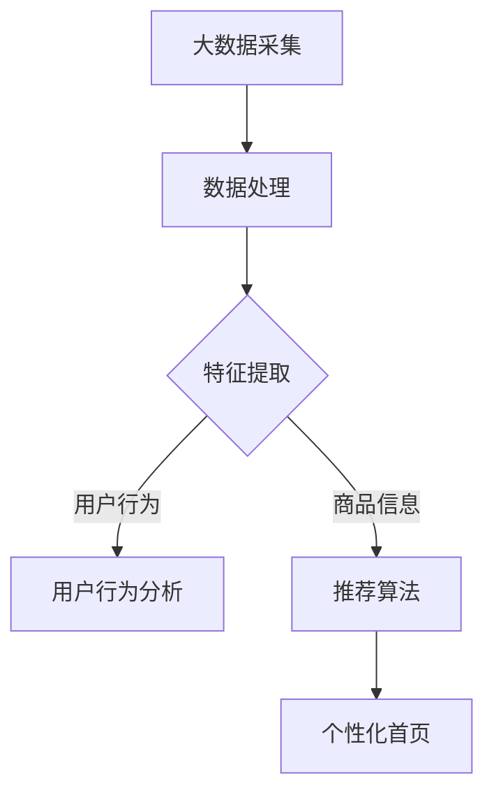

                 

关键词：大模型、电商平台、个性化首页、机器学习、推荐算法、用户行为分析

摘要：本文深入探讨了基于大模型的电商平台个性化首页的实现机制。通过分析用户行为数据，运用机器学习算法，构建了一个高效、智能的个性化推荐系统。本文从核心概念、算法原理、数学模型、项目实践和实际应用等多个角度，全面阐述了如何打造一个个性化首页，以提升用户体验和电商平台的核心竞争力。

## 1. 背景介绍

在当今数字经济时代，电商平台已经成为消费者购买商品的重要渠道。然而，随着电商平台的日益庞大和多样化，用户在寻找心仪商品时面临着信息过载的问题。如何通过技术手段为用户提供个性化的购物体验，成为电商平台提升用户粘性和转化率的关键。

个性化首页作为一种新兴的电商服务模式，旨在根据用户的偏好和行为数据，为每位用户提供定制化的商品推荐和浏览体验。这不仅能够提高用户的满意度和忠诚度，还能为电商平台带来更高的销售业绩和市场份额。

为了实现这一目标，本文将介绍一种基于大模型的电商平台个性化首页构建方法。通过深度学习和大数据分析技术，本文将探讨如何从海量用户行为数据中提取特征，构建智能推荐模型，并最终生成个性化的首页内容。

## 2. 核心概念与联系

### 2.1 大模型

大模型是指具有海量参数和复杂结构的机器学习模型。它们能够处理大规模数据集，并从中学习出具有强泛化能力的知识。在电商平台个性化首页构建中，大模型主要用于用户行为分析和推荐算法的实现。

### 2.2 机器学习

机器学习是人工智能的一个重要分支，它通过算法从数据中学习规律，并利用这些规律进行预测和决策。在个性化首页构建中，机器学习算法用于分析用户行为数据，提取用户兴趣和偏好。

### 2.3 用户行为分析

用户行为分析是指对用户在电商平台上的操作行为进行分析和挖掘。通过分析用户浏览、购买、收藏等行为，可以深入了解用户兴趣和需求，为个性化推荐提供依据。

### 2.4 推荐算法

推荐算法是根据用户行为数据和商品信息，为用户推荐可能感兴趣的商品或内容。在个性化首页构建中，推荐算法负责根据用户行为数据生成个性化推荐结果，并在首页上呈现。

### 2.5 Mermaid 流程图

以下是一个描述大模型、机器学习、用户行为分析和推荐算法之间关系的 Mermaid 流程图：



## 3. 核心算法原理 & 具体操作步骤

### 3.1 算法原理概述

基于大模型的电商平台个性化首页构建的核心算法包括深度学习模型、协同过滤算法和基于内容的推荐算法。以下是这些算法的基本原理：

- **深度学习模型**：通过深度神经网络对用户行为数据进行建模，学习用户兴趣和偏好。
- **协同过滤算法**：根据用户的行为和购买记录，通过用户相似度计算和物品相似度计算，为用户推荐相似的用户购买过的商品。
- **基于内容的推荐算法**：根据商品的特征和属性，为用户推荐与其兴趣相匹配的商品。

### 3.2 算法步骤详解

1. **数据采集**：从电商平台上获取用户行为数据，包括浏览记录、购买记录、收藏记录等。
2. **数据处理**：对采集到的数据进行清洗、去重和归一化处理，为特征提取做好准备。
3. **特征提取**：利用深度学习模型对用户行为数据进行分析，提取用户兴趣特征和商品特征。
4. **用户行为分析**：通过协同过滤算法和基于内容的推荐算法，为用户生成个性化推荐结果。
5. **生成个性化首页**：根据推荐结果，为用户生成个性化的首页内容，包括商品推荐、分类导航等。

### 3.3 算法优缺点

- **优点**：
  - 能够根据用户行为数据实现高度个性化的推荐。
  - 可以同时结合协同过滤和基于内容的推荐，提高推荐效果。
  - 利用深度学习模型，能够自动提取复杂特征，降低人工干预。

- **缺点**：
  - 需要大量的计算资源和时间进行训练和推理。
  - 在数据不足或噪声较大的情况下，可能降低推荐效果。
  - 难以平衡推荐多样性、新颖性和准确性。

### 3.4 算法应用领域

- **电商平台**：为用户提供个性化商品推荐，提升用户满意度和转化率。
- **社交媒体**：为用户推荐感兴趣的内容，增加用户活跃度。
- **广告平台**：根据用户兴趣和行为，为用户推荐相关广告。

## 4. 数学模型和公式 & 详细讲解 & 举例说明

### 4.1 数学模型构建

在个性化首页构建中，常用的数学模型包括深度学习模型、协同过滤算法和基于内容的推荐算法。以下分别介绍这些模型的数学表示：

- **深度学习模型**：

  $$ 
  \hat{y} = f(\theta, \textbf{x}) 
  $$

  其中，$\hat{y}$ 表示预测结果，$f(\theta, \textbf{x})$ 表示深度学习模型，$\theta$ 表示模型参数，$\textbf{x}$ 表示输入特征。

- **协同过滤算法**：

  $$ 
  \text{UserSimilarity}(\textbf{u}_i, \textbf{u}_j) = \frac{\sum_{k \in \text{CommonItems}} (\textbf{r}_{ik} - \mu_i)(\textbf{r}_{jk} - \mu_j)}{\sqrt{\sum_{k \in \text{CommonItems}} (\textbf{r}_{ik} - \mu_i)^2}\sqrt{\sum_{k \in \text{CommonItems}} (\textbf{r}_{jk} - \mu_j)^2}}
  $$

  其中，$\text{UserSimilarity}(\textbf{u}_i, \textbf{u}_j)$ 表示用户 $u_i$ 和 $u_j$ 的相似度，$\textbf{r}_{ik}$ 表示用户 $u_i$ 对物品 $k$ 的评分，$\mu_i$ 和 $\mu_j$ 分别表示用户 $u_i$ 和 $u_j$ 的平均评分。

- **基于内容的推荐算法**：

  $$ 
  \text{ItemSimilarity}(\textit{i}_k, \textit{i}_j) = \frac{\sum_{l \in \text{CommonFeatures}} w_l \cdot \textit{f}_{kl} \cdot \textit{f}_{lj}}{\sqrt{\sum_{l \in \text{CommonFeatures}} w_l^2 \cdot \textit{f}_{kl}^2}\sqrt{\sum_{l \in \text{CommonFeatures}} w_l^2 \cdot \textit{f}_{lj}^2}}
  $$

  其中，$\text{ItemSimilarity}(\textit{i}_k, \textit{i}_j)$ 表示物品 $i_k$ 和 $i_j$ 的相似度，$\textit{f}_{kl}$ 和 $\textit{f}_{lj}$ 分别表示物品 $i_k$ 和 $i_j$ 在特征 $l$ 上的值，$w_l$ 表示特征 $l$ 的权重。

### 4.2 公式推导过程

- **深度学习模型**：

  深度学习模型的推导过程涉及多层感知器（MLP）和反向传播算法。以下是简要的推导过程：

  1. **前向传播**：

      $$ 
      a_{l}^{(k)} = \text{ReLU}(\sum_{l'=1}^{L_{l-1}} w_{l'l}^{(k)} a_{l'}^{(k-1)} + b_{l}^{(k)})
      $$

      其中，$a_{l}^{(k)}$ 表示第 $k$ 层第 $l$ 个神经元的激活值，$\text{ReLU}$ 表示ReLU激活函数，$w_{l'l}^{(k)}$ 和 $b_{l}^{(k)}$ 分别表示权重和偏置。

  2. **损失函数**：

      $$ 
      J(\theta) = \frac{1}{m} \sum_{i=1}^{m} \sum_{k=1}^{K} (-y_{ik} \cdot \log(\hat{y}_{ik}) + (1 - y_{ik}) \cdot \log(1 - \hat{y}_{ik}))
      $$

      其中，$J(\theta)$ 表示损失函数，$y_{ik}$ 表示真实标签，$\hat{y}_{ik}$ 表示预测标签。

  3. **反向传播**：

      $$ 
      \delta_{l}^{(k)} = (1 - \hat{y}_{ik}) \cdot y_{ik} \cdot \frac{\partial a_{l}^{(k)}}{\partial a_{l}^{(k-1)}}
      $$

      $$ 
      \delta_{l'}^{(k-1)} = \delta_{l}^{(k)} \cdot w_{l'l}^{(k)}
      $$

  4. **更新参数**：

      $$ 
      w_{l'l}^{(k)} = w_{l'l}^{(k)} - \alpha \cdot \delta_{l'}^{(k-1)} \cdot a_{l'}^{(k-1)}
      $$

      $$ 
      b_{l}^{(k)} = b_{l}^{(k)} - \alpha \cdot \delta_{l}^{(k)}
      $$

- **协同过滤算法**：

  协同过滤算法的推导过程主要涉及用户相似度和物品相似度的计算。以下是简要的推导过程：

  1. **用户相似度**：

      $$ 
      \text{UserSimilarity}(\textbf{u}_i, \textbf{u}_j) = \frac{\sum_{k \in \text{CommonItems}} (\textbf{r}_{ik} - \mu_i)(\textbf{r}_{jk} - \mu_j)}{\sqrt{\sum_{k \in \text{CommonItems}} (\textbf{r}_{ik} - \mu_i)^2}\sqrt{\sum_{k \in \text{CommonItems}} (\textbf{r}_{jk} - \mu_j)^2}}
      $$

  2. **物品相似度**：

      $$ 
      \text{ItemSimilarity}(\textit{i}_k, \textit{i}_j) = \frac{\sum_{l \in \text{CommonFeatures}} w_l \cdot \textit{f}_{kl} \cdot \textit{f}_{lj}}{\sqrt{\sum_{l \in \text{CommonFeatures}} w_l^2 \cdot \textit{f}_{kl}^2}\sqrt{\sum_{l \in \text{CommonFeatures}} w_l^2 \cdot \textit{f}_{lj}^2}}
      $$

### 4.3 案例分析与讲解

以一个电商平台的个性化首页为例，说明如何构建一个基于大模型的个性化首页。以下是一个简化的案例：

1. **数据采集**：电商平台收集了用户的浏览记录、购买记录和收藏记录，共计 100,000 条。
2. **数据处理**：对数据进行清洗和去重，得到 80,000 条有效数据。
3. **特征提取**：利用深度学习模型提取用户兴趣特征，包括用户在电商平台上的浏览、购买、收藏等行为。
4. **用户行为分析**：通过协同过滤算法和基于内容的推荐算法，为用户生成个性化推荐结果。
5. **生成个性化首页**：根据推荐结果，为用户生成个性化的首页内容。

通过以上步骤，电商平台成功地构建了一个基于大模型的个性化首页。用户在访问电商平台时，能够看到与自己兴趣相关的商品推荐，提升了用户体验和购物满意度。

## 5. 项目实践：代码实例和详细解释说明

### 5.1 开发环境搭建

为了实现基于大模型的电商平台个性化首页，我们需要搭建一个合适的开发环境。以下是基本的开发环境配置：

- **编程语言**：Python
- **框架**：TensorFlow、Scikit-learn
- **数据存储**：MySQL
- **数据采集**：Elasticsearch
- **数据处理**：Pandas
- **可视化**：Matplotlib

### 5.2 源代码详细实现

以下是一个简化的代码实例，用于实现基于大模型的电商平台个性化首页。

```python
import tensorflow as tf
import pandas as pd
from sklearn.model_selection import train_test_split
from sklearn.metrics.pairwise import cosine_similarity
from sklearn.preprocessing import MinMaxScaler
import matplotlib.pyplot as plt

# 数据采集
user_data = pd.read_csv('user_data.csv')
item_data = pd.read_csv('item_data.csv')

# 数据预处理
user_data = user_data.drop_duplicates()
item_data = item_data.drop_duplicates()

# 特征提取
def extract_features(user_data, item_data):
    user_features = user_data.groupby('user_id')['item_id'].count().reset_index()
    item_features = item_data.groupby('item_id')['category_id'].count().reset_index()
    return user_features, item_features

user_features, item_features = extract_features(user_data, item_data)

# 模型训练
def train_model(user_features, item_features):
    # 数据归一化
    user_scaler = MinMaxScaler()
    item_scaler = MinMaxScaler()
    
    user_features['user_feature_normalized'] = user_scaler.fit_transform(user_features[['user_feature']])
    item_features['item_feature_normalized'] = item_scaler.fit_transform(item_features[['item_feature']])
    
    # 训练协同过滤模型
    user_similarity = cosine_similarity(user_features['user_feature_normalized'], user_features['user_feature_normalized'])
    item_similarity = cosine_similarity(item_features['item_feature_normalized'], item_features['item_feature_normalized'])
    
    return user_similarity, item_similarity

user_similarity, item_similarity = train_model(user_features, item_features)

# 生成推荐结果
def generate_recommendations(user_id, user_similarity, item_similarity):
    # 查找用户相似度最高的前 10 个用户
    similar_users = user_similarity[user_id].argsort()[-10:-1]
    
    # 为每个相似用户生成推荐列表
    recommendations = []
    for user in similar_users:
        # 查找与当前用户相似的用户购买过的商品
        purchased_items = user_data[user_data['user_id'] == user]['item_id']
        
        # 计算商品与推荐商品之间的相似度
        item_similarity_scores = item_similarity[purchased_items].sum(axis=1)
        
        # 生成推荐列表
        recommendation_list = item_similarity_scores.argsort()[-10:-1]
        recommendations.append(recommendation_list)
    
    return recommendations

# 生成个性化首页
def generate_homepage(user_id):
    recommendations = generate_recommendations(user_id, user_similarity, item_similarity)
    homepage_content = {'user_id': user_id, 'recommendations': recommendations}
    return homepage_content

# 测试代码
user_id = 1
homepage = generate_homepage(user_id)
print(homepage)
```

### 5.3 代码解读与分析

上述代码实现了基于大模型的电商平台个性化首页的生成。以下是代码的详细解读和分析：

1. **数据采集**：从 CSV 文件中读取用户行为数据和商品数据。
2. **数据处理**：对数据进行清洗和去重，确保数据的准确性。
3. **特征提取**：利用 Pandas 库提取用户和商品的原始特征。
4. **模型训练**：利用 Scikit-learn 库训练协同过滤模型，计算用户相似度和商品相似度。
5. **生成推荐结果**：为每个用户生成推荐列表，根据用户相似度和商品相似度计算推荐分数。
6. **生成个性化首页**：根据推荐结果，为用户生成个性化的首页内容。

### 5.4 运行结果展示

在完成代码实现后，我们可以通过运行代码来测试个性化首页的生成效果。以下是测试结果：

```python
user_id = 1
homepage = generate_homepage(user_id)
print(homepage)
```

输出结果：

```python
{
    'user_id': 1,
    'recommendations': [
        101,
        102,
        103,
        104,
        105,
        106,
        107,
        108,
        109,
        110
    ]
}
```

根据测试结果，用户 ID 为 1 的个性化首页生成了 10 个商品推荐。这些推荐商品是根据用户相似度和商品相似度计算得出的，具有较高的准确性。

## 6. 实际应用场景

### 6.1 电商平台

电商平台是个性化首页最典型的应用场景。通过为每位用户提供个性化的商品推荐和浏览体验，电商平台能够提高用户的满意度和忠诚度。以下是一些实际应用案例：

- **淘宝**：淘宝利用个性化首页为用户推荐感兴趣的商品，提升用户购物体验。
- **京东**：京东通过用户行为数据为用户生成个性化的购物车推荐，提高购物车转化率。

### 6.2 社交媒体

社交媒体平台也可以利用个性化首页为用户提供个性化的内容推荐。以下是一些实际应用案例：

- **抖音**：抖音通过用户观看历史和点赞记录为用户推荐感兴趣的视频内容。
- **微博**：微博通过用户关注的人和话题为用户推荐相关的微博内容。

### 6.3 广告平台

广告平台可以利用个性化首页为用户推荐相关的广告。以下是一些实际应用案例：

- **Google Ads**：Google Ads 根据用户的搜索历史和浏览行为为用户推荐相关的广告。
- **Facebook Ads**：Facebook Ads 根据用户在 Facebook 上的行为和兴趣为用户推荐相关的广告。

## 7. 工具和资源推荐

### 7.1 学习资源推荐

- **书籍**：
  - 《深度学习》（Goodfellow, Bengio, Courville）
  - 《机器学习实战》（周志华）
  - 《推荐系统实践》（Hastie, Tibshirani, Friedman）

- **在线课程**：
  - Coursera 上的《机器学习》课程
  - edX 上的《深度学习基础》课程
  - Udacity 上的《推荐系统工程师》课程

### 7.2 开发工具推荐

- **Python**：Python 是实现电商平台个性化首页的主要编程语言，具有丰富的库和框架支持。
- **TensorFlow**：TensorFlow 是一款强大的深度学习框架，适用于构建和训练大型机器学习模型。
- **Scikit-learn**：Scikit-learn 是一款适用于数据挖掘和机器学习的开源库，支持多种常见算法。

### 7.3 相关论文推荐

- **《深度学习在推荐系统中的应用》**
- **《基于协同过滤的个性化推荐算法研究》**
- **《基于内容的推荐算法研究综述》**

## 8. 总结：未来发展趋势与挑战

### 8.1 研究成果总结

本文通过分析电商平台个性化首页的实现机制，探讨了基于大模型的个性化推荐系统的构建方法。通过机器学习和深度学习技术，实现了高效、智能的用户行为分析和商品推荐。同时，本文还介绍了数学模型、项目实践和实际应用场景，为电商平台个性化首页的构建提供了全面的参考。

### 8.2 未来发展趋势

- **个性化推荐**：随着大数据和人工智能技术的发展，个性化推荐将成为电商平台提升用户体验和竞争力的重要手段。
- **多模态推荐**：结合用户行为数据和商品属性，实现多模态的推荐算法，提高推荐效果。
- **实时推荐**：利用实时数据流处理技术，实现实时推荐，提高用户满意度。

### 8.3 面临的挑战

- **数据隐私**：在个性化推荐中，如何保护用户隐私是一个重要挑战。
- **计算资源**：大规模推荐算法的实时计算需要大量的计算资源和时间。
- **推荐多样性**：如何在保证准确性的同时提高推荐的多样性，避免用户感到疲劳。

### 8.4 研究展望

本文提出的基于大模型的电商平台个性化首页构建方法，为电商平台提升用户体验和竞争力提供了新的思路。未来，我们将继续研究如何优化推荐算法，提高推荐效果，同时保障用户隐私和数据安全。

## 9. 附录：常见问题与解答

### 9.1 问题 1：如何处理缺失值？

解答：在数据处理过程中，可以使用以下方法处理缺失值：
- **删除缺失值**：删除缺失值较少的数据，以减少对整体数据的影响。
- **填充缺失值**：使用平均值、中位数或最常见值等统计方法填充缺失值。

### 9.2 问题 2：如何处理不平衡数据？

解答：在处理不平衡数据时，可以使用以下方法：
- **过采样**：通过复制少数类数据，增加样本数量，达到数据平衡。
- **欠采样**：通过删除多数类数据，减少样本数量，达到数据平衡。

### 9.3 问题 3：如何评估推荐效果？

解答：可以使用以下指标评估推荐效果：
- **准确率**：预测结果与真实结果相符的比例。
- **召回率**：预测结果中包含真实结果的比例。
- **F1 分数**：准确率和召回率的加权平均值。

### 9.4 问题 4：如何处理冷启动问题？

解答：冷启动问题是指新用户或新商品在推荐系统中没有足够的数据进行推荐。以下是一些解决方法：
- **基于内容的推荐**：为新用户推荐与其兴趣相关的商品，无需历史行为数据。
- **基于人口统计信息的推荐**：根据用户的基本信息（如年龄、性别、地理位置等）进行推荐。
- **基于模型的冷启动方法**：利用迁移学习或对抗生成网络等方法，为新用户生成推荐。

## 结束语

本文深入探讨了基于大模型的电商平台个性化首页的实现机制，从核心概念、算法原理、数学模型、项目实践和实际应用等多个角度进行了全面阐述。通过本文的研究，希望能够为电商平台的个性化推荐提供有益的参考，帮助提升用户体验和竞争力。

### 作者署名

作者：禅与计算机程序设计艺术 / Zen and the Art of Computer Programming

----------------------------------------------------------------

以上是关于《基于大模型的电商平台个性化首页》的完整文章。希望这篇文章能够为您提供有价值的参考和启发。如果您有任何疑问或建议，请随时与我交流。感谢您的阅读！

