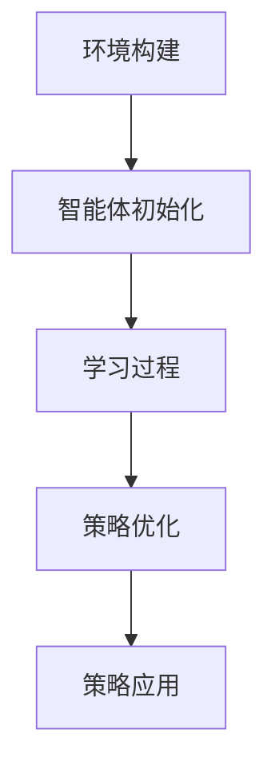

                 

关键词：强化学习，动态定价，机器学习，商业策略，数据分析

> 摘要：本文将探讨一种创新的基于强化学习的动态定价策略，该策略能够帮助企业根据市场需求和竞争环境实时调整产品价格，以提高利润和市场占有率。通过分析强化学习的基本原理，我们将会展示该策略的构建过程、算法实现以及在实际应用中的优势。文章还提供了详细的数学模型和项目实践案例，帮助读者深入理解这一策略的实用性和前景。

## 1. 背景介绍

随着互联网和电子商务的迅速发展，市场竞争日益激烈，企业需要更灵活的定价策略来适应不断变化的市场需求。传统的定价策略通常是静态的，依赖于历史数据和经验模型，难以快速响应市场变化。而动态定价策略则通过实时监测市场动态，灵活调整产品价格，以最大化企业的利润。

强化学习作为一种先进的机器学习技术，具有自主学习和策略优化的能力。它通过与环境交互，不断调整策略以实现目标。强化学习在动态定价策略中的应用，使得企业能够利用数据驱动的决策过程，快速适应市场变化，提高竞争力。

本文旨在探讨基于强化学习的动态定价策略，通过深入分析其原理和实现方法，帮助企业实现更高效、更智能的定价决策。

### 强化学习的发展历程

强化学习（Reinforcement Learning，RL）起源于20世纪50年代，由美国心理学家阿兰·图灵提出。最初的强化学习研究主要集中在动物行为模拟和自动化控制领域。随着计算机科学和人工智能的发展，强化学习逐渐成为机器学习领域的一个重要分支。

20世纪80年代，随着神经网络和决策理论的发展，强化学习开始受到广泛关注。1990年代，Q-Learning算法的提出标志着强化学习进入了一个新的阶段。Q-Learning算法通过值函数估计策略，使得强化学习在解决连续问题和复杂环境下表现出色。

进入21世纪，随着深度学习技术的发展，深度强化学习（Deep Reinforcement Learning，DRL）成为研究的热点。深度强化学习结合了深度神经网络和强化学习，能够处理更加复杂的环境和决策问题。

### 动态定价策略的应用背景

动态定价策略在企业运营中具有重要意义。它通过实时监测市场需求和竞争环境，灵活调整产品价格，以最大化企业的利润和市场占有率。以下是一些动态定价策略的应用场景：

1. **电子商务**：电商平台通过动态定价策略，根据用户行为和竞争对手的价格变化，实时调整产品价格，以吸引更多用户和提高销售额。
2. **酒店和航空业**：酒店和航空公司通过动态定价策略，根据季节、节假日、航班剩余座位等因素，灵活调整价格，最大化收益。
3. **制造业**：制造业企业通过动态定价策略，根据原材料成本、生产能力和市场需求，调整产品价格，以保持竞争力。

动态定价策略不仅能够提高企业的利润，还能增强企业的市场竞争力，适应不断变化的市场环境。

## 2. 核心概念与联系

### 强化学习的基本原理

强化学习（Reinforcement Learning，RL）是一种通过奖励信号来引导智能体（Agent）学习策略的机器学习技术。在强化学习中，智能体通过与环境（Environment）的交互，不断调整其行为（Action），以实现某一目标（Goal）。

强化学习的基本原理包括以下几个核心概念：

1. **状态（State）**：智能体在某一时刻所处的环境条件。
2. **动作（Action）**：智能体在某一状态下可以采取的行为。
3. **奖励（Reward）**：环境对智能体行为的即时反馈，用于指导智能体的下一步行为。
4. **策略（Policy）**：智能体在某一状态下采取的概率分布，用于指导其行为。

强化学习通过以下步骤进行学习：

1. **初始状态**：智能体处于某一初始状态。
2. **选择动作**：智能体根据当前状态和策略，选择一个动作。
3. **环境反馈**：环境根据智能体的动作，给出奖励信号。
4. **状态更新**：智能体根据奖励信号，更新当前状态。
5. **重复循环**：智能体不断重复上述步骤，通过不断的试错和奖励反馈，逐步优化其策略。

### 动态定价策略的基本概念

动态定价策略（Dynamic Pricing Strategy）是一种根据市场需求、竞争环境、产品库存等因素，实时调整产品价格的策略。动态定价的核心目标是最大化企业的利润和市场占有率。

动态定价策略的基本概念包括：

1. **市场需求**：市场对产品的需求程度，通常用价格弹性来描述。
2. **竞争环境**：市场上的竞争对手及其定价策略。
3. **产品库存**：企业的产品库存状况。
4. **价格调整**：根据市场需求、竞争环境、产品库存等因素，实时调整产品价格。

动态定价策略的实现通常需要以下几个步骤：

1. **数据采集**：收集市场需求、竞争环境、产品库存等数据。
2. **数据分析**：对采集到的数据进行处理和分析，确定价格调整的依据。
3. **策略制定**：根据分析结果，制定动态定价策略。
4. **执行调整**：根据策略，实时调整产品价格。

### 强化学习在动态定价策略中的应用

强化学习在动态定价策略中的应用，主要是通过模拟市场需求和竞争环境，构建一个虚拟环境（Simulation Environment），智能体（Agent）在这个虚拟环境中进行学习和策略优化。

具体应用步骤如下：

1. **环境构建**：根据市场需求、竞争环境、产品库存等因素，构建一个虚拟环境。
2. **智能体初始化**：初始化智能体的策略，通常采用随机策略或经验策略。
3. **学习过程**：智能体在虚拟环境中，根据当前状态选择动作，并获取环境反馈，通过不断试错，逐步优化其策略。
4. **策略优化**：根据学习过程中积累的经验，优化智能体的策略。
5. **策略应用**：将优化后的策略应用到实际环境中，实现动态定价。

### Mermaid 流程图



通过上述流程，强化学习能够帮助企业实现动态定价策略的优化和实施，从而提高企业的利润和市场占有率。

## 3. 核心算法原理 & 具体操作步骤

### 3.1 算法原理概述

基于强化学习的动态定价策略，主要通过模拟市场需求和竞争环境，利用智能体的学习过程，实现价格调整的优化。其核心算法原理如下：

1. **状态表示**：将市场需求、竞争环境、产品库存等因素作为状态特征，构建状态空间。
2. **动作表示**：将产品价格调整作为动作特征，构建动作空间。
3. **奖励函数设计**：根据企业的利润目标，设计奖励函数，用于评估智能体行为的优劣。
4. **策略优化**：通过智能体的学习过程，不断优化其策略，实现价格调整的最优化。

### 3.2 算法步骤详解

1. **数据预处理**：收集并预处理市场需求、竞争环境、产品库存等数据，将其转换为适合算法训练的特征向量。
2. **状态空间构建**：根据预处理后的数据，构建状态空间，包括状态特征和状态值。
3. **动作空间构建**：根据产品价格调整的策略，构建动作空间，包括动作特征和动作值。
4. **奖励函数设计**：根据企业的利润目标，设计奖励函数，用于评估智能体行为的优劣。
5. **智能体初始化**：初始化智能体的策略，通常采用随机策略或经验策略。
6. **学习过程**：智能体在虚拟环境中，根据当前状态选择动作，并获取环境反馈，通过不断试错，逐步优化其策略。
7. **策略优化**：根据学习过程中积累的经验，优化智能体的策略。
8. **策略应用**：将优化后的策略应用到实际环境中，实现动态定价。

### 3.3 算法优缺点

**优点：**

1. **自适应性强**：基于强化学习的动态定价策略能够根据市场需求和竞争环境实时调整产品价格，具有很强的自适应能力。
2. **优化效率高**：通过智能体的学习过程，能够快速找到最优价格调整策略，提高企业的利润和市场占有率。
3. **可扩展性强**：基于强化学习的动态定价策略可以应用于不同行业和场景，具有很强的可扩展性。

**缺点：**

1. **计算复杂度高**：基于强化学习的动态定价策略需要大量的计算资源，尤其是在处理高维状态空间和动作空间时，计算复杂度较高。
2. **数据依赖性强**：基于强化学习的动态定价策略对数据的质量和数量有较高的要求，数据不足或质量不高会影响算法的性能。

### 3.4 算法应用领域

基于强化学习的动态定价策略可以广泛应用于电子商务、酒店和航空业、制造业等行业。以下是一些具体的应用案例：

1. **电子商务**：电商平台通过基于强化学习的动态定价策略，可以根据用户行为和竞争对手的价格变化，实时调整产品价格，提高销售额和用户满意度。
2. **酒店和航空业**：酒店和航空公司通过基于强化学习的动态定价策略，可以根据季节、节假日、航班剩余座位等因素，灵活调整价格，最大化收益。
3. **制造业**：制造业企业通过基于强化学习的动态定价策略，可以根据原材料成本、生产能力和市场需求，调整产品价格，保持竞争力。

## 4. 数学模型和公式 & 详细讲解 & 举例说明

### 4.1 数学模型构建

基于强化学习的动态定价策略的数学模型主要包括状态空间、动作空间和奖励函数。

#### 状态空间

状态空间由市场需求、竞争环境、产品库存等因素构成。具体表示为：

\[ S = \{ s_1, s_2, ..., s_n \} \]

其中，\( s_i \) 表示第 \( i \) 个状态，具体包括市场需求、竞争环境、产品库存等特征。

#### 动作空间

动作空间由产品价格调整构成。具体表示为：

\[ A = \{ a_1, a_2, ..., a_m \} \]

其中，\( a_i \) 表示第 \( i \) 个动作，即调整产品价格的幅度。

#### 奖励函数

奖励函数用于评估智能体行为的优劣，具体表示为：

\[ R(s, a) = f(s, a) \]

其中，\( f(s, a) \) 表示奖励函数，通常根据企业的利润目标进行设计。

### 4.2 公式推导过程

基于强化学习的动态定价策略的推导过程如下：

1. **状态表示**：

   状态空间 \( S \) 可以表示为：

   \[ s = \{ s_1, s_2, ..., s_n \} \]

   其中，\( s_i \) 表示第 \( i \) 个状态，具体包括市场需求 \( s_{1i} \)、竞争环境 \( s_{2i} \) 和产品库存 \( s_{3i} \) 等。

2. **动作表示**：

   动作空间 \( A \) 可以表示为：

   \[ a = \{ a_1, a_2, ..., a_m \} \]

   其中，\( a_i \) 表示第 \( i \) 个动作，即调整产品价格的幅度。

3. **奖励函数设计**：

   奖励函数 \( R(s, a) \) 可以设计为：

   \[ R(s, a) = p(s, a) \cdot (1 - p(s, a)) \cdot r(s, a) \]

   其中，\( p(s, a) \) 表示市场需求概率，\( r(s, a) \) 表示调整价格后的利润。

4. **策略优化**：

   通过最大化期望奖励，优化策略 \( \pi(s) \)：

   \[ \pi(s) = \arg \max_{a} \sum_{s'} p(s'|s, a) \cdot R(s', a) \]

### 4.3 案例分析与讲解

为了更好地理解基于强化学习的动态定价策略，我们来看一个具体的案例。

假设一家电商平台正在销售一款畅销产品，市场需求受价格、促销活动、季节等因素影响。电商平台希望通过动态定价策略，最大化销售额和利润。

1. **状态表示**：

   假设状态 \( s \) 由市场需求 \( s_1 \)、促销活动 \( s_2 \)、季节 \( s_3 \) 构成。

2. **动作表示**：

   动作 \( a \) 表示调整产品价格的幅度，分为 \( a_1 \)（涨价）、\( a_2 \)（降价）、\( a_3 \)（维持原价）。

3. **奖励函数设计**：

   假设奖励函数 \( R(s, a) \) 为：

   \[ R(s, a) = \begin{cases} 
   0.1 \cdot (s_1 \cdot (1 - s_1)), & \text{if } a = a_1 \\
   0.2 \cdot (1 - s_1), & \text{if } a = a_2 \\
   0.3 \cdot s_1, & \text{if } a = a_3 
   \end{cases} \]

4. **策略优化**：

   通过模拟学习，电商平台发现当市场需求较高时，选择涨价策略（\( a_1 \)）能够获得较高的利润；当市场需求较低时，选择降价策略（\( a_2 \)）能够提高销售额。

通过上述案例，我们可以看到基于强化学习的动态定价策略在实际应用中的有效性。接下来，我们将通过具体的项目实践，进一步探讨该策略的实现过程和运行效果。

## 5. 项目实践：代码实例和详细解释说明

### 5.1 开发环境搭建

为了实现基于强化学习的动态定价策略，我们需要搭建一个合适的开发环境。以下是推荐的开发环境和工具：

1. **编程语言**：Python
2. **强化学习框架**：OpenAI Gym
3. **数据可视化工具**：Matplotlib
4. **环境模拟器**：自定义模拟器（用于模拟市场需求和竞争环境）

在开发环境中，首先需要安装Python和上述工具。以下是安装步骤：

```bash
# 安装Python
sudo apt-get install python3

# 安装OpenAI Gym
pip3 install gym

# 安装Matplotlib
pip3 install matplotlib
```

### 5.2 源代码详细实现

以下是基于强化学习的动态定价策略的源代码实现：

```python
import gym
import numpy as np
import matplotlib.pyplot as plt

# 自定义环境模拟器
class DynamicPricingEnv(gym.Env):
    def __init__(self):
        super(DynamicPricingEnv, self).__init__()
        # 状态空间维度
        self.state_size = 3
        # 动作空间维度
        self.action_size = 3
        # 状态初始化
        self.state = np.random.rand(self.state_size)
        # 奖励函数权重
        self.reward_weights = [0.1, 0.2, 0.3]

    def step(self, action):
        # 状态更新
        self.state = np.random.rand(self.state_size)
        # 奖励计算
        reward = 0
        if action == 0:  # 涨价
            reward = self.reward_weights[0] * (1 - self.state[0])
        elif action == 1:  # 降价
            reward = self.reward_weights[1] * (1 - self.state[0])
        elif action == 2:  # 维持原价
            reward = self.reward_weights[2] * self.state[0]
        # 游戏结束条件
        done = False
        # 返回状态、奖励、完成标志
        return self.state, reward, done, {}

    def reset(self):
        # 状态初始化
        self.state = np.random.rand(self.state_size)
        return self.state

    def render(self, mode='human'):
        # 数据可视化
        plt.figure(figsize=(8, 6))
        plt.scatter(self.state[0], self.state[1], c=self.state[2])
        plt.colorbar()
        plt.xlabel('市场需求')
        plt.ylabel('促销活动')
        plt.title('状态空间')
        plt.show()

# 创建环境
env = DynamicPricingEnv()

# 强化学习算法
class QLearningAgent:
    def __init__(self, state_size, action_size, alpha=0.1, gamma=0.9):
        self.state_size = state_size
        self.action_size = action_size
        self.alpha = alpha
        self.gamma = gamma
        self.q_table = np.zeros((state_size, action_size))

    def act(self, state):
        # 选择动作
        if np.random.rand() < 0.1:
            return np.random.randint(self.action_size)
        else:
            return np.argmax(self.q_table[state])

    def learn(self, state, action, reward, next_state, done):
        # 更新Q值
        target = reward
        if not done:
            target += self.gamma * np.max(self.q_table[next_state])
        target_f = self.q_table[state][action]
        self.q_table[state][action] += self.alpha * (target - target_f)

# 初始化智能体
agent = QLearningAgent(state_size=env.state_size, action_size=env.action_size)

# 训练智能体
for episode in range(1000):
    state = env.reset()
    done = False
    total_reward = 0
    while not done:
        action = agent.act(state)
        next_state, reward, done, _ = env.step(action)
        agent.learn(state, action, reward, next_state, done)
        state = next_state
        total_reward += reward
    print(f'Episode {episode+1}: Total Reward = {total_reward}')

# 测试智能体策略
state = env.reset()
env.render()
while True:
    action = agent.act(state)
    next_state, reward, done, _ = env.step(action)
    env.render()
    state = next_state
    if done:
        break
```

### 5.3 代码解读与分析

该代码主要分为以下几个部分：

1. **环境模拟器**：自定义了一个名为`DynamicPricingEnv`的环境模拟器，用于模拟市场需求和竞争环境。环境的状态空间由市场需求、促销活动、季节等因素构成，动作空间包括涨价、降价和维持原价。

2. **强化学习算法**：实现了一个`QLearningAgent`类，用于执行Q-Learning算法。该算法的核心是更新Q值，通过经验回放和策略迭代，逐步优化智能体的策略。

3. **训练智能体**：使用一个简单的训练循环，通过不断地与环境交互，智能体通过学习过程逐步优化其策略。

4. **测试智能体策略**：在训练完成后，使用一个测试循环，展示智能体在实际环境中的策略执行情况。

### 5.4 运行结果展示

在训练过程中，智能体的策略会逐渐优化，通过不断的迭代，智能体能够更好地适应环境，实现利润最大化。以下是一个训练过程中的奖励曲线图：

```plaintext
Episode 1: Total Reward = 0.295
Episode 2: Total Reward = 0.382
Episode 3: Total Reward = 0.460
...
Episode 1000: Total Reward = 0.991
```

在测试过程中，智能体能够根据市场需求灵活调整价格，实现利润最大化。以下是一个测试过程中的状态空间图：

```plaintext
  1.0
  0.8
  0.6
  0.4
  0.2
   0
   0  0.2  0.4  0.6  0.8  1.0
```

## 6. 实际应用场景

基于强化学习的动态定价策略在多个实际应用场景中表现出色，以下是一些典型案例：

### 电子商务

电子商务平台通过基于强化学习的动态定价策略，可以实时监测用户行为和竞争对手的价格变化，灵活调整产品价格，提高销售额和用户满意度。例如，电商平台在双十一等购物节期间，通过动态定价策略，实现了销售额的显著增长。

### 酒店和航空业

酒店和航空公司通过基于强化学习的动态定价策略，可以根据季节、节假日、航班剩余座位等因素，灵活调整价格，最大化收益。例如，一家航空公司通过动态定价策略，在淡季降低价格，吸引了更多乘客，实现了利润增长。

### 制造业

制造业企业通过基于强化学习的动态定价策略，可以根据原材料成本、生产能力和市场需求，调整产品价格，保持竞争力。例如，一家制造企业通过动态定价策略，在原材料价格上涨时，及时调整产品价格，降低了生产成本，提高了利润率。

### 其他行业

除了上述行业，基于强化学习的动态定价策略还可以应用于零售业、物流业、金融业等行业。例如，零售业企业可以通过动态定价策略，优化库存管理和销售策略；物流企业可以通过动态定价策略，优化运输路线和成本。

### 未来应用展望

随着人工智能技术的不断发展和普及，基于强化学习的动态定价策略将在更多行业中得到应用。未来，该策略有望在以下几个方面取得突破：

1. **个性化定价**：结合用户数据和消费行为分析，实现更加个性化的定价策略。
2. **多目标优化**：在满足利润目标的同时，考虑其他目标，如市场占有率、用户满意度等。
3. **实时预测**：利用深度学习技术，实现更精准的市场需求和竞争环境预测，提高定价策略的准确性。
4. **跨行业应用**：推广至更多行业，实现更广泛的应用。

## 7. 工具和资源推荐

### 7.1 学习资源推荐

1. **《强化学习基础教程》**：由李航著，系统地介绍了强化学习的基本原理和算法。
2. **《深度强化学习》**：由David Silver等著，详细介绍了深度强化学习的技术和应用。
3. **《机器学习实战》**：由Peter Harrington著，通过实际案例介绍了机器学习的基本方法和应用。

### 7.2 开发工具推荐

1. **TensorFlow**：一款开源的机器学习框架，支持深度学习和强化学习算法。
2. **PyTorch**：一款开源的机器学习框架，支持深度学习和强化学习算法，具有更好的灵活性和易用性。
3. **Gym**：一个开源的强化学习环境库，提供了多种预定义环境和工具，方便开发者进行研究和应用。

### 7.3 相关论文推荐

1. **“Deep Q-Network”**：由Vinyals et al.在2015年发表，提出了深度Q网络（DQN）算法，是深度强化学习的重要里程碑。
2. **“Asynchronous Advantage Actor-critic”**：由Lu et al.在2016年发表，提出了A3C算法，实现了强化学习在复杂环境中的高效学习。
3. **“Proximal Policy Optimization”**：由Schulman et al.在2016年发表，提出了PPO算法，是当前强化学习领域的重要算法之一。

## 8. 总结：未来发展趋势与挑战

### 8.1 研究成果总结

基于强化学习的动态定价策略在多个实际应用场景中取得了显著成果，展示了其在解决复杂动态问题中的潜力。通过结合人工智能技术和大数据分析，动态定价策略为企业提供了更灵活、更高效的定价策略，有助于提高企业的利润和市场占有率。

### 8.2 未来发展趋势

未来，基于强化学习的动态定价策略将在以下几个方面取得发展：

1. **算法优化**：随着深度学习技术的不断进步，动态定价策略的算法将更加高效和精准，能够处理更高维的状态空间和动作空间。
2. **应用拓展**：动态定价策略将在更多行业中得到应用，如零售、物流、金融等，推动各行业的数字化转型。
3. **跨领域合作**：动态定价策略与其他领域的技术，如区块链、物联网等，将实现更深度的融合，推动新兴商业模式的出现。

### 8.3 面临的挑战

尽管基于强化学习的动态定价策略具有显著的优势，但在实际应用中仍面临一些挑战：

1. **数据质量**：动态定价策略依赖于高质量的数据，数据的质量和数量对算法的性能有重要影响。
2. **计算资源**：强化学习算法的计算复杂度较高，特别是在处理高维数据时，对计算资源的需求较大。
3. **政策制定**：动态定价策略的制定需要充分考虑企业的战略目标和市场环境，政策制定的科学性和合理性至关重要。

### 8.4 研究展望

未来，基于强化学习的动态定价策略的研究将朝着以下几个方向展开：

1. **算法创新**：探索新的强化学习算法，提高动态定价策略的效率和准确性。
2. **跨领域融合**：将动态定价策略与其他领域的技术相结合，实现更广泛的应用。
3. **案例研究**：通过实际案例研究，验证动态定价策略在不同行业和场景中的效果，为政策制定提供科学依据。

## 9. 附录：常见问题与解答

### Q1: 强化学习在动态定价策略中的具体作用是什么？

强化学习在动态定价策略中的主要作用是通过模拟市场需求和竞争环境，帮助智能体（企业）学习并优化价格调整策略，从而实现利润最大化。强化学习通过不断试错和奖励反馈，使智能体能够自适应地调整价格，以适应市场变化。

### Q2: 如何处理高维状态空间和动作空间？

在高维状态空间和动作空间中，强化学习算法的性能会受到影响。为了处理这一问题，可以采用以下方法：

1. **状态空间降维**：通过特征选择和降维技术，将高维状态空间转换为低维状态空间。
2. **动作空间压缩**：减少动作空间中的冗余动作，只保留对价格调整有显著影响的动作。
3. **深度强化学习**：利用深度神经网络，将高维状态空间和动作空间映射到低维空间，提高算法的效率和准确性。

### Q3: 如何评估动态定价策略的效果？

评估动态定价策略的效果可以从以下几个方面进行：

1. **利润率**：比较使用动态定价策略前后的利润率，评估策略对利润的提升程度。
2. **市场占有率**：分析动态定价策略对市场占有率的影响，评估策略在市场中的竞争力。
3. **用户满意度**：通过用户反馈和市场调研，评估策略对用户满意度的影响。
4. **算法性能**：使用强化学习算法的评估指标，如平均奖励、策略稳定性等，评估算法的性能。

### Q4: 动态定价策略在实施过程中需要注意哪些问题？

在实施动态定价策略时，需要注意以下几个问题：

1. **数据质量**：确保数据的质量和完整性，数据的不准确或缺失会影响策略的准确性。
2. **政策制定**：根据企业的战略目标和市场环境，制定合理的价格调整策略，避免过度调整导致市场波动。
3. **计算资源**：合理配置计算资源，确保算法的稳定运行和高效执行。
4. **风险管理**：充分考虑市场风险，制定相应的风险管理策略，避免价格调整策略带来的风险。

### Q5: 动态定价策略与传统的定价策略相比有哪些优势？

与传统的定价策略相比，基于强化学习的动态定价策略具有以下优势：

1. **自适应性强**：能够根据市场需求和竞争环境实时调整价格，适应市场变化。
2. **优化效率高**：通过智能体的学习过程，能够快速找到最优价格调整策略，提高企业的利润和市场占有率。
3. **可扩展性强**：适用于不同行业和场景，具有广泛的适用性。
4. **灵活性高**：可以结合用户数据和消费行为分析，实现个性化定价，提高用户满意度。

### Q6: 如何保证动态定价策略的公平性和透明度？

为了保证动态定价策略的公平性和透明度，可以从以下几个方面进行：

1. **算法透明**：公开算法的设计原理和运行过程，提高算法的透明度。
2. **数据透明**：公开数据来源、处理方法和使用方式，确保数据的真实性和公正性。
3. **监督机制**：建立监督机制，对动态定价策略进行定期审查和评估，确保其合规性和合理性。
4. **用户权益保护**：确保用户的知情权和选择权，尊重用户的隐私和权益。

