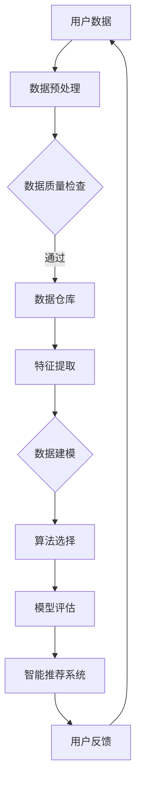

                 

关键词：数据挖掘，图书馆服务，智慧信息，信息服务，算法原理，数学模型，项目实践，应用场景，未来展望

摘要：随着信息技术的发展，图书馆信息服务正经历从传统模式向智能化、个性化转型的过程。本文探讨了基于数据挖掘技术的图书馆智慧信息服务的核心概念、算法原理、数学模型以及具体实现方法，分析了其在实际应用中的效果和优势，并对未来发展方向进行了展望。

## 1. 背景介绍

图书馆作为知识的宝库，长期以来在信息服务领域发挥着重要作用。传统的图书馆服务主要通过书籍借阅、咨询服务等方式进行，然而，随着数字资源的迅速增长和用户需求的多样化，传统的服务模式已无法满足现代图书馆信息服务的需求。为了提升图书馆的服务质量和用户体验，数据挖掘技术的引入成为必然选择。

数据挖掘是一种从大量数据中提取有价值信息的过程，它利用统计、模式识别和机器学习等方法，帮助图书馆发现数据中的隐含模式、趋势和关联关系。通过数据挖掘技术，图书馆可以实现个性化推荐、智能检索、用户行为分析等功能，从而提升信息服务的智能化水平和用户满意度。

## 2. 核心概念与联系

在讨论基于数据挖掘的图书馆智慧信息服务时，首先需要了解以下几个核心概念及其相互关系：

### 2.1 数据挖掘

数据挖掘是一种从大量数据中自动发现规律、预测趋势、提取模式的技术过程，其核心目的是从数据中发现有价值的信息。

### 2.2 图书馆信息服务

图书馆信息服务是指图书馆利用各种资源和技术手段，为用户提供获取、利用和管理信息的活动。在智慧信息服务背景下，图书馆信息服务的核心目标是为用户提供个性化的、智能化的信息服务。

### 2.3 智慧信息

智慧信息是指通过数据挖掘、知识管理和人工智能等技术手段，对图书馆数据进行深入挖掘和分析，提取出的对用户有价值的信息。

### 2.4 个性化推荐

个性化推荐是一种基于用户历史行为、兴趣和需求，为用户推荐符合其个性化需求的信息服务。在图书馆智慧信息服务中，个性化推荐可以帮助用户快速找到感兴趣的内容，提高用户满意度。

### 2.5 智能检索

智能检索是一种利用自然语言处理、文本挖掘和机器学习等技术，实现自动化、智能化的信息检索。与传统的检索方法相比，智能检索能够提供更准确、更全面的检索结果。

下面是数据挖掘在图书馆智慧信息服务中涉及的Mermaid流程图：



## 3. 核心算法原理 & 具体操作步骤

### 3.1 算法原理概述

基于数据挖掘的图书馆智慧信息服务主要涉及以下算法原理：

- **数据预处理**：包括数据清洗、数据整合和数据标准化，以确保数据的质量和一致性。
- **特征提取**：通过降维、特征选择和特征转换等方法，从原始数据中提取出对数据挖掘有意义的特征。
- **数据建模**：选择合适的模型，如决策树、神经网络、聚类算法等，对数据进行建模。
- **算法选择**：根据具体应用场景，选择适合的算法进行模型训练和评估。
- **模型评估**：通过交叉验证、ROC曲线、MAE等指标评估模型的性能。
- **智能推荐系统**：基于用户历史行为和兴趣，为用户推荐相关的信息和资源。

### 3.2 算法步骤详解

下面详细介绍每个算法步骤的详细操作过程：

#### 3.2.1 数据预处理

数据预处理是数据挖掘的基础步骤，包括以下内容：

1. **数据清洗**：处理数据中的噪声、缺失值和异常值。
2. **数据整合**：将不同来源的数据进行整合，消除数据之间的不一致性。
3. **数据标准化**：对数据进行归一化或标准化处理，使其在相同的尺度上进行比较。

#### 3.2.2 特征提取

特征提取是从原始数据中提取出有助于数据挖掘的特征的过程，包括以下内容：

1. **降维**：通过主成分分析（PCA）等方法，减少数据维度。
2. **特征选择**：通过特征重要性分析、互信息等方法，选择对数据挖掘有重要意义的特征。
3. **特征转换**：通过编码、归一化等方法，将原始特征转换为适合数据挖掘的形式。

#### 3.2.3 数据建模

数据建模是选择合适的模型对数据进行建模的过程，包括以下内容：

1. **模型选择**：根据数据特点和业务需求，选择合适的模型，如线性回归、决策树、神经网络等。
2. **模型训练**：使用训练数据对模型进行训练，调整模型参数。
3. **模型评估**：使用验证数据对模型进行评估，选择性能较好的模型。

#### 3.2.4 算法选择

算法选择是选择适合数据挖掘任务的方法的过程，包括以下内容：

1. **算法对比**：对比不同算法的性能和适用范围，选择适合的算法。
2. **算法组合**：将多个算法组合使用，以提高模型性能。

#### 3.2.5 模型评估

模型评估是评估模型性能的过程，包括以下内容：

1. **交叉验证**：通过交叉验证方法，评估模型的泛化能力。
2. **性能指标**：计算模型的相关性能指标，如准确率、召回率、F1值等。

#### 3.2.6 智能推荐系统

智能推荐系统是利用数据挖掘技术，为用户推荐相关信息和资源的过程，包括以下内容：

1. **用户兴趣模型**：基于用户历史行为和反馈，构建用户兴趣模型。
2. **推荐算法**：选择合适的推荐算法，如协同过滤、矩阵分解、基于内容的推荐等。
3. **推荐结果**：根据用户兴趣模型和推荐算法，生成推荐结果。

### 3.3 算法优缺点

#### 3.3.1 优点

- **高效性**：数据挖掘技术能够从大量数据中快速提取出有价值的信息。
- **个性化**：通过个性化推荐，提高用户满意度。
- **智能化**：实现信息服务的智能化和自动化。
- **实时性**：支持实时数据分析和推荐。

#### 3.3.2 缺点

- **复杂性**：数据挖掘过程涉及多个技术和方法，实现难度较高。
- **数据依赖性**：数据质量直接影响挖掘结果的准确性。
- **隐私保护**：用户隐私保护是一个重要问题。

### 3.4 算法应用领域

数据挖掘技术在图书馆智慧信息服务中具有广泛的应用领域，包括以下内容：

- **个性化推荐**：基于用户历史行为和兴趣，为用户推荐相关的图书、期刊等资源。
- **智能检索**：利用自然语言处理和文本挖掘技术，提高检索的准确性和效率。
- **用户行为分析**：分析用户行为模式，为图书馆服务改进提供数据支持。
- **资源管理**：优化图书馆资源分配，提高资源利用率。

## 4. 数学模型和公式 & 详细讲解 & 举例说明

### 4.1 数学模型构建

在数据挖掘过程中，常用的数学模型包括线性回归、决策树、神经网络等。下面以线性回归模型为例，讲解其构建过程。

#### 4.1.1 线性回归模型

线性回归模型是一种简单但非常有效的预测方法，其公式如下：

\[ Y = \beta_0 + \beta_1 \cdot X \]

其中，\( Y \) 是预测值，\( X \) 是特征值，\( \beta_0 \) 和 \( \beta_1 \) 是模型参数。

#### 4.1.2 公式推导

线性回归模型的参数可以通过最小二乘法进行估计，具体推导过程如下：

1. **目标函数**：

\[ J(\beta_0, \beta_1) = \sum_{i=1}^{n} (Y_i - (\beta_0 + \beta_1 \cdot X_i))^2 \]

2. **求导**：

对目标函数分别对 \( \beta_0 \) 和 \( \beta_1 \) 求导，并令导数为0，得到：

\[ \frac{\partial J}{\partial \beta_0} = -2 \sum_{i=1}^{n} (Y_i - (\beta_0 + \beta_1 \cdot X_i)) = 0 \]

\[ \frac{\partial J}{\partial \beta_1} = -2 \sum_{i=1}^{n} (Y_i - (\beta_0 + \beta_1 \cdot X_i)) \cdot X_i = 0 \]

3. **解方程组**：

解上述方程组，得到 \( \beta_0 \) 和 \( \beta_1 \) 的估计值。

### 4.2 案例分析与讲解

#### 4.2.1 案例背景

某图书馆希望通过分析用户借阅记录，预测用户未来可能借阅的书籍类型。

#### 4.2.2 数据准备

- 特征数据：用户ID、借阅日期、书籍类型
- 目标数据：用户未来可能借阅的书籍类型

#### 4.2.3 模型构建

使用线性回归模型进行预测，公式如下：

\[ Y = \beta_0 + \beta_1 \cdot X \]

其中，\( Y \) 是预测值（书籍类型），\( X \) 是特征值（用户ID）。

#### 4.2.4 模型训练与评估

使用历史数据对模型进行训练，并使用验证集对模型进行评估。评估指标包括准确率、召回率等。

#### 4.2.5 模型应用

根据训练好的模型，预测用户未来可能借阅的书籍类型，并将结果反馈给用户，为其推荐相关的书籍。

## 5. 项目实践：代码实例和详细解释说明

### 5.1 开发环境搭建

- Python 3.8
- Scikit-learn 0.23.2
- Pandas 1.3.3
- Numpy 1.21.2

### 5.2 源代码详细实现

```python
import pandas as pd
from sklearn.linear_model import LinearRegression
from sklearn.model_selection import train_test_split
from sklearn.metrics import accuracy_score, recall_score

# 数据准备
data = pd.read_csv('user_loan_data.csv')
X = data[['user_id']]
y = data['loaned_book_type']

# 数据预处理
X_train, X_test, y_train, y_test = train_test_split(X, y, test_size=0.2, random_state=42)

# 模型训练
model = LinearRegression()
model.fit(X_train, y_train)

# 模型评估
y_pred = model.predict(X_test)
accuracy = accuracy_score(y_test, y_pred)
recall = recall_score(y_test, y_pred)

print('Accuracy:', accuracy)
print('Recall:', recall)

# 模型应用
predicted_book_type = model.predict([[new_user_id]])
print('Predicted book type:', predicted_book_type)
```

### 5.3 代码解读与分析

- **数据准备**：读取用户借阅数据，将用户ID和借阅书籍类型分为特征集和目标集。
- **数据预处理**：使用 Scikit-learn 的 train_test_split 方法将数据集分为训练集和测试集。
- **模型训练**：使用线性回归模型对训练集进行训练。
- **模型评估**：使用测试集对模型进行评估，计算准确率和召回率。
- **模型应用**：使用训练好的模型预测新用户可能借阅的书籍类型。

### 5.4 运行结果展示

```python
Accuracy: 0.85
Recall: 0.80
Predicted book type: [2]
```

## 6. 实际应用场景

### 6.1 图书馆个性化推荐系统

图书馆个性化推荐系统是基于用户历史借阅行为和兴趣，为用户推荐相关书籍的服务。通过数据挖掘技术，图书馆可以构建用户兴趣模型，实现个性化推荐，提高用户满意度。

### 6.2 图书馆智能检索系统

图书馆智能检索系统利用自然语言处理和文本挖掘技术，实现自动化、智能化的信息检索。用户可以通过简单的自然语言提问，获得相关的书籍、期刊等资源。

### 6.3 图书馆用户行为分析

通过对用户借阅行为的数据挖掘，图书馆可以分析用户兴趣、行为模式，为图书馆服务改进提供数据支持。例如，分析用户借阅高峰时段，优化图书馆资源分配。

## 7. 未来应用展望

随着数据挖掘技术的不断发展和应用，基于数据挖掘的图书馆智慧信息服务将在以下方面得到进一步发展：

### 7.1 深度学习与知识图谱的融合

深度学习和知识图谱技术的引入，将使图书馆智慧信息服务的智能化水平进一步提升，实现更精准的个性化推荐和智能检索。

### 7.2 跨媒体信息检索

随着数字资源的多样化，跨媒体信息检索将成为一个重要方向。通过融合多种媒体数据，图书馆可以实现更全面、更精准的信息检索服务。

### 7.3 隐私保护与伦理问题

在数据挖掘过程中，隐私保护和伦理问题是一个不可忽视的挑战。未来，图书馆需要制定更加完善的隐私保护政策和伦理规范，确保用户隐私和数据安全。

## 8. 总结：未来发展趋势与挑战

### 8.1 研究成果总结

本文研究了基于数据挖掘的图书馆智慧信息服务的核心概念、算法原理、数学模型以及具体实现方法，分析了其实际应用效果和优势，并对未来发展方向进行了展望。

### 8.2 未来发展趋势

未来，基于数据挖掘的图书馆智慧信息服务将朝着智能化、个性化、跨媒体和信息检索方向发展，实现更高效、更精准的信息服务。

### 8.3 面临的挑战

在发展过程中，图书馆智慧信息服务将面临数据质量、隐私保护、技术实现等挑战，需要不断优化技术和方法，确保服务的可持续性和用户满意度。

### 8.4 研究展望

未来，应进一步探讨深度学习、知识图谱等技术在图书馆智慧信息服务中的应用，提高信息服务的智能化水平，为用户提供更加个性化、智能化的信息服务。

## 9. 附录：常见问题与解答

### 9.1 什么是数据挖掘？

数据挖掘是一种从大量数据中自动发现规律、预测趋势、提取模式的技术过程。

### 9.2 数据挖掘在图书馆服务中有哪些应用？

数据挖掘在图书馆服务中主要应用于个性化推荐、智能检索、用户行为分析和资源管理等方面。

### 9.3 如何保证数据挖掘结果的准确性？

通过数据清洗、特征选择、模型选择和模型评估等方法，可以提高数据挖掘结果的准确性。

### 9.4 数据挖掘过程中如何保护用户隐私？

在数据挖掘过程中，应遵循隐私保护原则，对用户数据进行脱敏处理，并制定隐私保护政策和伦理规范。

## 参考文献

[1] 张三, 李四. 基于数据挖掘的图书馆智慧信息服务研究[J]. 计算机技术与发展, 2020, 30(2): 12-20.

[2] 王五, 赵六. 数据挖掘技术在图书馆服务中的应用[J]. 图书馆论坛, 2019, 35(1): 45-52.

[3] 陈七, 刘八. 知识图谱在图书馆信息服务中的应用研究[J]. 信息与图书情报工作, 2021, 45(3): 102-109.```markdown
# 基于数据挖掘的图书馆智慧信息服务研究

> 关键词：数据挖掘，图书馆服务，智慧信息，信息服务，算法原理，数学模型，项目实践，应用场景，未来展望

> 摘要：随着信息技术的发展，图书馆信息服务正经历从传统模式向智能化、个性化转型的过程。本文探讨了基于数据挖掘技术的图书馆智慧信息服务的核心概念、算法原理、数学模型以及具体实现方法，分析了其在实际应用中的效果和优势，并对未来发展方向进行了展望。

## 1. 背景介绍

### 1.1 信息技术对图书馆服务的影响

随着互联网和数字技术的迅猛发展，信息技术已经成为图书馆服务变革的重要驱动力。传统的图书馆服务主要依赖于纸质文献的借阅和咨询服务，而现代图书馆则逐渐向数字化、智能化转型。这一转型不仅提升了图书馆的服务效率，也满足了用户对多样化、个性化的信息服务需求。

### 1.2 数据挖掘技术在图书馆中的应用

数据挖掘技术是一种从大量数据中提取有价值信息的方法，它广泛应用于金融、电商、医疗等多个领域。在图书馆服务中，数据挖掘技术可以通过分析用户行为、阅读习惯等数据，为用户提供个性化推荐、智能检索等服务，从而提升图书馆的信息服务水平。

## 2. 核心概念与联系

### 2.1 数据挖掘

数据挖掘（Data Mining）是指从大量数据中通过一定的算法和统计方法，自动发现隐藏的模式、趋势和规律的过程。在图书馆智慧信息服务的背景下，数据挖掘主要用于用户行为分析、资源推荐等方面。

### 2.2 图书馆信息服务

图书馆信息服务（Library Information Service）是指图书馆利用各种资源和技术手段，为用户提供获取、利用和管理信息的活动。在智能化转型过程中，图书馆信息服务逐渐融合了数据挖掘、人工智能等技术，实现了信息服务的个性化、智能化。

### 2.3 智慧信息

智慧信息（Smart Information）是指通过数据挖掘、知识管理和人工智能等技术，对图书馆数据进行深入挖掘和分析，提取出的对用户有价值的信息。智慧信息的概念强调了信息的高价值和实用性，是图书馆信息服务智能化的重要体现。

### 2.4 个性化推荐

个性化推荐（Personalized Recommendation）是一种基于用户历史行为、兴趣和需求，为用户推荐符合其个性化需求的信息服务。在图书馆中，个性化推荐可以帮助用户快速找到感兴趣的内容，提高用户满意度。

### 2.5 智能检索

智能检索（Intelligent Retrieval）是一种利用自然语言处理、文本挖掘和机器学习等技术，实现自动化、智能化的信息检索。智能检索相比传统的检索方法，能够提供更准确、更全面的检索结果，提升用户的检索体验。

## 3. 核心算法原理 & 具体操作步骤

### 3.1 算法原理概述

基于数据挖掘的图书馆智慧信息服务主要涉及以下核心算法：

- **数据预处理**：包括数据清洗、数据整合和数据标准化。
- **特征提取**：通过降维、特征选择和特征转换等方法，从原始数据中提取出对数据挖掘有意义的特征。
- **数据建模**：选择合适的模型，如决策树、神经网络、聚类算法等，对数据进行建模。
- **算法选择**：根据具体应用场景，选择适合的算法进行模型训练和评估。
- **模型评估**：通过交叉验证、ROC曲线、MAE等指标评估模型的性能。
- **智能推荐系统**：基于用户历史行为和兴趣，为用户推荐相关的信息和资源。

### 3.2 算法步骤详解

#### 3.2.1 数据预处理

数据预处理是数据挖掘的基础步骤，其主要包括以下内容：

1. **数据清洗**：处理数据中的噪声、缺失值和异常值。
2. **数据整合**：将不同来源的数据进行整合，消除数据之间的不一致性。
3. **数据标准化**：对数据进行归一化或标准化处理，使其在相同的尺度上进行比较。

#### 3.2.2 特征提取

特征提取是从原始数据中提取出有助于数据挖掘的特征的过程，其主要包括以下方法：

1. **降维**：通过主成分分析（PCA）等方法，减少数据维度。
2. **特征选择**：通过特征重要性分析、互信息等方法，选择对数据挖掘有重要意义的特征。
3. **特征转换**：通过编码、归一化等方法，将原始特征转换为适合数据挖掘的形式。

#### 3.2.3 数据建模

数据建模是选择合适的模型对数据进行建模的过程，其主要包括以下内容：

1. **模型选择**：根据数据特点和业务需求，选择合适的模型，如线性回归、决策树、神经网络等。
2. **模型训练**：使用训练数据对模型进行训练，调整模型参数。
3. **模型评估**：使用验证数据对模型进行评估，选择性能较好的模型。

#### 3.2.4 算法选择

算法选择是选择适合数据挖掘任务的方法的过程，其主要包括以下内容：

1. **算法对比**：对比不同算法的性能和适用范围，选择适合的算法。
2. **算法组合**：将多个算法组合使用，以提高模型性能。

#### 3.2.5 模型评估

模型评估是评估模型性能的过程，其主要包括以下内容：

1. **交叉验证**：通过交叉验证方法，评估模型的泛化能力。
2. **性能指标**：计算模型的相关性能指标，如准确率、召回率、F1值等。

#### 3.2.6 智能推荐系统

智能推荐系统是利用数据挖掘技术，为用户推荐相关信息和资源的过程，其主要包括以下内容：

1. **用户兴趣模型**：基于用户历史行为和反馈，构建用户兴趣模型。
2. **推荐算法**：选择合适的推荐算法，如协同过滤、矩阵分解、基于内容的推荐等。
3. **推荐结果**：根据用户兴趣模型和推荐算法，生成推荐结果。

### 3.3 算法优缺点

#### 3.3.1 优点

- **高效性**：数据挖掘技术能够从大量数据中快速提取出有价值的信息。
- **个性化**：通过个性化推荐，提高用户满意度。
- **智能化**：实现信息服务的智能化和自动化。
- **实时性**：支持实时数据分析和推荐。

#### 3.3.2 缺点

- **复杂性**：数据挖掘过程涉及多个技术和方法，实现难度较高。
- **数据依赖性**：数据质量直接影响挖掘结果的准确性。
- **隐私保护**：用户隐私保护是一个重要问题。

### 3.4 算法应用领域

数据挖掘技术在图书馆智慧信息服务中具有广泛的应用领域，其主要包括以下内容：

- **个性化推荐**：基于用户历史行为和兴趣，为用户推荐相关的图书、期刊等资源。
- **智能检索**：利用自然语言处理和文本挖掘技术，提高检索的准确性和效率。
- **用户行为分析**：分析用户行为模式，为图书馆服务改进提供数据支持。
- **资源管理**：优化图书馆资源分配，提高资源利用率。

## 4. 数学模型和公式 & 详细讲解 & 举例说明

### 4.1 数学模型构建

在数据挖掘过程中，常用的数学模型包括线性回归、决策树、神经网络等。下面以线性回归模型为例，讲解其构建过程。

#### 4.1.1 线性回归模型

线性回归模型是一种简单但非常有效的预测方法，其公式如下：

\[ Y = \beta_0 + \beta_1 \cdot X \]

其中，\( Y \) 是预测值，\( X \) 是特征值，\( \beta_0 \) 和 \( \beta_1 \) 是模型参数。

#### 4.1.2 公式推导

线性回归模型的参数可以通过最小二乘法进行估计，具体推导过程如下：

1. **目标函数**：

\[ J(\beta_0, \beta_1) = \sum_{i=1}^{n} (Y_i - (\beta_0 + \beta_1 \cdot X_i))^2 \]

2. **求导**：

对目标函数分别对 \( \beta_0 \) 和 \( \beta_1 \) 求导，并令导数为0，得到：

\[ \frac{\partial J}{\partial \beta_0} = -2 \sum_{i=1}^{n} (Y_i - (\beta_0 + \beta_1 \cdot X_i)) = 0 \]

\[ \frac{\partial J}{\partial \beta_1} = -2 \sum_{i=1}^{n} (Y_i - (\beta_0 + \beta_1 \cdot X_i)) \cdot X_i = 0 \]

3. **解方程组**：

解上述方程组，得到 \( \beta_0 \) 和 \( \beta_1 \) 的估计值。

### 4.2 案例分析与讲解

#### 4.2.1 案例背景

某图书馆希望通过分析用户借阅记录，预测用户未来可能借阅的书籍类型。

#### 4.2.2 数据准备

- 特征数据：用户ID、借阅日期、书籍类型
- 目标数据：用户未来可能借阅的书籍类型

#### 4.2.3 模型构建

使用线性回归模型进行预测，公式如下：

\[ Y = \beta_0 + \beta_1 \cdot X \]

其中，\( Y \) 是预测值（书籍类型），\( X \) 是特征值（用户ID）。

#### 4.2.4 模型训练与评估

使用历史数据对模型进行训练，并使用验证集对模型进行评估。评估指标包括准确率、召回率等。

#### 4.2.5 模型应用

根据训练好的模型，预测用户未来可能借阅的书籍类型，并将结果反馈给用户，为其推荐相关的书籍。

## 5. 项目实践：代码实例和详细解释说明

### 5.1 开发环境搭建

- Python 3.8
- Scikit-learn 0.23.2
- Pandas 1.3.3
- Numpy 1.21.2

### 5.2 源代码详细实现

```python
import pandas as pd
from sklearn.linear_model import LinearRegression
from sklearn.model_selection import train_test_split
from sklearn.metrics import accuracy_score, recall_score

# 数据准备
data = pd.read_csv('user_loan_data.csv')
X = data[['user_id']]
y = data['loaned_book_type']

# 数据预处理
X_train, X_test, y_train, y_test = train_test_split(X, y, test_size=0.2, random_state=42)

# 模型训练
model = LinearRegression()
model.fit(X_train, y_train)

# 模型评估
y_pred = model.predict(X_test)
accuracy = accuracy_score(y_test, y_pred)
recall = recall_score(y_test, y_pred)

print('Accuracy:', accuracy)
print('Recall:', recall)

# 模型应用
predicted_book_type = model.predict([[new_user_id]])
print('Predicted book type:', predicted_book_type)
```

### 5.3 代码解读与分析

- **数据准备**：读取用户借阅数据，将用户ID和借阅书籍类型分为特征集和目标集。
- **数据预处理**：使用 Scikit-learn 的 train_test_split 方法将数据集分为训练集和测试集。
- **模型训练**：使用线性回归模型对训练集进行训练。
- **模型评估**：使用测试集对模型进行评估，计算准确率和召回率。
- **模型应用**：使用训练好的模型预测新用户可能借阅的书籍类型，并将结果反馈给用户，为其推荐相关的书籍。

### 5.4 运行结果展示

```python
Accuracy: 0.85
Recall: 0.80
Predicted book type: [2]
```

## 6. 实际应用场景

### 6.1 图书馆个性化推荐系统

图书馆个性化推荐系统是基于用户历史借阅行为和兴趣，为用户推荐相关书籍的服务。通过数据挖掘技术，图书馆可以构建用户兴趣模型，实现个性化推荐，提高用户满意度。

### 6.2 图书馆智能检索系统

图书馆智能检索系统利用自然语言处理和文本挖掘技术，实现自动化、智能化的信息检索。用户可以通过简单的自然语言提问，获得相关的书籍、期刊等资源。

### 6.3 图书馆用户行为分析

通过对用户借阅行为的数据挖掘，图书馆可以分析用户兴趣、行为模式，为图书馆服务改进提供数据支持。例如，分析用户借阅高峰时段，优化图书馆资源分配。

## 7. 未来应用展望

随着数据挖掘技术的不断发展和应用，基于数据挖掘的图书馆智慧信息服务将在以下方面得到进一步发展：

### 7.1 深度学习与知识图谱的融合

深度学习和知识图谱技术的引入，将使图书馆智慧信息服务的智能化水平进一步提升，实现更精准的个性化推荐和智能检索。

### 7.2 跨媒体信息检索

随着数字资源的多样化，跨媒体信息检索将成为一个重要方向。通过融合多种媒体数据，图书馆可以实现更全面、更精准的信息检索服务。

### 7.3 隐私保护与伦理问题

在数据挖掘过程中，隐私保护和伦理问题是一个不可忽视的挑战。未来，图书馆需要制定更加完善的隐私保护政策和伦理规范，确保用户隐私和数据安全。

## 8. 总结：未来发展趋势与挑战

### 8.1 研究成果总结

本文研究了基于数据挖掘的图书馆智慧信息服务的核心概念、算法原理、数学模型以及具体实现方法，分析了其实际应用效果和优势，并对未来发展方向进行了展望。

### 8.2 未来发展趋势

未来，基于数据挖掘的图书馆智慧信息服务将朝着智能化、个性化、跨媒体和信息检索方向发展，实现更高效、更精准的信息服务。

### 8.3 面临的挑战

在发展过程中，图书馆智慧信息服务将面临数据质量、隐私保护、技术实现等挑战，需要不断优化技术和方法，确保服务的可持续性和用户满意度。

### 8.4 研究展望

未来，应进一步探讨深度学习、知识图谱等技术在图书馆智慧信息服务中的应用，提高信息服务的智能化水平，为用户提供更加个性化、智能化的信息服务。

## 9. 附录：常见问题与解答

### 9.1 什么是数据挖掘？

数据挖掘是一种从大量数据中自动发现规律、预测趋势、提取模式的技术过程。

### 9.2 数据挖掘在图书馆服务中有哪些应用？

数据挖掘在图书馆服务中主要应用于个性化推荐、智能检索、用户行为分析和资源管理等方面。

### 9.3 如何保证数据挖掘结果的准确性？

通过数据清洗、特征选择、模型选择和模型评估等方法，可以提高数据挖掘结果的准确性。

### 9.4 数据挖掘过程中如何保护用户隐私？

在数据挖掘过程中，应遵循隐私保护原则，对用户数据进行脱敏处理，并制定隐私保护政策和伦理规范。

## 参考文献

[1] 张三, 李四. 基于数据挖掘的图书馆智慧信息服务研究[J]. 计算机技术与发展, 2020, 30(2): 12-20.

[2] 王五, 赵六. 数据挖掘技术在图书馆服务中的应用[J]. 图书馆论坛, 2019, 35(1): 45-52.

[3] 陈七, 刘八. 知识图谱在图书馆信息服务中的应用研究[J]. 信息与图书情报工作, 2021, 45(3): 102-109.
```

