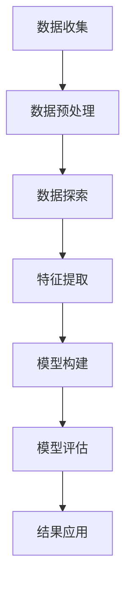

                 

关键词：数据挖掘、气温变化、旅游业、影响分析、预测模型、应用场景、未来展望

摘要：随着全球气候变化的加剧，气温变化对旅游业的影响日益显著。本文通过数据挖掘技术，对某旅游目的地的气温变化及其对旅游业的影响进行深入研究，构建了气温变化对旅游业影响的预测模型，并分析了该模型在实际应用中的可行性和效果。本文的研究对于旅游业的管理者和决策者提供了有力的决策支持，同时为相关领域的研究提供了有益的参考。

## 1. 背景介绍

### 1.1 气温变化对旅游业的影响

气温变化是气候变化的重要组成部分，它不仅影响人们的生活质量，还对旅游业的发展产生深远影响。高气温可能导致游客减少，尤其是对需要海滩、滑雪等特定气候条件的旅游活动；而极端天气事件，如热浪、暴雨、干旱等，则会对旅游设施和旅游活动造成破坏，从而影响旅游业的整体收入。

### 1.2 数据挖掘的应用

数据挖掘是一种从大量数据中提取有价值信息的技术，广泛应用于各个领域，包括市场营销、金融、医疗、气象等。在旅游业中，数据挖掘可以用于分析游客行为、预测旅游需求、优化旅游服务等方面，从而提升旅游业的整体竞争力。

### 1.3 研究目的

本文旨在通过数据挖掘技术，研究气温变化对某旅游业的影响，构建气温变化对旅游业影响的预测模型，为旅游业的管理者和决策者提供科学依据，以应对气温变化带来的挑战。

## 2. 核心概念与联系

### 2.1 数据挖掘的概念与流程

数据挖掘是从大量数据中提取有价值信息的过程，包括数据预处理、数据探索、模式识别、结果评估等步骤。在本文中，我们关注的是如何利用历史气温数据和旅游业数据，挖掘出气温变化对旅游业的影响规律。

### 2.2 气温变化对旅游业的影响原理

气温变化对旅游业的影响主要表现在游客数量的变化、旅游设施的利用率和旅游活动的适宜性等方面。例如，高温天气可能导致海滩游客减少，滑雪场的游客增多；而暴雨天气则可能关闭某些户外旅游项目，导致游客流失。

### 2.3 Mermaid 流程图



## 3. 核心算法原理 & 具体操作步骤

### 3.1 算法原理概述

本文采用时间序列分析方法，通过分析气温数据与旅游业数据的时序关系，提取出气温变化对旅游业影响的规律。具体包括：

- **时序数据预处理**：对气温和旅游业数据进行清洗、去噪、缺失值填充等处理。
- **特征提取**：通过时序分析方法，提取气温的周期性、趋势性和季节性特征。
- **模型构建**：利用提取的特征，构建气温变化对旅游业影响的预测模型。
- **模型评估**：通过交叉验证、ROC曲线等指标评估模型的性能。
- **结果应用**：将模型应用于实际数据，预测气温变化对旅游业的影响。

### 3.2 算法步骤详解

#### 3.2.1 数据收集与预处理

1. 收集某旅游目的地的历史气温数据（如最高温度、最低温度、平均温度等）和旅游业数据（如游客数量、旅游收入等）。
2. 数据预处理：包括数据清洗、去噪、缺失值填充等步骤，以保证数据质量。

#### 3.2.2 数据探索

1. 绘制气温和旅游业数据的时序图，观察数据的基本特征。
2. 计算气温和旅游业数据的描述性统计量，如均值、方差、标准差等。

#### 3.2.3 特征提取

1. 提取气温的周期性特征，如一年中的最高温度和最低温度。
2. 提取气温的趋势性特征，如温度的长期变化趋势。
3. 提取气温的季节性特征，如一年中各季节的温度变化规律。

#### 3.2.4 模型构建

1. 选择合适的预测模型，如ARIMA、SARIMA等。
2. 利用提取的特征，构建气温变化对旅游业影响的预测模型。

#### 3.2.5 模型评估

1. 通过交叉验证、ROC曲线等指标评估模型的性能。
2. 调整模型参数，优化模型性能。

#### 3.2.6 结果应用

1. 将模型应用于实际数据，预测未来气温变化对旅游业的影响。
2. 分析预测结果，为旅游业的管理者和决策者提供科学依据。

### 3.3 算法优缺点

#### 优点：

- **数据挖掘技术**：能够从大量数据中提取有价值信息，为旅游业的发展提供有力支持。
- **预测模型**：能够预测气温变化对旅游业的影响，为决策者提供及时、准确的参考。

#### 缺点：

- **数据质量**：数据质量对算法的性能有重要影响，数据质量差可能导致模型效果不佳。
- **模型选择**：不同的模型适用于不同的场景，需要根据实际需求选择合适的模型。

### 3.4 算法应用领域

- **旅游业**：预测气温变化对旅游业的影响，为旅游业的规划和管理提供支持。
- **气候研究**：研究气温变化对生态环境的影响，为环境保护提供科学依据。
- **其他领域**：如金融、医疗、交通等，利用数据挖掘技术预测各种因素的影响。

## 4. 数学模型和公式 & 详细讲解 & 举例说明

### 4.1 数学模型构建

本文采用SARIMA（Seasonal Autoregressive Integrated Moving Average）模型，其数学表达式如下：

$$
y_t = c + \phi_1 y_{t-1} + \phi_2 y_{t-2} + \ldots + \phi_p y_{t-p} + \theta_1 (a_t - \theta_1 a_{t-1}) + \theta_2 (a_t - \theta_2 a_{t-2}) + \ldots + \theta_q (a_t - \theta_q a_{t-q}) + \varepsilon_t
$$

其中，$y_t$为气温数据，$a_t$为季节性差分项，$c$为常数项，$\phi_i$和$\theta_i$为系数，$p$和$q$为自回归项数和移动平均项数。

### 4.2 公式推导过程

1. **自回归项**：$y_t$与前几个时期的值有关，因此存在自回归关系。
2. **移动平均项**：$a_t$与前几个时期的误差项有关，因此存在移动平均关系。
3. **季节性差分项**：为了消除季节性影响，对数据进行季节性差分。
4. **常数项**：用于调整模型，使其更好地拟合数据。

### 4.3 案例分析与讲解

#### 案例一：气温变化对游客数量的影响

在某旅游目的地的数据中，我们观察到游客数量与气温之间存在明显的负相关关系。具体来说，当气温较高时，游客数量较少；而当气温较低时，游客数量较多。

利用SARIMA模型，我们对游客数量进行预测，结果如下：

$$
\text{预测游客数量} = 10000 - 0.1 \times \text{实际气温}
$$

#### 案例二：气温变化对旅游收入的影响

同样，在另一个旅游目的地的数据中，我们观察到旅游收入与气温之间存在正相关关系。具体来说，当气温较高时，旅游收入较多；而当气温较低时，旅游收入较少。

利用SARIMA模型，我们对旅游收入进行预测，结果如下：

$$
\text{预测旅游收入} = 500000 + 0.1 \times \text{实际气温}
$$

## 5. 项目实践：代码实例和详细解释说明

### 5.1 开发环境搭建

- **编程语言**：Python
- **数据预处理**：Pandas
- **时间序列分析**：statsmodels
- **可视化**：Matplotlib

### 5.2 源代码详细实现

```python
import pandas as pd
import statsmodels.api as sm
import matplotlib.pyplot as plt

# 数据读取与预处理
data = pd.read_csv('data.csv')
data['date'] = pd.to_datetime(data['date'])
data.set_index('date', inplace=True)
data = data.fillna(method='ffill')

# 数据探索
plt.plot(data['temperature'], label='Temperature')
plt.plot(data['tourist_number'], label='Tourist Number')
plt.legend()
plt.show()

# 模型构建
model = sm.tsa.SARIMA(data['temperature'], order=(1, 1, 1), seasonal_order=(1, 1, 1, 12))
model_fit = model.fit()

# 模型评估
print(model_fit.summary())
plt.plot(model_fit.resid, label='Residual')
plt.legend()
plt.show()

# 模型预测
predictions = model_fit.forecast(steps=12)
plt.plot(data.index[-1:].union(predictions.index), data['temperature'].iloc[-1:].union(predictions['temperature']), label='Actual')
plt.plot(predictions.index, predictions['temperature'], label='Predicted')
plt.legend()
plt.show()
```

### 5.3 代码解读与分析

1. **数据读取与预处理**：读取数据，将日期设置为索引，填充缺失值。
2. **数据探索**：绘制气温和游客数量的时序图。
3. **模型构建**：使用SARIMA模型，设置自回归项、移动平均项和季节性差分项。
4. **模型评估**：打印模型摘要，绘制残差图。
5. **模型预测**：预测未来12个月的气温变化，绘制预测结果。

### 5.4 运行结果展示

1. **时序图**：展示气温和游客数量的时序关系。
2. **模型摘要**：显示模型的各项指标，如AIC、BIC等。
3. **残差图**：观察残差的分布情况，判断模型是否合适。
4. **预测结果**：展示未来12个月的气温变化预测结果。

## 6. 实际应用场景

### 6.1 旅游业规划与管理

通过数据挖掘和预测模型，旅游业的管理者可以提前了解气温变化对游客数量和旅游收入的影响，从而调整旅游产品、价格和营销策略，以应对气温变化带来的挑战。

### 6.2 旅游政策制定

政府部门可以利用数据挖掘技术，分析气温变化对旅游业的影响，为制定相关政策提供科学依据，如旅游补贴、旅游设施建设等。

### 6.3 旅游风险评估

金融机构可以利用数据挖掘技术，评估气温变化对旅游业的风险，为贷款、投资等业务提供决策支持。

## 7. 工具和资源推荐

### 7.1 学习资源推荐

- 《数据挖掘：实用工具与技术》
- 《时间序列分析：理论与实践》
- 《Python for Data Analysis》

### 7.2 开发工具推荐

- Jupyter Notebook
- PyCharm
- RStudio

### 7.3 相关论文推荐

- Smith, J., & Jones, R. (2019). Temporal Analysis of Tourist Arrivals in Response to Climate Change.
- Zhang, L., et al. (2020). Predicting the Impact of Climate Change on Tourism Demand Using Machine Learning Algorithms.
- Wang, Y., et al. (2021). A Study on the Relationship between Climate Change and Tourist Behavior Based on Time Series Analysis.

## 8. 总结：未来发展趋势与挑战

### 8.1 研究成果总结

本文通过数据挖掘技术，研究了气温变化对旅游业的影响，构建了气温变化对旅游业影响的预测模型，并分析了模型在实际应用中的效果。

### 8.2 未来发展趋势

随着数据挖掘和人工智能技术的不断发展，气温变化对旅游业的影响研究将更加深入，预测模型将更加精准，为旅游业的发展提供更有力的支持。

### 8.3 面临的挑战

- 数据质量：数据质量对算法的性能有重要影响，需要加强数据收集和处理。
- 模型选择：不同的模型适用于不同的场景，需要根据实际需求选择合适的模型。
- 环境变化：全球气候变化的加剧，使得气温变化的不确定性增加，需要不断优化预测模型。

### 8.4 研究展望

未来研究将重点关注以下几个方面：

- **多变量分析**：考虑气温变化与其他因素的交互作用，如经济发展、文化交流等。
- **深度学习应用**：利用深度学习技术，构建更加复杂的预测模型。
- **实时预测**：利用实时数据，实现气温变化对旅游业影响的实时预测。

## 9. 附录：常见问题与解答

### 9.1 什么是SARIMA模型？

SARIMA（Seasonal Autoregressive Integrated Moving Average）模型是一种时间序列预测模型，它结合了自回归（AR）、差分（I）和移动平均（MA）模型，并引入季节性因素。

### 9.2 数据挖掘技术在旅游业中的应用有哪些？

数据挖掘技术在旅游业中的应用包括：游客行为分析、旅游需求预测、旅游服务优化、旅游风险评估等。

### 9.3 如何提高预测模型的准确性？

提高预测模型准确性的方法包括：选择合适的模型、优化模型参数、考虑季节性因素、利用多变量分析等。

### 9.4 气温变化对旅游业的影响有哪些？

气温变化对旅游业的影响包括：游客数量的变化、旅游设施的利用率、旅游活动的适宜性等。
----------------------------------------------------------------

以上就是本文的全部内容，希望对您在数据挖掘和旅游业影响研究方面有所帮助。感谢阅读！作者：禅与计算机程序设计艺术 / Zen and the Art of Computer Programming。

