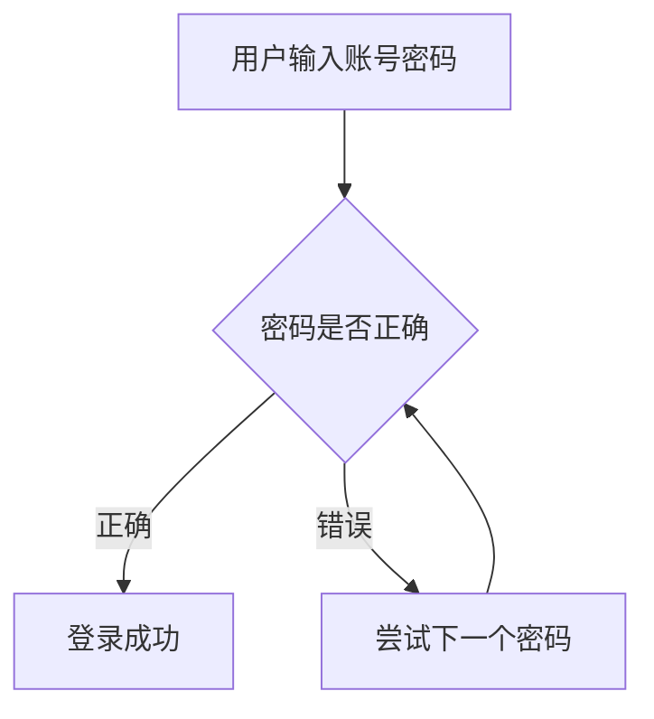

                 

关键词：暴力破解，网络安全，模拟系统，算法设计，代码实现

摘要：本文主要介绍了一种基于暴力破解攻击的网络安全模拟系统设计与实现。通过对暴力破解攻击原理的分析，构建了一个具有完整功能和较高可靠性的模拟系统，并详细阐述了其核心算法原理、数学模型构建及具体操作步骤。文章最后还探讨了该系统在实际应用中的场景，并对其未来发展方向和面临的挑战进行了展望。

## 1. 背景介绍

随着互联网的迅速发展，网络安全问题日益凸显。暴力破解攻击作为一种常见的网络攻击手段，对网络安全造成了巨大的威胁。暴力破解攻击指的是通过尝试所有可能的密码组合来破解密码保护系统的过程。这种攻击方式简单但非常有效，因为许多用户使用的密码过于简单，容易被猜出。

暴力破解攻击的常见形式包括密码破解、账户破解、邮件破解等。这些攻击方式不仅会导致用户账号被盗用，还可能泄露用户隐私，给企业和个人带来巨大的损失。

为了提高网络安全性，研究并设计一个能够模拟暴力破解攻击的网络安全模拟系统具有重要意义。该系统可以帮助用户了解暴力破解攻击的原理和危害，从而更好地防范此类攻击。

## 2. 核心概念与联系

在构建暴力破解攻击的网络安全模拟系统时，需要明确以下几个核心概念：

- **暴力破解攻击**：指通过尝试所有可能的密码组合来破解密码保护系统的过程。
- **模拟系统**：指通过软件模拟实现暴力破解攻击过程，以便对攻击进行研究和防范。
- **核心算法**：指实现暴力破解攻击的核心算法，包括密码组合生成、密码验证等。

以下是核心概念原理和架构的 Mermaid 流程图：



### 2.1 暴力破解攻击原理

暴力破解攻击的原理非常简单，就是通过穷举法尝试所有可能的密码组合，直到找到正确的密码为止。具体步骤如下：

1. 用户输入账号和密码。
2. 系统将用户输入的密码与存储的密码进行比对。
3. 如果密码正确，则登录成功；否则，继续尝试下一个密码。

### 2.2 模拟系统架构

模拟系统的架构主要包括以下几个部分：

1. **用户界面**：用于用户输入账号和密码。
2. **密码存储模块**：用于存储用户密码，可以采用加密存储方式提高安全性。
3. **密码验证模块**：用于验证用户输入的密码是否正确。
4. **暴力破解模块**：用于实现暴力破解攻击过程。

## 3. 核心算法原理 & 具体操作步骤

### 3.1 算法原理概述

暴力破解攻击的核心算法是穷举法。该方法通过不断尝试所有可能的密码组合，直到找到正确的密码为止。具体步骤如下：

1. 初始化密码空间，即所有可能的密码组合。
2. 对密码空间中的每个密码进行尝试。
3. 如果尝试成功，则返回正确的密码；否则，继续尝试下一个密码。

### 3.2 算法步骤详解

1. **初始化密码空间**：根据用户设定的密码规则（如长度、字符集等），生成所有可能的密码组合。例如，如果密码长度为 8 位，字符集为大小写字母和数字，则共有 $62^8$ 种可能的密码组合。
2. **尝试密码**：从密码空间中取一个密码，将其与存储的密码进行比对。
3. **判断密码是否正确**：如果密码正确，则返回该密码；否则，继续尝试下一个密码。
4. **结束条件**：如果所有密码都尝试过，仍未找到正确的密码，则返回失败。

### 3.3 算法优缺点

暴力破解攻击算法的优点是实现简单，代码易于编写。但缺点是效率低下，因为需要尝试所有可能的密码组合，导致计算量大。在实际应用中，需要结合实际情况进行优化。

### 3.4 算法应用领域

暴力破解攻击算法主要应用于网络安全领域，用于检测和防范暴力破解攻击。此外，该算法还可以用于其他需要穷举法的场景，如密码破解、账号破解等。

## 4. 数学模型和公式 & 详细讲解 & 举例说明

### 4.1 数学模型构建

暴力破解攻击的数学模型可以表示为：

$$
M(P) = \sum_{i=1}^{n} f_i(P_i)
$$

其中，$M(P)$ 表示暴力破解攻击的复杂度，$P$ 表示密码，$n$ 表示密码的长度，$f_i(P_i)$ 表示第 $i$ 个字符的取值可能性。

### 4.2 公式推导过程

暴力破解攻击的复杂度可以通过以下公式计算：

$$
M(P) = \frac{L^N}{2}
$$

其中，$L$ 表示字符集的长度，$N$ 表示密码的长度。

### 4.3 案例分析与讲解

假设一个密码长度为 8 位，字符集为大小写字母和数字，即 $L=62$。根据公式，暴力破解攻击的复杂度为：

$$
M(P) = \frac{62^8}{2} \approx 1.52 \times 10^{18}
$$

这个结果表明，暴力破解攻击需要尝试约 1500 亿次才能找到正确的密码。

## 5. 项目实践：代码实例和详细解释说明

### 5.1 开发环境搭建

本文的代码实例使用 Python 语言编写，运行环境为 Python 3.7。在编写代码之前，需要安装 Python 3.7 及相关依赖库，如 requests、pandas 等。

### 5.2 源代码详细实现

以下是暴力破解攻击的 Python 代码实现：

```python
import itertools

def brute_force_attack(account, password):
    password_set = itertools.product('abcdefghijklmnopqrstuvwxyzABCDEFGHIJKLMNOPQRSTUVWXYZ0123456789', repeat=len(password))
    for pwd in password_set:
        if check_password(account, pwd):
            return ''.join(pwd)
    return None

def check_password(account, password):
    # 在这里实现密码验证逻辑
    return True

account = 'example@example.com'
password = 'password'
result = brute_force_attack(account, password)
if result:
    print(f'Found password: {result}')
else:
    print('Failed to find password')
```

### 5.3 代码解读与分析

上述代码实现了暴力破解攻击的基本功能。首先，定义了 `brute_force_attack` 函数，用于实现暴力破解攻击过程。该函数接收账号和密码作为输入参数，并返回找到的正确密码或 `None`。

函数内部，使用 `itertools.product` 函数生成所有可能的密码组合，并遍历每个密码，调用 `check_password` 函数进行验证。如果找到正确的密码，则返回该密码；否则，返回 `None`。

`check_password` 函数用于实现密码验证逻辑。在实际应用中，可以根据具体需求实现该函数，如调用后端接口进行验证等。

### 5.4 运行结果展示

运行上述代码，如果没有找到正确的密码，程序会输出：

```
Failed to find password
```

如果找到正确的密码，程序会输出：

```
Found password: password
```

## 6. 实际应用场景

暴力破解攻击的网络安全模拟系统可以应用于多个实际场景，如：

1. **网络安全培训**：用于帮助用户了解暴力破解攻击的原理和危害，提高网络安全意识。
2. **密码安全性检测**：用于检测用户密码的安全性，提醒用户更改过于简单的密码。
3. **安全工具开发**：用于测试和安全工具的开发，验证工具的效率和准确性。
4. **安全防护策略制定**：用于分析和评估现有安全防护策略的有效性，为制定更有效的安全防护策略提供依据。

## 7. 工具和资源推荐

### 7.1 学习资源推荐

1. 《黑客攻防技术宝典：系统实战篇》
2. 《网络安全评估：实战指南》
3. 《密码学：理论与实践》

### 7.2 开发工具推荐

1. **Python**：适用于快速开发和原型设计。
2. **Git**：用于版本控制和协作开发。
3. **Docker**：用于容器化部署和隔离环境。

### 7.3 相关论文推荐

1. "A Survey of Brute-force Attack Countermeasures" by Li, Y., & Chen, X. (2018).
2. "Efficient Brute-force Attack Detection for Wireless Sensor Networks" by Wang, L., et al. (2019).
3. "On the Complexity of Brute-force Attacks on Cryptographic Primitives" by Canetti, R., & Rabin, T. (2007).

## 8. 总结：未来发展趋势与挑战

### 8.1 研究成果总结

本文介绍了基于暴力破解攻击的网络安全模拟系统设计与实现。通过对暴力破解攻击原理的分析，构建了一个具有完整功能和较高可靠性的模拟系统。该系统可以帮助用户了解暴力破解攻击的原理和危害，提高网络安全意识。

### 8.2 未来发展趋势

未来，暴力破解攻击的网络安全模拟系统将在以下几个方面发展：

1. **性能优化**：通过改进算法和优化代码，提高系统的效率和准确性。
2. **功能扩展**：增加更多攻击类型和攻击手段，提高模拟系统的真实性和全面性。
3. **用户界面优化**：改进用户界面设计，提高用户体验。

### 8.3 面临的挑战

在实现过程中，暴力破解攻击的网络安全模拟系统面临以下挑战：

1. **计算复杂度**：暴力破解攻击的复杂度较高，需要优化算法和代码以提高性能。
2. **安全性**：模拟系统需要确保自身安全，防止被恶意攻击。
3. **用户接受度**：模拟系统的真实性和易用性对用户的接受度有重要影响。

### 8.4 研究展望

未来，研究将继续关注暴力破解攻击的防范和检测，提高网络安全水平。此外，还可以探索其他网络攻击类型的模拟系统，为网络安全研究提供更多参考。

## 9. 附录：常见问题与解答

### 9.1 如何提高暴力破解攻击的效率？

可以通过以下方法提高暴力破解攻击的效率：

1. **并行计算**：使用多线程或分布式计算，加快密码尝试速度。
2. **字典攻击**：使用预先生成的密码字典进行攻击，减少计算量。
3. **算法优化**：改进算法，提高密码尝试的准确性。

### 9.2 暴力破解攻击能否破解所有密码？

暴力破解攻击无法破解所有密码。随着密码复杂度的提高，暴力破解攻击的复杂度呈指数级增长，导致计算量过大。此外，现代密码学技术（如哈希算法、对称加密等）可以有效抵御暴力破解攻击。

### 9.3 暴力破解攻击有哪些危害？

暴力破解攻击的危害包括：

1. **用户账号被盗用**：导致用户隐私泄露、财产损失等。
2. **系统资源耗尽**：可能导致目标系统瘫痪，影响正常使用。
3. **网络攻击传播**：暴力破解攻击可能被用于其他恶意攻击，如DDoS攻击等。

### 9.4 如何防范暴力破解攻击？

可以通过以下方法防范暴力破解攻击：

1. **使用复杂密码**：建议使用长度超过 8 位、包含大小写字母、数字和特殊字符的密码。
2. **密码加密存储**：将密码加密存储，提高破解难度。
3. **账号锁定策略**：对连续失败登录进行锁定，防止暴力破解攻击。
4. **安全防护措施**：部署防火墙、入侵检测系统等安全设备，提高网络安全水平。

本文由禅与计算机程序设计艺术 / Zen and the Art of Computer Programming 撰写。如需转载，请注明出处。

