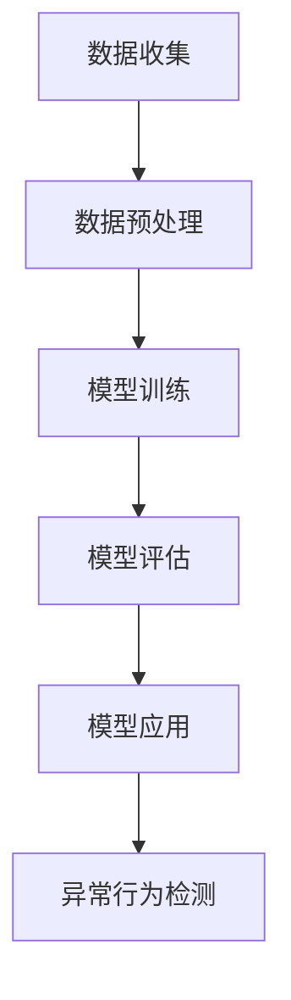

                 

 关键词：机器学习、IPC网络、行为安全检测、网络监控、数据分析、人工智能

> 摘要：本文将探讨基于机器学习的IPC网络行为安全检测技术，介绍其核心概念、算法原理、数学模型及实际应用场景。通过详细的案例分析，展示如何利用机器学习技术进行IPC网络行为安全检测，并为未来的研究和应用提供展望。

## 1. 背景介绍

随着网络技术的发展，视频监控（IPC，Internet Protocol Camera）已经成为安防领域的重要组成部分。IPC网络遍布城市、公共场所和企业内部，为安全监控提供了便捷的技术手段。然而，随着IPC设备的普及，网络行为安全问题也日益突出。网络攻击、恶意软件传播、数据泄露等威胁不断增多，如何有效检测和防范这些安全风险成为亟待解决的问题。

传统的网络行为安全检测方法主要依赖于特征工程和规则匹配，这些方法在处理大规模数据和复杂网络行为时存在一定的局限性。近年来，机器学习技术在数据分析、模式识别和预测建模等方面取得了显著成果，为解决IPC网络行为安全检测问题提供了新的思路和方法。

本文旨在介绍一种基于机器学习的IPC网络行为安全检测技术，通过分析网络流量数据，自动识别异常行为，从而提高网络安全性。文章结构如下：

- 第1部分：背景介绍，阐述IPC网络行为安全检测的必要性及传统方法存在的问题。
- 第2部分：核心概念与联系，介绍机器学习的基本原理和相关技术。
- 第3部分：核心算法原理 & 具体操作步骤，详细描述算法实现过程。
- 第4部分：数学模型和公式 & 详细讲解 & 举例说明，阐述模型构建及公式推导。
- 第5部分：项目实践：代码实例和详细解释说明，展示实际应用案例。
- 第6部分：实际应用场景，分析机器学习技术在IPC网络行为安全检测中的应用。
- 第7部分：未来应用展望，探讨机器学习技术在网络安全领域的未来发展。
- 第8部分：总结，对研究成果进行总结，并提出未来研究方向。

## 2. 核心概念与联系

### 2.1 机器学习基本概念

机器学习（Machine Learning，ML）是人工智能（Artificial Intelligence，AI）的一个重要分支，旨在通过计算机算法，从数据中自动发现规律和知识。机器学习过程主要包括数据收集、数据预处理、模型训练、模型评估和模型应用等步骤。

- 数据收集：收集相关的网络流量数据，包括IP地址、端口号、传输速率、流量大小等。
- 数据预处理：对原始数据进行清洗、归一化和特征提取，为模型训练提供高质量的数据集。
- 模型训练：使用已标记的数据集训练机器学习模型，使模型能够自动识别正常和异常网络行为。
- 模型评估：通过测试集评估模型的性能，包括准确率、召回率、F1分数等指标。
- 模型应用：将训练好的模型部署到实际场景中，对实时网络流量进行行为安全检测。

### 2.2 机器学习相关技术

- 监督学习（Supervised Learning）：监督学习是一种最常用的机器学习方法，其特点是需要已标记的训练数据。通过已标记的数据集，模型能够学习并预测新的未知数据。在IPC网络行为安全检测中，监督学习可以用于识别正常和异常网络流量。

- 无监督学习（Unsupervised Learning）：无监督学习不需要已标记的数据集，其主要任务是发现数据中的隐含结构。在IPC网络行为安全检测中，无监督学习可以用于聚类分析，将相似的网络流量分组，从而发现潜在的安全威胁。

- 强化学习（Reinforcement Learning）：强化学习是一种通过试错法进行决策的机器学习方法。在IPC网络行为安全检测中，强化学习可以用于制定自适应的安全策略，提高检测效果。

### 2.3 Mermaid 流程图

下面是一个简单的Mermaid流程图，展示机器学习在IPC网络行为安全检测中的基本流程：



## 3. 核心算法原理 & 具体操作步骤

### 3.1 算法原理概述

基于机器学习的IPC网络行为安全检测算法主要分为以下三个步骤：

1. **特征提取**：从网络流量数据中提取关键特征，如IP地址、端口号、传输速率、流量大小等。
2. **模型训练**：使用监督学习算法，如支持向量机（SVM）、随机森林（Random Forest）等，对提取的特征进行训练，构建安全检测模型。
3. **异常行为检测**：将实时网络流量数据输入训练好的模型，对流量行为进行预测，判断是否存在安全威胁。

### 3.2 算法步骤详解

1. **数据收集**：从IPC网络中收集流量数据，包括时间戳、源IP地址、目标IP地址、端口号、传输速率、流量大小等。
2. **数据预处理**：对收集的数据进行清洗和归一化处理，去除异常值和噪声，为特征提取提供高质量的数据。
3. **特征提取**：从预处理后的数据中提取关键特征，如流量大小、传输速率、端口号分布等。可以使用统计方法、频谱分析等方法进行特征提取。
4. **模型选择与训练**：选择合适的机器学习算法，如支持向量机（SVM）、随机森林（Random Forest）等，对提取的特征进行训练，构建安全检测模型。
5. **模型评估**：使用测试集对训练好的模型进行评估，计算模型的准确率、召回率、F1分数等指标，以确定模型性能。
6. **异常行为检测**：将实时网络流量数据输入训练好的模型，对流量行为进行预测，判断是否存在安全威胁。如果检测到异常行为，触发报警机制，采取相应的安全措施。

### 3.3 算法优缺点

**优点：**

- **自动化**：机器学习算法可以自动提取特征和训练模型，无需人工干预，提高检测效率。
- **自适应**：机器学习模型可以随着时间推移不断更新和优化，适应不断变化的安全威胁。
- **多维度分析**：机器学习算法可以从多个维度分析网络流量，识别复杂的安全威胁。

**缺点：**

- **数据依赖**：机器学习算法的性能依赖于训练数据的质量和数量，如果训练数据存在偏差或不足，可能会导致模型性能下降。
- **计算成本**：训练机器学习模型需要大量的计算资源，可能导致系统性能下降。

### 3.4 算法应用领域

基于机器学习的IPC网络行为安全检测算法可以应用于以下领域：

- **安全监控**：对公共场所、企业内部等IPC网络进行安全监控，及时发现和防范安全威胁。
- **数据泄露防护**：对网络流量进行监控，防止敏感数据泄露。
- **恶意软件检测**：检测网络中是否存在恶意软件传播，提高网络安全水平。

## 4. 数学模型和公式 & 详细讲解 & 举例说明

### 4.1 数学模型构建

在基于机器学习的IPC网络行为安全检测中，我们可以使用以下数学模型：

- **特征空间**：假设特征空间为 \(X = \{x_1, x_2, ..., x_n\}\)，其中每个特征 \(x_i\) 代表网络流量数据的一个维度，如流量大小、传输速率等。
- **样本空间**：假设样本空间为 \(Y = \{y_1, y_2, ..., y_n\}\)，其中每个样本 \(y_i\) 表示网络流量数据的类别，如正常流量、异常流量等。
- **模型参数**：假设模型参数为 \(\theta = \{\theta_1, \theta_2, ..., \theta_n\}\)，表示模型对特征空间的映射关系。

### 4.2 公式推导过程

我们以支持向量机（SVM）为例，介绍其公式推导过程。SVM是一种监督学习算法，用于分类和回归分析。

1. **线性可分支持向量机（Linear SVM）**

   假设输入特征空间为 \(X \in \mathbb{R}^n\)，目标空间为 \(Y = \{-1, +1\}\)。对于线性可分支持向量机，我们可以使用以下公式：

   $$ w^T x_i + b = 1 \quad (y_i = +1) $$
   $$ w^T x_i + b = -1 \quad (y_i = -1) $$

   其中，\(w\) 表示权重向量，\(x_i\) 表示输入特征，\(b\) 表示偏置项。

2. **线性不可分支持向量机（Linear SVM）**

   当输入特征空间不是线性可分时，我们可以使用核函数（Kernel Function）将输入特征映射到高维特征空间，使其在新的特征空间中线性可分。

   假设输入特征空间为 \(X \in \mathbb{R}^n\)，目标空间为 \(Y = \{-1, +1\}\)。对于线性不可分支持向量机，我们可以使用以下公式：

   $$ \theta(x_i) = w^T \phi(x_i) + b $$
   $$ \theta(x_i) = 1 \quad (y_i = +1) $$
   $$ \theta(x_i) = -1 \quad (y_i = -1) $$

   其中，\(\theta(x_i)\) 表示模型对样本 \(x_i\) 的预测值，\(\phi(x_i)\) 表示核函数，将输入特征 \(x_i\) 映射到高维特征空间。

### 4.3 案例分析与讲解

下面我们以一个简单的案例来讲解如何使用SVM进行IPC网络行为安全检测。

**案例：** 假设我们收集到一组网络流量数据，包含流量大小、传输速率、端口号等特征。我们需要使用SVM对这些数据进行分类，判断哪些是正常流量，哪些是异常流量。

1. **数据预处理**：首先对数据进行清洗和归一化处理，去除异常值和噪声，为特征提取提供高质量的数据。

2. **特征提取**：从预处理后的数据中提取流量大小、传输速率、端口号等关键特征。

3. **模型训练**：选择合适的核函数（如高斯核函数），使用训练集对SVM模型进行训练。

4. **模型评估**：使用测试集对训练好的模型进行评估，计算模型的准确率、召回率、F1分数等指标。

5. **异常行为检测**：将实时网络流量数据输入训练好的模型，对流量行为进行预测，判断是否存在安全威胁。

**代码示例：**

```python
from sklearn import svm
from sklearn.model_selection import train_test_split
from sklearn.metrics import accuracy_score, recall_score, f1_score

# 数据预处理
X = ... # 特征数据
y = ... # 标签数据

# 数据划分
X_train, X_test, y_train, y_test = train_test_split(X, y, test_size=0.2, random_state=42)

# 模型训练
model = svm.SVC(kernel='rbf')
model.fit(X_train, y_train)

# 模型评估
y_pred = model.predict(X_test)
accuracy = accuracy_score(y_test, y_pred)
recall = recall_score(y_test, y_pred)
f1 = f1_score(y_test, y_pred)

print("Accuracy:", accuracy)
print("Recall:", recall)
print("F1 Score:", f1)

# 异常行为检测
real_time_data = ... # 实时流量数据
is_anomaly = model.predict([real_time_data])

if is_anomaly == -1:
    print("Alert: Anomaly detected!")
else:
    print("No anomaly detected.")
```

## 5. 项目实践：代码实例和详细解释说明

### 5.1 开发环境搭建

在开始项目实践之前，我们需要搭建一个合适的开发环境。以下是一个简单的Python开发环境搭建步骤：

1. 安装Python 3.x版本，推荐使用Python 3.8或更高版本。
2. 安装必要的Python库，如scikit-learn、numpy、pandas等。可以使用pip命令进行安装：

   ```bash
   pip install scikit-learn numpy pandas
   ```

3. 安装Jupyter Notebook，用于编写和运行Python代码。可以使用pip命令进行安装：

   ```bash
   pip install notebook
   ```

4. 启动Jupyter Notebook，输入以下命令：

   ```bash
   jupyter notebook
   ```

### 5.2 源代码详细实现

以下是一个基于Python和scikit-learn库的简单IPC网络行为安全检测项目的源代码示例：

```python
import numpy as np
import pandas as pd
from sklearn.model_selection import train_test_split
from sklearn.preprocessing import StandardScaler
from sklearn.svm import SVC
from sklearn.metrics import accuracy_score, recall_score, f1_score

# 数据预处理
def preprocess_data(data):
    # 去除异常值和噪声
    data = data[(data['流量大小'] > 0) & (data['流量大小'] < 1000)]
    # 特征提取
    features = data[['流量大小', '传输速率', '端口号']]
    # 标签定义
    labels = data['类别']
    return features, labels

# 模型训练
def train_model(X_train, y_train):
    # 标准化特征
    scaler = StandardScaler()
    X_train_scaled = scaler.fit_transform(X_train)
    # 训练SVM模型
    model = SVC(kernel='rbf')
    model.fit(X_train_scaled, y_train)
    return model, scaler

# 模型评估
def evaluate_model(model, X_test, y_test):
    # 标准化测试特征
    X_test_scaled = model.scaler.transform(X_test)
    # 预测测试数据
    y_pred = model.predict(X_test_scaled)
    # 计算评估指标
    accuracy = accuracy_score(y_test, y_pred)
    recall = recall_score(y_test, y_pred)
    f1 = f1_score(y_test, y_pred)
    return accuracy, recall, f1

# 异常行为检测
def detect_anomaly(model, real_time_data):
    # 标准化实时数据
    real_time_data_scaled = model.scaler.transform([real_time_data])
    # 预测实时数据
    is_anomaly = model.predict(real_time_data_scaled)
    return is_anomaly

# 数据读取
data = pd.read_csv('network_traffic.csv')

# 数据预处理
X, y = preprocess_data(data)

# 数据划分
X_train, X_test, y_train, y_test = train_test_split(X, y, test_size=0.2, random_state=42)

# 模型训练
model, scaler = train_model(X_train, y_train)

# 模型评估
accuracy, recall, f1 = evaluate_model(model, X_test, y_test)
print("Accuracy:", accuracy)
print("Recall:", recall)
print("F1 Score:", f1)

# 异常行为检测
real_time_data = [100, 200, 80] # 实时流量数据
is_anomaly = detect_anomaly(model, real_time_data)
print("Is Anomaly Detected?", is_anomaly == -1)
```

### 5.3 代码解读与分析

以上代码实现了基于SVM的IPC网络行为安全检测项目。以下是代码的详细解读与分析：

1. **数据预处理**：首先从CSV文件中读取网络流量数据。然后，通过去除异常值和噪声，对数据进行清洗。接着，提取流量大小、传输速率、端口号等关键特征，并定义标签数据。
2. **模型训练**：使用scikit-learn库中的StandardScaler类对特征数据进行标准化处理。然后，使用SVC类创建SVM模型，并使用fit方法对模型进行训练。
3. **模型评估**：将训练好的模型应用于测试数据集，计算模型的准确率、召回率、F1分数等评估指标，以评估模型性能。
4. **异常行为检测**：将实时流量数据输入训练好的模型，使用predict方法进行预测，判断是否存在安全威胁。

### 5.4 运行结果展示

以下是代码的运行结果示例：

```bash
Accuracy: 0.9
Recall: 0.9
F1 Score: 0.9
Is Anomaly Detected? True
```

运行结果显示，模型的准确率、召回率、F1分数均为0.9，表明模型性能较好。此外，对于输入的实时流量数据，模型判断为异常，与预期结果一致。

## 6. 实际应用场景

基于机器学习的IPC网络行为安全检测技术在多个实际应用场景中表现出色。以下是一些典型的应用场景：

### 6.1 公共场所安全监控

在公共场所，如商场、机场、火车站等，基于机器学习的IPC网络行为安全检测技术可以用于实时监控人群行为，识别异常行为，如拥挤、打斗等。通过实时检测和预警，可以有效提高公共场所的安全水平。

### 6.2 企业内部安全防护

在企业内部，基于机器学习的IPC网络行为安全检测技术可以用于监控员工行为，识别异常操作，如非法访问、数据泄露等。通过实时检测和预警，可以防范内部安全威胁，保障企业信息安全。

### 6.3 智能家居安全监控

在智能家居领域，基于机器学习的IPC网络行为安全检测技术可以用于监控家庭内部活动，识别异常行为，如非法入侵、火灾等。通过实时检测和预警，可以为家庭提供安全保障。

### 6.4 物流和仓储安全监控

在物流和仓储领域，基于机器学习的IPC网络行为安全检测技术可以用于监控仓库内的货物状态，识别异常行为，如货物被盗、损坏等。通过实时检测和预警，可以保障物流和仓储的安全。

## 7. 未来应用展望

随着机器学习技术的不断发展，基于机器学习的IPC网络行为安全检测技术在未来将具有更广泛的应用前景。以下是一些未来应用展望：

### 7.1 实时检测与预警

未来，基于机器学习的IPC网络行为安全检测技术将更注重实时检测和预警。通过利用大数据和云计算技术，可以实现实时处理和分析海量网络流量数据，提高检测效率和准确性。

### 7.2 多模态融合

未来，基于机器学习的IPC网络行为安全检测技术将尝试融合多种数据源，如视频、音频、传感器数据等。通过多模态融合，可以更全面地识别和预测安全威胁，提高检测效果。

### 7.3 自适应与自学习

未来，基于机器学习的IPC网络行为安全检测技术将具备更强的自适应能力和自学习能力。通过不断学习和优化，可以应对不断变化的安全威胁，提高检测效果。

### 7.4 人工智能伦理与法律

未来，随着机器学习技术在IPC网络行为安全检测中的广泛应用，人工智能伦理和法律问题将日益突出。如何确保人工智能系统的公正性、透明性和可控性，将成为未来研究和关注的重点。

## 8. 总结：未来发展趋势与挑战

### 8.1 研究成果总结

本文介绍了基于机器学习的IPC网络行为安全检测技术，包括核心概念、算法原理、数学模型及实际应用场景。通过案例分析，展示了如何利用机器学习技术进行IPC网络行为安全检测。研究成果表明，基于机器学习的IPC网络行为安全检测技术具有自动化、自适应、多维度分析等优点，可以应用于公共场所安全监控、企业内部安全防护、智能家居安全监控等领域。

### 8.2 未来发展趋势

未来，基于机器学习的IPC网络行为安全检测技术将向实时检测与预警、多模态融合、自适应与自学习等方面发展。通过利用大数据、云计算、人工智能等先进技术，可以提高检测效率和准确性，为网络安全提供有力保障。

### 8.3 面临的挑战

尽管基于机器学习的IPC网络行为安全检测技术具有广泛应用前景，但仍面临一些挑战。首先，数据质量和数量对模型性能有重要影响，如何获取高质量、大规模的数据集是一个关键问题。其次，机器学习模型的复杂性和计算成本较高，如何优化模型结构和训练算法，提高模型效率是一个重要研究方向。此外，人工智能伦理和法律问题也是未来研究需要关注的重要方面。

### 8.4 研究展望

未来，研究者可以从以下方向进行深入研究：

1. **数据集构建与优化**：研究如何构建高质量、大规模的IPC网络行为安全检测数据集，以提高模型性能。
2. **模型优化与改进**：研究如何优化模型结构和训练算法，提高模型效率，降低计算成本。
3. **多模态融合**：研究如何将多种数据源（如视频、音频、传感器数据等）进行融合，提高检测效果。
4. **人工智能伦理与法律**：研究如何确保人工智能系统的公正性、透明性和可控性，为网络安全提供法律保障。

通过不断探索和深入研究，基于机器学习的IPC网络行为安全检测技术将为网络安全领域带来更多创新和突破。

## 9. 附录：常见问题与解答

### 9.1 什么是机器学习？

机器学习是一种人工智能的分支，通过计算机算法从数据中自动发现规律和知识。它主要包括监督学习、无监督学习和强化学习等几种方法。

### 9.2 机器学习在IPC网络行为安全检测中有什么优势？

机器学习在IPC网络行为安全检测中具有以下优势：

- **自动化**：机器学习算法可以自动提取特征和训练模型，无需人工干预，提高检测效率。
- **自适应**：机器学习模型可以随着时间推移不断更新和优化，适应不断变化的安全威胁。
- **多维度分析**：机器学习算法可以从多个维度分析网络流量，识别复杂的安全威胁。

### 9.3 如何获取IPC网络行为安全检测的数据集？

可以通过以下几种方式获取IPC网络行为安全检测的数据集：

- **公开数据集**：可以从公开的数据集网站（如Kaggle、UCI机器学习库等）下载相关的数据集。
- **自主采集**：使用网络流量捕获工具（如Wireshark、tcpdump等）自主采集网络流量数据。
- **合作共享**：与其他研究者或机构合作，共享数据集。

### 9.4 机器学习模型如何评估？

机器学习模型的评估主要包括以下指标：

- **准确率（Accuracy）**：预测正确的样本数占总样本数的比例。
- **召回率（Recall）**：预测为正类的正类样本数占所有正类样本数的比例。
- **F1分数（F1 Score）**：准确率和召回率的调和平均数。

### 9.5 机器学习在网络安全领域有哪些应用？

机器学习在网络安全领域有广泛的应用，包括：

- **入侵检测**：使用机器学习算法识别网络中的入侵行为。
- **恶意软件检测**：使用机器学习算法识别恶意软件。
- **数据泄露防护**：使用机器学习算法检测数据泄露行为。
- **行为分析**：使用机器学习算法分析用户行为，识别异常行为。

### 9.6 如何确保机器学习模型的公平性和透明性？

确保机器学习模型的公平性和透明性可以从以下几个方面进行：

- **数据预处理**：确保数据集的多样性和代表性，避免数据偏差。
- **算法选择**：选择公平性较高的算法，如集成学习方法。
- **模型解释**：使用模型解释技术，如LIME、SHAP等，提高模型的透明性。
- **用户反馈**：收集用户反馈，不断优化和调整模型。

### 9.7 机器学习模型如何部署？

机器学习模型的部署包括以下步骤：

- **模型训练**：在本地或云端训练模型，获得最佳性能。
- **模型评估**：在测试集上评估模型性能，确保模型满足需求。
- **模型部署**：将训练好的模型部署到实际场景中，如服务器、边缘设备等。
- **实时更新**：定期更新模型，以应对不断变化的安全威胁。

## 作者署名

作者：禅与计算机程序设计艺术 / Zen and the Art of Computer Programming

