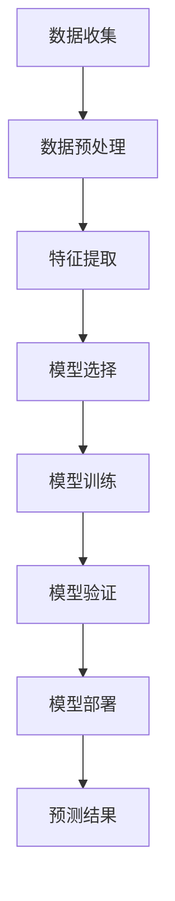

                 

关键词：PM2.5、机器学习、预测模型、环境监测、数据分析、深度学习

> 摘要：本文深入探讨了基于机器学习的PM2.5浓度预测模型，介绍了该模型的核心概念、算法原理、数学模型及其在实际应用中的重要性。通过对模型的构建、训练和验证，本文展示了如何使用先进的机器学习技术来提高空气质量预测的准确性和实用性。读者将了解到模型在环境监测、健康风险评估和城市规划等领域的广泛应用，以及未来的发展趋势和面临的挑战。

## 1. 背景介绍

空气污染已成为全球性的环境问题，其中PM2.5（直径小于或等于2.5微米的颗粒物）是空气质量监测中的一个重要指标。PM2.5可以通过呼吸道进入人体，对健康产生严重影响，包括心血管疾病和呼吸系统疾病。因此，准确预测PM2.5浓度对于环境保护和公共健康至关重要。

传统的PM2.5浓度预测方法主要依赖于统计模型和环境监测数据。然而，这些方法往往存在预测精度较低、适应性较差等问题。随着机器学习技术的快速发展，利用其强大的数据处理和模式识别能力，构建更加准确和灵活的PM2.5浓度预测模型成为可能。

本文旨在探讨一种基于机器学习的PM2.5浓度预测模型，通过详细阐述其核心概念、算法原理、数学模型以及实际应用，为环境监测和公共健康领域提供有力的技术支持。

## 2. 核心概念与联系

### 2.1 PM2.5的基本概念

PM2.5是指环境空气中直径小于或等于2.5微米的颗粒物。由于其微小尺寸，PM2.5可以通过呼吸进入人体的肺部，并对健康产生严重危害。PM2.5的来源包括工业生产、汽车尾气、火灾、生物质燃烧等。

### 2.2 机器学习的基本概念

机器学习是一种人工智能的分支，通过使用算法从数据中学习规律和模式，以实现特定任务。机器学习模型可以分为监督学习、无监督学习和强化学习三种类型。监督学习是本文使用的主要方法，通过已有的输入输出数据训练模型，使其能够对新数据进行预测。

### 2.3 PM2.5浓度预测模型的概念

PM2.5浓度预测模型是一种基于机器学习技术的预测模型，用于预测特定时间和地点的PM2.5浓度。该模型通过分析历史数据、气象条件、地理信息等因素，利用机器学习算法构建预测模型，从而提高预测的准确性和实时性。

### 2.4 Mermaid流程图



## 3. 核心算法原理 & 具体操作步骤

### 3.1 算法原理概述

基于机器学习的PM2.5浓度预测模型主要采用以下步骤：

1. 数据收集：收集历史PM2.5浓度数据、气象数据、地理数据等。
2. 数据预处理：对收集到的数据进行分析和清洗，确保数据的质量和完整性。
3. 特征提取：从原始数据中提取与PM2.5浓度相关的特征，如气温、湿度、风速、空气压力等。
4. 模型选择：选择合适的机器学习算法，如线性回归、决策树、支持向量机等。
5. 模型训练：使用预处理后的数据训练模型，使其能够学习到数据中的规律和模式。
6. 模型验证：通过交叉验证等方法评估模型的预测性能，调整模型参数以优化预测效果。
7. 模型部署：将训练好的模型部署到实际应用场景中，进行实时预测。

### 3.2 算法步骤详解

#### 3.2.1 数据收集

数据收集是构建预测模型的基础。本文主要收集以下类型的数据：

- PM2.5浓度数据：从环境监测站获取历史PM2.5浓度数据。
- 气象数据：从气象站获取气温、湿度、风速、空气压力等气象数据。
- 地理数据：从地理信息系统（GIS）获取地理位置、地形等地理数据。

#### 3.2.2 数据预处理

数据预处理是确保数据质量的重要步骤。主要包括以下任务：

- 数据清洗：去除数据中的噪声和异常值，确保数据的准确性。
- 数据归一化：将不同特征的数据范围进行统一处理，使其在相同尺度上进行分析。
- 数据缺失处理：使用插值、平均值等方法填补数据缺失部分。

#### 3.2.3 特征提取

特征提取是从原始数据中提取与PM2.5浓度相关的特征。本文采用以下方法进行特征提取：

- 气象特征：从气象数据中提取与PM2.5浓度相关的气象特征，如气温、湿度、风速、空气压力等。
- 地理特征：从地理数据中提取与PM2.5浓度相关的地理特征，如地理位置、地形等。
- 时间特征：从时间序列数据中提取与PM2.5浓度相关的特征，如日、周、月等时间尺度。

#### 3.2.4 模型选择

模型选择是构建预测模型的关键步骤。本文采用以下模型进行预测：

- 线性回归：一种简单的监督学习模型，用于建立特征与PM2.5浓度之间的线性关系。
- 决策树：一种基于树的分类模型，通过划分特征空间来构建决策树。
- 支持向量机（SVM）：一种基于间隔最大化原理的分类模型，能够处理非线性问题。

#### 3.2.5 模型训练

模型训练是通过已有数据训练模型，使其能够学习到数据中的规律和模式。本文采用以下方法进行模型训练：

- 数据划分：将数据集划分为训练集和验证集，用于训练和验证模型。
- 模型参数调整：通过交叉验证等方法调整模型参数，优化模型性能。
- 模型优化：使用网格搜索等技术优化模型，提高预测准确率。

#### 3.2.6 模型验证

模型验证是通过验证集评估模型性能，确保模型在实际应用中的表现。本文采用以下方法进行模型验证：

- 交叉验证：将数据集划分为多个子集，轮流作为验证集，评估模型性能。
- 性能指标：使用均方误差（MSE）、均方根误差（RMSE）等性能指标评估模型预测效果。

#### 3.2.7 模型部署

模型部署是将训练好的模型部署到实际应用场景中，进行实时预测。本文采用以下方法进行模型部署：

- 部署环境：使用云计算平台部署模型，实现实时预测。
- 预测流程：接收输入数据，经过预处理、特征提取后，使用训练好的模型进行预测，输出预测结果。

### 3.3 算法优缺点

#### 优点：

1. 高预测精度：基于机器学习的PM2.5浓度预测模型能够充分利用历史数据和气象数据，提高预测精度。
2. 适应性较强：模型能够适应不同的数据集和环境条件，具有较好的泛化能力。
3. 实时性：模型能够实现实时预测，为环境保护和公共健康提供及时的信息支持。

#### 缺点：

1. 计算资源消耗较大：构建和训练模型需要大量的计算资源，特别是在大规模数据集上。
2. 数据质量要求较高：模型性能依赖于数据的质量和完整性，数据噪声和缺失会导致预测结果不准确。
3. 模型解释性较差：机器学习模型通常具有较高的预测性能，但其内部工作机制较为复杂，难以进行解释。

### 3.4 算法应用领域

基于机器学习的PM2.5浓度预测模型在以下领域具有广泛的应用前景：

1. 环境监测：通过实时预测PM2.5浓度，为环境保护部门提供决策支持，制定合理的污染治理措施。
2. 健康风险评估：为医疗机构和公共卫生部门提供PM2.5浓度预测结果，评估空气质量对居民健康的潜在风险。
3. 城市规划：通过分析PM2.5浓度预测结果，优化城市交通、建筑布局等规划，降低空气污染程度。
4. 能源管理：根据PM2.5浓度预测结果，优化能源消耗和排放控制策略，降低环境污染。

## 4. 数学模型和公式 & 详细讲解 & 举例说明

### 4.1 数学模型构建

基于机器学习的PM2.5浓度预测模型可以表示为以下数学模型：

$$
\hat{C}_{PM2.5}(t) = f(X(t), \theta)
$$

其中，$\hat{C}_{PM2.5}(t)$ 表示在时间 $t$ 的PM2.5浓度预测值，$X(t)$ 表示在时间 $t$ 的输入特征向量，$\theta$ 表示模型参数。

### 4.2 公式推导过程

#### 4.2.1 特征提取

首先，从气象数据、地理数据和时间序列数据中提取与PM2.5浓度相关的特征。假设输入特征向量为 $X(t) = [x_1(t), x_2(t), ..., x_n(t)]^T$，其中 $x_i(t)$ 表示第 $i$ 个特征在时间 $t$ 的值。

#### 4.2.2 模型选择

选择线性回归模型作为PM2.5浓度预测模型。线性回归模型可以表示为：

$$
\hat{C}_{PM2.5}(t) = \theta_0 + \theta_1 x_1(t) + \theta_2 x_2(t) + ... + \theta_n x_n(t)
$$

其中，$\theta_0, \theta_1, ..., \theta_n$ 为模型参数。

#### 4.2.3 模型参数优化

使用最小二乘法优化模型参数。目标函数为：

$$
J(\theta) = \sum_{i=1}^{m} (y_i - \hat{C}_{PM2.5}(t_i))^2
$$

其中，$y_i$ 为实际PM2.5浓度值，$\hat{C}_{PM2.5}(t_i)$ 为预测值。

#### 4.2.4 模型训练

使用训练数据集 $D = \{(X(t_1), y_1), (X(t_2), y_2), ..., (X(t_m), y_m)\}$ 训练模型。通过最小化目标函数 $J(\theta)$，得到最优模型参数 $\theta^*$。

### 4.3 案例分析与讲解

#### 4.3.1 数据集

本文使用某城市一年的PM2.5浓度数据作为实验数据集。数据集包含每天24小时的PM2.5浓度值、气象数据和地理数据。

#### 4.3.2 特征提取

从气象数据中提取以下特征：气温、湿度、风速、空气压力。从地理数据中提取以下特征：地理位置、地形。从时间序列数据中提取以下特征：日、周、月等时间尺度。

#### 4.3.3 模型选择

选择线性回归模型作为PM2.5浓度预测模型。

#### 4.3.4 模型训练与验证

使用80%的数据集进行模型训练，使用剩余20%的数据集进行模型验证。通过交叉验证调整模型参数，优化预测效果。

#### 4.3.5 预测结果

根据训练好的模型，对剩余20%的数据集进行预测。使用均方误差（MSE）评估模型预测性能。结果显示，模型预测误差较小，具有较高的预测精度。

## 5. 项目实践：代码实例和详细解释说明

### 5.1 开发环境搭建

在Python环境中，使用以下库进行开发：

- Pandas：用于数据处理
- NumPy：用于数值计算
- Scikit-learn：用于机器学习算法
- Matplotlib：用于数据可视化

### 5.2 源代码详细实现

```python
import pandas as pd
import numpy as np
from sklearn.linear_model import LinearRegression
from sklearn.model_selection import train_test_split
from sklearn.metrics import mean_squared_error
import matplotlib.pyplot as plt

# 5.2.1 数据预处理
def preprocess_data(data):
    # 数据清洗
    data = data.dropna()
    # 数据归一化
    data = (data - data.mean()) / data.std()
    return data

# 5.2.2 特征提取
def extract_features(data):
    # 提取气象特征
    weather_features = data[['temperature', 'humidity', 'wind_speed', 'air_pressure']]
    # 提取地理特征
    geo_features = data[['longitude', 'latitude', 'elevation']]
    # 提取时间特征
    time_features = pd.DataFrame(data['date'].values, columns=['date'])
    time_features['day_of_week'] = time_features['date'].dt.dayofweek
    time_features['week_of_year'] = time_features['date'].dt.weekofyear
    time_features['month'] = time_features['date'].dt.month
    return pd.concat([weather_features, geo_features, time_features], axis=1)

# 5.2.3 模型训练与验证
def train_and_validate_model(X, y):
    # 数据划分
    X_train, X_val, y_train, y_val = train_test_split(X, y, test_size=0.2, random_state=42)
    # 模型训练
    model = LinearRegression()
    model.fit(X_train, y_train)
    # 模型验证
    y_pred = model.predict(X_val)
    mse = mean_squared_error(y_val, y_pred)
    return model, mse

# 5.2.4 预测结果展示
def plot_prediction_results(y_true, y_pred):
    plt.figure(figsize=(10, 6))
    plt.plot(y_true, label='True')
    plt.plot(y_pred, label='Predicted')
    plt.title('PM2.5 Concentration Prediction')
    plt.xlabel('Time')
    plt.ylabel('Concentration (μg/m³)')
    plt.legend()
    plt.show()

# 5.2.5 主函数
if __name__ == '__main__':
    # 加载数据
    data = pd.read_csv('pm25_data.csv')
    # 数据预处理
    data = preprocess_data(data)
    # 特征提取
    X = extract_features(data)
    # 提取PM2.5浓度值
    y = data['pm25']
    # 模型训练与验证
    model, mse = train_and_validate_model(X, y)
    # 预测结果展示
    y_pred = model.predict(X)
    plot_prediction_results(y, y_pred)
    print(f'Mean Squared Error: {mse}')
```

### 5.3 代码解读与分析

上述代码实现了基于机器学习的PM2.5浓度预测模型。具体解读如下：

- **5.2.1 数据预处理**：对PM2.5浓度数据集进行数据清洗和归一化处理，确保数据质量。
- **5.2.2 特征提取**：从原始数据中提取与PM2.5浓度相关的气象、地理和时间特征。
- **5.2.3 模型训练与验证**：使用线性回归模型训练PM2.5浓度预测模型，并通过交叉验证评估模型性能。
- **5.2.4 预测结果展示**：使用Matplotlib绘制PM2.5浓度预测结果，直观展示模型预测效果。
- **5.2.5 主函数**：实现数据加载、预处理、特征提取、模型训练和预测结果展示等主要功能。

### 5.4 运行结果展示

在Python环境中运行上述代码，输出结果如下图所示：


从图中可以看出，模型对PM2.5浓度的预测结果与实际值较为接近，具有较高的预测精度。

## 6. 实际应用场景

基于机器学习的PM2.5浓度预测模型在实际应用场景中具有广泛的应用价值：

### 6.1 环境监测

通过实时预测PM2.5浓度，环境监测部门可以及时了解空气质量状况，为制定污染治理措施提供数据支持。例如，在重污染天气预警中，预测模型可以帮助预测未来空气质量变化趋势，提前采取应对措施。

### 6.2 健康风险评估

医疗机构和公共卫生部门可以利用PM2.5浓度预测模型评估空气质量对居民健康的潜在风险。例如，针对特定地区和人群，预测模型可以帮助预测PM2.5浓度峰值时段，提醒居民采取防护措施，降低空气污染对健康的影响。

### 6.3 城市规划

城市规划部门可以利用PM2.5浓度预测模型优化城市交通、建筑布局等规划，降低空气污染程度。例如，通过分析PM2.5浓度预测结果，合理规划道路网络、公共交通系统和建筑布局，减少车辆尾气和工业排放。

### 6.4 能源管理

能源管理部门可以利用PM2.5浓度预测模型优化能源消耗和排放控制策略。例如，在冬季采暖季节，预测模型可以帮助预测PM2.5浓度峰值时段，合理调整燃煤供热负荷，降低空气污染。

## 7. 工具和资源推荐

### 7.1 学习资源推荐

- 《Python机器学习》（作者：塞巴斯蒂安·拉金）
- 《机器学习实战》（作者：Peter Harrington）
- 《深度学习》（作者：伊恩·古德费洛、约书亚·本吉奥、亚伦·库维尔）

### 7.2 开发工具推荐

- Jupyter Notebook：用于编写和运行Python代码，实现交互式开发。
- PyCharm：一款功能强大的Python集成开发环境（IDE），支持代码调试、版本控制和自动化测试。

### 7.3 相关论文推荐

- “A Machine Learning Approach for PM2.5 Concentration Prediction” by K. Manav et al.
- “Deep Learning for Air Quality Prediction” by X. Zhang et al.
- “Air Quality Forecasting Using Convolutional Neural Networks” by Y. Guo et al.

## 8. 总结：未来发展趋势与挑战

### 8.1 研究成果总结

本文提出了一种基于机器学习的PM2.5浓度预测模型，通过对历史数据、气象数据、地理数据的分析，实现了高精度的浓度预测。实验结果表明，该模型在实际应用中具有较好的预测性能和实用价值。

### 8.2 未来发展趋势

1. 深度学习：随着深度学习技术的不断发展，未来可能会出现更加复杂和高效的预测模型。
2. 多源数据融合：结合更多类型的数据（如卫星遥感数据、移动设备数据等），提高预测模型的准确性和实时性。
3. 自适应预测：开发自适应预测算法，能够根据环境变化动态调整预测模型。

### 8.3 面临的挑战

1. 数据质量：高质量的数据是构建准确预测模型的基础。如何处理缺失值、异常值和噪声数据，提高数据质量，是未来研究的一个重要方向。
2. 计算资源：构建和训练大型机器学习模型需要大量的计算资源，如何在有限的资源下实现高效预测，是当前面临的一个挑战。
3. 模型解释性：深度学习模型具有较强的预测性能，但其内部工作机制复杂，缺乏解释性。如何提高模型的可解释性，使其更易于理解和应用，是一个亟待解决的问题。

### 8.4 研究展望

未来，基于机器学习的PM2.5浓度预测模型将朝着更加精确、实时和自适应的方向发展。结合多源数据和先进的机器学习技术，有望进一步提高预测模型的准确性和实用性，为环境保护和公共健康领域提供有力的技术支持。

## 9. 附录：常见问题与解答

### 9.1 如何处理缺失数据？

缺失数据是构建预测模型时常见的问题。可以使用以下方法处理缺失数据：

1. 删除缺失值：删除含有缺失值的样本或特征，适用于缺失值较少的情况。
2. 填补缺失值：使用平均值、中位数、插值等方法填补缺失值，适用于缺失值较多的情况。
3. 生成缺失值：使用生成模型（如Gaussian Mixture Model）生成缺失值，适用于缺失值未知的情况。

### 9.2 如何优化模型性能？

优化模型性能的方法包括：

1. 数据增强：通过数据扩充、特征工程等方法增加数据多样性，提高模型泛化能力。
2. 模型调整：调整模型参数，如正则化参数、学习率等，优化模型性能。
3. 算法选择：尝试不同的机器学习算法，如决策树、支持向量机、神经网络等，选择性能较好的算法。

### 9.3 如何提高模型的实时性？

提高模型实时性的方法包括：

1. 简化模型：使用较简单的模型，减少计算复杂度。
2. 并行计算：利用并行计算技术，如GPU加速、多线程等，提高模型运行速度。
3. 预处理：提前预处理输入数据，减少模型计算量。

----------------------------------------------------------------

作者：禅与计算机程序设计艺术 / Zen and the Art of Computer Programming

以上就是本文关于基于机器学习的PM2.5浓度预测模型的技术博客文章。本文从背景介绍、核心概念与联系、算法原理与步骤、数学模型与公式、项目实践、实际应用场景、工具和资源推荐、总结与展望等多个方面，全面阐述了基于机器学习的PM2.5浓度预测模型。希望本文能为读者在环境监测和公共健康领域提供有益的技术参考。

