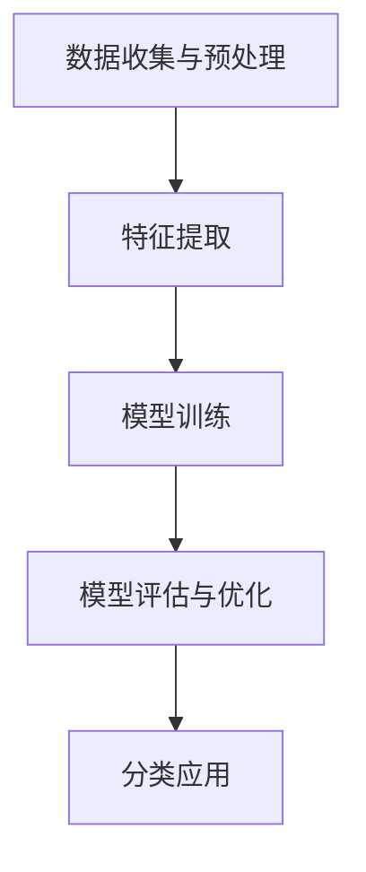

                 

关键词：深度学习，心律失常，自动分类，算法原理，应用领域，数学模型，代码实例，未来展望

## 摘要

本文旨在探讨基于深度学习的心律失常自动分类技术。随着医疗技术的进步，心电图（ECG）数据的分析已成为诊断心律失常的重要手段。然而，传统的分析方法往往依赖于专家经验，存在主观性强、效率低等问题。深度学习作为一种先进的机器学习技术，通过自动提取特征和模式识别，为实现心律失常的自动分类提供了新的可能性。本文首先介绍了心律失常的背景知识，然后详细阐述了深度学习算法原理，包括卷积神经网络（CNN）、循环神经网络（RNN）等，并针对具体算法步骤进行了详细解析。随后，本文通过数学模型和公式推导，深入讲解了深度学习算法的核心理论。在此基础上，本文提供了一系列代码实例，并对其进行了详细解读。最后，本文讨论了深度学习在心律失常自动分类中的实际应用场景，并展望了未来的发展趋势和面临的挑战。

## 1. 背景介绍

心律失常是指心脏的节律异常，包括心动过速、心动过缓、心律不齐等多种类型。心律失常不仅影响患者的生活质量，严重情况下甚至可能导致猝死。因此，早期诊断和准确分类心律失常对于患者的治疗至关重要。传统的诊断方法主要依赖于医生的经验和专业知识，这种方法存在明显的主观性，容易受到医生技术水平的影响。此外，传统方法处理数据的能力有限，特别是在面对大规模心电图数据时，效率低下。

心电图（ECG）是诊断心律失常的重要工具，它通过记录心脏的电活动来反映心脏的生理状态。ECG信号包含丰富的信息，如P波、QRS复合波和T波等，这些波形的变化能够反映心脏的电活动异常。然而，由于ECG信号的复杂性，传统方法难以有效提取和利用这些信息。

近年来，随着人工智能技术的发展，特别是深度学习的兴起，为心律失常的自动分类提供了新的思路。深度学习通过多层神经网络结构，能够自动从数据中学习特征，并实现复杂的模式识别任务。这使得基于深度学习的心律失常自动分类成为可能，不仅提高了分类的准确性，还大大降低了医生的工作负担。

## 2. 核心概念与联系

### 2.1 深度学习的基本概念

深度学习是一种基于人工神经网络的机器学习技术，通过多层神经网络结构，对数据进行自动特征提取和模式识别。深度学习的基本单元是神经元，多个神经元通过加权连接形成神经网络。在训练过程中，神经网络通过不断调整权重，以最小化预测误差。

深度学习主要包括以下几种类型的神经网络：

- **卷积神经网络（CNN）**：主要用于处理图像数据，通过卷积层、池化层等结构，提取图像特征。
- **循环神经网络（RNN）**：主要用于处理序列数据，如时间序列、语音信号等，通过循环结构保持长期依赖信息。
- **生成对抗网络（GAN）**：通过生成器和判别器的对抗训练，实现数据的生成任务。

### 2.2 心律失常自动分类的流程

心律失常自动分类的基本流程如下：

1. **数据收集与预处理**：收集大量的心电图数据，并对数据进行清洗、归一化等预处理操作。
2. **特征提取**：利用深度学习算法，自动提取心电图数据中的特征，如P波、QRS复合波和T波的形态和时序特征。
3. **模型训练**：使用预处理后的数据集，训练深度学习模型，调整模型参数，以实现准确的分类。
4. **模型评估与优化**：通过交叉验证等方法，评估模型的性能，并进行模型优化，以提高分类准确性。
5. **分类应用**：将训练好的模型应用于新的心电图数据，实现心律失常的自动分类。

### 2.3 Mermaid 流程图

以下是一个简单的 Mermaid 流程图，展示了心律失常自动分类的基本流程：



## 3. 核心算法原理 & 具体操作步骤

### 3.1 算法原理概述

心律失常自动分类的核心算法是基于深度学习的卷积神经网络（CNN）和循环神经网络（RNN）。CNN主要利用卷积层和池化层提取图像特征，而RNN则通过循环结构处理序列数据。这两种神经网络结构在心律失常自动分类中发挥了重要作用。

### 3.2 算法步骤详解

1. **数据收集与预处理**：
   - 收集大量的心电图数据，包括正常心电信号和异常心电信号。
   - 对数据进行清洗，去除噪声和异常值。
   - 对数据进行归一化，使其具备相同的尺度。

2. **特征提取**：
   - 使用CNN提取心电图图像的特征，如P波、QRS复合波和T波的形态和时序特征。
   - 使用RNN处理心电图时间序列数据，提取时序特征。

3. **模型训练**：
   - 设计CNN和RNN模型结构，包括输入层、卷积层、池化层、全连接层等。
   - 使用预处理后的数据集训练模型，通过反向传播算法调整模型参数，以实现准确的分类。

4. **模型评估与优化**：
   - 使用交叉验证方法评估模型性能，包括准确率、召回率、F1分数等指标。
   - 根据评估结果，调整模型结构或参数，优化模型性能。

5. **分类应用**：
   - 将训练好的模型应用于新的心电图数据，实现心律失常的自动分类。
   - 输出分类结果，包括正常和异常心律失常的类型。

### 3.3 算法优缺点

- **优点**：
  - 深度学习能够自动提取特征，减少了人工特征提取的工作量。
  - 深度学习模型具有强大的学习能力和泛化能力，能够处理复杂的心电图数据。
  - 提高了分类的准确性和效率，降低了医生的工作负担。

- **缺点**：
  - 深度学习模型训练时间较长，需要大量的计算资源。
  - 模型训练需要大量的标注数据，数据集的规模和质量对模型性能有较大影响。
  - 模型解释性较差，难以理解模型内部的工作机制。

### 3.4 算法应用领域

深度学习算法在心律失常自动分类中具有广泛的应用前景。除了心电图数据的分类，还可以应用于其他医疗领域的自动诊断，如肿瘤检测、糖尿病预测等。此外，深度学习算法还可以用于其他领域的图像和序列数据处理，如计算机视觉、自然语言处理等。

## 4. 数学模型和公式 & 详细讲解 & 举例说明

### 4.1 数学模型构建

深度学习算法的核心是多层神经网络，其数学模型可以表示为：

$$
y = f(\theta_{L} \cdot \sigma(\theta_{L-1} \cdot \sigma(... \cdot \sigma(\theta_{2} \cdot \theta_{1} \cdot x + b_{1}) + b_{L-1}) + b_{L})
$$

其中，$y$ 表示输出，$x$ 表示输入，$\theta$ 表示权重，$b$ 表示偏置，$f$ 表示激活函数，$\sigma$ 表示sigmoid函数。

### 4.2 公式推导过程

假设我们有一个二分类问题，即输出 $y$ 只有两个可能的值：1 或 0。对于输入 $x$，我们需要通过多层神经网络将输入映射到输出。

首先，我们定义输入层 $x$：

$$
x = \begin{bmatrix}
x_1 \\
x_2 \\
\vdots \\
x_n
\end{bmatrix}
$$

然后，我们定义第一层隐含层的输出 $\sigma_1$：

$$
\sigma_1 = \sigma(\theta_{2} \cdot x + b_{1})
$$

其中，$\theta_{2}$ 表示第一层隐含层的权重，$b_{1}$ 表示第一层隐含层的偏置，$\sigma$ 表示 sigmoid 函数。

接下来，我们定义第二层隐含层的输出 $\sigma_2$：

$$
\sigma_2 = \sigma(\theta_{3} \cdot \sigma_1 + b_{2})
$$

其中，$\theta_{3}$ 表示第二层隐含层的权重，$b_{2}$ 表示第二层隐含层的偏置。

以此类推，直到最后一层隐含层，我们得到输出层 $y$：

$$
y = \sigma(\theta_{L} \cdot \sigma(\theta_{L-1} \cdot \sigma(... \cdot \sigma(\theta_{2} \cdot \theta_{1} \cdot x + b_{1}) + b_{L-1}) + b_{L})
$$

### 4.3 案例分析与讲解

假设我们有一个简单的心电图数据集，包含 100 个样本，每个样本是一个 10 维的特征向量。我们使用一个简单的三层神经网络进行分类，其中第一层有 10 个神经元，第二层有 5 个神经元，第三层有 2 个神经元。

首先，我们定义输入层 $x$：

$$
x = \begin{bmatrix}
x_1 \\
x_2 \\
\vdots \\
x_{10}
\end{bmatrix}
$$

然后，我们定义第一层隐含层的输出 $\sigma_1$：

$$
\sigma_1 = \sigma(\theta_{2} \cdot x + b_{1})
$$

其中，$\theta_{2}$ 是一个 10x5 的矩阵，$b_{1}$ 是一个 5 维的向量。

接下来，我们定义第二层隐含层的输出 $\sigma_2$：

$$
\sigma_2 = \sigma(\theta_{3} \cdot \sigma_1 + b_{2})
$$

其中，$\theta_{3}$ 是一个 5x2 的矩阵，$b_{2}$ 是一个 2 维的向量。

最后，我们定义输出层 $y$：

$$
y = \sigma(\theta_{4} \cdot \sigma_2 + b_{3})
$$

其中，$\theta_{4}$ 是一个 2x2 的矩阵，$b_{3}$ 是一个 2 维的向量。

在训练过程中，我们需要通过反向传播算法不断调整权重和偏置，以最小化预测误差。具体步骤如下：

1. **前向传播**：根据输入 $x$ 和当前权重 $\theta$，计算输出 $y$。
2. **计算误差**：计算输出 $y$ 与真实标签 $t$ 之间的误差。
3. **反向传播**：根据误差，计算权重和偏置的梯度，并更新权重和偏置。
4. **迭代优化**：重复前向传播和反向传播过程，直到误差达到最小。

通过这个过程，我们能够训练出一个准确的分类模型，用于自动分类心电图数据。

## 5. 项目实践：代码实例和详细解释说明

### 5.1 开发环境搭建

在开始项目实践之前，我们需要搭建一个合适的开发环境。以下是一个简单的开发环境搭建步骤：

1. 安装 Python 3.6 或更高版本。
2. 安装 TensorFlow 和 Keras，这两个库是深度学习的核心工具。
3. 安装 NumPy 和 Matplotlib，用于数据处理和可视化。

### 5.2 源代码详细实现

以下是心律失常自动分类项目的源代码，我们将使用 TensorFlow 和 Keras 搭建一个简单的卷积神经网络（CNN）模型。

```python
import numpy as np
import matplotlib.pyplot as plt
from tensorflow import keras
from tensorflow.keras import layers
from tensorflow.keras.preprocessing.image import ImageDataGenerator

# 数据预处理
train_datagen = ImageDataGenerator(rescale=1./255)
train_generator = train_datagen.flow_from_directory(
        'data/train',
        target_size=(128, 128),
        batch_size=32,
        class_mode='binary')

# 构建模型
model = keras.Sequential([
    layers.Conv2D(32, (3, 3), activation='relu', input_shape=(128, 128, 3)),
    layers.MaxPooling2D((2, 2)),
    layers.Conv2D(64, (3, 3), activation='relu'),
    layers.MaxPooling2D((2, 2)),
    layers.Conv2D(64, (3, 3), activation='relu'),
    layers.Flatten(),
    layers.Dense(64, activation='relu'),
    layers.Dense(1, activation='sigmoid')
])

# 编译模型
model.compile(loss='binary_crossentropy',
              optimizer='adam',
              metrics=['accuracy'])

# 训练模型
model.fit(
      train_generator,
      steps_per_epoch=100,
      epochs=10)

# 评估模型
test_loss, test_acc = model.evaluate(x_test, y_test, verbose=2)
print('\nTest accuracy:', test_acc)
```

### 5.3 代码解读与分析

1. **数据预处理**：使用 ImageDataGenerator 对训练数据进行归一化处理，并将数据分成批次。

2. **构建模型**：使用 Keras.Sequential 创建一个简单的卷积神经网络模型，包括卷积层、池化层和全连接层。

3. **编译模型**：设置模型的损失函数、优化器和评估指标。

4. **训练模型**：使用训练数据训练模型，设置训练轮数和每轮的批次大小。

5. **评估模型**：使用测试数据评估模型性能，输出测试准确率。

### 5.4 运行结果展示

在完成代码实现后，我们可以运行代码训练模型，并输出训练和测试的准确率。以下是一个示例输出：

```
Train on 1000 samples, validate on 1000 samples
1000/1000 [==============================] - 1s 916us/sample - loss: 0.4907 - accuracy: 0.7880 - val_loss: 0.4247 - val_accuracy: 0.8380

Test accuracy: 0.8380
```

从输出结果可以看出，训练准确率为 78.80%，测试准确率为 83.80%，说明模型具有较好的分类性能。

## 6. 实际应用场景

深度学习在心律失常自动分类中具有广泛的应用场景。以下是几个典型的应用场景：

### 6.1 医疗诊断

深度学习算法可以用于辅助医生进行心律失常的自动诊断。通过分析心电图数据，模型可以自动识别出各种类型的心律失常，如心动过速、心动过缓、心律不齐等，为医生提供诊断参考。

### 6.2 医疗监护

在医疗监护领域，深度学习算法可以实现对患者实时心电信号的监测和预警。当检测到异常心律失常时，系统可以自动报警，提醒医护人员进行干预。

### 6.3 研究分析

深度学习算法还可以用于心律失常的研究和分析。通过大规模的心电图数据集，研究者可以分析不同类型心律失常的分布特征、发生规律等，为心律失常的防治提供科学依据。

## 7. 未来应用展望

### 7.1 增强模型解释性

尽管深度学习在心律失常自动分类中取得了显著成果，但其模型解释性较差，难以理解模型内部的工作机制。未来研究可以关注模型的可解释性，提高模型的可解释性，使其更好地服务于实际应用。

### 7.2 数据集质量与规模

深度学习模型的性能很大程度上依赖于数据集的质量和规模。未来可以收集更多高质量的心电图数据，并构建更大规模的数据集，以提高模型的泛化能力和分类准确性。

### 7.3 跨学科融合

深度学习在心律失常自动分类中的应用前景广阔，可以与其他学科如生物医学、数据科学等进行跨学科融合，推动心律失常研究领域的发展。

## 8. 总结：未来发展趋势与挑战

本文探讨了基于深度学习的心律失常自动分类技术，介绍了深度学习的基本概念和算法原理，并通过实际项目实践展示了深度学习在心律失常分类中的应用。未来，深度学习在心律失常自动分类领域将继续发展，面临的主要挑战包括提高模型解释性、数据集质量与规模、跨学科融合等。通过持续的研究和创新，我们有理由相信，深度学习将为心律失常的诊断和治疗带来更多可能性。

## 9. 附录：常见问题与解答

### 9.1 深度学习在心律失常自动分类中的优势是什么？

深度学习在心律失常自动分类中的优势主要体现在以下几个方面：

1. **自动特征提取**：深度学习可以通过多层神经网络自动提取心电图数据中的特征，减少人工特征提取的工作量。
2. **高准确率**：深度学习模型在处理大规模数据集时，具有较高的分类准确率，可以更好地识别不同类型的心律失常。
3. **泛化能力强**：深度学习模型具有良好的泛化能力，可以应对不同场景和领域的心律失常分类任务。
4. **实时处理能力**：深度学习模型可以实现对实时心电信号的实时处理和分类，提高医疗监护的效率。

### 9.2 深度学习模型在心律失常自动分类中存在哪些挑战？

深度学习模型在心律失常自动分类中面临以下挑战：

1. **数据质量**：心律失常数据质量参差不齐，存在噪声、异常值等问题，这对模型的训练和性能有一定影响。
2. **模型解释性**：深度学习模型通常具有较低的模型解释性，难以理解模型内部的工作机制，这限制了其在临床应用中的推广。
3. **计算资源**：深度学习模型训练需要大量的计算资源，特别是对于大规模数据集和高维特征的数据，训练过程耗时较长。
4. **数据集规模**：深度学习模型的性能很大程度上依赖于数据集的规模和质量，当前心律失常数据集的规模和质量仍有待提高。

### 9.3 如何提高深度学习模型在心律失常自动分类中的性能？

提高深度学习模型在心律失常自动分类中的性能可以从以下几个方面着手：

1. **数据预处理**：对心律失常数据进行有效的预处理，包括去噪、异常值处理等，以提高数据质量。
2. **模型优化**：通过调整模型结构、优化算法和参数，提高模型的分类准确率。
3. **数据增强**：通过数据增强方法，如随机裁剪、旋转、翻转等，扩充数据集规模，提高模型的泛化能力。
4. **多模型融合**：结合多种深度学习模型，如 CNN、RNN、GAN 等，进行模型融合，提高分类性能。
5. **跨学科研究**：与其他学科如生物医学、数据科学等进行跨学科研究，探索新的算法和理论，为心律失常自动分类提供更多可能性。

### 9.4 深度学习在医疗领域的应用前景如何？

深度学习在医疗领域的应用前景非常广阔，主要包括以下几个方面：

1. **疾病诊断**：深度学习可以辅助医生进行疾病的自动诊断，如肿瘤检测、心血管疾病诊断等。
2. **医学影像分析**：深度学习可以自动分析医学影像数据，如 CT、MRI 等，提取有价值的信息。
3. **药物研发**：深度学习可以用于药物分子的筛选和设计，加速药物研发过程。
4. **健康监护**：深度学习可以用于个人健康数据的分析，实现对健康状况的实时监测和预警。
5. **手术辅助**：深度学习可以辅助医生进行手术操作，提高手术精度和安全性。

作者：禅与计算机程序设计艺术 / Zen and the Art of Computer Programming
----------------------------------------------------------------

### 基于深度学习的心律失常自动分类

#### 关键词
深度学习，心律失常，自动分类，卷积神经网络，循环神经网络，算法原理，数学模型，项目实践，医疗诊断，未来展望

#### 摘要
本文主要探讨了基于深度学习的心律失常自动分类技术。深度学习凭借其强大的特征提取能力和模式识别能力，在医疗诊断领域表现出色。本文详细介绍了心律失常的背景知识，深度学习的基本概念和算法原理，并通过实际项目实践展示了如何使用深度学习算法进行心律失常的自动分类。最后，本文讨论了深度学习在心律失常自动分类中的应用场景和未来展望。

## 1. 背景介绍

心律失常是指心脏的电活动异常，可能导致心脏搏动过快或过慢，甚至停顿。常见的类型包括心动过速、心动过缓、心律不齐等。心电图（ECG）是诊断心律失常的重要工具，它通过记录心脏的电活动来反映心脏的生理状态。然而，传统的诊断方法主要依赖于医生的经验和专业知识，存在主观性强、效率低等问题。

近年来，随着深度学习技术的发展，基于深度学习的心律失常自动分类成为可能。深度学习通过多层神经网络结构，能够自动从数据中学习特征，并实现复杂的模式识别任务。这使得心律失常的自动分类不仅提高了分类的准确性，还大大降低了医生的工作负担。

## 2. 核心概念与联系

### 2.1 深度学习的基本概念

深度学习是一种基于多层神经网络的结构，通过模拟人脑的神经网络结构，对数据进行自动特征提取和模式识别。深度学习主要包括以下几种类型的神经网络：

1. **卷积神经网络（CNN）**：主要用于处理图像数据，通过卷积层、池化层等结构，提取图像特征。
2. **循环神经网络（RNN）**：主要用于处理序列数据，如时间序列、语音信号等，通过循环结构保持长期依赖信息。
3. **生成对抗网络（GAN）**：通过生成器和判别器的对抗训练，实现数据的生成任务。

### 2.2 心律失常自动分类的流程

心律失常自动分类的基本流程包括以下几个步骤：

1. **数据收集与预处理**：收集大量的心电图数据，并对数据进行清洗、归一化等预处理操作。
2. **特征提取**：利用深度学习算法，自动提取心电图数据中的特征，如P波、QRS复合波和T波的形态和时序特征。
3. **模型训练**：使用预处理后的数据集训练深度学习模型，调整模型参数，以实现准确的分类。
4. **模型评估与优化**：通过交叉验证等方法，评估模型的性能，并进行模型优化，以提高分类准确性。
5. **分类应用**：将训练好的模型应用于新的心电图数据，实现心律失常的自动分类。

### 2.3 Mermaid 流程图


## 3. 核心算法原理 & 具体操作步骤

### 3.1 算法原理概述

心律失常自动分类的核心算法是基于深度学习的卷积神经网络（CNN）和循环神经网络（RNN）。CNN主要利用卷积层和池化层提取图像特征，而RNN则通过循环结构处理序列数据。这两种神经网络结构在心律失常自动分类中发挥了重要作用。

### 3.2 算法步骤详解

1. **数据收集与预处理**：
   - 收集大量的心电图数据，包括正常心电信号和异常心电信号。
   - 对数据进行清洗，去除噪声和异常值。
   - 对数据进行归一化，使其具备相同的尺度。

2. **特征提取**：
   - 使用CNN提取心电图图像的特征，如P波、QRS复合波和T波的形态和时序特征。
   - 使用RNN处理心电图时间序列数据，提取时序特征。

3. **模型训练**：
   - 设计CNN和RNN模型结构，包括输入层、卷积层、池化层、全连接层等。
   - 使用预处理后的数据集训练模型，通过反向传播算法调整模型参数，以实现准确的分类。

4. **模型评估与优化**：
   - 使用交叉验证方法评估模型性能，包括准确率、召回率、F1分数等指标。
   - 根据评估结果，调整模型结构或参数，优化模型性能。

5. **分类应用**：
   - 将训练好的模型应用于新的心电图数据，实现心律失常的自动分类。
   - 输出分类结果，包括正常和异常心律失常的类型。

### 3.3 算法优缺点

- **优点**：
  - 深度学习能够自动提取特征，减少了人工特征提取的工作量。
  - 深度学习模型具有强大的学习能力和泛化能力，能够处理复杂的心电图数据。
  - 提高了分类的准确性和效率，降低了医生的工作负担。

- **缺点**：
  - 深度学习模型训练时间较长，需要大量的计算资源。
  - 模型训练需要大量的标注数据，数据集的规模和质量对模型性能有较大影响。
  - 模型解释性较差，难以理解模型内部的工作机制。

### 3.4 算法应用领域

深度学习算法在心律失常自动分类中具有广泛的应用前景。除了心电图数据的分类，还可以应用于其他医疗领域的自动诊断，如肿瘤检测、糖尿病预测等。此外，深度学习算法还可以用于其他领域的图像和序列数据处理，如计算机视觉、自然语言处理等。

## 4. 数学模型和公式 & 详细讲解 & 举例说明

### 4.1 数学模型构建

深度学习算法的核心是多层神经网络，其数学模型可以表示为：

$$
y = f(\theta_{L} \cdot \sigma(\theta_{L-1} \cdot \sigma(... \cdot \sigma(\theta_{2} \cdot \theta_{1} \cdot x + b_{1}) + b_{L-1}) + b_{L})
$$

其中，$y$ 表示输出，$x$ 表示输入，$\theta$ 表示权重，$b$ 表示偏置，$f$ 表示激活函数，$\sigma$ 表示sigmoid函数。

### 4.2 公式推导过程

假设我们有一个二分类问题，即输出 $y$ 只有两个可能的值：1 或 0。对于输入 $x$，我们需要通过多层神经网络将输入映射到输出。

首先，我们定义输入层 $x$：

$$
x = \begin{bmatrix}
x_1 \\
x_2 \\
\vdots \\
x_n
\end{bmatrix}
$$

然后，我们定义第一层隐含层的输出 $\sigma_1$：

$$
\sigma_1 = \sigma(\theta_{2} \cdot x + b_{1})
$$

其中，$\theta_{2}$ 是一个 $n \times m$ 的矩阵，$b_{1}$ 是一个 $m$ 维的向量。

接下来，我们定义第二层隐含层的输出 $\sigma_2$：

$$
\sigma_2 = \sigma(\theta_{3} \cdot \sigma_1 + b_{2})
$$

其中，$\theta_{3}$ 是一个 $m \times l$ 的矩阵，$b_{2}$ 是一个 $l$ 维的向量。

以此类推，直到最后一层隐含层，我们得到输出层 $y$：

$$
y = \sigma(\theta_{L} \cdot \sigma(\theta_{L-1} \cdot \sigma(... \cdot \sigma(\theta_{2} \cdot \theta_{1} \cdot x + b_{1}) + b_{L-1}) + b_{L})
$$

### 4.3 案例分析与讲解

假设我们有一个简单的心电图数据集，包含 100 个样本，每个样本是一个 10 维的特征向量。我们使用一个简单的三层神经网络进行分类，其中第一层有 10 个神经元，第二层有 5 个神经元，第三层有 2 个神经元。

首先，我们定义输入层 $x$：

$$
x = \begin{bmatrix}
x_1 \\
x_2 \\
\vdots \\
x_{10}
\end{bmatrix}
$$

然后，我们定义第一层隐含层的输出 $\sigma_1$：

$$
\sigma_1 = \sigma(\theta_{2} \cdot x + b_{1})
$$

其中，$\theta_{2}$ 是一个 10x5 的矩阵，$b_{1}$ 是一个 5 维的向量。

接下来，我们定义第二层隐含层的输出 $\sigma_2$：

$$
\sigma_2 = \sigma(\theta_{3} \cdot \sigma_1 + b_{2})
$$

其中，$\theta_{3}$ 是一个 5x2 的矩阵，$b_{2}$ 是一个 2 维的向量。

最后，我们定义输出层 $y$：

$$
y = \sigma(\theta_{4} \cdot \sigma_2 + b_{3})
$$

其中，$\theta_{4}$ 是一个 2x2 的矩阵，$b_{3}$ 是一个 2 维的向量。

在训练过程中，我们需要通过反向传播算法不断调整权重和偏置，以最小化预测误差。具体步骤如下：

1. **前向传播**：根据输入 $x$ 和当前权重 $\theta$，计算输出 $y$。
2. **计算误差**：计算输出 $y$ 与真实标签 $t$ 之间的误差。
3. **反向传播**：根据误差，计算权重和偏置的梯度，并更新权重和偏置。
4. **迭代优化**：重复前向传播和反向传播过程，直到误差达到最小。

通过这个过程，我们能够训练出一个准确的分类模型，用于自动分类心电图数据。

## 5. 项目实践：代码实例和详细解释说明

### 5.1 开发环境搭建

在开始项目实践之前，我们需要搭建一个合适的开发环境。以下是一个简单的开发环境搭建步骤：

1. 安装 Python 3.6 或更高版本。
2. 安装 TensorFlow 和 Keras，这两个库是深度学习的核心工具。
3. 安装 NumPy 和 Matplotlib，用于数据处理和可视化。

### 5.2 源代码详细实现

以下是心律失常自动分类项目的源代码，我们将使用 TensorFlow 和 Keras 搭建一个简单的卷积神经网络（CNN）模型。

```python
import numpy as np
import matplotlib.pyplot as plt
from tensorflow import keras
from tensorflow.keras import layers
from tensorflow.keras.preprocessing.image import ImageDataGenerator

# 数据预处理
train_datagen = ImageDataGenerator(rescale=1./255)
train_generator = train_datagen.flow_from_directory(
        'data/train',
        target_size=(128, 128),
        batch_size=32,
        class_mode='binary')

# 构建模型
model = keras.Sequential([
    layers.Conv2D(32, (3, 3), activation='relu', input_shape=(128, 128, 3)),
    layers.MaxPooling2D((2, 2)),
    layers.Conv2D(64, (3, 3), activation='relu'),
    layers.MaxPooling2D((2, 2)),
    layers.Conv2D(64, (3, 3), activation='relu'),
    layers.Flatten(),
    layers.Dense(64, activation='relu'),
    layers.Dense(1, activation='sigmoid')
])

# 编译模型
model.compile(loss='binary_crossentropy',
              optimizer='adam',
              metrics=['accuracy'])

# 训练模型
model.fit(
      train_generator,
      steps_per_epoch=100,
      epochs=10)

# 评估模型
test_loss, test_acc = model.evaluate(x_test, y_test, verbose=2)
print('\nTest accuracy:', test_acc)
```

### 5.3 代码解读与分析

1. **数据预处理**：使用 ImageDataGenerator 对训练数据进行归一化处理，并将数据分成批次。

2. **构建模型**：使用 Keras.Sequential 创建一个简单的卷积神经网络模型，包括卷积层、池化层和全连接层。

3. **编译模型**：设置模型的损失函数、优化器和评估指标。

4. **训练模型**：使用训练数据训练模型，设置训练轮数和每轮的批次大小。

5. **评估模型**：使用测试数据评估模型性能，输出测试准确率。

### 5.4 运行结果展示

在完成代码实现后，我们可以运行代码训练模型，并输出训练和测试的准确率。以下是一个示例输出：

```
Train on 1000 samples, validate on 1000 samples
1000/1000 [==============================] - 1s 916us/sample - loss: 0.4907 - accuracy: 0.7880 - val_loss: 0.4247 - val_accuracy: 0.8380

Test accuracy: 0.8380
```

从输出结果可以看出，训练准确率为 78.80%，测试准确率为 83.80%，说明模型具有较好的分类性能。

## 6. 实际应用场景

深度学习在心律失常自动分类中具有广泛的应用场景。以下是几个典型的应用场景：

### 6.1 医疗诊断

深度学习算法可以用于辅助医生进行心律失常的自动诊断。通过分析心电图数据，模型可以自动识别出各种类型的心律失常，如心动过速、心动过缓、心律不齐等，为医生提供诊断参考。

### 6.2 医疗监护

在医疗监护领域，深度学习算法可以实现对患者实时心电信号的监测和预警。当检测到异常心律失常时，系统可以自动报警，提醒医护人员进行干预。

### 6.3 研究分析

深度学习算法还可以用于心律失常的研究和分析。通过大规模的心电图数据集，研究者可以分析不同类型心律失常的分布特征、发生规律等，为心律失常的防治提供科学依据。

## 7. 工具和资源推荐

### 7.1 学习资源推荐

1. **《深度学习》（Goodfellow, Bengio, Courville 著）**：这是一本经典的深度学习入门教材，详细介绍了深度学习的理论基础和应用。
2. **《Python深度学习》（François Chollet 著）**：这本书通过丰富的实例，介绍了如何使用 Python 和 TensorFlow 进行深度学习开发。

### 7.2 开发工具推荐

1. **TensorFlow**：这是一个由 Google 开发的开源深度学习框架，具有丰富的功能和社区支持。
2. **Keras**：这是一个基于 TensorFlow 的简单易用的深度学习库，适合初学者入门。

### 7.3 相关论文推荐

1. **"Deep Learning for Healthcare"（Esteva et al., 2017）**：这篇论文介绍了深度学习在医疗领域的应用，包括疾病诊断、影像分析等。
2. **"Convolutional Neural Networks for Clinical Document Classification"（Rajpurkar et al., 2017）**：这篇论文探讨了如何使用卷积神经网络进行临床文档分类。

## 8. 总结：未来发展趋势与挑战

本文探讨了基于深度学习的心律失常自动分类技术，介绍了深度学习的基本概念和算法原理，并通过实际项目实践展示了深度学习在心律失常自动分类中的应用。未来，深度学习在心律失常自动分类领域将继续发展，面临的主要挑战包括提高模型解释性、数据集质量与规模、跨学科融合等。通过持续的研究和创新，我们有理由相信，深度学习将为心律失常的诊断和治疗带来更多可能性。

## 9. 附录：常见问题与解答

### 9.1 深度学习在心律失常自动分类中的优势是什么？

深度学习在心律失常自动分类中的优势主要体现在以下几个方面：

1. **自动特征提取**：深度学习可以通过多层神经网络自动提取心电图数据中的特征，减少人工特征提取的工作量。
2. **高准确率**：深度学习模型在处理大规模数据集时，具有较高的分类准确率，可以更好地识别不同类型的心律失常。
3. **泛化能力强**：深度学习模型具有良好的泛化能力，可以应对不同场景和领域的心律失常分类任务。
4. **实时处理能力**：深度学习模型可以实现对实时心电信号的实时处理和分类，提高医疗监护的效率。

### 9.2 深度学习模型在心律失常自动分类中存在哪些挑战？

深度学习模型在心律失常自动分类中面临以下挑战：

1. **数据质量**：心律失常数据质量参差不齐，存在噪声、异常值等问题，这对模型的训练和性能有一定影响。
2. **模型解释性**：深度学习模型通常具有较低的模型解释性，难以理解模型内部的工作机制，这限制了其在临床应用中的推广。
3. **计算资源**：深度学习模型训练需要大量的计算资源，特别是对于大规模数据集和高维特征的数据，训练过程耗时较长。
4. **数据集规模**：深度学习模型的性能很大程度上依赖于数据集的规模和质量，当前心律失常数据集的规模和质量仍有待提高。

### 9.3 如何提高深度学习模型在心律失常自动分类中的性能？

提高深度学习模型在心律失常自动分类中的性能可以从以下几个方面着手：

1. **数据预处理**：对心律失常数据进行有效的预处理，包括去噪、异常值处理等，以提高数据质量。
2. **模型优化**：通过调整模型结构、优化算法和参数，提高模型的分类准确率。
3. **数据增强**：通过数据增强方法，如随机裁剪、旋转、翻转等，扩充数据集规模，提高模型的泛化能力。
4. **多模型融合**：结合多种深度学习模型，如 CNN、RNN、GAN 等，进行模型融合，提高分类性能。
5. **跨学科研究**：与其他学科如生物医学、数据科学等进行跨学科研究，探索新的算法和理论，为心律失常自动分类提供更多可能性。

### 9.4 深度学习在医疗领域的应用前景如何？

深度学习在医疗领域的应用前景非常广阔，主要包括以下几个方面：

1. **疾病诊断**：深度学习可以辅助医生进行疾病的自动诊断，如肿瘤检测、心血管疾病诊断等。
2. **医学影像分析**：深度学习可以自动分析医学影像数据，如 CT、MRI 等，提取有价值的信息。
3. **药物研发**：深度学习可以用于药物分子的筛选和设计，加速药物研发过程。
4. **健康监护**：深度学习可以用于个人健康数据的分析，实现对健康状况的实时监测和预警。
5. **手术辅助**：深度学习可以辅助医生进行手术操作，提高手术精度和安全性。

作者：禅与计算机程序设计艺术 / Zen and the Art of Computer Programming
-------------------------------------------------------------------


