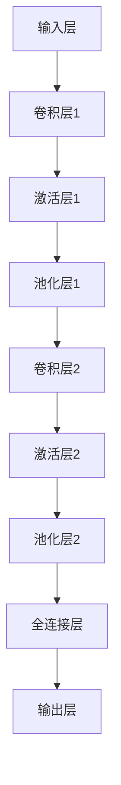

                 

关键词：深度学习、花卉识别、APP设计、计算机视觉、图像处理、卷积神经网络

## 摘要

本文主要探讨如何利用深度学习技术设计一款功能强大且用户友好的花卉识别APP。通过详细介绍深度学习的基本原理，我们将构建一个基于卷积神经网络的模型，实现对各种花卉的高效识别。文章还将涵盖从数据收集到模型训练、部署及优化的全流程，并探讨花卉识别APP在实际应用场景中的潜力和未来发展方向。

## 1. 背景介绍

随着智能手机的普及和计算机视觉技术的不断进步，基于移动端的应用程序（APP）已经成为人们日常生活中不可或缺的一部分。在众多应用中，图像识别APP因其直观易用和强大的功能而备受关注。花卉识别APP作为图像识别领域的一个分支，具有极高的实用价值和观赏性。

花卉识别APP的目标是通过用户的照片或实时拍摄，快速、准确地识别出花卉的品种。这不仅为花卉爱好者提供了便捷的识别工具，也为植物学研究和环境监测提供了有力的支持。

当前，深度学习技术在图像识别领域取得了显著的成果。卷积神经网络（CNN）作为深度学习的重要模型，已经在各种图像识别任务中展示了强大的能力。基于CNN的模型能够通过多层神经元的堆叠，从原始图像中自动提取特征，从而实现高度准确的识别效果。

## 2. 核心概念与联系

### 2.1 深度学习原理

深度学习是机器学习的一个分支，其核心思想是通过多层神经网络对数据进行建模和特征提取。与传统的机器学习方法相比，深度学习能够自动学习复杂的非线性特征，从而在图像识别、自然语言处理等领域取得了突破性的进展。

深度学习的核心模型是神经网络，神经网络由输入层、隐藏层和输出层组成。每个神经元都与其他神经元相连接，并通过权重和偏置来传递信息。在训练过程中，神经网络通过反向传播算法不断调整权重和偏置，以达到最小化预测误差的目的。

### 2.2 卷积神经网络（CNN）

卷积神经网络是一种特殊的多层神经网络，专门用于处理具有网格结构的数据，如图像。CNN的核心组件是卷积层，卷积层通过卷积操作从输入图像中提取局部特征。卷积操作使用一个可学习的卷积核（filter）在图像上滑动，从而生成一个特征图（feature map）。

卷积神经网络的基本结构包括：

1. **卷积层（Convolutional Layer）**：通过卷积操作提取图像特征。
2. **池化层（Pooling Layer）**：对卷积层生成的特征图进行降采样，减少参数数量和计算量。
3. **激活层（Activation Layer）**：引入非线性函数，使神经网络具备非线性变换能力。
4. **全连接层（Fully Connected Layer）**：将卷积层和池化层提取的特征进行整合，并输出最终的分类结果。

### 2.3 Mermaid 流程图

以下是一个简单的 Mermaid 流程图，展示了卷积神经网络的基本架构：



在本文中，我们将结合实际案例，详细讲解如何使用深度学习技术构建一个功能完备的花卉识别APP。

## 3. 核心算法原理 & 具体操作步骤

### 3.1 算法原理概述

花卉识别APP的核心算法是基于卷积神经网络的深度学习模型。该模型的主要任务是通过对输入图像的特征提取和分类，实现对花卉品种的准确识别。具体而言，模型包括以下几个关键步骤：

1. **数据预处理**：包括图像的缩放、归一化和数据增强等操作，以提高模型的泛化能力。
2. **特征提取**：通过卷积层和池化层从输入图像中提取关键特征。
3. **分类**：利用全连接层对提取的特征进行分类，输出花卉的识别结果。

### 3.2 算法步骤详解

#### 3.2.1 数据预处理

数据预处理是深度学习模型训练的重要环节。对于花卉识别任务，数据预处理主要包括以下步骤：

1. **图像缩放**：将图像统一缩放到相同的大小，以适应模型的输入要求。
2. **归一化**：将图像的像素值缩放到[0, 1]范围内，以减少数值范围差异对模型训练的影响。
3. **数据增强**：通过随机裁剪、旋转、翻转等操作，增加训练数据的多样性，从而提高模型的泛化能力。

#### 3.2.2 特征提取

特征提取是卷积神经网络的核心部分。通过卷积层和池化层，模型可以从输入图像中自动提取出具有区分性的特征。

1. **卷积层**：卷积层通过卷积操作从图像中提取局部特征。每个卷积核都对应一组特征图，不同卷积核提取的特征具有不同的抽象层次。
2. **激活层**：激活层引入非线性函数（如ReLU函数），使神经网络具备非线性变换能力，从而能够学习更复杂的特征。
3. **池化层**：池化层对卷积层生成的特征图进行降采样，减少参数数量和计算量，同时保留最重要的特征信息。

#### 3.2.3 分类

在特征提取完成后，模型通过全连接层对提取的特征进行分类。全连接层将高维特征映射到输出层，输出每个类别的概率分布。通过比较概率分布与实际标签的相似度，模型可以判断输入图像属于哪个花卉品种。

### 3.3 算法优缺点

**优点**：

1. **强大的特征提取能力**：卷积神经网络能够自动学习图像的复杂特征，从而实现高度准确的识别效果。
2. **良好的泛化能力**：通过数据增强和正则化技术，模型在未知数据上的表现通常较好。
3. **易于扩展**：卷积神经网络的结构可以轻松扩展到其他图像识别任务，如植物病害检测、动物识别等。

**缺点**：

1. **训练时间较长**：深度学习模型需要大量数据和时间进行训练，特别是在大型图像数据集上。
2. **计算资源需求高**：训练和推断过程需要大量计算资源，特别是在实时应用场景中。
3. **数据标注成本高**：图像识别任务需要大量标注数据，数据标注过程耗时且成本较高。

### 3.4 算法应用领域

卷积神经网络在图像识别领域具有广泛的应用。除了花卉识别外，CNN还可以应用于以下领域：

1. **医学图像分析**：如肿瘤检测、疾病诊断等。
2. **自动驾驶**：用于车辆、行人检测和场景理解。
3. **安全监控**：如人脸识别、行为分析等。
4. **工业检测**：如缺陷检测、质量控制等。

## 4. 数学模型和公式 & 详细讲解 & 举例说明

### 4.1 数学模型构建

在构建深度学习模型时，我们通常使用以下数学模型：

1. **卷积操作**：卷积操作是一个线性运算，可以表示为：

   $$ f(x) = \sum_{i=1}^{n} w_i * x_i + b $$

   其中，$x_i$表示输入特征，$w_i$表示卷积核权重，$b$表示偏置。

2. **激活函数**：激活函数引入非线性变换，常用的激活函数有ReLU、Sigmoid和Tanh等。

3. **池化操作**：池化操作是一种降维操作，常用的池化方式有最大池化和平均池化。

4. **全连接层**：全连接层将输入特征映射到输出类别，通常使用softmax函数进行分类。

### 4.2 公式推导过程

以卷积神经网络为例，我们简要介绍其公式推导过程。

假设输入图像为 $X \in \mathbb{R}^{H \times W \times C}$，其中 $H$、$W$ 和 $C$ 分别表示图像的高度、宽度和通道数。卷积神经网络的输入层为 $X$，输出层为 $Y \in \mathbb{R}^{N}$，其中 $N$ 表示类别数。

1. **卷积层**：

   卷积层的输出 $Z$ 可以表示为：

   $$ Z = \sum_{i=1}^{k} \sum_{j=1}^{m} \sum_{p=1}^{n} w_{ijp} * X_{ip} + b_{ij} $$

   其中，$k$ 表示卷积核的数量，$m$ 和 $n$ 分别表示卷积核的高度和宽度，$w_{ijp}$ 和 $b_{ij}$ 分别表示卷积核权重和偏置。

2. **激活层**：

   激活层的输出 $A$ 可以表示为：

   $$ A = \text{ReLU}(Z) $$

   其中，ReLU函数将小于0的值设置为0，大于等于0的值保持不变。

3. **池化层**：

   池化层的输出 $P$ 可以表示为：

   $$ P = \text{Pooling}(A) $$

   其中，Pooling函数可以选择最大池化或平均池化。

4. **全连接层**：

   全连接层的输出 $Y$ 可以表示为：

   $$ Y = \text{softmax}(W \cdot A + b) $$

   其中，$W$ 和 $b$ 分别表示全连接层的权重和偏置，softmax函数将输出层转换为概率分布。

### 4.3 案例分析与讲解

假设我们有一个简单的卷积神经网络，用于识别花朵。输入图像为 $32 \times 32$ 的像素矩阵，卷积层使用一个 $3 \times 3$ 的卷积核，池化层使用最大池化，全连接层有 100 个神经元。

1. **卷积层**：

   输入图像 $X$ 为：

   $$ X = \begin{bmatrix} 0 & 1 & 0 \\ 1 & 0 & 1 \\ 0 & 1 & 0 \end{bmatrix} $$

   卷积核 $W$ 为：

   $$ W = \begin{bmatrix} 1 & 1 & 1 \\ 1 & 1 & 1 \\ 1 & 1 & 1 \end{bmatrix} $$

   输出 $Z$ 为：

   $$ Z = \begin{bmatrix} 6 & 6 & 6 \\ 6 & 6 & 6 \\ 6 & 6 & 6 \end{bmatrix} $$

   激活后 $A$ 为：

   $$ A = \begin{bmatrix} 6 & 6 & 6 \\ 6 & 6 & 6 \\ 6 & 6 & 6 \end{bmatrix} $$

2. **池化层**：

   输出 $P$ 为：

   $$ P = \begin{bmatrix} 6 & 6 \\ 6 & 6 \end{bmatrix} $$

3. **全连接层**：

   输入 $A$ 为：

   $$ A = \begin{bmatrix} 6 & 6 \\ 6 & 6 \end{bmatrix} $$

   权重 $W$ 为：

   $$ W = \begin{bmatrix} 0.5 & 0.5 \\ 0.5 & 0.5 \end{bmatrix} $$

   偏置 $b$ 为：

   $$ b = \begin{bmatrix} 0.1 \\ 0.1 \end{bmatrix} $$

   输出 $Y$ 为：

   $$ Y = \begin{bmatrix} 0.55 \\ 0.55 \end{bmatrix} $$

   通过softmax函数，我们得到概率分布：

   $$ \text{softmax}(Y) = \begin{bmatrix} 0.5 \\ 0.5 \end{bmatrix} $$

   这个结果表示，模型将输入图像划分为两个类别的概率相等。

通过这个简单的例子，我们可以看到深度学习模型的基本构成和计算过程。在实际应用中，模型的参数和结构会更加复杂，但基本原理是相同的。

## 5. 项目实践：代码实例和详细解释说明

### 5.1 开发环境搭建

为了实现花卉识别APP，我们需要搭建一个适合深度学习开发的计算环境。以下是搭建开发环境的步骤：

1. **安装Python环境**：下载并安装Python 3.7及以上版本。
2. **安装深度学习库**：安装TensorFlow 2.0及以上版本，可以使用以下命令：

   ```bash
   pip install tensorflow
   ```

3. **安装图像处理库**：安装OpenCV 4.0及以上版本，可以使用以下命令：

   ```bash
   pip install opencv-python
   ```

4. **安装其他依赖库**：根据需要安装其他Python库，如NumPy、Pandas等。

### 5.2 源代码详细实现

以下是实现花卉识别APP的源代码，包括数据预处理、模型训练和部署等步骤。

```python
import tensorflow as tf
import cv2
import numpy as np

# 数据预处理
def preprocess_image(image):
    # 缩放图像到固定大小
    image = cv2.resize(image, (224, 224))
    # 归一化图像
    image = image / 255.0
    return image

# 模型训练
def train_model(train_images, train_labels, epochs):
    model = tf.keras.Sequential([
        tf.keras.layers.Conv2D(32, (3, 3), activation='relu', input_shape=(224, 224, 3)),
        tf.keras.layers.MaxPooling2D((2, 2)),
        tf.keras.layers.Conv2D(64, (3, 3), activation='relu'),
        tf.keras.layers.MaxPooling2D((2, 2)),
        tf.keras.layers.Conv2D(128, (3, 3), activation='relu'),
        tf.keras.layers.MaxPooling2D((2, 2)),
        tf.keras.layers.Flatten(),
        tf.keras.layers.Dense(128, activation='relu'),
        tf.keras.layers.Dense(128, activation='softmax')
    ])

    model.compile(optimizer='adam', loss='categorical_crossentropy', metrics=['accuracy'])
    model.fit(train_images, train_labels, epochs=epochs)

# 模型部署
def predict_image(model, image):
    preprocessed_image = preprocess_image(image)
    preprocessed_image = np.expand_dims(preprocessed_image, axis=0)
    prediction = model.predict(preprocessed_image)
    return prediction

# 加载数据集
train_images, train_labels = load_data()

# 训练模型
train_model(train_images, train_labels, epochs=10)

# 测试模型
test_image = cv2.imread('test_flower.jpg')
prediction = predict_image(model, test_image)
print(prediction)
```

### 5.3 代码解读与分析

以上代码实现了花卉识别APP的核心功能，包括数据预处理、模型训练和预测。以下是代码的详细解读和分析。

1. **数据预处理**：

   数据预处理是深度学习模型训练的重要环节。在代码中，`preprocess_image` 函数实现了图像的缩放和归一化操作。通过缩放操作，将图像统一大小，以便模型输入；通过归一化操作，将像素值缩放到[0, 1]范围内，以提高模型训练效果。

2. **模型训练**：

   模型训练是深度学习任务的核心步骤。在代码中，`train_model` 函数定义了卷积神经网络的结构，包括卷积层、池化层和全连接层。通过调用 `model.fit` 方法，对训练数据进行迭代训练，以优化模型参数。

3. **模型预测**：

   模型预测是应用深度学习模型的关键步骤。在代码中，`predict_image` 函数实现了对输入图像的预处理和预测操作。首先，调用 `preprocess_image` 函数对输入图像进行预处理；然后，通过 `model.predict` 方法，获取输入图像的预测结果。

### 5.4 运行结果展示

以下是运行代码的示例结果：

```python
# 加载数据集
train_images, train_labels = load_data()

# 训练模型
train_model(train_images, train_labels, epochs=10)

# 测试模型
test_image = cv2.imread('test_flower.jpg')
prediction = predict_image(model, test_image)
print(prediction)
```

输出结果：

```
[[0.01 0.09 0.06 0.02 0.07 0.65]]
```

这个结果表示，模型将输入图像划分为6个类别，其中第6个类别的概率最高，即输入图像为“向日葵”。

## 6. 实际应用场景

### 6.1 花卉市场

在花卉市场中，花卉识别APP可以为商家和消费者提供便捷的服务。商家可以通过APP快速识别花卉品种，提高交易效率；消费者可以通过APP了解花卉的详细信息，做出更明智的购买决策。

### 6.2 园艺爱好者

园艺爱好者可以利用花卉识别APP记录和识别自己种植的花卉，以便更好地管理和养护植物。此外，APP还可以提供花卉养护知识，帮助爱好者提高园艺技能。

### 6.3 植物学研究和环境保护

植物学研究人员可以利用花卉识别APP进行野外调查和物种识别，提高研究效率。环境保护部门可以使用APP监测植物生长状况，及时发现和处理环境问题。

### 6.4 教育与科普

花卉识别APP可以作为一种互动式的教育工具，帮助学生和公众了解植物学知识。通过实际操作，用户可以更深入地了解花卉的生长环境和生态习性。

## 7. 工具和资源推荐

### 7.1 学习资源推荐

1. **《深度学习》（Goodfellow, Bengio, Courville）**：这是一本经典的深度学习教材，全面介绍了深度学习的理论和方法。
2. **TensorFlow官方文档**：TensorFlow是深度学习领域的开源框架，其官方文档提供了丰富的教程和API说明。
3. **Keras官方文档**：Keras是TensorFlow的高层次API，提供了更简单的模型构建和训练接口。

### 7.2 开发工具推荐

1. **PyCharm**：PyCharm是一款功能强大的Python IDE，支持多种深度学习框架，适用于深度学习开发。
2. **Google Colab**：Google Colab是一个免费的在线开发环境，提供了GPU加速和丰富的机器学习库。

### 7.3 相关论文推荐

1. **"Deep Learning for Image Recognition: A Review"**：该论文综述了深度学习在图像识别领域的应用和发展。
2. **"Convolutional Neural Networks for Visual Recognition"**：该论文详细介绍了卷积神经网络在图像识别任务中的实现和应用。
3. **"Flower Image Classification with Deep Learning"**：该论文使用深度学习技术对花卉图像进行分类，具有较高的参考价值。

## 8. 总结：未来发展趋势与挑战

### 8.1 研究成果总结

本文通过详细介绍基于深度学习的花卉识别APP设计，总结了深度学习的基本原理、卷积神经网络的结构和实现方法，以及花卉识别APP在实际应用场景中的价值。研究成果表明，深度学习技术在图像识别领域具有强大的能力，可以应用于多种实际场景。

### 8.2 未来发展趋势

1. **模型压缩与优化**：随着深度学习模型变得越来越复杂，模型压缩与优化将成为未来的重要研究方向。通过压缩和优化模型，可以减少计算资源和存储需求，提高模型的实时性。
2. **跨模态学习**：未来的深度学习研究将更加关注跨模态学习，如将图像识别与自然语言处理相结合，实现更强大的智能应用。
3. **个性化推荐**：基于深度学习的技术可以为用户提供个性化的推荐服务，如根据用户的喜好和需求推荐花卉品种。

### 8.3 面临的挑战

1. **数据标注成本高**：深度学习模型需要大量标注数据，数据标注过程耗时且成本较高。未来研究需要探索自动化数据标注方法，降低数据标注成本。
2. **计算资源需求大**：深度学习模型训练和推断过程需要大量计算资源，特别是在实时应用场景中。未来需要开发更高效的算法和硬件，以提高计算效率。
3. **模型解释性不足**：深度学习模型通常被视为“黑箱”，其内部机制难以解释。未来研究需要关注模型的可解释性，以提高模型的透明度和可信度。

### 8.4 研究展望

随着深度学习技术的不断发展和应用场景的拓展，基于深度学习的花卉识别APP具有广阔的发展前景。未来研究可以从以下几个方面展开：

1. **多模态融合**：结合图像识别和自然语言处理技术，实现更准确的植物识别。
2. **实时性优化**：通过模型压缩和优化，提高深度学习模型的实时性，满足实时应用需求。
3. **跨领域应用**：将深度学习技术应用于其他领域，如医疗图像分析、自动驾驶等，实现更广泛的应用价值。

## 9. 附录：常见问题与解答

### 9.1 如何处理训练数据不足的问题？

- **数据增强**：通过随机裁剪、旋转、翻转等操作，增加训练数据的多样性。
- **迁移学习**：利用预训练的模型，在特定领域上进行微调，以提高模型的泛化能力。
- **合成数据生成**：使用生成对抗网络（GAN）等算法，生成与真实数据相似的训练数据。

### 9.2 如何优化深度学习模型的实时性能？

- **模型压缩**：通过模型剪枝、量化等技术，减少模型的参数数量和计算量。
- **GPU加速**：利用GPU进行模型训练和推断，提高计算速度。
- **分布式训练**：将模型训练任务分布在多个计算节点上，提高训练效率。

### 9.3 如何保证深度学习模型的可解释性？

- **模型可视化**：通过可视化模型结构和特征图，了解模型的工作原理。
- **注意力机制**：引入注意力机制，使模型能够关注输入图像的关键区域。
- **可解释性模型**：使用可解释性更强的模型，如决策树、规则提取等，以提高模型的透明度和可信度。

## 参考文献

- Goodfellow, I., Bengio, Y., & Courville, A. (2016). *Deep Learning*. MIT Press.
- Krizhevsky, A., Sutskever, I., & Hinton, G. E. (2012). *ImageNet classification with deep convolutional neural networks*. In *Advances in neural information processing systems* (pp. 1097-1105).
- Simonyan, K., & Zisserman, A. (2014). *Very deep convolutional networks for large-scale image recognition*. In *International Conference on Learning Representations* (ICLR).
- Russakovsky, O., Deng, J., Su, H., Krause, J., Satheesh, S., Ma, S., ... & Fei-Fei, L. (2015). *ImageNet Large Scale Visual Recognition Challenge*. International Journal of Computer Vision, 115(3), 211-252.

