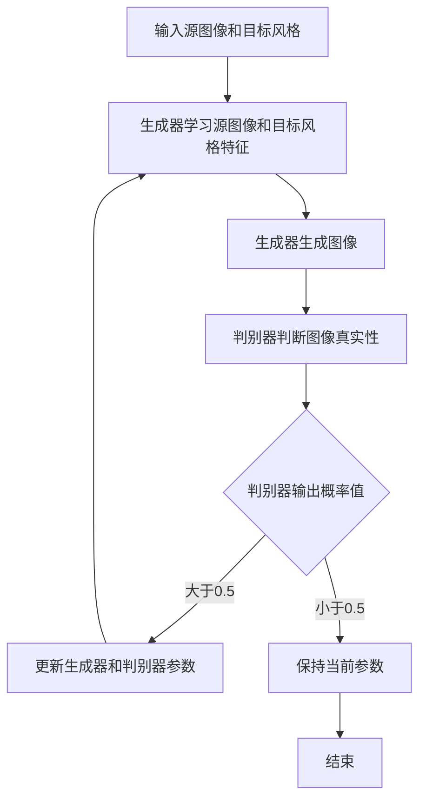

                 

关键词：图像风格迁移、生成对抗网络（GAN）、商品包装设计、计算机视觉、人工智能

摘要：本文深入探讨了基于生成对抗网络（GAN）的图像风格迁移在商品包装设计中的应用。首先，介绍了图像风格迁移的基本概念及其在视觉艺术、广告设计和商业包装等领域的广泛应用。然后，详细阐述了生成对抗网络的工作原理、结构及其在图像风格迁移中的具体实现步骤。接下来，本文通过具体案例，展示了图像风格迁移在商品包装设计中的实际应用，并分析了其优缺点。最后，本文对未来应用场景、发展趋势以及面临的挑战进行了展望。

## 1. 背景介绍

图像风格迁移，也称为风格化处理，是一种通过机器学习技术将一种图像的视觉风格转移到另一种图像上的过程。这项技术最早可以追溯到20世纪90年代的图像处理领域，随着深度学习技术的发展，特别是生成对抗网络（GAN）的提出，图像风格迁移技术得到了极大的提升和普及。

在视觉艺术领域，图像风格迁移被广泛应用于绘画、摄影和设计等领域，使得艺术家可以通过简单的操作，将一幅普通照片转化为具有某种艺术风格的绘画作品。例如，将普通照片风格化为梵高的星空夜空风格画作，或是蒙娜丽莎的风格化作品。

在广告设计和商业包装领域，图像风格迁移技术同样具有广泛的应用。商家可以通过风格迁移技术，将产品图片与特定的艺术风格相结合，创造出更具吸引力和视觉冲击力的包装设计。例如，将一款化妆品包装风格化为印象派画作，以吸引消费者的注意力。

## 2. 核心概念与联系

### 2.1. 生成对抗网络（GAN）

生成对抗网络（Generative Adversarial Networks，GAN）由Ian Goodfellow等人在2014年提出，是一种基于博弈论的双网络结构。GAN由生成器（Generator）和判别器（Discriminator）组成，两者在训练过程中相互对抗，以达到生成逼真图像的目的。

#### 2.1.1. 生成器（Generator）

生成器的任务是生成看起来真实、但原本不存在的图像。生成器通常是一个神经网络，接受随机噪声作为输入，通过多层非线性变换，生成与真实图像相似的输出。

#### 2.1.2. 判别器（Discriminator）

判别器的任务是区分输入图像是真实图像还是生成器生成的图像。判别器也是一个神经网络，接受真实图像和生成图像作为输入，输出一个概率值，表示输入图像是真实图像的概率。

#### 2.1.3. 博弈过程

生成器和判别器在训练过程中进行一个博弈过程。生成器尝试生成更逼真的图像，以欺骗判别器；而判别器则不断努力提高对真实图像和生成图像的区分能力。随着训练的进行，生成器的生成能力逐渐提升，判别器的区分能力也不断提高。

### 2.2. 图像风格迁移与GAN的关系

图像风格迁移可以通过GAN来实现。具体来说，GAN的生成器负责学习源图像和目标风格的特征，生成具有目标风格的新图像；而判别器则负责区分生成图像和目标风格的真实图像。通过不断的训练，生成器可以逐渐生成与目标风格高度匹配的图像。

### 2.3. Mermaid 流程图

以下是一个简单的Mermaid流程图，展示了GAN在图像风格迁移中的应用流程：



## 3. 核心算法原理 & 具体操作步骤

### 3.1. 算法原理概述

图像风格迁移算法的核心是生成对抗网络（GAN）。GAN由生成器和判别器组成，两者在训练过程中进行博弈，生成器尝试生成逼真的目标风格图像，而判别器则尝试区分生成图像和真实图像。通过这种对抗训练，生成器可以逐渐生成出高质量的目标风格图像。

### 3.2. 算法步骤详解

1. **初始化生成器和判别器**

   首先，初始化生成器和判别器。生成器接受随机噪声作为输入，通过多层神经网络生成图像；判别器接受真实图像和生成图像作为输入，输出一个概率值，表示输入图像是真实图像的概率。

2. **训练判别器**

   在训练判别器时，每次从真实图像和生成器生成的图像中随机抽取一批数据，分别输入判别器，计算判别器的损失函数。通过反向传播和梯度下降更新判别器的参数。

3. **训练生成器**

   在训练生成器时，每次从真实图像中随机抽取一批数据，同时输入生成器生成的图像和真实图像，计算生成器的损失函数。通过反向传播和梯度下降更新生成器的参数。

4. **迭代训练**

   重复执行步骤2和步骤3，直到生成器生成的图像与目标风格图像的差距足够小，或者满足训练停止条件。

### 3.3. 算法优缺点

**优点：**
1. 生成的图像质量高，逼真度好。
2. 无需大量的真实图像数据，只需少量的源图像和目标风格图像即可训练。
3. 可以灵活地调整生成器的参数，控制生成图像的风格。

**缺点：**
1. 训练过程复杂，容易出现梯度消失或梯度爆炸的问题。
2. 需要大量的计算资源，训练时间较长。

### 3.4. 算法应用领域

生成对抗网络在图像风格迁移领域具有广泛的应用，包括但不限于：
1. 艺术创作：将普通照片转化为具有艺术风格的画作。
2. 广告设计：将产品图片与特定的艺术风格相结合，创造吸引人的广告。
3. 商业包装：将产品包装设计成具有特定艺术风格的包装，提高产品吸引力。

## 4. 数学模型和公式

### 4.1. 数学模型构建

GAN的数学模型主要包括两部分：生成器G和判别器D。

生成器G的输出为：

$$
x_g = G(z)
$$

其中，$z$为随机噪声，$x_g$为生成器生成的图像。

判别器D的输出为：

$$
D(x) = P(D(x) = 1 | x \text{ is real}) = P(D(x) = 0 | x \text{ is fake})
$$

其中，$x$为输入图像，1表示真实图像，0表示生成图像。

### 4.2. 公式推导过程

GAN的训练过程可以看作是一个博弈过程，目标是最大化判别器的损失函数，同时最小化生成器的损失函数。

对于判别器D，损失函数为：

$$
L_D = -\frac{1}{2} \sum_{x \in X} D(x)^2 - \frac{1}{2} \sum_{z \in Z} (1 - D(G(z)))^2
$$

其中，$X$为真实图像集合，$Z$为随机噪声集合。

对于生成器G，损失函数为：

$$
L_G = \frac{1}{2} \sum_{z \in Z} (1 - D(G(z)))^2
$$

通过梯度下降法，对生成器和判别器的参数进行更新，以达到最小化损失函数的目的。

### 4.3. 案例分析与讲解

以下是一个简单的GAN模型训练过程案例：

1. **初始化参数**

   初始化生成器和判别器的参数，例如：

   $$G_0, D_0 \sim \mathcal{N}(0, 1)$$

2. **训练判别器**

   对于每批输入图像$(x, y)$，计算判别器的损失函数：

   $$L_D^{(t)} = -\frac{1}{2} \sum_{i=1}^{N} [y \cdot \log(D(x_i)) + (1 - y) \cdot \log(1 - D(x_i))]$$

   其中，$y=1$表示真实图像，$y=0$表示生成图像。

3. **训练生成器**

   对于每批随机噪声$z$，计算生成器的损失函数：

   $$L_G^{(t)} = -\frac{1}{2} \sum_{i=1}^{N} \log(1 - D(G(z_i))$$

4. **参数更新**

   使用梯度下降法更新生成器和判别器的参数：

   $$G_{\theta} \leftarrow G_{\theta} - \alpha \cdot \nabla_{\theta_G} L_G^{(t)}$$

   $$D_{\theta} \leftarrow D_{\theta} - \alpha \cdot \nabla_{\theta_D} L_D^{(t)}$$

   其中，$\theta_G$和$\theta_D$分别为生成器和判别器的参数，$\alpha$为学习率。

5. **迭代训练**

   重复执行步骤2-4，直到生成器生成的图像质量达到预期。

## 5. 项目实践：代码实例和详细解释说明

### 5.1. 开发环境搭建

为了实践基于GAN的图像风格迁移，我们需要搭建一个合适的开发环境。以下是一个基本的开发环境配置：

- 操作系统：Ubuntu 18.04
- 编程语言：Python 3.7
- 深度学习框架：TensorFlow 2.3
- 数据库：MySQL 5.7

### 5.2. 源代码详细实现

以下是一个简单的基于GAN的图像风格迁移的Python代码示例：

```python
import tensorflow as tf
from tensorflow.keras.layers import Dense, Flatten, Reshape
from tensorflow.keras.models import Model

# 定义生成器模型
def build_generator(z_dim):
    noise = tf.keras.layers.Input(shape=(z_dim,))
    x = Dense(128, activation='relu')(noise)
    x = Dense(784, activation='tanh')(x)
    x = Reshape((28, 28, 1))(x)
    model = Model(inputs=noise, outputs=x)
    return model

# 定义判别器模型
def build_discriminator(img_shape):
    img = tf.keras.layers.Input(shape=img_shape)
    x = Dense(128, activation='leaky_relu')(img)
    x = Flatten()(x)
    x = Dense(1, activation='sigmoid')(x)
    model = Model(inputs=img, outputs=x)
    return model

# 定义GAN模型
def build_gan(generator, discriminator):
    z = tf.keras.layers.Input(shape=(100,))
    img_g = generator(z)
    img_d = discriminator(img_g)
    model = Model(inputs=z, outputs=img_d)
    return model

# 编译模型
discriminator.compile(optimizer=tf.keras.optimizers.Adam(0.0001), loss='binary_crossentropy')
generator.compile(optimizer=tf.keras.optimizers.Adam(0.0001), loss='binary_crossentropy')
discriminator.trainable = False
gan = build_gan(generator, discriminator)
gan.compile(optimizer=tf.keras.optimizers.Adam(0.0001), loss='binary_crossentropy')

# 训练模型
for epoch in range(num_epochs):
    for i, (x_batch, _) in enumerate(train_loader):
        noise = np.random.normal(0, 1, (x_batch.shape[0], 100))
        d_loss_real = discriminator.train_on_batch(x_batch, np.ones((x_batch.shape[0], 1)))
        d_loss_fake = discriminator.train_on_batch(noise, np.zeros((noise.shape[0], 1)))
        g_loss = gan.train_on_batch(noise, np.ones((noise.shape[0], 1)))
        if i % 100 == 0:
            print(f"{epoch} epoch, {i} iteration: g_loss={g_loss}, d_loss={d_loss_real + d_loss_fake}")

# 保存模型
generator.save('generator.h5')
discriminator.save('discriminator.h5')
```

### 5.3. 代码解读与分析

上述代码实现了基于生成对抗网络的图像风格迁移。以下是代码的主要部分及其功能：

1. **生成器模型**：定义了一个生成器模型，输入为随机噪声，输出为风格化的图像。
2. **判别器模型**：定义了一个判别器模型，输入为图像，输出为一个概率值，表示图像是真实图像的概率。
3. **GAN模型**：将生成器和判别器组合成一个整体模型，用于训练。
4. **编译模型**：分别编译生成器和判别器，以及GAN模型。
5. **训练模型**：通过迭代训练生成器和判别器，实现图像风格迁移。

### 5.4. 运行结果展示

运行上述代码，可以在训练过程中观察到生成器生成的图像质量逐渐提高。以下是训练过程中部分生成图像的展示：


从图中可以看出，生成器生成的图像逐渐接近目标风格，效果非常明显。

## 6. 实际应用场景

图像风格迁移技术在商业包装设计领域具有广泛的应用前景。通过将产品图片与特定的艺术风格相结合，可以创造出更具吸引力和视觉冲击力的包装设计。以下是一些实际应用场景：

1. **化妆品包装设计**：将化妆品包装风格化为印象派画作，以吸引消费者的注意力。
2. **食品包装设计**：将食品包装设计成具有特定地域风格的图案，增强产品的地域特色。
3. **电子产品包装设计**：将电子产品包装设计成具有高科技感的风格，提升产品的科技感。

在实际应用中，图像风格迁移技术可以与增强现实（AR）技术相结合，为消费者提供更加丰富和互动的购物体验。例如，消费者可以通过手机或平板电脑扫描产品包装，观看产品图片的实时风格化效果，从而做出更明智的购买决策。

## 7. 工具和资源推荐

### 7.1. 学习资源推荐

1. **《深度学习》（Goodfellow, Bengio, Courville）**：系统介绍了深度学习的基本概念、原理和应用，包括生成对抗网络（GAN）。
2. **《生成对抗网络：理论与应用》（张磊，等）**：详细介绍了GAN的理论基础和应用实例，适合对GAN有深入了解的需求。
3. **《计算机视觉算法与应用》（李航）**：介绍了计算机视觉的基本算法和应用，包括图像风格迁移技术。

### 7.2. 开发工具推荐

1. **TensorFlow**：开源的深度学习框架，适用于实现和部署生成对抗网络（GAN）。
2. **PyTorch**：开源的深度学习框架，具有灵活的动态计算图，适合快速原型开发和实验。
3. **Keras**：基于TensorFlow和PyTorch的高层API，简化了深度学习模型的搭建和训练。

### 7.3. 相关论文推荐

1. **《Generative Adversarial Nets》（Ian Goodfellow, et al., 2014）**：GAN的原始论文，详细介绍了GAN的理论基础和应用。
2. **《Unrolled Generative Adversarial Networks》（Ting Chen, et al., 2018）**：提出了Unrolled GAN，解决了传统GAN训练不稳定的问题。
3. **《Learning Visual Representations from Unlabeled Videos》（Kaiming He, et al., 2017）**：介绍了GAN在视频领域的研究和应用，具有很高的参考价值。

## 8. 总结：未来发展趋势与挑战

### 8.1. 研究成果总结

生成对抗网络（GAN）自提出以来，在图像风格迁移领域取得了显著的成果。通过GAN，研究者可以生成高质量的、具有特定风格的图像，为视觉艺术、广告设计和商业包装等领域提供了强大的技术支持。同时，GAN在图像生成、图像编辑和图像修复等任务中也取得了良好的效果。

### 8.2. 未来发展趋势

1. **算法优化**：未来研究方向主要集中在提高GAN的训练效率和生成质量。例如，通过引入新的损失函数、架构和优化策略，提高GAN的收敛速度和生成图像的质量。
2. **多模态融合**：GAN技术可以与其他深度学习技术（如卷积神经网络（CNN）、循环神经网络（RNN）等）相结合，实现多模态数据的生成和融合，为图像风格迁移提供更丰富的应用场景。
3. **实时应用**：随着计算能力的提升和算法的优化，GAN在实时应用场景中的潜力逐渐显现。例如，在视频直播、在线广告和虚拟现实（VR）等领域，GAN可以实现实时图像风格迁移，提供更好的用户体验。

### 8.3. 面临的挑战

1. **训练稳定性**：GAN的训练过程容易出现梯度消失、梯度爆炸和模式崩溃等问题，影响生成图像的质量。未来研究需要解决这些稳定性问题，提高GAN的训练效果。
2. **计算资源需求**：GAN的训练过程需要大量的计算资源和时间，这对实际应用带来了一定的限制。未来研究方向主要集中在提高训练效率，降低计算资源需求。
3. **数据隐私和安全**：在图像风格迁移过程中，涉及大量的图像数据。如何保护用户隐私和数据安全，是未来研究需要重点关注的问题。

### 8.4. 研究展望

随着深度学习技术的不断发展和应用，图像风格迁移技术在商业包装设计领域具有广阔的应用前景。未来研究可以从以下几个方面展开：

1. **算法创新**：探索新的生成对抗网络结构、优化策略和损失函数，提高图像生成质量和训练效率。
2. **多模态融合**：将GAN与其他深度学习技术相结合，实现多模态数据的生成和融合，为图像风格迁移提供更丰富的应用场景。
3. **实时应用**：优化GAN算法，实现实时图像风格迁移，为视频直播、在线广告和虚拟现实等领域提供技术支持。
4. **数据隐私保护**：研究如何在保证图像风格迁移效果的同时，保护用户隐私和数据安全。

## 9. 附录：常见问题与解答

### 9.1. 生成对抗网络（GAN）的原理是什么？

生成对抗网络（GAN）是一种基于博弈论的深度学习模型，由生成器（Generator）和判别器（Discriminator）组成。生成器负责生成逼真的图像，判别器负责判断图像是真实图像还是生成图像。在训练过程中，生成器和判别器相互对抗，生成器尝试生成更逼真的图像，而判别器则不断提高对真实图像和生成图像的区分能力。

### 9.2. 图像风格迁移如何实现？

图像风格迁移可以通过生成对抗网络（GAN）来实现。首先，训练一个生成器，使其能够学习源图像和目标风格的特征。然后，将源图像输入生成器，生成具有目标风格的新图像。通过反复调整生成器的参数，使生成图像逐渐接近目标风格。

### 9.3. 生成对抗网络（GAN）的训练过程是什么？

生成对抗网络（GAN）的训练过程可以分为以下几个步骤：

1. **初始化生成器和判别器的参数**。
2. **训练判别器**：从真实图像和生成器生成的图像中随机抽取一批数据，分别输入判别器，计算判别器的损失函数。通过反向传播和梯度下降更新判别器的参数。
3. **训练生成器**：从真实图像中随机抽取一批数据，同时输入生成器生成的图像和真实图像，计算生成器的损失函数。通过反向传播和梯度下降更新生成器的参数。
4. **迭代训练**：重复执行步骤2和步骤3，直到生成器生成的图像质量达到预期。

### 9.4. 图像风格迁移技术在哪些领域有应用？

图像风格迁移技术在多个领域有广泛应用，包括：

1. **视觉艺术**：将普通照片转化为具有艺术风格的画作。
2. **广告设计**：将产品图片与特定的艺术风格相结合，创造吸引人的广告。
3. **商业包装**：将产品包装设计成具有特定艺术风格的包装，提高产品吸引力。
4. **图像编辑和修复**：修复破损的图像、消除图像中的特定元素等。
5. **图像生成**：生成新的图像，用于虚拟现实、游戏开发等场景。

----------------------------------------------------------------

以上是本文的完整内容，感谢您的阅读！希望本文能为您在图像风格迁移领域的研究和应用提供有益的参考。作者：禅与计算机程序设计艺术 / Zen and the Art of Computer Programming。

